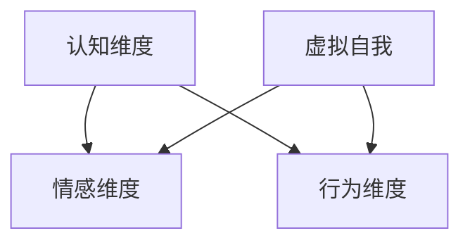
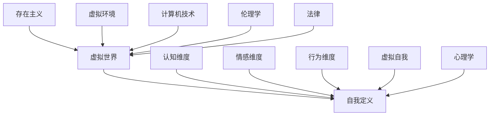

                 


### 数字时代的存在主义：虚拟世界中的自我定义

**关键词：** 虚拟世界，存在主义，自我定义，道德困境，心理学应用

**摘要：** 随着数字时代的到来，虚拟世界日益成为人类生活的重要部分。在这个虚拟的空间中，人们面临着如何定义自我的问题。本文将探讨数字时代中的存在主义，分析虚拟世界对自我定义带来的挑战，并从哲学、心理学和法律等多个角度提出解决策略。

## 目录大纲

### 1. 引言

#### 1.1 问题背景

##### 1.1.1 数字时代的来临

##### 1.1.2 虚拟世界的兴起

##### 1.1.3 存在主义的探讨

#### 1.2 问题描述

##### 1.2.1 虚拟世界中的人性问题

##### 1.2.2 自我定义的困惑与挑战

##### 1.2.3 跨越现实与虚拟的边界

#### 1.3 问题解决

##### 1.3.1 存在主义的理论框架

##### 1.3.2 虚拟世界中的道德困境

##### 1.3.3 心理学在虚拟世界中的应用

#### 1.4 边界与外延

##### 1.4.1 虚拟世界与现实生活的交融

##### 1.4.2 虚拟自我与真实自我的辨析

##### 1.4.3 未来发展的思考

### 1.5 本章小结

---

### 2. 核心概念与联系

#### 2.1 存在主义基础理论

##### 2.1.1 存在主义的历史发展

##### 2.1.2 主要存在主义哲学家的观点

#### 2.2 虚拟世界的概念

##### 2.2.1 虚拟世界的定义

##### 2.2.2 虚拟世界的技术支撑

#### 2.3 自我定义的理论探讨

##### 2.3.1 自我定义的多维度解析

##### 2.3.2 自我定义的心理学分析

##### 2.3.3 虚拟世界中的自我重塑

#### 2.4 核心概念关系图

---

### 3. 数字时代的道德困境

#### 3.1 道德困境的案例分析

##### 3.1.1 虚拟暴力与网络霸凌

##### 3.1.2 虚拟财产的归属权

##### 3.1.3 虚拟世界的隐私保护

#### 3.2 存在主义视角下的道德困境

##### 3.2.1 自由意志与道德责任

##### 3.2.2 真实自我与虚拟自我的冲突

##### 3.2.3 社会责任与个体权利的平衡

#### 3.3 法律与伦理的框架构建

##### 3.3.1 虚拟世界中的法律挑战

##### 3.3.2 伦理规范的制定与实施

##### 3.3.3 国际合作与协调

#### 3.4 道德困境的解决策略

##### 3.4.1 社会教育的作用

##### 3.4.2 技术手段的改进

##### 3.4.3 法规政策的完善

---

### 4. 心理学在虚拟世界中的应用

#### 4.1 虚拟环境下的心理学特点

##### 4.1.1 虚拟现实技术的心理学效应

##### 4.1.2 虚拟社交网络的心理影响

##### 4.1.3 虚拟游戏的心理机制

#### 4.2 心理干预与治疗

##### 4.2.1 虚拟现实在心理治疗中的应用

##### 4.2.2 在线心理咨询与治疗

##### 4.2.3 心理评估与诊断技术

#### 4.3 心理健康促进

##### 4.3.1 虚拟世界的社交支持系统

##### 4.3.2 虚拟现实在教育中的心理健康应用

##### 4.3.3 企业心理健康管理

#### 4.4 心理学的未来发展趋势

##### 4.4.1 虚拟世界的心理研究新领域

##### 4.4.2 跨学科合作与新兴技术

##### 4.4.3 心理健康服务的创新模式

---

### 5. 虚拟世界中的自我重塑

#### 5.1 虚拟自我与真实自我的互动

##### 5.1.1 虚拟自我塑造的机制

##### 5.1.2 虚拟自我与现实自我的关系

##### 5.1.3 虚拟自我对现实自我影响的研究

#### 5.2 自我定义的策略与技巧

##### 5.2.1 虚拟世界中的自我提升

##### 5.2.2 自我反思与自我接纳

##### 5.2.3 虚拟自我与真实自我的平衡

---

### 6. 结论

---

### 7. 最佳实践 tips、小结、注意事项、拓展阅读

---

本文将逐步探讨数字时代中的存在主义，分析虚拟世界对人类自我定义的影响，并从不同角度提出解决方案。接下来，我们将分章节深入探讨这一问题。

---

### 1. 引言

#### 1.1 问题背景

##### 1.1.1 数字时代的来临

随着互联网的普及和移动设备的广泛使用，我们正处于一个数字化的时代。在这个时代，数字技术已经深入到我们生活的方方面面，从工作到娱乐，从购物到社交，数字技术无处不在。这种数字化变革不仅改变了我们的生活方式，也改变了我们的思维方式。人们逐渐习惯于在虚拟世界中寻找存在感和认同感。

##### 1.1.2 虚拟世界的兴起

虚拟世界是数字时代的一个典型产物。它通过电脑、手机等设备模拟出一个与现实世界平行的空间，让人们可以在其中进行各种活动，如游戏、社交、购物等。虚拟世界不仅提供了无限的想象空间，也带来了一系列新的社会问题，如网络暴力、虚拟财产纠纷、隐私泄露等。这些问题迫使我们重新思考在虚拟世界中的自我定义。

##### 1.1.3 存在主义的探讨

存在主义是一种哲学思潮，关注个体的存在状态和自由意志。在数字时代，人们如何定义自我，如何在虚拟世界中保持真实性和独立性，成为存在主义探讨的新课题。存在主义哲学为我们提供了分析这一问题的理论框架。

#### 1.2 问题描述

##### 1.2.1 虚拟世界中的人性问题

在虚拟世界中，人们面临着真实性和虚假性的矛盾。虚拟世界提供了无限的自由和匿名性，但也可能导致人们逃避现实，失去自我。如何平衡虚拟世界中的自由和真实，成为我们需要面对的人性问题。

##### 1.2.2 自我定义的困惑与挑战

虚拟世界的兴起带来了自我定义的困惑和挑战。在虚拟世界中，人们可以扮演不同的角色，拥有不同的身份。这种多重身份的存在，使得人们难以清晰地定义自我，容易陷入自我认同的困境。

##### 1.2.3 跨越现实与虚拟的边界

随着虚拟世界与现实世界的交融，人们需要在两者之间找到平衡点。如何在虚拟世界中保持真实自我，如何在现实生活中运用虚拟世界的经验，成为我们需要思考的问题。

#### 1.3 问题解决

##### 1.3.1 存在主义的理论框架

存在主义哲学为我们提供了一种思考问题的方式。通过存在主义的理论框架，我们可以更好地理解虚拟世界中的自我定义问题，找到解决这一问题的路径。

##### 1.3.2 虚拟世界中的道德困境

虚拟世界带来了新的道德困境。如何在虚拟世界中维持道德秩序，如何在虚拟世界中处理道德问题，成为我们需要探讨的问题。

##### 1.3.3 心理学在虚拟世界中的应用

心理学在解决虚拟世界中的自我定义问题中发挥着重要作用。通过心理学的视角，我们可以更好地理解虚拟世界中的自我，找到有效的解决策略。

#### 1.4 边界与外延

##### 1.4.1 虚拟世界与现实生活的交融

随着数字技术的发展，虚拟世界与现实生活的交融越来越紧密。如何在虚拟世界和现实生活之间找到平衡，是我们需要探讨的问题。

##### 1.4.2 虚拟自我与真实自我的辨析

在虚拟世界中，人们可以扮演不同的角色，拥有不同的身份。如何辨析虚拟自我和真实自我，如何保持真实自我的独立性，是我们需要思考的问题。

##### 1.4.3 未来发展的思考

随着数字时代的深入发展，虚拟世界中的自我定义问题将越来越重要。我们需要对未来进行思考，寻找解决这一问题的有效策略。

#### 1.5 本章小结

本文介绍了数字时代中的存在主义问题，分析了虚拟世界对自我定义的影响，并提出了存在主义、道德困境和心理学应用三个方面的解决策略。接下来，我们将进一步探讨这些问题，寻找更深入的答案。

---

## 第2章：核心概念与联系

在探讨数字时代中的存在主义时，我们需要明确几个核心概念：存在主义、虚拟世界和自我定义。这三个概念之间有着密切的联系，共同构成了我们对数字时代自我定义问题的理解。

### 2.1 存在主义基础理论

#### 2.1.1 存在主义的历史发展

存在主义起源于20世纪初，是一种以个体存在为核心思想的哲学思潮。其主要代表人物包括海德格尔、萨特和尼采等。存在主义认为，个体的存在是哲学思考的起点，个体的自由意志和选择决定了人的本质。

#### 2.1.2 主要存在主义哲学家的观点

- **海德格尔（Martin Heidegger）**：海德格尔的存在主义强调个体在世的本质，认为存在先于本质。他提出了“畏”的概念，认为人应该通过畏来理解自己的存在。

- **萨特（Jean-Paul Sartre）**：萨特的存在主义强调自由意志和选择的极端重要性。他认为，人是自由的，但自由同时也意味着责任。

- **尼采（Friedrich Nietzsche）**：尼采的存在主义强调个体的超越性和创造性。他提出了“超人”的概念，认为人应该追求超越自我的力量。

### 2.2 虚拟世界的概念

#### 2.2.1 虚拟世界的定义

虚拟世界是指通过计算机技术模拟出来的一个与现实世界平行的空间。在这个空间中，人们可以通过网络和计算机设备进行各种活动，如社交、游戏、购物等。

#### 2.2.2 虚拟世界的技术支撑

虚拟世界的实现依赖于多种技术，包括计算机图形学、虚拟现实技术、人工智能等。这些技术共同构建了一个逼真的虚拟环境，使得人们可以在其中自由探索和互动。

### 2.3 自我定义的理论探讨

#### 2.3.1 自我定义的多维度解析

自我定义是一个多维度的概念，涉及到个体在认知、情感和行为等多个层面的自我认识。在虚拟世界中，自我定义的复杂性更加突出，个体需要在这多个维度上重新审视自我。

##### 表征图：不同维度的自我定义



#### 2.3.2 自我定义的心理学分析

心理学对自我定义的研究提供了丰富的理论视角。例如，自我决定论认为，个体的自我定义是其自主选择和决策的结果。而在虚拟世界中，这种自主选择和决策受到虚拟环境和社交互动的影响。

#### 2.3.3 虚拟世界中的自我重塑

虚拟世界提供了一个平台，让个体可以通过虚拟角色和行为来重塑自我。这种重塑可以是积极的，如通过虚拟学习提升技能；也可以是消极的，如通过逃避现实来逃避责任。

##### ER实体关系图：虚拟世界中的自我定义实体

```mermaid
erDiagram
  User ||--|{ Avatar } : has
  User ||--|{ Behavior } : exhibits
  User ||--|{ Identity } : assumes
  Avatar ||--|{ Appearance } : defines
  Avatar ||--|{ Personality } : embodies
  Behavior ||--|{ Action } : performs
  Behavior ||--|{ Interaction } : with
  Identity ||--|{ Role } : takes
  Identity ||--|{ Belief } : holds
```

### 2.4 核心概念关系图

通过上述分析，我们可以构建一个核心概念关系图，以展示存在主义、虚拟世界和自我定义之间的关系。

##### Mermaid流程图：核心概念关系



通过这一关系图，我们可以清晰地看到，存在主义为自我定义提供了哲学基础，虚拟世界则为自我定义提供了一个实践平台，而心理学、伦理学和法律等学科则为我们理解和解决这一复杂问题提供了多角度的视角。

### 第3章：数字时代的道德困境

随着虚拟世界的不断发展，人们在其中所面临的道德困境也日益突出。这些问题不仅挑战了我们的伦理观念，也对现实世界的法律体系提出了新的要求。

#### 3.1 道德困境的案例分析

##### 3.1.1 虚拟暴力与网络霸凌

虚拟暴力是虚拟世界中的一个普遍问题。从网络霸凌到网络暴力，这些行为对受害者的心理和情感造成了严重的伤害。例如，在某些在线游戏或社交平台上，玩家之间的攻击和侮辱行为经常发生。这些行为不仅违反了基本的道德规范，也构成了法律上的问题。

##### 3.1.2 虚拟财产的归属权

虚拟财产是指存在于虚拟世界中的物品，如游戏中的装备、虚拟货币等。随着虚拟经济的兴起，虚拟财产的归属权问题变得尤为复杂。例如，某些游戏公司可能突然关闭服务器，导致玩家投入大量时间和金钱的虚拟财产消失。这引发了关于虚拟财产法律保护的讨论。

##### 3.1.3 虚拟世界的隐私保护

在虚拟世界中，个人的隐私保护面临着巨大的挑战。例如，某些在线游戏或社交媒体平台可能收集用户的个人信息，并将其用于广告推送或其他商业目的。这种隐私泄露行为引发了公众对于虚拟世界隐私保护的担忧。

#### 3.2 存在主义视角下的道德困境

从存在主义的视角来看，虚拟世界中的道德困境源于个体自由意志的滥用。存在主义认为，个体的自由意志是哲学思考的起点，但在虚拟世界中，这种自由意志可能被滥用，导致道德困境的产生。

##### 3.2.1 自由意志与道德责任

存在主义强调个体的自由意志和道德责任。在虚拟世界中，个体的行为虽然虚拟，但仍然需要承担道德责任。例如，虚拟暴力行为虽然发生在虚拟空间，但其后果却对现实世界中的个体造成了伤害。

##### 3.2.2 真实自我与虚拟自我的冲突

在虚拟世界中，个体可能面临真实自我与虚拟自我的冲突。例如，某些人可能在虚拟世界中扮演一个完全不同的角色，这种行为可能导致其在现实世界中的真实自我受到扭曲。

##### 3.2.3 社会责任与个体权利的平衡

虚拟世界的发展需要平衡社会责任与个体权利。例如，虚拟财产的归属权问题需要法律框架来规范，以保护个体的权益。同时，虚拟世界的隐私保护也需要在法律框架下进行，以保障个体的隐私权利。

#### 3.3 法律与伦理的框架构建

为了解决虚拟世界中的道德困境，需要建立相应的法律和伦理框架。

##### 3.3.1 虚拟世界中的法律挑战

虚拟世界的特殊性对现有的法律体系提出了挑战。例如，虚拟财产的归属权问题需要在法律上得到明确的规定。同时，虚拟暴力等行为也需要在法律上受到制裁。

##### 3.3.2 伦理规范的制定与实施

除了法律框架，伦理规范也在虚拟世界的道德困境中发挥着重要作用。例如，制定关于虚拟世界行为的伦理规范，可以帮助个体在虚拟世界中做出道德选择。

##### 3.3.3 国际合作与协调

由于虚拟世界跨越国界，国际合作和协调对于解决道德困境至关重要。例如，制定国际性的虚拟世界伦理规范和法律框架，有助于在全球范围内规范虚拟世界的道德行为。

#### 3.4 道德困境的解决策略

为了解决虚拟世界中的道德困境，需要采取多方面的策略。

##### 3.4.1 社会教育的作用

社会教育在提高个体道德意识和法律意识方面发挥着重要作用。例如，通过学校教育、媒体宣传等途径，提高公众对于虚拟世界道德困境的认识。

##### 3.4.2 技术手段的改进

技术手段的改进有助于减少虚拟世界中的道德困境。例如，通过加密技术保护用户的隐私，通过算法过滤减少网络暴力等行为。

##### 3.4.3 法规政策的完善

完善法规政策是解决虚拟世界道德困境的关键。例如，制定明确的虚拟财产归属权法律，建立隐私保护的法律框架等。

通过上述分析和策略，我们可以逐步解决虚拟世界中的道德困境，为个体在虚拟世界中的行为提供明确的道德和法律指南。

### 第4章：心理学在虚拟世界中的应用

心理学在理解虚拟世界中个体的行为和心理状态方面发挥着重要作用。随着虚拟现实（VR）和增强现实（AR）技术的发展，心理学在虚拟世界中的应用也越来越广泛。

#### 4.1 虚拟环境下的心理学特点

##### 4.1.1 虚拟现实技术的心理学效应

虚拟现实技术通过创建一个沉浸式的环境，使个体在心理上感受到与现实环境的相似性。这种技术可以引发一系列心理学效应，如模拟情绪、认知负荷、社交隔离等。

- **模拟情绪**：虚拟现实技术可以通过视觉、听觉和触觉等多种感官刺激，模拟出各种情绪体验，如欢乐、悲伤、恐惧等。
- **认知负荷**：在虚拟环境中，个体需要处理大量的信息和任务，这可能导致认知负荷增加，影响个体的决策和行为。
- **社交隔离**：尽管虚拟现实提供了社交互动的平台，但过度的虚拟社交可能导致个体与现实社交的隔离，影响个体的心理健康。

##### 4.1.2 虚拟社交网络的心理影响

虚拟社交网络如社交媒体、在线游戏等，对个体的心理状态产生了深远的影响。这些平台不仅改变了个体的社交方式，也影响了其自尊、自我认同和社会互动。

- **自尊**：虚拟社交网络提供了一个展示自我形象的平台，个体的自尊可能受到虚拟社交反馈的影响。
- **自我认同**：在虚拟世界中，个体可以扮演不同的角色，这可能导致自我认同的困惑和变化。
- **社会互动**：虚拟社交网络提供了新的社交方式，但同时也可能导致社交技能的退化，影响个体的现实社交能力。

##### 4.1.3 虚拟游戏的心理机制

虚拟游戏是一种流行的娱乐方式，也对个体的心理状态产生了重要影响。虚拟游戏可以通过以下机制影响个体的心理：

- **成就感和满足感**：通过游戏中的成就和奖励，个体可以获得成就感和满足感。
- **逃避现实**：虚拟游戏提供了一个逃避现实问题的途径，个体可以在游戏中寻找安慰和逃避现实的压力。
- **社交互动**：虚拟游戏中的社交互动可以帮助个体建立新的社交关系，但也可能导致现实社交的减少。

#### 4.2 心理干预与治疗

心理学在虚拟世界中的应用不仅限于研究，还广泛应用于心理干预和治疗领域。

##### 4.2.1 虚拟现实在心理治疗中的应用

虚拟现实技术被广泛应用于心理治疗，如恐惧症治疗、创伤后应激障碍（PTSD）治疗和焦虑症治疗等。通过虚拟现实技术，个体可以在一个安全的环境中模拟出恐惧或焦虑的情境，逐步适应和克服这些情绪。

- **恐惧症治疗**：虚拟现实技术可以帮助个体在虚拟环境中逐步面对和克服恐惧，如飞行恐惧、高度恐惧等。
- **PTSD治疗**：通过虚拟现实技术，个体可以在一个安全的环境中重新经历创伤性事件，逐步适应和克服创伤后的应激反应。
- **焦虑症治疗**：虚拟现实技术可以帮助个体在虚拟环境中模拟焦虑情境，逐步降低焦虑水平。

##### 4.2.2 在线心理咨询与治疗

随着互联网技术的发展，在线心理咨询与治疗成为了一种新的心理服务模式。通过虚拟平台，个体可以随时随地获得心理咨询和治疗服务。

- **即时咨询**：在线心理咨询提供了即时交流的机会，个体可以在需要的时候获得心理支持。
- **隐私保护**：在线心理咨询提供了一种隐私保护的交流方式，个体可以在一个安全的环境中倾诉自己的问题。
- **多样选择**：在线心理咨询提供了多样化的心理服务选择，个体可以根据自己的需求和偏好选择合适的心理咨询师。

##### 4.2.3 心理评估与诊断技术

虚拟世界中的心理评估与诊断技术也为心理学提供了新的工具。通过虚拟平台，个体可以接受各种心理评估和诊断，如情绪评估、人格测试、心理健康评估等。

- **情绪评估**：通过虚拟平台，个体可以接受情绪评估，如情绪状态、情绪调节能力等。
- **人格测试**：通过虚拟平台，个体可以接受各种人格测试，如大五人格测试、心理健康测试等。
- **心理健康评估**：通过虚拟平台，个体可以接受心理健康评估，如抑郁评估、焦虑评估等。

#### 4.3 心理健康促进

心理学在虚拟世界中的应用不仅限于治疗，还广泛应用于心理健康促进领域。

##### 4.3.1 虚拟世界的社交支持系统

虚拟世界提供了一个新的社交支持系统，个体可以通过虚拟平台与他人建立社交关系，获得情感支持和社会支持。

- **情感支持**：在虚拟世界中，个体可以获得来自他人的情感支持，如安慰、鼓励等。
- **社会支持**：在虚拟世界中，个体可以建立新的社交关系，获得社会支持，如合作、互助等。

##### 4.3.2 虚拟现实在教育中的心理健康应用

虚拟现实技术在教育中的应用也为心理健康促进提供了新的途径。通过虚拟现实技术，个体可以在一个安全的环境中接受心理健康教育，提高心理健康意识和心理健康管理能力。

- **心理健康教育**：通过虚拟现实技术，个体可以接受心理健康教育，如心理健康知识、情绪管理技巧等。
- **心理健康管理**：通过虚拟现实技术，个体可以学习心理健康管理技巧，如放松技巧、情绪调节技巧等。

##### 4.3.3 企业心理健康管理

在企业管理中，心理健康管理越来越受到重视。虚拟现实技术为企业提供了一个新的心理健康管理工具，可以帮助企业提高员工的心理健康水平。

- **员工心理健康评估**：通过虚拟现实技术，企业可以对员工进行心理健康评估，了解员工的心理健康状态。
- **员工心理健康培训**：通过虚拟现实技术，企业可以开展员工心理健康培训，提高员工的心理健康意识和心理健康管理能力。
- **员工心理健康支持**：通过虚拟现实技术，企业可以为员工提供心理健康支持，如在线心理咨询、心理健康热线等。

#### 4.4 心理学的未来发展趋势

随着虚拟世界和心理学技术的不断发展，未来心理学在虚拟世界中的应用将更加广泛和深入。

##### 4.4.1 虚拟世界的心理研究新领域

未来心理学将在虚拟世界中发现新的研究领域，如虚拟现实成瘾、虚拟社交网络心理效应、虚拟工作环境心理影响等。

##### 4.4.2 跨学科合作与新兴技术

跨学科合作和新兴技术的应用将推动心理学在虚拟世界中的应用发展。例如，人工智能、大数据、虚拟现实等技术的结合，将为心理学研究提供新的工具和方法。

##### 4.4.3 心理健康服务的创新模式

未来心理健康服务将更加个性化和多元化。通过虚拟世界，个体可以获得定制化的心理健康服务，如虚拟心理治疗、虚拟心理健康教练等。

通过以上分析，我们可以看到，心理学在虚拟世界中的应用不仅丰富了心理学的理论和实践，也为个体在虚拟世界中的心理健康提供了新的支持和保障。

### 第5章：虚拟世界中的自我重塑

虚拟世界为个体提供了重塑自我的机会，这不仅改变了个体在现实世界中的身份，也对心理健康和社交行为产生了深远的影响。

#### 5.1 虚拟自我与真实自我的互动

##### 5.1.1 虚拟自我塑造的机制

虚拟自我是个体在虚拟世界中的角色和身份，其塑造机制主要包括以下几个方面：

1. **个性化选择**：个体可以选择虚拟角色的外观、性格和行为，从而塑造出符合自己想象的虚拟自我。
2. **社交互动**：在虚拟世界中，个体通过与其他玩家的互动，不断调整和完善自己的虚拟自我。
3. **任务与成就**：虚拟世界中的任务和成就系统为个体提供了自我提升的途径，个体通过完成各种任务和达成成就，进一步增强自己的虚拟自我。

##### 5.1.2 虚拟自我与现实自我的关系

虚拟自我与现实自我的关系复杂多变，主要体现在以下几个方面：

1. **互补关系**：虚拟自我可以为现实自我提供一种补充，使个体在虚拟世界中实现一些在现实生活中无法实现的目标。
2. **替代关系**：在某些情况下，虚拟自我可能成为现实自我的替代品，个体在虚拟世界中投入大量时间和精力，导致现实生活受到影响。
3. **冲突关系**：虚拟自我与现实自我之间的价值观和行为准则可能存在冲突，导致个体在虚拟世界中的行为与现实生活中不一致。

##### 5.1.3 虚拟自我对现实自我影响的研究

虚拟自我对现实自我影响的研究表明，虚拟自我可以对现实自我产生积极和消极的影响：

- **积极影响**：通过虚拟自我，个体可以在虚拟世界中实现自我提升和成长，这种成就感和满足感可能转移到现实生活中，促进现实自我的发展。
- **消极影响**：过度投入虚拟世界可能导致个体忽视现实生活中的责任和义务，影响现实自我的发展。

#### 5.2 自我定义的策略与技巧

在虚拟世界中定义自我，个体需要采取一些策略和技巧，以保持真实性和独立性：

##### 5.2.1 虚拟世界中的自我提升

1. **设定目标**：个体可以在虚拟世界中设定短期和长期目标，通过实现这些目标来提升虚拟自我。
2. **持续学习**：虚拟世界提供了丰富的学习资源，个体可以通过不断学习新知识和技能，提升虚拟自我。
3. **积极互动**：与虚拟世界中的其他玩家建立积极互动，通过合作和竞争来提升虚拟自我。

##### 5.2.2 自我反思与自我接纳

1. **定期反思**：个体需要定期反思自己的虚拟行为和虚拟自我，确保虚拟自我符合自己的价值观和目标。
2. **自我接纳**：个体需要接受虚拟自我与现实自我之间的差异，并学会在不同情境中灵活切换。

##### 5.2.3 虚拟自我与真实自我的平衡

1. **时间管理**：个体需要合理安排虚拟世界与现实世界的时间，确保两者之间的平衡。
2. **角色转换**：个体需要学会在虚拟世界和现实世界之间进行角色转换，确保在各个角色中都能保持真实性和独立性。

通过以上策略和技巧，个体可以在虚拟世界中有效地定义自我，同时保持与现实世界的联系。

### 第6章：结论

本文通过对数字时代的存在主义、虚拟世界中的道德困境和心理学在虚拟世界中的应用等方面进行深入分析，揭示了虚拟世界对个体自我定义的影响。随着虚拟世界的不断发展，个体需要在虚拟世界中找到自我定义的新路径，同时保持与现实世界的联系。

未来，随着技术的不断进步，虚拟世界中的道德困境和心理问题将越来越突出。因此，我们需要从哲学、心理学、法律等多个角度，探索更有效的解决方案，以促进虚拟世界的健康发展。

### 第7章：最佳实践 tips、小结、注意事项、拓展阅读

**最佳实践 tips：**

1. **时间管理**：合理规划虚拟世界与现实世界的时间，避免过度沉迷于虚拟世界。
2. **自我反思**：定期反思虚拟世界的活动和行为，确保虚拟自我符合个人价值观和目标。
3. **社交互动**：在虚拟世界中积极互动，建立健康的社交关系。

**小结：**

本文探讨了数字时代中的存在主义问题，分析了虚拟世界对个体自我定义的影响，并从道德困境和心理学应用等方面提出了解决方案。

**注意事项：**

1. **隐私保护**：在虚拟世界中保护个人隐私，避免信息泄露。
2. **心理健康**：关注虚拟世界中的心理健康问题，及时寻求专业帮助。

**拓展阅读：**

- **《数字时代的人类学：虚拟世界的社会建构》**
- **《虚拟现实心理学：技术对心理状态的影响》**
- **《网络伦理学：虚拟世界的道德挑战》**

**作者：**

作者：AI天才研究院/AI Genius Institute & 禅与计算机程序设计艺术 /Zen And The Art of Computer Programming

