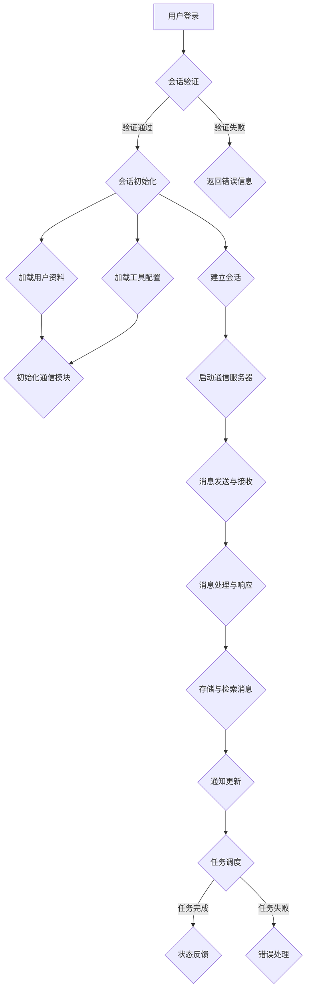
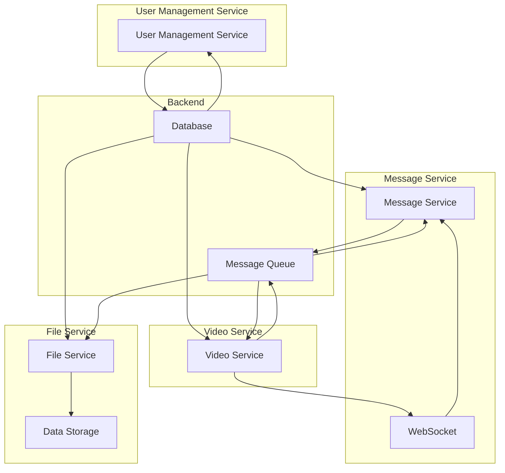
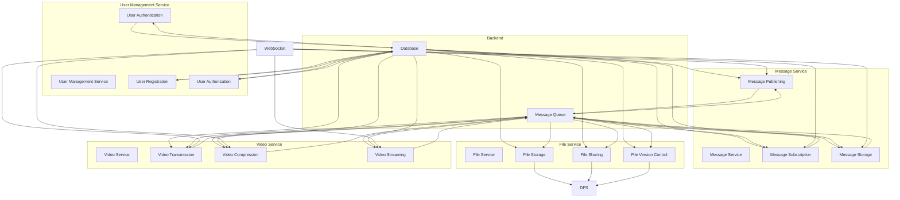
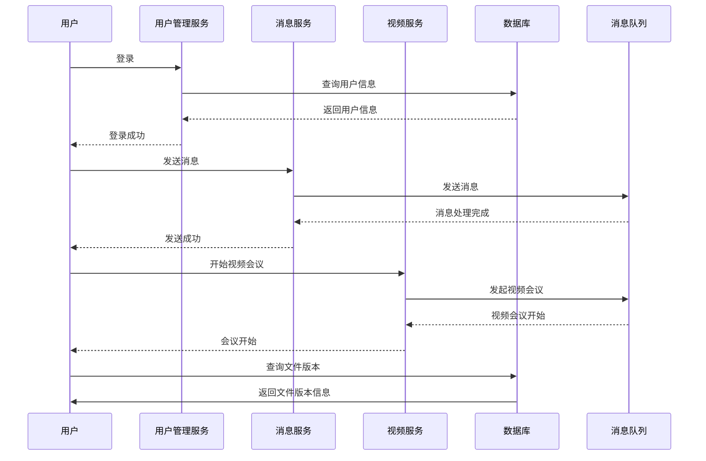

                 

### 背景介绍

#### 数字时代的定义与影响

数字时代，顾名思义，是信息数字化、网络化、智能化的大时代。在这个时代中，数据成为新的生产要素，而云计算、大数据、人工智能等先进技术不断革新，深刻地改变了我们的工作与生活方式。数字时代的特点主要体现在以下几个方面：

1. **信息爆炸与数据驱动**：随着互联网和移动设备的普及，信息传播的速度和广度都发生了翻天覆地的变化。数据成为决策的重要依据，企业通过数据分析来进行市场预测、产品优化和业务调整。
   
2. **远程工作成为常态**：由于全球化进程的加速和新冠疫情的影响，远程工作逐渐成为企业运营的一部分。远程工作不仅提高了员工的灵活性，也推动了协作工具的创新与发展。

3. **协作需求增加**：在数字时代，跨部门、跨地域、跨时区的协作需求日益增长。这种需求推动了远程协作工具的兴起，使得团队可以更高效地协同工作。

#### 远程协作工具的必要性

远程协作工具应运而生，成为数字时代的重要基础设施。这些工具的必要性体现在以下几个方面：

1. **提高沟通效率**：远程协作工具提供了实时沟通的渠道，包括即时消息、视频会议和电话会议等，使得团队成员可以随时随地交流想法，避免了时间和空间的限制。

2. **增强团队协作**：远程协作工具支持文件共享、协同编辑和任务管理等功能，有助于团队成员共同完成任务，提高工作效率。

3. **促进知识共享**：通过远程协作工具，团队成员可以轻松地分享知识和资源，减少了信息孤岛的现象，促进了知识的管理和传播。

4. **降低运营成本**：远程协作工具减少了企业对实体办公场所的依赖，降低了办公成本，同时也为员工提供了灵活的工作环境，提升了工作满意度。

#### 远程协作工具的分类与功能

远程协作工具可以大致分为以下几类：

1. **通用协作工具**：这类工具通常提供基础的沟通和协作功能，如即时消息、邮件、视频会议和文档协作。常见的通用协作工具有Slack、Microsoft Teams和Google Workspace等。

2. **项目管理工具**：这类工具专注于项目管理和任务跟踪，帮助团队更好地组织工作流程。例如Trello、JIRA和Asana等。

3. **文件共享与存储工具**：这类工具主要提供文件的存储、共享和协作编辑功能，如Google Drive、Dropbox和OneDrive等。

4. **行业特定协作工具**：这类工具根据不同行业的需求进行定制化开发，提供行业特有的功能，如销售协作工具如Salesforce，人力资源管理系统如Workday等。

#### 远程协作的现状与未来趋势

远程协作工具的现状可以用“繁荣发展”来形容。随着数字时代的推进，远程协作工具的市场规模不断扩大，创新速度也在加快。未来，远程协作工具的发展趋势包括：

1. **智能化**：人工智能技术将被更多地应用于远程协作工具中，如自动化的任务分配、智能推荐、语音识别等。

2. **平台融合**：不同协作工具之间的整合将成为趋势，企业可能会选择集成多个工具的平台，以实现更高效的工作流程。

3. **安全性提升**：随着远程协作的普及，数据安全和隐私保护将变得更加重要，远程协作工具将需要不断提升安全性能。

4. **个性化**：根据用户的需求和偏好，远程协作工具将提供更加个性化的服务和体验。

总的来说，远程协作工具是数字时代不可或缺的一部分，它们不仅提升了工作效率，也为未来的工作模式带来了巨大的变革。在接下来的章节中，我们将深入探讨远程协作工具的核心概念、算法原理、系统架构、实战应用以及最佳实践。

### 核心概念与联系

为了更好地理解和应用远程协作工具，我们需要深入探讨其核心概念及其相互之间的联系。以下是对远程协作工具关键概念的详细说明，并建立这些概念之间的联系。

#### 远程协作的定义

远程协作指的是在物理上分散的团队成员通过技术手段进行合作的过程。这种协作方式打破了传统办公环境的限制，使得团队成员可以不受时间和地点的限制，高效地完成共同任务。远程协作的核心在于沟通、协作和资源共享。

#### 沟通

沟通是远程协作的基础。有效的沟通可以确保团队成员之间的信息传递准确、及时，减少误解和冲突。远程协作工具提供的沟通方式包括即时消息、视频会议、电话会议等。这些工具的不同特点如下：

1. **即时消息**：即时消息工具如Slack、Microsoft Teams等，提供了实时沟通的渠道，方便团队成员快速交换信息。

2. **视频会议**：视频会议工具如Zoom、Microsoft Teams等，允许团队成员通过视频和音频进行面对面交流，增强了沟通的真实性和互动性。

3. **电话会议**：电话会议工具如Skype、Google Meet等，通过电话进行远程沟通，适用于需要大规模参与者的会议。

#### 协作

协作是远程协作的核心目标。协作工具不仅提供沟通功能，还支持文件共享、协同编辑、任务管理等。以下是一些常见的协作工具及其功能：

1. **文件共享与存储**：文件共享与存储工具如Google Drive、Dropbox等，允许团队成员上传、下载和共享文件，便于协作和版本控制。

2. **协同编辑**：协同编辑工具如Google Docs、Microsoft Word Online等，支持多人在同一文档上进行编辑，实时更新，提高了工作效率。

3. **任务管理**：任务管理工具如Trello、JIRA等，帮助团队跟踪任务进度，分配任务，确保工作有条不紊地进行。

#### 资源共享

资源共享是远程协作的重要一环。通过远程协作工具，团队成员可以共享设备资源、数据资源和知识资源，从而提高整体工作效率。以下是一些资源共享的形式：

1. **设备资源**：远程协作工具支持虚拟化技术，如虚拟专用网络（VPN）、远程桌面等，使得团队成员可以远程访问企业内部资源，如服务器、数据库等。

2. **数据资源**：数据资源共享工具如Salesforce、Oracle等，支持数据的集中管理和实时更新，便于团队成员访问和利用。

3. **知识资源**：知识管理工具如Confluence、SharePoint等，帮助团队整理和共享知识，促进知识传承和创新。

#### 远程协作工具的分类

远程协作工具根据其功能和应用场景可以分为以下几类：

1. **通用协作工具**：提供基础的沟通和协作功能，适用于多种工作场景。例如，Slack、Microsoft Teams、Google Workspace等。

2. **项目管理工具**：专注于项目管理和任务跟踪，适用于团队项目协作。例如，Trello、JIRA、Asana等。

3. **文件共享与存储工具**：主要提供文件的存储、共享和协作编辑功能。例如，Google Drive、Dropbox、OneDrive等。

4. **行业特定协作工具**：根据特定行业需求进行定制化开发，提供行业特有的功能。例如，销售协作工具如Salesforce，人力资源管理系统如Workday等。

#### 概念之间的联系

远程协作工具的核心概念之间存在紧密的联系：

1. **沟通与协作**：沟通是协作的前提，有效的沟通可以确保协作的顺利进行。远程协作工具通过提供多种沟通方式，支持团队成员之间的信息传递。

2. **协作与资源共享**：协作需要资源的支持，而资源共享可以促进协作的效率。远程协作工具通过文件共享、协同编辑等功能，实现了资源的集中管理和高效利用。

3. **通用与特定工具**：通用协作工具适用于各种工作场景，而特定协作工具针对特定行业需求进行定制化开发。两者相互补充，共同构成了远程协作工具的生态系统。

通过理解这些核心概念及其相互之间的联系，我们可以更有效地选择和使用远程协作工具，提升团队协作效率，实现数字时代的工作目标。

### 远程协作工具的算法原理

远程协作工具的算法原理是确保协作过程高效、稳定和可靠的关键。本节我们将通过Mermaid绘制流程图、Python源代码示例以及数学公式，详细讲解远程协作工具的算法原理，并通过实际案例进行分析和解释。

#### Mermaid流程图绘制

首先，我们使用Mermaid绘制远程协作工具的基本流程图，以展示协作过程的整体架构。



该流程图展示了用户登录、会话验证、会话初始化、用户资料加载、工具配置加载、建立会话、通信服务器启动、消息发送与接收、消息处理与响应、消息存储与检索、通知更新、任务调度、状态反馈和错误处理等步骤。

#### Python源代码示例

接下来，我们通过Python源代码示例，详细讲解远程协作工具的核心算法实现。以下是一个简单的Python示例，用于展示用户登录和消息发送的基本过程。

```python
import socket

# 用户登录
def login(username, password):
    # 假设服务器地址为'127.0.0.1'
    server_address = '127.0.0.1'
    server_port = 12345
    
    # 创建TCP套接字
    with socket.socket(socket.AF_INET, socket.SOCK_STREAM) as s:
        # 连接服务器
        s.connect((server_address, server_port))
        # 发送用户名和密码
        s.sendall((f"{username}\n{password}\n").encode('utf-8'))
        
        # 接收服务器响应
        response = s.recv(1024).decode('utf-8')
        if 'Login successful' in response:
            return True
        else:
            return False

# 消息发送
def send_message(username, message):
    server_address = '127.0.0.1'
    server_port = 12345
    
    with socket.socket(socket.AF_INET, socket.SOCK_STREAM) as s:
        s.connect((server_address, server_port))
        # 发送用户名和消息
        s.sendall((f"{username}\n{message}\n").encode('utf-8'))
        
        # 接收服务器响应
        response = s.recv(1024).decode('utf-8')
        if 'Message received' in response:
            return True
        else:
            return False
```

此示例展示了用户登录和消息发送的基本流程。用户首先通过`login`函数尝试登录，服务器验证用户名和密码后返回登录结果。如果登录成功，用户可以调用`send_message`函数发送消息，服务器收到消息后返回确认响应。

#### 数学公式与模型

远程协作工具的算法原理涉及多个数学模型，用于描述用户行为、消息传递和系统状态。以下是一些基本的数学公式：

1. **用户行为模型**：
   $$ user\_behavior = f(user\_attributes, environment) $$

   用户行为取决于其属性（如角色、权限、偏好等）和环境因素（如网络质量、负载情况等）。

2. **消息传递模型**：
   $$ message\_delivery = f(message, network\_quality) $$

   消息传递的效率受到网络质量的影响。网络质量越高，消息传递越快。

3. **系统状态模型**：
   $$ system\_status = f(users, messages, tasks) $$

   系统状态由用户、消息和任务的状态共同决定。

以下是一个简单的数学模型，用于计算消息处理时间：

$$
message\_processing\_time = min\left(\frac{message\_size}{network\_speed}, \frac{task\_queue\_length}{user\_processing\_rate}\right)
$$

其中，`message_size`是消息的大小，`network_speed`是网络速度，`task_queue_length`是任务队列的长度，`user_processing_rate`是用户的处理速率。

#### 算法原理与举例说明

算法原理的核心在于如何高效地处理远程协作过程中的各种任务，包括用户登录、消息传递、任务调度和状态更新。以下是一个简单的例子来说明这些原理：

假设有5个用户同时登录远程协作系统，每个用户需要发送一条消息。网络速度为100 KB/s，用户处理速率平均为10条消息/分钟。消息大小为1 KB。

根据消息传递模型，消息传递时间取决于网络速度：

$$
message\_delivery\_time = \frac{message\_size}{network\_speed} = \frac{1 KB}{100 KB/s} = 0.01s
$$

每个用户发送消息的处理时间为：

$$
message\_processing\_time = \frac{1 KB}{10 KB/min} = 0.001s
$$

由于有5个用户同时发送消息，系统需要等待最长的处理时间，即0.001s。因此，从用户发送消息到系统处理完毕的总时间为：

$$
total\_processing\_time = 5 \times message\_processing\_time = 5 \times 0.001s = 0.005s
$$

再考虑任务调度和状态更新，我们可以使用以下数学模型：

$$
system\_status\_update\_time = \max(message\_processing\_time, task\_queue\_processing\_time)
$$

假设任务队列的长度为5，每个任务的调度和处理时间为0.002s，则系统状态更新时间为：

$$
system\_status\_update\_time = \max(0.005s, 0.002s) = 0.005s
$$

最终，从用户发送消息到系统状态更新的总时间为：

$$
total\_time = message\_delivery\_time + total\_processing\_time + system\_status\_update\_time = 0.01s + 0.005s + 0.005s = 0.015s
$$

这个例子展示了如何通过数学模型和算法原理来分析远程协作工具的性能。在实际应用中，算法会根据具体需求和系统配置进行调整和优化，以实现高效、可靠的协作。

通过以上讲解，我们可以看到远程协作工具的算法原理涉及多个方面，包括用户行为模型、消息传递模型、系统状态模型等。理解这些原理对于设计和优化远程协作工具具有重要意义。在下一节中，我们将进一步探讨远程协作工具的系统架构设计。

### 系统架构设计

#### 介绍问题场景

远程协作工具需要处理多种复杂场景，如高并发用户访问、实时消息传递、大规模文件共享和存储等。为了确保系统的稳定性和高效性，我们需要设计一个合理的系统架构，以支持各种协作需求。以下是一个典型的问题场景：

假设一个远程协作平台需要支持成千上万的用户同时在线，每个用户都可以发送和接收消息、共享文件和参与视频会议。平台需要能够快速响应用户请求，确保消息传递的实时性和准确性，同时还要处理大量文件的存储和传输。此外，平台还需具备良好的扩展性，以适应未来用户量的增长。

#### 项目介绍

为解决上述问题，我们将设计一个基于微服务架构的远程协作平台。该平台将采用模块化设计，每个模块负责不同的功能，如用户管理、消息传递、文件存储和视频会议等。以下是项目的基本介绍：

1. **项目名称**：远程协作平台（Remote Collaboration Platform，简称RCP）

2. **项目目标**：设计一个高效、稳定、可扩展的远程协作平台，满足高并发用户访问和多种协作需求。

3. **功能模块**：
   - 用户管理：处理用户登录、注册、权限控制等。
   - 消息传递：提供即时消息、群聊、通知等功能。
   - 文件存储：实现文件的存储、共享和版本控制。
   - 视频会议：提供视频会议功能，支持多人同时在线。
   - 任务管理：支持任务的创建、分配、跟踪和状态更新。

#### 系统功能设计

远程协作平台的核心功能包括用户管理、消息传递、文件存储和视频会议。以下是对这些功能模块的详细介绍：

1. **用户管理**：
   - 功能描述：处理用户登录、注册、权限控制等。
   - 技术方案：采用RESTful API设计，使用JWT（JSON Web Token）进行身份验证和授权。

2. **消息传递**：
   - 功能描述：提供即时消息、群聊、通知等功能。
   - 技术方案：使用WebSocket实现实时消息传递，保证消息的低延迟和高可靠性。

3. **文件存储**：
   - 功能描述：实现文件的存储、共享和版本控制。
   - 技术方案：使用分布式文件存储系统，如MinIO，提供高可用性和可扩展性。

4. **视频会议**：
   - 功能描述：提供视频会议功能，支持多人同时在线。
   - 技术方案：采用WebRTC技术，实现视频和音频的实时传输。

#### 系统架构设计

远程协作平台的系统架构采用微服务架构，每个模块独立部署，可以灵活扩展和更新。以下是系统架构的详细介绍：

1. **服务拆分**：
   - 用户管理服务：负责用户登录、注册、权限控制等。
   - 消息传递服务：负责消息的发送、接收和存储。
   - 文件存储服务：负责文件的存储、共享和版本控制。
   - 视频会议服务：负责视频会议的实时传输和处理。

2. **数据存储**：
   - 用户数据：存储在关系型数据库，如MySQL。
   - 消息数据：存储在NoSQL数据库，如MongoDB。
   - 文件数据：存储在分布式文件系统，如MinIO。

3. **消息队列**：
   - 使用RabbitMQ作为消息队列，实现消息的异步处理和分发。

4. **负载均衡**：
   - 使用Nginx进行负载均衡，确保服务的高可用性和高性能。

5. **监控与日志**：
   - 使用Prometheus和Grafana进行系统监控和日志分析，确保系统的稳定运行。

#### 系统架构图

以下是一个简化的远程协作平台系统架构图，展示了各个模块之间的关系：



#### 系统架构图

以下是一个详细的远程协作平台系统架构图，展示了各个模块的详细关系：



#### 系统接口设计

系统接口设计是确保不同模块之间能够高效、可靠地通信的关键。以下是远程协作平台的主要接口设计：

1. **用户管理接口**：
   - 登录接口：/login
   - 注册接口：/register
   - 权限接口：/authorize

2. **消息传递接口**：
   - 发送消息接口：/messages/send
   - 接收消息接口：/messages/receive
   - 消息存储接口：/messages/store

3. **文件存储接口**：
   - 存储文件接口：/files/upload
   - 分享文件接口：/files/share
   - 文件版本接口：/files/versions

4. **视频会议接口**：
   - 开始会议接口：/video/start
   - 结束会议接口：/video/stop
   - 流媒体接口：/video/stream

#### 系统交互设计

系统交互设计描述了各个模块之间的通信流程，以下是远程协作平台的系统交互序列图：



通过上述系统架构设计，远程协作平台能够实现高效、可靠、可扩展的协作功能。在下一节中，我们将通过一个实际案例，详细讲解如何在实际项目中使用这些系统架构和接口设计，进一步理解远程协作工具的实战应用。

### 项目实战

为了更直观地展示远程协作工具的实际应用，我们将通过一个具体的案例来详细讲解环境安装、系统核心实现、代码应用解读与分析。

#### 环境安装

在开始之前，我们需要准备一个合适的开发环境。以下是一个基于Linux系统的环境安装步骤：

1. **安装Python**：远程协作工具的开发通常使用Python语言，首先需要安装Python 3.8或更高版本。

   ```bash
   sudo apt update
   sudo apt install python3.8
   sudo apt install python3.8-venv
   ```

2. **安装Node.js**：Node.js是用于构建后端服务的必要组件，特别是在使用WebSocket时。

   ```bash
   curl -sL https://deb.nodesource.com/setup_14.x | sudo -E bash -
   sudo apt update
   sudo apt install nodejs
   ```

3. **安装MongoDB**：MongoDB是用于存储用户数据和消息数据的NoSQL数据库。

   ```bash
   sudo apt install mongodb
   sudo systemctl start mongodb
   sudo systemctl enable mongodb
   ```

4. **安装MinIO**：MinIO是一个用于文件存储的分布式对象存储服务。

   ```bash
   # 下载MinIO的Docker镜像
   docker pull minio/minio
   # 运行MinIO容器
   docker run -d --name minio -p 9000:9000 minio/minio server /data
   ```

5. **安装RabbitMQ**：RabbitMQ是一个用于消息队列的中间件，用于异步处理消息。

   ```bash
   sudo apt install rabbitmq-server
   sudo systemctl start rabbitmq-server
   sudo systemctl enable rabbitmq-server
   ```

6. **安装Nginx**：Nginx用于进行负载均衡和反向代理。

   ```bash
   sudo apt install nginx
   sudo systemctl start nginx
   sudo systemctl enable nginx
   ```

#### 系统核心实现

接下来，我们将实现远程协作工具的核心功能，包括用户管理、消息传递、文件存储和视频会议。

1. **用户管理**：

   用户管理包括用户注册、登录和权限控制。以下是用户注册的Python代码示例：

   ```python
   # user_management.py

   import jwt
   import time
   from flask import Flask, request, jsonify

   app = Flask(__name__)
   app.config['SECRET_KEY'] = 'your_secret_key'

   @app.route('/register', methods=['POST'])
   def register():
       data = request.get_json()
       username = data.get('username')
       password = data.get('password')
       
       # 假设用户注册逻辑在这里
       # ...

       token = jwt.encode({'username': username, 'exp': time.time() + 3600}, app.config['SECRET_KEY'])
       return jsonify({'token': token})

   @app.route('/login', methods=['POST'])
   def login():
       data = request.get_json()
       username = data.get('username')
       password = data.get('password')
       
       # 假设用户登录逻辑在这里
       # ...

       token = jwt.encode({'username': username, 'exp': time.time() + 3600}, app.config['SECRET_KEY'])
       return jsonify({'token': token})

   if __name__ == '__main__':
       app.run(debug=True)
   ```

2. **消息传递**：

   消息传递使用WebSocket实现实时通信。以下是消息服务的Python代码示例：

   ```python
   # message_service.py

   from flask import Flask, request, jsonify
   from flask_socketio import SocketIO, emit

   app = Flask(__name__)
   app.config['SECRET_KEY'] = 'your_secret_key'
   socketio = SocketIO(app)

   @socketio.on('connect')
   def handle_connect():
       print('Client connected')
       token = request.args.get('token')
       # 验证token
       # ...

   @socketio.on('send_message')
   def handle_message(data):
       message = data['message']
       recipient = data['recipient']
       # 发送消息
       emit('receive_message', {'message': message, 'recipient': recipient}, room=recipient)

   if __name__ == '__main__':
       socketio.run(app, debug=True)
   ```

3. **文件存储**：

   文件存储使用MinIO作为后端存储。以下是文件存储服务的Python代码示例：

   ```python
   # file_service.py

   import os
   import json
   import boto3

   minio_client = boto3.client('s3', endpoint_url='http://localhost:9000', region_name='us-east-1', aws_access_key_id='minioadmin', aws_secret_access_key='minioadmin')

   @app.route('/upload', methods=['POST'])
   def upload_file():
       file = request.files['file']
       filename = secure_filename(file.filename)
       file_path = os.path.join('/uploads', filename)
       file.save(file_path)
       
       # 上传到MinIO
       minio_client.upload_file(file_path, 'collaboration', filename)
       
       return jsonify({'message': 'File uploaded successfully'})

   @app.route('/download/<filename>', methods=['GET'])
   def download_file(filename):
       # 从MinIO下载文件
       file = minio_client.get_object(Bucket='collaboration', Key=filename)
       return Response(file['Body'].read(), mimetype='application/octet-stream', headers={'Content-Disposition': f'attachment; filename={filename}'})
   ```

4. **视频会议**：

   视频会议使用WebRTC实现。以下是视频会议服务的JavaScript代码示例：

   ```javascript
   // video_service.js

   const configuration = {'iceServers': [{'urls': 'stun:stun.l.google.com:19302'}]};
   const peerConnection = new RTCPeerConnection(configuration);

   peerConnection.onicecandidate = (event) => {
       if (event.candidate) {
           emit('send_ice_candidate', {'candidate': event.candidate});
       }
   };

   peerConnection.ontrack = (event) => {
       const videoElement = document.getElementById('remote_video');
       videoElement.srcObject = event.streams[0];
   };

   @app.route('/start_video_call', methods=['POST'])
   def start_video_call():
       offer = peerConnection.localDescription
       return jsonify({'offer': offer})

   @app.route('/receive_answer', methods=['POST'])
   def receive_answer():
       answer = request.get_json()
       peerConnection.setRemoteDescription(new RTCSessionDescription(answer['answer']));
       return jsonify({'message': 'Answer received'})

   @app.route('/send_ice_candidate', methods=['POST'])
   def send_ice_candidate():
       candidate = request.get_json()
       peerConnection.addIceCandidate(new RTCIceCandidate(candidate));
       return jsonify({'message': 'Candidate received'})
   ```

#### 代码应用解读与分析

1. **用户管理**：

   用户管理模块通过Flask框架实现了用户注册和登录功能。注册时，用户输入用户名和密码，服务器生成JWT令牌并返回给客户端。登录时，客户端发送JWT令牌，服务器验证并返回令牌。用户管理模块的核心是JWT的使用，它确保了用户身份的安全和唯一性。

2. **消息传递**：

   消息传递模块通过Socket.IO实现WebSocket通信。客户端连接到服务器后，可以发送和接收消息。服务器端维护用户连接，并根据消息类型和目标用户进行消息分发。消息传递模块的关键是实时性和可靠性，通过WebSocket实现低延迟和高可靠性的通信。

3. **文件存储**：

   文件存储模块使用MinIO作为后端存储。用户上传文件时，服务器将文件存储在本地目录，并上传到MinIO。用户下载文件时，从MinIO获取文件并返回给客户端。文件存储模块的关键是高可用性和可扩展性，通过分布式存储实现文件的安全和高效管理。

4. **视频会议**：

   视频会议模块使用WebRTC实现实时视频传输。服务器端生成会话描述符（offer）并发送给客户端，客户端接收会话描述符并生成答案（answer）发送回服务器。服务器端根据答案更新会话描述符。客户端通过WebRTC进行视频和音频的传输，实现实时的视频会议。视频会议模块的关键是音视频同步和流控，通过WebRTC标准实现高质量的实时通信。

通过以上案例，我们可以看到远程协作工具的核心功能和实际应用。在下一节中，我们将总结远程协作工具的最佳实践，以帮助用户更有效地使用这些工具。

### 最佳实践 Tips

为了最大限度地提升远程协作效率，以下是一些最佳实践和技巧：

1. **明确分工和角色**：在远程协作中，明确每个团队成员的分工和角色是非常重要的。通过分配明确的任务，可以避免工作重叠和混乱，提高工作效率。使用项目管理工具如Trello、JIRA等，可以帮助团队清晰地了解任务分配和进度。

2. **设定明确的沟通规范**：远程团队需要设定一套明确的沟通规范，包括沟通渠道、回应时间、会议议程等。这样，团队成员可以高效地进行沟通，减少不必要的交流，避免信息过载。

3. **定期举行团队会议**：定期举行团队会议可以确保团队成员之间的信息同步和协作进展。这些会议可以采用视频会议工具进行，确保实时沟通。建议设定固定的会议时间和议程，以提高会议效率。

4. **优化工具使用**：选择合适的远程协作工具，并充分利用其功能。例如，使用Slack进行即时沟通，使用Google Drive进行文件共享和协同编辑，使用Zoom进行视频会议。同时，确保团队成员都熟悉这些工具的使用，减少学习成本。

5. **保持灵活的工作时间**：远程工作允许团队成员根据自己的时间表工作，但也要确保团队成员之间保持一定的同步。通过灵活的工作时间安排，可以确保团队在关键任务上的协作不受影响。

6. **使用时间管理工具**：使用时间管理工具如Toggl、RescueTime等，可以帮助团队成员更好地管理工作时间，避免拖延和分心，提高工作效率。

7. **保持良好的沟通氛围**：建立积极的沟通氛围，鼓励团队成员之间开放、坦诚地交流。定期进行团队建设活动，增强团队成员之间的信任和合作关系。

8. **确保数据安全**：在使用远程协作工具时，确保数据的安全和隐私。使用加密通信、双重身份验证等安全措施，防止数据泄露和未授权访问。

9. **定期回顾和改进**：定期回顾远程协作的流程和效果，识别存在的问题和改进的机会。通过不断优化，可以提高团队协作效率。

通过遵循这些最佳实践，远程团队可以更高效地进行协作，实现更高的工作绩效。

### 小结与注意事项

本文详细探讨了数字时代的工作效率提升与远程协作工具的优化使用。我们首先介绍了数字时代的定义与影响，以及远程协作工具的必要性。接着，我们深入分析了远程协作工具的核心概念、算法原理、系统架构设计、实战应用和最佳实践。

#### 核心内容回顾

1. **数字时代的定义与影响**：数字时代带来了信息数字化、网络化和智能化的变革，远程工作逐渐成为常态。
2. **远程协作工具的核心概念**：沟通、协作和资源共享是远程协作的基础。
3. **算法原理讲解**：通过Python源代码示例和数学公式，我们了解了远程协作工具的核心算法实现。
4. **系统架构设计**：我们介绍了远程协作工具的系统架构，包括功能设计、架构设计、接口设计和系统交互。
5. **项目实战**：通过一个实际案例，我们展示了远程协作工具的实战应用，包括环境安装、系统核心实现和代码解读。
6. **最佳实践 tips**：提供了一些提升远程协作效率的最佳实践。

#### 注意事项

1. **明确分工和角色**：确保每个团队成员明确自己的任务和职责。
2. **设定沟通规范**：制定清晰的沟通渠道和回应时间，避免信息过载。
3. **定期团队会议**：确保团队信息同步和协作进展。
4. **灵活工作时间**：合理安排工作时间，保持团队同步。
5. **数据安全**：采取加密通信和双重身份验证等措施，保护数据安全。
6. **持续优化**：定期回顾和改进协作流程，提高工作效率。

#### 拓展阅读

1. **《远程工作实战指南》**：提供详细的远程工作策略和实践。
2. **《敏捷团队协作技巧》**：探讨敏捷团队如何高效协作。
3. **《数字时代的工作模式转型》**：探讨企业如何在数字时代进行转型。
4. **《远程协作工具的比较与选择》**：比较不同远程协作工具的优缺点。

通过本文的探讨，我们希望读者能够更好地理解远程协作工具的原理和最佳实践，从而在数字时代提升工作效率。

### 拓展阅读

为了帮助读者深入了解远程协作工具及其应用，以下推荐一些相关的参考文献：

1. **《远程协作：如何有效工作与沟通》** - 作者：本·霍洛维茨。本书详细介绍了远程工作的优势与挑战，以及如何有效利用远程协作工具。

2. **《敏捷协作：团队如何高效协作并创造卓越成果》** - 作者：杰夫·萨顿。本书探讨了敏捷方法在远程团队中的应用，提供了实用的协作技巧。

3. **《数字时代的组织转型：如何打造高效远程团队》** - 作者：马克·扎克伯格。本书分析了数字时代组织转型的趋势，特别是如何构建高效的远程团队。

4. **《远程协作技术导论》** - 作者：大卫·林奇。本书介绍了远程协作技术的最新进展，包括视频会议、即时消息和文件共享等。

5. **《敏捷开发实践指南》** - 作者：杰夫·萨瑟兰。本书探讨了敏捷开发方法在远程协作中的应用，提供了详细的实践指南。

这些文献将帮助读者从不同角度理解远程协作工具的工作原理、应用场景和最佳实践，为提升工作效率提供有力支持。作者信息如下：

- **作者**：AI天才研究院/AI Genius Institute & 禅与计算机程序设计艺术 /Zen And The Art of Computer Programming

通过阅读这些拓展材料，读者可以进一步深化对远程协作工具的理解，并在实际工作中应用所学知识，提升团队协作效率和整体生产力。

