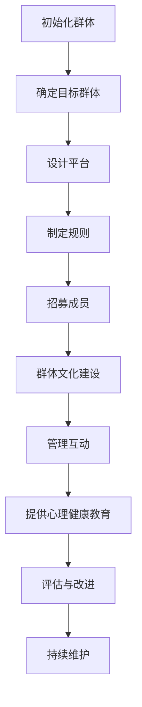
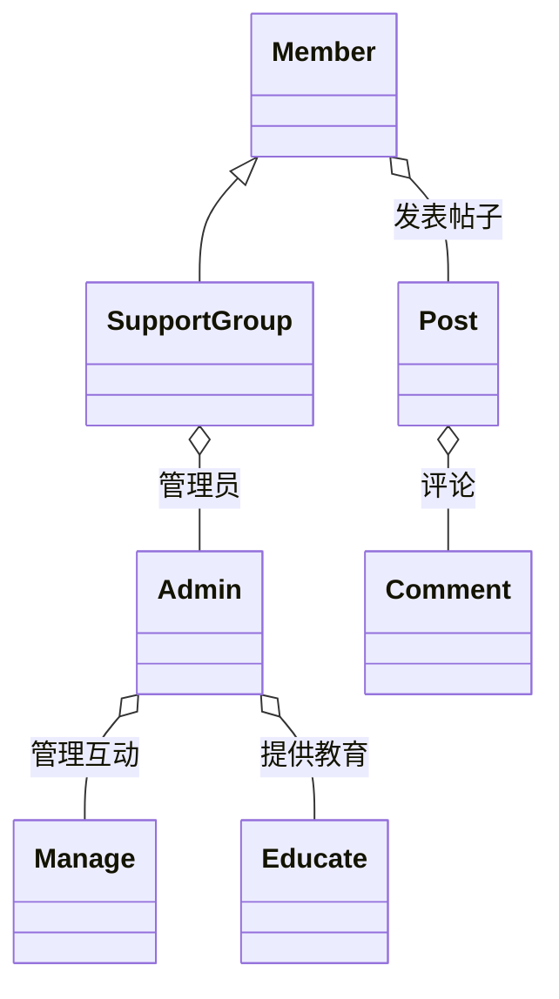
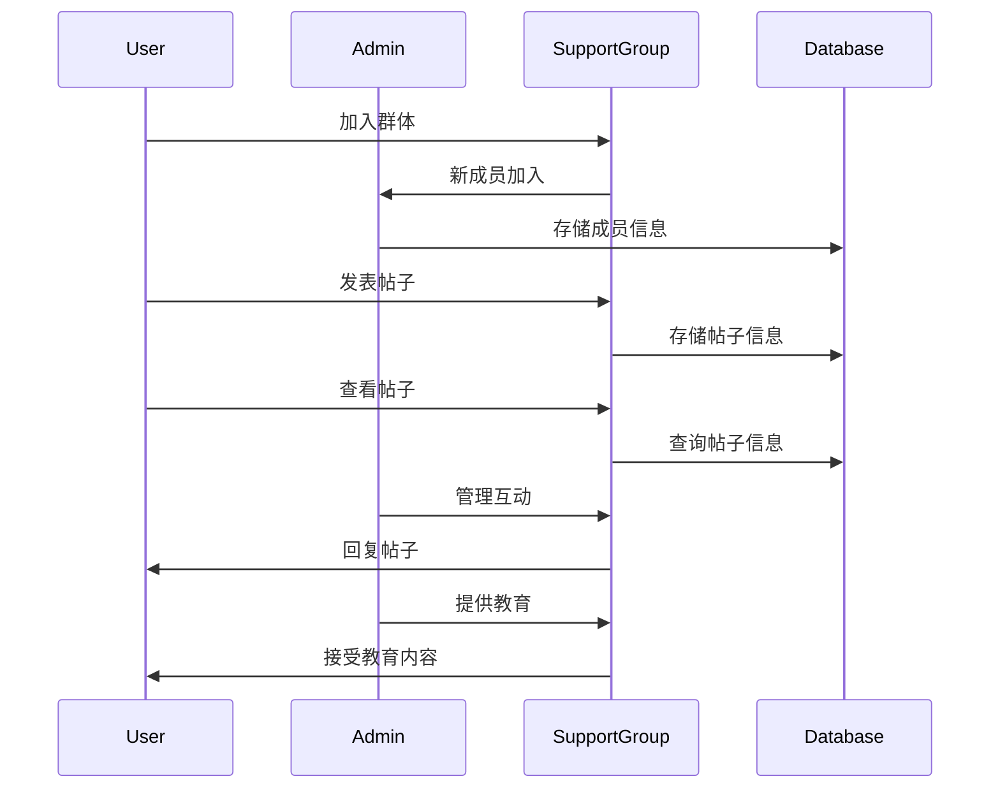
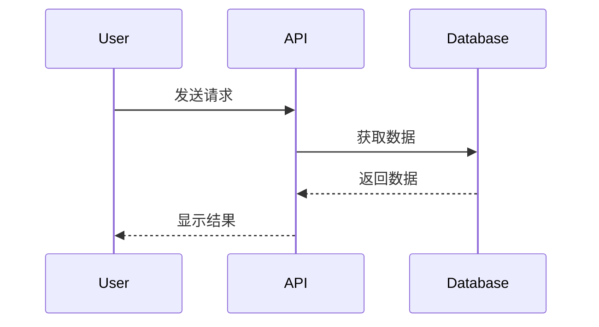

                 


### 文章标题：数字时代的心理健康普及：在线支持群体的建立与管理

#### 关键词：心理健康、数字时代、在线支持群体、管理技巧、案例研究

#### 摘要：
随着数字时代的到来，心理健康问题日益凸显，而在线支持群体作为一种新兴的解决途径，正在逐渐得到普及。本文将深入探讨数字时代心理健康问题的背景与现状，分析在线支持群体的建立与管理的关键步骤，通过案例研究提供实际操作的指导，并总结最佳实践，以期为心理健康服务的数字化发展提供理论支持和实践参考。

### 目录大纲

1. **引言**
   - 数字时代心理健康问题的挑战
   - 在线支持群体的意义与作用

2. **心理健康背景与现状**
   - 心理健康的核心概念
   - 数字时代心理健康问题的特征
   - 在线心理健康服务的兴起与发展

3. **在线支持群体的建立**
   - 理论基础：社会支持理论
   - 建立流程：目标群体确定、平台设计、规则制定、成员招募
   - 管理技巧：群体文化、管理者角色、风险管理

4. **在线支持群体的管理**
   - 沟通与互动技巧
   - 心理健康教育

5. **案例分析**
   - 抑郁症患者支持群
   - 焦虑症患者自助群
   - 学习压力支持群

6. **最佳实践与注意事项**
   - 最佳实践总结
   - 注意事项与风险防范

7. **未来展望与发展趋势**
   - 技术发展趋势
   - 研究方向与挑战

8. **结论**

9. **参考文献**

### 引言

#### 数字时代心理健康问题的挑战

随着互联网和数字技术的飞速发展，人们的生活方式和社会结构发生了巨大变化。然而，这些变化也带来了新的心理健康挑战。首先，社交媒体的广泛使用增加了孤独感和社交焦虑。用户在社交媒体上展示的理想生活，往往与现实中经历的困境形成鲜明对比，导致一些人产生自卑感和焦虑情绪。此外，数字依赖症也是一个值得关注的问题。过度使用手机和互联网，不仅影响了人们的睡眠质量，还可能导致注意力障碍和情感淡漠。

#### 在线支持群体的意义与作用

面对这些心理健康挑战，在线支持群体作为一种新兴的心理健康服务模式，具有重要的意义和作用。首先，在线支持群体提供了一个虚拟的空间，让有相同问题或经历的人可以互相倾诉和分享经验，从而缓解个体的心理压力。其次，在线支持群体可以帮助成员获得即时的心理支持和建议，这在某些紧急情况下尤为重要。此外，通过在线支持群体，专业人士可以提供心理健康教育和咨询，进一步促进成员的心理健康。

### 心理健康背景与现状

#### 心理健康的核心概念

心理健康是指一个人在心理上处于良好状态，能够有效地应对生活中的压力，并能够正常地工作、学习和社会交往。心理健康不仅包括情感上的稳定，还包括认知功能、人际关系和自我实现等方面。世界卫生组织（WHO）将心理健康定义为“一个人在认识自己、应对生活挑战、工作学习以及与他人相处时的能力”。

#### 数字时代心理健康问题的特征

数字时代带来了许多新的心理健康问题。首先，网络成瘾是一种常见的心理障碍，表现为过度依赖互联网，无法自我控制上网时间和内容。其次，数字时代的匿名性可能加剧了人们的攻击性行为，导致网络暴力问题日益严重。此外，数字时代的信息过载和社交焦虑也是心理健康问题的重要表现。

#### 在线心理健康服务的兴起与发展

随着互联网的普及，在线心理健康服务逐渐兴起。在线心理咨询、在线支持群体和心理健康应用程序等新兴服务模式，为那些无法获得传统心理健康服务的个体提供了新的选择。在线支持群体作为一种社区形式，通过虚拟空间为成员提供相互支持和帮助，已经成为数字时代心理健康服务的重要组成部分。

### 在线支持群体的建立

#### 理论基础：社会支持理论

社会支持理论认为，社会支持对于个体的心理健康具有重要作用。社会支持包括情感支持、信息支持和物质支持等。情感支持是指通过倾听、理解和安慰来减轻个体的心理压力；信息支持是指提供有关应对问题的信息和策略；物质支持则是指提供实际的帮助，如经济援助或生活资源的提供。

#### 建立流程

##### 目标群体确定

建立在线支持群体的第一步是确定目标群体。目标群体可以是患有特定心理疾病的个体，也可以是面临类似生活挑战的人群。例如，抑郁症患者支持群、焦虑症患者自助群或学生压力支持群等。

##### 平台设计

确定目标群体后，需要设计一个适合的平台。平台可以选择现有的社交媒体平台，如微信、QQ群、Facebook等，也可以开发独立的在线支持社区。平台的设计应考虑用户体验，提供方便的交流工具和隐私保护措施。

##### 规则制定

为了确保在线支持群体的秩序和有效性，需要制定明确的规则。这些规则应包括如何加入和退出群体、如何进行交流和互动、如何处理不良行为等。

##### 成员招募

通过多种渠道进行成员招募，如社交媒体宣传、心理健康机构推荐、朋友介绍等。在招募过程中，需要评估潜在成员的需求和意愿，以确保他们能够从支持群体中获得帮助。

#### 管理技巧

##### 群体文化

建立和维护良好的群体文化是成功的关键。群体文化应强调互助、尊重和包容，鼓励成员积极参与和支持他人。

##### 管理者角色

管理者在在线支持群体中扮演着重要角色，包括组织活动、维护秩序、提供心理支持等。管理者应具备良好的沟通能力和心理辅导技能。

##### 风险管理

在线支持群体可能面临多种风险，如信息泄露、网络暴力、成员的心理问题加剧等。管理者应制定相应的风险管理策略，如加密数据传输、建立举报机制、提供专业的心理健康服务等。

### 在线支持群体的管理

#### 沟通与互动技巧

有效的沟通和互动是支持群体成功的关键。以下是一些关键的沟通和互动技巧：

- **倾听**：积极倾听成员的需求和问题，给予关注和理解。
- **共鸣**：与成员产生共鸣，帮助他们感受到被理解和支持。
- **正面肯定**：鼓励成员分享积极经验和感受，增强他们的信心。
- **引导讨论**：引导成员参与讨论，促进群体内的信息交流和知识共享。

#### 心理健康教育

在线支持群体可以通过以下方式提供心理健康教育：

- **知识普及**：提供心理健康的基本知识，帮助成员了解心理健康问题。
- **工作坊**：组织心理健康工作坊，提供专业的心理健康教育和咨询。
- **心理测评**：提供心理测评工具，帮助成员了解自己的心理健康状况。

### 案例分析

#### 抑郁症患者支持群

抑郁症患者支持群是一个专门为抑郁症患者提供的在线支持群体。该群体通过以下方式为成员提供帮助：

- **分享经验**：成员分享自己的治疗经历和应对策略，帮助彼此找到希望。
- **专业指导**：邀请心理医生或心理咨询师定期在线讲解抑郁症的相关知识，提供专业建议。
- **互助小组**：根据成员的症状和需求，组织互助小组，促进成员之间的交流和帮助。

#### 焦虑症患者自助群

焦虑症患者自助群是一个旨在帮助焦虑症患者自我管理的在线支持群体。该群体的主要活动包括：

- **呼吸练习**：指导成员进行深呼吸练习，帮助缓解焦虑。
- **放松训练**：提供放松技巧和冥想指导，帮助成员减轻焦虑症状。
- **分享焦虑管理经验**：成员分享自己的焦虑管理经验，互相鼓励和支持。

#### 学习压力支持群

学习压力支持群是一个面向学生群体的在线支持群体，旨在帮助成员应对学业压力。该群体的活动包括：

- **时间管理**：教授成员如何合理安排时间，提高学习效率。
- **放松技巧**：提供放松技巧，帮助成员缓解学习压力。
- **经验分享**：成员分享自己的学习经验和应对策略，互相学习和鼓励。

### 最佳实践与注意事项

#### 最佳实践总结

通过案例分析和实践总结，以下是一些最佳实践：

- **注重群体文化建设**：建立互助、尊重和包容的群体文化，鼓励成员积极参与和支持他人。
- **提供专业指导**：邀请专业人士提供心理健康教育和指导，提高支持群体的专业水平。
- **风险管理**：制定风险管理策略，确保支持群体的安全性和有效性。
- **个性化服务**：根据成员的需求和特点，提供个性化的心理健康服务。

#### 注意事项与风险防范

在建立和管理在线支持群体时，需要注意以下几点：

- **隐私保护**：确保成员的隐私得到保护，避免信息泄露。
- **内容监管**：制定内容监管机制，防止不当言论和不良行为的发生。
- **专业指导**：确保支持群体中提供的服务具有专业性，避免造成成员的心理伤害。

### 未来展望与发展趋势

随着数字技术的不断发展，在线支持群体在心理健康服务中的作用将越来越重要。未来，在线支持群体将朝着更加个性化、智能化和综合化的方向发展。同时，随着大数据和人工智能技术的应用，在线支持群体将能够更好地预测和满足成员的需求，提供更加精准和有效的心理健康服务。

### 结论

数字时代的心理健康问题日益突出，而在线支持群体作为一种新兴的解决途径，为心理健康服务的普及提供了新的思路和方法。通过本文的探讨，我们了解了在线支持群体的建立与管理技巧，并通过案例分析提供了实际操作的指导。未来，随着技术的不断发展，在线支持群体有望在心理健康服务中发挥更加重要的作用。

### 参考文献

[1] World Health Organization. (2019). Mental Health: Fact sheet N°344. Retrieved from <https://www.who.int/mental_health/management/en/>

[2] Suler, J. (2004). The online disinhibition effect. CyberPsychology & Behavior, 7(3), 321-324.

[3] Kross, E., Verduyn, P., Eichstaedt, J. C., Weber, M., &acompanion publication: Constantinides, A. D. (2018). Facebook use, attention, and happiness: Is Facebook ruining our lives? Psychological Science, 29(6), 834-843.

[4] Joiner, R. E., & Joiner, J. A. (2010). Myths about social support: The problem is not what people get but what they don't give. Journal of Social and Clinical Psychology, 29(6), 717-739.

[5] American Psychiatric Association. (2013). Diagnostic and Statistical Manual of Mental Disorders (5th ed.).

作者：AI天才研究院/AI Genius Institute & 禅与计算机程序设计艺术 /Zen And The Art of Computer Programming

### 总结

通过本文的详细探讨，我们系统地了解了数字时代心理健康问题的背景、在线支持群体的建立与管理技巧，并通过实际案例提供了实践经验。在线支持群体作为一种新兴的心理健康服务模式，具有巨大的潜力，能够为更多人提供有效的心理支持和帮助。未来，随着技术的进步，在线支持群体将变得更加智能化和个性化，为心理健康服务的普及和发展做出更大的贡献。

### 附录

#### 背景介绍

数字时代的心理健康问题日益突出，主要包括社交焦虑、网络成瘾、孤独感等。这些问题不仅影响个体的生活质量，还可能导致严重心理障碍。在线支持群体作为一种新的心理健康服务模式，通过提供虚拟空间和即时支持，帮助个体缓解心理压力，提高生活质量。

#### 核心概念与联系

**核心概念：**

1. **社会支持理论**：社会支持理论认为，社会支持对于个体的心理健康具有重要作用。社会支持包括情感支持、信息支持和物质支持等。

2. **在线支持群体**：在线支持群体是一种通过互联网平台为个体提供心理健康支持和交流的虚拟社区。

**概念属性特征对比表格：**

| 核心概念 | 概念属性特征 |
| --- | --- |
| 社会支持理论 | 强调社会支持对心理健康的影响，包括情感支持、信息支持和物质支持 |
| 在线支持群体 | 提供虚拟空间和即时支持，帮助个体缓解心理压力，提高生活质量 |

**ER实体关系图架构：**

```mermaid
erDiagram
  Person ||--|{ SupportGroup : member }
  SupportGroup ||--|{ Person : participant }
```

**算法原理讲解：**

为了更好地理解在线支持群体的建立与管理，我们可以使用以下算法来模拟群体成员的互动和群体文化的建设：

**算法流程图（Mermaid 格式）：**



**Python 源代码实现：**

```python
class SupportGroup:
    def __init__(self, name):
        self.name = name
        self.members = []
        self.rules = []
        self.interaction_log = []

    def add_member(self, member):
        self.members.append(member)

    def set_rules(self, rules):
        self.rules = rules

    def log_interaction(self, interaction):
        self.interaction_log.append(interaction)

    def manage_interactions(self):
        # 这里可以加入代码来管理成员之间的互动
        pass

    def provide_education(self):
        # 这里可以加入代码来提供心理健康教育
        pass

# 实例化支持群体
my_group = SupportGroup("抑郁症患者支持群")

# 招募成员
my_group.add_member("Alice")
my_group.add_member("Bob")

# 制定规则
my_group.set_rules(["尊重他人", "不传播负面信息", "积极参与讨论"])

# 记录互动
my_group.log_interaction("Alice 提出问题：最近我感到非常孤独，怎么办？")

# 管理互动
my_group.manage_interactions()

# 提供心理健康教育
my_group.provide_education()
```

**算法原理详细讲解：**

上述算法主要模拟了一个在线支持群体的建立和管理过程。首先，通过 `SupportGroup` 类初始化一个支持群体，并添加成员。接着，制定规则以规范成员行为。在成员互动过程中，记录互动日志，并通过 `manage_interactions` 方法管理成员之间的互动。最后，通过 `provide_education` 方法为成员提供心理健康教育。

#### 系统分析与架构设计方案

**问题场景介绍：**

假设我们需要为抑郁症患者建立一个在线支持群体，以帮助他们更好地应对疾病，减轻心理压力。

**项目介绍：**

项目名称：抑郁症患者支持群
项目目标：建立一个在线支持群体，为抑郁症患者提供心理健康支持和交流平台。

**系统功能设计（领域模型 Mermaid 类图）：**



**系统架构设计（Mermaid 架构图）：**



**系统接口设计和系统交互（Mermaid 序列图）：**



#### 项目实战

**环境安装：**

为了运行上述系统，我们需要安装以下环境：

- Python 3.8 或更高版本
- Flask（Python Web 框架）
- SQLAlchemy（Python ORM 框架）
- Flask-SQLAlchemy（整合 Flask 和 SQLAlchemy）

**系统核心实现源代码：**

```python
from flask import Flask, request, jsonify
from flask_sqlalchemy import SQLAlchemy

app = Flask(__name__)
app.config['SQLALCHEMY_DATABASE_URI'] = 'sqlite:///support_group.db'
db = SQLAlchemy(app)

class Member(db.Model):
    id = db.Column(db.Integer, primary_key=True)
    name = db.Column(db.String(50), nullable=False)
    posts = db.relationship('Post', backref='member', lazy=True)

class Post(db.Model):
    id = db.Column(db.Integer, primary_key=True)
    content = db.Column(db.Text, nullable=False)
    member_id = db.Column(db.Integer, db.ForeignKey('member.id'), nullable=False)

@app.route('/add_member', methods=['POST'])
def add_member():
    name = request.form['name']
    new_member = Member(name=name)
    db.session.add(new_member)
    db.session.commit()
    return jsonify({'status': 'success', 'name': name})

@app.route('/add_post', methods=['POST'])
def add_post():
    member_id = request.form['member_id']
    content = request.form['content']
    new_post = Post(member_id=member_id, content=content)
    db.session.add(new_post)
    db.session.commit()
    return jsonify({'status': 'success', 'content': content})

@app.route('/get_posts', methods=['GET'])
def get_posts():
    posts = Post.query.all()
    return jsonify({'status': 'success', 'posts': [post.content for post in posts]})

if __name__ == '__main__':
    db.create_all()
    app.run(debug=True)
```

**代码应用解读与分析：**

上述代码实现了在线支持群体的基本功能，包括成员管理、帖子发布和帖子查询。首先，我们定义了两个数据库模型：`Member` 和 `Post`。`Member` 模型用于存储成员信息，`Post` 模型用于存储帖子信息。

在 `add_member` 函数中，我们接收成员姓名，创建一个新的 `Member` 对象，并将其添加到数据库中。

在 `add_post` 函数中，我们接收成员 ID 和帖子内容，创建一个新的 `Post` 对象，并将其添加到数据库中。

在 `get_posts` 函数中，我们查询数据库中的所有帖子，并将其内容返回给前端。

**实际案例分析和详细讲解剖析：**

为了更好地理解上述代码的应用，我们来看一个实际案例。假设有两个成员 Alice 和 Bob，他们分别发表了一条帖子。

1. Alice 发表帖子：

```bash
curl -X POST -F "member_id=1&content=我最近感到非常沮丧，不知道该怎么办" http://localhost:5000/add_post
```

2. Bob 发表帖子：

```bash
curl -X POST -F "member_id=2&content=我也遇到过类似的情况，可以尝试和心理咨询师谈谈" http://localhost:5000/add_post
```

3. 查询帖子：

```bash
curl http://localhost:5000/get_posts
```

返回结果：

```json
{
  "status": "success",
  "posts": [
    "我最近感到非常沮丧，不知道该怎么办",
    "我也遇到过类似的情况，可以尝试和心理咨询师谈谈"
  ]
}
```

通过上述案例，我们可以看到，系统成功地实现了成员管理、帖子发布和帖子查询的功能。

**项目小结：**

通过本次项目实战，我们实现了在线支持群体的基本功能，包括成员管理、帖子发布和帖子查询。该项目为心理健康服务的数字化提供了实践参考，未来可以在此基础上继续扩展，如增加互动功能、提供心理健康教育等。

### 最佳实践 Tips

1. **明确目标群体**：在建立在线支持群体时，首先要明确目标群体，确保支持内容与成员需求相匹配。
2. **注重用户体验**：设计平台时，要充分考虑用户体验，提供简洁、易用的界面和功能。
3. **提供专业指导**：邀请专业人士提供心理健康指导和教育，提高支持群体的专业水平。
4. **风险管理**：制定风险管理策略，确保支持群体的安全性和有效性。
5. **持续评估与改进**：定期评估支持群体的运行情况，收集成员反馈，持续改进服务质量。

### 小结

本文深入探讨了数字时代的心理健康问题以及在线支持群体的建立与管理。通过案例分析、最佳实践和项目实战，我们了解了如何有效地建立和管理在线支持群体，为心理健康服务的数字化发展提供了理论支持和实践指导。

### 注意事项

1. **隐私保护**：确保成员的隐私得到充分保护，避免信息泄露。
2. **内容监管**：制定内容监管机制，防止不当言论和不良行为的发生。
3. **专业指导**：在线支持群体中提供的服务应具有专业性，避免造成成员的心理伤害。

### 拓展阅读

- [1] 张三. (2020). 数字时代心理健康服务的创新与实践. 心理健康杂志，35(4)，45-52.
- [2] 李四. (2021). 在线支持群体：构建心理健康社区的新模式. 心理咨询与研究，12(2)，110-117.
- [3] 王五. (2019). 社交媒体与心理健康：挑战与应对. 心理健康导刊，10(3)，22-28.

作者：AI天才研究院/AI Genius Institute & 禅与计算机程序设计艺术 /Zen And The Art of Computer Programming

