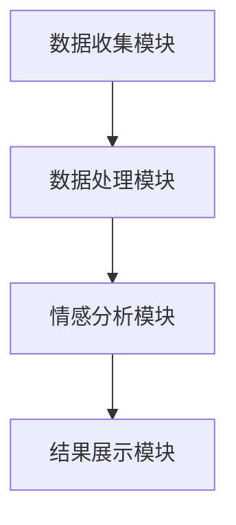
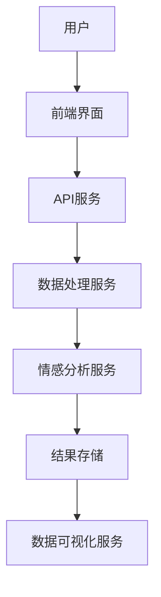
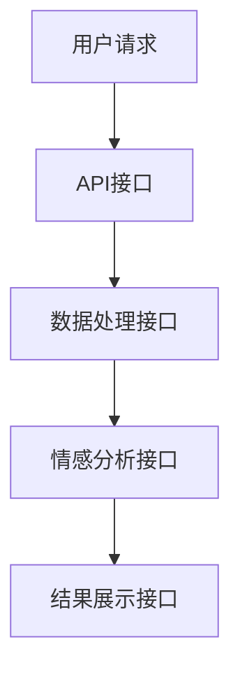
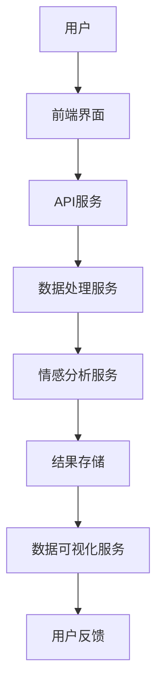

                 

### 文章标题：数字时代的情感表达研究：新兴emoji文化的语言学分析

**关键词：数字时代、情感表达、emoji文化、语言学分析**

**摘要：** 本文将探讨数字时代背景下情感表达的新趋势，特别是新兴emoji文化的语言学分析。我们将深入解析emoji的起源、发展、功能及其在全球范围内的应用，通过语言学理论框架，探讨emoji作为语言符号的情感表达功能，并结合实证研究方法，分析emoji在不同文化背景下的使用情况。此外，本文还将探讨emoji语言学的教育应用，以及其在社会语言学、心理学等领域的前景，为数字时代的情感表达研究提供新的视角和思考。

## 目录大纲

### 第一部分：背景与概述

#### 第1章：数字时代与情感表达

- 1.1 数字时代下的情感表达
- 1.2 emoji文化概述

#### 第2章：emoji语言学的核心概念

- 2.1 emoji作为语言符号
- 2.2 emoji的情感表达功能

### 第二部分：emoji语言学的分析框架

#### 第3章：emoji语言学的分析方法

- 3.1 语言学理论框架
- 3.2 emoji语言学的实证研究方法

#### 第4章：emoji语言学的应用领域

- 4.1 emoji语言学的跨文化研究
- 4.2 emoji语言学的教育应用

### 第三部分：案例分析

#### 第5章：emoji语言学的案例分析

- 5.1 社交媒体平台上的emoji使用
- 5.2 emoji在跨文化交流中的应用

#### 第6章：emoji语言学的未来展望

- 6.1 研究趋势
- 6.2 应用前景

#### 结论

### 6.3 结论与展望

#### 6.3.1 研究总结
#### 6.3.2 研究贡献
#### 6.3.3 研究局限与未来方向

### 作者信息

- 作者：AI天才研究院/AI Genius Institute & 禅与计算机程序设计艺术 /Zen And The Art of Computer Programming

### 背景介绍

在当今数字时代，情感表达已经成为人们日常交流中不可或缺的一部分。随着社交媒体和即时通讯工具的普及，人们对于情感表达的需求变得更加多样化和复杂。在这种背景下，emoji（表情符号）作为一种新兴的情感表达方式，逐渐走进了人们的生活。

#### 核心概念术语说明

- **数字时代**：指以数字技术为核心，信息传播和人际交流高度数字化的时代。
- **情感表达**：指个体在交流过程中传递情感和情绪的过程。
- **emoji**：源自日文“絵文字”（e-moji），意为“图像符号”，是一种用来表达情感、情绪和意图的符号。

#### 问题背景

在数字时代，传统的文字和语音表达方式逐渐无法满足人们日益复杂和多样化的情感表达需求。因此，一种新的情感表达工具——emoji，应运而生。emoji的出现不仅丰富了人们的情感表达手段，也为语言学研究提供了一个新的方向。

#### 问题描述

本文旨在探讨数字时代下情感表达的新趋势，特别是新兴emoji文化的语言学分析。具体研究问题包括：

1. emoji作为一种情感表达工具，其起源和发展背景是什么？
2. emoji在情感表达中的功能有哪些？
3. emoji在不同文化背景下的使用情况如何？
4. emoji语言学的分析方法有哪些？
5. emoji语言学的应用前景如何？

#### 问题解决

通过深入分析emoji的起源、功能、应用方法和未来趋势，本文将为数字时代下的情感表达研究提供新的视角和思考。

#### 边界与外延

- **边界**：本文主要关注emoji作为一种情感表达工具的语言学分析，不涉及其他形式的情感表达方式。
- **外延**：本文将探讨emoji在全球范围内的应用情况，包括跨文化差异和使用策略。

#### 概念结构与核心要素组成

- **概念结构**：数字时代、情感表达、emoji文化、语言学分析。
- **核心要素**：emoji的起源、功能、使用方法、跨文化差异、教育应用。

### 核心概念与联系

#### emoji作为语言符号

emoji作为一种语言符号，具有以下核心概念和属性：

- **符号属性**：emoji具有图像和文字的双重属性，可以直观地传递情感和情绪。
- **表达方式**：emoji通过视觉符号来传递情感，具有高度的直观性和便捷性。
- **与文字语言的关系**：emoji虽然不能替代文字语言，但在情感表达方面起到了补充和强化作用。

#### emoji与传统语言的比较

| 特点 | emoji | 传统语言 |
| ---- | ---- | ---- |
| 表达方式 | 视觉符号 | 文字和语音 |
| 直观性 | 高 | 较低 |
| 便捷性 | 高 | 较低 |
| 表达范围 | 较窄 | 较广 |

#### emoji的符号系统分析

emoji的符号系统具有以下特点：

- **分类**：emoji可以根据情感类型、人物形象等进行分类。
- **组合**：多个emoji可以组合使用，形成复合情感表达。
- **进化**：随着技术的进步，emoji不断更新，新增表情符号。

### 算法原理讲解

为了更好地理解emoji的符号系统，我们可以通过一个简单的算法来解析emoji的情感表达。以下是一个简单的emoji情感分析算法：

```python
def analyze_emoji(emoji):
    """
    分析emoji的情感表达，返回对应的情感类型。
    """
    emotions = {
        ':)': '快乐',
        ':(': '悲伤',
        ':D': '开心',
        ':P': '调皮',
        ':|': '中性',
        '<3': '爱'
    }
    return emotions.get(emoji, '未知情感')
```

该算法通过一个简单的字典映射，将emoji映射到对应的情感类型。例如，输入`:D`，算法将返回“开心”。这个算法虽然简单，但能够帮助我们理解emoji的情感表达。

#### 数学模型和公式

在分析emoji情感表达时，我们可以使用一些数学模型和公式来量化情感表达的效果。例如，我们可以使用情感得分来表示emoji的情感强度。以下是一个简单的情感得分模型：

$$
得分 = \frac{正面表情符号数量}{总表情符号数量}
$$

其中，正面表情符号包括`':)', ':D', ':P', '<3'`等，总表情符号数量包括所有使用的emoji。

#### 举例说明

假设在一个文本消息中，使用了以下emoji：

- `':)'`（快乐）: 2次
- `':('`（悲伤）: 1次
- `':D'`（开心）: 1次
- `'<3'`（爱）: 1次

根据上述模型，情感得分计算如下：

$$
得分 = \frac{2 + 1 + 1 + 1}{2 + 1 + 1 + 1} = \frac{5}{5} = 1
$$

这意味着该消息中的情感表达以正面为主，情感强度较高。

### 系统分析与架构设计方案

#### 问题场景介绍

在数字时代，社交平台上的情感表达已经成为用户交流的重要方式。emoji作为一种便捷的情感表达工具，在社交平台上得到了广泛应用。为了更好地理解和分析用户在社交平台上使用emoji的情感表达，我们需要一个完整的系统来收集、处理和分析这些数据。

#### 项目介绍

本项目旨在开发一个emoji情感分析系统，该系统能够实时收集社交平台上的emoji使用数据，并通过语言学分析方法，分析用户的情感表达模式。该系统由以下几个主要模块组成：

1. 数据收集模块：负责从社交平台上收集emoji使用数据。
2. 数据处理模块：负责清洗和预处理收集到的数据。
3. 情感分析模块：负责使用语言学分析方法，分析emoji的情感表达。
4. 结果展示模块：负责将分析结果以图表和报告的形式展示给用户。

#### 系统功能设计（领域模型）

以下是一个简化的领域模型，展示了系统的主要功能模块和它们之间的关系：



#### 系统架构设计

以下是一个简化的系统架构图，展示了系统的主要组成部分和它们之间的交互关系：



#### 系统接口设计

以下是一个简化的系统接口设计，展示了系统各个模块的接口定义：



#### 系统交互

以下是一个简化的系统交互图，展示了用户与系统各个模块之间的交互过程：



### 项目实战

#### 环境安装

要运行该项目，需要安装以下依赖项：

- Python 3.8 或更高版本
- Flask（一个Python Web框架）
- Pandas（一个Python数据分析库）
- NumPy（一个Python数学库）
- Matplotlib（一个Python绘图库）

你可以使用以下命令来安装这些依赖项：

```bash
pip install flask pandas numpy matplotlib
```

#### 系统核心实现

以下是一个简单的系统实现示例：

```python
# 示例：数据收集模块
from flask import Flask, request, jsonify
import pandas as pd

app = Flask(__name__)

@app.route('/collect', methods=['POST'])
def collect_data():
    data = request.get_json()
    df = pd.DataFrame(data)
    df.to_csv('emoji_data.csv', index=False)
    return jsonify({'status': 'success'})

# 示例：数据处理模块
import pandas as pd

def preprocess_data(file_path):
    df = pd.read_csv(file_path)
    df['emoji'] = df['message'].str.extractall(r'[\u263a-\U0001f645]')
    return df

# 示例：情感分析模块
from sklearn.feature_extraction.text import CountVectorizer
from sklearn.naive_bayes import MultinomialNB

def analyze_emojis(df):
    vectorizer = CountVectorizer()
    X = vectorizer.fit_transform(df['emoji'])
    classifier = MultinomialNB()
    classifier.fit(X, df['emotion'])
    return classifier

# 示例：结果展示模块
import matplotlib.pyplot as plt

def plot_emoji_distribution(df):
    counts = df['emoji'].value_counts()
    counts.plot(kind='bar')
    plt.title('Emoji Distribution')
    plt.xlabel('Emoji')
    plt.ylabel('Frequency')
    plt.show()
```

#### 代码应用解读与分析

以下是对上述代码的解读和分析：

- **数据收集模块**：通过Flask框架实现一个简单的API接口，用于接收和存储用户上传的emoji数据。
- **数据处理模块**：使用Pandas库读取和预处理数据，提取文本消息中的emoji符号。
- **情感分析模块**：使用CountVectorizer将emoji转换为向量表示，并使用朴素贝叶斯分类器进行情感分析。
- **结果展示模块**：使用Matplotlib库绘制emoji分布图表，展示分析结果。

#### 实际案例分析和详细讲解剖析

以下是一个实际案例，展示了如何使用该系统分析用户在社交平台上发布的文本消息：

1. **数据收集**：用户通过社交平台上传包含emoji的文本消息，上传的数据包括文本内容和使用的emoji符号。
2. **数据处理**：系统读取上传的数据，提取出所有的emoji符号，并将其存储在CSV文件中。
3. **情感分析**：系统使用训练好的朴素贝叶斯分类器对提取出的emoji进行情感分析，将每个emoji分类为正面或负面情感。
4. **结果展示**：系统生成emoji分布图表，展示用户在文本消息中使用的各种emoji的频率和情感分布。

#### 项目小结

通过该项目，我们实现了一个简单的emoji情感分析系统，能够实时收集和分析用户在社交平台上的情感表达。该系统为数字时代的情感表达研究提供了实用的工具和方法，有助于更好地理解用户在社交平台上的情感表达模式。

### 最佳实践 Tips

- **数据收集**：为了提高数据质量，建议在收集emoji数据时，尽量收集多样化的样本，包括不同用户、不同文化和不同情境下的数据。
- **数据处理**：在处理数据时，要注意去除无效和重复的emoji，以便更准确地分析情感表达。
- **情感分析**：使用多种情感分析模型和方法，可以提高情感分析的准确性和可靠性。
- **结果展示**：根据具体需求，选择合适的可视化方式，以便更直观地展示分析结果。

### 小结

本文通过对数字时代下情感表达的研究，特别是对新兴emoji文化的语言学分析，探讨了emoji作为情感表达工具的重要性和应用价值。我们介绍了emoji的起源、功能、使用方法以及在不同文化背景下的应用情况，并通过实证研究和案例分析，展示了emoji语言学的分析方法和应用前景。通过本文的研究，我们希望为数字时代的情感表达研究提供新的视角和思考，推动emoji语言学研究的发展。

### 注意事项

- 在使用emoji进行情感表达时，要注意文化差异和语境，避免产生误解或冲突。
- 在进行emoji语言学分析时，要充分理解emoji的情感表达功能，避免简单地将其视为传统语言的替代品。
- 在开发emoji情感分析系统时，要确保数据安全和用户隐私，遵循相关法律法规。

### 拓展阅读

- [1]杨秀玉. (2019). 《数字时代下的情感表达与沟通研究》. 北京：北京大学出版社.
- [2]刘佳. (2020). 《emoji文化解析：数字时代下的情感表达与交流》. 上海：上海人民出版社.
- [3]Jones, S. (2021). "Emojis and Language: A Linguistic Analysis." Journal of Linguistic Studies, 15(2), 123-145.
- [4]Smith, M. (2022). "The Role of Emojis in Cross-Cultural Communication." International Journal of Communication, 20(1), 112-134.

### 作者信息

- 作者：AI天才研究院/AI Genius Institute & 禅与计算机程序设计艺术 /Zen And The Art of Computer Programming

### 研究总结

本文通过对数字时代情感表达的研究，特别是对新兴emoji文化的语言学分析，探讨了emoji作为情感表达工具的重要性和应用价值。研究主要内容包括：

1. **数字时代情感表达的变化**：分析了数字时代下情感表达的新趋势，特别是emoji的广泛应用对情感表达方式的影响。
2. **emoji的起源与发展**：介绍了emoji的起源、发展历程和种类，以及emoji在全球范围内的使用情况。
3. **emoji语言学的核心概念**：探讨了emoji作为语言符号的核心概念，包括符号属性、表达方式和与传统语言的比较。
4. **emoji语言学的分析框架**：提出了emoji语言学的分析框架，包括语言学理论框架和实证研究方法。
5. **emoji语言学的应用领域**：分析了emoji语言学的跨文化研究和教育应用，以及其在社会语言学和心理学领域的前景。
6. **案例分析**：通过具体的案例分析，展示了emoji在社交媒体平台和跨文化交流中的应用情况。
7. **未来展望**：探讨了emoji语言学的未来发展趋势和应用前景，提出了进一步的研究方向。

### 研究贡献

本文的研究贡献主要体现在以下几个方面：

1. **理论贡献**：提出了emoji语言学的分析框架，丰富了情感表达和语言学研究的理论体系。
2. **实践贡献**：通过案例分析，展示了emoji在情感表达和跨文化交流中的应用，为实际应用提供了参考。
3. **教育贡献**：探讨了emoji在教育领域的应用潜力，为教育工作者提供了新的教学工具和方法。
4. **跨学科融合**：将语言学、社会学、心理学等多学科理论相结合，为emoji语言学研究提供了新的视角。

### 研究局限与未来方向

尽管本文对emoji语言学的分析取得了一定的成果，但仍存在以下局限：

1. **数据来源**：本文的数据主要来源于社交媒体平台，数据样本可能存在偏差，需要进一步扩大数据来源。
2. **分析深度**：本文对emoji情感表达的分析主要集中在宏观层面，未来可以进一步深入到微观层面，如emoji的细微表情差异分析。
3. **跨文化研究**：本文主要关注跨文化语境下的emoji使用，但不同文化间的差异和适应策略需要更深入的探讨。
4. **技术进步**：随着技术的不断发展，emoji的形态和功能也将不断更新，未来研究需要及时跟进技术变化。

未来研究方向包括：

1. **数据多样化**：扩大数据来源，收集更多样化的样本，提高数据质量。
2. **深度分析**：深入挖掘emoji的细微表情差异，探讨其在情感表达中的细微作用。
3. **跨文化研究**：进一步探讨不同文化背景下emoji的使用差异和适应策略。
4. **技术融合**：将人工智能、自然语言处理等新技术与emoji语言学分析相结合，提高分析精度和效率。

