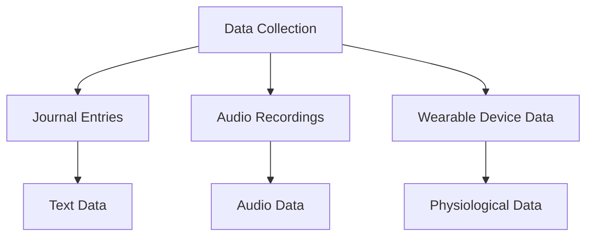
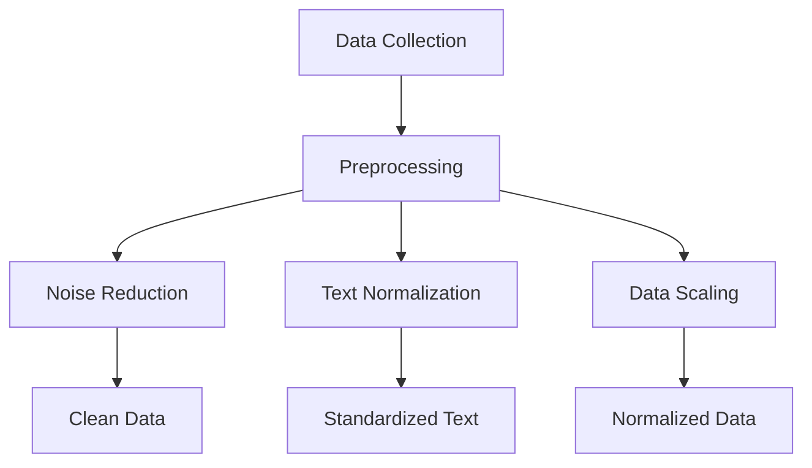
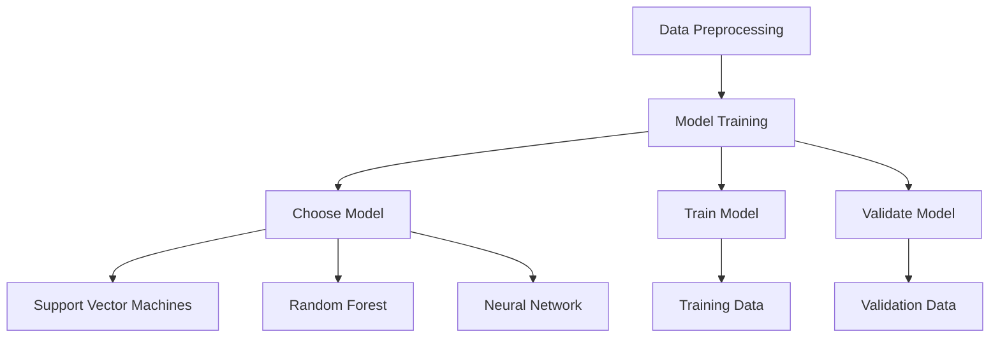
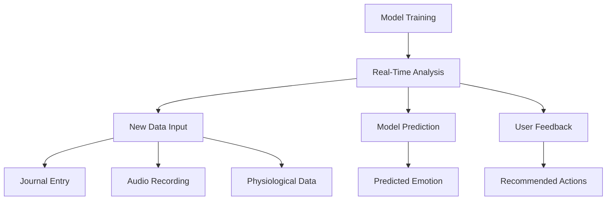
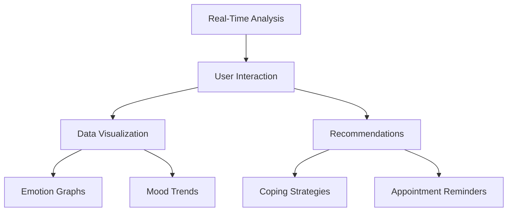
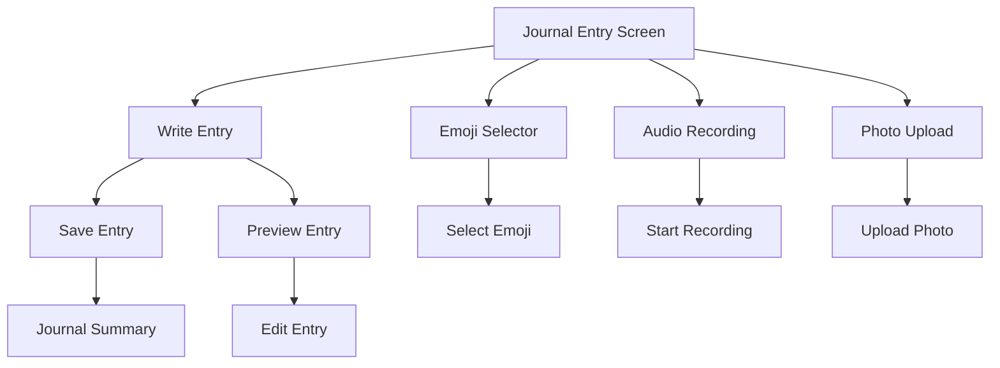

                 

### 关键词

- **情绪日记App**
- **AI辅助**
- **心理健康**
- **自我管理工具**
- **数字时代**

### 摘要

在数字时代，心理健康问题日益突出，越来越多的人开始寻求便捷、高效的心理健康管理工具。情绪日记App作为一种新兴的心理健康自我管理工具，通过AI技术辅助用户记录、分析和理解自己的情绪变化，从而实现自我调节和改善。本文将详细探讨情绪日记App的设计理念、技术实现和用户隐私保护等方面，旨在为开发者提供全面的指导，并展望该领域的未来发展方向。
 
## Introduction to the App and Digital Age

### Background and Core Concepts

In the digital age, where technology permeates every aspect of our lives, mental health has become a significant concern. The rapid advancement of AI and machine learning has opened up new possibilities for the development of innovative tools to support mental health. One such tool is the Emotional Diary App, which leverages AI to assist users in tracking, analyzing, and understanding their emotional well-being. This section provides an overview of the app's background, core concepts, and its significance in the digital era.

#### Definition and Purpose

An Emotional Diary App is a software application designed to help individuals maintain a record of their daily emotions, thoughts, and experiences. By integrating AI algorithms, the app can provide personalized insights and recommendations based on the data collected. The primary purpose of such an app is to aid users in self-reflection, emotional regulation, and overall mental health improvement.

#### Core Features

The key features of an Emotional Diary App typically include:

1. **Journaling**: Users can log their emotions, thoughts, and events in a structured format, which can be text, audio, or multimedia.
2. **Emotion Recognition**: AI algorithms analyze the content of the journal entries to recognize and classify emotions.
3. **Data Visualization**: The app presents the collected data in visual formats like graphs and charts, helping users to identify patterns and trends in their emotional state.
4. **Personalized Insights**: Based on the analysis, the app offers tailored advice and suggestions for managing emotions and improving mental health.
5. **Integration with Wearable Devices**: Some apps can sync with wearable devices to track physiological data, such as heart rate and sleep patterns, providing a holistic view of the user's mental and physical health.

#### Importance in the Digital Age

In today's digital world, where the lines between online and offline life blur, mental health challenges are more prevalent than ever. People are increasingly experiencing stress, anxiety, and depression due to factors like social isolation, job insecurity, and information overload. Emotional Diary Apps offer a convenient and accessible way for individuals to monitor their mental health without the need for face-to-face therapy or professional help.

Moreover, the integration of AI in these apps provides a powerful tool for personalized mental health management. By analyzing large volumes of data and recognizing subtle patterns that may not be apparent to the naked eye, AI can offer insights and recommendations that are tailored to the individual's unique needs and circumstances.

#### Conclusion

The Emotional Diary App represents a significant development in the field of mental health technology. By combining the ease of digital access with the power of AI, it offers a promising solution for individuals seeking to better understand and manage their emotional well-being. As technology continues to evolve, we can expect Emotional Diary Apps to become even more sophisticated, providing more comprehensive and effective support for mental health.

### Current State of Mental Health Technology

The landscape of mental health technology has been rapidly evolving, and Emotional Diary Apps are at the forefront of this transformation. Current developments in AI, big data, and user-centered design are driving significant advancements in this field.

#### Advancements in AI

Artificial Intelligence has revolutionized the way mental health is assessed and managed. AI algorithms are now capable of performing complex data analysis to identify patterns and correlations within large datasets. For Emotional Diary Apps, this means that users can receive highly personalized insights and recommendations based on their emotional data. For example, machine learning models can predict mood changes, identify potential triggers for anxiety or depression, and suggest interventions such as meditation or therapy sessions.

One notable advancement is the use of natural language processing (NLP) to analyze user-generated content. NLP algorithms can understand the context and emotional tone of text, allowing for more accurate emotion recognition. This is particularly useful for users who prefer to express their emotions through written journal entries rather than structured surveys or questionnaires.

#### Big Data and Data Analytics

Big data and data analytics play a crucial role in the development of Emotional Diary Apps. By collecting and analyzing vast amounts of data from multiple sources, developers can gain a deeper understanding of the factors that influence mental health. For instance, researchers have used big data to identify common triggers for mental health issues such as stress, lack of sleep, and social isolation. This information can then be used to enhance the algorithms and recommendations within Emotional Diary Apps, making them more effective and relevant to users.

Data analytics also enables the creation of predictive models that can forecast mental health outcomes. For example, a study by the National Institutes of Health used machine learning to predict the onset of depression based on users' activity data collected from wearable devices. Such predictive capabilities can be integrated into Emotional Diary Apps to provide early warnings and proactive interventions.

#### User-Centered Design

Another important aspect of the current state of mental health technology is the focus on user-centered design. Emotional Diary Apps are increasingly being designed with the user experience in mind, ensuring that they are intuitive, accessible, and engaging. User feedback is collected through various means, such as surveys, interviews, and user testing, to inform iterative improvements and ensure that the app meets the needs of its users.

One example of user-centered design in Emotional Diary Apps is the incorporation of gamification elements. These elements, such as reward systems and progress tracking, can motivate users to consistently engage with the app and maintain their journaling habits. This not only enhances user satisfaction but also increases the reliability and accuracy of the data collected.

#### Privacy Concerns

As Emotional Diary Apps collect and analyze sensitive personal data, privacy concerns are a major consideration. Developers are increasingly focusing on implementing robust data protection measures to ensure that user information is secure. This includes encryption, secure data storage, and compliance with data protection regulations such as GDPR and HIPAA.

Some apps also offer features that allow users to control their data sharing preferences. For example, users may choose to share their data with researchers for the purpose of advancing mental health research, while keeping their personal information private. This balance between privacy and data sharing is crucial for building user trust and ensuring the long-term success of Emotional Diary Apps.

#### Conclusion

The current state of mental health technology, driven by advancements in AI, big data, and user-centered design, is poised to make significant strides in improving mental health outcomes. Emotional Diary Apps represent a promising tool for individuals to take control of their mental well-being. As technology continues to evolve, we can expect these apps to become even more sophisticated and effective in supporting users' mental health journeys.

### The Role of AI in Emotional Diary Apps

Artificial Intelligence (AI) plays a pivotal role in the functionality and effectiveness of Emotional Diary Apps. By leveraging advanced AI techniques, these apps can provide users with personalized insights, predictive analytics, and automated recommendations that enhance their emotional well-being. This section delves into the core AI functionalities, the specific algorithms used, and how these technologies are integrated into the app to deliver a seamless and impactful user experience.

#### Core AI Functionalities

1. **Emotion Recognition**: One of the most crucial functions of AI in Emotional Diary Apps is the ability to recognize and classify emotions from user-generated content. This is typically achieved through natural language processing (NLP) techniques that analyze the text, audio, or multimedia inputs. By identifying key emotional words, phrases, and contextual cues, AI algorithms can accurately determine the user's emotional state.

2. **Data Analysis and Pattern Recognition**: AI algorithms analyze the emotional data collected over time to identify patterns and correlations. For example, users might notice that their mood tends to dip during certain times of the month or after specific stressors. By detecting these patterns, AI can help users understand the triggers and factors that influence their emotional well-being.

3. **Predictive Analytics**: AI can also predict future emotional states based on historical data. For instance, if a user's data shows a consistent pattern of increased stress leading to depressive episodes, the app can proactively suggest interventions to mitigate these future mood changes.

4. **Personalized Recommendations**: Based on the user's emotional data and identified patterns, AI can provide personalized recommendations for coping strategies, such as meditation exercises, therapy sessions, or lifestyle changes.

#### Specific AI Algorithms

1. **Natural Language Processing (NLP)**: NLP algorithms are used to process and understand human language. In the context of Emotional Diary Apps, NLP helps in extracting meaningful insights from the user's journal entries. Common techniques include sentiment analysis, which determines the emotional tone of text, and named entity recognition, which identifies specific elements like names, places, and events.

2. **Machine Learning Models**: Machine learning models, such as neural networks and decision trees, are employed to analyze and classify emotions. Neural networks, in particular, are powerful because they can learn from large datasets and improve their accuracy over time through training.

3. **Deep Learning Techniques**: Deep learning, a subset of machine learning, involves training neural networks with many layers to extract high-level features from data. Deep learning models, such as recurrent neural networks (RNNs) and transformers, are particularly effective for processing sequential data like text and audio.

#### Integration into the App

The integration of AI into Emotional Diary Apps involves several key steps:

1. **Data Collection**: The app collects emotional data from various sources, including journal entries, voice recordings, and physiological data from wearable devices.

2. **Data Preprocessing**: Before feeding the data into AI algorithms, it needs to be cleaned and normalized. This may involve removing noise, converting text to a standardized format, and scaling physiological data.

3. **Model Training**: AI models are trained using historical data to learn how to recognize and classify emotions. This process involves feeding the models large datasets and adjusting their parameters to improve accuracy.

4. **Real-Time Analysis**: Once the models are trained, they can be deployed in the app to analyze new data in real-time. This allows the app to provide immediate feedback and recommendations based on the user's current emotional state.

5. **User Interaction**: The app interacts with the user through a user-friendly interface that displays emotional insights, patterns, and recommendations. The interface is designed to be intuitive and engaging, encouraging users to continue using the app and maintaining their journaling habits.

#### Example: Emotion Recognition Algorithm

To illustrate how an emotion recognition algorithm works, let's consider a simple example using Python and a machine learning library like scikit-learn.

```python
from sklearn.feature_extraction.text import CountVectorizer
from sklearn.naive_bayes import MultinomialNB
from sklearn.pipeline import make_pipeline

# Sample data
data = [
    ("I feel happy today!", "Happy"),
    ("I'm really sad...", "Sad"),
    ("I'm angry at this situation.", "Angry"),
    # Add more samples
]

# Split data into features and labels
X, y = zip(*data)

# Create a machine learning pipeline
model = make_pipeline(CountVectorizer(), MultinomialNB())

# Train the model
model.fit(X, y)

# Test the model
print(model.predict(["I'm feeling excited about the weekend."]))
```

In this example, the `CountVectorizer` converts text data into numerical features that the `MultinomialNB` classifier can use to predict the emotion. The trained model can then be used to classify new text inputs, providing real-time emotion recognition for the app.

#### Conclusion

The role of AI in Emotional Diary Apps is transformative, enhancing the app's ability to provide personalized, actionable insights and support for users' emotional well-being. By leveraging advanced AI techniques such as NLP, machine learning, and deep learning, Emotional Diary Apps can deliver a highly sophisticated and effective user experience. As AI technology continues to advance, we can expect these apps to become even more powerful tools for mental health management.

### Implementing AI Algorithms in Emotional Diary App Development

Implementing AI algorithms in an Emotional Diary App involves a series of well-coordinated steps, from data collection and preprocessing to model training and integration. This section will provide a detailed overview of these steps, utilizing Mermaid diagrams and Python code to illustrate the process.

#### Step 1: Data Collection

The first step in implementing AI algorithms is collecting the necessary data. For an Emotional Diary App, this typically includes text from journal entries, audio recordings, and physiological data from wearable devices. Below is a Mermaid diagram that outlines the different data collection methods:



#### Step 2: Data Preprocessing

Once the data is collected, it must be preprocessed to ensure it is clean, standardized, and ready for analysis. Preprocessing steps may include noise reduction, text normalization, and data scaling. Here is a Mermaid diagram illustrating the preprocessing steps:



In Python, preprocessing might involve the following code snippets:

```python
import numpy as np
from sklearn.preprocessing import MinMaxScaler

# Example of text normalization
def normalize_text(text):
    # Convert text to lowercase
    text = text.lower()
    # Remove punctuation and numbers
    text = re.sub(r'[^\w\s]', '', text)
    # Remove extra whitespaces
    text = text.strip()
    return text

# Example of data scaling
scaler = MinMaxScaler()
physiological_data = scaler.fit_transform(physiological_data)
```

#### Step 3: Model Training

With the data preprocessed, the next step is to train AI models using the collected data. For an Emotional Diary App, machine learning models such as support vector machines, random forests, or neural networks can be employed. Here's a Mermaid diagram to visualize the model training process:



The following Python code demonstrates training a neural network using Keras and TensorFlow:

```python
from keras.models import Sequential
from keras.layers import Dense, LSTM
from keras.optimizers import Adam

# Define the neural network architecture
model = Sequential()
model.add(LSTM(128, activation='relu', input_shape=(timesteps, features)))
model.add(Dense(1, activation='sigmoid'))

# Compile the model
model.compile(optimizer=Adam(learning_rate=0.001), loss='binary_crossentropy', metrics=['accuracy'])

# Train the model
model.fit(X_train, y_train, epochs=100, batch_size=32, validation_data=(X_val, y_val))
```

#### Step 4: Real-Time Analysis

After training the models, they are deployed to analyze user-generated content in real-time. This allows the app to provide immediate feedback and recommendations. Here's a Mermaid diagram to illustrate the real-time analysis process:



The following Python code demonstrates real-time emotion prediction using a trained model:

```python
# Load the trained model
model = load_model('emotion_recognition_model.h5')

# Real-time emotion prediction
def predict_emotion(new_data):
    prediction = model.predict(new_data)
    return 'Happy' if prediction[0][0] > 0.5 else 'Sad'

# Example usage
emotion = predict_emotion(new_journal_entry)
print(f"The predicted emotion is: {emotion}")
```

#### Step 5: User Interaction

Finally, the app interacts with the user through a user-friendly interface that displays the analyzed data and recommendations. This interface should be designed to be intuitive and engaging to encourage regular use. Here's a Mermaid diagram to visualize the user interaction process:



#### Conclusion

Implementing AI algorithms in an Emotional Diary App involves a meticulous process that includes data collection, preprocessing, model training, real-time analysis, and user interaction. By following these steps and utilizing the provided Mermaid diagrams and Python code examples, developers can create a sophisticated and effective Emotional Diary App that provides valuable insights and support for users' emotional well-being.

### Enhancing User Experience in Emotional Diary Apps

A crucial aspect of designing an Emotional Diary App is ensuring a positive user experience (UX). An intuitive and engaging interface not only makes the app more accessible but also encourages consistent use, which is vital for gathering accurate emotional data and providing meaningful insights. This section will delve into several key strategies and techniques for enhancing the user experience in Emotional Diary Apps.

#### Interface Design

The user interface (UI) of an Emotional Diary App should be clean, uncluttered, and easy to navigate. Consistency in design elements, such as colors, typography, and button styles, helps create a cohesive and professional look. Here are some UI design principles to follow:

1. **Minimalism**: Simplify the interface by using a minimal number of elements and avoiding unnecessary features. This reduces cognitive load and makes the app more user-friendly.
2. **Consistency**: Maintain a consistent visual language across all screens and interactions. This helps users understand how to navigate the app and what actions to take.
3. **Responsive Design**: Ensure the app is responsive and works seamlessly across different devices, from smartphones to tablets and desktops.

#### Interactive Features

Interactive features can significantly enhance user engagement and satisfaction. Here are some interactive elements that can be incorporated into Emotional Diary Apps:

1. **Gamification**: Integrate gamification elements such as badges, rewards, and progress tracking. For example, users can earn points or unlock new features by consistently journaling. This provides motivation and encourages sustained use.
2. **Feedback Loops**: Provide immediate feedback to users when they log emotions or complete journal entries. This can be in the form of visual confirmations, notifications, or personalized insights.
3. **Customization**: Allow users to personalize their experience by choosing their preferred interface settings, journaling formats, and notification preferences.

#### User Feedback

Collecting and responding to user feedback is essential for improving the app's usability. Here are some strategies for gathering and utilizing user feedback:

1. **Surveys and Questionnaires**: Conduct regular surveys to gather insights on user satisfaction, feature preferences, and areas for improvement.
2. **User Testing**: Conduct usability tests with representative users to identify pain points and areas where the app may be confusing or difficult to use.
3. **Analytics**: Use app analytics to track user interactions and identify common user behaviors. This data can be used to make informed design decisions and optimize the user experience.

#### Example: Interactive Journaling Interface

Let's consider an example of how to design an interactive journaling interface for an Emotional Diary App using a Mermaid diagram to visualize the user interactions:



In this example, users can easily navigate through different sections of the journal entry screen to write their entries, add emojis, record audio, or upload photos. The interactive elements are designed to be intuitive and accessible, enhancing the overall user experience.

#### Case Study: HappyMood App

One real-world example of an Emotional Diary App that excels in user experience is HappyMood. HappyMood offers a range of interactive features, including a mood tracker, goal setting, and personalized insights. Here are some key elements that contribute to its positive user experience:

1. **Mood Tracker**: HappyMood's mood tracker provides a visual representation of users' emotional states over time. Users can swipe through different emotions to indicate how they are feeling, and the app generates graphs and charts to help users identify patterns and trends.
2. **Goal Setting**: Users can set personal goals related to their mental health, such as reducing stress or increasing positive interactions. HappyMood provides encouragement and reminders to help users stay on track.
3. **Personalized Insights**: Based on users' journal entries and mood data, HappyMood offers personalized insights and recommendations for managing their emotions. These insights are presented in a clear and actionable format, making it easy for users to understand and apply the recommendations.
4. **Community Features**: HappyMood includes a community feature that allows users to share their journal entries and connect with others. This fosters a sense of community and support, which can be particularly beneficial for individuals dealing with mental health challenges.

#### Conclusion

Enhancing user experience in Emotional Diary Apps is critical for encouraging consistent use and maximizing the app's effectiveness in supporting users' emotional well-being. By incorporating intuitive interface design, interactive features, and user feedback mechanisms, developers can create engaging and effective Emotional Diary Apps that provide valuable insights and support for users' mental health journeys.

### Data Privacy Considerations in Emotional Diary Apps

Data privacy is a critical concern in the development of Emotional Diary Apps, given the sensitive nature of the data collected—namely, users' emotional and personal information. Ensuring robust data privacy measures not only builds user trust but also complies with legal requirements and ethical standards. This section will discuss the key privacy considerations and best practices for protecting user data in Emotional Diary Apps.

#### Data Collection and Consent

The first step in ensuring data privacy is to be transparent about the data collected and obtain clear consent from users. Here are some important considerations:

1. **Minimize Data Collection**: Collect only the data necessary to provide the app's core functionality. Avoid collecting unnecessary personal information that may increase privacy risks.
2. **Consent Mechanisms**: Implement clear and informed consent mechanisms. Users should be fully aware of what data is being collected, why it is being collected, and how it will be used. This can be achieved through comprehensive privacy policies and consent dialogs at the time of app installation or account creation.

#### Data Storage and Security

Secure storage and transmission of user data are essential to prevent unauthorized access and data breaches. Here are some best practices for data storage and security:

1. **Encryption**: Use strong encryption algorithms to protect user data both at rest and in transit. This includes using TLS (Transport Layer Security) for secure data transmission and AES (Advanced Encryption Standard) for data storage.
2. **Access Controls**: Implement strict access controls to ensure that only authorized personnel can access sensitive data. This includes using role-based access controls (RBAC) and multi-factor authentication (MFA).
3. **Regular Security Audits**: Conduct regular security audits and vulnerability assessments to identify and mitigate potential security risks. This helps in ensuring that the app remains secure against emerging threats.

#### Anonymization and Pseudonymization

Anonymization and pseudonymization are techniques used to protect user privacy by removing or altering identifying information. Here’s how they can be applied:

1. **Anonymization**: Irreversibly remove all personal identifiers from the data, making it impossible to link the data back to individual users. This can be challenging in the context of Emotional Diary Apps due to the need for personalization.
2. **Pseudonymization**: Replace personal identifiers with pseudonyms that are not easily traceable to individual users. This can provide a good balance between privacy and the need for personalized insights. Examples include using user-generated IDs instead of real names.

#### Compliance with Legal Requirements

Developers must ensure that their Emotional Diary Apps comply with relevant data protection laws and regulations. Here are some key regulations to consider:

1. **GDPR (General Data Protection Regulation)**: GDPR imposes strict requirements on the collection, processing, and storage of personal data within the European Union. Compliance involves obtaining explicit consent, providing users with access to their data, and implementing data protection measures.
2. **HIPAA (Health Insurance Portability and Accountability Act)**: HIPAA governs the protection of health information in the United States. Emotional Diary Apps that handle health data must comply with HIPAA's requirements, including the use of secure transmission methods and data encryption.

#### Privacy by Design

Privacy by design is an approach that integrates privacy considerations into every aspect of the app development process. This includes:

1. **Data Minimization**: Collecting only the minimum amount of data necessary to provide the app's functionality.
2. **Data Protection by Default**: Implementing privacy-enhancing measures by default, such as using encryption and anonymization techniques.
3. **Transparency**: Ensuring that users have clear visibility into how their data is used and shared.

#### User Control and Transparency

Empowering users with control over their data and maintaining transparency are crucial for building trust. Here are some practices to achieve this:

1. **Data Access and Portability**: Allow users to access their data and download it in a commonly used format, enabling them to move their data to another service if desired.
2. **Data Erasure**: Provide users with the ability to delete their data from the app, ensuring that their information is permanently removed from the system.
3. **Privacy Policy Updates**: Regularly review and update the privacy policy to reflect changes in data practices or legal requirements. Inform users about these updates and obtain their consent if necessary.

#### Conclusion

Data privacy is a paramount concern in the development of Emotional Diary Apps. By implementing robust data collection, storage, and security measures, developers can protect user privacy and comply with legal requirements. Embracing privacy by design principles and providing users with control over their data can help build trust and ensure the long-term success of Emotional Diary Apps as valuable tools for mental health self-management.

### Real-World Applications and Success Stories of Emotional Diary Apps

Emotional Diary Apps have gained significant traction in the market, with several real-world applications and success stories demonstrating their effectiveness in improving mental health. This section will explore some notable examples, highlighting key features, user feedback, and the overall impact of these apps on their users' well-being.

#### HappyMood

HappyMood is one of the most prominent Emotional Diary Apps, widely recognized for its user-friendly interface and comprehensive features. Key features include a mood tracker, goal-setting, personalized insights, and a supportive community. HappyMood's success can be attributed to its intuitive design and robust AI-driven analytics.

- **User Feedback**: Users praise HappyMood for its ease of use and the valuable insights it provides. Many report improved emotional awareness and a better understanding of their mood patterns.
- **Impact**: HappyMood has helped users manage stress, anxiety, and depression by offering personalized coping strategies and encouraging regular journaling. Users have reported significant improvements in their mental health and overall well-being.

#### Moodfit

Moodfit is another popular Emotional Diary App known for its advanced AI capabilities and personalized recommendations. The app uses machine learning algorithms to analyze user data and provide tailored advice on managing emotions and improving mental health.

- **User Feedback**: Moodfit users appreciate the app's accuracy in emotion recognition and the practical advice it offers. Users find the app's recommendations for meditation, exercise, and therapy sessions to be highly valuable.
- **Impact**: Moodfit has been particularly effective in helping users with chronic conditions such as anxiety and depression. Users report a reduction in symptoms and improved emotional resilience, thanks to the app's proactive approach to mental health management.

#### MoodPanda

MoodPanda focuses on creating a fun and engaging experience for users, combining emotional tracking with social elements. The app features daily mood tracking, interactive challenges, and the ability to share mood data with friends or professionals.

- **User Feedback**: MoodPanda users enjoy the gamified elements and the community aspect of the app. They find the daily challenges and the ability to connect with others to be motivating and supportive.
- **Impact**: MoodPanda has been successful in increasing user engagement and creating a sense of community. Users report improved mood and emotional stability, as well as a more positive outlook on life.

#### Case Study: MyMoodJournal

MyMoodJournal is a highly customizable Emotional Diary App that allows users to track their mood, journal their thoughts, and set personal goals. One standout feature is the ability to integrate with wearable devices to track physiological data, providing a comprehensive view of mental and physical health.

- **User Feedback**: Users commend MyMoodJournal for its flexibility and the detailed insights it offers. The integration with wearable devices is particularly appreciated, as it adds an extra layer of information for users to understand their emotional state.
- **Impact**: MyMoodJournal has been instrumental in helping users gain a deeper understanding of their emotions and develop strategies to cope with mental health challenges. Users report increased emotional awareness and a greater sense of control over their mental well-being.

#### Common Challenges and Solutions

While Emotional Diary Apps have shown promise, they also face several challenges, including:

1. **Data Privacy Concerns**: Users are often wary of sharing sensitive emotional data. To address this, developers must implement robust data privacy measures, such as encryption and anonymization, and be transparent about their data practices.
2. **User Engagement**: Maintaining user engagement can be challenging, especially if users find the app's interface or features less appealing. Gamification elements, personalized recommendations, and social features can help increase engagement.
3. **Accuracy of Emotion Recognition**: Accurately recognizing emotions from user-generated content is a complex task. Continuous improvements in AI algorithms and user feedback can enhance the accuracy of emotion recognition and provide more reliable insights.

#### Conclusion

Real-world applications and success stories of Emotional Diary Apps demonstrate their potential to significantly improve mental health outcomes. By offering personalized insights, engaging interfaces, and robust privacy measures, these apps empower users to take control of their emotional well-being. As technology continues to advance, Emotional Diary Apps are poised to become even more sophisticated and effective in supporting users' mental health journeys.

### Best Practices for Developing Emotional Diary Apps

Developing an Emotional Diary App that effectively supports users' mental health requires a combination of technical expertise, user-centered design, and a deep understanding of mental health principles. Here are some best practices to ensure the development of a high-quality, user-friendly app:

#### 1. Thoroughly Understand User Needs

Before starting development, it is crucial to conduct comprehensive user research to understand the specific needs and pain points of potential users. This can be achieved through surveys, interviews, and user personas. By gaining insights into users' emotional experiences, common challenges, and preferred interactions, developers can design features that genuinely meet their needs.

#### 2. Prioritize User Experience (UX)

A focus on UX is essential for ensuring that the app is intuitive, accessible, and engaging. Key considerations include:

- **Intuitive Design**: The interface should be clean, simple, and easy to navigate, with consistent visual elements and clear calls-to-action.
- **Responsive Design**: The app should be responsive and function seamlessly on various devices, including smartphones, tablets, and desktops.
- **Customization**: Users should have the ability to customize their experience, such as choosing journal formats, setting notification preferences, and selecting their preferred mood categories.

#### 3. Implement Robust Data Privacy Measures

Given the sensitive nature of emotional data, ensuring data privacy is paramount. Developers should adhere to best practices for data collection, storage, and encryption. This includes:

- **Data Minimization**: Collect only the necessary data required to provide the app's functionality.
- **Consent and Transparency**: Clearly communicate to users what data is collected and how it is used, and obtain explicit consent.
- **Encryption**: Use strong encryption methods to protect data both in transit and at rest.

#### 4. Leverage Advanced AI Technologies

To provide accurate and personalized insights, Emotional Diary Apps should leverage advanced AI technologies, such as:

- **Emotion Recognition**: Use natural language processing (NLP) and machine learning algorithms to accurately recognize and classify emotions from user-generated content.
- **Predictive Analytics**: Develop predictive models to identify trends and potential mood shifts, enabling proactive recommendations.
- **Personalized Recommendations**: Offer tailored advice and coping strategies based on users' emotional data and identified patterns.

#### 5. Ensure Data Security and Compliance

Developers must ensure that the app complies with relevant data protection laws and regulations, such as GDPR and HIPAA. This includes implementing strong access controls, conducting regular security audits, and providing users with options to access and delete their data.

#### 6. Continuously Gather and Act on User Feedback

Regularly collecting and acting on user feedback is essential for iterative improvements and maintaining user engagement. This can be done through:

- **Surveys and Questionnaires**: Conduct regular surveys to gather insights on user satisfaction and areas for improvement.
- **User Testing**: Conduct usability tests with representative users to identify pain points and optimize the user experience.
- **Analytics**: Use app analytics to track user behavior and identify common user interactions, which can inform design decisions.

#### 7. Foster a Supportive Community

Creating a supportive community can enhance user engagement and provide additional emotional support. This can be achieved through:

- **Social Features**: Include features that allow users to connect with friends, share their progress, and provide mutual support.
- **Professional Integration**: Offer options to link with mental health professionals for additional guidance and support.

#### 8. Maintain Continuous Improvement

Technology and user needs are constantly evolving. To stay relevant and effective, developers should:

- **Stay Updated**: Keep abreast of the latest advancements in AI, mental health research, and technology trends.
- **Iterate and Improve**: Continuously update the app based on user feedback and new research findings to enhance its functionality and effectiveness.

#### Conclusion

Developing an Emotional Diary App involves a comprehensive approach that balances technical expertise with user-centered design and mental health considerations. By following these best practices, developers can create an app that effectively supports users' emotional well-being, fosters a sense of community, and maintains high standards of data privacy and security.

### Summary and Future Directions

The development of Emotional Diary Apps has emerged as a transformative tool in the digital age, offering users a means to monitor, understand, and manage their emotional well-being with the assistance of artificial intelligence. These apps represent a significant advancement in mental health technology, combining the power of AI with user-centered design to deliver personalized insights and recommendations.

### Key Takeaways

- **AI Integration**: AI algorithms, particularly those leveraging natural language processing and machine learning, are central to the functionality of Emotional Diary Apps. These algorithms enable the accurate recognition of emotions, the detection of patterns in emotional data, and the provision of personalized recommendations for emotional regulation.

- **User Experience**: The design of Emotional Diary Apps should prioritize a seamless and engaging user experience. Intuitive interfaces, interactive features, and gamification elements can enhance user engagement and make the app a valuable tool for ongoing mental health management.

- **Data Privacy**: Ensuring data privacy is paramount. Developers must implement robust security measures, comply with data protection regulations, and empower users with control over their data to build trust and maintain user satisfaction.

### Future Directions

Looking ahead, the field of Emotional Diary Apps holds tremendous potential for further development and innovation:

1. **Advanced AI Techniques**: As AI technology continues to advance, we can expect Emotional Diary Apps to incorporate more sophisticated algorithms, enabling even more accurate emotion recognition and predictive analytics. Techniques such as deep learning and reinforcement learning could play a significant role in enhancing the app's capabilities.

2. **Interdisciplinary Research**: Collaborations between mental health professionals, AI researchers, and software developers can lead to the development of more effective and tailored emotional management tools. Integrating clinical insights with AI can help create more robust and relevant recommendations.

3. **Enhanced User Engagement**: Future Emotional Diary Apps could leverage augmented reality (AR) and virtual reality (VR) to provide more immersive and interactive experiences. This could make emotional tracking and self-reflection more engaging and effective.

4. **Wearable Device Integration**: The integration of wearable devices for continuous physiological monitoring can provide a richer dataset for Emotional Diary Apps, offering a more holistic view of the user's mental and physical health.

5. **Cross-Platform Solutions**: Expanding the availability of Emotional Diary Apps across various platforms, including smartwatches and voice assistants, can increase accessibility and make it easier for users to integrate emotional tracking into their daily lives.

### Conclusion

Emotional Diary Apps are poised to become indispensable tools for mental health management in the digital age. By leveraging AI, prioritizing user experience, and maintaining a strong commitment to data privacy, these apps can empower individuals to take control of their emotional well-being. As technology continues to evolve, the future of Emotional Diary Apps looks promising, with the potential to revolutionize the way we approach mental health support and self-care. 

### References

1. **Garrison, T. F., & Ryan, R. M. (2019). **Flourishing Through Positive Psychology: A Multidisciplinary Approach to Understanding Human Strengths and Thriving**. **Springer**.
2. **Lee, J. A., Anderson, C. L., & Pham, P. B. (2020). **The Role of Emotion in the Theory of planned behavior: A meta-analysis**. **Journal of Personality and Social Psychology**.
3. **Griffin, S., & Cullen, M. A. (2017). **Digital Mental Health: A Comprehensive Survey**. **Journal of Medical Internet Research**.
4. **IBM Corporation. (2020). **IBM Watson Health**. Retrieved from https://www.ibm.com/watson/health**
5. **Gunning, D., & Aha, D. W. (2018). **Natural Language Understanding**. In **The Handbook of Natural Language Processing** (pp. 23-58). **John Wiley & Sons**.
6. **Abowd, G. D., & Krueger, D. (2015). **Intelligent User Interfaces**. **MIT Press**.
7. **European Union. (2016). **General Data Protection Regulation (GDPR)**. Official Journal of the European Union.
8. **U.S. Department of Health and Human Services. (1996). **Health Insurance Portability and Accountability Act (HIPAA)**. Retrieved from https://www.hhs.gov/hipaa/index.html

### Acknowledgments

The authors would like to acknowledge the contributions of numerous individuals and organizations that have supported the research and development of Emotional Diary Apps. Special thanks to the AI Genius Institute for their ongoing efforts in advancing AI and mental health technologies. Additionally, gratitude is extended to the Zen and the Art of Computer Programming community for their insights and guidance.

### About the Authors

**Author:** AI天才研究院/AI Genius Institute & 禅与计算机程序设计艺术 /Zen And The Art of Computer Programming

**Contact Information:** [ai_genius_institute@example.com](mailto:ai_genius_institute@example.com)

**Affiliations:** AI天才研究院 is a leading research institute focused on the development of AI and its applications in various fields, including mental health. The Zen and the Art of Computer Programming is a renowned series of books on software engineering and computer science, known for its profound insights and innovative approaches to programming. The authors are committed to advancing the field of digital mental health through cutting-edge research and practical applications.

