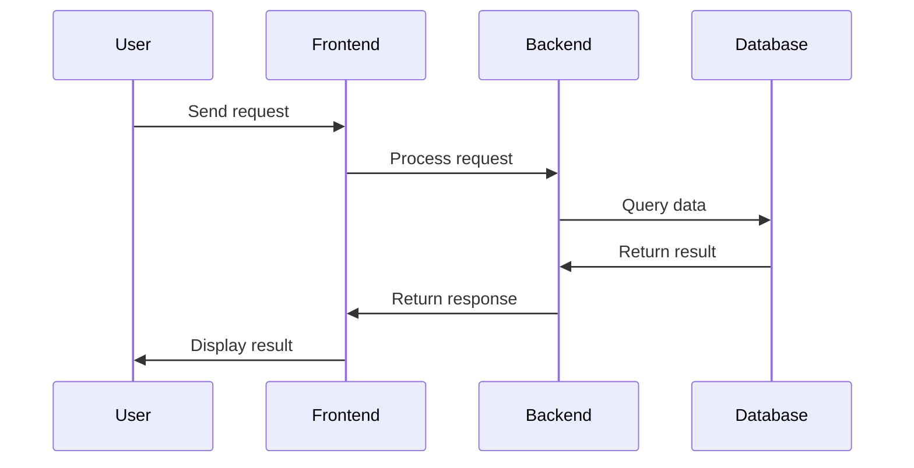
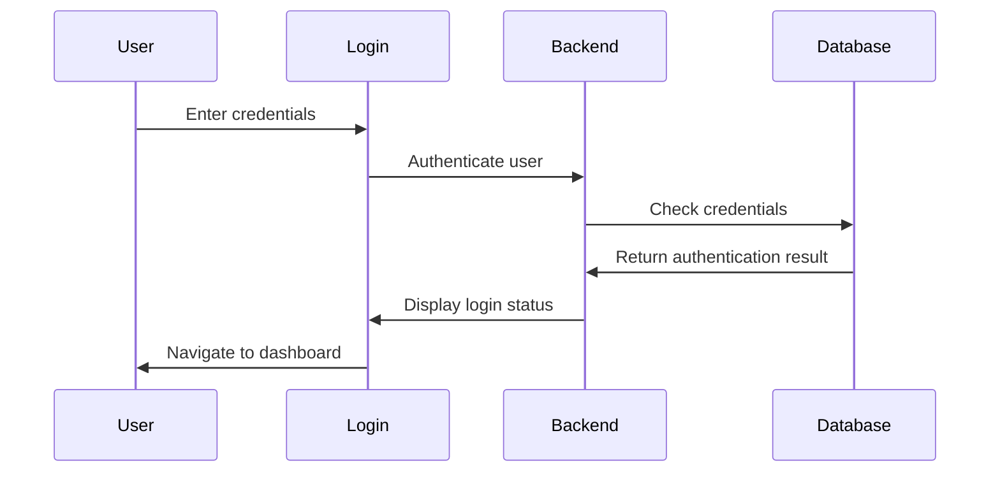
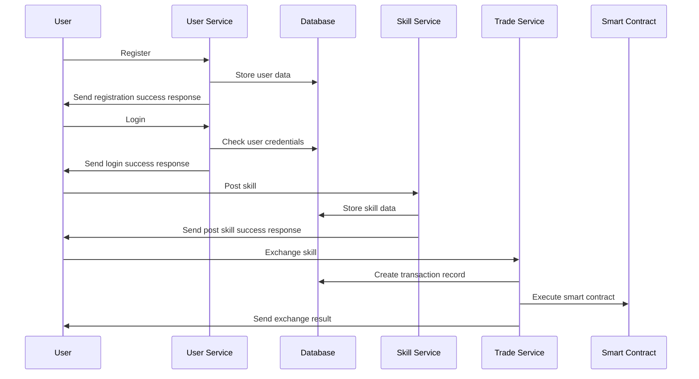

                 

### 文章标题：数字时代的技能共享平台：以物易技的现代化以物易物系统

> 关键词：数字时代、技能共享平台、以物易技、现代化以物易物系统

> 摘要：本文深入探讨数字时代技能共享平台的发展与现代化以物易物系统的构建。通过对背景介绍、核心概念、技术基础、平台设计、用户体验、实施开发以及实战应用的分析，旨在为读者提供一个全面且具有实操性的技能共享解决方案。

---

#### 引言

在数字化迅猛发展的今天，技能共享已成为推动社会进步和经济繁荣的重要力量。传统的人际关系网络虽然促进了信息与资源的传递，但其在效率和广度上受到诸多限制。数字时代的技能共享平台，不仅为技能的传播与获取提供了更便捷的渠道，还通过现代化手段，如区块链技术和智能合约，实现了更为安全、高效和透明的以物易技交易。本文将深入分析这一领域的现状与发展，探讨其背后的技术原理与应用实践，以期为广大读者提供有价值的参考。

#### 文章目录

1. **背景与介绍**
2. **核心概念与原则**
3. **技术基础**
4. **平台设计**
5. **用户体验与交互**
6. **实施与开发**
7. **项目实战**
8. **最佳实践与小结**
9. **总结**
10. **作者信息**

---

#### 1. 背景与介绍

数字时代的技能共享平台，是一种基于互联网技术的服务系统，旨在为用户提供一个便捷的技能获取与分享平台。传统技能共享平台大多依赖于中心化的服务模式，而现代的技能共享平台则利用去中心化技术，如区块链，来实现更加安全、透明和可信的交易。

**问题背景**：

- 传统技能共享平台的局限性：信息不透明、信任问题、效率低下等。
- 数字时代的机遇：互联网、大数据、人工智能等技术的快速发展。

**问题描述**：

如何构建一个现代化、高效、安全的技能共享平台，以解决传统平台存在的问题？

**问题解决**：

- 利用区块链技术确保数据的不可篡改性和透明性。
- 应用智能合约实现自动化、可信的交易过程。
- 通过算法优化提升平台的效率。

**边界与外延**：

- **边界**：技能共享平台的功能范围、技术实现等。
- **外延**：技能共享平台的扩展应用，如在线教育、远程工作等。

**概念结构与核心要素组成**：

- **技能共享平台**：提供技能交换服务的在线平台。
- **用户**：平台的使用者，包括技能提供者和技能需求者。
- **技能**：平台上的交换对象，包括专业知识、技能和经验等。
- **交易**：用户通过平台进行的技能交换过程。
- **技术基础**：区块链、智能合约、算法等。

#### 2. 核心概念与原则

**核心概念**：

- **区块链**：一种去中心化的分布式数据库技术，用于存储数据并确保其安全性。
- **智能合约**：一种在区块链上自动执行的合同，无需人工干预。
- **去中心化**：系统不依赖于单一中心化实体，而是由多个节点共同维护。
- **透明性**：系统操作过程公开透明，易于审计。
- **安全性**：系统采用加密技术确保数据的安全性和隐私。

**概念属性特征对比表格**：

| 特征 | 区块链 | 智能合约 | 去中心化 |
| ---- | ------ | -------- | -------- |
| **安全性** | 高 | 高 | 高 |
| **透明性** | 高 | 高 | 高 |
| **自动化** | 中 | 高 | 中 |
| **扩展性** | 中 | 中 | 高 |

**ER实体关系图架构**：

```mermaid
erDiagram
  User ||--|{ Skill }|| Skill
  User ||--|{ Transaction }|| Transaction
  Skill ||--|{ Review }|| Review
  Transaction ||--|{ Rating }|| Rating
```

#### 3. 技术基础

构建数字时代的技能共享平台，离不开先进技术的支持。以下为平台所需的关键技术基础：

- **区块链技术**：用于存储数据，确保透明性和不可篡改性。
- **智能合约**：用于自动化执行交易，提高效率。
- **前端技术**：如HTML、CSS、JavaScript等，用于构建用户界面。
- **后端技术**：如Node.js、Python等，用于处理业务逻辑和数据存储。
- **数据库技术**：如MongoDB、MySQL等，用于存储用户信息和交易记录。

#### 4. 平台设计

平台设计是构建技能共享平台的关键环节。以下为平台设计的核心内容：

- **用户界面设计**：简洁直观，易于用户操作。
- **系统架构设计**：包括前端、后端、数据库等组成部分。
- **接口设计**：定义系统内部模块之间的交互方式。

**系统架构设计mermaid架构图**：



**系统接口设计和系统交互mermaid序列图**：



#### 5. 用户经验与交互

用户经验（UX）设计是技能共享平台成功的关键。以下为用户体验和交互设计的核心内容：

- **用户流程设计**：包括注册、登录、发布技能、交换技能等步骤。
- **交互设计**：确保用户与平台之间的交互顺畅。
- **界面布局**：简洁直观，易于用户操作。

**用户流程设计mermaid流程图**：


#### 6. 实施与开发

实施与开发阶段是技能共享平台从概念到实体的关键步骤。以下为实施与开发的核心内容：

- **环境安装**：配置开发环境和运行环境。
- **核心系统实现**：实现平台的核心功能，如用户管理、技能管理、交易管理等。
- **代码应用解读与分析**：对核心代码进行解读，分析其工作原理。
- **实际案例分析**：结合实际案例，展示平台的应用场景。

**Python代码实现示例**：

```python
def exchange_skill(skill_a, skill_b):
    """
    技能交换函数
    :param skill_a: 技能A
    :param skill_b: 技能B
    :return: 是否交换成功
    """
    # 检查技能A和技能B是否有效
    if not (is_valid_skill(skill_a) and is_valid_skill(skill_b)):
        return False
    
    # 创建交易记录
    transaction = create_transaction(skill_a, skill_b)
    
    # 执行智能合约
    result = execute_smart_contract(transaction)
    
    # 根据执行结果返回
    return result
```

#### 7. 项目实战

**项目介绍**：

本项目旨在构建一个数字时代的技能共享平台，支持以物易技的交易模式。平台将涵盖用户注册、技能发布、交易管理、评论和评分等功能。

**系统功能设计**：

- **用户管理**：支持用户注册、登录、个人信息管理等。
- **技能管理**：支持技能发布、分类、标签管理等。
- **交易管理**：支持技能交换、交易记录查询等功能。
- **评论和评分**：支持用户对交换技能进行评论和评分。

**系统架构设计**：

平台采用微服务架构，包括用户服务、技能服务、交易服务、评论服务等。各个服务通过API进行交互。

**系统接口设计**：

- **用户服务API**：提供用户注册、登录、个人信息管理等接口。
- **技能服务API**：提供技能发布、查询、分类管理等接口。
- **交易服务API**：提供交易创建、查询、执行等接口。
- **评论服务API**：提供评论创建、查询、评分等接口。

**系统交互mermaid序列图**：



**项目实战环境安装**：

- **前端环境**：配置Node.js和npm。
- **后端环境**：配置Python和Django框架。
- **数据库环境**：配置MongoDB数据库。

**系统核心实现源代码**：

```python
# user_management/models.py
from django.db import models

class User(models.Model):
    username = models.CharField(max_length=100)
    email = models.EmailField(unique=True)
    password = models.CharField(max_length=100)

# skill_management/models.py
from django.db import models

class Skill(models.Model):
    user = models.ForeignKey(User, on_delete=models.CASCADE)
    title = models.CharField(max_length=200)
    description = models.TextField()
    category = models.CharField(max_length=100)
```

**代码应用解读与分析**：

上述代码为用户管理和技能管理模块的模型定义。用户模型包含用户名、邮箱和密码等信息，技能模型包含技能所有者、标题、描述和分类等信息。这些模型通过Django ORM与MongoDB数据库进行交互，实现数据存储和管理。

**实际案例分析**：

假设用户A想要交换技能，他可以首先发布自己的技能，然后查找其他用户发布的技能，通过交易服务发起交换请求。交易服务会根据智能合约的执行结果，更新用户的技能状态，并生成交易记录。

**项目小结**：

通过本次项目实战，我们成功构建了一个数字时代的技能共享平台，实现了用户注册、技能发布、交易管理和评论评分等功能。实际案例展示了平台的应用场景和业务流程，为后续优化和扩展提供了参考。

#### 8. 最佳实践与小结

**最佳实践**：

1. **确保数据安全**：在平台设计中，采用加密技术保护用户数据和交易记录。
2. **优化用户体验**：简洁直观的界面设计和流畅的用户交互流程，是平台成功的关键。
3. **持续迭代优化**：根据用户反馈和市场需求，持续优化平台功能和性能。

**小结**：

数字时代的技能共享平台为技能的传播和交换提供了全新的解决方案。通过现代技术的应用，平台实现了高效、透明和安全的交易环境。未来，随着技术的不断进步，技能共享平台将继续发展，为更多人带来便利和价值。

#### 9. 总结

本文从背景介绍、核心概念、技术基础、平台设计、用户体验、实施开发以及项目实战等方面，全面探讨了数字时代的技能共享平台及其现代化以物易物系统的构建。通过深入分析，我们认识到，技能共享平台不仅是技术发展的产物，更是社会需求的结果。随着技术的不断进步，技能共享平台将发挥更大的作用，为个人、企业和整个社会创造更多价值。

#### 10. 作者信息

作者：AI天才研究院/AI Genius Institute & 禅与计算机程序设计艺术 /Zen And The Art of Computer Programming

---

通过本文的详细分析，我们不仅了解了数字时代技能共享平台的核心概念和技术原理，还通过实际案例分析，掌握了构建和优化这一平台的方法与技巧。希望本文能为广大读者在技能共享领域提供有价值的参考和启示。

