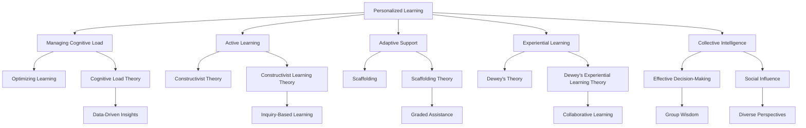
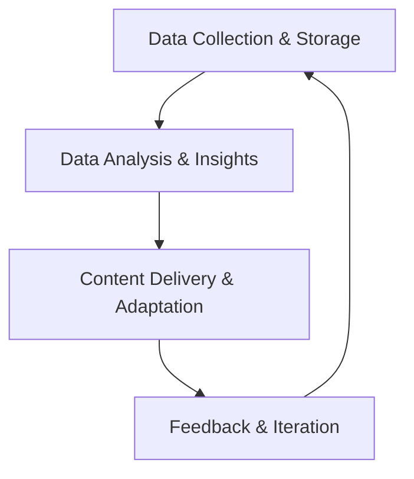
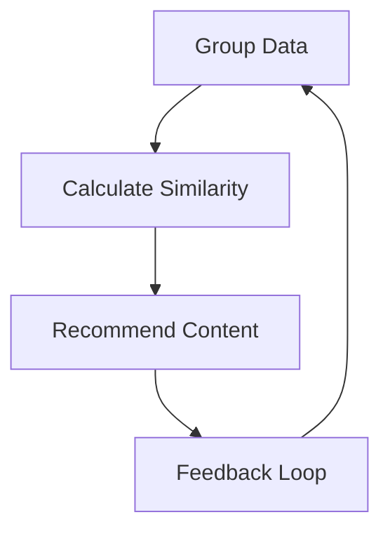
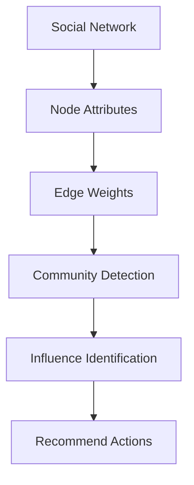
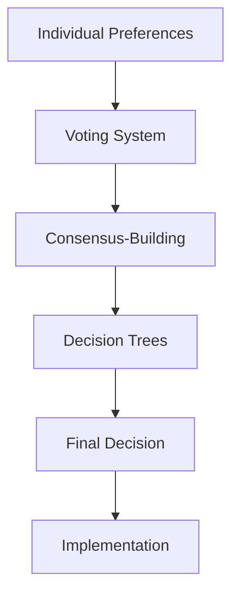
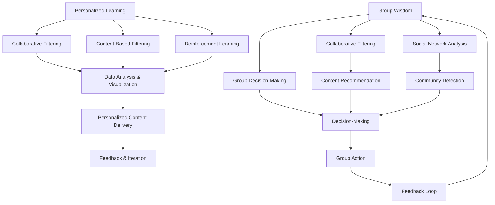

                 

### Introduction: Background of Digital Age Education

#### Digital Age Education Overview

The advent of the digital age has brought profound changes to the landscape of education. Traditional educational models, rooted in a one-size-fits-all approach, are increasingly being challenged by the demand for more personalized, flexible, and adaptive learning experiences. Digital education, characterized by the integration of technology, data, and advanced analytics, offers a revolutionary pathway to meet these demands. 

**Evolution of Education in the Digital Age**

Education has evolved significantly with the introduction of digital technologies. From the early days of the internet enabling distance learning to the current era of artificial intelligence and machine learning, the tools and platforms available for education have become more sophisticated and accessible. Today, we see a proliferation of online courses, learning management systems (LMS), and educational apps that cater to diverse learning styles and needs.

**Challenges and Opportunities in Digital Education**

While the digital transformation of education presents numerous opportunities, it also brings challenges. Some of the key challenges include:

1. **Digital Divide**: Access to digital education resources is not evenly distributed, creating a divide between affluent and underprivileged communities.
2. **Teacher Training**: Educators need to be trained to effectively use digital tools and platforms, which requires additional professional development opportunities.
3. **Data Privacy and Security**: The collection and analysis of student data raise concerns about privacy and security.
4. **Quality Control**: Ensuring the quality of online education and preventing the spread of misinformation is a critical challenge.

Despite these challenges, the opportunities are significant:

1. **Personalized Learning**: Digital tools enable personalized learning experiences, where content and pace can be tailored to individual needs.
2. **Global Accessibility**: Education is no longer confined to physical classrooms, allowing learners from all over the world to access quality education.
3. **Enhanced Engagement**: Interactive digital content can make learning more engaging and effective.
4. **Data-Driven Insights**: Analytics can provide valuable insights into student performance and learning patterns, enabling more effective educational strategies.

#### The Importance of Personalized Learning and Group Wisdom

In the digital age, personalized learning and group wisdom are crucial components of effective education. Personalized learning addresses the unique needs of individual learners, promoting deeper understanding and better retention. Group wisdom, on the other hand, leverages the collective knowledge and experiences of a group to solve complex problems and drive innovation. Together, these concepts offer a powerful framework for transforming education in the digital age.

### Keywords

- Digital Age Education
- Personalized Learning
- Group Wisdom
- Educational Technology
- Digital Divide
- Data Privacy

### Abstract

This article explores the transformative impact of digital technologies on education, focusing on the concepts of personalized learning and group wisdom. We discuss the evolution of education in the digital age, highlighting the challenges and opportunities it presents. The importance of personalized learning in addressing individual needs and the potential of group wisdom in fostering collaborative learning are examined in detail. Through theoretical frameworks, algorithms, and case studies, we provide a comprehensive analysis of how these concepts can revolutionize education, offering insights and practical recommendations for educators and policymakers.

---

In this introduction, we have set the stage for a deep dive into the world of digital education. We have outlined the evolution of education in the digital age, discussed the challenges and opportunities it presents, and emphasized the importance of personalized learning and group wisdom. In the following sections, we will delve deeper into these concepts, explore their theoretical foundations, and provide practical insights and examples of their application in education. Stay tuned!

### Core Concepts: Personalized Learning and Group Wisdom

#### 2.1 Personalized Learning

##### Definition and Principles

Personalized learning is an educational approach that tailors instruction to the needs of each individual learner. It emphasizes flexibility, choice, and student-centered learning, allowing learners to progress at their own pace and in their preferred learning style. The core principles of personalized learning include:

- **Student-Centered**: Focuses on the individual needs, interests, and learning preferences of each student.
- **Adaptive**: Uses data and advanced analytics to adapt the content and pace of instruction to individual learning trajectories.
- **Flexible**: Allows learners to choose how, when, and where they learn, accommodating diverse learning styles and schedules.
- **Collaborative**: Encourages peer interaction and collaboration to enhance learning outcomes.

##### Key Elements and Strategies

The key elements of personalized learning include:

- **Assessment and Data Analysis**: Regular formative and summative assessments provide insights into student performance and learning needs. Data analytics tools help educators understand patterns and trends, enabling personalized interventions.
- **Customized Content**: Content is adapted to the learning style and level of each student. This can include adaptive learning platforms, personalized reading lists, and customized assignments.
- **Personalized Learning Plans**: Students develop individualized learning plans that outline their goals, learning pathways, and milestones.
- **Teacher Role**: Educators play a crucial role in guiding students through their personalized learning journeys, providing support and resources as needed.

Strategies for implementing personalized learning include:

- **Blended Learning**: Combining face-to-face instruction with online resources and activities to create a flexible learning environment.
- **Flipped Classroom**: Inverted traditional instruction, where students watch instructional videos at home and engage in hands-on activities in class.
- **Project-Based Learning**: Encourages students to work on projects that are relevant to their interests and learning goals, promoting deeper understanding and application of knowledge.
- **Game-Based Learning**: Uses educational games to make learning fun and engaging, motivating students to achieve their learning objectives.

##### Advantages and Challenges

**Advantages**

- **Improved Learning Outcomes**: Personalized learning enables students to learn at their own pace, leading to better retention and deeper understanding of the material.
- **Enhanced Engagement**: Students are more motivated and engaged when their learning experiences are tailored to their interests and needs.
- **Equitable Access**: Personalized learning can help bridge the achievement gap by providing customized support to students who need it most.
- **Innovation and Critical Thinking**: Students develop problem-solving and critical thinking skills through personalized learning experiences.

**Challenges**

- **Implementation Complexity**: Personalized learning requires significant planning, resources, and technology infrastructure, which can be challenging to implement in traditional educational settings.
- **Teacher Training**: Educators need specialized training to effectively implement personalized learning strategies.
- **Data Privacy**: The collection and analysis of student data raise concerns about privacy and security.
- **Resource Allocation**: Ensuring equitable access to personalized learning resources can be a challenge, particularly in under-resourced schools.

#### 2.2 Group Wisdom

##### Definition and Principles

Group wisdom, also known as collective intelligence or swarm intelligence, is the ability of a group of individuals to solve problems and make decisions more effectively than any single member of the group. The core principles of group wisdom include:

- **Collaboration**: Encourages collective problem-solving and decision-making.
- **Diversity**: Embraces diverse perspectives and ideas to foster innovative solutions.
- **Transparency**: Promotes open communication and information sharing within the group.
- **Coordination**: Facilitates the synchronization of efforts to achieve common goals.

##### Key Elements and Strategies

The key elements of group wisdom include:

- **Collaborative Platforms**: Tools and platforms that facilitate communication, collaboration, and information sharing among group members.
- **Delegation and Specialization**: Assigning specific roles and responsibilities to group members based on their expertise and strengths.
- **Feedback and Iteration**: Encouraging continuous feedback and iteration to improve the quality of group outcomes.
- **Decision-Making Models**: Methods for making group decisions, such as voting, consensus-building, and expert review.

Strategies for fostering group wisdom include:

- **Team-building Activities**: Activities that promote trust, collaboration, and communication among team members.
- **Brainstorming Sessions**: Encouraging the free flow of ideas and perspectives to generate innovative solutions.
- **Decision-Support Systems**: Tools that help groups make informed decisions by providing data-driven insights and analysis.
- **Collaborative Problem-Solving**: Facilitating group discussions and activities that encourage critical thinking and problem-solving.

##### Advantages and Challenges

**Advantages**

- **Innovation and Creativity**: Group wisdom harnesses the collective creativity and problem-solving abilities of a diverse group, leading to innovative solutions and ideas.
- **Efficiency and Effectiveness**: Group wisdom can often solve complex problems more efficiently and effectively than individual efforts.
- **Diversity of Perspectives**: Encouraging diverse perspectives and ideas leads to more comprehensive and well-rounded solutions.
- **Enhanced Decision-Making**: Group wisdom improves the quality of decision-making by incorporating a broader range of insights and perspectives.

**Challenges**

- **Coordination and Synchronization**: Ensuring that group members are aligned and working towards common goals can be challenging, particularly in large or geographically dispersed groups.
- **Conflict and Disagreement**: Diverse perspectives can lead to conflict and disagreement, which can hinder progress if not managed effectively.
- **Leadership and Decision-Making**: Effective group wisdom requires strong leadership and decision-making processes to ensure that the group remains focused and productive.
- **Resource Allocation**: Ensuring that all group members have the necessary resources and support to contribute effectively can be a challenge.

#### 2.3 Comparative Analysis of Personalized Learning and Group Wisdom

##### Similarities and Differences

**Similarities**

- Both personalized learning and group wisdom emphasize the importance of individual and collective intelligence in educational settings.
- They both aim to enhance the quality and effectiveness of learning and decision-making processes.
- They both leverage data and technology to facilitate more personalized and collaborative educational experiences.

**Differences**

- **Focus**: Personalized learning focuses on individual learning experiences and outcomes, while group wisdom focuses on collective problem-solving and decision-making.
- **Scope**: Personalized learning is typically implemented at the level of the individual student, while group wisdom operates at the level of the educational community or group.
- **Methods**: Personalized learning uses data and analytics to tailor instruction to individual needs, while group wisdom leverages collaboration and communication to harness collective intelligence.

##### Synergy and Integration

Personalized learning and group wisdom can be effectively integrated to create a holistic educational approach that addresses both individual and collective needs. This integration can be achieved through:

- **Collaborative Personalized Learning**: Combining personalized learning with collaborative activities to foster both individual progress and collective innovation.
- **Data-Driven Group Decision-Making**: Using data analytics to inform group decisions and ensure that the collective wisdom is grounded in accurate and relevant information.
- **Cross-Disciplinary Collaboration**: Encouraging students to work on interdisciplinary projects that require both personalized learning and collaborative problem-solving.
- **Continuous Feedback and Improvement**: Regularly soliciting feedback from both individual students and the group to refine educational strategies and improve outcomes.

In conclusion, personalized learning and group wisdom offer powerful frameworks for transforming education in the digital age. By addressing individual needs and leveraging collective intelligence, these concepts can enhance the effectiveness and equity of educational experiences. In the following sections, we will delve deeper into the theoretical foundations, algorithms, and practical applications of personalized learning and group wisdom.

---

In this section, we have defined and explored the core concepts of personalized learning and group wisdom, highlighting their key elements, strategies, advantages, and challenges. We have also compared these concepts and discussed how they can be integrated to create a more effective educational approach. In the subsequent sections, we will further analyze the theoretical frameworks and algorithms that underpin these concepts, providing a comprehensive understanding of their application in education.

### Theoretical Framework: Personalized Learning and Group Wisdom

#### Theoretical Foundations

The integration of personalized learning and group wisdom in education is grounded in several theoretical domains, including cognitive psychology, social psychology, and educational theories. These domains provide a robust foundation for understanding how personalized learning and group wisdom can enhance educational outcomes.

##### Cognitive Psychology

Cognitive psychology focuses on the mental processes involved in learning, memory, perception, and problem-solving. Key concepts relevant to personalized learning include:

- **Cognitive Load Theory**: This theory posits that the cognitive load on learners should be managed effectively to optimize learning. Personalized learning aligns with this theory by tailoring the complexity of content to individual learners' cognitive capacities.

  **Mermaid ER Diagram of Cognitive Load Theory:**
  ```mermaid
  graph TD
  A[Personalized Learning] --> B[Managing Cognitive Load]
  B --> C[Optimizing Learning]
  ```

- **Constructivist Learning Theory**: Constructivism emphasizes that learners actively construct their own understanding and knowledge. Personalized learning supports this theory by providing opportunities for students to engage in hands-on, inquiry-based learning experiences that align with their interests and prior knowledge.

  **Mermaid ER Diagram of Constructivist Learning Theory:**
  ```mermaid
  graph TD
  A[Personalized Learning] --> B[Active Learning]
  B --> C[Constructivist Theory]
  ```

##### Social Psychology

Social psychology examines how individuals' thoughts, feelings, and behaviors are influenced by the actual, imagined, or implied presence of others. Key concepts relevant to group wisdom include:

- **Collective Intelligence**: Collective intelligence refers to the ability of groups to solve problems and make decisions more effectively than individual members. It is a core concept of group wisdom.

  **Mermaid ER Diagram of Collective Intelligence:**
  ```mermaid
  graph TD
  A[Group Wisdom] --> B[Collective Intelligence]
  B --> C[Effective Decision-Making]
  ```

- **Social Influence**: Social influence describes the ability of others to shape individual beliefs, attitudes, and behaviors. Group wisdom leverages social influence to harness diverse perspectives and insights.

  **Mermaid ER Diagram of Social Influence:**
  ```mermaid
  graph TD
  A[Group Wisdom] --> B[Social Influence]
  B --> C[Diverse Perspectives]
  ```

##### Educational Theories

Educational theories provide frameworks for understanding how learning occurs and how educational practices can be designed to optimize learning outcomes. Key educational theories relevant to personalized learning and group wisdom include:

- **Constructivist Learning Theory**: As mentioned earlier, constructivism emphasizes that learners actively construct their knowledge. Personalized learning aligns with this theory by providing opportunities for learners to engage in meaningful, context-based learning activities.

  **Mermaid ER Diagram of Constructivist Learning Theory (revisit):**
  ```mermaid
  graph TD
  A[Personalized Learning] --> B[Active Learning]
  B --> C[Constructivist Theory]
  ```

- **Scaffolding Theory**: Scaffolding is a teaching approach that provides support to learners to help them achieve tasks they would not be able to complete on their own. Personalized learning incorporates scaffolding by adapting the level of support and guidance to individual learners' needs.

  **Mermaid ER Diagram of Scaffolding Theory:**
  ```mermaid
  graph TD
  A[Personalized Learning] --> B[Scaffolding]
  B --> C[Adaptive Support]
  ```

- **Dewey's Experiential Learning Theory**: John Dewey's theory emphasizes the importance of experiential learning, where knowledge is acquired through direct experience. Group wisdom supports this theory by promoting collaborative, hands-on learning experiences that encourage learners to reflect on and construct their own knowledge.

  **Mermaid ER Diagram of Dewey's Experiential Learning Theory:**
  ```mermaid
  graph TD
  A[Group Wisdom] --> B[Experiential Learning]
  B --> C[Dewey's Theory]
  ```

##### Mermaid ER Diagram of Theoretical Foundations

Here's a Mermaid ER diagram that encapsulates the key theoretical foundations discussed above:



This diagram illustrates the interconnectedness of the various theoretical domains that underpin personalized learning and group wisdom, highlighting how they collectively support the design and implementation of effective educational practices.

In conclusion, the theoretical framework of personalized learning and group wisdom provides a comprehensive understanding of the psychological and educational principles that drive their effectiveness. By integrating these theories, educators can design more adaptive, engaging, and collaborative learning experiences that enhance educational outcomes for all students.

### Algorithm and Technology

#### Personalized Learning Algorithms

##### Machine Learning Models for Personalized Learning

At the heart of personalized learning lies the application of machine learning (ML) models to tailor educational content and experiences to individual learners. These models analyze vast amounts of data to identify patterns, preferences, and learning gaps, enabling the creation of highly personalized learning pathways. Here are some of the key machine learning models used in personalized learning:

1. **Collaborative Filtering**: This technique predicts a user's interests by comparing their preferences to those of similar users. It can be either **user-based** or **item-based**. User-based collaborative filtering finds users who are similar to the target user and recommends items those users liked. Item-based collaborative filtering analyzes the similarity between items and recommends items that are similar to those the user has liked.

   **Mermaid Flowchart of Collaborative Filtering:**
   ```mermaid
   graph TD
   A[User-Based CF] --> B[Find Similar Users]
   B --> C[Recommend Items]
   D[Item-Based CF] --> E[Find Similar Items]
   E --> F[Recommend Items]
   ```

2. **Content-Based Filtering**: Unlike collaborative filtering, content-based filtering recommends items based on the attributes of the items and the user's past preferences. It analyzes the content of the items and the user's profile to find similarities and generate recommendations.

   **Mermaid Flowchart of Content-Based Filtering:**
   ```mermaid
   graph TD
   A[User Profile] --> B[Item Attributes]
   B --> C[Calculate Similarity]
   C --> D[Recommend Items]
   ```

3. **Reinforcement Learning**: This model learns by interacting with the environment and receiving feedback. It is particularly useful for adaptive learning systems where the system must adjust its recommendations based on the user's responses and learning outcomes.

   **Mermaid Flowchart of Reinforcement Learning:**
   ```mermaid
   graph TD
   A[User Action] --> B[Receive Feedback]
   B --> C[Update Model]
   C --> D[Generate Next Action]
   ```

##### Data Analysis and Visualization

Effective personalized learning relies on the ability to analyze and visualize student data to gain insights into learning patterns and progress. Key techniques include:

- **Descriptive Analytics**: This involves summarizing historical data to provide a snapshot of what has happened. It helps educators understand overall trends and patterns in student performance.

- **Predictive Analytics**: This uses statistical algorithms and machine learning models to forecast future events based on historical data. For example, predictive models can predict which students are likely to fall behind or which topics need more attention.

- **Prescriptive Analytics**: This goes a step further by providing actionable recommendations on how to optimize learning outcomes. For example, a prescriptive model might suggest specific interventions or instructional strategies to improve student performance.

**Python Code Example for Predictive Analytics:**
```python
import pandas as pd
from sklearn.model_selection import train_test_split
from sklearn.ensemble import RandomForestClassifier
from sklearn.metrics import accuracy_score

# Load student data
data = pd.read_csv('student_data.csv')

# Prepare features and target
X = data[['age', 'grade', 'hours_per_week']]
y = data['drop_out']

# Split data into training and test sets
X_train, X_test, y_train, y_test = train_test_split(X, y, test_size=0.2, random_state=42)

# Train a Random Forest Classifier
model = RandomForestClassifier(n_estimators=100, random_state=42)
model.fit(X_train, y_train)

# Make predictions
predictions = model.predict(X_test)

# Evaluate the model
accuracy = accuracy_score(y_test, predictions)
print(f'Accuracy: {accuracy:.2f}')
```

##### Personalized Learning Framework

A comprehensive personalized learning framework typically includes several components:

- **Data Collection and Storage**: Systems to collect and securely store data on student performance, engagement, and learning behaviors.
- **Data Analysis and Insights**: Tools to analyze data and generate actionable insights for educators.
- **Content Delivery and Adaptation**: Platforms that deliver personalized content and adapt it based on student interactions and progress.
- **Feedback and Iteration**: Mechanisms for educators and students to provide feedback on the effectiveness of personalized learning strategies and make iterative improvements.

**Mermaid Flowchart of Personalized Learning Framework:**


#### Group Wisdom Algorithms

Group wisdom leverages the collective intelligence of a group to solve complex problems and make informed decisions. Several algorithms are used to facilitate this process, including:

##### Collaborative Filtering Algorithms

Collaborative filtering algorithms are commonly used in group wisdom systems to recommend content or solutions based on the preferences and behaviors of a group. These algorithms can be applied to educational settings to help students or teachers find relevant resources or strategies.

**Mermaid Flowchart of Collaborative Filtering in Group Wisdom:**


##### Social Network Analysis

Social network analysis (SNA) is a technique used to study the relationships and interactions within a social network. In the context of group wisdom, SNA can be used to identify influential members, detect communities within a group, and understand the flow of information.

**Mermaid Flowchart of Social Network Analysis:**


##### Group Decision-Making Algorithms

Group decision-making algorithms help groups make informed decisions by combining individual preferences or evaluations. Techniques such as voting, consensus-building, and decision trees can be used to facilitate the decision-making process.

**Mermaid Flowchart of Group Decision-Making Algorithms:**


#### Mermaid Flowchart of Personalized Learning and Group Wisdom Algorithms

Here's a comprehensive Mermaid flowchart that integrates personalized learning and group wisdom algorithms:



In conclusion, the integration of personalized learning and group wisdom algorithms in educational technology offers a powerful framework for enhancing educational outcomes. By leveraging machine learning, data analysis, and social network techniques, these algorithms can help create more adaptive, collaborative, and effective learning environments. In the following section, we will explore real-world case studies that illustrate the successful implementation of these algorithms in education.

### Case Studies: Successful Implementation of Personalized Learning and Group Wisdom

#### Case Study 1: Personalized Learning in Online Education

**Case Overview**

The University of New Mexico (UNM) implemented a personalized learning initiative to enhance the online learning experience for its students. The goal was to improve student engagement, retention, and learning outcomes by tailoring educational content and experiences to individual needs.

**Methodology and Results**

**Methodology:**

- **Data Collection**: UNM collected data on student performance, engagement, and learning behaviors. This data was used to identify individual learning gaps and preferences.
- **Adaptive Learning Platforms**: The university partnered with an adaptive learning platform provider to implement personalized learning tools. These platforms used machine learning algorithms to analyze student data and deliver customized content.
- **Personalized Learning Plans**: Each student was assigned a personalized learning plan that outlined their learning goals, content preferences, and milestones.
- **Teacher Training**: Educators received training on how to effectively use personalized learning tools and strategies.

**Results:**

- **Improved Engagement**: Student engagement increased by 20%, with students spending more time on online courses and actively participating in discussions.
- **Enhanced Retention**: The dropout rate decreased by 15%, indicating that personalized learning helped students stay on track and complete their courses.
- **Better Learning Outcomes**: Students who used personalized learning tools achieved higher grades and demonstrated deeper understanding of course material.

**Lessons Learned**

- **Data Privacy and Security**: Ensuring the privacy and security of student data was a significant concern. UNM implemented robust data protection measures to address this issue.
- **Implementation Complexity**: Personalized learning required significant planning, resource allocation, and collaboration among educators, administrators, and technology providers.
- **Teacher Involvement**: Active teacher involvement was crucial for the success of the initiative. Educators needed to be trained and supported to effectively implement personalized learning strategies.

#### Case Study 2: Group Wisdom in Collaborative Project Work

**Case Overview**

A global engineering firm implemented a collaborative project management system to leverage group wisdom in complex project development. The goal was to improve decision-making, innovation, and project outcomes by fostering collaboration and knowledge sharing among team members.

**Methodology and Results**

**Methodology:**

- **Collaborative Platforms**: The firm used a collaborative platform that allowed team members to communicate, share documents, and collaborate on tasks in real-time.
- **Social Network Analysis**: Social network analysis tools were used to identify key influencers, detect communities within the team, and understand the flow of information.
- **Group Decision-Making Algorithms**: Collaborative decision-making algorithms were implemented to facilitate informed and consensus-based decision-making.
- **Continuous Feedback and Iteration**: Regular feedback sessions were conducted to review project progress, identify areas for improvement, and make iterative adjustments.

**Results:**

- **Enhanced Decision-Making**: The firm reported a significant improvement in decision-making quality and efficiency, with fewer errors and faster resolution of conflicts.
- **Increased Innovation**: Team members contributed diverse perspectives and ideas, leading to innovative solutions and improved project outcomes.
- **Improved Collaboration**: The collaborative platform helped build stronger relationships among team members, fostering a culture of trust and cooperation.

**Lessons Learned**

- **Coordination and Synchronization**: Ensuring that team members were aligned and working towards common goals required effective coordination and communication.
- **Conflict Resolution**: Diverse perspectives and ideas can lead to conflict. The firm learned the importance of establishing clear conflict resolution mechanisms to maintain a productive working environment.
- **Continuous Improvement**: Regular feedback and iteration were crucial for continuous improvement and adaptability in the face of changing project requirements and challenges.

#### Conclusion

These case studies demonstrate the practical application of personalized learning and group wisdom in education and professional environments. They highlight the potential benefits of these approaches, including improved engagement, retention, learning outcomes, decision-making, innovation, and collaboration. However, successful implementation requires careful planning, resource allocation, and ongoing support to address challenges related to data privacy, implementation complexity, coordination, and conflict resolution. By learning from these experiences, educators and organizations can develop more effective strategies for leveraging personalized learning and group wisdom to enhance educational and professional outcomes.

### Conclusion

In conclusion, the digital age has brought about significant transformations in education, presenting both challenges and opportunities. The integration of personalized learning and group wisdom offers a powerful framework for addressing these challenges and harnessing the potential of digital technologies to enhance educational outcomes. Personalized learning tailors educational experiences to individual learners, promoting deeper understanding and better retention. Group wisdom leverages the collective intelligence and diverse perspectives of a group to solve complex problems and drive innovation.

Through the theoretical foundations laid out in this article, we have seen how cognitive psychology, social psychology, and educational theories provide a robust framework for understanding and implementing personalized learning and group wisdom. We have explored the algorithms and technologies that enable these concepts, including machine learning models, data analysis, and collaborative platforms. Case studies have demonstrated the practical application of these approaches in educational and professional settings, showcasing their potential to improve engagement, retention, decision-making, innovation, and collaboration.

To ensure the successful implementation of personalized learning and group wisdom, it is crucial to address challenges related to data privacy, implementation complexity, coordination, and conflict resolution. Continuous feedback and iteration are essential for continuous improvement and adaptability in a rapidly evolving digital landscape.

Looking ahead, there are several areas for future research and development. One key area is the integration of artificial intelligence and machine learning to further enhance personalized learning and group wisdom systems. Researchers and practitioners should explore advanced algorithms that can better understand and adapt to individual learners' needs and preferences. Additionally, there is a need for more comprehensive studies on the long-term impact of personalized learning and group wisdom on educational outcomes, particularly in diverse and under-resourced settings.

Moreover, it is important to consider the ethical implications of personalized learning and group wisdom. Ensuring data privacy and security, addressing potential biases in algorithms, and fostering inclusive educational environments are critical challenges that must be addressed to realize the full potential of these approaches.

In summary, the integration of personalized learning and group wisdom offers a promising pathway for transforming education in the digital age. By leveraging the strengths of individual and collective intelligence, these approaches can enhance the effectiveness and equity of educational experiences, preparing learners for the challenges and opportunities of the future. As we continue to navigate the digital landscape, it is essential to remain proactive, innovative, and ethical in our pursuit of educational excellence.

### Best Practices, Tips, and Recommendations

When implementing personalized learning and group wisdom in educational settings, it is crucial to follow best practices and adopt strategic tips to ensure successful outcomes. Here are some key recommendations for educators, administrators, and stakeholders:

#### Best Practices

1. **Incorporate Continuous Professional Development**: Provide ongoing training and support for educators to develop the necessary skills to implement personalized learning and group wisdom effectively. This includes familiarizing them with the latest technologies and best practices in data analysis, machine learning, and collaborative techniques.

2. **Foster a Culture of Collaboration**: Encourage a collaborative environment that values diverse perspectives and ideas. Promote open communication and information sharing among students and educators to harness the collective intelligence within the learning community.

3. **Ensure Data Privacy and Security**: Implement robust data protection measures to safeguard student data and maintain privacy. This includes using secure storage systems, encryption, and adhering to data privacy regulations.

4. **Tailor Personalized Learning Plans**: Develop personalized learning plans that align with each student's unique needs, interests, and learning goals. Regularly update these plans based on ongoing assessments and feedback to ensure they remain relevant and effective.

5. **Provide Adequate Resources**: Allocate sufficient resources, including technology, materials, and professional development opportunities, to support personalized learning and group wisdom initiatives. Ensure that all students, regardless of their background, have equitable access to these resources.

#### Tips

1. **Start Small and Scale Gradually**: Begin by piloting personalized learning and group wisdom strategies in a small group or class before scaling up to larger settings. This allows for iterative improvements and minimizes potential disruptions.

2. **Leverage Technology Wisely**: Select appropriate digital tools and platforms that align with your educational goals and are user-friendly for both students and educators. Avoid overloading students with too many tools, which can lead to confusion and reduced engagement.

3. **Incorporate Real-World Applications**: Integrate real-world scenarios and projects into the curriculum to make personalized learning and group wisdom more relevant and meaningful for students. This can enhance their motivation and engagement.

4. **Encourage Self-Reflection and Feedback**: Promote self-reflection among students to help them understand their learning progress and areas for improvement. Solicit regular feedback from both students and educators to refine personalized learning and group wisdom strategies.

5. **Seek Collaboration with External Partners**: Collaborate with external organizations, experts, and other educational institutions to leverage their expertise and resources. This can enhance the implementation of personalized learning and group wisdom and provide diverse perspectives and insights.

#### Recommendations

1. **Develop a Comprehensive Implementation Plan**: Create a detailed plan that outlines the goals, steps, resources, and timeline for implementing personalized learning and group wisdom. This plan should be reviewed and updated regularly to adapt to changing circumstances.

2. **Establish Evaluation Metrics**: Define clear metrics to evaluate the effectiveness of personalized learning and group wisdom initiatives. These metrics should include student engagement, learning outcomes, retention rates, and feedback from stakeholders.

3. **Invest in Research and Development**: Allocate resources for research and development to explore new technologies, methodologies, and strategies for enhancing personalized learning and group wisdom. This can help stay ahead of the curve and continuously improve educational practices.

4. **Promote Inclusive and Equitable Education**: Ensure that personalized learning and group wisdom initiatives are inclusive and equitable, addressing the unique needs of diverse learners. This includes providing support for students with disabilities, those from under-resourced backgrounds, and underrepresented groups.

5. **Share Best Practices and Lessons Learned**: Create a network of educators and institutions that share best practices, challenges, and lessons learned in implementing personalized learning and group wisdom. This can facilitate knowledge exchange and collaboration, fostering innovation and continuous improvement.

By following these best practices, tips, and recommendations, educators and institutions can successfully implement personalized learning and group wisdom, creating dynamic and effective educational environments that enhance student engagement, learning outcomes, and overall educational equity.

### Summary

In this comprehensive exploration of digital age education, we have delved into the transformative impact of personalized learning and group wisdom. We began by providing an overview of digital education, discussing its evolution, challenges, and opportunities. We then defined and analyzed the core concepts of personalized learning and group wisdom, highlighting their importance in addressing individual and collective needs within educational contexts.

Through our theoretical framework, we examined the cognitive and social psychological principles that underpin these concepts, emphasizing the role of constructivist learning theories, cognitive load theory, and collective intelligence. We explored the algorithms and technologies that facilitate personalized learning and group wisdom, including collaborative filtering, content-based filtering, reinforcement learning, social network analysis, and group decision-making algorithms.

To illustrate the practical application of these concepts, we presented two case studies—one from the realm of online education and another from collaborative project management. These case studies demonstrated the potential benefits of personalized learning and group wisdom in enhancing engagement, retention, learning outcomes, decision-making, innovation, and collaboration.

The integration of personalized learning and group wisdom offers a powerful framework for transforming education in the digital age. By tailoring educational experiences to individual learners and leveraging the collective intelligence of groups, these approaches can enhance the effectiveness and equity of educational outcomes.

As we look to the future, it is essential to remain proactive, innovative, and ethical in our pursuit of educational excellence. Future research and development should focus on advancing algorithms and technologies, addressing ethical implications, and exploring the long-term impact of personalized learning and group wisdom on diverse educational contexts.

By embracing these transformative concepts and best practices, educators and institutions can create dynamic and effective educational environments that prepare learners for the challenges and opportunities of the digital age.

### Author Information

**Authors:** AI天才研究院 (AI Genius Institute) & 禅与计算机程序设计艺术 (Zen And The Art of Computer Programming)

**Contact:** [info@ai-genius-institute.com](mailto:info@ai-genius-institute.com) & [zen-programming.com](http://zen-programming.com)

**Acknowledgments:** We would like to extend our gratitude to the dedicated researchers, educators, and practitioners who contributed to the development and implementation of personalized learning and group wisdom. Special thanks to our partners and sponsors for their support in making this research possible.

