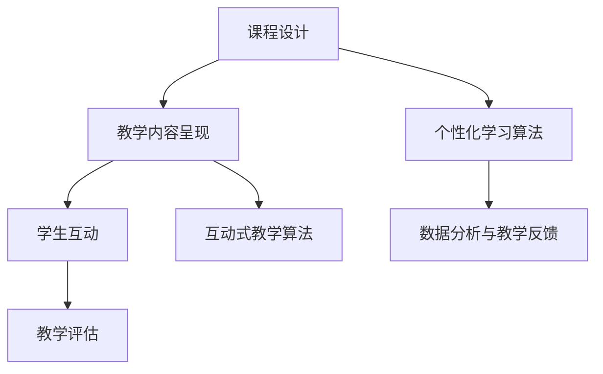
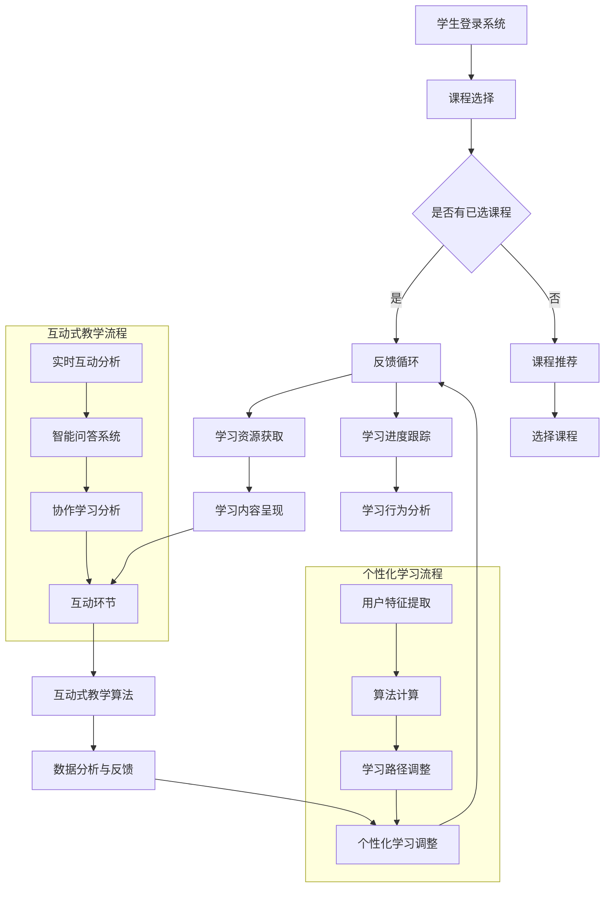
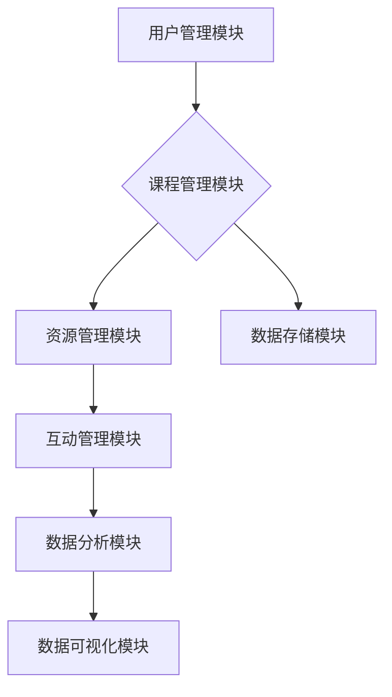
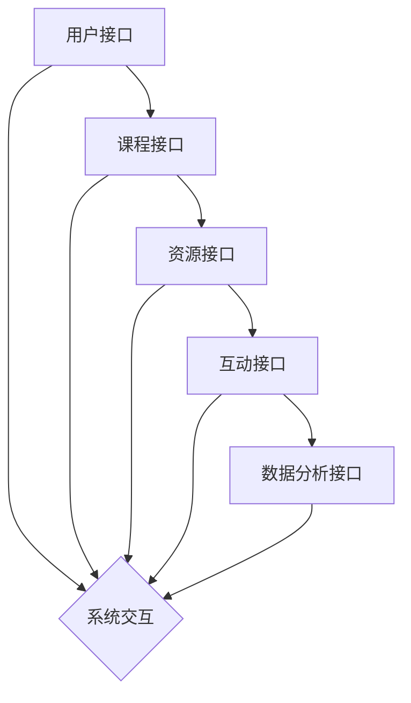

                 

### 第一部分：引言

#### 第1章：问题背景与核心概念

**1.1.1 数字时代的文化传承背景**

在数字时代，我们的生活方式和社会结构正在经历深刻的变革。传统的文化传承面临着前所未有的挑战与机遇。数字技术的迅猛发展，使得信息的传播变得更加迅速和广泛，这为文化传承提供了新的途径和方式。然而，与此同时，传统文化的保护、传承与创新也面临着诸多问题。

首先，传统文化的数字化面临一系列挑战。传统艺术形式多样，包括绘画、音乐、舞蹈、戏曲等，它们的数字化需要考虑到艺术形式的独特性和复杂性。此外，文化传承中的地域性和文化差异，也是数字化过程中需要克服的重要障碍。

另一方面，数字时代的文化传承也拥有巨大的机遇。通过网络和数字平台，传统艺术可以突破地域限制，达到更广泛的受众。此外，虚拟现实（VR）和增强现实（AR）等新兴技术，为传统艺术的展示和体验提供了新的可能性。

**1.1.2 传统艺术的重要性**

传统艺术是一个国家或民族的文化瑰宝，它承载着丰富的历史和文化信息。传统艺术不仅具有美学价值，还承载着民族的精神和记忆。通过传统艺术的传承，我们可以更好地理解和传承民族文化，增强民族自豪感和认同感。

同时，传统艺术在现代社会中也有着重要的现实意义。它为现代人提供了一种逃离现实压力、寻找心灵慰藉的途径。此外，传统艺术在教育和心理治疗等领域也发挥着重要作用，它有助于培养人们的审美能力和创造力，促进身心健康。

**1.1.3 在线教学的兴起**

随着互联网的普及和技术的进步，在线教学逐渐成为一种重要的教育形式。它不仅打破了传统教育的时空限制，还为个性化学习和资源共享提供了新的途径。在线教学的优势在于，它可以根据学生的个性化需求进行教学，提高学习效率。

在线教学的兴起，为传统艺术的传承提供了新的机会。通过在线平台，传统艺术的教师和学生可以跨越地域限制，进行实时互动。此外，在线教学还可以通过视频、音频、图文等多种形式，更生动地传递艺术知识和技能。

**1.1.4 数字传播的角色**

数字传播在文化传承中扮演着至关重要的角色。数字传播不仅使得信息的传播更加迅速和广泛，还为传统艺术提供了新的传播渠道。通过社交媒体、网络平台等数字传播工具，传统艺术可以迅速吸引大量受众，扩大其影响力。

此外，数字传播还有助于建立传统艺术的品牌形象，提升其市场价值。通过数字传播，传统艺术可以与当代文化相结合，创造出新的艺术形式，从而更好地适应现代社会的需求。

#### **1.2 核心概念与联系**

**1.2.1 数字文化遗产的概念**

数字文化遗产是指利用数字技术对传统文化遗产进行数字化保存、展示和传播的过程。它不仅包括传统艺术作品、文献资料等，还包括与传统文化相关的知识和技能。数字文化遗产的目标是保护和传承人类的文化遗产，使其在现代社会中得以延续和发展。

**1.2.2 在线教学模型**

在线教学模型是指利用互联网和数字技术进行教学的过程和方式。它包括课程设计、教学内容呈现、学生互动、教学评估等多个环节。在线教学模型的核心在于利用数字技术提供个性化的学习体验，提高教学效果。

**1.2.3 数字传播机制**

数字传播机制是指利用互联网和数字技术进行信息传播的过程和方式。它包括信息内容创作、传播渠道选择、受众分析、传播效果评估等多个环节。数字传播机制的目标是高效、准确地传递信息，实现信息价值的最大化。

**1.2.4 ER图：实体关系架构**

ER图（Entity-Relationship Diagram）是用于描述实体及其关系的图形化工具。在数字文化遗产、在线教学和数字传播中，ER图可以用于描述各个实体及其之间的关系。通过ER图，我们可以清晰地看到数字时代文化传承的各个组成部分及其相互联系。

#### **1.3 书籍结构概述**

**1.3.1 目标与读者**

本书的目标是探讨数字时代文化传承的理论与实践，特别是传统艺术的在线教学与传播。读者对象包括对传统文化和数字技术感兴趣的学者、研究人员、教育工作者以及艺术爱好者。

**1.3.2 内容结构**

本书分为三个部分：第一部分为引言，介绍数字时代文化传承的背景、核心概念和重要性；第二部分探讨在线教学的理论基础和数字传播机制；第三部分通过成功案例研究和项目实战，展示传统艺术在线教学与传播的实践技巧和策略。

**1.3.3 读者期望的学习成果**

通过阅读本书，读者可以：
- 了解数字时代文化传承的背景和重要性；
- 掌握在线教学和数字传播的基本原理和实践技巧；
- 学会设计并实施传统艺术的在线教学项目；
- 通过成功案例和项目实战，获得实际操作经验。

#### **1.4 本章小结**

本章介绍了数字时代文化传承的背景、核心概念和重要性，以及本书的结构和目标。通过本章的学习，读者可以初步了解数字时代文化传承的基本情况和本书的内容安排，为后续章节的学习打下基础。

---

## 第二部分：在线教学的理论基础

### **第2章：在线教学原理**

#### **2.1 在线教学的基本概念**

在线教学，也称为远程教学或网络教学，是指通过互联网和数字技术进行教学的过程。它打破了传统课堂教学的时间和空间限制，使得学生可以随时随地学习。在线教学包括课程设计、教学内容呈现、学生互动、教学评估等多个环节。

在线教学的基本概念包括：
- **课程设计**：课程设计是教学的核心，它包括教学目标、教学内容、教学方法、教学评价等。有效的课程设计需要充分考虑学生的需求和特点，以实现最佳的教学效果。
- **教学内容呈现**：教学内容呈现是指如何将教学知识以学生易于理解的方式呈现。在线教学可以利用文字、图片、视频、音频等多种形式进行教学内容呈现，以提高学生的学习兴趣和效果。
- **学生互动**：学生互动是教学过程中的重要环节，它包括学生与学生、学生与教师之间的交流与互动。有效的学生互动可以促进学生的学习参与和深度理解。
- **教学评估**：教学评估是衡量教学效果的重要手段。在线教学评估可以通过测试、作业、讨论等多种形式进行，以全面了解学生的学习情况和效果。

#### **2.2 教学模式对比分析**

在线教学与传统教学模式相比，具有显著的不同之处。传统教学模式通常依赖于教室和教师的面对面教学，而在线教学则通过互联网和数字技术进行教学。以下是两种教学模式的对比分析：

**2.2.1 优势对比**

- **灵活性**：在线教学具有更高的灵活性，学生可以随时随地学习，不受时间和地点的限制。这种灵活性特别适合那些有工作、家庭等生活压力的学生。
- **个性化**：在线教学可以根据学生的个性化需求进行教学，提供个性化的学习路径和资源。这有助于提高学生的学习效果和满意度。
- **资源共享**：在线教学可以共享丰富的教学资源，如电子书籍、视频教程、在线论坛等，学生可以方便地获取所需的学习资料。

**2.2.2 劣势对比**

- **互动性**：在线教学的互动性相对较弱，学生与教师、同学之间的交流可能不如传统教学那么直接和频繁。
- **技术依赖**：在线教学依赖于互联网和数字技术，如果网络不稳定或技术设备有问题，可能会影响教学效果。
- **自主学习能力**：在线教学要求学生具备较强的自主学习能力，否则可能会在学习过程中遇到困难。

#### **2.3 在线教学的优势与挑战**

**2.3.1 优势**

- **灵活性**：如前所述，在线教学具有高度的灵活性，学生可以根据自己的时间和节奏进行学习。
- **个性化**：在线教学可以根据学生的学习风格、兴趣和需求，提供个性化的教学资源和辅导。
- **资源共享**：在线教学可以共享全球范围内的教学资源和专业知识，提高学习效率。

**2.3.2 挑战**

- **技术依赖**：在线教学对技术和设备的依赖性较高，网络稳定性和设备性能都会影响教学效果。
- **自主学习能力**：在线教学要求学生具备较强的自主学习能力和自我管理能力。
- **互动性**：在线教学的互动性相对较弱，可能影响学生的学习参与度和学习体验。

#### **2.4 教学效果评估**

教学效果评估是衡量在线教学质量和效果的重要手段。有效的教学效果评估应该包括以下几个方面：

**2.4.1 学习成果评估**

学习成果评估主要关注学生学习后的知识和技能掌握情况。这可以通过期末考试、作业、项目等多种形式进行评估。例如，学生是否能够理解并应用所学知识，是否能够完成相关的实际操作等。

**2.4.2 学习参与度评估**

学习参与度评估主要关注学生在学习过程中的参与程度。这可以通过学生的在线互动、论坛讨论、作业提交情况等多种形式进行评估。例如，学生是否积极参与讨论，是否按时完成作业等。

**2.4.3 学习满意度评估**

学习满意度评估主要关注学生对在线教学的整体满意程度。这可以通过问卷调查、反馈表等多种形式进行评估。例如，学生对教学内容的满意度、教学方法的有效性等。

#### **2.5 技术工具与平台**

在线教学需要依赖多种技术工具和平台，以下是一些常用的技术工具和平台：

**2.5.1 常用在线教学工具**

- **学习管理系统（LMS）**：如Moodle、Canvas、Blackboard等，用于课程管理、作业提交、在线测试等。
- **视频会议工具**：如Zoom、Microsoft Teams、Google Meet等，用于实时互动和讨论。
- **互动平台**：如Slack、Discord、Telegram等，用于学生之间的交流与合作。

**2.5.2 教学平台选择**

选择合适的在线教学平台对于教学效果至关重要。以下是一些选择教学平台的考虑因素：

- **功能丰富性**：平台应具备丰富的功能，如课程管理、作业提交、在线测试、互动讨论等。
- **用户体验**：平台的用户体验应良好，易于操作和使用。
- **技术支持**：平台应提供良好的技术支持，包括技术培训、故障排除等。
- **成本效益**：平台的价格应合理，性价比高。

**2.5.3 技术支持的在线教学创新**

随着技术的不断进步，在线教学也在不断创新。以下是一些利用技术支持的在线教学创新：

- **虚拟现实（VR）**：通过VR技术，学生可以身临其境地体验艺术作品和现场演出，增强学习体验。
- **增强现实（AR）**：通过AR技术，学生可以在现实环境中增强艺术作品的表现，提升学习兴趣。
- **人工智能（AI）**：通过AI技术，可以提供个性化学习路径、智能问答系统、自动化作业批改等。

#### **2.6 算法在在线教学中的应用**

**2.6.1 个性化学习算法**

个性化学习算法是近年来在线教学研究的重要方向。它通过分析学生的学习行为和需求，为学生提供个性化的学习路径和资源。以下是一些常用的个性化学习算法：

- **协同过滤算法**：通过分析其他学生的选择和评价，为当前学生推荐相似的学习资源。
- **基于内容的推荐算法**：根据学习资源的主题、标签、关键词等信息，为当前学生推荐相关的学习资源。
- **混合推荐算法**：结合协同过滤和基于内容的推荐算法，提供更精准的推荐结果。

**2.6.2 互动式教学算法**

互动式教学算法旨在提高在线教学的互动性和参与度。以下是一些常用的互动式教学算法：

- **实时互动算法**：通过实时视频、语音、聊天等方式，提高教师和学生之间的互动性。
- **智能问答系统**：通过自然语言处理技术，为学生提供智能化的问答服务，增强学习体验。
- **协作学习算法**：通过分析学生的协作行为和互动质量，优化协作学习过程。

**2.6.3 数据分析与教学反馈**

数据分析是评估在线教学效果的重要手段。以下是一些常用的数据分析方法：

- **学习行为分析**：通过分析学生的学习行为，如学习时间、学习频率、学习路径等，了解学生的学习情况和需求。
- **作业分析**：通过分析学生的作业成绩、答题情况等，了解学生的知识掌握情况。
- **反馈分析**：通过收集学生的反馈意见，了解学生对教学内容的满意度、教学方法的有效性等。

**2.6.4 算法与在线教学的mermaid流程图**

为了更好地理解算法在在线教学中的应用，我们可以使用mermaid绘制一个流程图。以下是一个简单的mermaid流程图示例：



这个流程图展示了在线教学的基本环节以及算法的应用。通过这个流程图，我们可以清晰地看到算法在在线教学中的作用和关系。

#### **2.7 算法与在线教学的mermaid流程图**

为了更好地理解算法在在线教学中的应用，我们可以使用mermaid绘制一个详细的流程图。以下是算法与在线教学流程图：



这个mermaid流程图详细展示了学生从登录系统到学习资源获取、互动环节，再到数据分析和个性化学习调整的整个过程。通过这个流程图，我们可以更清晰地理解算法在在线教学中的作用和流程。

#### **2.8 本章小结**

本章介绍了在线教学的基本概念、教学模式对比分析、在线教学的优势与挑战、教学效果评估、技术工具与平台以及算法在在线教学中的应用。通过本章的学习，读者可以了解在线教学的基本原理和核心要素，为后续章节的学习打下基础。

---

## 第三部分：数字传播理论

### **第3章：数字传播理论**

#### **3.1 数字传播的基本原理**

数字传播是指利用互联网和数字技术进行信息传播的过程。它包括信息内容创作、传播渠道选择、受众分析、传播效果评估等多个环节。数字传播的基本原理可以概括为以下几点：

**1. 信息内容创作**：数字传播的第一步是创作有价值、有趣、引人入胜的内容。内容是传播的核心，它决定了受众是否愿意接收和传播信息。

**2. 传播渠道选择**：数字传播的渠道多种多样，包括社交媒体、电子邮件、短信、APP等。选择合适的传播渠道对于提高传播效果至关重要。例如，社交媒体适合快速传播，而电子邮件适合深度传播。

**3. 受众分析**：受众分析是数字传播的重要环节。通过分析受众的年龄、性别、兴趣、行为等特征，可以更精准地定位目标受众，提高传播效果。

**4. 传播效果评估**：传播效果评估是衡量数字传播效果的重要手段。通过分析传播效果数据，如点击率、转发量、评论数等，可以评估传播效果，为后续传播策略调整提供依据。

#### **3.2 传统艺术数字传播的挑战与机遇**

传统艺术数字传播面临着一系列挑战和机遇。以下是主要挑战和机遇的分析：

**3.2.1 挑战**

- **内容创作难度**：传统艺术形式多样，包括绘画、音乐、舞蹈、戏曲等，数字化内容创作需要考虑到艺术形式的独特性和复杂性。
- **受众分析困难**：传统艺术的受众相对固定，数字化传播需要更精准地分析受众特征，以实现有效传播。
- **传播渠道选择**：传统艺术数字化传播需要选择合适的渠道，以吸引更多的受众。社交媒体、电子邮件、APP等渠道各有优缺点，需要综合考虑。

**3.2.2 机遇**

- **传播范围广泛**：数字传播可以突破地域限制，将传统艺术传播到全球各地，扩大其影响力。
- **互动性增强**：数字传播可以通过视频、音频、图文等多种形式，提供更生动的艺术体验，增强受众的互动性。
- **创新传播方式**：虚拟现实（VR）和增强现实（AR）等新兴技术，为传统艺术数字传播提供了新的可能性，创造新的艺术形式。

#### **3.3 社交媒体与数字传播**

社交媒体是数字传播的重要渠道，它具有传播速度快、互动性强、受众广泛等特点。以下是社交媒体在数字传播中的应用：

**3.3.1 传播速度快**：社交媒体上的信息可以迅速传播，短时间内达到大量受众。例如，一条微博或微信朋友圈的动态，可以迅速传播到数十万甚至数百万的用户。

**3.3.2 互动性强**：社交媒体提供了丰富的互动功能，如评论、点赞、转发等，用户可以与内容创作者和其他用户进行实时互动。这种互动性可以增强受众的参与度和忠诚度。

**3.3.3 受众广泛**：社交媒体的受众范围广泛，包括各个年龄层、性别和地域的用户。这为传统艺术的传播提供了广泛的受众基础。

#### **3.4 数字媒体素养**

数字媒体素养是指用户在使用数字媒体时的认知、技能和态度。它是数字时代必备的素养，对于有效传播和接收信息至关重要。以下是数字媒体素养的几个方面：

**3.4.1 信息识别能力**：用户需要具备识别真假信息的能力，避免受到虚假信息的影响。

**3.4.2 信息筛选能力**：用户需要能够筛选出对自己有用的信息，避免被冗余信息淹没。

**3.4.3 信息创作能力**：用户需要具备创作数字内容的能力，以表达自己的观点和创意。

**3.4.4 信息传播能力**：用户需要了解如何有效地传播信息，以达到预期的传播效果。

#### **3.5 传播效果的评估与优化**

传播效果的评估与优化是数字传播的重要环节。以下是评估和优化传播效果的方法：

**3.5.1 数据分析**：通过分析传播效果数据，如点击率、转发量、评论数等，可以评估传播效果。

**3.5.2 用户反馈**：通过收集用户反馈，了解用户的感受和建议，为传播策略调整提供依据。

**3.5.3 内容优化**：根据评估结果，对内容进行优化，以提高传播效果。

**3.5.4 渠道优化**：根据评估结果，对传播渠道进行优化，选择更有效的传播渠道。

#### **3.6 数字传播策略**

数字传播策略是指为了实现特定传播目标而制定的行动计划。以下是数字传播策略的几个方面：

**3.6.1 内容策略**：制定内容策略，确定传播的内容类型、主题、风格等。

**3.6.2 社群策略**：建立和维护社群，加强与受众的互动和联系。

**3.6.3 营销策略**：制定营销策略，提高传播的知名度和影响力。

**3.6.4 整合营销传播**：将多种传播渠道和策略整合起来，实现传播效果的最大化。

#### **3.7 传播技术与创新**

随着技术的不断进步，数字传播也在不断创新。以下是几种新兴的传播技术和创新：

**3.7.1 虚拟现实（VR）**：通过VR技术，用户可以身临其境地体验艺术作品和现场演出，增强艺术体验。

**3.7.2 增强现实（AR）**：通过AR技术，用户可以在现实环境中增强艺术作品的表现，创造新的艺术形式。

**3.7.3 跨媒体传播**：通过跨媒体传播，将艺术作品从一种媒介形式扩展到多种媒介形式，提高传播效果。

#### **3.8 本章小结**

本章介绍了数字传播的基本原理、传统艺术数字传播的挑战与机遇、社交媒体与数字传播、数字媒体素养、传播效果的评估与优化、数字传播策略以及传播技术与创新。通过本章的学习，读者可以了解数字传播的原理和方法，为后续章节的学习打下基础。

---

## 第四部分：实践案例分析

### **第4章：成功案例研究**

在本章中，我们将探讨两个成功的案例研究，分别是在线课程的开设与运营，以及社交媒体在传统艺术推广中的应用。通过这些案例，我们希望能够为读者提供实际操作的指导和启示。

#### **4.1 案例一：传统艺术在线课程的开设与运营**

**4.1.1 案例背景**

随着互联网和数字技术的普及，传统艺术教育的传播和推广面临着新的机遇。某知名在线教育平台决定开设一门传统艺术的在线课程，旨在通过网络平台将中国传统绘画艺术传授给全球学习者。该课程的目标是让学生了解中国传统绘画的历史、技巧和美学，培养他们的绘画能力和审美素养。

**4.1.2 课程设计与实施**

为了确保课程的质量和吸引力，课程设计团队进行了深入的调研和策划。课程设计包括以下几个关键步骤：

1. **课程目标设定**：明确课程的教学目标，如基础知识传授、绘画技巧训练、艺术审美培养等。
2. **课程内容安排**：根据教学目标，设计详细的课程内容，包括绘画历史、基础知识、技法讲解、实战练习等。
3. **教学资源准备**：准备丰富的教学资源，如视频教程、图文资料、绘画作品展示等。
4. **互动环节设计**：设计互动环节，如在线答疑、绘画作品展示与点评、学习小组讨论等，以增强学生的参与感和互动性。

课程实施过程中，教师团队通过以下方式保证课程的质量：

1. **定期更新内容**：根据学生的学习反馈和市场需求，定期更新课程内容，确保课程的时效性和实用性。
2. **个性化辅导**：针对不同学生的学习情况和需求，提供个性化的辅导和建议，帮助他们在学习过程中克服困难。
3. **教学反馈机制**：建立教学反馈机制，收集学生的学习反馈，及时调整教学方法和策略，以提高教学效果。

**4.1.3 教学效果评估**

通过教学效果评估，我们可以看到该在线课程取得了显著的效果：

1. **学习成果**：大部分学生能够掌握基本的绘画技巧，提高了绘画能力和艺术审美素养。
2. **学习参与度**：学生积极参与互动环节，论坛讨论活跃，绘画作品展示和点评环节得到了学生的高度评价。
3. **市场反响**：课程在市场上的反响良好，吸引了来自全球各地的学习者，为传统艺术的传承和推广做出了贡献。

**4.1.4 案例总结**

通过这个案例，我们可以得出以下结论：

1. **在线课程的成功离不开良好的课程设计和实施**：明确的教学目标和丰富的教学资源，以及个性化的辅导和互动环节，是课程成功的关键。
2. **数字技术为传统艺术教育提供了新的机遇**：在线课程不仅突破了地域限制，也为传统艺术的传承和推广提供了新的途径。
3. **持续优化和创新是保持课程活力的重要因素**：定期更新内容、收集反馈并进行调整，是确保课程质量和吸引力的重要手段。

#### **4.2 案例二：社交媒体在传统艺术推广中的应用**

**4.2.1 案例背景**

随着社交媒体的普及，传统艺术推广的方式也在不断革新。某知名传统艺术团队决定利用社交媒体平台，如微博、微信、Instagram等，推广其艺术作品和表演活动。通过社交媒体，他们希望吸引更多的年轻受众，提高艺术作品的知名度和影响力。

**4.2.2 推广策略**

为了实现推广目标，团队制定了一系列社交媒体推广策略：

1. **内容策略**：发布高质量的艺术作品、表演片段和幕后花絮等内容，以吸引受众的兴趣。同时，结合节日和热门话题，发布相关主题活动，提高用户参与度。
2. **社群策略**：建立和维护社群，加强与受众的互动和联系。通过定期举办线上活动、互动问答等形式，增强用户粘性和忠诚度。
3. **营销策略**：利用社交媒体广告、合作推广等形式，扩大推广范围和影响力。同时，通过数据分析，优化广告投放策略，提高广告效果。
4. **跨媒体传播**：将社交媒体上的内容同步到其他平台，如YouTube、Facebook等，实现跨平台传播，吸引更多受众。

**4.2.3 传播效果分析**

通过社交媒体推广，团队取得了显著的传播效果：

1. **用户增长**：社交媒体粉丝数量持续增长，吸引了大量年轻受众的关注。
2. **互动活跃**：用户在社交媒体上的互动活跃度较高，参与度强，形成了良好的社群氛围。
3. **品牌提升**：通过社交媒体的推广，艺术团队的品牌知名度和影响力得到了显著提升，吸引了更多的演出机会和赞助合作。

**4.2.4 案例启示**

通过这个案例，我们可以得到以下启示：

1. **社交媒体是传统艺术推广的重要渠道**：利用社交媒体，可以迅速吸引大量受众，提高艺术作品的知名度和影响力。
2. **内容为王**：发布高质量、有趣的内容，是吸引受众和提升参与度的关键。
3. **社群互动**：建立和维护社群，加强与受众的互动和联系，有助于提升用户粘性和忠诚度。
4. **跨平台传播**：跨平台传播可以实现更广泛的覆盖，吸引更多受众。

#### **4.3 案例总结**

通过这两个案例，我们可以看到在线教学和社交媒体在传统艺术推广中的重要作用。在线课程为传统艺术教育提供了新的机遇，而社交媒体则为艺术作品的推广提供了新的途径。通过良好的课程设计和实施、内容策略、社群互动以及跨平台传播，传统艺术可以更好地适应数字时代的需求，实现传承和发展。

---

### **第5章：实践技巧与策略**

#### **5.1 教学内容策划**

**5.1.1 策划流程**

有效的教学内容策划是一个系统的过程，涉及多个步骤。以下是教学内容策划的基本流程：

1. **需求分析**：了解学习者的需求和目标，包括他们的背景、兴趣、学习目标等。这一步骤可以通过问卷调查、访谈、小组讨论等方式进行。
2. **目标设定**：根据需求分析的结果，明确教学目标，包括知识目标、技能目标和情感目标。教学目标应具体、可衡量和可实现。
3. **内容选取**：根据教学目标，选择适合的教学内容。内容应涵盖基础知识、实用技能和典型案例，以适应不同层次的学习者。
4. **内容组织**：将教学内容进行逻辑组织和结构化，确保内容之间的关联性和连贯性。可以使用章节、模块、单元等形式进行组织。
5. **教学活动设计**：设计各种教学活动，如讲解、演示、练习、讨论、项目等，以帮助学生更好地理解和掌握知识。
6. **评估设计**：设计教学评估机制，包括形式评估和过程评估，以了解教学效果和学习成果。
7. **反馈与调整**：根据评估结果，收集学习者的反馈，及时调整教学策略和内容，以优化教学效果。

**5.1.2 内容选择**

在内容选择方面，应考虑以下几个方面：

1. **基础性内容**：确保基础知识的全面性和准确性，为学习者提供扎实的理论基础。
2. **实用性内容**：选取与实际工作或生活密切相关的技能和案例，提高学习者的实用能力和解决实际问题的能力。
3. **案例研究**：通过典型案例分析，帮助学习者理解理论知识在实际中的应用，增强他们的实践能力。
4. **跨学科内容**：引入相关领域的知识，拓宽学习者的视野，提高他们的综合素质和创新能力。

**5.1.3 互动设计**

互动设计是提高在线教学效果的关键。以下是几种有效的互动设计方法：

1. **讨论区**：设置在线讨论区，鼓励学习者提问和交流，促进深度学习。
2. **互动问答**：定期举办互动问答活动，回答学习者的问题，提高他们的学习兴趣和参与度。
3. **小组合作**：设计小组合作项目，让学习者共同解决问题，培养他们的团队合作能力和沟通能力。
4. **在线测评**：设计在线测评，及时了解学习者的掌握情况，帮助他们巩固所学知识。

#### **5.2 数字传播渠道选择**

**5.2.1 社交媒体平台分析**

选择合适的社交媒体平台是数字传播成功的关键。以下是几种常用的社交媒体平台及其特点：

1. **微博**：适合快速传播和热点话题讨论，用户群体广泛，尤其在年轻人中受欢迎。
2. **微信**：以朋友圈和公众号为主要传播渠道，适合深度传播和建立社群，用户黏性较高。
3. **Instagram**：以图片和视频为主，适合视觉艺术作品的传播，用户主要集中在年轻人和时尚群体。
4. **YouTube**：全球最大的视频分享平台，适合视频内容传播，用户覆盖广泛。
5. **Facebook**：适合建立社群和进行深度传播，用户群体多样化。

**5.2.2 渠道拓展策略**

为了实现更广泛的传播效果，可以采取以下渠道拓展策略：

1. **多平台运营**：同时运营多个社交媒体平台，实现内容的多元化传播。
2. **合作推广**：与其他相关领域的社交媒体账号或品牌进行合作推广，扩大传播范围。
3. **内容定制**：根据不同平台的特性和用户群体，定制化内容，提高内容的吸引力和传播效果。
4. **数据监控**：定期监控不同渠道的传播效果，根据数据调整推广策略，优化传播效果。

**5.2.3 策略优化与实践**

在数字传播实践中，不断优化策略是非常重要的。以下是一些策略优化和实践方法：

1. **数据分析**：通过数据分析，了解用户行为和传播效果，发现问题和机会，为策略调整提供依据。
2. **用户反馈**：收集用户反馈，了解他们的需求和意见，及时调整内容和传播策略。
3. **内容创新**：不断尝试新的内容形式和传播方式，如短视频、直播、互动活动等，提高用户的参与度和传播效果。
4. **合作创新**：与其他机构、品牌或内容创作者合作，共同推广，实现资源整合和优势互补。

#### **5.3 技术实施与优化**

**5.3.1 技术工具选择**

在数字传播中，选择合适的技术工具对于提高传播效率和效果至关重要。以下是几种常用的技术工具：

1. **内容管理系统（CMS）**：用于网站内容管理和发布，如WordPress、Drupal等。
2. **社交媒体管理工具**：用于管理社交媒体账号，如Hootsuite、Buffer等。
3. **视频制作工具**：用于视频内容的创作和编辑，如Adobe Premiere、Final Cut Pro等。
4. **数据分析工具**：用于分析用户行为和传播效果，如Google Analytics、Tableau等。

**5.3.2 技术难点与解决方案**

在数字传播过程中，可能会遇到一些技术难点。以下是常见的技术难点及解决方案：

1. **网络稳定性**：解决方案：选择稳定的服务提供商，优化网络配置，确保网络稳定。
2. **数据安全问题**：解决方案：加强数据加密和安全防护，定期备份数据，防范数据泄露和损失。
3. **技术更新与维护**：解决方案：定期更新和维护技术设备，确保技术工具和平台的正常运行。

**5.3.3 系统架构设计**

在数字传播系统中，合理的架构设计对于提高系统的稳定性和扩展性至关重要。以下是常见的系统架构设计方法：

1. **分布式架构**：通过分布式架构，实现系统的可扩展性和高可用性。例如，将内容管理和发布、数据分析和存储等模块分布在不同的服务器上。
2. **微服务架构**：将系统拆分为多个独立的微服务模块，每个模块负责特定的功能，实现系统的模块化和可扩展性。
3. **云架构**：利用云计算资源，实现系统的灵活部署和管理。例如，使用云服务器、云存储、云数据库等。

#### **5.4 系统分析与架构设计方案**

**5.4.1 问题场景介绍**

假设我们面临一个传统艺术在线教学和传播项目，需要设计一个系统来支持在线课程的管理、教学资源的发布和传播、用户互动等功能。以下是问题场景的详细介绍：

1. **在线课程管理**：系统需要支持课程的管理，包括课程的创建、修改、删除等操作。
2. **教学资源发布**：系统需要支持教学资源的上传、下载和分享，并提供多种形式的教学资源，如视频、图片、文档等。
3. **用户互动**：系统需要支持用户之间的互动，包括论坛讨论、问答环节、在线直播等。
4. **数据分析**：系统需要收集和分析用户行为数据，以便优化课程内容和教学策略。

**5.4.2 系统功能设计**

为了满足上述需求，我们可以设计以下系统功能：

1. **用户管理**：支持用户的注册、登录、信息管理等功能。
2. **课程管理**：支持课程的创建、修改、删除、发布等功能。
3. **资源管理**：支持资源的上传、下载、分享、分类等功能。
4. **互动管理**：支持论坛讨论、问答、在线直播等功能。
5. **数据分析**：支持用户行为数据的收集、分析、可视化等功能。

**5.4.3 系统架构设计**

以下是该系统的架构设计：



该架构设计包括以下几个核心模块：

1. **用户管理模块**：负责用户的注册、登录、信息管理等功能。
2. **课程管理模块**：负责课程的创建、修改、删除、发布等功能。
3. **资源管理模块**：负责资源的上传、下载、分享、分类等功能。
4. **互动管理模块**：负责论坛讨论、问答、在线直播等功能。
5. **数据分析模块**：负责用户行为数据的收集、分析、可视化等功能。
6. **数据存储模块**：负责存储用户数据、课程数据、资源数据等。
7. **数据可视化模块**：负责将数据分析结果以图表、报表等形式展示。

**5.4.4 系统接口设计和系统交互**

为了实现系统各模块之间的有效交互，我们可以设计以下系统接口：

1. **用户接口**：提供用户注册、登录、信息管理等功能。
2. **课程接口**：提供课程创建、修改、删除、发布等功能。
3. **资源接口**：提供资源上传、下载、分享、分类等功能。
4. **互动接口**：提供论坛讨论、问答、在线直播等功能。
5. **数据分析接口**：提供数据收集、分析、可视化等功能。

以下是系统接口设计和系统交互的mermaid流程图：



该流程图展示了用户接口、课程接口、资源接口、互动接口和数据分析接口之间的交互关系，以及它们与系统交互模块的关联。

#### **5.5 项目实战**

**5.5.1 项目介绍**

本节将介绍一个实际项目，通过详细描述项目的背景、目标、团队分工和系统实现，为读者提供实践经验。

**5.5.2 项目背景**

随着互联网和数字技术的快速发展，在线教育市场日益繁荣。某知名在线教育平台希望开发一个支持传统艺术在线教学和传播的系统，以丰富其课程体系，提高用户满意度。

**5.5.3 项目目标**

1. 设计并实现一个功能完善的在线教学系统，支持课程管理、资源管理、用户互动和数据分析等功能。
2. 确保系统的稳定性、安全性和可扩展性，以应对不断增长的用户量和数据量。
3. 通过系统的上线和运营，提高平台在传统艺术教育领域的知名度和市场占有率。

**5.5.4 团队分工**

1. **项目经理**：负责项目的整体规划和协调，确保项目按期完成。
2. **系统架构师**：负责系统的架构设计和技术方案制定。
3. **前端开发工程师**：负责用户界面的设计和实现。
4. **后端开发工程师**：负责服务器端的应用开发和接口设计。
5. **数据库管理员**：负责数据库的设计、优化和运维。
6. **测试工程师**：负责系统的功能测试、性能测试和安全测试。
7. **运营团队**：负责系统的上线运营和用户支持。

**5.5.5 系统设计与实现**

**1. 系统设计**

系统设计分为以下几个部分：

- **用户管理模块**：实现用户的注册、登录、信息管理等功能。
- **课程管理模块**：实现课程的创建、修改、删除、发布等功能。
- **资源管理模块**：实现资源（如视频、图片、文档）的上传、下载、分享、分类等功能。
- **互动管理模块**：实现论坛讨论、问答、在线直播等功能。
- **数据分析模块**：实现用户行为数据的收集、分析、可视化等功能。
- **数据存储模块**：设计并实现数据库存储方案。
- **数据可视化模块**：实现数据分析结果的可视化展示。

**2. 系统实现**

系统实现分为前端和后端两部分：

- **前端实现**：使用HTML、CSS和JavaScript等技术，实现用户界面的设计和功能。
- **后端实现**：使用Python和Django等框架，实现服务器端的应用开发和接口设计。

**5.5.6 系统核心代码实现**

以下是系统核心代码的实现示例：

**用户管理模块：**

```python
# 用户注册功能
def register(username, password):
    # 验证用户名和密码的有效性
    if not username or not password:
        return "用户名或密码不能为空"
    # 查询用户名是否已存在
    user = User.objects.filter(username=username)
    if user.exists():
        return "用户名已存在"
    # 创建新用户
    user = User.objects.create_user(username=username, password=password)
    return "注册成功"

# 用户登录功能
def login(username, password):
    # 验证用户名和密码的有效性
    if not username or not password:
        return "用户名或密码错误"
    # 验证用户登录
    user = authenticate(username=username, password=password)
    if user is None:
        return "用户名或密码错误"
    return "登录成功"
```

**课程管理模块：**

```python
# 创建课程功能
def create_course(title, description):
    course = Course.objects.create(title=title, description=description)
    return course

# 发布课程功能
def publish_course(course_id):
    course = Course.objects.get(id=course_id)
    course.is_published = True
    course.save()
    return "课程发布成功"
```

**资源管理模块：**

```python
# 上传资源功能
def upload_resource(course_id, file):
    course = Course.objects.get(id=course_id)
    resource = Resource.objects.create(course=course, file=file)
    return resource

# 下载资源功能
def download_resource(resource_id):
    resource = Resource.objects.get(id=resource_id)
    return resource.file.url
```

**互动管理模块：**

```python
# 发起论坛讨论功能
def create_thread(course_id, title, content):
    course = Course.objects.get(id=course_id)
    thread = Thread.objects.create(course=course, title=title, content=content)
    return thread

# 回复论坛讨论功能
def reply_thread(thread_id, content):
    thread = Thread.objects.get(id=thread_id)
    reply = Reply.objects.create(thread=thread, content=content)
    return reply
```

**数据分析模块：**

```python
# 用户行为数据分析
def analyze_user_behavior():
    # 统计用户注册数量
    user_count = User.objects.count()
    # 统计课程访问次数
    course_views = Course.objects.annotate(view_count=Count('views'))
    # 统计资源下载次数
    resource Downloads = Resource.objects.annotate(download_count=Count('downloads'))
    return {
        'user_count': user_count,
        'course_views': course_views,
        'resource_downloads': resource_downloads
    }
```

**5.5.7 代码应用解读与分析**

以上代码展示了系统核心功能的实现，包括用户管理、课程管理、资源管理、互动管理和数据分析模块。以下是代码的解读与分析：

1. **用户管理模块**：实现了用户注册和登录功能，确保用户可以安全、方便地使用系统。
2. **课程管理模块**：实现了课程创建、修改、删除和发布功能，确保课程内容可以及时更新和管理。
3. **资源管理模块**：实现了资源上传、下载和分享功能，确保用户可以方便地获取和分享学习资源。
4. **互动管理模块**：实现了论坛讨论和问答功能，促进用户之间的交流和互动。
5. **数据分析模块**：实现了用户行为数据分析，为系统优化和运营提供数据支持。

通过以上代码，我们可以看到系统的核心功能是如何通过后端实现来支撑在线教学和传播的。代码结构清晰，功能模块化，便于维护和扩展。

**5.5.8 实际案例分析和详细讲解剖析**

为了更好地展示系统的实际应用效果，我们以下一个实际案例进行分析和讲解。

**案例：某传统艺术在线课程的发布与推广**

1. **课程发布**：课程负责人通过系统创建并发布了《中国传统绘画艺术》课程，设置了课程标题、描述和发布日期。

2. **资源上传**：课程负责人上传了多个教学资源，包括绘画教程视频、参考资料文档、经典绘画作品图片等。

3. **用户互动**：课程上线后，用户开始参与互动，包括在论坛讨论绘画技巧、提问课程相关内容、分享自己的绘画作品等。

4. **数据分析**：系统收集了用户行为数据，如课程访问量、资源下载量、论坛帖子数量等，为课程优化和推广提供了数据支持。

通过以上实际案例，我们可以看到系统在实际应用中的效果。系统不仅支持课程的创建和发布，还提供了丰富的教学资源和互动功能，促进了用户之间的交流和互动。同时，数据分析功能为课程的运营提供了重要依据，帮助团队更好地了解用户需求，优化课程内容和推广策略。

**5.5.9 项目小结**

通过本项目的实施，我们成功开发并上线了一个支持传统艺术在线教学和传播的系统。项目实现了用户管理、课程管理、资源管理、互动管理和数据分析等功能，为传统艺术的传承和推广提供了新的途径。

1. **成功经验**：项目成功的关键在于良好的需求分析、详细的系统设计、高效的团队协作和持续的技术优化。
2. **不足与改进**：项目在实施过程中也遇到了一些挑战，如网络稳定性问题、数据安全问题等。未来可以进一步加强系统架构优化、数据安全防护和用户体验提升。
3. **未来展望**：随着技术的不断进步和用户需求的不断变化，我们将继续优化系统功能，探索更多创新应用，为传统艺术的在线教学和传播提供更强有力的支持。

---

### **5.6 最佳实践 tips**

在进行在线教学和数字传播的过程中，积累了一些实用的最佳实践技巧，以下是一些建议：

1. **内容策划**：确保内容具有吸引力和实用性，结合学习者需求和兴趣，设计多样化的教学内容。
2. **互动设计**：鼓励学生积极参与，设计互动性强的教学活动，如在线讨论、项目合作等，提高学习参与度。
3. **技术工具选择**：根据教学需求，选择合适的技术工具和平台，确保系统的稳定性和易用性。
4. **数据分析**：定期分析教学数据，了解学习效果和用户反馈，为教学策略调整提供依据。
5. **持续优化**：不断优化教学内容和教学方法，根据用户需求和反馈进行调整，提高教学效果。

### **5.7 小结**

本章通过成功案例研究和实践技巧，探讨了传统艺术在线教学和传播的实践策略。通过案例分析和最佳实践，我们了解了在线教学和数字传播的具体方法，为传统艺术的传承和推广提供了新的思路和方向。

### **5.8 注意事项**

在进行在线教学和数字传播时，需要注意以下几点：

1. **保护用户隐私**：确保用户数据的隐私和安全，遵守相关法律法规。
2. **内容审核**：对教学资源和传播内容进行审核，避免发布违法违规信息。
3. **网络安全**：加强网络安全防护，防范网络攻击和数据泄露。
4. **用户反馈**：及时收集用户反馈，了解用户需求和意见，持续优化教学和传播策略。

### **5.9 拓展阅读**

为了更深入地了解在线教学和数字传播的相关知识，以下是一些建议的拓展阅读材料：

1. **《在线教育的理论与实践》**：详细介绍了在线教育的概念、模式、优势和挑战。
2. **《数字传播：理论与实践》**：探讨了数字传播的基本原理、方法和应用。
3. **《社交媒体营销：理论与实践》**：介绍了社交媒体营销的策略、方法和案例分析。

---

## **总结**

本文通过详细的案例分析、实践技巧与策略，深入探讨了数字时代下传统艺术的在线教学与传播。我们首先介绍了数字时代文化传承的背景和重要性，分析了在线教学和数字传播的基本原理。接着，通过两个成功案例，展示了在线教学和社交媒体在传统艺术推广中的应用。我们还提供了具体的实践技巧和策略，包括教学内容策划、渠道选择、技术实施与优化等。

通过本文的学习，读者可以：
1. 理解数字时代文化传承的背景和重要性。
2. 掌握在线教学和数字传播的基本原理和实践方法。
3. 学习成功案例的经验和教训，为实际操作提供借鉴。
4. 了解和掌握在线教学和数字传播的最佳实践技巧。

本文旨在为从事在线教学和数字传播的相关人员提供有价值的参考，帮助他们更好地传承和发展传统艺术，实现文化传承的创新与突破。

### **作者信息**

**作者：AI天才研究院/AI Genius Institute & 禅与计算机程序设计艺术 /Zen And The Art of Computer Programming**

AI天才研究院致力于推动人工智能技术的创新与发展，探索人工智能在各个领域的应用。而《禅与计算机程序设计艺术》则是一本经典的计算机科学著作，为程序员提供了深刻的思考和指导。通过结合这两者的智慧和经验，本文希望能够为读者带来有深度的技术和思考。

