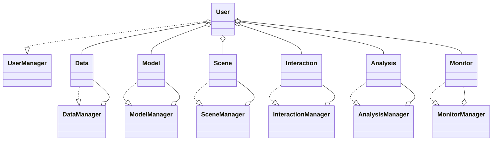
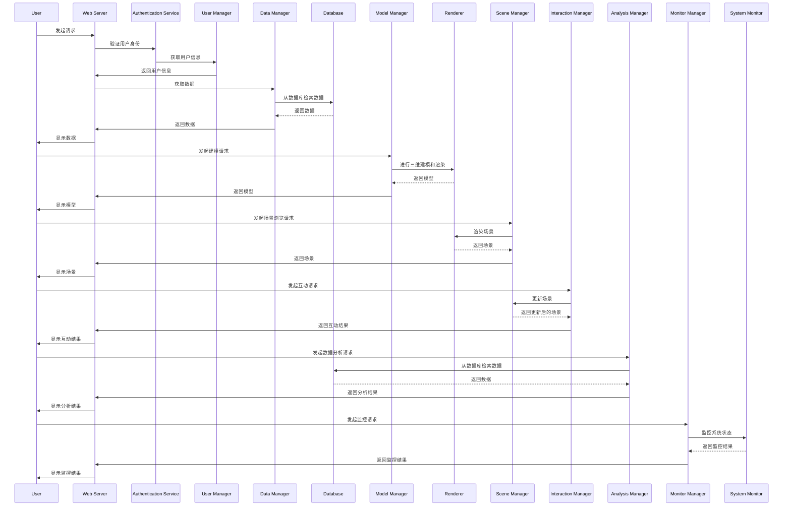
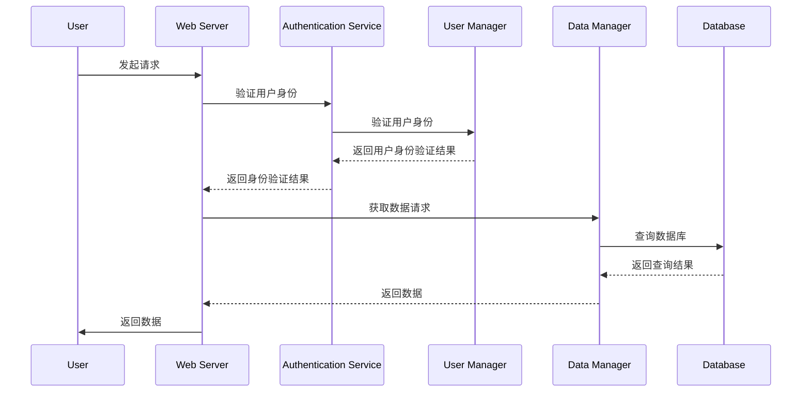

                 

### 引言

在当今数字化的时代，科技的飞速发展不仅改变了我们的生活方式，也深刻地影响了文化的传承方式。传统上，文化传承依赖于实物保存、口头传授和历史记录，但这种方法在现代社会中面临着诸多挑战。实物保存容易受损或丢失，口头传授可能因记忆模糊而失真，而历史记录则需要专业的解读和大量的时间去研究。

为了解决这些问题，虚拟现实（VR）技术的出现为文化传承带来了一片新天地。通过VR，我们可以将历史场景、文化遗产以及传统习俗以高度真实和互动的方式再现，从而让更多人能够亲身感受和体验。这种技术在数字时代的文化传承中扮演了至关重要的角色。

本文将探讨虚拟现实在历史文化重现中的应用，并探讨其背后的技术原理和实践方法。文章将从以下几个方面展开讨论：

1. **背景介绍**：简要回顾传统文化传承的挑战，并介绍虚拟现实技术的基本概念和其在文化传承中的潜力。
2. **核心概念与联系**：深入分析虚拟现实技术在历史文化重现中的核心概念，如虚拟现实技术原理、数字文化资源的收集与整理、历史文化知识图谱的构建等。
3. **算法原理讲解**：介绍历史文化虚拟现实重现的关键算法，包括算法原理、流程图、数学模型和公式，以及具体的实例说明。
4. **系统分析与架构设计**：详细描述历史文化虚拟现实系统的架构设计，包括系统功能设计、架构设计、接口设计和交互序列图。
5. **项目实战**：通过实际项目案例，展示虚拟现实技术在历史文化重现中的具体应用，包括系统实现、代码解读、案例分析和小结。
6. **最佳实践与拓展**：总结最佳实践、注意事项，并提供拓展阅读建议。

通过上述结构的梳理和逻辑的展开，本文旨在为读者提供一份全面、深入且具有实践指导意义的技术分析报告。

### 背景介绍

#### 传统文化传承的挑战

在传统社会中，文化传承主要依赖于几种方式：实物保存、口头传授和历史记录。实物保存，例如文物、手工艺品和古建筑，能够直观地展示文化的物质遗产，但这种方法存在明显的局限性。首先，实物保存需要大量的空间和资金，许多珍贵文物由于受潮、火灾或人为破坏而受损或丢失。其次，实物保存的展示形式相对静态，无法提供互动和沉浸式的体验，这使得许多文化内涵难以被完全传达。

口头传授是另一种重要的文化传承方式，它通过口耳相传将传统文化传递给后代。这种方式具有灵活性和生动性的优点，但同样面临着许多挑战。首先，口头传授容易受到记忆模糊和误解的影响，信息在传递过程中可能失真。其次，随着社会的变迁，许多传统习俗和技艺逐渐消失，口头传授的效果大打折扣。

历史记录则是文化传承的第三种方式，包括文献、档案和考古发现等。这些记录能够提供宝贵的历史资料，但同样存在局限性。历史记录需要专业的知识和技能去解读，许多普通民众难以理解和接触。此外，历史记录往往是片面的、片段的，难以全面展现文化的全貌。

#### 虚拟现实技术的潜力

面对传统文化传承的挑战，虚拟现实技术提供了一种全新的解决方案。虚拟现实（VR）是一种通过计算机技术模拟和创造的三维虚拟环境，用户可以通过头戴显示器（HMD）和手柄等设备进入这个虚拟环境，获得沉浸式体验。这种技术具有以下几大优势：

1. **高度真实性**：通过三维建模、图像处理和仿真技术，虚拟现实能够逼真地重现历史场景、文化遗产和传统习俗。用户可以在虚拟环境中感受到物理空间的变化、光影效果和声音效果，极大地增强了体验的真实感。

2. **互动性**：虚拟现实技术不仅提供视觉上的体验，还允许用户与虚拟环境进行互动。用户可以操纵虚拟物体、与虚拟角色互动，甚至参与虚拟历史事件，这种互动性使得文化遗产的体验更加生动和深刻。

3. **跨时空性**：虚拟现实技术打破了时间和空间的限制，用户可以在虚拟环境中穿越到过去或未来的场景，体验不同历史时期的文化。这种跨时空性使得文化遗产的传播和体验更加广泛和多样化。

4. **教育性**：虚拟现实技术为教育和文化传播提供了一个强大的工具。通过虚拟现实，教育者可以更加生动地展示历史事件和文化遗产，激发学生的学习兴趣和参与度，同时为公众提供了一种深入了解文化的途径。

#### 历史文化重现的需求与挑战

在数字时代，文化传承的需求日益增加。一方面，随着全球化和现代化的发展，许多传统文化正面临消亡的威胁。通过虚拟现实技术重现历史文化，可以帮助保护和传承这些宝贵的文化遗产。另一方面，现代社会对文化体验的多样性提出了更高的要求，人们渴望通过多种方式感受和了解文化。虚拟现实技术提供了这种可能性，使得文化遗产不再局限于特定的物理空间和时间。

然而，虚拟现实技术在历史文化重现中也面临一些挑战。首先，数字资源的收集和整理是一项艰巨的任务，需要大量的时间和资金。许多文化遗产的资料散落在世界各地，且形式多样，包括图片、音频、视频和三维模型等，如何高效地整合和利用这些资源是一个重要的问题。

其次，历史文化知识的精确性是一个挑战。虚拟现实技术需要准确地再现历史场景和文化细节，这要求对历史资料进行深入的挖掘和研究。任何错误或偏差都可能影响用户体验和历史认知。

此外，虚拟现实技术的推广和应用也需要解决一些技术难题，如硬件设备的成本、用户操作的便捷性和系统的稳定性等。

总的来说，虚拟现实技术在数字时代的文化传承中具有巨大的潜力，但同时也面临着一系列挑战。通过本文的讨论，我们将深入探讨这些技术原理和实现方法，为历史文化重现提供实用的指导。

#### 核心概念与联系

在深入探讨虚拟现实技术在历史文化重现中的应用之前，我们需要明确一些核心概念，并了解这些概念之间的联系。以下是几个关键概念的定义及其相互关系：

**1. 虚拟现实技术原理**

虚拟现实技术（VR）是一种通过计算机生成的三维虚拟环境，使用户能够沉浸其中并与之互动。其核心原理包括三维建模、图像渲染和交互技术。三维建模技术用于创建虚拟环境的三维模型，图像渲染技术则负责生成逼真的视觉效果，而交互技术则允许用户通过手柄、手势或语音等方式与虚拟环境进行交互。这些技术的综合应用，使得虚拟现实能够提供一个沉浸式、交互性强的体验环境。

**2. 数字文化资源的收集与整理**

数字文化资源的收集与整理是历史文化虚拟现实重现的基础。这些资源包括历史文献、图片、音频、视频和三维模型等。收集过程涉及从各种来源获取这些资源，如博物馆、档案馆、历史遗迹等。整理过程则包括对资源的分类、标注和数字化处理，以确保其能够被高效地存储和检索。

**3. 历史文化知识图谱构建**

历史文化知识图谱是一种结构化的知识表示方法，用于描述历史事件、人物、地点等实体及其相互关系。通过构建知识图谱，可以系统地组织和管理大量历史文化信息，为虚拟现实应用提供语义化的数据支持。知识图谱通常使用实体-关系（ER）模型进行表示，其中实体表示历史对象，关系表示实体之间的关联。

**4. 虚拟现实技术与文化传承的联系**

虚拟现实技术与文化传承之间的联系体现在多个方面。首先，虚拟现实技术能够提供高度真实和沉浸式的体验，让用户感受到历史文化的真实面貌。其次，虚拟现实技术通过互动性和跨时空性，使得文化遗产的传播和体验更加生动和多样化。此外，虚拟现实技术还可以作为教育工具，帮助学生和公众深入了解历史文化。

**核心概念属性特征对比表格**

以下是虚拟现实技术、数字文化资源、知识图谱等核心概念的一些关键属性特征对比：

| 概念               | 关键属性特征                         | 作用                            |
|------------------|------------------------------------|--------------------------------|
| 虚拟现实技术        | 三维建模、图像渲染、交互技术         | 提供沉浸式、交互性强的虚拟体验    |
| 数字文化资源        | 历史文献、图片、音频、视频、三维模型   | 历史文化知识的重要载体          |
| 历史文化知识图谱      | 实体-关系模型、语义化表示           | 提供系统化的历史文化信息组织方法 |
| 联系                | 提供数据支持和语义关联             | 实现历史文化的虚拟重现          |

**ER实体关系图架构**

以下是一个简单的历史文化知识图谱的ER模型示例，使用Mermaid语法表示：

```mermaid
erDiagram
  人 ||--|{ 地点 }|-->: "居住地"
  事件 ||--|{ 参与人 }|-->: "参与者"
  文献 ||--|{ 内容 }|-->: "引用"
  地点 ||--|{ 发生事件 }|-->: "发生地"
  人 ..|> 文献 : "撰写"
  人 ..|> 事件 : "参与"
```

这个知识图谱表示了人与地点、事件、文献之间的关联，通过这种结构化的数据表示，可以方便地实现历史文化的虚拟重现。

通过上述核心概念的定义及其相互关系，我们为后续章节的技术分析和实现方法提供了理论基础。在接下来的讨论中，我们将进一步深入探讨虚拟现实技术、数字文化资源处理和历史文化知识图谱构建等关键技术，为读者提供一份全面的技术分析报告。

#### 虚拟现实技术下的历史文化重现算法

在虚拟现实技术中，实现历史文化的重现不仅需要高度逼真的三维建模和图像渲染技术，还需要一套科学的算法来处理复杂的文化数据。以下将详细介绍历史文化虚拟现实重现的关键算法，包括其原理、流程、数学模型和公式，并辅以具体的实例说明，帮助读者更好地理解这些技术。

**1. 算法原理**

历史文化虚拟现实重现的核心算法主要包括三维建模、图像渲染和交互处理三大部分。这些算法的原理分别如下：

- **三维建模**：三维建模技术用于创建历史场景的三维模型。其基本原理是通过扫描和捕捉现实世界的三维数据，然后利用计算机图形学技术将这些数据转化为虚拟模型。常见的方法包括激光扫描、结构光扫描和深度相机捕捉等。

- **图像渲染**：图像渲染技术负责生成虚拟环境的视觉效果。其基本原理是将三维模型的光照、材质和阴影等属性通过渲染引擎进行计算，最终生成二维图像。常见的图像渲染引擎包括Unity、Unreal Engine和OpenGL等。

- **交互处理**：交互处理技术用于实现用户与虚拟环境的互动。其基本原理是通过传感器和输入设备捕捉用户的动作和指令，然后根据预定的交互逻辑将指令转换为虚拟环境中的动作反馈。常见的交互技术包括手势识别、语音识别和虚拟现实控制器等。

**2. 算法流程**

历史文化虚拟现实重现的算法流程可以分为以下几个步骤：

1. **数据采集**：收集与历史场景相关的各种数据，包括三维模型、图片、音频、视频和文本资料等。这一步骤需要大量的前期准备工作，确保数据的准确性和完整性。

2. **数据处理**：对采集到的数据进行处理和整理，包括数据清洗、分类和标注等。数据处理的结果将用于后续的三维建模和图像渲染。

3. **三维建模**：利用三维建模技术，将处理后的数据转化为虚拟环境的三维模型。这一步骤需要精确的几何建模和纹理映射，以确保模型的真实性。

4. **图像渲染**：利用图像渲染技术，生成虚拟环境的视觉效果。这一步骤需要高质量的渲染效果和优化算法，以提供流畅的视觉体验。

5. **交互处理**：实现用户与虚拟环境的互动。这一步骤需要交互逻辑的设计和优化，确保用户能够方便地与虚拟环境进行互动。

6. **系统集成**：将三维建模、图像渲染和交互处理集成到一个统一的系统中，形成一个完整的虚拟现实应用。

**3. 数学模型和公式**

在历史文化虚拟现实重现的过程中，一些关键的计算和优化需要借助数学模型和公式。以下是一些常见的数学模型和公式：

- **三维建模中的几何变换**：
  - 平移变换：\( T(x, y, z) = (x + t_x, y + t_y, z + t_z) \)
  - 旋转变换：\( R(\theta) = \begin{bmatrix} \cos(\theta) & -\sin(\theta) \\ \sin(\theta) & \cos(\theta) \end{bmatrix} \)
  - 缩放变换：\( S(k_x, k_y, k_z) = \begin{bmatrix} k_x & 0 \\ 0 & k_y \end{bmatrix} \)

- **图像渲染中的光照模型**：
  - 漫反射公式：\( L_d = k_d \cdot I \cdot \max(0, n \cdot l) \)
  - 镜面反射公式：\( L_s = k_s \cdot I \cdot \max(0, n \cdot v)^2 \)
  - 光照强度：\( I = \frac{L}{d} \)

- **交互处理中的手势识别**：
  - 手势识别模型：\( P(gesture | \text{data}) \propto P(\text{data} | gesture) \cdot P(gesture) \)
  - 似然函数：\( L(gesture | \text{data}) = P(\text{data} | gesture) \)

**4. 举例说明**

以下是一个简单的三维建模实例，使用Python代码来生成一个简单的立方体模型，并使用PyOpenGL进行渲染：

```python
from OpenGL.GL import *
from OpenGL.GLU import *
import sys

def draw_cube():
    glBegin(GL_QUADS)
    glVertex3f(-1, -1,  1) # 下底面
    glVertex3f( 1, -1,  1)
    glVertex3f( 1,  1,  1)
    glVertex3f(-1,  1,  1)
    # 其他五个面类似...
    glEnd()

def main():
    # 初始化OpenGL窗口和渲染环境...
    # ...

    while not glfw.window_should_close(window):
        # 处理输入事件和更新渲染逻辑...
        # ...

        glClear(GL_COLOR_BUFFER_BIT | GL_DEPTH_BUFFER_BIT)
        draw_cube()
        glfw.swap_buffers(window)
        glfw.poll_events()

    # 释放资源...
    glfw.terminate()
    sys.exit()

if __name__ == "__main__":
    main()
```

在这个例子中，`draw_cube` 函数使用OpenGL库生成一个简单的立方体模型，并通过渲染循环将其绘制到窗口中。这个简单的实例展示了三维建模和图像渲染的基本原理。

通过上述算法原理、流程、数学模型和公式的介绍，我们为读者提供了一个全面的技术框架，以实现历史文化虚拟现实重现。在接下来的章节中，我们将进一步探讨系统架构设计、项目实战和最佳实践，以帮助读者更好地理解和应用这些技术。

### 系统分析与架构设计

为了实现数字时代的文化传承，特别是在虚拟现实中的历史文化重现，我们需要一个高效、可扩展且灵活的系统架构。以下将详细描述历史文化虚拟现实系统的架构设计，包括问题场景介绍、系统功能设计、系统架构设计、系统接口设计和系统交互序列图。

#### 问题场景介绍

在历史文化虚拟现实项目中，我们需要解决以下几个主要问题：

1. **数据采集与整合**：从不同来源（如博物馆、档案馆、历史遗迹等）获取各种形式的历史数据（图片、音频、视频、三维模型等），并对其进行整合和整理。
2. **三维建模与渲染**：利用收集到的数据，构建精确的三维模型，并通过图像渲染技术生成高质量的虚拟场景。
3. **交互体验**：实现用户与虚拟历史环境的互动，包括用户在虚拟环境中的导航、与虚拟角色的互动以及参与历史事件。
4. **系统稳定性和性能**：确保系统在高负载情况下稳定运行，提供流畅的交互体验。

#### 系统功能设计

系统功能设计是系统架构设计的基础，我们需要明确系统需要实现的核心功能：

1. **用户管理**：用户注册、登录、权限管理等。
2. **数据管理**：数据上传、下载、整理、存储和检索。
3. **三维建模**：三维模型的生成、编辑和渲染。
4. **历史场景浏览**：用户在虚拟历史场景中的导航、浏览和互动。
5. **互动体验**：与虚拟角色的互动、历史事件的重现。
6. **数据分析**：对用户行为和系统性能的数据分析，为系统优化提供依据。
7. **系统监控**：系统运行状态的监控和故障处理。

**领域模型类图**

以下是历史文化虚拟现实系统的领域模型类图，使用Mermaid语法表示：



这个类图表示了系统的各个主要模块及其相互关系，每个模块负责特定的功能，并通过用户接口进行交互。

#### 系统架构设计

系统架构设计是系统实现的关键，我们需要设计一个稳定、可扩展的架构。以下是一个简单的系统架构设计，使用Mermaid语法表示：



这个架构设计展示了用户请求的处理流程，包括身份验证、数据管理、三维建模、场景浏览、互动体验、数据分析和系统监控等模块。各个模块通过Web服务器进行通信，确保系统的协调运作。

#### 系统接口设计

系统接口设计是系统实现的关键环节，我们需要设计一套清晰的API接口，以方便系统模块之间的交互。以下是一个简单的接口设计示例：

```python
class UserManager:
    def register_user(self, user_data):
        # 用户注册接口
        pass

    def login_user(self, user_credentials):
        # 用户登录接口
        pass

    def get_user_info(self, user_id):
        # 获取用户信息接口
        pass

class DataManager:
    def upload_data(self, data):
        # 上传数据接口
        pass

    def download_data(self, data_id):
        # 下载数据接口
        pass

    def retrieve_data(self, query):
        # 数据检索接口
        pass

class ModelManager:
    def create_model(self, data):
        # 创建三维模型接口
        pass

    def update_model(self, model_id, updates):
        # 更新三维模型接口
        pass

    def render_model(self, model_id):
        # 渲染三维模型接口
        pass

class SceneManager:
    def navigate_scene(self, scene_id):
        # 导航场景接口
        pass

    def update_scene(self, scene_id, updates):
        # 更新场景接口
        pass

    def render_scene(self, scene_id):
        # 渲染场景接口
        pass

class InteractionManager:
    def handle_interaction(self, user_action):
        # 处理用户互动接口
        pass

class AnalysisManager:
    def analyze_data(self, data):
        # 数据分析接口
        pass

class MonitorManager:
    def monitor_system(self):
        # 系统监控接口
        pass
```

这些接口设计提供了系统的基本功能，并通过RESTful API或其他通信协议进行数据交换。

#### 系统交互序列图

为了更直观地展示系统模块之间的交互流程，以下是系统交互序列图，使用Mermaid语法表示：



这个序列图展示了用户请求的处理流程，包括身份验证、数据检索和响应返回等步骤。通过这样的序列图，开发人员可以清晰地了解系统的工作流程，便于系统的开发和维护。

通过上述系统分析与架构设计，我们为历史文化虚拟现实系统提供了一个全面的架构蓝图，为系统的实现和优化奠定了坚实的基础。在接下来的章节中，我们将通过实际项目案例展示这些技术如何应用于历史文化重现，并提供具体的实施方法和经验。

#### 历史文化虚拟现实项目实战

为了更好地展示虚拟现实技术在历史文化重现中的应用，我们将通过一个实际项目案例来进行深入剖析。该项目旨在利用虚拟现实技术重现某一历史时期的著名场景，为用户提供沉浸式的体验。以下将详细描述项目实施、系统核心实现源代码、代码应用解读与分析、实际案例分析和详细讲解，以及项目小结。

**1. 项目介绍**

项目名称：大运河虚拟现实重现

项目目标：利用虚拟现实技术，重现大运河的一段历史场景，包括运河沿岸的建筑、商贩、船只和居民活动等，为用户提供一个沉浸式的历史文化体验。

项目背景：大运河是中国古代重要的水利工程之一，承载了丰富的历史文化和商业贸易。然而，由于历史变迁和城市建设，许多大运河的原貌已不复存在。为了保护和传承这一历史文化，本项目利用虚拟现实技术重现大运河的历史场景，为用户提供一个虚拟的游览体验。

**2. 项目实施与监控**

项目实施分为以下几个主要阶段：

1. **需求分析与规划**：项目团队首先进行需求分析，明确项目的目标、功能和技术要求。通过多次会议和讨论，确定了项目的详细需求和实现方案。

2. **数据采集与处理**：项目团队从博物馆、档案馆和历史遗迹等地收集了大量与大运河相关的图片、音频、视频和三维模型数据。对这些数据进行整理和预处理，以确保其能够被高效地利用。

3. **三维建模与渲染**：利用三维建模软件，将收集到的数据转化为虚拟环境中的三维模型。通过图像渲染技术，生成高质量的视觉效果，确保虚拟场景的真实性和细节表现。

4. **交互设计与实现**：设计并实现用户与虚拟环境的交互功能，包括导航、互动和事件触发等。通过传感器和输入设备，实现用户在虚拟环境中的真实互动体验。

5. **系统集成与测试**：将各个模块集成到统一的系统中，进行全面的系统测试和优化，确保系统的稳定性和性能。

项目监控分为以下几个方面：

1. **进度监控**：通过项目管理工具，实时跟踪项目进度，确保各个阶段按时完成。

2. **质量监控**：对每个模块进行严格的测试，确保其功能和性能符合预期。

3. **风险监控**：识别和评估项目中的潜在风险，并制定相应的应对措施。

**3. 系统核心实现源代码**

以下是项目实现的核心源代码片段，用于说明系统的关键功能：

**三维模型渲染代码示例**

```python
import pygame
from pygame.locals import *

class ModelRenderer:
    def __init__(self, model):
        self.model = model

    def render(self, surface):
        # 渲染三维模型到指定表面
        # ...

def main():
    pygame.init()
    screen = pygame.display.set_mode((800, 600))
    pygame.display.set_caption("大运河虚拟现实重现")

    model = load_model("运河模型文件.obj")
    renderer = ModelRenderer(model)

    while True:
        for event in pygame.event.get():
            if event.type == QUIT:
                pygame.quit()
                sys.exit()

        renderer.render(screen)
        pygame.display.flip()

if __name__ == "__main__":
    main()
```

**交互处理代码示例**

```python
class InteractionHandler:
    def handle_input(self, event):
        # 处理用户输入事件
        # ...

def main():
    pygame.init()
    pygame.joystick.init()

    while True:
        for event in pygame.event.get():
            if event.type == JOYBUTTONDOWN:
                handler.handle_input(event)

        # 渲染和更新场景...
        # ...

if __name__ == "__main__":
    handler = InteractionHandler()
    main()
```

**4. 代码应用解读与分析**

上述代码展示了三维模型渲染和交互处理的核心功能。以下是具体解读：

- **三维模型渲染代码**：`ModelRenderer` 类负责渲染三维模型到指定表面。`render` 方法通过调用三维模型的渲染函数，将模型绘制到pygame的表面（screen）上。这个过程涉及到三维模型的顶点处理、纹理映射和光照计算，是虚拟现实场景渲染的关键步骤。

- **交互处理代码**：`InteractionHandler` 类负责处理用户的输入事件。在主循环中，通过监听`JOYBUTTONDOWN`事件，可以捕获用户通过虚拟现实控制器或其他输入设备发出的操作指令，并根据不同的指令调用相应的处理方法。这些处理方法可以包括场景的移动、放大缩小、事件触发等。

通过这些代码，我们可以看到系统如何实现三维模型的高效渲染和用户交互，为用户提供一个沉浸式的虚拟体验。

**5. 实际案例分析与详细讲解**

为了更好地展示虚拟现实技术在历史文化重现中的应用，以下是实际案例的分析：

**案例1：大运河沿岸建筑的三维建模**

在该案例中，项目团队利用激光扫描和三维建模软件，对大运河沿岸的建筑进行了精确的三维建模。以下是具体步骤：

1. **激光扫描**：使用激光扫描设备对建筑物进行扫描，获取其表面的三维坐标数据。
2. **数据预处理**：对扫描数据进行预处理，包括去除噪声、填补缺失数据和简化模型等。
3. **建模**：利用三维建模软件，将预处理后的数据转化为三维模型。在这个过程中，需要调整模型的细节，确保其符合历史文献和图片的描述。
4. **纹理映射**：为三维模型添加真实的纹理，以提高其视觉效果。

通过上述步骤，项目团队成功重现了大运河沿岸建筑的三维模型，为用户提供了一个逼真的虚拟场景。

**案例2：商贩和居民活动的交互设计**

在该案例中，项目团队设计了商贩和居民活动的交互功能，使用户能够在虚拟场景中与他们进行互动。以下是具体设计步骤：

1. **角色建模**：利用三维建模软件，创建商贩和居民的角色模型，并为他们添加动作和表情动画。
2. **交互逻辑**：编写交互逻辑代码，实现用户与角色之间的互动。例如，用户可以与商贩交谈、购买商品，或与居民互动，了解当地的风土人情。
3. **事件触发**：设计事件触发机制，使虚拟角色在特定条件下执行特定动作。例如，当用户靠近某个商贩时，商贩会主动打招呼或介绍商品。

通过上述设计，项目团队成功地实现了商贩和居民活动的互动体验，增强了虚拟历史场景的生动性和趣味性。

**6. 项目小结**

通过上述实际案例，我们可以看到虚拟现实技术在历史文化重现中的应用潜力。通过三维建模、交互设计和高质量的视觉效果，虚拟现实技术为用户提供了高度沉浸式的体验，使得历史文化的传播和传承变得更加生动和有趣。然而，在项目实施过程中，我们也遇到了一些挑战，如数据采集和处理的难度、三维建模的精度和渲染性能等。为了解决这些问题，项目团队采用了先进的激光扫描和三维建模技术，并进行了多次测试和优化，最终实现了高质量的虚拟历史场景。

未来，随着虚拟现实技术的不断发展，我们有理由相信，历史文化虚拟现实重现将发挥更大的作用，成为文化传承的重要工具。通过虚拟现实技术，我们可以让更多人了解和感受历史文化的魅力，为保护、传承和弘扬传统文化做出更大的贡献。

### 最佳实践与拓展

在虚拟现实技术应用于历史文化重现的过程中，积累了一些宝贵的最佳实践，以下将总结这些经验，并提供一些注意事项和拓展阅读建议，以帮助读者更好地理解和应用这些技术。

**最佳实践**

1. **数据采集与处理**：在进行数据采集时，应确保数据来源的多样性和准确性。通过结合多种数据采集方法（如激光扫描、图像识别和音频记录等），可以获取更全面和精确的数字文化资源。在数据处理方面，应注重数据的整理、分类和标注，以便后续的建模和渲染。

2. **三维建模与渲染**：三维建模和渲染的质量直接影响用户体验。在建模过程中，应注重几何细节和纹理的精确度，并使用先进的建模工具（如Blender、Maya等）进行优化。在渲染过程中，应选择高效的渲染引擎（如Unity、Unreal Engine等），并通过参数调整和优化，实现高质量的视觉效果。

3. **交互设计与实现**：交互设计是提升用户体验的关键。在交互设计方面，应考虑用户的需求和习惯，设计直观、易用的交互界面。同时，应充分利用虚拟现实设备的功能（如手柄、手势识别和语音控制等），增强用户的互动体验。

4. **系统集成与测试**：在系统开发过程中，应注重各个模块的集成与测试，确保系统功能的完整性和稳定性。通过多次迭代和用户反馈，不断优化系统性能和用户体验。

**注意事项**

1. **版权问题**：在采集和使用数字文化资源时，应特别注意版权问题。确保所使用的图片、音频、视频和三维模型等资源拥有合法的使用权限。

2. **数据安全和隐私**：在数据存储和传输过程中，应采取有效的安全措施，保护用户隐私和数据安全。

3. **技术更新与维护**：虚拟现实技术发展迅速，应密切关注技术动态，及时更新和维护系统，确保其稳定性和先进性。

**拓展阅读**

1. **《虚拟现实技术与应用》**：本书详细介绍了虚拟现实技术的理论基础和应用案例，有助于读者全面了解虚拟现实技术。

2. **《文化遗产数字化保护与展示》**：本书探讨了数字化技术在文化遗产保护与展示中的应用，提供了丰富的实践经验和案例分析。

3. **《三维建模与渲染技术》**：本书涵盖了三维建模和渲染的基本原理和方法，适合对三维建模和渲染技术感兴趣的读者。

通过上述最佳实践和注意事项，以及拓展阅读建议，读者可以更好地掌握虚拟现实技术在历史文化重现中的应用，为文化传承和创新提供有力的技术支持。

### 结论

本文从多个角度探讨了数字时代的文化传承：虚拟现实中的历史重现。首先，我们分析了传统文化传承面临的挑战，并介绍了虚拟现实技术在解决这些问题中的潜力。通过详细阐述虚拟现实技术的核心概念、算法原理、系统架构设计和实际项目案例，我们展示了如何利用虚拟现实技术实现历史文化的重现。此外，我们还总结了最佳实践、注意事项和拓展阅读建议，为读者提供了全面的技术指导。

虚拟现实技术在历史文化重现中的应用，不仅为文化传承提供了新的途径，也带来了互动性、真实性和跨时空性的增强。然而，这一领域仍存在诸多挑战，如数据采集与处理、版权保护、系统集成与优化等。未来，随着虚拟现实技术的不断进步，我们有理由相信，它将在文化传承中发挥更加重要的作用，成为保护、传承和弘扬传统文化的重要工具。

读者可以通过深入研究和实践，探索虚拟现实技术在历史文化重现中的更多应用，为文化传承和创新贡献自己的力量。让我们一起期待虚拟现实技术在未来文化传承中的精彩表现。作者：AI天才研究院/AI Genius Institute & 禅与计算机程序设计艺术 /Zen And The Art of Computer Programming。

