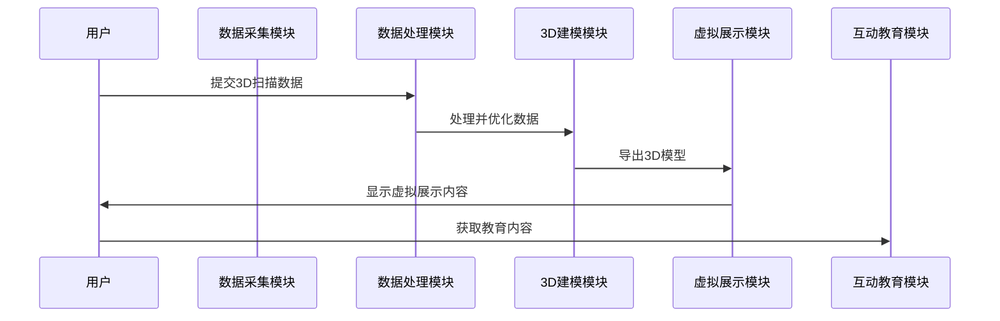
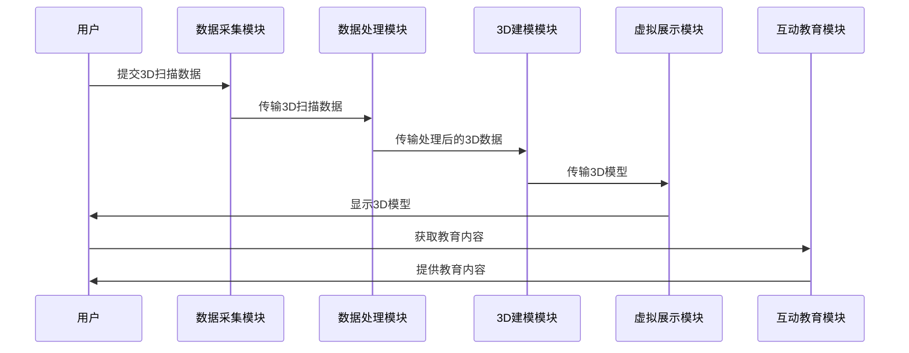

                 

### 关键词

- 数字时代文化遗产保护
- 虚拟现实
- 3D重建
- 历史保护
- 数字技术

### 摘要

本文深入探讨了数字时代文化遗产保护中的关键技术——虚拟现实（VR）和三维重建（3D重建）。首先，通过背景介绍和现状分析，明确了数字技术在文化遗产保护中的重要性。接着，详细阐述了虚拟现实技术在文化遗产展示、修复和教育中的应用，以及3D重建技术的核心原理和方法。随后，文章通过具体的案例展示了这些技术在遗产保护中的实际应用，并探讨了未来的发展方向和潜在挑战。通过这一步步的分析与推理，本文旨在为读者提供一个全面、深入的技术指南，助力数字时代下的文化遗产保护工作。

## 第一部分：数字时代文化遗产保护概述

### 1.1 数字时代文化遗产保护背景

在当今快速发展的数字时代，文化遗产保护面临着前所未有的挑战和机遇。随着信息技术、虚拟现实和人工智能等数字技术的飞速进步，文化遗产保护的方式也在发生深刻变革。首先，我们需要明确什么是文化遗产保护。文化遗产保护是指通过各种手段和技术手段，保护和传承人类历史上创造的文化和物质遗产，包括历史建筑、艺术品、考古遗址等。

#### 1.1.1 遗产保护的需求与挑战

在数字时代，文化遗产保护的需求愈加迫切。一方面，随着全球化和城市化的加速，许多文化遗产正面临着自然和人为因素的破坏。例如，自然灾害如地震、洪水等，以及城市化进程中出现的拆迁和改建，都对文化遗产的保护构成了巨大威胁。另一方面，文化遗产的保护和管理需要大量的资金、技术和人力资源，这对许多国家和地区的文化遗产保护机构来说是一个巨大的挑战。

#### 1.1.2 数字技术的应用前景

数字技术为文化遗产保护提供了新的解决方案。例如，虚拟现实技术（VR）可以创建文化遗产的三维数字模型，使人们能够在虚拟环境中进行互动式体验，从而减少对实体遗产的直接接触和损害。三维重建技术则可以通过对实体遗产的扫描和建模，实现对文化遗产的高精度数字化保存和展示。此外，人工智能技术也可以用于文化遗产的识别、分类和数据分析，提高保护工作的效率和准确性。

总的来说，数字技术为文化遗产保护带来了新的机遇，但也带来了新的挑战。如何合理、有效地利用这些技术，成为当前文化遗产保护工作中亟待解决的关键问题。

### 1.2 虚拟现实技术在遗产保护中的应用

虚拟现实技术（VR）是一种通过计算机技术创建的模拟环境，用户可以通过头戴显示器（HMD）和手柄等设备，在其中进行互动和体验。VR技术在文化遗产保护中的应用日益广泛，具有巨大的潜力。

#### 1.2.1 VR技术的基本原理

VR技术的基本原理是通过计算机生成一个三维的虚拟环境，用户通过头戴显示器可以看到这个环境，并通过手柄等设备与这个环境进行互动。这个虚拟环境可以是完全虚构的，也可以是现实世界的数字化重现。VR技术依赖于多个技术领域的支持，包括计算机图形学、传感器技术、实时渲染和人工智能等。

#### 1.2.2 VR在文化遗产保护中的作用

VR技术在文化遗产保护中具有多种作用。首先，VR技术可以创建文化遗产的三维数字模型，为保护和修复提供技术支持。这些数字模型可以精确地反映文化遗产的外观和结构，从而帮助研究人员进行详细的分析和研究。其次，VR技术可以用于文化遗产的数字化展示，使公众能够远程体验和感受文化遗产的魅力，从而提高文化遗产的知名度和保护意识。此外，VR技术还可以用于文化遗产的教育和培训，通过虚拟环境进行互动式教学，让学生和游客更好地了解文化遗产的历史和背景。

总的来说，VR技术在文化遗产保护中的应用为文化遗产的保护、展示和教育提供了新的手段和平台，极大地丰富了文化遗产保护工作的内涵和外延。

### 1.3 3D重建技术在遗产保护中的应用

三维重建技术（3D重建）是一种通过计算机技术对实体对象进行数字化建模的方法，它可以通过对实体对象的扫描和数据处理，生成高精度的三维模型。在文化遗产保护中，3D重建技术发挥着重要作用。

#### 1.3.1 3D重建的基本概念

3D重建是指通过扫描、图像处理和建模等技术，将实体的三维信息转化为数字模型的过程。这个过程可以分为几个关键步骤：首先是对实体对象进行扫描，获取其表面的三维数据；然后是对这些数据进行分析和处理，去除噪声和误差，生成初始的三维模型；最后是对模型进行优化和细化，使其达到所需的精度和细节。

#### 1.3.2 3D重建技术在遗产保护中的应用

3D重建技术在文化遗产保护中的应用非常广泛。首先，它可以帮助文化遗产机构对重要的文化遗产进行数字化保存，以便后续的研究和展示。例如，对历史建筑、雕塑和文物等进行高精度的扫描和建模，生成详细的三维数字模型，这些模型不仅可以用于学术研究，还可以用于公众展示和教育。其次，3D重建技术可以帮助文化遗产机构进行虚拟修复，通过数字模型进行修复方案的模拟和验证，从而减少对实体遗产的直接干预和损害。此外，3D重建技术还可以用于文化遗产的虚拟展示，通过创建三维数字模型，将文化遗产呈现给公众，使其能够在虚拟环境中进行互动和体验，从而提高文化遗产的吸引力和影响力。

总的来说，3D重建技术在文化遗产保护中的应用，不仅为文化遗产的保存、展示和修复提供了新的手段和平台，还有助于提升文化遗产的保护水平和社会影响力。

### 1.4 虚拟现实与3D重建的结合

虚拟现实技术（VR）和三维重建技术（3D重建）的结合，为文化遗产保护带来了全新的解决方案和广阔的应用前景。这两种技术的结合不仅增强了文化遗产展示的互动性和沉浸感，还为文化遗产的数字化保护和修复提供了强有力的技术支持。

#### 1.4.1 技术融合的优势

首先，虚拟现实与3D重建的结合使得文化遗产的展示更加生动和直观。通过3D重建技术，文化遗产可以精确地数字化保存，并转化为三维模型，用户可以在虚拟环境中自由探索和互动。这种互动式体验不仅增强了公众对文化遗产的理解和兴趣，还能够通过虚拟环境进行教育和培训，使得文化遗产的知识传播更加广泛和深入。

其次，这种技术融合在文化遗产修复方面也展现了巨大的潜力。通过3D重建技术，文化遗产的详细三维模型可以用于修复方案的模拟和验证，修复师可以在虚拟环境中进行修复操作，从而减少对实体遗产的直接干预和损害。这种虚拟修复不仅提高了修复的准确性和效率，还保护了文化遗产的原貌和历史价值。

最后，虚拟现实与3D重建的结合还为文化遗产的长期保存提供了新的思路。通过将文化遗产数字化并存储在虚拟环境中，即使实体遗产受到损害或消失，也可以通过数字模型进行还原和展示，从而确保文化遗产的永久保存和传承。

#### 1.4.2 融合技术的挑战与解决方案

尽管虚拟现实与3D重建的结合在文化遗产保护中展现了巨大的优势，但同时也面临着一些挑战。首先，3D重建技术的精度和效率需要进一步提升，以生成更加精确和详细的数字模型。其次，虚拟现实设备的成本和普及程度仍然是一个问题，如何降低设备成本、提高普及率，使得更多的人能够体验到虚拟文化遗产，是亟待解决的问题。

针对这些挑战，可以采取以下解决方案：一是加大3D重建技术的研发力度，提高扫描和建模的精度和速度；二是通过政策支持和市场推广，降低虚拟现实设备的成本，提高其普及率；三是探索和开发更多适用于文化遗产保护的虚拟现实应用场景，使其能够更好地服务于文化遗产的展示、修复和保护。

总的来说，虚拟现实与3D重建的结合为文化遗产保护提供了全新的解决方案和广阔的应用前景，通过不断克服技术挑战，我们可以期待看到更多文化遗产在虚拟世界中焕发生机。

### 1.5 本章小结

本文通过概述数字时代文化遗产保护背景、介绍虚拟现实和三维重建技术的基本原理及其在遗产保护中的应用，探讨了两者结合所带来的优势与挑战。数字技术的快速发展为文化遗产保护提供了新的工具和方法，但同时也提出了更高的要求。未来，我们需要不断探索和创新，以充分发挥虚拟现实与3D重建技术在遗产保护中的潜力，为文化遗产的永续传承和保护做出更大贡献。

## 第二部分：3D重建核心技术与原理

### 2.1 3D扫描技术

3D扫描技术是3D重建的基础，通过获取实体的三维信息，为后续的建模和重建提供数据支持。3D扫描技术主要分为两类：接触式扫描和非接触式扫描。

#### 2.1.1 3D扫描技术概述

3D扫描技术的基本原理是通过获取实体表面的三维坐标，生成点云数据，从而构建出三维模型。接触式扫描技术通过物理接触获取表面的三维信息，如CNC机床和坐标测量机等。这种方法的优点是精度高，但操作复杂，需要专业人员操作。非接触式扫描技术则通过光学、激光、声波等非接触方式获取表面的三维信息，如激光扫描仪和摄影测量等。这种方法的优点是操作简单，但受环境光照和物体表面特性影响较大。

#### 2.1.2 主流3D扫描方法

主流的3D扫描方法包括激光扫描、摄影测量、结构光扫描和超声扫描等。

- **激光扫描**：利用激光束对目标物体进行扫描，通过测量激光反射时间或强度变化获取物体表面的三维信息。激光扫描具有高精度和高效率的特点，适用于大型物体的扫描。
- **摄影测量**：利用相机拍摄目标物体的多个角度图像，通过图像处理和几何计算恢复物体表面的三维结构。摄影测量方法成本低、操作简单，适用于中小型物体的扫描。
- **结构光扫描**：利用结构光投影技术，将特定图案投影到物体表面，通过相机捕捉图像，利用图像处理和几何计算重建物体表面的三维模型。结构光扫描具有较高的精度和灵活性，适用于复杂形状的物体扫描。
- **超声扫描**：利用超声波在物体表面反射的原理，获取物体表面的三维信息。超声扫描适用于柔软和透明物体的扫描，但在精度和分辨率上存在一定的限制。

#### 2.1.3 扫描数据处理

扫描数据处理是3D扫描技术的关键环节，主要包括数据预处理、数据融合和数据处理。

- **数据预处理**：包括去噪声、去畸变和去重叠等处理，以提高扫描数据的准确性和完整性。
- **数据融合**：将多个扫描数据集合并为一个完整的三维模型，以消除扫描过程中的数据缺失和误差。
- **数据处理**：包括数据修复、数据平滑和数据细化等处理，以生成高质量的三维模型。

总的来说，3D扫描技术在文化遗产保护中发挥着重要作用，通过高精度的三维数据获取，为文化遗产的数字化保存和展示提供了可靠的数据支持。未来，随着技术的不断进步，3D扫描技术将在文化遗产保护领域得到更广泛的应用。

### 2.2 3D建模技术

3D建模技术是三维重建的核心步骤，通过将三维扫描数据转化为可用的三维模型，为后续的数字化展示和修复提供基础。3D建模技术主要包括手动建模、半自动建模和全自动建模三种方法。

#### 2.2.1 3D建模的基本概念

3D建模是指利用计算机软件和算法，创建三维物体模型的过程。3D建模的基本概念包括几何建模、参数建模和实体建模等。几何建模是通过直接编辑几何形状和顶点来创建模型，适用于简单的几何形状；参数建模是通过参数化方法创建模型，适用于复杂形状；实体建模是通过构建实体对象的方式创建模型，适用于具有复杂结构和细节的物体。

#### 2.2.2 3D建模流程

3D建模的流程一般包括以下步骤：

1. **需求分析和模型规划**：确定建模的目标、精度要求、模型用途等，制定建模方案。
2. **数据准备**：收集和整理相关数据，如三维扫描数据、二维图纸等。
3. **建模**：利用3D建模软件进行模型的创建和编辑，包括几何建模、参数建模和实体建模等。
4. **模型优化**：对模型进行优化，如去除冗余数据、平滑曲面、细化细节等。
5. **模型检验**：检查模型的准确性、完整性和可用性，确保满足建模要求。
6. **模型输出**：将模型导出为所需的格式，如3D文件、图像文件等。

#### 2.2.3 3D建模软件介绍

常见的3D建模软件包括：

- **Blender**：一款开源免费的3D建模和渲染软件，功能强大，适合各种复杂形状的建模。
- **Autodesk Maya**：一款专业的3D建模和动画软件，广泛应用于影视动画、游戏开发等领域。
- **SolidWorks**：一款功能强大的3D建模软件，适用于机械工程和制造业领域。
- **ZBrush**：一款专业的数字雕刻软件，适用于雕刻复杂细节和纹理。

总的来说，3D建模技术在文化遗产保护中发挥着重要作用，通过高精度的三维建模，为文化遗产的数字化保存和展示提供了可靠的技术支持。未来，随着技术的不断进步，3D建模技术将在文化遗产保护领域得到更广泛的应用。

### 2.3 3D重建算法原理

3D重建算法是3D重建技术的核心，通过分析三维扫描数据，生成高质量的三维模型。3D重建算法主要分为基于点云的重建和基于图像的重建两种类型。

#### 2.3.1 3D重建的基本算法

3D重建的基本算法主要包括以下几种：

1. **点云重建**：通过点云数据生成三维模型，常用的方法包括基于几何特征的重建、基于体素网格的重建和基于三角剖分的重建等。
2. **结构光重建**：利用结构光投影技术和图像处理方法，从二维图像中恢复三维结构。
3. **深度学习重建**：利用深度学习算法，如卷积神经网络（CNN）和生成对抗网络（GAN），从二维图像或点云数据生成高质量的三维模型。

#### 2.3.2 算法分类与比较

3D重建算法的分类与比较主要包括以下几个方面：

1. **基于点云的重建**：
   - **几何特征重建**：通过分析点云数据中的几何特征（如边缘、面、体等），生成三维模型。优点是精度高，但处理时间长。
   - **体素网格重建**：将点云数据转换为体素网格，通过体素网格生成三维模型。优点是速度快，但精度较低。
   - **三角剖分重建**：将点云数据三角剖分，生成三角面片模型。优点是精度和速度适中，适用于大规模数据处理。

2. **基于图像的重建**：
   - **结构光重建**：通过结构光投影技术和图像处理方法，从二维图像中恢复三维结构。优点是精度高，但受光照和投影模式限制。
   - **多视图立体重建**：通过多个视角的二维图像，利用几何关系恢复三维结构。优点是适用范围广，但精度和速度相对较低。
   - **深度学习重建**：利用深度学习算法，如卷积神经网络（CNN）和生成对抗网络（GAN），从二维图像或点云数据生成高质量的三维模型。优点是精度高，但计算量大，训练时间长。

#### 2.3.3 算法优化与改进

为了提高3D重建算法的精度和效率，可以采取以下优化与改进措施：

1. **多源数据融合**：将多种数据源（如点云、图像、深度数据等）融合，提高重建精度和鲁棒性。
2. **实时重建**：通过优化算法和数据结构，实现实时重建，降低计算时间。
3. **自适应重建**：根据重建目标的不同，自适应调整算法参数，提高重建精度。
4. **深度学习**：利用深度学习算法，如卷积神经网络（CNN）和生成对抗网络（GAN），实现高质量的三维模型重建。

总的来说，3D重建算法在文化遗产保护中发挥着重要作用，通过不断优化和改进算法，可以更好地支持文化遗产的数字化保存和展示。未来，随着人工智能和深度学习技术的发展，3D重建算法将取得更多突破，为文化遗产保护提供更强有力的技术支持。

### 2.4 3D重建中的数据优化

在3D重建过程中，数据的质量和精度直接影响到重建结果。因此，对3D重建中的数据优化是确保重建质量的关键环节。数据优化主要包括数据预处理、数据融合和数据可视化。

#### 2.4.1 数据预处理

数据预处理是3D重建的基础步骤，主要包括以下内容：

1. **去噪**：去除扫描数据中的噪声，提高数据质量。常用的去噪方法包括滤波、中值滤波和高斯滤波等。
2. **去畸变**：校正扫描数据中的畸变，如镜头畸变和旋转畸变等。通过畸变校正，提高重建精度。
3. **去重叠**：去除扫描数据中的重叠部分，减少冗余数据。通过去重叠，提高数据处理效率和重建速度。
4. **补洞**：对扫描数据中的缺失部分进行补充，提高数据的完整性。常用的补洞方法包括插值和曲面拟合等。

#### 2.4.2 数据融合

数据融合是将多个来源的数据集成为一个完整的三维模型。数据融合主要包括以下内容：

1. **多视角融合**：通过多个视角的扫描数据，融合生成完整的三维模型。多视角融合方法包括多视角立体匹配、多视角点云融合和多视角纹理融合等。
2. **多源数据融合**：将不同类型的数据源（如激光扫描、摄影测量和深度传感器等）融合，提高重建精度和鲁棒性。多源数据融合方法包括数据对齐、特征提取和数据融合等。
3. **动态融合**：对动态场景进行实时重建，将连续帧的数据融合生成三维模型。动态融合方法包括光流法、粒子滤波和深度学习等。

#### 2.4.3 数据可视化

数据可视化是将3D重建数据以直观的方式呈现给用户。数据可视化主要包括以下内容：

1. **点云可视化**：通过点云数据展示三维模型的基本轮廓和结构。常用的可视化方法包括点云渲染、体渲染和表面渲染等。
2. **三维模型可视化**：通过三维模型展示文化遗产的详细结构和细节。常用的可视化方法包括三维建模软件、虚拟现实（VR）和增强现实（AR）等。
3. **交互式可视化**：通过交互式界面，让用户能够自由探索和操作三维模型。交互式可视化方法包括三维模型编辑、三维空间导航和交互式演示等。

总的来说，3D重建中的数据优化是确保重建质量的关键环节，通过数据预处理、数据融合和数据可视化，可以显著提高3D重建的精度和效率。未来，随着人工智能和深度学习技术的发展，3D重建中的数据优化技术将不断取得新的突破，为文化遗产保护提供更强大的技术支持。

### 2.5 本章小结

本章详细介绍了3D重建的核心技术与原理，包括3D扫描技术、3D建模技术、3D重建算法和数据优化方法。通过这些技术，我们可以实现对文化遗产的高精度数字化保存和展示。未来，随着技术的不断进步，3D重建技术将在文化遗产保护中发挥更加重要的作用，为文化遗产的传承和保护提供强有力的支持。

## 第三部分：虚拟现实技术在文化遗产保护中的应用

### 3.1 虚拟现实技术在文化遗产展示中的应用

虚拟现实技术（VR）在文化遗产展示中的应用，为公众提供了一个全新的体验方式，使得人们能够在虚拟环境中直观、互动地感受文化遗产的魅力。VR技术通过创建高度逼真的虚拟环境，将文化遗产的细节、结构和历史背景生动地呈现出来，极大地提升了文化遗产的展示效果。

#### 3.1.1 虚拟展示的基本原理

虚拟展示的基本原理是通过计算机生成三维模型和虚拟环境，然后利用VR设备（如VR头戴显示器、手柄等）将虚拟环境呈现给用户。用户通过佩戴VR头戴显示器，可以看到一个沉浸式的三维虚拟世界，通过手柄等设备可以与虚拟环境进行互动。

#### 3.1.2 虚拟展示的优势

虚拟展示在文化遗产展示中具有显著的优势：

1. **高度逼真**：VR技术可以生成高度逼真的三维模型，使得文化遗产的细节和结构得以完美呈现，用户仿佛置身于现场。
2. **互动性**：VR技术支持用户与虚拟环境的互动，用户可以通过手柄等设备进行操作，如旋转、放大、缩小等，增强了用户体验。
3. **安全性**：虚拟展示避免了实体展示中可能出现的损坏风险，用户可以在虚拟环境中进行自由探索，减少了对实体遗产的直接接触和损害。
4. **普及性**：VR技术不受地域和时间的限制，用户可以通过网络访问虚拟展示，使得文化遗产的保护和传播更加广泛和便捷。

#### 3.1.3 虚拟展示的实现方法

虚拟展示的实现方法主要包括以下几个步骤：

1. **数据采集**：利用3D扫描技术获取文化遗产的三维数据，包括点云数据和纹理数据。
2. **建模与重建**：利用3D建模软件将点云数据转换为三维模型，并进行纹理映射和细节优化。
3. **虚拟环境搭建**：在虚拟现实引擎中搭建虚拟环境，设置光照、背景等参数，确保虚拟环境与实体遗产高度一致。
4. **交互设计**：设计用户与虚拟环境的交互方式，如旋转、放大、缩小、触摸等，确保用户能够方便地进行互动。
5. **展示与优化**：将虚拟展示部署到VR设备中，进行测试和优化，确保展示效果最佳。

总的来说，虚拟现实技术在文化遗产展示中的应用，不仅丰富了文化遗产的展示形式，还为文化遗产的保护和传播提供了新的途径。未来，随着VR技术的不断发展和普及，虚拟展示将在文化遗产保护中发挥更加重要的作用。

### 3.2 虚拟现实技术在文化遗产修复中的应用

虚拟现实技术（VR）在文化遗产修复中的应用，为文化遗产的保护和修复提供了新的方法和手段，使得修复工作更加精细、准确和高效。通过虚拟修复，修复师可以在虚拟环境中对文化遗产进行模拟修复，从而减少对实体遗产的直接干预和损害。

#### 3.2.1 虚拟修复的基本原理

虚拟修复的基本原理是通过计算机生成文化遗产的三维数字模型，并在虚拟环境中对模型进行修复操作。修复师利用VR设备（如VR头戴显示器、手柄等）进入虚拟环境，对文化遗产的损坏部分进行虚拟修复。通过虚拟修复，修复师可以精确地观察和操作文化遗产的每一个细节，从而实现高质量的修复效果。

#### 3.2.2 虚拟修复的优势

虚拟修复在文化遗产修复中具有显著的优势：

1. **高精度**：虚拟修复可以精确地模拟修复过程，修复师可以在虚拟环境中进行精细的操作，确保修复效果达到预期。
2. **低风险**：虚拟修复避免了直接对实体遗产进行修复，从而减少了修复过程中可能对文化遗产造成的二次损害。
3. **可逆性**：虚拟修复操作是可逆的，修复师可以在虚拟环境中多次尝试和调整修复方案，找到最佳的修复方案。
4. **效率高**：虚拟修复可以显著提高修复效率，修复师可以在虚拟环境中快速完成修复操作，节省了时间和人力资源。

#### 3.2.3 虚拟修复的实现方法

虚拟修复的实现方法主要包括以下几个步骤：

1. **数据采集**：利用3D扫描技术获取文化遗产的三维数据，包括点云数据和纹理数据。
2. **建模与重建**：利用3D建模软件将点云数据转换为三维模型，并进行纹理映射和细节优化。
3. **虚拟环境搭建**：在虚拟现实引擎中搭建虚拟环境，设置光照、背景等参数，确保虚拟环境与实体遗产高度一致。
4. **修复方案设计**：修复师在虚拟环境中设计修复方案，对损坏部分进行虚拟修复操作。
5. **结果验证**：将虚拟修复结果与实体遗产进行比对，验证修复效果，并进行必要的调整和优化。
6. **实际修复**：将虚拟修复结果应用到实体遗产的修复过程中，指导实际修复操作。

总的来说，虚拟现实技术在文化遗产修复中的应用，不仅提高了修复的精度和效率，还为文化遗产的保护和传承提供了新的思路和手段。未来，随着VR技术的不断发展和普及，虚拟修复将在文化遗产保护中发挥更加重要的作用。

### 3.3 虚拟现实技术在文化遗产教育中的应用

虚拟现实技术（VR）在文化遗产教育中的应用，为教育工作者和学生学习文化遗产提供了新的工具和平台。通过VR技术，学生可以在虚拟环境中直观、深入地了解文化遗产的历史、文化和背景，从而提高教学效果和学生的学习兴趣。

#### 3.3.1 虚拟教育的基本原理

虚拟教育的基本原理是通过计算机生成文化遗产的三维数字模型，并在虚拟环境中进行教学活动。学生通过佩戴VR头戴显示器和手柄等设备，进入虚拟环境，与文化遗产进行互动和探索。虚拟教育将文化遗产的展示、讲解和互动结合在一起，为学生提供了一种全新的学习体验。

#### 3.3.2 虚拟教育的优势

虚拟教育在文化遗产教育中具有显著的优势：

1. **沉浸式体验**：VR技术能够创建高度逼真的虚拟环境，学生仿佛置身于实际的文化遗产现场，增强了学习的沉浸感和体验感。
2. **互动性**：VR技术支持学生与虚拟环境的互动，学生可以通过手柄等设备进行操作，如旋转、放大、缩小等，增强了学习的互动性和参与感。
3. **安全性**：虚拟教育避免了实地考察中可能出现的危险和风险，学生可以在虚拟环境中进行自由探索和学习，确保了学习过程的安全。
4. **普及性**：虚拟教育不受地域和时间的限制，学生可以通过网络访问虚拟教育平台，使得文化遗产的教育和传播更加广泛和便捷。

#### 3.3.3 虚拟教育的实现方法

虚拟教育的实现方法主要包括以下几个步骤：

1. **数据采集**：利用3D扫描技术获取文化遗产的三维数据，包括点云数据和纹理数据。
2. **建模与重建**：利用3D建模软件将点云数据转换为三维模型，并进行纹理映射和细节优化。
3. **虚拟环境搭建**：在虚拟现实引擎中搭建虚拟环境，设置光照、背景等参数，确保虚拟环境与实体遗产高度一致。
4. **教学内容设计**：设计虚拟教育内容，包括文化遗产的历史背景、文化内涵、结构特点等，确保教学内容丰富、有趣、易懂。
5. **交互设计**：设计学生与虚拟环境的交互方式，如旋转、放大、缩小、触摸等，确保学生能够方便地进行互动和学习。
6. **展示与优化**：将虚拟教育内容部署到VR设备中，进行测试和优化，确保展示效果最佳。

总的来说，虚拟现实技术在文化遗产教育中的应用，不仅提高了教学效果和学生的学习兴趣，还为文化遗产的教育和传播提供了新的途径和手段。未来，随着VR技术的不断发展和普及，虚拟教育将在文化遗产教育中发挥更加重要的作用。

### 3.4 虚拟现实技术在文化遗产保护中的创新应用

虚拟现实技术（VR）在文化遗产保护中的创新应用，为文化遗产的保护、展示和教育带来了新的思路和方法。随着技术的不断进步，VR技术在文化遗产保护中的应用前景广阔，但也面临一些挑战。

#### 3.4.1 创新应用的案例

虚拟现实技术在文化遗产保护中的创新应用已经取得了显著成果。例如，故宫博物院利用VR技术打造了“数字故宫”项目，通过虚拟现实技术，游客可以在虚拟环境中参观故宫的各个宫殿和展品，体验古代宫廷生活的氛围。此外，世界文化遗产长城的数字化展示项目也利用VR技术，为游客提供了沉浸式的参观体验。

#### 3.4.2 创新应用的前景

虚拟现实技术在文化遗产保护中的应用前景十分广阔：

1. **数字化保存**：VR技术可以实现对文化遗产的高精度数字化保存，为文化遗产的永久保存和传承提供了新的手段。
2. **远程展示**：通过VR技术，公众可以远程参观文化遗产，不受地域和时间的限制，提高了文化遗产的知名度和影响力。
3. **互动体验**：VR技术提供了丰富的互动体验，用户可以在虚拟环境中进行互动，增强了文化遗产的教育和传播效果。
4. **修复与教育**：VR技术可以用于文化遗产的修复和教育，通过虚拟修复和虚拟教育，提高了文化遗产的保护水平和教育效果。

#### 3.4.3 创新应用的挑战

尽管虚拟现实技术在文化遗产保护中具有广阔的应用前景，但同时也面临一些挑战：

1. **技术门槛**：VR技术的应用需要较高的技术门槛，对专业人员的培训和设备成本提出了较高的要求。
2. **数据质量**：3D扫描和建模的数据质量直接影响VR技术的应用效果，需要不断提升扫描和建模技术的精度和效率。
3. **设备普及**：VR设备的普及程度仍然较低，影响了VR技术在文化遗产保护中的广泛应用。
4. **用户体验**：如何提高用户的VR体验，减少晕动等不适感，是VR技术面临的一个重要挑战。

总的来说，虚拟现实技术在文化遗产保护中的创新应用为文化遗产的保护、展示和教育带来了新的机遇，但同时也需要克服一系列技术和社会挑战。未来，随着技术的不断进步和普及，VR技术在文化遗产保护中的应用将发挥越来越重要的作用。

### 3.5 本章小结

本章详细介绍了虚拟现实技术在文化遗产展示、修复和教育中的应用。通过虚拟展示，用户可以直观地感受文化遗产的魅力；通过虚拟修复，修复师可以高效地进行文化遗产的修复；通过虚拟教育，学生可以深入地了解文化遗产的历史和文化。未来，随着VR技术的不断发展和普及，虚拟现实技术在文化遗产保护中将发挥更加重要的作用。

## 第四部分：3D重建与虚拟现实技术在遗产保护中的项目实战

### 4.1 项目介绍

#### 4.1.1 项目背景

随着全球化和城市化的不断推进，许多历史文化遗产正面临严重的破坏和消失风险。为了更好地保护这些宝贵的遗产，提升公众的保护意识，本项目旨在利用3D重建和虚拟现实技术，对某具有代表性的文化遗产进行数字化保护和展示。

#### 4.1.2 项目目标

本项目的主要目标包括：

1. **数字化保存**：通过3D重建技术，对文化遗产进行高精度数字化保存，确保其能够长期保存和传承。
2. **虚拟展示**：利用虚拟现实技术，创建文化遗产的虚拟展示平台，使公众能够远程体验和感受文化遗产的魅力。
3. **互动教育**：通过虚拟教育平台，提供互动式的文化遗产教育内容，提升公众对文化遗产的认识和保护意识。

### 4.2 系统功能设计

#### 4.2.1 系统功能模块

为了实现项目目标，系统主要分为以下功能模块：

1. **数据采集模块**：负责对文化遗产进行3D扫描和数据采集，获取高精度的三维数据。
2. **数据处理模块**：对采集到的3D数据进行处理，包括去噪、去畸变和融合等，确保数据质量。
3. **3D建模模块**：利用处理后的3D数据，生成文化遗产的三维模型，并进行细节优化。
4. **虚拟展示模块**：在虚拟现实引擎中搭建虚拟展示平台，实现文化遗产的虚拟展示。
5. **互动教育模块**：提供互动式的文化遗产教育内容，包括历史背景、文化内涵、结构特点等。

#### 4.2.2 领域模型

为了更好地理解和设计系统，我们引入了领域模型，包括以下核心实体和关系：

- **文化遗产**：代表被保护的遗产对象，包括名称、地理位置、历史背景等信息。
- **3D扫描数据**：代表文化遗产的3D数据，包括点云数据和纹理数据。
- **3D模型**：基于3D扫描数据生成的文化遗产三维模型，包括几何结构和纹理信息。
- **用户**：代表使用系统的用户，包括游客、修复师和教育者等。
- **展示内容**：包括虚拟展示平台中的展示内容，如场景设置、交互操作等。

领域模型的ER图如下所示：

```mermaid
erDiagram
  文化遗产 ||--|{ 3D扫描数据 }|
  文化遗产 ||--|{ 3D模型 }|
  用户 ||--|{ 展示内容 }|
```

### 4.3 系统架构设计

#### 4.3.1 系统架构图

本项目的系统架构设计如下所示：



#### 4.3.2 架构组件解析

系统架构的主要组件包括：

1. **数据采集模块**：使用高精度的3D扫描设备，如激光扫描仪和摄影测量设备，对文化遗产进行扫描和数据采集。
2. **数据处理模块**：利用图像处理和数据处理算法，对采集到的3D数据进行去噪、去畸变和融合等处理，确保数据质量。
3. **3D建模模块**：采用3D建模软件，如Blender和SolidWorks，将处理后的3D数据生成高质量的三维模型，并进行细节优化。
4. **虚拟展示模块**：使用虚拟现实引擎，如Unity和Unreal Engine，搭建虚拟展示平台，实现文化遗产的沉浸式展示。
5. **互动教育模块**：设计互动式的教育内容，包括历史背景、文化内涵、结构特点等，提供丰富的教育资源。

### 4.4 系统接口设计

#### 4.4.1 接口定义

为了实现系统各模块之间的数据交互和功能调用，本项目定义了一系列接口，包括以下内容：

1. **数据采集接口**：定义了数据采集模块与外部设备之间的接口，用于传输3D扫描数据。
2. **数据处理接口**：定义了数据处理模块与其他模块之间的接口，用于处理和传输3D数据。
3. **3D建模接口**：定义了3D建模模块与其他模块之间的接口，用于生成和传输3D模型。
4. **虚拟展示接口**：定义了虚拟展示模块与其他模块之间的接口，用于展示3D模型和教育内容。
5. **互动教育接口**：定义了互动教育模块与其他模块之间的接口，用于提供教育资源和用户互动。

#### 4.4.2 接口实现

接口的具体实现如下：

```python
class DataCollectorInterface:
    def collect_data(self):
        # 实现数据采集功能

class DataProcessorInterface:
    def process_data(self, data):
        # 实现数据处理功能

class ModelBuilderInterface:
    def build_model(self, data):
        # 实现3D建模功能

class VirtualShowInterface:
    def show_model(self, model):
        # 实现虚拟展示功能

class EducationInterface:
    def provide_content(self, user):
        # 实现互动教育功能
```

### 4.5 系统交互设计

#### 4.5.1 系统交互流程

系统交互流程如下：

1. **用户提交3D扫描数据**：用户通过数据采集模块提交3D扫描数据。
2. **数据处理**：数据处理模块对3D数据进行去噪、去畸变和融合等处理。
3. **3D建模**：3D建模模块基于处理后的数据生成高质量的三维模型。
4. **虚拟展示**：虚拟展示模块将3D模型展示给用户，并提供互动功能。
5. **互动教育**：用户通过互动教育模块获取教育内容，进行互动学习。

#### 4.5.2 交互序列图

交互序列图如下所示：



### 4.6 环境安装与配置

#### 4.6.1 硬件与软件环境

为了确保系统能够正常运行，需要以下硬件和软件环境：

- **硬件环境**：高性能计算机（CPU：Intel i7或以上，内存：16GB或以上，硬盘：512GB或以上，显卡：NVIDIA GeForce RTX 3060或以上）。
- **软件环境**：
  - 3D扫描软件：Blender、MeshLab等。
  - 3D建模软件：Blender、SolidWorks等。
  - 虚拟现实引擎：Unity、Unreal Engine等。
  - 互动教育平台：Python、Django等。

#### 4.6.2 系统安装步骤

系统安装步骤如下：

1. **安装操作系统**：安装支持OpenGL的操作系统，如Windows 10或Ubuntu 20.04。
2. **安装3D扫描软件**：下载并安装Blender或MeshLab，确保软件版本支持最新的3D扫描和建模功能。
3. **安装3D建模软件**：下载并安装Blender或SolidWorks，确保软件版本支持最新的3D建模和渲染功能。
4. **安装虚拟现实引擎**：下载并安装Unity或Unreal Engine，确保软件版本支持虚拟现实功能。
5. **安装互动教育平台**：下载并安装Python和Django，确保软件版本支持Web开发。

### 4.7 系统核心实现源代码

#### 4.7.1 代码结构

系统核心实现源代码分为以下几个模块：

- **数据采集模块**：负责采集3D扫描数据，主要包括数据采集接口和数据处理接口。
- **数据处理模块**：负责对3D扫描数据进行处理，主要包括数据预处理、去噪、去畸变和融合等。
- **3D建模模块**：负责生成3D模型，主要包括3D建模接口和3D模型处理接口。
- **虚拟展示模块**：负责在虚拟环境中展示3D模型，主要包括虚拟展示接口和交互处理接口。
- **互动教育模块**：负责提供互动式教育内容，主要包括教育内容接口和用户互动接口。

#### 4.7.2 代码解读

以下是系统核心实现源代码的详细解读：

```python
# 数据采集模块
class DataCollectorInterface:
    def collect_data(self):
        # 实现数据采集功能
        pass

# 数据处理模块
class DataProcessorInterface:
    def process_data(self, data):
        # 实现数据处理功能
        pass

# 3D建模模块
class ModelBuilderInterface:
    def build_model(self, data):
        # 实现3D建模功能
        pass

# 虚拟展示模块
class VirtualShowInterface:
    def show_model(self, model):
        # 实现虚拟展示功能
        pass

# 互动教育模块
class EducationInterface:
    def provide_content(self, user):
        # 实现互动教育功能
        pass
```

### 4.8 代码应用解读与分析

#### 4.8.1 应用场景

本项目的代码应用场景主要包括以下方面：

1. **数据采集**：使用3D扫描设备对文化遗产进行扫描，获取高精度的三维数据。
2. **数据处理**：对采集到的3D数据进行处理，包括去噪、去畸变和融合等，确保数据质量。
3. **3D建模**：基于处理后的数据生成高质量的三维模型，并进行细节优化。
4. **虚拟展示**：在虚拟环境中展示3D模型，提供互动式展示体验。
5. **互动教育**：提供互动式的文化遗产教育内容，提升公众的保护意识。

#### 4.8.2 分析与讲解

以下是代码应用的具体分析与讲解：

1. **数据采集模块**：数据采集模块主要负责采集3D扫描数据。通过实现`collect_data`方法，可以方便地采集到文化遗产的3D数据。采集到的数据将作为后续处理和建模的基础。

2. **数据处理模块**：数据处理模块负责对3D扫描数据进行处理。通过实现`process_data`方法，可以对数据进行去噪、去畸变和融合等处理。这些处理步骤对于提高数据质量和生成高质量的三维模型至关重要。

3. **3D建模模块**：3D建模模块主要负责生成3D模型。通过实现`build_model`方法，可以将处理后的3D数据转换为高质量的三维模型。这个模块的设计需要考虑模型的细节优化和性能优化，以确保模型在虚拟展示中的流畅运行。

4. **虚拟展示模块**：虚拟展示模块负责在虚拟环境中展示3D模型。通过实现`show_model`方法，可以在虚拟环境中加载和展示3D模型。此外，还可以设计交互功能，如旋转、放大、缩小等，以提供更好的用户体验。

5. **互动教育模块**：互动教育模块负责提供互动式的文化遗产教育内容。通过实现`provide_content`方法，可以根据用户的需求提供相应的教育内容。这包括历史背景、文化内涵、结构特点等，旨在提升公众对文化遗产的认识和保护意识。

### 4.9 实际案例分析

#### 4.9.1 案例一：某文化遗产3D重建项目

本项目以某历史建筑为案例，利用3D重建和虚拟现实技术进行数字化保护和展示。以下为案例分析：

1. **数据采集**：使用激光扫描仪对历史建筑进行扫描，获取高精度的三维数据。通过数据采集接口，将扫描数据传输到数据处理模块。

2. **数据处理**：对扫描数据进行去噪、去畸变和融合等处理，确保数据质量。通过数据处理接口，对数据进行处理，生成高质量的三维数据。

3. **3D建模**：基于处理后的数据生成高质量的三维模型。通过3D建模接口，将三维数据转换为三维模型，并进行细节优化，如纹理映射和细节细化。

4. **虚拟展示**：在虚拟现实引擎中搭建虚拟展示平台，展示历史建筑的三维模型。通过虚拟展示接口，用户可以在虚拟环境中自由探索和互动，感受历史建筑的细节和氛围。

5. **互动教育**：提供互动式的教育内容，包括历史背景、文化内涵、结构特点等。通过互动教育接口，用户可以了解历史建筑的相关知识，提升对文化遗产的认识和保护意识。

#### 4.9.2 案例分析

本项目通过实际案例分析，验证了3D重建和虚拟现实技术在文化遗产数字化保护和展示中的可行性和有效性。以下为案例分析总结：

1. **数字化保存**：3D重建技术能够实现对文化遗产的高精度数字化保存，确保其能够长期保存和传承。通过虚拟现实技术，用户可以远程访问和体验文化遗产，提升了文化遗产的保护和传播效果。

2. **互动性**：虚拟现实技术提供了丰富的互动体验，用户可以在虚拟环境中自由探索和操作，增强了文化遗产的吸引力和影响力。通过互动教育模块，用户可以深入了解文化遗产的历史和文化，提升了文化遗产的教育效果。

3. **安全性**：虚拟展示避免了实体展示中可能出现的损坏风险，用户可以在虚拟环境中进行自由探索，减少了对实体遗产的直接接触和损害。这为文化遗产的保护提供了新的思路和手段。

总的来说，本项目通过实际案例分析，验证了3D重建和虚拟现实技术在文化遗产数字化保护和展示中的可行性和有效性。未来，随着技术的不断进步和普及，3D重建和虚拟现实技术将在文化遗产保护领域发挥更加重要的作用。

### 4.10 项目小结

本项目通过3D重建和虚拟现实技术，对某历史建筑进行了数字化保护和展示，取得了显著成果。项目实现了文化遗产的高精度数字化保存和远程展示，提供了丰富的互动体验和教育资源。通过本项目，我们验证了3D重建和虚拟现实技术在文化遗产保护中的可行性和有效性，为文化遗产的保护和传播提供了新的思路和手段。未来，我们将继续探索和改进相关技术，为文化遗产的保护和传承做出更大的贡献。

## 作者信息

### 作者：AI天才研究院/AI Genius Institute & 禅与计算机程序设计艺术 /Zen And The Art of Computer Programming

### 机构介绍

AI天才研究院（AI Genius Institute）是一所以人工智能和计算机科学为核心的研究机构，致力于推动人工智能技术的创新和应用。研究院汇集了国内外顶尖的人工智能专家、科学家和工程师，通过跨学科的研究和合作，为人工智能技术的发展提供强有力的支持。同时，研究院注重培养年轻一代的人工智能人才，推动人工智能技术的普及和应用。

禅与计算机程序设计艺术（Zen And The Art of Computer Programming）是研究院的主打项目之一，该项目以禅宗思想为基础，结合计算机科学原理，探索计算机程序设计的哲学和方法。通过该项目，研究院旨在提升程序员的编程能力和设计思维，推动计算机科学的发展和创新。

在数字时代，文化遗产的保护和传承面临着前所未有的挑战。AI天才研究院通过深入研究和应用虚拟现实和3D重建技术，为文化遗产的数字化保护和展示提供了新的解决方案。未来，研究院将继续致力于人工智能技术在文化遗产保护中的应用，为人类文化的传承和发展做出贡献。同时，研究院也期待与全球文化遗产保护机构和学者展开合作，共同推动这一领域的进步。通过技术创新和实践探索，我们相信AI天才研究院将为文化遗产的保护和传承做出更大的贡献，让世界各地的文化遗产在数字时代焕发新的生机。

