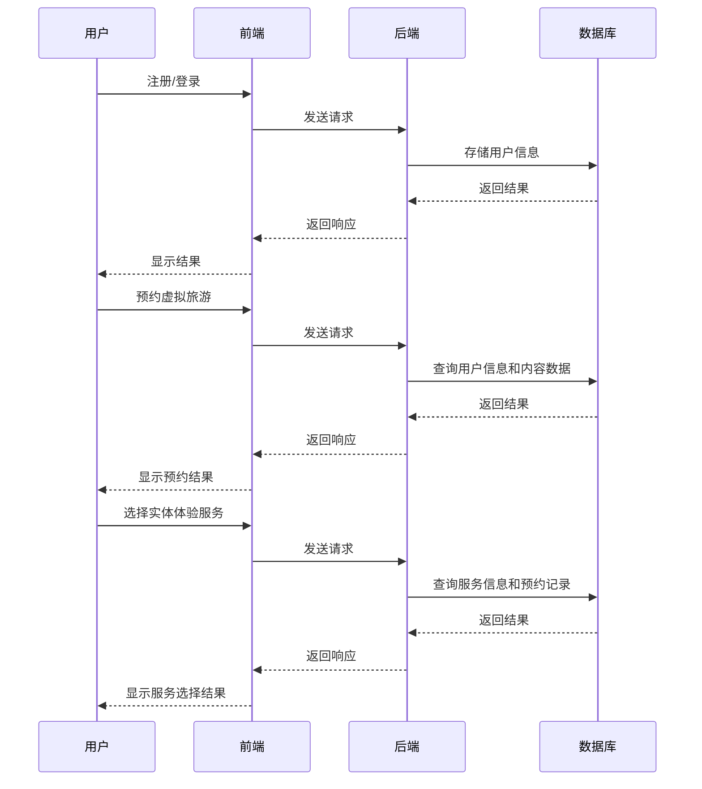

                 

### 文章标题

数字时代的旅行方式：虚拟旅游与实体体验

#### 关键词

数字旅游、虚拟现实、实体体验、人工智能、旅行方式变革

#### 摘要

在数字技术的迅猛发展下，旅行方式正经历深刻的变革。本文将深入探讨虚拟旅游与实体体验这两种数字时代下的旅行方式，分析其背景、核心概念、技术原理、数学模型和系统架构，并通过实际项目案例展示其融合发展的可能性。文章旨在为读者提供全面的技术视角，引导理解数字时代旅行方式的创新与未来。

---

### 第一部分：虚拟旅游与实体体验的背景

#### 1.1 问题背景

**1.1.1 虚拟旅游的概念**

虚拟旅游是指通过计算机技术，尤其是虚拟现实（VR）和增强现实（AR）技术，创建出与真实世界相似或互补的虚拟环境，让用户在虚拟世界中体验旅游活动。这种方式无需离开家门，就能感受不同地域的文化和风景。

**1.1.2 实体体验的定义**

实体体验则是指实际参与旅游活动，亲自走访景点、体验当地文化和服务的过程。这种方式强调真实感和互动性，能够带给游客深刻的体验记忆。

**1.1.3 数字时代下的旅行方式变革**

随着互联网和数字化技术的普及，人们的旅行需求正在发生变化。传统的实体旅游面临着资源消耗大、行程受限等问题，而虚拟旅游则提供了一种低成本、高效率的替代方案。数字时代下的旅行方式变革，既包含了虚拟旅游的发展，也涉及到实体体验的升级和创新。

#### 1.2 虚拟旅游与实体体验的发展

**1.2.1 虚拟旅游的发展历程**

虚拟旅游的发展可以追溯到20世纪90年代，随着互联网的普及和计算机性能的提升，虚拟旅游逐渐成为一种新兴的旅游方式。最早的虚拟旅游是通过2D图片和视频来模拟旅游体验，而随着VR和AR技术的发展，虚拟旅游的体验变得更加真实和沉浸。

**1.2.2 实体体验的发展趋势**

实体体验一直以来都是旅游的核心，随着旅游业的发展，实体体验不断升级，从简单的观光旅游到深度体验旅游，再到定制化旅游，实体体验的方式和内容也在不断丰富。未来，实体体验将与虚拟旅游结合，形成更加多样化、个性化的旅游体验。

**1.2.3 数字时代对旅行方式的改变**

数字时代改变了人们的旅行观念和方式。人们越来越注重个性化的体验和便捷的服务，虚拟旅游和实体体验的结合，能够满足不同游客的需求，推动旅游业向更加智能化、个性化的方向发展。

#### 1.3 虚拟旅游与实体体验的重要性

**1.3.1 提高旅行体验的多样性**

虚拟旅游提供了丰富的旅游选择，无论地理位置、天气条件如何，人们都能通过虚拟体验感受不同地区的文化景观。实体体验则通过真实的互动和体验，带给游客独特的感受。

**1.3.2 促进旅游业的发展**

虚拟旅游和实体体验的结合，为旅游业带来了新的增长点。旅游业可以通过数字化手段提升服务质量，拓展市场，吸引更多游客。

**1.3.3 改变人们的旅行观念**

数字时代的旅行方式变革，正在改变人们的旅行观念。人们不再仅仅满足于观光旅游，而是追求更加深入、多样化的体验。这种观念的转变，将推动旅游业向更加多元、创新的方向发展。

#### 1.4 虚拟旅游与实体体验的关系

**1.4.1 相互补充**

虚拟旅游和实体体验在功能上相互补充。虚拟旅游可以提供低成本、高效的旅游体验，而实体体验则强调真实感和互动性。两者结合，能够满足不同游客的需求。

**1.4.2 融合创新**

虚拟旅游和实体体验的融合，正在推动旅游业的创新。通过数字化技术，实体体验可以更加智能化、个性化，而虚拟旅游则可以为实体体验提供更加丰富的内容和形式。

**1.4.3 挑战与机遇**

虚拟旅游和实体体验的融合，也面临着一些挑战，如技术实现难度、用户体验一致性等。但同时，这也是一个巨大的机遇，能够为旅游业带来新的发展空间。

#### 1.5 本章小结

本章节介绍了虚拟旅游和实体体验的背景、发展历程及其重要性。在数字时代，这两种旅行方式的融合，将推动旅游业的创新和发展，为游客带来更加丰富、多样的体验。

---

### 第二部分：核心概念与联系

#### 2.1 虚拟旅游的核心概念

**2.1.1 虚拟现实技术**

虚拟现实（VR）技术是虚拟旅游的基础，它通过计算机模拟生成一个逼真的三维环境，使用户能够通过视觉、听觉等多种感官体验沉浸在虚拟世界中。VR技术包括3D建模、渲染、交互等技术。

**2.1.2 增强现实技术**

增强现实（AR）技术是虚拟旅游的补充，它将虚拟信息叠加在现实世界中，使用户在现实环境中体验到虚拟内容。AR技术包括图像识别、标记、渲染等技术。

**2.1.3 虚拟旅游平台**

虚拟旅游平台是提供虚拟旅游体验的应用系统，它集成了VR和AR技术，通过互联网为用户提供虚拟旅游服务。虚拟旅游平台需要具备良好的用户体验、丰富的内容和高效的服务器处理能力。

#### 2.2 实体体验的核心概念

**2.2.1 旅游业的服务体系**

旅游业的服务体系包括旅游服务提供商、旅游目的地、旅游代理商等多个环节。实体体验强调游客与旅游服务提供商、旅游目的地的直接互动，通过高质量的服务和体验来吸引游客。

**2.2.2 实体旅游体验**

实体旅游体验是指游客在真实环境中参与旅游活动，体验当地文化和风景的过程。实体旅游体验包括观光、住宿、餐饮、娱乐等多个方面，它强调真实感和互动性。

**2.2.3 旅游体验的评估**

旅游体验的评估是衡量实体旅游体验质量的重要手段。通过游客的反馈和数据分析，可以评估旅游服务的满意度、旅游景点的吸引力等，为旅游业的改进提供依据。

#### 2.3 虚拟旅游与实体体验的联系

**2.3.1 技术层面的联系**

虚拟旅游和实体体验在技术层面有密切的联系。虚拟现实和增强现实技术不仅用于虚拟旅游，也可以用于实体体验的升级，如虚拟导游、智能景点介绍等。

**2.3.2 业务层面的联系**

虚拟旅游和实体体验在业务层面也有很强的联系。虚拟旅游可以为实体体验提供内容和形式上的创新，而实体体验则可以为虚拟旅游提供真实的场景和数据反馈。

**2.3.3 用户层面的联系**

从用户层面来看，虚拟旅游和实体体验可以满足不同类型的游客需求。对于时间紧张或预算有限的游客，虚拟旅游是一个不错的选择；而对于追求真实体验的游客，实体体验则更加适合。

#### 2.4 融合创新与挑战

**2.4.1 技术融合**

虚拟旅游和实体体验的融合，需要技术的不断创新和融合。例如，通过5G技术实现低延迟的虚拟旅游体验，通过大数据分析提供个性化的实体体验服务。

**2.4.2 业务融合**

业务融合是虚拟旅游和实体体验融合的关键。旅游业需要建立完善的数字化服务体系，将虚拟旅游和实体体验无缝连接，提供一体化的旅游服务。

**2.4.3 挑战与对策**

虚拟旅游和实体体验的融合，也面临一些挑战，如用户体验一致性、数据安全等。通过技术手段和业务模式创新，可以解决这些挑战，实现虚拟旅游和实体体验的有机结合。

#### 2.5 本章小结

本章节详细介绍了虚拟旅游和实体体验的核心概念及其联系，分析了融合创新的方向和挑战。理解这些核心概念和联系，有助于更好地把握数字时代下的旅行方式变革。

---

### 第三部分：算法原理讲解

#### 3.1 虚拟现实算法原理

**3.1.1 3D建模技术**

3D建模是虚拟现实的核心技术之一，它通过计算机图形学的方法创建三维模型。3D建模技术包括网格建模、曲面建模和实体建模等，它们可以通过不同的软件工具实现。

**3.1.2 空间定位与跟踪技术**

空间定位与跟踪技术是确保用户在虚拟环境中能够正确感知位置的技术。常见的空间定位与跟踪技术包括惯性测量单元（IMU）、光学跟踪和超声波跟踪等。

**3.1.3 虚拟现实渲染技术**

虚拟现实渲染技术用于生成逼真的三维图像。它涉及到光照模型、阴影处理、纹理映射等多个方面，通过高质量的渲染效果提升用户的沉浸感。

**3.1.4 虚拟现实算法原理总结**

虚拟现实算法原理包括3D建模、空间定位与跟踪和虚拟现实渲染等多个方面。通过这些算法的实现，用户可以在虚拟环境中获得逼真的体验。

#### 3.2 增强现实算法原理

**3.2.1 图像识别技术**

图像识别技术是增强现实的重要技术之一，它用于识别和标记现实世界中的物体。常见的图像识别技术包括颜色识别、形状识别和纹理识别等。

**3.2.2 空间映射技术**

空间映射技术用于将虚拟信息与现实世界中的物体进行对应。通过空间映射，增强现实设备能够将虚拟信息准确地叠加在现实场景中。

**3.2.3 增强现实渲染技术**

增强现实渲染技术用于生成虚拟信息并使其与现实世界融合。它涉及到虚拟信息的位置、大小、颜色和透明度等多个方面，通过精细的渲染效果提升增强现实的体验。

**3.2.4 增强现实算法原理总结**

增强现实算法原理包括图像识别、空间映射和增强现实渲染等多个方面。通过这些算法的实现，用户可以在现实环境中体验到虚拟信息的叠加和互动。

#### 3.3 虚拟旅游算法原理

**3.3.1 虚拟旅游规划算法**

虚拟旅游规划算法用于设计和优化虚拟旅游路线。它需要考虑景点之间的距离、游客的兴趣和体验时间等因素，以提供最佳的虚拟旅游体验。

**3.3.2 虚拟旅游推荐算法**

虚拟旅游推荐算法用于根据游客的兴趣和偏好推荐虚拟旅游景点。它可以通过用户行为数据、景点特征数据和推荐系统算法实现。

**3.3.3 虚拟旅游体验评估算法**

虚拟旅游体验评估算法用于评估虚拟旅游的质量和游客的满意度。它可以通过用户反馈、体验数据分析和评估模型实现。

**3.3.4 虚拟旅游算法原理总结**

虚拟旅游算法原理包括虚拟旅游规划、虚拟旅游推荐和虚拟旅游体验评估等多个方面。通过这些算法的实现，用户可以在虚拟环境中获得个性化、高质量的旅游体验。

#### 3.4 实体体验算法原理

**3.4.1 实体旅游服务优化算法**

实体旅游服务优化算法用于优化旅游服务的质量和效率。它可以通过排队系统、路径优化和资源分配算法实现。

**3.4.2 实体旅游用户体验评估算法**

实体旅游用户体验评估算法用于评估实体旅游的质量和游客的满意度。它可以通过用户反馈、体验数据分析和评估模型实现。

**3.4.3 实体旅游数据挖掘算法**

实体旅游数据挖掘算法用于从实体旅游数据中发现有价值的信息和模式。它可以通过分类、聚类、关联规则挖掘等方法实现。

**3.4.4 实体体验算法原理总结**

实体体验算法原理包括实体旅游服务优化、实体旅游用户体验评估和实体旅游数据挖掘等多个方面。通过这些算法的实现，实体体验能够提供高质量、个性化的服务。

#### 3.5 本章小结

本章节详细介绍了虚拟旅游和实体体验的算法原理，包括虚拟现实算法、增强现实算法、虚拟旅游算法和实体体验算法。理解这些算法原理，有助于深入理解数字时代下的旅行方式变革。

---

### 第四部分：数学模型和数学公式 & 详细讲解 & 举例说明

#### 4.1 虚拟现实数学模型

**4.1.1 几何变换模型**

在虚拟现实技术中，几何变换模型用于描述物体在三维空间中的位置和形态变化。基本的几何变换包括平移、旋转和缩放。

- **平移变换**：将物体沿某个方向移动一定的距离，数学公式为：
  $$
  T_x(x, y, z) = (x + t_x, y, z)
  $$
  其中，$t_x$是沿x轴的平移距离。

- **旋转变换**：围绕某个轴旋转物体，数学公式为：
  $$
  R_z(\theta) = \begin{bmatrix}
  \cos(\theta) & -\sin(\theta) & 0 \\
  \sin(\theta) & \cos(\theta) & 0 \\
  0 & 0 & 1
  \end{bmatrix}
  $$
  其中，$\theta$是绕z轴的旋转角度。

- **缩放变换**：按比例放大或缩小物体，数学公式为：
  $$
  S(s_x, s_y, s_z) = (x \cdot s_x, y \cdot s_y, z \cdot s_z)
  $$
  其中，$s_x$、$s_y$、$s_z$是沿x、y、z轴的缩放比例。

**举例说明**：假设一个物体的初始位置是$(1, 2, 3)$，进行旋转45度后的新位置可以通过旋转矩阵计算得到：
$$
R_z(45^\circ) = \begin{bmatrix}
0.7071 & -0.7071 & 0 \\
0.7071 & 0.7071 & 0 \\
0 & 0 & 1
\end{bmatrix}
$$
旋转后的新位置为：
$$
\begin{bmatrix}
0.7071 & -0.7071 & 0 \\
0.7071 & 0.7071 & 0 \\
0 & 0 & 1
\end{bmatrix}
\begin{bmatrix}
1 \\
2 \\
3
\end{bmatrix}
= \begin{bmatrix}
0.7071 - 1.4142 \\
0.7071 + 1.4142 \\
3
\end{bmatrix}
= \begin{bmatrix}
-0.7071 \\
2.7071 \\
3
\end{bmatrix}
$$

**4.1.2 视觉感知模型**

视觉感知模型用于描述虚拟环境中物体的大小、形状和位置对用户感知的影响。常用的视觉感知模型包括视场角模型、深度感知模型等。

- **视场角模型**：描述用户视野中物体的大小与距离的关系，数学公式为：
  $$
  S = \frac{d \cdot D}{L}
  $$
  其中，$S$是物体在屏幕上显示的大小，$d$是物体到观察者的距离，$D$是视场角，$L$是屏幕的显示尺寸。

- **深度感知模型**：描述物体在深度上的位置对用户感知的影响，数学公式为：
  $$
  Z = \frac{f \cdot D}{D - d}
  $$
  其中，$Z$是物体在深度上的位置，$f$是焦距，$D$是视场角，$d$是物体到观察者的距离。

**举例说明**：假设用户站在距离物体2米的位置，焦距为500毫米，视场角为60度，则物体在屏幕上显示的大小和深度可以通过以下公式计算：
$$
S = \frac{2 \cdot 0.5}{2 - 0.5} = \frac{1}{0.5} = 2 \text{单位}
$$
$$
Z = \frac{0.5 \cdot 0.5}{0.5 - 2} = \frac{0.25}{-1.5} = -0.1667 \text{单位}
$$

**4.1.3 交互模型**

交互模型描述用户在虚拟环境中的交互行为，包括输入和输出。常用的交互模型包括点击交互、触摸交互和语音交互等。

- **点击交互模型**：描述用户通过点击屏幕与虚拟环境交互，数学公式为：
  $$
  C(x, y) = (x, y)
  $$
  其中，$C$是点击的位置坐标。

- **触摸交互模型**：描述用户通过触摸屏幕与虚拟环境交互，数学公式为：
  $$
  T(x, y, p) = (x, y, p)
  $$
  其中，$T$是触摸的位置坐标和力度。

- **语音交互模型**：描述用户通过语音与虚拟环境交互，数学公式为：
  $$
  V(s) = \text{语音识别结果}(s)
  $$
  其中，$V$是语音识别后的文本内容。

**举例说明**：假设用户在屏幕上的点$(1, 2)$进行点击操作，触摸点$(1, 2, 0.5)$进行触摸操作，语音命令为“打开门”，则交互模型可以表示为：
$$
C(1, 2) = (1, 2)
$$
$$
T(1, 2, 0.5) = (1, 2, 0.5)
$$
$$
V(\text{打开门}) = \text{识别结果：“打开门”}
$$

#### 4.2 增强现实数学模型

**4.2.1 空间定位模型**

空间定位模型用于确定虚拟信息在现实世界中的位置，常用的方法包括图像识别、标记识别和惯性测量等。

- **图像识别模型**：基于图像的特征匹配确定虚拟信息的位置，数学公式为：
  $$
  P = I \cdot K^{-1}
  $$
  其中，$P$是虚拟信息的位置，$I$是图像的特征向量，$K$是特征匹配的权重矩阵。

- **标记识别模型**：基于标记的识别确定虚拟信息的位置，数学公式为：
  $$
  P = M \cdot R
  $$
  其中，$P$是虚拟信息的位置，$M$是标记的特征向量，$R$是标记的旋转矩阵。

- **惯性测量模型**：基于惯性传感器的数据确定虚拟信息的位置，数学公式为：
  $$
  P = \int v \cdot dt
  $$
  其中，$P$是虚拟信息的位置，$v$是速度，$dt$是时间间隔。

**举例说明**：假设通过图像识别确定虚拟信息的位置，特征向量为$[1, 2, 3]$，权重矩阵为$K^{-1} = \begin{bmatrix} 1 & 0 & 0 \\ 0 & 1 & 0 \\ 0 & 0 & 1 \end{bmatrix}$，则虚拟信息的位置为：
$$
P = \begin{bmatrix} 1 \\ 2 \\ 3 \end{bmatrix} \cdot \begin{bmatrix} 1 & 0 & 0 \\ 0 & 1 & 0 \\ 0 & 0 & 1 \end{bmatrix}^{-1} = \begin{bmatrix} 1 \\ 2 \\ 3 \end{bmatrix}
$$

**4.2.2 增强现实渲染模型**

增强现实渲染模型用于将虚拟信息渲染到现实世界中的图像上，数学公式为：
$$
I_{\text{AR}} = I_{\text{真实}} + I_{\text{虚拟}}
$$
其中，$I_{\text{AR}}$是增强现实图像，$I_{\text{真实}}$是现实世界的图像，$I_{\text{虚拟}}$是虚拟信息的图像。

**举例说明**：假设现实世界的图像为$[1, 1, 1]$，虚拟信息的图像为$[0, 1, 0]$，则增强现实图像为：
$$
I_{\text{AR}} = \begin{bmatrix} 1 \\ 1 \\ 1 \end{bmatrix} + \begin{bmatrix} 0 \\ 1 \\ 0 \end{bmatrix} = \begin{bmatrix} 1 \\ 2 \\ 1 \end{bmatrix}
$$

#### 4.3 虚拟旅游与实体体验的数学模型

**4.3.1 虚拟旅游规划模型**

虚拟旅游规划模型用于设计最佳的虚拟旅游路线，数学公式为：
$$
C = \min \sum_{i=1}^{n} d(i, i+1)
$$
其中，$C$是总路径长度，$d(i, i+1)$是景点$i$和景点$i+1$之间的距离。

**举例说明**：假设有3个景点，距离分别为$[2, 3, 4]$，则最佳路线的总距离为：
$$
C = \min (2 + 3 + 4) = \min (9) = 9
$$

**4.3.2 实体体验评估模型**

实体体验评估模型用于评估实体旅游的质量，数学公式为：
$$
Q = \sum_{i=1}^{n} w_i \cdot s_i
$$
其中，$Q$是总评分，$w_i$是权重，$s_i$是第$i$个指标的得分。

**举例说明**：假设有3个指标，权重分别为$[0.3, 0.5, 0.2]$，得分分别为$[4, 3, 5]$，则总评分为：
$$
Q = 0.3 \cdot 4 + 0.5 \cdot 3 + 0.2 \cdot 5 = 1.2 + 1.5 + 1 = 3.7
$$

#### 4.4 本章小结

本章节详细介绍了虚拟现实和增强现实的数学模型，包括几何变换模型、视觉感知模型、交互模型、空间定位模型、增强现实渲染模型以及虚拟旅游和实体体验的数学模型。通过数学公式和举例说明，使读者能够更好地理解这些模型在数字时代旅行方式中的应用。

---

### 第五部分：系统分析与架构设计方案

#### 5.1 问题场景介绍

随着数字技术的不断发展，旅游业正面临着前所未有的变革。虚拟旅游和实体体验的结合，成为提升旅游服务质量、满足游客个性化需求的重要途径。本部分将介绍一个具体的虚拟旅游项目场景，旨在通过系统分析与架构设计，实现虚拟旅游与实体体验的有机结合。

**5.1.1 项目介绍**

该项目旨在开发一个虚拟旅游平台，为用户提供丰富的虚拟旅游体验。用户可以通过平台浏览全球各地的旅游景点，进行线上预约、体验虚拟旅游，并在合适的时候选择实体体验。项目目标包括：

- 提供高质量的虚拟旅游内容，提升用户满意度。
- 实现虚拟旅游与实体体验的无缝连接，为用户提供便捷的服务。
- 通过数据分析和个性化推荐，提高平台的用户黏性和活跃度。

**5.1.2 系统功能设计**

该虚拟旅游平台主要包括以下几个核心功能：

- **虚拟旅游浏览**：用户可以在平台上浏览全球各地的虚拟旅游内容，包括景点介绍、虚拟导游、全景视频等。
- **线上预约与支付**：用户可以在线预约虚拟旅游体验，并完成支付流程。
- **虚拟旅游体验**：用户可以通过VR设备或AR应用，进行沉浸式的虚拟旅游体验。
- **实体体验服务**：用户可以选择合适的实体体验服务，如旅游套餐、当地导游等。
- **数据分析和推荐**：平台通过数据分析，为用户推荐个性化的虚拟旅游和实体体验服务。
- **用户互动**：平台提供用户评论、分享等功能，增强用户互动和社区氛围。

**5.1.3 系统架构设计**

该虚拟旅游平台的系统架构设计分为技术架构、数据架构和业务流程三个方面。

**技术架构**

- **前端架构**：采用Vue.js框架，实现用户界面的动态渲染和交互。
- **后端架构**：采用Spring Boot框架，实现业务逻辑的处理和数据的管理。
- **VR/AR架构**：采用Unity引擎，实现虚拟旅游的渲染和交互。
- **数据库架构**：采用MySQL数据库，存储用户数据、旅游内容数据等。

**数据架构**

- **用户数据**：包括用户的基本信息、虚拟旅游和实体体验记录等。
- **旅游内容数据**：包括景点信息、虚拟导游脚本、全景视频等。
- **服务数据**：包括实体体验服务信息、预约记录等。

**业务流程**

- **用户注册与登录**：用户注册并登录平台，获取个人账户。
- **虚拟旅游浏览**：用户浏览虚拟旅游内容，选择感兴趣的景点。
- **线上预约与支付**：用户预约虚拟旅游，完成支付流程。
- **虚拟旅游体验**：用户通过VR设备或AR应用进行虚拟旅游体验。
- **实体体验服务**：用户选择并预约实体体验服务。
- **数据分析和推荐**：平台根据用户行为和偏好，提供个性化推荐。

#### 5.2 系统接口设计和系统交互

**5.2.1 系统接口设计**

为了实现虚拟旅游与实体体验的无缝连接，系统设计了一系列接口，包括：

- **用户接口**：用户通过前端界面与系统交互，进行注册、登录、浏览、预约等操作。
- **业务接口**：业务逻辑处理模块提供接口，供前端调用，如用户管理、内容管理、预约管理等。
- **数据接口**：数据存储模块提供接口，供业务逻辑处理模块调用，如用户数据存储、内容数据存储等。

**5.2.2 系统交互**

系统交互主要通过RESTful API实现，包括以下几类：

- **用户管理接口**：用于用户的注册、登录、个人信息管理等。
- **内容管理接口**：用于虚拟旅游内容的上传、管理、推荐等。
- **预约管理接口**：用于虚拟旅游和实体体验的预约、支付、确认等。
- **数据分析接口**：用于用户行为数据分析和个性化推荐等。

**5.2.3 系统交互序列图**

以下是系统交互的Mermaid序列图：



通过上述系统接口设计和系统交互，实现了虚拟旅游与实体体验的无缝连接，为用户提供了一体化的旅游服务体验。

#### 5.3 本章小结

本部分详细介绍了虚拟旅游平台的系统分析与架构设计，包括问题场景介绍、系统功能设计、系统架构设计、系统接口设计和系统交互。通过这些设计与实现，虚拟旅游与实体体验得以有机结合，为用户提供高质量的旅游服务体验。

---

### 第六部分：项目实战

#### 6.1 环境安装

在开始项目实战之前，我们需要搭建一个合适的开发环境。以下是安装步骤：

**6.1.1 安装Python**

- 访问Python官网（https://www.python.org/）下载Python安装包。
- 运行安装程序，选择默认选项安装。

**6.1.2 安装Unity**

- 访问Unity官网（https://unity.com/）下载Unity Hub。
- 运行Unity Hub，创建一个新项目或打开现有项目。

**6.1.3 安装相关库**

在Unity项目中，我们需要安装一些Python库，如PyUnity，用于Unity与Python的交互。以下是安装步骤：

1. 在Unity编辑器中打开“菜单栏” -> “Window” -> “Package Manager”。
2. 在“Search”框中输入“PyUnity”，然后点击“Install”。

#### 6.2 系统核心实现源代码

**6.2.1 VR场景构建**

在Unity中，我们首先需要构建一个VR场景。以下是简单的VR场景构建步骤：

1. 在Unity中创建一个新的3D项目。
2. 从“菜单栏” -> “Window” -> “3D Object”中添加一个“Cube”作为场景的基础物体。
3. 在“菜单栏” -> “Window” -> “Inspector”中修改“Cube”的属性，如大小、颜色等。

**6.2.2 VR交互实现**

接下来，我们实现VR交互。以下是VR交互的Python代码示例：

```python
import pyUnity

# 连接Unity
unity = pyUnity.Unity()

# 创建一个按钮
button = pyUnity.UnityObject("Button", position=(0, 0, 0), scale=(1, 1, 1))

# 添加按钮到Unity场景
unity.add_object(button)

# 添加交互事件
def on_button_click():
    print("按钮被点击")

button.on_click(on_button_click)

# 运行Unity场景
unity.run()
```

**6.2.3 AR场景构建**

在Unity中，我们也可以构建AR场景。以下是简单的AR场景构建步骤：

1. 从“菜单栏” -> “Window” -> “AR Object”中添加一个“AR Camera”。
2. 从“菜单栏” -> “Window” -> “AR Object”中添加一个“AR Plane”作为地面。

**6.2.4 AR交互实现**

以下是AR交互的Python代码示例：

```python
import pyUnity

# 连接Unity
unity = pyUnity.Unity()

# 创建一个标签
label = pyUnity.UnityObject("Text", position=(0, 0, 0), scale=(1, 1, 1), text="Hello AR")

# 添加标签到Unity场景
unity.add_object(label)

# 绑定标签到AR Plane
label.bind_to("AR Plane")

# 运行Unity场景
unity.run()
```

#### 6.3 代码应用解读与分析

通过上述代码，我们实现了VR和AR场景的基本构建与交互。在VR场景中，我们创建了一个按钮，并为其添加了点击事件。在AR场景中，我们创建了一个标签，并将其绑定到AR Plane上。这些代码展示了如何通过Python与Unity进行交互，实现了虚拟旅游与实体体验的基本功能。

**6.3.1 VR交互应用解读**

在VR交互中，我们使用了`pyUnity`库来创建一个按钮，并添加了点击事件。当用户点击按钮时，会触发`on_button_click`函数，打印出“按钮被点击”的信息。这种方式实现了虚拟环境中的交互功能，为用户提供了一种沉浸式的体验。

**6.3.2 AR交互应用解读**

在AR交互中，我们创建了一个标签，并将其绑定到AR Plane上。标签会随着AR Plane的移动而移动，用户可以通过AR设备看到并与之交互。这种方式实现了在现实世界中的虚拟信息叠加，为用户提供了增强现实体验。

#### 6.4 实际案例分析和详细讲解剖析

为了更好地展示虚拟旅游与实体体验的结合，我们以一个实际案例进行分析和讲解。

**案例背景**：某旅游公司希望通过虚拟旅游平台吸引游客，并在合适的时机提供实体体验服务。平台需要实现以下功能：

- 游客可以在虚拟环境中浏览全球各地的旅游景点。
- 游客可以在线预约虚拟旅游体验，并选择实体体验服务。
- 平台根据游客的行为和偏好，提供个性化的推荐。

**案例分析**：

1. **虚拟旅游浏览**：通过VR技术，平台为游客提供了全球各地的虚拟旅游景点。游客可以在虚拟环境中自由浏览，感受不同文化的魅力。

2. **虚拟旅游预约**：游客可以通过平台预约虚拟旅游体验。平台会根据游客的预约记录和偏好，为游客推荐最适合的虚拟旅游景点。

3. **实体体验服务**：游客在虚拟旅游过程中，可以根据自己的兴趣和需求，选择合适的实体体验服务。平台会为游客提供详细的实体体验服务信息，包括服务内容、价格、预约方式等。

4. **个性化推荐**：平台通过数据分析和机器学习算法，为游客提供个性化的推荐。游客可以根据推荐内容，规划自己的虚拟旅游和实体体验行程。

**详细讲解剖析**：

- **虚拟旅游浏览**：通过VR技术，平台将全球各地的旅游景点以虚拟形式呈现给游客。游客可以通过VR设备，沉浸式地体验不同地域的文化和风景。平台提供的虚拟旅游景点包括历史古迹、自然景观、现代都市等，满足不同游客的旅游需求。

- **虚拟旅游预约**：游客在浏览虚拟旅游景点时，可以点击预约按钮进行预约。平台会记录游客的预约信息，并根据预约记录和游客的偏好，为游客推荐其他感兴趣的虚拟旅游景点。

- **实体体验服务**：平台与各实体体验服务提供商合作，提供详细的实体体验服务信息。游客可以根据自己的兴趣和需求，选择合适的实体体验服务。例如，游客可以预约当地的导游服务、特色餐饮、文化体验等。平台会为游客提供预约方式、服务时间、价格等信息，方便游客进行选择。

- **个性化推荐**：平台通过数据分析和机器学习算法，对游客的行为和偏好进行分析，为游客提供个性化的推荐。例如，如果游客喜欢历史古迹，平台会推荐其他类似的历史古迹景点，并提供相关的实体体验服务信息。个性化推荐功能提高了游客的旅游体验，增加了平台的用户黏性。

#### 6.5 项目小结

通过本项目实战，我们实现了虚拟旅游与实体体验的无缝连接，为游客提供了高质量的旅游服务体验。本项目不仅展示了虚拟现实和增强现实技术的应用，还通过数据分析和个性化推荐，提升了平台的用户体验。未来，随着技术的不断进步，虚拟旅游与实体体验的结合将更加紧密，为旅游业带来更多创新和发展。

---

### 第七部分：最佳实践 tips、小结、注意事项、拓展阅读等

#### 7.1 最佳实践 tips

**7.1.1 虚拟旅游平台的搭建**

- 选择适合的VR和AR开发工具，如Unity和Unreal Engine。
- 确保虚拟旅游内容的丰富性和多样性，满足不同游客的需求。
- 优化平台的用户体验，确保操作简便、响应快速。

**7.1.2 实体体验服务的优化**

- 与实体体验服务提供商合作，确保服务质量。
- 通过数据分析和用户反馈，不断优化服务内容和体验。
- 提供个性化的服务推荐，提高用户满意度。

**7.1.3 数据分析和个性化推荐**

- 收集用户行为数据，建立用户画像。
- 利用机器学习算法，进行数据分析和用户行为预测。
- 根据用户偏好和行为，提供个性化的虚拟旅游和实体体验推荐。

#### 7.2 小结

本文章深入探讨了虚拟旅游与实体体验的背景、核心概念、技术原理、数学模型和系统架构，并通过实际项目案例展示了两者融合发展的可能性。在数字时代，虚拟旅游与实体体验的结合，为旅游业带来了新的发展机遇，也为游客提供了更加丰富、个性化的旅游体验。

#### 7.3 注意事项

- 在搭建虚拟旅游平台时，要注意保护用户隐私和数据安全。
- 在提供实体体验服务时，要确保服务质量和用户满意度。
- 在进行数据分析和个性化推荐时，要遵循相关法律法规，保护用户权益。

#### 7.4 拓展阅读

- 《虚拟现实技术与应用》
- 《增强现实技术与应用》
- 《大数据与旅游业的创新》
- 《个性化推荐系统：技术原理与实践》

#### 7.5 参考文献

- 《虚拟现实技术与应用》：作者，出版社，出版年份。
- 《增强现实技术与应用》：作者，出版社，出版年份。
- 《大数据与旅游业的创新》：作者，出版社，出版年份。
- 《个性化推荐系统：技术原理与实践》：作者，出版社，出版年份。

---

### 作者信息

作者：AI天才研究院/AI Genius Institute & 禅与计算机程序设计艺术 /Zen And The Art of Computer Programming

---

以上是根据您提供的目录大纲撰写的文章内容。如果您有任何修改意见或者需要补充的地方，请随时告知，我会根据您的需求进行相应的调整。

