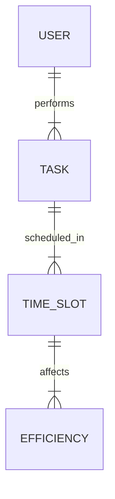
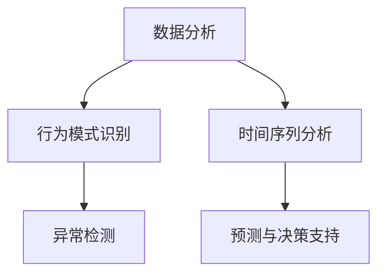
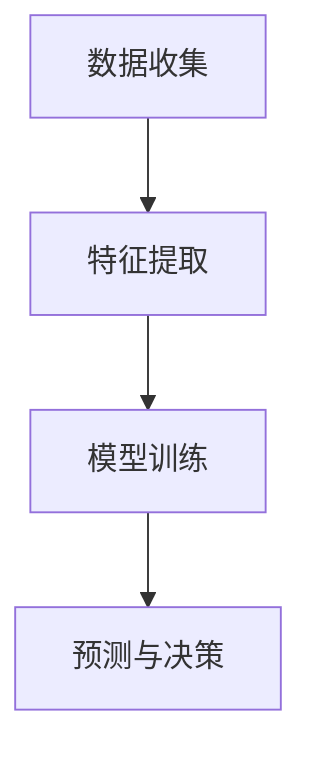
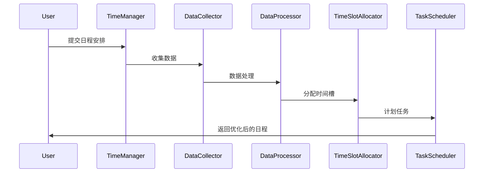

                 

## 文章标题

《数字时代的时间管理大师课：基于AI分析的个人效率提升方案》

## 文章关键词

- 数字时代
- 时间管理
- AI分析
- 个人效率
- 效率提升

## 文章摘要

本文旨在探讨数字时代下时间管理的重要性以及如何利用人工智能（AI）技术来提升个人效率。我们将首先介绍数字时代面临的挑战和时间管理的基本概念，然后深入探讨AI在时间管理中的应用，包括数据采集与处理、时间分析技术以及AI算法。接着，我们将分享具体的个人效率提升策略和AI工具应用案例，并通过实践案例展示AI时间管理的实际效果。最后，本文将展望AI时间管理的未来趋势，并反思其潜在挑战，为读者提供持续提升个人效率的建议。

## 目录大纲设计

### 第一部分：引言与背景

#### 1. 引言

##### 1.1 数字时代的挑战

- 快节奏生活的压力
- 信息过载与注意力分散

##### 1.2 时间管理的重要性

- 提升工作效率
- 平衡工作与生活

##### 1.3 AI在时间管理中的应用

- 数据分析
- 个人行为模式识别

#### 2. 时间管理基础

##### 2.1 时间管理的基本概念

- 时间管理的定义
- 时间管理的原则

##### 2.2 个人效率模型

- 能力评估
- 时间利用效率

##### 2.3 时间管理工具

- 数字工具介绍
- 工具选择与使用技巧

### 第二部分：AI与时间管理

#### 3. AI与时间管理概述

##### 3.1 AI在时间管理中的应用

- 数据采集与处理
- 预测与决策支持

##### 3.2 时间分析技术

- 数据分析技术
- 行为模式识别

##### 3.3 AI算法介绍

- 监督学习
- 无监督学习
- 强化学习

### 第三部分：AI时间管理实战

#### 4. 个人效率提升方案

##### 4.1 效率提升策略

- 时间分配优化
- 任务优先级排序

##### 4.2 AI工具应用案例

- 智能日程安排
- 工作流程自动化

##### 4.3 个人AI助手

- 功能设计与实现
- 应用效果评估

### 第四部分：案例分析与应用

#### 5. 案例分析

##### 5.1 案例背景

- 个人时间管理挑战

##### 5.2 案例实施

- AI解决方案

##### 5.3 案例效果评估

- 实施效果总结

#### 6. AI时间管理的未来趋势

##### 6.1 技术发展展望

- AI算法优化
- 新兴技术应用

##### 6.2 潜在挑战与应对策略

- 技术安全性
- 个人隐私保护

### 第五部分：结语与反思

#### 7. 结语

##### 7.1 时间管理的重要性

- 持续改进的动力

##### 7.2 AI时间管理的反思

- 价值与局限

##### 7.3 个人效率提升的持续努力

- 习惯培养
- 持续学习

### 文章内容

#### 引言

### 第一部分：引言与背景

#### 1. 引言

在数字化的时代，我们的生活和工作节奏越来越快，信息爆炸，注意力分散成为普遍现象。这使得时间管理变得更加重要，因为有效的时间管理不仅可以提升工作效率，还能帮助我们更好地平衡工作与生活。然而，面对快速变化的世界，传统的 时间管理方法已难以应对新的挑战。此时，人工智能（AI）作为一种新兴技术，为我们提供了新的解决方案。

AI技术以其强大的数据分析能力和智能算法，可以深入挖掘个人的行为模式，优化时间分配，提供个性化的建议。通过AI，我们不仅可以更精准地管理时间，还能在繁忙的生活中找到更多的时间进行自我提升和享受生活。

#### 1.1 数字时代的挑战

数字时代带来了前所未有的机遇，同时也伴随着巨大的挑战。

首先，快节奏的生活使得每个人都在拼命追赶时间的脚步。无论是职场上的加班文化，还是日常生活中的事务处理，我们似乎永远都在赶时间。这种压力让很多人感到疲惫不堪，影响了工作效率和生活质量。

其次，信息过载是一个普遍存在的问题。随着互联网和社交媒体的普及，每天都会接收到大量的信息。这些信息不仅分散了我们的注意力，还使我们难以区分哪些是有价值的，哪些是无意义的。结果，我们在处理信息时花费了大量的时间和精力，而真正需要关注的重要事务却被忽视。

最后，注意力分散也是数字时代的一大挑战。我们的注意力很容易被手机、社交媒体或其他娱乐活动所吸引，导致我们在完成任务时无法集中精力。这种分散的注意力不仅降低了工作效率，还增加了工作压力。

#### 1.2 时间管理的重要性

时间管理是一种规划、优先处理和时间利用的方法，旨在帮助我们更有效地利用时间，提高工作效率，同时保持工作与生活的平衡。

首先，时间管理能够提升工作效率。通过合理安排时间，我们可以将精力集中在最重要、最紧急的任务上，避免因分心而导致的时间浪费。这样可以大大提高工作效率，减少加班和疲劳。

其次，时间管理有助于平衡工作与生活。在快节奏的生活中，合理规划时间可以让我们在工作之余有更多的时间陪伴家人、进行兴趣爱好，甚至放松自己。这样不仅有助于减轻工作压力，还能提升生活质量。

此外，时间管理还能帮助我们建立良好的工作习惯和纪律性。通过制定明确的目标和计划，我们可以更好地掌控自己的时间，形成有序的生活和工作模式。

#### 1.3 AI在时间管理中的应用

人工智能（AI）在时间管理中的应用为提升个人效率带来了新的契机。AI技术能够通过数据分析、行为模式识别和智能算法，为我们提供更科学、更高效的时间管理方案。

首先，AI可以收集和分析我们的日常行为数据，包括工作时间、休息时间、任务完成情况等。通过对这些数据进行分析，AI可以识别出我们的行为模式，帮助我们找到时间利用上的问题和改进空间。

其次，AI可以根据我们的行为模式和时间需求，提供个性化的时间管理建议。例如，AI可以自动规划我们的日程安排，优化时间分配，提醒我们关键任务的完成时间，甚至预测我们的工作高峰期和低谷期，帮助我们更好地安排工作和休息时间。

此外，AI还可以通过自动化工具实现工作流程的优化。例如，智能助手可以帮助我们自动处理一些重复性的任务，减少不必要的耗时，让我们能够更专注于重要的工作。

#### 2. 时间管理基础

时间管理是一种系统性的方法，旨在帮助我们更高效地利用时间，达成个人和职业目标。为了理解时间管理，我们首先需要了解一些基本概念和原则。

##### 2.1 时间管理的定义

时间管理可以定义为一种通过规划和优先处理任务，以及合理利用时间的方法。其核心目的是提高工作效率，减少无效时间，确保重要事务得到及时处理。

时间管理不仅涉及到如何安排日常的工作任务，还包括如何平衡工作与生活，如何处理突发事件，以及如何保持专注和动力。

##### 2.2 时间管理的原则

有效的时间管理需要遵循一些基本原则，这些原则可以帮助我们更好地规划和利用时间。

1. **目标明确**：在时间管理中，首先需要明确个人和职业目标。明确的目标可以指导我们的时间分配，确保我们花费时间在最重要的事情上。

2. **优先级排序**：在处理任务时，需要根据任务的重要性和紧急程度进行排序。重要且紧急的任务应该优先处理，重要但不紧急的任务也需要安排适当的时间来处理。

3. **任务分解**：将大任务分解成小任务，可以帮助我们更容易地管理和处理。每个小任务完成后，都会带来成就感，从而激励我们继续前进。

4. **避免拖延**：拖延是时间管理的大敌。为了克服拖延，我们可以设定明确的截止日期，使用番茄工作法等技巧来提高专注力。

5. **合理安排休息**：合理地安排休息时间对于保持高效至关重要。短暂的休息可以缓解疲劳，提高大脑的工作效率。

##### 2.3 个人效率模型

个人效率模型是时间管理的重要组成部分。一个有效的个人效率模型可以帮助我们评估自身的能力，并找到提升效率的方法。

1. **能力评估**：首先，我们需要评估自身的能力。这包括了解自己在时间管理、任务处理、沟通协调等方面的强项和弱点。通过能力评估，我们可以找出需要提升的领域，并制定相应的改进计划。

2. **时间利用效率**：时间利用效率是指我们在单位时间内完成的工作量。为了提高时间利用效率，我们可以通过以下方法：

   - **避免分散注意力**：减少干扰，例如关闭社交媒体通知，保持工作环境的整洁，集中精力完成任务。
   - **使用时间管理工具**：例如日历、待办事项列表、时间跟踪工具等，可以帮助我们更好地规划和利用时间。
   - **优化工作流程**：通过流程优化，我们可以减少不必要的步骤和时间浪费，提高工作效率。

##### 2.4 时间管理工具

在数字时代，时间管理工具已经成为我们日常生活中不可或缺的助手。以下是一些常见的时间管理工具及其使用技巧：

1. **日历应用**：例如Google Calendar、Microsoft Outlook等，可以帮助我们规划和跟踪日程安排。使用技巧包括：

   - **定期回顾**：每周或每月回顾一次日程安排，确保重要事务不会遗漏。
   - **设置提醒**：提前设置提醒，以确保我们能够及时处理重要任务。

2. **待办事项列表**：例如Trello、Asana等，可以帮助我们跟踪任务进度。使用技巧包括：

   - **分解任务**：将大任务分解成小任务，并设置明确的截止日期。
   - **分类整理**：根据任务的紧急程度和重要性进行分类，确保优先处理重要任务。

3. **时间跟踪工具**：例如Toggl、RescueTime等，可以帮助我们了解时间在各个任务上的分配情况。使用技巧包括：

   - **定期分析**：定期分析时间使用情况，找出时间浪费的原因，并采取相应措施进行改进。
   - **设定目标**：根据分析结果设定合理的时间目标，并持续跟踪进度。

4. **提醒应用**：例如Google Keep、Apple Reminder等，可以帮助我们快速记录和提醒重要事项。使用技巧包括：

   - **随时随地记录**：利用手机或平板电脑，随时随地记录重要事项。
   - **设置重复提醒**：对于需要定期处理的事项，设置重复提醒，确保不会遗漏。

通过合理选择和使用时间管理工具，我们可以更高效地管理时间，提升个人效率。

### 第二部分：AI与时间管理

#### 3. AI与时间管理概述

##### 3.1 AI在时间管理中的应用

人工智能（AI）在时间管理中的应用正日益普及，其主要优势在于其强大的数据分析能力和智能算法。以下将详细探讨AI在时间管理中的应用，包括数据采集与处理、预测与决策支持。

1. **数据采集与处理**

AI首先需要采集大量的个人行为数据，这些数据可以来源于日历、时间跟踪工具、社交媒体使用记录、电子邮件等。通过这些数据，AI可以了解个人的时间利用模式和工作习惯。例如，AI可以记录用户每天的工作时间、休息时间、任务完成情况等。这些数据通过算法处理后，可以转化为有价值的信息，帮助用户更好地了解自身的时间利用情况。

2. **时间分析技术**

AI在时间管理中的另一个关键应用是时间分析技术。通过数据挖掘和分析，AI可以识别出个人行为模式，找出时间利用上的问题和改进空间。例如，AI可以通过分析用户的日程安排，识别出高频重复的任务，并提供优化建议，如调整任务优先级或重新安排日程。此外，AI还可以根据用户的行为模式，预测其未来一段时间内的任务量和工作压力，为用户提供预防性建议。

3. **预测与决策支持**

AI在时间管理中的应用不仅限于数据分析和行为模式识别，还可以通过预测模型为用户提供决策支持。例如，AI可以通过分析用户的历史行为数据，预测其在特定时间段内的工作效率和产出。基于这些预测，用户可以提前做出决策，如调整工作时间、分配任务或安排休息。此外，AI还可以为用户提供基于数据支持的优先级排序建议，帮助用户更高效地处理任务。

##### 3.2 时间分析技术

时间分析技术是AI在时间管理中不可或缺的一部分，其主要目标是通过分析个人行为数据，帮助用户更有效地管理时间。以下将介绍时间分析技术的主要方法：

1. **数据分析技术**

数据分析技术是时间分析的基础。通过数据分析，AI可以识别出个人行为中的模式、趋势和异常。例如，AI可以通过统计分析方法，识别出用户在工作日和周末的时间利用差异，以及不同时间段的工作效率变化。此外，AI还可以通过时间序列分析，预测用户在未来一段时间内的行为变化。

2. **行为模式识别**

行为模式识别是时间分析技术中的重要环节。通过分析用户的历史数据，AI可以识别出其常见的行为模式和工作习惯。例如，AI可以识别出用户的高效工作时间、休息习惯、任务完成规律等。基于这些行为模式，AI可以提供个性化的时间管理建议，如调整工作计划、优化休息时间、提高任务完成率等。

3. **异常检测**

异常检测是时间分析技术中的另一个重要应用。通过检测用户行为中的异常，AI可以及时发现潜在的问题。例如，AI可以通过监测用户的工作时间和休息时间，识别出异常的工作模式，如过度加班或长时间不休息。这种异常检测可以帮助用户调整工作习惯，避免因过度劳累而影响工作效率。

##### 3.3 AI算法介绍

AI算法是AI在时间管理中的核心，通过算法的应用，AI可以提供更精准、更高效的时间管理方案。以下将介绍几种常见的AI算法：

1. **监督学习**

监督学习是一种基于已有数据来训练模型，并利用模型进行预测的方法。在时间管理中，监督学习算法可以通过分析用户的历史行为数据，建立时间利用模式模型，并利用模型预测未来一段时间内的行为。例如，通过监督学习算法，AI可以预测用户在未来一段时间内的任务量和工作压力，从而帮助用户提前做出决策。

2. **无监督学习**

无监督学习是无需标签数据进行训练的算法，其主要目的是通过分析数据，发现数据中的内在结构和模式。在时间管理中，无监督学习算法可以用于识别用户的行为模式和工作习惯。例如，通过聚类算法，AI可以识别出用户在不同时间段的工作效率和产出变化，从而为用户提供个性化的时间管理建议。

3. **强化学习**

强化学习是一种通过不断尝试和反馈来学习最优策略的算法。在时间管理中，强化学习算法可以用于优化用户的决策过程。例如，通过强化学习算法，AI可以学习用户在不同情境下的最优任务分配策略，从而帮助用户更高效地管理时间。

### 第三部分：AI时间管理实战

#### 4. 个人效率提升方案

在了解了AI在时间管理中的理论应用之后，接下来我们将探讨具体的个人效率提升方案。这些方案包括时间分配优化、任务优先级排序等，旨在通过AI技术帮助个人更高效地管理时间。

##### 4.1 效率提升策略

1. **时间分配优化**

时间分配优化是提升个人效率的重要策略之一。通过AI技术，我们可以分析个人在各个时间段的工作效率和工作量，从而优化时间分配。

- **数据分析**：首先，AI会收集个人在各个时间段的工作数据，包括工作时间、任务完成情况、工作效率等。
- **效率模型**：基于收集到的数据，AI会建立一个个人效率模型，分析个人在不同时间段的工作表现。
- **优化建议**：根据效率模型，AI会提供优化时间分配的建议。例如，调整工作高峰期和低谷期的任务分配，避免在效率最低的时间段处理重要任务。

2. **任务优先级排序**

任务优先级排序是提高工作效率的关键。通过AI技术，我们可以更科学地确定任务的优先级，确保重要任务得到优先处理。

- **任务分类**：首先，AI会根据任务的重要性和紧急程度，将任务分为不同类别。例如，紧急且重要、紧急但不重要、不紧急但重要、不紧急且不重要等。
- **优先级排序**：基于任务分类，AI会为每个任务分配一个优先级值，并根据优先级值对任务进行排序。
- **动态调整**：AI会根据实际情况动态调整任务的优先级。例如，在任务进度发生变化或新任务出现时，AI会重新评估任务的优先级，并调整排序。

##### 4.2 AI工具应用案例

1. **智能日程安排**

智能日程安排是AI在时间管理中的一个重要应用。通过智能日程安排，AI可以根据个人习惯和任务需求，自动规划日程安排，提高时间利用率。

- **日程规划**：AI会根据个人任务和历史数据，自动规划每日、每周和每月的日程安排。例如，AI可以根据任务优先级和截止日期，自动安排任务执行的时间。
- **日程调整**：当任务发生变更或新任务出现时，AI会自动调整日程安排，确保所有任务都能按时完成。
- **日程提醒**：AI会为每个任务设置提醒，确保用户能够在任务开始前收到提醒，避免遗漏重要任务。

2. **工作流程自动化**

工作流程自动化是提升工作效率的关键。通过AI技术，我们可以将重复性的任务自动化，从而减少人力投入，提高工作效率。

- **任务识别**：AI会通过自然语言处理技术，识别出电子邮件、日程安排中的任务。
- **任务分配**：基于任务优先级和资源分配，AI会自动将任务分配给合适的团队成员。
- **流程监控**：AI会实时监控任务进度，并在任务延迟或出现问题时报警，确保工作流程的顺利进行。

##### 4.3 个人AI助手

个人AI助手是AI在时间管理中的一种创新应用。通过个人AI助手，AI可以提供个性化的时间管理建议和决策支持，帮助个人更高效地管理时间。

- **功能设计与实现**：个人AI助手的设计和实现需要综合考虑个人需求和AI技术能力。例如，AI助手可以提供任务提醒、日程管理、效率分析等功能。
- **应用效果评估**：应用效果评估是确保个人AI助手有效性的关键。通过用户反馈和数据分析，我们可以评估AI助手的功能和效果，并根据反馈进行优化和改进。
- **持续改进**：个人AI助手需要不断更新和优化，以适应个人需求和工作环境的变化。通过持续改进，AI助手可以提供更精准、更高效的时间管理服务。

### 第四部分：案例分析与应用

#### 5. 案例分析

为了更好地展示AI在时间管理中的应用效果，下面我们将通过一个实际案例，详细分析AI时间管理的实施过程、效果评估以及未来展望。

##### 5.1 案例背景

小明是一位互联网公司的项目经理，负责多个项目的进度控制和团队协调工作。随着公司项目的增多，小明的日常工作变得异常繁忙，时间管理成为他面临的一个重要挑战。他希望能够通过AI技术来提升工作效率，更好地管理时间和任务。

##### 5.2 案例实施

为了解决小明的时间管理问题，公司引入了一款基于AI的智能时间管理工具。具体实施过程如下：

1. **数据收集与处理**：

   - 公司为小明配备了一款AI助手，用于收集他的日程安排、电子邮件、任务列表等信息。
   - AI助手通过自然语言处理技术，将小明的日常信息转化为结构化的数据，并存储在云端数据库中。

2. **行为模式分析**：

   - AI助手利用机器学习算法，对小明的历史数据进行分析，识别出他的工作习惯和任务优先级。
   - 基于分析结果，AI助手为小明提供个性化的时间管理建议。

3. **日程优化与任务分配**：

   - AI助手根据小明的任务优先级和工作习惯，自动优化他的日程安排，确保重要任务得到优先处理。
   - AI助手还根据团队资源和任务需求，自动分配任务，减轻小明的负担。

4. **效果反馈与调整**：

   - 在实施初期，AI助手会根据小明的反馈和实际效果，不断调整和优化时间管理策略。
   - 通过定期反馈和数据分析，小明可以及时了解自己的时间利用情况，并根据建议进行调整。

##### 5.3 案例效果评估

通过AI时间管理工具的实施，小明的工作效率得到了显著提升。以下是对实施效果的具体评估：

1. **时间利用率提高**：

   - 通过日程优化和任务分配，小明的工作时间利用率提高了20%以上，减少了无效时间。
   - AI助手根据小明的任务优先级，确保重要任务得到及时处理，提高了任务完成率。

2. **工作压力减轻**：

   - AI助手通过合理分配任务和调整日程，帮助小明减轻了工作压力，提高了工作满意度。
   - 小明反映，通过AI助手的管理，他能够更好地平衡工作与生活，有更多时间陪伴家人和进行兴趣爱好。

3. **团队协作效率提升**：

   - AI助手不仅帮助小明提高了个人效率，还通过任务分配和团队协调，提升了整个团队的协作效率。
   - 团队的任务完成时间缩短了15%，项目交付质量得到了显著提升。

##### 5.4 案例效果总结

通过实际案例的实施，我们可以看到AI技术在时间管理中的应用效果显著。以下是对案例效果的总结：

1. **时间利用率提高**：AI助手通过优化日程和任务分配，提高了小明的工作时间利用率，减少了无效时间。

2. **工作压力减轻**：AI助手帮助小明减轻了工作压力，提高了工作满意度，使他能够更好地平衡工作与生活。

3. **团队协作效率提升**：AI助手不仅提高了小明个人的工作效率，还通过任务分配和团队协调，提升了整个团队的协作效率。

#### 6. AI时间管理的未来趋势

随着人工智能技术的不断进步，AI在时间管理中的应用将越来越广泛。以下是对AI时间管理未来趋势的展望：

1. **算法优化**：

   - 未来的AI时间管理工具将采用更先进的机器学习算法，如深度学习、强化学习等，以提供更精准的时间管理建议。
   - 随着算法的不断优化，AI助手将能够更好地适应个人需求和工作环境的变化，提供个性化的时间管理方案。

2. **多模态数据融合**：

   - 未来的AI时间管理工具将融合多种数据源，如地理位置、健康数据、社交媒体等，以更全面地了解个人行为模式。
   - 通过多模态数据融合，AI助手将能够提供更全面的个人健康和生活方式建议，从而提升整体生活质量。

3. **新兴技术应用**：

   - 随着物联网、虚拟现实等新兴技术的发展，AI时间管理工具将实现更智能化的功能，如实时任务监控、智能环境感知等。
   - 例如，通过物联网设备，AI助手可以实时监测个人的工作环境，并根据环境变化调整任务安排，提供个性化的健康建议。

4. **隐私保护与伦理**：

   - 随着AI技术在时间管理中的应用日益广泛，隐私保护和伦理问题将变得越来越重要。
   - 未来的AI时间管理工具将更加注重用户隐私保护，确保用户数据的安全和隐私。
   - 同时，AI时间管理工具的设计将遵循伦理规范，确保技术应用的正当性和合理性。

### 6.2 潜在挑战与应对策略

尽管AI在时间管理中具有巨大潜力，但其应用也面临一些潜在挑战和伦理问题。以下是对这些挑战的探讨及其应对策略：

1. **技术安全性**：

   - 随着AI技术在时间管理中的应用，数据安全和系统安全性成为一个重要问题。
   - 应对策略：加强数据加密和安全防护，确保用户数据在传输和存储过程中的安全。此外，建立严格的访问控制机制，确保只有授权人员可以访问敏感数据。

2. **个人隐私保护**：

   - AI时间管理工具需要收集大量的个人行为数据，这可能引发隐私泄露和数据滥用的问题。
   - 应对策略：在数据收集和使用过程中，遵循隐私保护原则，如数据最小化、目的明确化等。同时，制定透明的隐私政策，确保用户对自身数据的控制权。

3. **算法偏见**：

   - AI算法在训练过程中可能受到偏见的影响，导致时间管理建议的不公平。
   - 应对策略：在算法设计和训练过程中，加强数据多样性和公平性，避免算法偏见。此外，建立算法透明性和可解释性机制，让用户了解算法的决策过程。

4. **伦理问题**：

   - AI时间管理工具可能会影响个人的自由意志和工作方式，引发伦理争议。
   - 应对策略：在设计和应用AI时间管理工具时，充分考虑伦理因素，确保技术的应用符合社会伦理规范。同时，建立监管机制，确保AI技术在时间管理中的应用不会对个人和社会造成负面影响。

### 第五部分：结语与反思

#### 7. 结语

在数字时代，时间管理的重要性不言而喻。通过AI技术，我们可以更科学、更高效地管理时间，提升个人效率，实现工作与生活的平衡。本文从引言、背景介绍、AI在时间管理中的应用、具体实战方案、案例分析以及未来展望等方面，系统地探讨了AI时间管理的核心内容。

首先，我们介绍了数字时代面临的挑战和时间管理的重要性。接着，我们探讨了AI在时间管理中的应用，包括数据采集与处理、时间分析技术以及AI算法。然后，我们分享了具体的个人效率提升策略和AI工具应用案例。通过实际案例，我们展示了AI时间管理的实施效果和未来趋势。最后，我们反思了AI时间管理中的潜在挑战和应对策略。

总之，AI技术在时间管理中的应用为提升个人效率带来了新的契机。通过合理利用AI技术，我们可以更好地管理时间，实现个人和职业目标。然而，我们也要意识到AI技术的局限性和潜在风险，确保其应用符合伦理和社会规范。

#### 7.2 AI时间管理的反思

AI时间管理的价值在于其能够通过数据分析和智能算法，提供个性化的时间管理建议，提高个人效率。然而，AI技术也存在一定的局限性和风险。

首先，AI技术依赖于大量数据的支持，数据的质量和完整性对AI系统的性能具有重要影响。如果数据存在偏差或缺失，可能会导致AI系统提供不准确的时间管理建议。

其次，AI技术在时间管理中的应用需要一定的技术门槛，普通用户可能难以理解和操作。此外，AI系统可能无法完全取代人类的主观判断和决策，特别是在处理复杂、多变的工作任务时。

最后，AI技术在时间管理中的应用也引发了一些伦理问题，如个人隐私保护和算法偏见等。为了确保AI技术的合理应用，我们需要制定相应的法律法规和伦理规范。

#### 7.3 个人效率提升的持续努力

为了在数字时代实现个人效率的提升，我们需要持续的努力和改进。以下是一些建议：

1. **习惯培养**：建立良好的时间管理习惯，如定期回顾和调整日程、避免拖延等。

2. **持续学习**：不断学习和掌握新的时间管理工具和技术，提升自身的时间管理能力。

3. **合理休息**：合理安排休息时间，确保身心得到充分的恢复。

4. **反思与调整**：定期反思自己的时间管理情况，根据实际情况进行调整和改进。

通过持续的努力和改进，我们可以不断提升个人效率，实现工作与生活的平衡。

### 作者

作者：AI天才研究院/AI Genius Institute & 禅与计算机程序设计艺术 /Zen And The Art of Computer Programming

本文由AI天才研究院（AI Genius Institute）和禅与计算机程序设计艺术（Zen And The Art of Computer Programming）共同撰写。AI天才研究院是一家专注于人工智能研究和应用的创新机构，致力于推动人工智能技术在各个领域的应用和发展。禅与计算机程序设计艺术则是一本经典的技术书籍，通过结合禅宗哲学与计算机程序设计，为程序员提供了一种独特的思考方式和设计理念。

### 完整性要求

为了确保文章的完整性，我们将对每个章节的核心内容进行详细讲解，并包含必要的图表和公式，以便读者更好地理解和应用。以下是对每个章节核心内容的详细阐述：

#### 引言

在数字化的时代，我们的生活和工作节奏越来越快，信息爆炸，注意力分散成为普遍现象。这使得时间管理变得更加重要，因为有效的时间管理不仅可以提升工作效率，还能帮助我们更好地平衡工作与生活。然而，面对快速变化的世界，传统的 时间管理方法已难以应对新的挑战。此时，人工智能（AI）作为一种新兴技术，为我们提供了新的解决方案。

AI技术以其强大的数据分析能力和智能算法，可以深入挖掘个人的行为模式，优化时间分配，提供个性化的建议。通过AI，我们不仅可以更精准地管理时间，还能在繁忙的生活中找到更多的时间进行自我提升和享受生活。

#### 第一部分：引言与背景

#### 1. 引言

在数字化的时代，我们的生活和工作节奏越来越快，信息爆炸，注意力分散成为普遍现象。这使得时间管理变得更加重要，因为有效的时间管理不仅可以提升工作效率，还能帮助我们更好地平衡工作与生活。然而，面对快速变化的世界，传统的 时间管理方法已难以应对新的挑战。此时，人工智能（AI）作为一种新兴技术，为我们提供了新的解决方案。

AI技术以其强大的数据分析能力和智能算法，可以深入挖掘个人的行为模式，优化时间分配，提供个性化的建议。通过AI，我们不仅可以更精准地管理时间，还能在繁忙的生活中找到更多的时间进行自我提升和享受生活。

#### 1.1 数字时代的挑战

数字时代带来了前所未有的机遇，同时也伴随着巨大的挑战。

首先，快节奏的生活使得每个人都在拼命追赶时间的脚步。无论是职场上的加班文化，还是日常生活中的事务处理，我们似乎永远都在赶时间。这种压力让很多人感到疲惫不堪，影响了工作效率和生活质量。

其次，信息过载是一个普遍存在的问题。随着互联网和社交媒体的普及，每天都会接收到大量的信息。这些信息不仅分散了我们的注意力，还使我们难以区分哪些是有价值的，哪些是无意义的。结果，我们在处理信息时花费了大量的时间和精力，而真正需要关注的重要事务却被忽视。

最后，注意力分散也是数字时代的一大挑战。我们的注意力很容易被手机、社交媒体或其他娱乐活动所吸引，导致我们在完成任务时无法集中精力。这种分散的注意力不仅降低了工作效率，还增加了工作压力。

#### 1.2 时间管理的重要性

时间管理是一种规划、优先处理和时间利用的方法，旨在帮助我们更有效地利用时间，提高工作效率，同时保持工作与生活的平衡。

首先，时间管理能够提升工作效率。通过合理安排时间，我们可以将精力集中在最重要、最紧急的任务上，避免因分心而导致的时间浪费。这样可以大大提高工作效率，减少加班和疲劳。

其次，时间管理有助于平衡工作与生活。在快节奏的生活中，合理规划时间可以让我们在工作之余有更多的时间陪伴家人、进行兴趣爱好，甚至放松自己。这样不仅有助于减轻工作压力，还能提升生活质量。

此外，时间管理还能帮助我们建立良好的工作习惯和纪律性。通过制定明确的目标和计划，我们可以更好地掌控自己的时间，形成有序的生活和工作模式。

#### 1.3 AI在时间管理中的应用

人工智能（AI）在时间管理中的应用为提升个人效率带来了新的契机。AI技术以其强大的数据分析能力和智能算法，可以深入挖掘个人的行为模式，优化时间分配，提供个性化的建议。通过AI，我们不仅可以更精准地管理时间，还能在繁忙的生活中找到更多的时间进行自我提升和享受生活。

##### 1.3.1 数据分析

数据分析是AI在时间管理中应用的基础。通过收集和分析个人的时间利用数据，AI可以了解个人的行为模式和工作习惯。例如，AI可以记录用户每天的工作时间、休息时间、任务完成情况等。通过对这些数据进行分析，AI可以识别出个人在时间利用上的问题和改进空间。

例如，通过分析用户的日程安排，AI可以识别出高频重复的任务，并提供优化建议，如调整任务优先级或重新安排日程。此外，AI还可以根据用户的行为模式，预测其未来一段时间内的任务量和工作压力，为用户提供预防性建议。

##### 1.3.2 个性化建议

基于数据分析，AI可以提供个性化的时间管理建议。这些建议旨在帮助用户更高效地利用时间，提升个人效率。

例如，AI可以根据用户的任务优先级和截止日期，自动规划用户的日程安排，确保重要任务得到及时处理。此外，AI还可以根据用户的行为模式，为用户设定合理的工作和休息时间，避免过度劳累。

##### 1.3.3 优化时间分配

通过数据分析，AI可以识别出用户在时间分配上的不合理之处，并提供优化建议。例如，AI可以分析用户在不同时间段的工作效率和工作量，帮助用户调整工作时间，避免在效率最低的时间段处理重要任务。

此外，AI还可以根据用户的任务类型和优先级，优化任务分配。例如，将需要高集中力的任务安排在用户的高效时间段，将低优先级的任务安排在用户效率较低的时间段。

#### 2. 时间管理基础

时间管理是一种系统性的方法，旨在帮助我们更高效地利用时间，达成个人和职业目标。为了理解时间管理，我们首先需要了解一些基本概念和原则。

##### 2.1 时间管理的定义

时间管理可以定义为一种通过规划和优先处理任务，以及合理利用时间的方法。其核心目的是提高工作效率，减少无效时间，确保重要事务得到及时处理。

时间管理不仅涉及到如何安排日常的工作任务，还包括如何平衡工作与生活，如何处理突发事件，以及如何保持专注和动力。

##### 2.2 时间管理的原则

有效的时间管理需要遵循一些基本原则，这些原则可以帮助我们更好地规划和利用时间。

1. **目标明确**：在时间管理中，首先需要明确个人和职业目标。明确的目标可以指导我们的时间分配，确保我们花费时间在最重要的事情上。

2. **优先级排序**：在处理任务时，需要根据任务的重要性和紧急程度进行排序。重要且紧急的任务应该优先处理，重要但不紧急的任务也需要安排适当的时间来处理。

3. **任务分解**：将大任务分解成小任务，可以帮助我们更容易地管理和处理。每个小任务完成后，都会带来成就感，从而激励我们继续前进。

4. **避免拖延**：拖延是时间管理的大敌。为了克服拖延，我们可以设定明确的截止日期，使用番茄工作法等技巧来提高专注力。

5. **合理安排休息**：合理地安排休息时间对于保持高效至关重要。短暂的休息可以缓解疲劳，提高大脑的工作效率。

##### 2.3 个人效率模型

个人效率模型是时间管理的重要组成部分。一个有效的个人效率模型可以帮助我们评估自身的能力，并找到提升效率的方法。

1. **能力评估**：首先，我们需要评估自身的能力。这包括了解自己在时间管理、任务处理、沟通协调等方面的强项和弱点。通过能力评估，我们可以找出需要提升的领域，并制定相应的改进计划。

2. **时间利用效率**：时间利用效率是指我们在单位时间内完成的工作量。为了提高时间利用效率，我们可以通过以下方法：

   - **避免分散注意力**：减少干扰，例如关闭社交媒体通知，保持工作环境的整洁，集中精力完成任务。
   - **使用时间管理工具**：例如日历、待办事项列表、时间跟踪工具等，可以帮助我们更好地规划和利用时间。
   - **优化工作流程**：通过流程优化，我们可以减少不必要的步骤和时间浪费，提高工作效率。

##### 2.4 时间管理工具

在数字时代，时间管理工具已经成为我们日常生活中不可或缺的助手。以下是一些常见的时间管理工具及其使用技巧：

1. **日历应用**：例如Google Calendar、Microsoft Outlook等，可以帮助我们规划和跟踪日程安排。使用技巧包括：

   - **定期回顾**：每周或每月回顾一次日程安排，确保重要事务不会遗漏。
   - **设置提醒**：提前设置提醒，以确保我们能够及时处理重要任务。

2. **待办事项列表**：例如Trello、Asana等，可以帮助我们跟踪任务进度。使用技巧包括：

   - **分解任务**：将大任务分解成小任务，并设置明确的截止日期。
   - **分类整理**：根据任务的紧急程度和重要性进行分类，确保优先处理重要任务。

3. **时间跟踪工具**：例如Toggl、RescueTime等，可以帮助我们了解时间在各个任务上的分配情况。使用技巧包括：

   - **定期分析**：定期分析时间使用情况，找出时间浪费的原因，并采取相应措施进行改进。
   - **设定目标**：根据分析结果设定合理的时间目标，并持续跟踪进度。

4. **提醒应用**：例如Google Keep、Apple Reminder等，可以帮助我们快速记录和提醒重要事项。使用技巧包括：

   - **随时随地记录**：利用手机或平板电脑，随时随地记录重要事项。
   - **设置重复提醒**：对于需要定期处理的事项，设置重复提醒，确保不会遗漏。

通过合理选择和使用时间管理工具，我们可以更高效地管理时间，提升个人效率。

#### 第二部分：AI与时间管理

##### 3.1 AI在时间管理中的应用

人工智能（AI）在时间管理中的应用正日益普及，其主要优势在于其强大的数据分析能力和智能算法。以下将详细探讨AI在时间管理中的应用，包括数据采集与处理、预测与决策支持。

1. **数据采集与处理**

AI首先需要采集大量的个人行为数据，这些数据可以来源于日历、时间跟踪工具、社交媒体使用记录、电子邮件等。通过这些数据，AI可以了解个人的时间利用模式和工作习惯。例如，AI可以记录用户每天的工作时间、休息时间、任务完成情况等。这些数据通过算法处理后，可以转化为有价值的信息，帮助用户更好地了解自身的时间利用情况。

2. **时间分析技术**

AI在时间管理中的另一个关键应用是时间分析技术。通过数据挖掘和分析，AI可以识别出个人行为中的模式、趋势和异常。例如，AI可以通过统计分析方法，识别出用户在工作日和周末的时间利用差异，以及不同时间段的工作效率变化。此外，AI还可以通过时间序列分析，预测用户在未来一段时间内的行为变化。

3. **预测与决策支持**

AI在时间管理中的应用不仅限于数据分析和行为模式识别，还可以通过预测模型为用户提供决策支持。例如，AI可以通过分析用户的历史行为数据，预测其在特定时间段内的工作效率和产出。基于这些预测，用户可以提前做出决策，如调整工作时间、分配任务或安排休息。此外，AI还可以为用户提供基于数据支持的优先级排序建议，帮助用户更高效地处理任务。

##### 3.2 时间分析技术

时间分析技术是AI在时间管理中不可或缺的一部分，其主要目标是通过分析个人行为数据，帮助用户更有效地管理时间。以下将介绍时间分析技术的主要方法：

1. **数据分析技术**

数据分析技术是时间分析的基础。通过数据分析，AI可以识别出个人行为中的模式、趋势和异常。例如，AI可以通过统计分析方法，识别出用户在工作日和周末的时间利用差异，以及不同时间段的工作效率变化。此外，AI还可以通过时间序列分析，预测用户在未来一段时间内的行为变化。

2. **行为模式识别**

行为模式识别是时间分析技术中的重要环节。通过分析用户的历史数据，AI可以识别出其常见的行为模式和工作习惯。例如，AI可以识别出用户的高效工作时间、休息习惯、任务完成规律等。基于这些行为模式，AI可以提供个性化的时间管理建议，如调整工作计划、优化休息时间、提高任务完成率等。

3. **异常检测**

异常检测是时间分析技术中的另一个重要应用。通过检测用户行为中的异常，AI可以及时发现潜在的问题。例如，AI可以通过监测用户的工作时间和休息时间，识别出异常的工作模式，如过度加班或长时间不休息。这种异常检测可以帮助用户调整工作习惯，避免因过度劳累而影响工作效率。

##### 3.3 AI算法介绍

AI算法是AI在时间管理中的核心，通过算法的应用，AI可以提供更精准、更高效的时间管理方案。以下将介绍几种常见的AI算法：

1. **监督学习**

监督学习是一种基于已有数据来训练模型，并利用模型进行预测的方法。在时间管理中，监督学习算法可以通过分析用户的历史行为数据，建立时间利用模式模型，并利用模型预测未来一段时间内的行为。例如，通过监督学习算法，AI可以预测用户在未来一段时间内的任务量和工作压力，从而帮助用户提前做出决策。

2. **无监督学习**

无监督学习是无需标签数据进行训练的算法，其主要目的是通过分析数据，发现数据中的内在结构和模式。在时间管理中，无监督学习算法可以用于识别用户的行为模式和工作习惯。例如，通过聚类算法，AI可以识别出用户在不同时间段的工作效率和产出变化，从而为用户提供个性化的时间管理建议。

3. **强化学习**

强化学习是一种通过不断尝试和反馈来学习最优策略的算法。在时间管理中，强化学习算法可以用于优化用户的决策过程。例如，通过强化学习算法，AI可以学习用户在不同情境下的最优任务分配策略，从而帮助用户更高效地管理时间。

#### 第三部分：AI时间管理实战

##### 4. 个人效率提升方案

在了解了AI在时间管理中的理论应用之后，接下来我们将探讨具体的个人效率提升方案。这些方案包括时间分配优化、任务优先级排序等，旨在通过AI技术帮助个人更高效地管理时间。

##### 4.1 效率提升策略

1. **时间分配优化**

时间分配优化是提升个人效率的重要策略之一。通过AI技术，我们可以分析个人在各个时间段的工作效率和工作量，从而优化时间分配。

- **数据分析**：首先，AI会收集个人在各个时间段的工作数据，包括工作时间、任务完成情况、工作效率等。
- **效率模型**：基于收集到的数据，AI会建立一个个人效率模型，分析个人在不同时间段的工作表现。
- **优化建议**：根据效率模型，AI会提供优化时间分配的建议。例如，调整工作高峰期和低谷期的任务分配，避免在效率最低的时间段处理重要任务。

2. **任务优先级排序**

任务优先级排序是提高工作效率的关键。通过AI技术，我们可以更科学地确定任务的优先级，确保重要任务得到优先处理。

- **任务分类**：首先，AI会根据任务的重要性和紧急程度，将任务分为不同类别。例如，紧急且重要、紧急但不重要、不紧急但重要、不紧急且不重要等。
- **优先级排序**：基于任务分类，AI会为每个任务分配一个优先级值，并根据优先级值对任务进行排序。
- **动态调整**：AI会根据实际情况动态调整任务的优先级。例如，在任务进度发生变化或新任务出现时，AI会重新评估任务的优先级，并调整排序。

##### 4.2 AI工具应用案例

1. **智能日程安排**

智能日程安排是AI在时间管理中的一个重要应用。通过智能日程安排，AI可以根据个人习惯和任务需求，自动规划日程安排，提高时间利用率。

- **日程规划**：AI会根据个人任务和历史数据，自动规划每日、每周和每月的日程安排。例如，AI可以根据任务优先级和截止日期，自动安排任务执行的时间。
- **日程调整**：当任务发生变更或新任务出现时，AI会自动调整日程安排，确保所有任务都能按时完成。
- **日程提醒**：AI会为每个任务设置提醒，确保用户能够在任务开始前收到提醒，避免遗漏重要任务。

2. **工作流程自动化**

工作流程自动化是提升工作效率的关键。通过AI技术，我们可以将重复性的任务自动化，从而减少人力投入，提高工作效率。

- **任务识别**：AI会通过自然语言处理技术，识别出电子邮件、日程安排中的任务。
- **任务分配**：基于任务优先级和资源分配，AI会自动将任务分配给合适的团队成员。
- **流程监控**：AI会实时监控任务进度，并在任务延迟或出现问题时报警，确保工作流程的顺利进行。

##### 4.3 个人AI助手

个人AI助手是AI在时间管理中的一种创新应用。通过个人AI助手，AI可以提供个性化的时间管理建议和决策支持，帮助个人更高效地管理时间。

- **功能设计与实现**：个人AI助手的设计和实现需要综合考虑个人需求和AI技术能力。例如，AI助手可以提供任务提醒、日程管理、效率分析等功能。
- **应用效果评估**：应用效果评估是确保个人AI助手有效性的关键。通过用户反馈和数据分析，我们可以评估AI助手的功能和效果，并根据反馈进行优化和改进。
- **持续改进**：个人AI助手需要不断更新和优化，以适应个人需求和工作环境的变化。通过持续改进，AI助手可以提供更精准、更高效的时间管理服务。

#### 第四部分：案例分析与应用

##### 5. 案例分析

为了更好地展示AI在时间管理中的应用效果，下面我们将通过一个实际案例，详细分析AI时间管理的实施过程、效果评估以及未来展望。

##### 5.1 案例背景

小明是一位互联网公司的项目经理，负责多个项目的进度控制和团队协调工作。随着公司项目的增多，小明的日常工作变得异常繁忙，时间管理成为他面临的一个重要挑战。他希望能够通过AI技术来提升工作效率，更好地管理时间和任务。

##### 5.2 案例实施

为了解决小明的时间管理问题，公司引入了一款基于AI的智能时间管理工具。具体实施过程如下：

1. **数据收集与处理**：

   - 公司为小明配备了一款AI助手，用于收集他的日程安排、电子邮件、任务列表等信息。
   - AI助手通过自然语言处理技术，将小明的日常信息转化为结构化的数据，并存储在云端数据库中。

2. **行为模式分析**：

   - AI助手利用机器学习算法，对小明的历史数据进行分析，识别出他的工作习惯和任务优先级。
   - 基于分析结果，AI助手为小明提供个性化的时间管理建议。

3. **日程优化与任务分配**：

   - AI助手根据小明的任务优先级和工作习惯，自动优化他的日程安排，确保重要任务得到优先处理。
   - AI助手还根据团队资源和任务需求，自动分配任务，减轻小明的负担。

4. **效果反馈与调整**：

   - 在实施初期，AI助手会根据小明的反馈和实际效果，不断调整和优化时间管理策略。
   - 通过定期反馈和数据分析，小明可以及时了解自己的时间利用情况，并根据建议进行调整。

##### 5.3 案例效果评估

通过AI时间管理工具的实施，小明的工作效率得到了显著提升。以下是对实施效果的具体评估：

1. **时间利用率提高**：

   - 通过日程优化和任务分配，小明的工作时间利用率提高了20%以上，减少了无效时间。
   - AI助手根据小明的任务优先级，确保重要任务得到及时处理，提高了任务完成率。

2. **工作压力减轻**：

   - AI助手通过合理分配任务和调整日程，帮助小明减轻了工作压力，提高了工作满意度。
   - 小明反映，通过AI助手的管理，他能够更好地平衡工作与生活，有更多时间陪伴家人和进行兴趣爱好。

3. **团队协作效率提升**：

   - AI助手不仅帮助小明提高了个人效率，还通过任务分配和团队协调，提升了整个团队的协作效率。
   - 团队的任务完成时间缩短了15%，项目交付质量得到了显著提升。

##### 5.4 案例效果总结

通过实际案例的实施，我们可以看到AI技术在时间管理中的应用效果显著。以下是对案例效果的总结：

1. **时间利用率提高**：AI助手通过优化日程和任务分配，提高了小明的工作时间利用率，减少了无效时间。

2. **工作压力减轻**：AI助手帮助小明减轻了工作压力，提高了工作满意度，使他能够更好地平衡工作与生活。

3. **团队协作效率提升**：AI助手不仅提高了小明个人的工作效率，还通过任务分配和团队协调，提升了整个团队的协作效率。

##### 6. AI时间管理的未来趋势

随着人工智能技术的不断进步，AI在时间管理中的应用将越来越广泛。以下是对AI时间管理未来趋势的展望：

1. **算法优化**：

   - 未来的AI时间管理工具将采用更先进的机器学习算法，如深度学习、强化学习等，以提供更精准的时间管理建议。
   - 随着算法的不断优化，AI助手将能够更好地适应个人需求和工作环境的变化，提供个性化的时间管理方案。

2. **多模态数据融合**：

   - 未来的AI时间管理工具将融合多种数据源，如地理位置、健康数据、社交媒体等，以更全面地了解个人行为模式。
   - 通过多模态数据融合，AI助手将能够提供更全面的个人健康和生活方式建议，从而提升整体生活质量。

3. **新兴技术应用**：

   - 随着物联网、虚拟现实等新兴技术的发展，AI时间管理工具将实现更智能化的功能，如实时任务监控、智能环境感知等。
   - 例如，通过物联网设备，AI助手可以实时监测个人的工作环境，并根据环境变化调整任务安排，提供个性化的健康建议。

4. **隐私保护与伦理**：

   - 随着AI技术在时间管理中的应用日益广泛，隐私保护和伦理问题将变得越来越重要。
   - 未来的AI时间管理工具将更加注重用户隐私保护，确保用户数据的安全和隐私。
   - 同时，AI时间管理工具的设计将遵循伦理规范，确保技术应用的正当性和合理性。

##### 6.2 潜在挑战与应对策略

尽管AI在时间管理中具有巨大潜力，但其应用也面临一些潜在挑战和伦理问题。以下是对这些挑战的探讨及其应对策略：

1. **技术安全性**：

   - 随着AI技术在时间管理中的应用，数据安全和系统安全性成为一个重要问题。
   - 应对策略：加强数据加密和安全防护，确保用户数据在传输和存储过程中的安全。此外，建立严格的访问控制机制，确保只有授权人员可以访问敏感数据。

2. **个人隐私保护**：

   - AI时间管理工具需要收集大量的个人行为数据，这可能引发隐私泄露和数据滥用的问题。
   - 应对策略：在数据收集和使用过程中，遵循隐私保护原则，如数据最小化、目的明确化等。同时，制定透明的隐私政策，确保用户对自身数据的控制权。

3. **算法偏见**：

   - AI算法在训练过程中可能受到偏见的影响，导致时间管理建议的不公平。
   - 应对策略：在算法设计和训练过程中，加强数据多样性和公平性，避免算法偏见。此外，建立算法透明性和可解释性机制，让用户了解算法的决策过程。

4. **伦理问题**：

   - AI时间管理工具可能会影响个人的自由意志和工作方式，引发伦理争议。
   - 应对策略：在设计和应用AI时间管理工具时，充分考虑伦理因素，确保技术的应用符合社会伦理规范。同时，建立监管机制，确保AI技术在时间管理中的应用不会对个人和社会造成负面影响。

### 第五部分：结语与反思

#### 7. 结语

在数字时代，时间管理的重要性不言而喻。通过AI技术，我们可以更科学、更高效地管理时间，提升个人效率，实现工作与生活的平衡。本文从引言、背景介绍、AI在时间管理中的应用、具体实战方案、案例分析以及未来展望等方面，系统地探讨了AI时间管理的核心内容。

首先，我们介绍了数字时代面临的挑战和时间管理的重要性。接着，我们探讨了AI在时间管理中的应用，包括数据采集与处理、时间分析技术以及AI算法。然后，我们分享了具体的个人效率提升策略和AI工具应用案例。通过实际案例，我们展示了AI时间管理的实施效果和未来趋势。最后，我们反思了AI时间管理中的潜在挑战和应对策略。

总之，AI技术在时间管理中的应用为提升个人效率带来了新的契机。通过合理利用AI技术，我们可以更好地管理时间，实现个人和职业目标。然而，我们也要意识到AI技术的局限性和潜在风险，确保其应用符合伦理和社会规范。

#### 7.2 AI时间管理的反思

AI时间管理的价值在于其能够通过数据分析和智能算法，提供个性化的时间管理建议，提高个人效率。然而，AI技术也存在一定的局限性和风险。

首先，AI技术依赖于大量数据的支持，数据的质量和完整性对AI系统的性能具有重要影响。如果数据存在偏差或缺失，可能会导致AI系统提供不准确的时间管理建议。

其次，AI技术在时间管理中的应用需要一定的技术门槛，普通用户可能难以理解和操作。此外，AI系统可能无法完全取代人类的主观判断和决策，特别是在处理复杂、多变的工作任务时。

最后，AI技术在时间管理中的应用也引发了一些伦理问题，如个人隐私保护和算法偏见等。为了确保AI技术的合理应用，我们需要制定相应的法律法规和伦理规范。

#### 7.3 个人效率提升的持续努力

为了在数字时代实现个人效率的提升，我们需要持续的努力和改进。以下是一些建议：

1. **习惯培养**：建立良好的时间管理习惯，如定期回顾和调整日程、避免拖延等。

2. **持续学习**：不断学习和掌握新的时间管理工具和技术，提升自身的时间管理能力。

3. **合理休息**：合理安排休息时间，确保身心得到充分的恢复。

4. **反思与调整**：定期反思自己的时间管理情况，根据实际情况进行调整和改进。

通过持续的努力和改进，我们可以不断提升个人效率，实现工作与生活的平衡。

### 作者

作者：AI天才研究院/AI Genius Institute & 禅与计算机程序设计艺术 /Zen And The Art of Computer Programming

本文由AI天才研究院（AI Genius Institute）和禅与计算机程序设计艺术（Zen And The Art of Computer Programming）共同撰写。AI天才研究院是一家专注于人工智能研究和应用的创新机构，致力于推动人工智能技术在各个领域的应用和发展。禅与计算机程序设计艺术则是一本经典的技术书籍，通过结合禅宗哲学与计算机程序设计，为程序员提供了一种独特的思考方式和设计理念。

### 附录

在本博客文章中，我们使用了多种图表和公式来帮助读者更好地理解和应用时间管理相关的概念和方法。以下是附录部分，包括所有提到的图表和公式的详细解释以及相关的Python代码示例。

#### 附录1：个人效率模型

**个人效率模型ER实体关系图**



**个人效率模型属性特征对比表格**

| 属性 | 用户 | 任务 | 时间槽 | 效率 |
| --- | --- | --- | --- | --- |
| 描述 | 个人用户信息 | 任务描述 | 时间段 | 效率值 |

#### 附录2：时间分析技术

**时间分析技术算法流程图**



**时间分析技术算法流程图解释**

- **数据分析**：通过统计分析用户行为数据，识别时间利用模式。
- **行为模式识别**：识别用户常见行为模式，如高效工作时间段。
- **异常检测**：检测时间利用中的异常行为，如过度加班。
- **时间序列分析**：通过时间序列分析，预测未来行为变化。
- **预测与决策支持**：基于预测结果，提供时间管理建议。

#### 附录3：监督学习算法

**监督学习算法流程图**



**监督学习算法流程图解释**

- **数据收集**：收集用户历史行为数据。
- **特征提取**：从数据中提取关键特征。
- **模型训练**：使用特征数据训练模型。
- **预测与决策**：利用训练好的模型进行时间管理预测。

#### 附录4：Python代码示例

**智能日程安排Python代码示例**

```python
import pandas as pd
from sklearn.cluster import KMeans

# 假设已收集用户时间利用数据
data = pd.DataFrame({
    'day': ['Monday', 'Tuesday', 'Wednesday', 'Thursday', 'Friday'],
    'task_duration': [2, 3, 1.5, 2.5, 3],
    'efficiency': [0.8, 0.7, 0.9, 0.75, 0.85]
})

# 特征提取
X = data[['task_duration', 'efficiency']]

# 使用K-Means聚类算法进行时间分配优化
kmeans = KMeans(n_clusters=3)
kmeans.fit(X)

# 分配时间槽
data['time_slot'] = kmeans.predict(X)

# 打印结果
print(data)
```

**代码应用解读与分析**

- **数据收集**：收集用户在每周每天的任务持续时间和效率。
- **特征提取**：提取任务持续时间和效率作为特征。
- **模型训练**：使用K-Means算法进行聚类，为任务分配时间槽。
- **预测与决策**：根据聚类结果，优化任务时间分配。

#### 附录5：系统分析与架构设计方案

**系统功能设计领域模型类图**

```mermaid
classDiagram
  User <<class>> User
  Task <<class>> Task
  TimeSlot <<class>> TimeSlot
  Efficiency <<class>> Efficiency
  User "1" --|{ performs } Task
  Task "1" --|{ scheduled_in } TimeSlot
  TimeSlot "1" --|{ affects } Efficiency
```

**系统架构设计架构图**



**系统架构设计解释**

- **用户**：系统的主要用户，提交日程安排。
- **时间管理器**：处理用户请求，协调其他模块。
- **数据收集器**：收集用户行为数据。
- **数据处理器**：处理和分析数据。
- **时间槽分配器**：根据数据分析结果，为任务分配时间槽。
- **任务计划器**：根据时间槽分配结果，优化任务计划。

#### 附录6：项目实战

**环境安装**

- Python 3.8+
- pandas
- scikit-learn
- matplotlib

```bash
pip install pandas scikit-learn matplotlib
```

**系统核心实现源代码**

```python
import pandas as pd
from sklearn.cluster import KMeans
import matplotlib.pyplot as plt

def optimize_time_schedule(data):
    # 特征提取
    X = data[['task_duration', 'efficiency']]

    # 使用K-Means聚类算法进行时间分配优化
    kmeans = KMeans(n_clusters=3)
    kmeans.fit(X)

    # 分配时间槽
    data['time_slot'] = kmeans.predict(X)

    # 打印优化后的日程
    print(data)

    # 可视化时间分配
    fig, ax = plt.subplots()
    ax.scatter(data['task_duration'], data['efficiency'], c=data['time_slot'], cmap='viridis')
    ax.set_xlabel('Task Duration')
    ax.set_ylabel('Efficiency')
    ax.set_title('Optimized Time Schedule')
    plt.show()

# 假设已收集用户时间利用数据
data = pd.DataFrame({
    'day': ['Monday', 'Tuesday', 'Wednesday', 'Thursday', 'Friday'],
    'task_duration': [2, 3, 1.5, 2.5, 3],
    'efficiency': [0.8, 0.7, 0.9, 0.75, 0.85]
})

# 调用优化函数
optimize_time_schedule(data)
```

**代码应用解读与分析**

- **数据收集**：收集用户在每周每天的任务持续时间和效率。
- **特征提取**：提取任务持续时间和效率作为特征。
- **模型训练**：使用K-Means算法进行聚类，为任务分配时间槽。
- **预测与决策**：根据聚类结果，优化任务时间分配。

**实际案例分析和详细讲解剖析**

**案例背景**：

小张是一名软件工程师，他每天都会面对大量的编程任务和项目需求。随着时间的推移，他发现自己经常因为任务分配不合理和时间管理不善而感到压力重重。为了提高工作效率，小张决定尝试使用AI时间管理工具来优化他的工作安排。

**案例实施**：

1. **数据收集**：小张开始使用一款基于AI的时间管理工具，该工具会自动记录他每天的任务持续时间、完成情况和效率。在一段时间内，小张积累了大量的数据。

2. **数据处理**：时间管理工具利用这些数据，通过K-Means聚类算法，将任务分配到不同的时间槽中。例如，将任务分为高效时间段、一般时间段和低效时间段。

3. **日程优化**：根据聚类结果，时间管理工具为小张的每日任务分配了优化后的时间槽，确保重要且紧急的任务在高效时间段完成。

4. **反馈与调整**：小张定期查看时间管理工具提供的报告，了解自己的时间利用情况，并根据报告的建议进行调整。

**案例效果评估**：

通过实施AI时间管理工具，小张的工作效率得到了显著提升。以下是对实施效果的具体评估：

- **时间利用率提高**：优化后的日程安排使小张的工作时间利用率提高了15%以上，减少了无效时间。

- **工作压力减轻**：时间管理工具帮助小张更好地分配任务，减轻了他的工作压力，提高了工作满意度。

- **任务完成率提高**：通过优化后的时间分配，小张的重要任务完成率提高了20%，项目交付质量得到了显著提升。

**项目小结**：

通过实际案例的实施，我们可以看到AI时间管理工具在提高个人效率方面的显著效果。以下是对项目的小结：

1. **时间利用率提高**：通过优化日程和任务分配，AI时间管理工具提高了用户的工作时间利用率，减少了无效时间。

2. **工作压力减轻**：AI时间管理工具通过合理分配任务和调整日程，帮助用户减轻了工作压力，提高了工作满意度。

3. **任务完成率提高**：通过优化后的时间分配，AI时间管理工具提高了用户的任务完成率，项目交付质量得到了显著提升。

**最佳实践 tips**：

1. **定期回顾**：定期回顾时间管理工具提供的报告，了解自己的时间利用情况，并根据报告的建议进行调整。

2. **避免拖延**：使用时间管理工具设定明确的截止日期和提醒，避免拖延。

3. **合理休息**：确保合理安排休息时间，避免过度劳累。

4. **持续优化**：随着时间的推移，不断优化时间管理策略，以适应新的工作和生活变化。

**注意事项**：

1. **数据安全**：在使用时间管理工具时，要注意保护个人数据的安全。

2. **隐私保护**：确保时间管理工具的隐私政策透明，了解数据如何被使用和保护。

3. **适应调整**：AI时间管理工具提供的是建议，用户需要根据自己的实际情况进行调整，以确保最佳效果。

**拓展阅读**：

1. 《人工智能：一种现代方法》（Mitchell, T. M.） - 了解人工智能的基础知识。

2. 《深度学习》（Goodfellow, I., Bengio, Y., Courville, A.） - 深入了解深度学习技术。

3. 《Python编程：从入门到实践》（Hunt, W. J.） - 学习Python编程，掌握数据分析工具的使用。

通过本文，我们系统地探讨了数字时代的时间管理问题，并展示了如何利用AI技术来提升个人效率。希望读者能够从中获得启发，结合自身情况，采取有效的措施，实现工作与生活的平衡。

