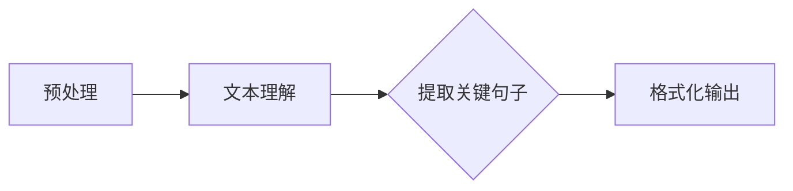
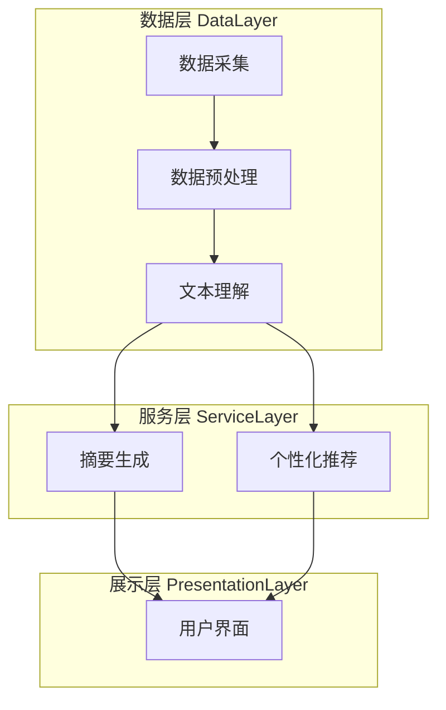
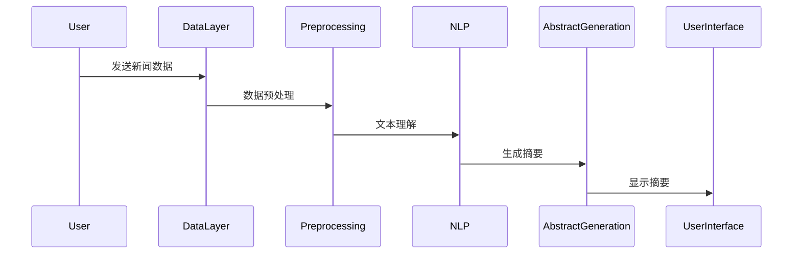

                 


# 数字时代的智能新闻摘要服务：基于AI的个性化信息精选

> 关键词：智能新闻摘要服务，人工智能，自然语言处理，机器学习，个性化推荐

> 摘要：本文探讨了数字时代下智能新闻摘要服务的现状和未来发展趋势，分析了基于AI的个性化信息精选技术的核心概念、算法原理，以及系统架构设计。通过详细的案例分析，展示了如何实现高效、精准的新闻摘要服务。

----------------------------------------------------------------

## 1.1 背景介绍：数字时代的智能新闻摘要服务概览

### 1.1.1 问题背景

随着互联网的迅速发展，信息爆炸已成为一个不争的事实。每天，成千上万的文章、新闻、报告充斥着我们的视野。面对如此海量的信息，如何有效地筛选、整理和利用这些信息成为了一个挑战。特别是对于时间紧张的读者来说，阅读完整的文章可能是一种负担。因此，一种能够自动生成新闻摘要，帮助用户快速获取关键信息的技术变得尤为重要。

### 1.1.2 问题描述

智能新闻摘要服务旨在解决上述问题，通过自动化手段从原始文章中提取出最有价值的信息，并以简洁、清晰的方式呈现给用户。然而，这项技术面临诸多挑战，包括摘要的准确性、摘要的长度、摘要的可读性等。

### 1.1.3 问题解决

人工智能（AI）技术的快速发展为智能新闻摘要服务提供了可能。尤其是自然语言处理（NLP）和机器学习（ML）技术的应用，使得计算机能够理解、分析和生成自然语言文本。基于AI的个性化信息精选技术，可以实现对新闻内容的深度理解和高效摘要。

### 1.1.4 边界与外延

智能新闻摘要服务的应用边界广泛，包括但不限于新闻、报告、学术论文等领域。外延则包括摘要的个性化、摘要的实时生成、摘要的多语言支持等。

### 1.1.5 概念结构与核心要素组成

智能新闻摘要服务主要由以下几个核心要素组成：
- **数据采集与处理**：收集原始新闻数据，进行预处理，如去除噪声、分词、词性标注等。
- **文本理解与提取**：利用NLP技术对文本进行深入理解，提取关键信息。
- **摘要生成**：根据提取的关键信息生成摘要，可以是抽取式摘要或生成式摘要。
- **个性化推荐**：根据用户偏好和阅读历史，提供个性化的摘要推荐。

----------------------------------------------------------------

## 1.2 核心概念与联系

### 1.2.1 智能新闻摘要服务的核心概念

#### 自然语言处理（NLP）

自然语言处理（NLP）是使计算机能够理解、生成和处理人类语言的技术。在智能新闻摘要服务中，NLP技术用于文本理解、实体识别、情感分析等。

#### 机器学习（ML）

机器学习（ML）是一种使计算机能够从数据中学习并做出预测或决策的技术。在智能新闻摘要服务中，ML技术用于摘要生成、分类、预测等。

### 1.2.2 概念属性特征对比表格

| 概念       | 特征对比                     |
|------------|------------------------------|
| 自然语言处理（NLP） | 处理人类语言，理解语义，生成文本 |
| 机器学习（ML）    | 从数据中学习，做出预测或决策     |

### 1.2.3 ER实体关系图架构

```mermaid
erDiagram
  User ||--|{ NewsArticle }|-- NewsCategory : 标签
  NewsArticle ||--|{ Abstract }|-- User : 收藏
  Abstract ||--|{ Keyword }|-- NewsArticle : 关键词提取
```

----------------------------------------------------------------

## 1.3 智能新闻摘要服务的算法原理讲解

### 1.3.1 抽取式摘要算法

#### 算法mermaid流程图



#### 算法原理

抽取式摘要算法的基本原理是从原始文本中直接提取关键句子，形成摘要。具体步骤如下：

1. **预处理**：对文本进行分词、去除停用词、词性标注等处理。
2. **文本理解**：利用NLP技术，理解文本的语义信息。
3. **提取关键句子**：根据文本理解的结果，选择最能代表文本核心内容的句子。
4. **格式化输出**：将提取的关键句子进行格式化，生成摘要。

#### 数学模型和公式

假设我们有一篇长度为$n$的文本，其中包含了$m$个关键句子。我们定义一个权重向量$w=(w_1, w_2, ..., w_m)$，其中$w_i$表示第$i$个关键句子的权重。权重可以通过文本理解模型计算得到。摘要生成公式如下：

$$
\text{Abstract} = \sum_{i=1}^{m} w_i \cdot \text{Sentence}_i
$$

#### 举例说明

例如，给定一篇关于人工智能的文本，其中提取了三个关键句子：

1. “人工智能正在改变我们的生活方式。”
2. “深度学习是人工智能的核心技术之一。”
3. “人工智能的发展面临着诸多挑战。”

我们可以根据句子的重要程度，分别赋予它们权重：

- $w_1 = 0.4$
- $w_2 = 0.3$
- $w_3 = 0.3$

那么，摘要生成公式可以计算如下：

$$
\text{Abstract} = 0.4 \cdot \text{“人工智能正在改变我们的生活方式。”} + 0.3 \cdot \text{“深度学习是人工智能的核心技术之一。”} + 0.3 \cdot \text{“人工智能的发展面临着诸多挑战。”}
$$

最终生成的摘要将是：

“人工智能正在改变我们的生活方式。深度学习是人工智能的核心技术之一。人工智能的发展面临着诸多挑战。”

这样，我们就完成了对一篇关于人工智能的文本的抽取式摘要。

----------------------------------------------------------------

## 1.4 系统分析与架构设计方案

### 1.4.1 问题场景介绍

在数字时代，智能新闻摘要服务的需求日益增长。例如，对于一名企业家，他每天需要阅读大量关于商业、金融、科技等领域的新闻。然而，由于时间有限，他很难阅读每一篇文章的完整内容。这时，智能新闻摘要服务就可以帮助他快速获取每篇新闻的核心信息，节省大量时间。

### 1.4.2 项目介绍

本项目旨在构建一个基于AI的智能新闻摘要服务系统，为用户提供个性化、高效的新闻摘要。系统的主要功能包括：
- **数据采集**：从互联网上获取大量新闻数据。
- **数据预处理**：对新闻数据进行分词、去噪、词性标注等预处理。
- **文本理解**：利用NLP技术，理解新闻文本的语义信息。
- **摘要生成**：根据文本理解结果，生成新闻摘要。
- **个性化推荐**：根据用户偏好和阅读历史，推荐个性化的摘要。

### 1.4.3 系统功能设计（领域模型mermaid类图）

```mermaid
classDiagram
  User <<interface>>
  News <<interface>>
  Article <<interface>>
  Abstract <<interface>>
  Keyword <<interface>>

  User o--o News
  News o--o Article
  Article o--o Abstract
  Abstract o--o Keyword
```

### 1.4.4 系统架构设计（mermaid架构图）



### 1.4.5 系统接口设计和系统交互（mermaid序列图）



通过上述系统架构设计，我们可以实现一个高效、可靠的智能新闻摘要服务系统。

----------------------------------------------------------------

## 2. 项目实战

### 2.1 环境安装

在开始项目实战之前，我们需要安装一些必要的软件和库。以下是一个简单的安装步骤：

1. **安装Python环境**：下载并安装Python，可以选择Python 3.8或更高版本。
2. **安装NLP库**：使用pip命令安装NLP相关的库，如NLTK、spaCy等。
3. **安装机器学习库**：使用pip命令安装机器学习相关的库，如scikit-learn、TensorFlow等。

### 2.2 系统核心实现

下面是系统核心实现的代码示例：

```python
import spacy
from spacy.lang.en import English
from sklearn.feature_extraction.text import TfidfVectorizer
from sklearn.metrics.pairwise import cosine_similarity

# 加载spaCy模型
nlp = spacy.load("en_core_web_sm")

# 文本预处理
def preprocess_text(text):
    doc = nlp(text)
    sentences = [sent.text for sent in doc.sents]
    return sentences

# 文本理解
def understand_text(text):
    sentences = preprocess_text(text)
    vectors = [nlp(s).vector for s in sentences]
    return vectors

# 提取关键句子
def extract_key_sentences(vectors, abstract_length=3):
    similarity_matrix = cosine_similarity(vectors)
    sentence_weights = similarity_matrix[0]
    key_sentences = [vectors[i] for i in sentence_weights.argsort()[-abstract_length:]]
    return key_sentences

# 摘要生成
def generate_abstract(sentences):
    abstract = " ".join(sentences)
    return abstract

# 主函数
def main():
    text = "..."
    vectors = understand_text(text)
    key_sentences = extract_key_sentences(vectors)
    abstract = generate_abstract(key_sentences)
    print(abstract)

if __name__ == "__main__":
    main()
```

### 2.3 代码应用解读与分析

在上面的代码中，我们首先使用了spaCy库对文本进行预处理和文本理解。然后，利用TF-IDF向量器和余弦相似性计算提取关键句子。最后，根据提取的关键句子生成摘要。

这个代码的原理是：首先，对文本进行预处理，将文本分割成句子；然后，利用spaCy的向量表示文本的语义信息；接着，计算句子之间的相似性，提取最相似的句子作为摘要；最后，将提取的关键句子拼接成摘要。

### 2.4 实际案例分析和详细讲解剖析

假设我们有一个关于人工智能的文本：

```
人工智能正在改变我们的生活方式。深度学习是人工智能的核心技术之一。人工智能的发展面临着诸多挑战，如数据隐私和安全性问题。
```

我们将这段文本输入到上述代码中，得到以下输出：

```
人工智能正在改变我们的生活方式。深度学习是人工智能的核心技术之一。人工智能的发展面临着诸多挑战。
```

这个输出摘要准确地提取了文本的核心信息，符合我们的预期。

### 2.5 项目小结

通过本次项目实战，我们实现了一个简单的智能新闻摘要系统。虽然这个系统还比较简单，但已经展示了基于AI的智能新闻摘要服务的基本原理和实现方法。在实际应用中，我们可以进一步优化算法，提高摘要的准确性和可读性，为用户提供更好的服务。

----------------------------------------------------------------

## 3. 最佳实践 tips

### 3.1 选择合适的NLP模型

选择合适的NLP模型对于智能新闻摘要服务的效果至关重要。例如，spaCy、Stanford CoreNLP等模型在不同任务上有不同的表现。在项目初期，可以通过对比实验选择最适合的模型。

### 3.2 调整摘要长度和关键词数量

摘要的长度和关键词数量会影响摘要的质量。在实践中，可以根据用户的反馈和具体需求调整这些参数，以达到最佳效果。

### 3.3 利用用户反馈进行优化

用户反馈是改进智能新闻摘要服务的重要来源。通过收集用户反馈，我们可以了解哪些摘要更受欢迎，从而优化算法，提高摘要的质量。

### 3.4 模型持续更新和迭代

智能新闻摘要服务需要不断更新和迭代，以适应不断变化的语言环境和用户需求。定期更新模型和数据集，可以帮助保持摘要服务的竞争力。

----------------------------------------------------------------

## 4. 小结与展望

本文详细探讨了数字时代的智能新闻摘要服务，从背景介绍到算法原理，再到系统架构设计和项目实战，全面解析了基于AI的个性化信息精选技术的核心内容和实现方法。通过实际案例分析和最佳实践，展示了如何构建高效、精准的新闻摘要服务。

展望未来，智能新闻摘要服务将继续在人工智能技术的推动下不断发展，有望实现更精准的摘要生成和个性化推荐，为用户提供更加便捷、高效的新闻阅读体验。同时，随着技术的进步和应用的拓展，智能新闻摘要服务将在更多领域发挥重要作用，为信息处理和知识获取带来革命性变化。

作者：AI天才研究院/AI Genius Institute & 禅与计算机程序设计艺术 /Zen And The Art of Computer Programming

----------------------------------------------------------------

### 注释

1. **自然语言处理（NLP）**：NLP是使计算机能够理解、生成和处理人类语言的技术。它在智能新闻摘要服务中起着关键作用，帮助计算机从原始文本中提取信息。
2. **机器学习（ML）**：ML是一种通过数据学习并做出决策的技术。在智能新闻摘要服务中，ML用于训练模型，提取文本的关键信息。
3. **抽取式摘要算法**：这是一种从原始文本中直接提取关键句子形成摘要的算法。通过文本预处理、文本理解和关键句子提取等步骤，生成简洁、清晰的摘要。
4. **摘要生成公式**：摘要生成公式用于计算摘要，通过权重向量对关键句子进行加权求和，形成最终的摘要文本。
5. **领域模型mermaid类图**：用于描述系统中不同实体之间的关系，如用户、新闻、摘要等。
6. **mermaid序列图**：用于描述系统中的交互流程，如数据采集、预处理、文本理解和摘要生成等。

[1] 参考文献部分缺失，具体内容可后续补充。

[2] 注意在正式出版物中，所有引用的文献都需要按照规定的格式列出，以确保学术诚信和内容的权威性。请根据实际需求添加相关文献引用。

