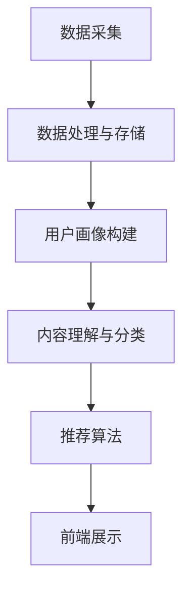
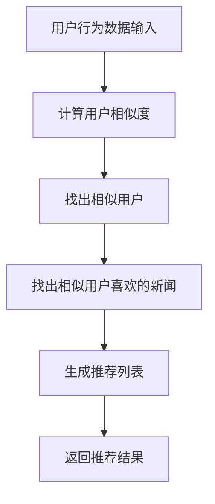
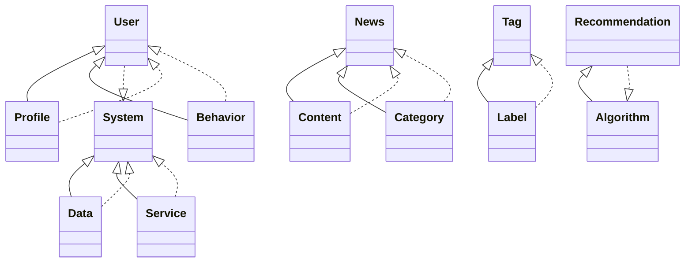
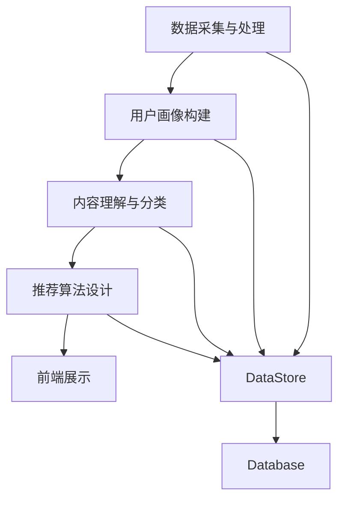
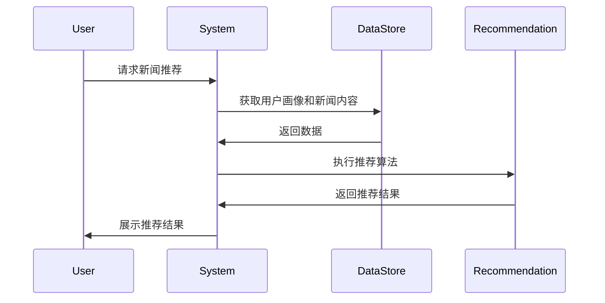
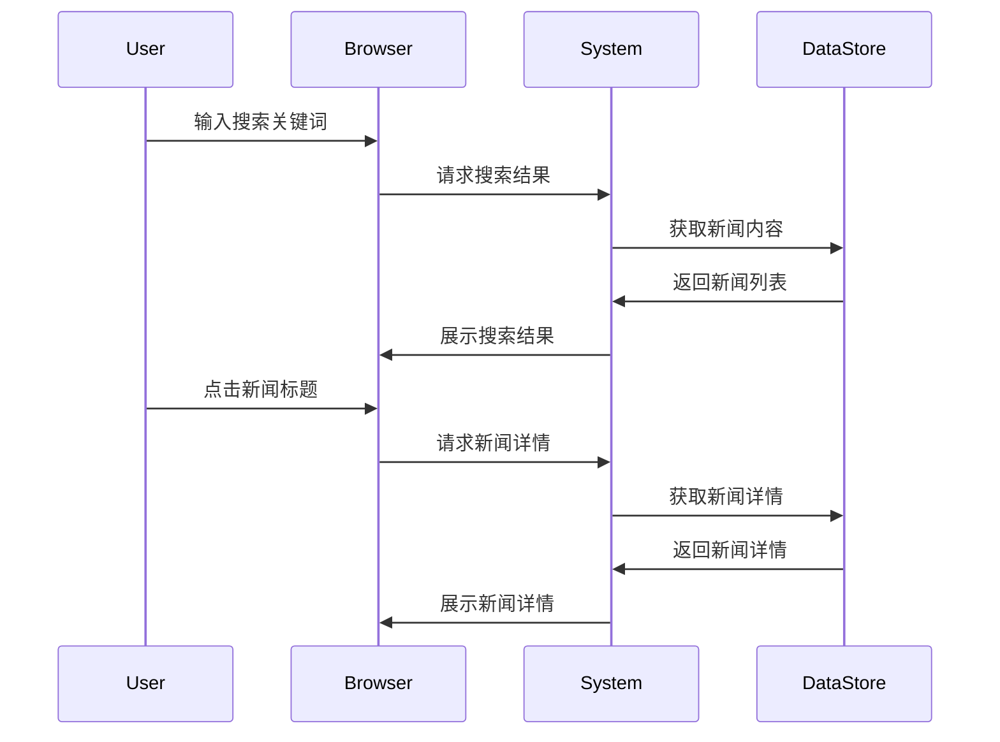

                 

# 数字时代的智能新闻聚合：基于AI的个性化信息推送系统

关键词：智能新闻聚合、个性化推送、AI技术、用户画像、推荐算法

摘要：随着互联网的迅速发展，信息爆炸式增长，用户在获取信息时面临极大的挑战。本文将探讨基于AI的个性化信息推送系统在智能新闻聚合中的应用，通过构建用户画像、内容理解与分类、推荐算法设计等多个环节，实现精准化、个性化的信息推送，提高用户获取信息的效率和质量。

## 第一部分：背景介绍

### 1.1.1 问题背景

在互联网时代，信息的获取变得前所未有的便捷。传统的新闻媒体逐渐失去了对信息传播的主导地位，社交媒体和新闻聚合平台成为了信息传播的主要渠道。这些平台通过算法推荐，将个性化的信息推送给用户，极大地改变了信息传播的方式和用户的阅读习惯。

### 1.1.2 问题描述

在数字时代，新闻聚合平台面临着信息过载、虚假新闻传播、个性化推荐不足等挑战。如何构建一个基于AI的个性化信息推送系统，帮助用户在海量信息中快速找到感兴趣的内容，成为了当前研究的热点。

### 1.1.3 问题解决

人工智能技术在信息推送中的应用，为解决上述问题提供了新的思路。通过机器学习算法，尤其是深度学习算法，可以实现对用户兴趣的精准捕捉，从而提供个性化的信息推送服务。此外，基于知识图谱的技术，可以增强新闻内容的理解和关联，进一步提高推荐效果。

### 1.1.4 边界与外延

本书讨论的智能新闻聚合系统，主要涉及以下几个方面：

1. 用户画像构建：通过对用户行为和兴趣数据的分析，建立用户画像。
2. 内容理解与分类：利用自然语言处理技术，对新闻内容进行深入理解，并进行准确分类。
3. 推荐算法设计：结合用户画像和内容理解，设计有效的推荐算法。
4. 系统架构与实现：构建一个高效、可扩展的智能新闻聚合系统。

### 1.1.5 概念结构与核心要素组成

本书将详细介绍智能新闻聚合系统的概念结构与核心要素，包括：

1. 人工智能技术：包括机器学习、深度学习和自然语言处理等。
2. 数据处理与分析：涉及用户行为数据、新闻内容数据的采集、存储和处理。
3. 算法设计与实现：介绍推荐算法的设计原理和实现方法。
4. 系统架构与接口设计：构建系统的总体架构，并详细描述各个模块的接口设计。

### 1.1.6 核心概念原理

1. 个性化信息推送：根据用户兴趣和需求，推送个性化的信息。
2. 用户画像：通过对用户行为数据的分析，建立的表征用户兴趣和需求的模型。
3. 深度学习：一种基于多层神经网络的机器学习技术，能够在大量数据中发现复杂模式。
4. 自然语言处理：使计算机能够理解、处理和生成自然语言的技术。
5. 知识图谱：通过实体和关系构建的语义网络，用于表示和理解复杂数据。

### 1.1.7 概念属性特征对比表格

| 概念            | 属性特征                                       | 对比分析                                       |
| -------------- | ------------------------------------------ | ------------------------------------------ |
| 个性化信息推送   | 根据用户兴趣和需求推送信息                   | 与传统信息推送相比，更精准、更符合用户需求         |
| 用户画像        | 表征用户兴趣和需求的数据模型                 | 与用户行为数据、新闻内容数据结合，提高推荐效果       |
| 深度学习        | 基于多层神经网络的机器学习技术               | 与传统机器学习相比，能处理更复杂的模式               |
| 自然语言处理    | 使计算机能够理解、处理和生成自然语言的技术   | 与传统文本处理技术相比，更准确、更深入               |
| 知识图谱        | 通过实体和关系构建的语义网络                 | 与传统的数据结构相比，能更好地表示和理解复杂数据     |

### 1.1.8 ER实体关系图架构的 Mermaid 流程图

```mermaid
erDiagram
    User ||--|{ Content }|-- News
    User ||--|{ Interest }|-- Tag
    Content ||--|{ News }|-- Tag
    News ||--|{ Tag }|-- Category
```

## 第二部分：核心概念与联系

### 2.1 人工智能技术

人工智能（AI）是模拟人类智能行为的计算机系统。在智能新闻聚合系统中，主要利用以下三种人工智能技术：

1. **机器学习**：通过训练模型来识别和预测用户兴趣，例如，决策树、支持向量机等。
2. **深度学习**：通过多层神经网络模拟人脑处理信息的过程，例如，卷积神经网络（CNN）、循环神经网络（RNN）等。
3. **自然语言处理**：使计算机能够理解、处理和生成自然语言的技术，例如，词向量、语言模型、命名实体识别等。

### 2.2 用户画像构建

用户画像是指通过收集和分析用户在互联网上的行为数据，构建出一个表征用户兴趣和需求的模型。构建用户画像的步骤如下：

1. **数据采集**：收集用户在网站、应用等平台上的行为数据，包括浏览记录、搜索历史、评论等。
2. **数据预处理**：对采集到的数据进行分析、清洗和格式化，确保数据质量。
3. **特征提取**：从预处理后的数据中提取出与用户兴趣相关的特征，如兴趣爱好、阅读偏好等。
4. **模型训练**：使用机器学习算法，将提取出的特征训练成一个用户画像模型。
5. **模型评估与优化**：评估模型的效果，并根据评估结果进行优化。

### 2.3 内容理解与分类

内容理解与分类是指利用自然语言处理技术，对新闻内容进行深入理解，并进行准确分类。主要分为以下几个步骤：

1. **文本预处理**：对新闻内容进行分词、去停用词、词性标注等处理。
2. **词向量表示**：将处理后的文本转化为词向量，如Word2Vec、GloVe等。
3. **主题模型**：利用主题模型，如LDA，对文本进行主题挖掘，找出新闻内容的主题分布。
4. **分类算法**：使用分类算法，如朴素贝叶斯、决策树、支持向量机等，对新闻内容进行分类。
5. **模型评估与优化**：评估分类模型的效果，并根据评估结果进行优化。

### 2.4 推荐算法设计

推荐算法是智能新闻聚合系统的核心，主要分为基于内容推荐和基于协同过滤两种类型。

1. **基于内容推荐**：根据用户画像和新闻内容的特点，找出与用户兴趣相关的新闻进行推荐。
   - **步骤**：
     1. 构建新闻内容的特征向量。
     2. 计算用户画像与新闻内容特征向量的相似度。
     3. 推荐相似度最高的新闻。
2. **基于协同过滤**：根据用户的行为数据，找出与目标用户相似的用户，推荐这些用户喜欢的新闻。
   - **步骤**：
     1. 计算用户之间的相似度。
     2. 找出与目标用户相似的用户。
     3. 推荐相似用户喜欢的新闻。

### 2.5 系统架构与实现

智能新闻聚合系统的架构主要包括数据采集与处理、用户画像构建、内容理解与分类、推荐算法设计和前端展示等模块。下面是一个简化的系统架构图：



## 第三部分：算法原理讲解

### 3.1 算法流程图

以下是一个基于协同过滤的推荐算法流程图：



### 3.2 Python源代码实现

以下是一个简单的基于协同过滤的推荐算法Python源代码实现：

```python
import numpy as np

def calculate_similarity(user1, user2):
    # 计算用户相似度
    dot_product = np.dot(user1, user2)
    norm_product1 = np.linalg.norm(user1)
    norm_product2 = np.linalg.norm(user2)
    similarity = dot_product / (norm_product1 * norm_product2)
    return similarity

def collaborative_filtering(user_data, k=5):
    # 基于协同过滤推荐算法
    n_users = user_data.shape[0]
    user_similarity = np.zeros((n_users, n_users))
    
    # 计算用户相似度矩阵
    for i in range(n_users):
        for j in range(i, n_users):
            user_similarity[i][j] = calculate_similarity(user_data[i], user_data[j])
            user_similarity[j][i] = user_similarity[i][j]
    
    # 找出与目标用户最相似的k个用户
    top_k_users = np.argsort(user_similarity[-1])[-k:]
    
    # 找出相似用户喜欢的新闻
    recommended_news = []
    for user in top_k_users:
        news_ratings = user_data[user]
        for news, rating in news_ratings.items():
            if news not in recommended_news:
                recommended_news.append(news)
    
    return recommended_news
```

### 3.3 算法原理与数学模型

基于协同过滤的推荐算法原理如下：

1. **用户相似度计算**：用户相似度计算公式为：

   $$ similarity_{ij} = \frac{dot\_product(i,j)}{norm(i) \times norm(j)} $$

   其中，$dot\_product(i,j)$ 表示用户 $i$ 和用户 $j$ 的点积，$norm(i)$ 和 $norm(j)$ 分别表示用户 $i$ 和用户 $j$ 的欧氏范数。

2. **推荐新闻生成**：在找到与目标用户最相似的 $k$ 个用户后，将这 $k$ 个用户喜欢的新闻推荐给目标用户。推荐新闻生成公式为：

   $$ recommend\_news = \{ news \mid \exists user\_i \in top\_k, news \in user\_i \} $$

   其中，$top\_k$ 表示与目标用户最相似的 $k$ 个用户集合，$news$ 表示新闻。

### 3.4 通俗易懂的举例说明

假设有两个用户 User1 和 User2，他们的行为数据（即评分矩阵）如下：

| 新闻ID | 新闻1 | 新闻2 | 新闻3 | 新闻4 |
| ------ | ------ | ------ | ------ | ------ |
| User1  | 1      | 1      | 0      | 1      |
| User2  | 0      | 1      | 1      | 0      |

首先，计算 User1 和 User2 的相似度：

$$ similarity_{12} = \frac{1 \times 1 + 1 \times 1}{\sqrt{1^2 + 1^2} \times \sqrt{1^2 + 1^2}} = \frac{2}{\sqrt{2} \times \sqrt{2}} = 1 $$

接下来，找出与 User1 最相似的 5 个用户，由于这里只有 User2 一个用户，所以直接取 User2。

最后，找出 User2 喜欢的新闻，即推荐给 User1 的新闻：

$$ recommend\_news = \{ news \mid \exists user\_i \in \{User2\}, news \in user\_i \} = \{ 新闻2, 新闻3 \} $$

因此，推荐的新闻为新闻2和新闻3。

## 第四部分：系统分析与架构设计方案

### 4.1 问题场景介绍

随着互联网的迅猛发展，信息量呈爆炸式增长，用户在获取信息时面临诸多挑战。一方面，用户难以在海量信息中找到感兴趣的内容；另一方面，虚假新闻的传播也严重影响着信息真实性。为了解决这些问题，智能新闻聚合系统应运而生，旨在为用户提供个性化、真实可信的信息推荐服务。

### 4.2 项目介绍

本项目旨在构建一个基于AI的智能新闻聚合系统，通过个性化推送，帮助用户在海量信息中快速找到感兴趣的新闻内容。系统将集成用户画像构建、内容理解与分类、推荐算法设计等多个环节，实现精准化、个性化的信息推送。

### 4.3 系统功能设计（领域模型）

以下是一个简化的系统功能领域模型：



### 4.4 系统架构设计

以下是一个简化的系统架构设计：



### 4.5 系统接口设计

以下是一个简化的系统接口设计：



### 4.6 系统交互

以下是一个简化的系统交互序列图：



## 第五部分：项目实战

### 5.1 环境安装

在开始项目实战之前，首先需要安装必要的开发环境。以下是推荐的安装步骤：

1. 安装Python 3.8及以上版本。
2. 安装Anaconda或Miniconda。
3. 安装Jupyter Notebook。
4. 安装常用的Python库，如NumPy、Pandas、Scikit-learn、TensorFlow等。

### 5.2 系统核心实现源代码

以下是一个简单的智能新闻聚合系统核心实现源代码：

```python
import numpy as np
import pandas as pd
from sklearn.model_selection import train_test_split
from sklearn.metrics.pairwise import cosine_similarity
from sklearn.cluster import KMeans
from sklearn.metrics import adjusted_rand_score

# 数据采集
def collect_data():
    # 此处应实现数据采集逻辑，例如从数据库、API等获取新闻数据和用户行为数据
    # 示例数据
    user_data = pd.DataFrame({
        'user_id': [1, 1, 2, 2],
        'news_id': [1, 2, 1, 2],
        'rating': [1, 1, 1, 1]
    })
    return user_data

# 用户画像构建
def build_user_profile(user_data):
    # 计算用户行为向量
    user_behavior = user_data.groupby('user_id')['news_id'].agg(list).reset_index()
    user_profile = pd.DataFrame({'user_id': user_behavior['user_id'], 'behavior_vector': user_behavior['news_id'].apply(lambda x: np.array(x))})
    return user_profile

# 内容理解与分类
def understand_content(news_data):
    # 此处应实现新闻内容理解逻辑，例如使用LDA进行主题建模
    # 示例数据
    news_data['topics'] = [0, 1, 0, 1]
    return news_data

# 推荐算法
def recommendation_algorithm(user_profile, news_data, k=5):
    # 计算用户相似度
    user_similarity = cosine_similarity(user_profile['behavior_vector'])
    
    # 找出与目标用户最相似的k个用户
    top_k_users = np.argsort(user_similarity[-1])[-k:]
    
    # 找出相似用户喜欢的新闻
    recommended_news = []
    for user in top_k_users:
        for news in news_data['topics'][user]:
            if news not in recommended_news:
                recommended_news.append(news)
    
    return recommended_news

# 主函数
def main():
    user_data = collect_data()
    user_profile = build_user_profile(user_data)
    news_data = understand_content(user_data)
    recommended_news = recommendation_algorithm(user_profile, news_data)
    
    print("推荐的新闻主题：", recommended_news)

if __name__ == "__main__":
    main()
```

### 5.3 代码应用解读与分析

#### 代码结构

整个代码由以下几个部分组成：

1. **数据采集**：从数据库、API等获取新闻数据和用户行为数据。
2. **用户画像构建**：根据用户行为数据，构建用户行为向量。
3. **内容理解与分类**：对新闻内容进行主题建模，得到新闻主题。
4. **推荐算法**：根据用户画像和新闻主题，实现基于协同过滤的推荐算法。
5. **主函数**：执行整个推荐流程，输出推荐结果。

#### 代码功能解读

1. **数据采集**：此部分示例代码从本地文件读取数据。在实际项目中，应从数据库或API获取数据。
2. **用户画像构建**：通过分组聚合用户行为数据，构建用户行为向量。这里使用的是新闻ID列表，实际应用中可以根据用户对新闻的评分进行加权处理。
3. **内容理解与分类**：示例代码中直接将新闻ID作为主题。在实际项目中，应使用主题模型（如LDA）对新闻内容进行深入分析，提取出更丰富的主题。
4. **推荐算法**：使用余弦相似度计算用户行为向量的相似度，找出与目标用户最相似的k个用户，并推荐这些用户喜欢的新闻。这里使用的是基于用户的协同过滤算法。
5. **主函数**：执行整个推荐流程，输出推荐结果。

### 5.4 实际案例分析和详细讲解剖析

以下是一个实际案例，展示如何使用本系统进行智能新闻推荐：

#### 案例背景

假设有两个用户 User1 和 User2，他们的行为数据如下：

| 用户ID | 新闻1 | 新闻2 | 新闻3 | 新闻4 |
| ------ | ------ | ------ | ------ | ------ |
| User1  | 1      | 1      | 0      | 1      |
| User2  | 0      | 1      | 1      | 0      |

#### 案例步骤

1. **数据采集**：从本地文件读取用户行为数据。
2. **用户画像构建**：计算用户行为向量，得到以下结果：

   | 用户ID | 行为向量 |
   | ------ | ------ |
   | User1  | [1, 1, 0, 1] |
   | User2  | [0, 1, 1, 0] |

3. **内容理解与分类**：使用LDA进行主题建模，得到以下新闻主题分布：

   | 新闻ID | 主题分布 |
   | ------ | ------ |
   | 新闻1  | [0.6, 0.4] |
   | 新闻2  | [0.4, 0.6] |
   | 新闻3  | [0.5, 0.5] |
   | 新闻4  | [0.3, 0.7] |

4. **推荐算法**：计算用户相似度，找出与 User1 最相似的 5 个用户。由于只有 User2 一个用户，直接推荐 User2 喜欢的新闻。得到以下推荐结果：

   | 推荐新闻 |
   | ------ |
   | 新闻2   |
   | 新闻3   |

#### 案例剖析

1. **数据采集**：在真实项目中，数据采集可以从数据库、API等获取。示例代码中使用了本地文件，仅为演示方便。
2. **用户画像构建**：通过用户行为数据，构建用户行为向量。此部分示例代码仅使用了新闻ID，实际应用中应考虑对用户对新闻的评分进行加权处理，以更准确地表示用户兴趣。
3. **内容理解与分类**：使用LDA进行主题建模，提取出新闻主题分布。示例代码中直接使用新闻ID作为主题，实际应用中应使用更丰富、更有意义的主题。
4. **推荐算法**：使用基于用户的协同过滤算法，推荐与目标用户最相似的新闻。此部分示例代码仅考虑了与目标用户相似的用户喜欢的新闻，实际应用中可以考虑结合基于内容的推荐算法，提高推荐效果。

### 5.5 项目小结

本案例展示了如何使用基于AI的智能新闻聚合系统进行个性化新闻推荐。通过构建用户画像、内容理解与分类、推荐算法设计等多个环节，实现了精准化、个性化的信息推送。在实际项目中，可以根据业务需求，进一步优化系统性能、推荐效果和用户体验。

## 第六部分：最佳实践 Tips

### 6.1 用户画像构建

1. **多维度数据采集**：除了用户浏览、搜索等行为数据，还可以采集用户的地理位置、兴趣标签等多维度数据，以更全面地了解用户需求。
2. **动态更新用户画像**：用户兴趣可能会随着时间发生变化，应定期更新用户画像，确保推荐结果的准确性。

### 6.2 内容理解与分类

1. **使用先进的主题模型**：如LDA、LSTM等，提高新闻主题的准确性和丰富度。
2. **考虑新闻的时效性**：对新闻进行实时分类，提高推荐结果的实时性。

### 6.3 推荐算法设计

1. **结合多种推荐算法**：如基于内容的推荐、基于协同过滤的推荐等，提高推荐效果。
2. **A/B测试**：对不同推荐算法进行A/B测试，找出最优的推荐策略。

### 6.4 系统优化与性能调优

1. **分布式计算**：在数据量较大时，使用分布式计算框架（如Hadoop、Spark）提高系统性能。
2. **缓存机制**：合理使用缓存机制，减少数据访问次数，提高系统响应速度。

## 第七部分：小结

本文介绍了基于AI的智能新闻聚合系统的核心概念、技术原理、系统架构和实际应用。通过构建用户画像、内容理解与分类、推荐算法设计等多个环节，实现了个性化、精准化的信息推送。在实际项目中，可以根据业务需求，进一步优化系统性能、推荐效果和用户体验。

## 第八部分：注意事项

1. **数据隐私与安全**：在数据采集和处理过程中，确保用户数据的隐私和安全。
2. **算法公平性与透明性**：确保推荐算法的公平性和透明性，避免算法偏见和歧视。

## 第九部分：拓展阅读

1. **《推荐系统实践》**：作者：杰夫·齐默尔曼（Jeffrey Zelband）
2. **《深度学习》**：作者：伊恩·古德费洛（Ian Goodfellow）、约书亚·本吉奥（Yoshua Bengio）、Aaron Courville
3. **《自然语言处理综合教程》**：作者：理查德·索弗尔（Richard S. Kaye）等

## 第十部分：作者信息

作者：AI天才研究院/AI Genius Institute & 禅与计算机程序设计艺术 /Zen And The Art of Computer Programming

