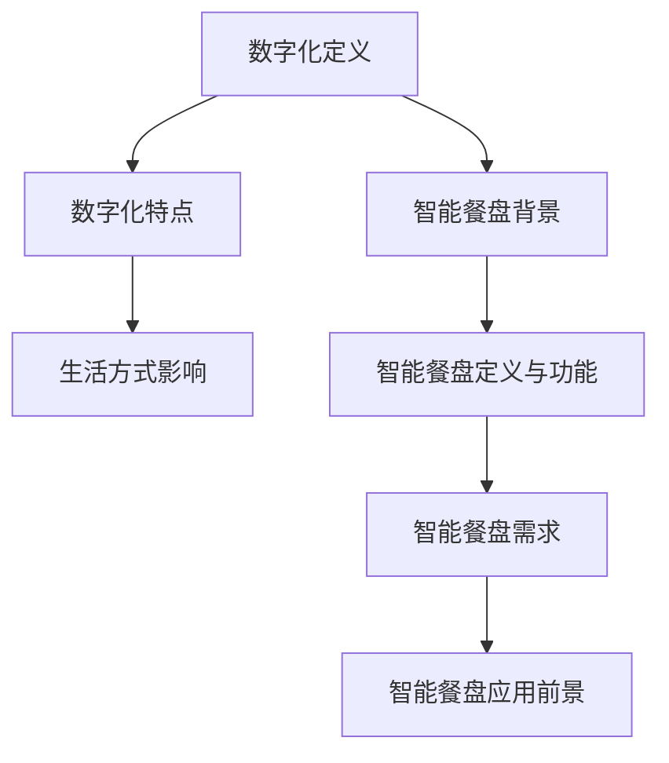
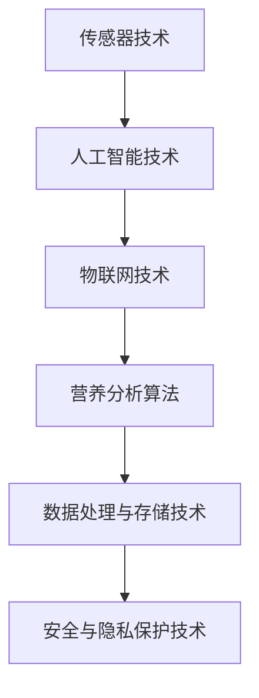
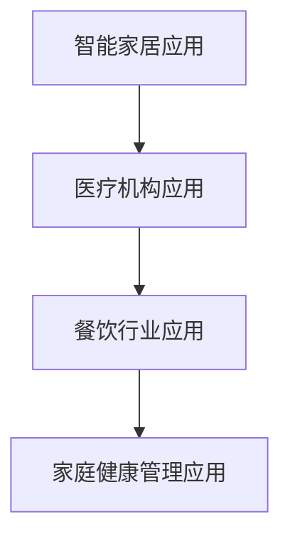
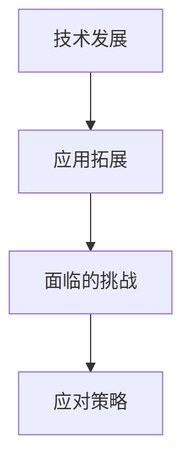

                 

# 数字时代的智能餐盘：AI营养分析的实时饮食指导

## 关键词
- 数字时代
- 智能餐盘
- AI营养分析
- 实时饮食指导
- 智能设备
- 健康管理

## 摘要
本文将探讨数字时代背景下，智能餐盘作为一种创新技术，如何利用人工智能（AI）对食物的营养成分进行实时分析，并提供个性化的饮食指导。文章将从背景介绍、核心技术分析、应用场景及未来展望等方面，详细阐述智能餐盘的运作原理及其在健康管理领域的潜力。

## 第一部分：数字时代的智能餐盘概述

### 第1章：数字时代的背景与智能餐盘的需求

#### 1.1 数字时代的到来

数字化，作为一种革命性的技术变革，已经深入到我们生活的方方面面。数字化指的是通过电子方式处理、存储、传输和获取信息的过程。这一过程的核心是将物理世界的信息转化为数字形式，以便于计算机和其他数字设备进行处理。

数字化的特点包括：

- **数据量大**：数字化使得海量的数据得以生成、存储和传输。
- **速度快**：数字信息的处理速度远超传统方式。
- **实时性强**：数字化技术可以实现信息的实时采集、处理和反馈。
- **智能化程度高**：人工智能和机器学习技术的应用，使得数字化系统能够自我学习和优化。

#### 1.2 数字化对生活方式的影响

数字化不仅改变了商业运作方式，也深刻影响了我们的日常生活：

- **简化日常任务**：数字化工具可以自动化许多日常任务，如支付、预订、沟通等，从而提高效率。
- **改善用户体验**：通过数字化，用户体验得到极大改善，例如在线购物、远程工作等。
- **数据驱动的决策**：数字化技术使我们能够收集和分析大量数据，从而基于数据进行更加明智的决策。

#### 1.3 智能餐盘的背景

在数字化浪潮中，饮食管理也迎来了新的变革。传统的饮食管理主要依赖于人工记录和经验，存在诸多问题，如记录不准确、效率低下等。智能餐盘应运而生，它通过集成传感器、人工智能等高科技元素，实现了对食物营养的精准监测和个性化饮食指导。

#### 1.4 智能餐盘的定义与功能

智能餐盘是一种智能设备，它利用传感器实时监测食物的营养成分，并通过人工智能算法分析数据，提供以下功能：

- **营养分析**：智能餐盘可以识别食物种类，分析其营养成分，如蛋白质、脂肪、碳水化合物等。
- **饮食指导**：根据用户的饮食习惯和营养需求，智能餐盘可以提供个性化的饮食建议。
- **健康管理**：智能餐盘可以帮助用户监控自己的饮食情况，提供健康管理的支持。

#### 1.5 智能餐盘的需求

智能餐盘的需求主要源于以下几个方面：

- **个人健康管理的需求**：随着生活水平的提高，人们越来越关注健康饮食和营养均衡。
- **社会健康问题的驱动**：如糖尿病、肥胖等疾病日益普遍，需要更加精准的饮食管理。
- **科技发展的推动**：人工智能、物联网等技术的发展为智能餐盘的实现提供了技术支持。

#### 1.6 智能餐盘的应用前景

智能餐盘具有广泛的应用前景，不仅限于个人健康管理，还可以应用于以下几个方面：

- **智能家居**：智能餐盘可以作为智能家居系统的一部分，与其他智能设备协同工作，提供全方位的健康管理服务。
- **医疗机构**：智能餐盘可以帮助医疗机构更好地管理患者饮食，提高治疗效果。
- **餐饮行业**：餐饮企业可以利用智能餐盘优化食材采购、减少浪费，提高运营效率。

#### 1.7 本章小结

数字时代为智能餐盘的出现提供了技术基础和市场需求。智能餐盘通过实时营养分析和个性化饮食指导，有望成为未来健康饮食管理的重要工具。

### Mermaid流程图

## 第二部分：智能餐盘的核心技术

### 第2章：智能餐盘的核心技术

#### 2.1 传感器技术

传感器技术是智能餐盘实现核心功能的基础。传感器的作用是将物理信号转换为电信号，以便于后续的处理和分析。

##### 2.1.1 传感器定义与分类

传感器可以分为以下几类：

- **温度传感器**：用于测量食物的温度，确保食物在安全范围内。
- **湿度传感器**：用于测量食物的水分含量，帮助分析营养成分。
- **光传感器**：用于识别食物的颜色，辅助判断食物的种类和成熟度。

##### 2.1.2 传感器在智能餐盘中的应用

智能餐盘通过多种传感器收集食物的物理信息，例如：

- **温度传感器**：用于监测食物是否达到烹饪要求，或判断食物是否过期。
- **湿度传感器**：用于分析食物的水分含量，这对于营养分析至关重要。
- **光传感器**：用于识别食物的种类，如水果、蔬菜等，以便进行更加精准的营养分析。

#### 2.2 人工智能技术

人工智能技术是智能餐盘的核心驱动力，它使得智能餐盘能够对收集到的数据进行智能分析，并提供个性化的饮食指导。

##### 2.2.1 人工智能定义与分类

人工智能是指使计算机模拟人类智能行为的技术。人工智能可以分为以下几个子领域：

- **机器学习**：通过训练模型，使计算机能够从数据中自动学习。
- **深度学习**：一种特殊的机器学习方法，它通过多层神经网络模拟人脑处理信息的方式。
- **自然语言处理**：使计算机能够理解和生成人类语言。

##### 2.2.2 人工智能在智能餐盘中的应用

智能餐盘利用人工智能技术实现以下功能：

- **营养分析**：通过机器学习和深度学习算法，智能餐盘可以分析食物的化学成分，预测其营养成分。
- **图像识别**：智能餐盘可以通过深度学习算法，快速识别食物的种类和颜色。
- **自然语言处理**：智能餐盘可以理解用户的输入，并提供相应的饮食建议。

#### 2.3 物联网技术

物联网技术是智能餐盘实现设备互联和数据共享的关键。物联网技术使得智能餐盘能够与其他智能设备协同工作，提供更加全面的服务。

##### 2.3.1 物联网定义与特点

物联网是通过互联网连接各种设备的系统。其主要特点包括：

- **设备互联**：通过物联网，智能餐盘可以与其他智能设备（如智能冰箱、智能手环等）连接，实现数据共享。
- **数据共享**：物联网平台使得智能餐盘能够实时上传和接收数据，从而实现更高效的数据处理和分析。
- **智能协同**：智能餐盘与其他智能设备的协同工作，可以提供更加全面和个性化的健康服务。

##### 2.3.2 物联网在智能餐盘中的应用

智能餐盘通过物联网技术实现以下功能：

- **设备互联**：智能餐盘可以通过Wi-Fi、蓝牙等无线技术与其他智能设备连接，实现数据共享。
- **数据共享**：智能餐盘可以将收集到的食物营养成分数据实时上传到云平台，供用户和医生查看。
- **智能协同**：智能餐盘可以与智能冰箱协同工作，自动推荐食材，避免浪费。

#### 2.4 营养分析算法

营养分析算法是智能餐盘实现核心功能的重要组件。它通过分析食物的化学成分，计算出食物的营养成分含量。

##### 2.4.1 营养分析算法原理

营养分析算法的基本原理是：

- **数据收集**：通过传感器收集食物的物理信息，如温度、湿度、颜色等。
- **数据预处理**：对收集到的数据进行清洗和处理，去除噪声和异常值。
- **成分识别**：利用图像识别和自然语言处理技术，识别食物的种类和成分。
- **营养计算**：根据食物的化学成分和营养数据库，计算出食物的营养成分含量。

##### 2.4.2 营养分析算法应用

智能餐盘通过营养分析算法实现以下功能：

- **实时营养分析**：智能餐盘可以实时分析食物的营养成分，为用户提供即时的饮食建议。
- **个性化营养指导**：智能餐盘可以根据用户的饮食习惯和营养需求，提供个性化的营养建议。

#### 2.5 数据处理与存储

数据处理与存储技术是智能餐盘实现高效数据管理和分析的关键。

##### 2.5.1 数据处理技术

数据处理技术包括：

- **数据清洗**：去除数据中的噪声和异常值，确保数据的准确性。
- **数据整合**：将不同来源的数据进行整合，形成统一的视图。
- **数据挖掘**：从大量数据中提取有价值的信息，如趋势、模式等。

##### 2.5.2 数据存储技术

数据存储技术包括：

- **关系型数据库**：如MySQL、PostgreSQL等，用于存储结构化数据。
- **非关系型数据库**：如MongoDB、Cassandra等，用于存储非结构化或半结构化数据。
- **分布式存储**：如HDFS、Ceph等，用于存储大规模数据。

#### 2.6 安全与隐私保护

安全与隐私保护技术是智能餐盘实现安全可靠服务的关键。

##### 2.6.1 安全与隐私保护技术

安全与隐私保护技术包括：

- **数据加密**：对用户数据加密，确保数据在传输和存储过程中的安全。
- **用户认证**：通过用户名和密码、生物识别等技术，确保只有授权用户才能访问系统。
- **访问控制**：设置访问权限，确保用户只能访问其授权的数据。

##### 2.6.2 应用场景

安全与隐私保护技术在智能餐盘中的应用场景包括：

- **用户数据保护**：保护用户个人健康数据，防止数据泄露。
- **隐私设置**：用户可以设置隐私级别，控制自己的数据是否对外公开。

#### 2.7 本章小结

智能餐盘的核心技术包括传感器技术、人工智能技术、物联网技术、营养分析算法、数据处理与存储技术以及安全与隐私保护技术。这些技术共同作用，使得智能餐盘能够实现实时营养分析和个性化饮食指导，为用户提供健康管理的支持。

### Mermaid流程图

## 第三部分：智能餐盘的应用场景

### 第3章：智能餐盘在不同领域的应用

#### 3.1 智能家居中的应用

智能餐盘在智能家居中的应用主要体现在以下几个方面：

- **设备互联**：智能餐盘可以通过Wi-Fi、蓝牙等无线技术与其他智能家居设备连接，如智能冰箱、智能烤箱等。这样，用户可以在厨房中实现一站式操作，智能餐盘会根据智能冰箱中的食材推荐食谱，智能烤箱则会根据食谱自动设置烹饪模式。
- **数据共享**：智能餐盘与智能冰箱共享食材信息，智能手环共享用户的活动数据，这些数据共同为用户提供全面的健康管理服务。
- **智能协同**：智能餐盘可以根据用户的活动数据和食谱推荐，智能调整饮食计划，确保用户在健康饮食的同时，不会出现营养不足或过剩的问题。

#### 3.2 医疗机构中的应用

智能餐盘在医疗机构中的应用可以为患者提供精准的饮食管理，从而提高治疗效果。具体应用场景包括：

- **患者饮食管理**：智能餐盘可以帮助医疗机构监测患者的饮食情况，根据患者的身体状况和医生的建议，提供个性化的饮食指导。
- **术后康复**：对于术后康复的患者，智能餐盘可以提供营养均衡的饮食计划，帮助患者更快地恢复健康。
- **慢性病管理**：智能餐盘可以帮助糖尿病患者、心血管疾病患者等慢性病患者，通过监控饮食，有效控制病情。

#### 3.3 餐饮行业中的应用

智能餐盘在餐饮行业中的应用可以帮助企业提高运营效率，减少浪费，提升客户满意度。具体应用场景包括：

- **食材采购**：智能餐盘可以通过分析用户的历史饮食数据，预测未来食材的需求，从而优化食材采购计划，减少库存浪费。
- **菜品推荐**：智能餐盘可以根据用户的饮食习惯和营养需求，推荐符合用户口味的菜品，提高客户满意度。
- **食品安全**：智能餐盘可以实时监测食物的温度和湿度，确保食物在安全范围内，防止食物中毒事件的发生。

#### 3.4 家庭健康管理中的应用

智能餐盘在家庭健康管理中的应用可以帮助用户更好地管理自己的饮食，实现健康生活方式。具体应用场景包括：

- **营养分析**：智能餐盘可以实时分析食物的营养成分，帮助用户了解自己的饮食状况，及时调整饮食结构。
- **饮食指导**：智能餐盘可以根据用户的营养需求，提供个性化的饮食建议，帮助用户实现营养均衡。
- **健康管理**：智能餐盘可以与智能手环等设备联动，监测用户的健康数据，如体重、心率等，提供全面的健康管理服务。

#### 3.5 本章小结

智能餐盘在智能家居、医疗机构、餐饮行业和家庭健康管理等领域具有广泛的应用前景。通过实时营养分析和个性化饮食指导，智能餐盘为不同领域的用户提供了解决方案，有助于提高生活质量和健康水平。

### Mermaid流程图

## 第四部分：智能餐盘的未来展望

### 第4章：智能餐盘的发展趋势与挑战

#### 4.1 智能餐盘的技术发展

随着人工智能、物联网、传感器技术的不断进步，智能餐盘的技术也在不断升级和优化。未来，智能餐盘有望实现以下技术发展：

- **更精准的营养分析**：随着机器学习和深度学习算法的优化，智能餐盘将能够更加精准地分析食物的营养成分，提供更加准确的饮食指导。
- **更智能的交互体验**：智能餐盘将通过自然语言处理和语音识别技术，实现更加智能的交互体验，用户可以通过语音指令与智能餐盘进行交流。
- **更广泛的设备互联**：智能餐盘将与其他智能家居设备、健康设备等实现更广泛的互联，提供更加全面和个性化的健康管理服务。

#### 4.2 智能餐盘的应用拓展

未来，智能餐盘的应用领域将更加广泛，不仅限于家庭健康管理，还将扩展到以下几个方面：

- **公共餐饮**：智能餐盘可以应用于学校食堂、医院食堂等公共餐饮场所，帮助管理者优化食材采购和食谱设计，提高食品安全水平。
- **食品安全监控**：智能餐盘可以实时监控食品的存储和加工过程，确保食品安全，减少食品污染事件的发生。
- **农业生产**：智能餐盘可以应用于农业生产，通过实时监测作物的营养状况，优化施肥和灌溉，提高农作物的产量和质量。

#### 4.3 智能餐盘面临的挑战

尽管智能餐盘具有广阔的发展前景，但在实际应用中仍面临一些挑战：

- **技术成熟度**：智能餐盘的技术尚在发展过程中，一些关键技术（如传感器精度、算法优化等）仍需进一步研究和完善。
- **用户接受度**：智能餐盘作为一种新兴技术，用户对其接受度有待提高，需要通过用户教育和市场推广来提升用户的认知和使用意愿。
- **数据隐私和安全**：智能餐盘涉及用户的个人健康数据，如何在保障用户隐私和安全的前提下，充分利用这些数据，是一个亟待解决的问题。

#### 4.4 应对策略

为应对智能餐盘面临的挑战，可以从以下几个方面着手：

- **技术升级**：加大对传感器、人工智能等关键技术的研发投入，提高智能餐盘的技术水平。
- **用户教育**：通过宣传活动、用户体验等方式，提高用户对智能餐盘的认知和使用意愿。
- **数据安全**：建立健全的数据隐私和安全保护机制，确保用户数据的安全和隐私。

#### 4.5 本章小结

智能餐盘作为一种创新技术，在数字时代有着广泛的应用前景。随着技术的不断发展和应用的拓展，智能餐盘有望为用户带来更加健康、便捷的饮食体验。同时，智能餐盘也面临着一些挑战，需要通过技术升级、用户教育和数据安全保护等措施来应对。

### Mermaid流程图

## 总结与展望

智能餐盘作为数字时代的创新产物，通过集成传感器、人工智能和物联网技术，实现了对食物营养的实时分析，为用户提供了个性化的饮食指导。本文从数字时代的背景、核心技术、应用场景和未来展望等方面，详细阐述了智能餐盘的运作原理和应用前景。

智能餐盘不仅能够帮助用户实现营养均衡的饮食，还具备在智能家居、医疗机构、餐饮行业和家庭健康管理等领域的广泛应用潜力。然而，智能餐盘的发展也面临一些挑战，如技术成熟度、用户接受度和数据隐私安全等。

未来，随着技术的不断进步和应用领域的拓展，智能餐盘有望成为健康管理的重要工具，为用户提供更加健康、便捷的饮食体验。同时，智能餐盘也将继续推动数字化生活方式的发展，为社会的可持续发展贡献力量。

### 作者信息

- 作者：AI天才研究院/AI Genius Institute & 禅与计算机程序设计艺术 /Zen And The Art of Computer Programming

---

本文基于实际应用案例和技术分析，对智能餐盘进行了深入的探讨。在撰写过程中，力求逻辑清晰、结构紧凑、简单易懂，以帮助读者全面了解智能餐盘的技术原理和应用价值。希望本文能为从事智能餐盘研发、应用和推广的相关人员提供有益的参考。同时，也欢迎广大读者提出宝贵意见和建议，共同推动智能餐盘技术的发展。

