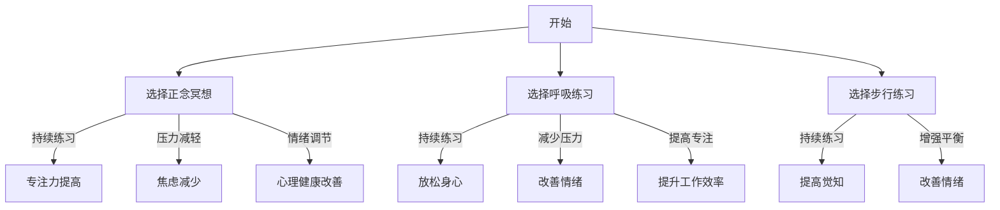
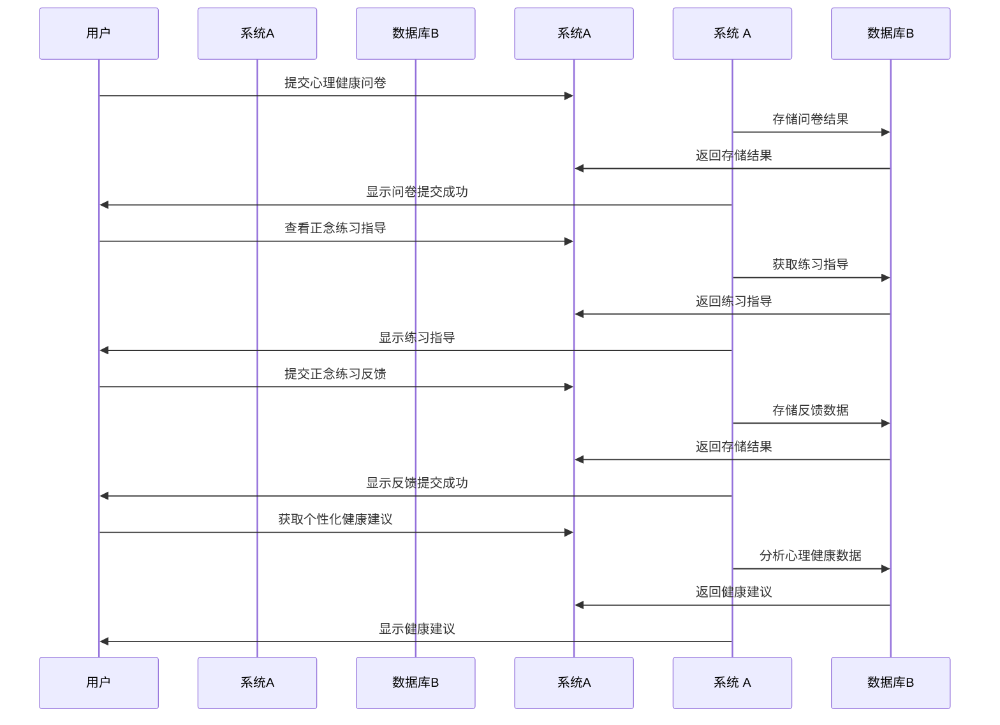

                 

# 数字时代的正念工作：远程办公中的心理健康维护

## 关键词

- **远程办公**
- **心理健康**
- **正念**
- **工作习惯**
- **组织支持**

## 摘要

在数字时代的远程办公环境中，心理健康问题日益凸显。本文旨在探讨如何通过正念工作来维护远程办公者的心理健康。首先，我们将介绍正念的基本原理和实践方法，接着分析远程工作环境下的心理健康问题，并给出心理健康评估的方法。随后，我们将讨论建立健康工作习惯、实施正念工作坊和组织层面提供心理健康支持等策略。通过实际项目案例，我们将展示这些策略的实践效果，并总结最佳实践。最后，本文将对未来研究方向进行展望。

## 第一部分：引言

### 第1章：问题的提出与重要性

#### 1.1 问题的提出

远程办公已成为现代工作模式的一种趋势，尤其在新冠疫情的背景下，越来越多的企业和员工选择远程办公。然而，这种工作方式也带来了心理健康问题。根据一项针对远程办公者的调查显示，超过60%的受访者报告了心理健康问题，如焦虑、抑郁、社交隔离等。

#### 1.2 问题的背景

随着互联网和通信技术的发展，远程办公成为可能。然而，远程办公环境缺乏面对面的互动，使得员工在社交、沟通和情感支持方面面临挑战。此外，工作与生活的界限模糊，导致过度工作和压力增大。

#### 1.3 重要性

维护远程办公者的心理健康对于企业和个人都至关重要。对于企业而言，心理健康问题可能导致员工流失、工作效率下降和运营成本增加。对于个人而言，心理健康问题会严重影响生活质量和工作表现。

### 1.4 本书的目的与读者对象

本书的目的是提供一套系统的方法，帮助远程办公者在数字时代中维护心理健康。读者对象包括远程办公者、企业人力资源管理者、心理健康专业人士以及对远程办公心理健康话题感兴趣的研究者。

### 1.5 核心概念

- **正念**：正念是一种心理训练方法，通过专注和觉察来提高心理韧性。
- **心理健康**：心理健康是指个体在情绪、认知和行为方面的良好状态。
- **远程工作**：远程工作是指通过互联网和通信技术，在工作地点和时间上具有灵活性的工作模式。

## 第二部分：正念的基本原理与实践

### 第2章：正念的起源与发展

#### 2.1 正念的起源

正念起源于佛教冥想传统，特别是在禅宗和西藏佛教中。它强调通过专注和觉察来培养内心的平静和智慧。

#### 2.2 正念的发展

在过去的几十年里，正念被引入西方心理学领域，并发展出多种形式，如正念冥想、正念呼吸练习和正念步行。这些实践方法已被广泛应用于心理健康治疗、压力管理和职场培训。

### 2.3 核心原则与实践方法

- **专注与觉察**：正念的核心在于培养专注和觉察的能力，通过专注于当下的体验，减少对过去和未来的担忧。
- **正念冥想**：正念冥想是一种通过静坐和专注于呼吸来训练专注力和觉察力的方法。
- **正念呼吸练习**：正念呼吸练习是通过有意识地呼吸，集中注意力在呼吸上，以达到放松和平静的效果。
- **正念步行**：正念步行是一种通过专注于每一步的体验，来提高身体觉知和平衡感的方法。

### 2.4 正念在职场中的应用

- **提高专注力**：正念训练有助于提高员工的专注力，减少分心和干扰，从而提高工作效率。
- **减少压力**：正念练习能够帮助员工放松身心，减少压力和焦虑，提高生活质量。
- **提升人际关系**：通过正念练习，员工能够更好地理解和管理自己的情绪，提高与同事和领导的沟通和合作。

## 第三部分：远程工作的心理健康挑战

### 第3章：远程工作环境下的心理健康问题

#### 3.1 社交隔离

社交隔离是远程工作中的一个主要心理健康问题。由于缺乏面对面的交流，员工可能会感到孤独和孤立，影响心理健康和幸福感。

#### 3.2 工作与生活界限模糊

远程工作使员工难以区分工作时间和个人时间，导致过度工作、工作压力增加和心理健康问题。

#### 3.3 工作压力与焦虑

远程工作环境中的不确定性和对工作质量的担忧可能导致员工感到压力和焦虑，影响心理健康。

### 3.4 其他心理健康问题

- **抑郁**：长期远程工作可能导致情绪低落和抑郁。
- **失眠**：工作压力和社交隔离可能导致睡眠障碍。

## 第四部分：心理健康维护的策略与实践

### 第4章：建立健康的工作习惯

#### 4.1 合理的时间管理

合理的时间管理是维护心理健康的关键。员工应该制定清晰的工作计划，并设定休息时间，以避免过度工作。

#### 4.2 维护良好的生活习惯

良好的生活习惯对于心理健康至关重要。员工应该定期锻炼、保持健康的饮食和充足的睡眠。

### 4.3 正念练习

正念练习是一种有效的心理健康维护方法。员工可以通过正念冥想、呼吸练习和步行来培养专注力和觉察力，减少压力和焦虑。

### 4.4 心理健康支持

企业可以为员工提供心理健康支持，包括心理健康咨询、压力管理和职场培训等。

## 第五部分：组织层面的心理健康支持

### 第5章：组织心理健康的战略

#### 5.1 培养组织文化

组织文化对于员工心理健康至关重要。企业应该鼓励开放、支持和尊重的文化，以促进员工的幸福感。

#### 5.2 提供心理健康资源

企业可以提供心理健康资源，如在线咨询、心理健康培训和员工援助计划等，以支持员工的心理健康。

### 5.3 心理健康支持政策

企业应该制定心理健康支持政策，包括员工心理健康调查、心理健康培训和压力管理计划等。

## 第六部分：项目实战与案例分析

### 第6章：远程工作心理健康项目案例

#### 6.1 项目背景与目标

介绍项目的背景和目标，包括项目的实施范围和预期效果。

#### 6.2 项目实施过程

详细描述项目的实施过程，包括工作坊设计、员工反馈和调整等。

#### 6.3 项目成果与评估

展示项目的成果，并对项目效果进行评估。

## 第七部分：最佳实践与总结

### 第7章：最佳实践

总结在远程办公中维护心理健康的一些最佳实践，包括个人层面的习惯培养和组织层面的支持措施。

### 第8章：总结与展望

#### 8.1 本书的主要观点

总结本书的主要观点，强调正念在维护远程办公者心理健康中的重要作用。

#### 8.2 未来研究方向

探讨未来在远程办公心理健康领域的研究方向，如技术辅助心理健康维护、跨文化研究等。

### 作者信息

作者：AI天才研究院/AI Genius Institute & 禅与计算机程序设计艺术 /Zen And The Art of Computer Programming

## 背景介绍

### 核心概念术语说明

在探讨远程办公中的心理健康问题之前，我们需要明确几个关键术语的定义。

#### 1. 远程办公

远程办公是指员工通过互联网和通信技术，在非传统工作场所（如家里、咖啡店等）完成工作任务的工作模式。这种工作模式在过去的十年中得到了迅速发展，尤其是在新冠疫情的推动下，远程办公成为了一种主流工作方式。

#### 2. 心理健康

心理健康是指个体在情绪、认知和行为方面的良好状态。它包括情绪稳定、心理适应能力强、社会关系和谐等方面。心理健康与个体的生活质量和工作表现密切相关。

#### 3. 正念

正念是一种心理训练方法，起源于佛教冥想传统，强调通过专注和觉察来培养内心的平静和智慧。正念练习有助于提高个体的心理韧性，减少压力和焦虑。

### 问题背景

随着远程办公的普及，心理健康问题逐渐成为员工和企业关注的焦点。远程办公环境带来的社交隔离、工作与生活界限模糊和工作压力等问题，对员工的心理健康产生了负面影响。根据多项研究表明，远程办公者的心理健康问题比传统办公环境中的员工更为普遍和严重。

### 问题描述

远程办公带来的心理健康问题主要包括：

1. **社交隔离**：远程办公使得员工无法进行面对面的交流，导致社交孤立感增加，影响心理健康。

2. **工作与生活界限模糊**：远程办公使得员工难以区分工作时间和个人时间，导致过度工作和压力增加。

3. **工作压力与焦虑**：远程办公环境中的不确定性和对工作质量的担忧，导致员工感到压力和焦虑。

4. **其他心理健康问题**：如抑郁、失眠等。

### 问题解决

为了解决远程办公中的心理健康问题，可以采取以下措施：

1. **建立健康的工作习惯**：合理的时间管理、定期锻炼和保持良好的生活习惯，有助于维护心理健康。

2. **正念练习**：通过正念冥想、呼吸练习和步行等练习，培养专注力和觉察力，减少压力和焦虑。

3. **组织支持**：企业可以为员工提供心理健康资源和支持，如在线咨询、心理健康培训和员工援助计划等。

### 边界与外延

远程办公心理健康问题不仅限于工作场所，还涉及到家庭生活、社会交往等方面。因此，在解决心理健康问题时，需要综合考虑多方面的因素。

### 概念结构与核心要素组成

远程办公心理健康问题的概念结构包括以下几个方面：

1. **远程办公环境**：包括工作方式、工作时间和工作地点等。

2. **心理健康问题**：如社交隔离、工作与生活界限模糊、工作压力和焦虑等。

3. **解决方案**：如建立健康的工作习惯、正念练习和组织支持等。

这些要素相互作用，共同影响远程办公者的心理健康状态。

### 核心概念与联系

在本节中，我们将深入探讨正念的基本原理和实践方法，以及其在远程办公心理健康维护中的作用。

#### 1. 正念的基本原理

**定义**：正念（Mindfulness）是一种心理训练方法，它源于佛教冥想传统，强调通过专注和觉察来培养内心的平静和智慧。

**原理**：正念的核心在于培养个体的专注力和觉察力，从而提高心理韧性，减少压力和焦虑。具体来说，正念包括以下几个关键要素：

- **专注**：通过将注意力集中在一个对象上（如呼吸、身体感受等），个体能够减少对内心杂念和外部干扰的关注。

- **觉察**：正念要求个体对自己当下的体验保持开放和接纳，无论是愉快的还是不愉快的感受，都接受它们的存在。

- **非评判性**：在正念练习中，个体不被自己的情绪和思维所评判，而是保持一种客观和中立的态度。

- **接受**：正念练习帮助个体接受当下的现实，而不是抗拒或逃避。

**理论依据**：正念的理论基础包括认知行为疗法（CBT）和正念认知疗法（MBCT）。这些疗法表明，通过正念练习，个体能够改变对压力和情绪的反应方式，提高情绪调节能力。

#### 2. 正念的实践方法

正念的实践方法多种多样，包括冥想、呼吸练习和身体扫描等。以下是几种常见的正念实践方法：

- **正念冥想**：正念冥想是最常见的正念实践方法之一，它通常包括静坐和专注于呼吸或身体感受。以下是正念冥想的步骤：

  1. 找一个安静的环境，保持坐姿，背部挺直。
  2. 将注意力集中在呼吸上，感受每次呼吸的起伏。
  3. 当注意力分散时，轻轻地将注意力引回到呼吸上。
  4. 练习过程中保持非评判性和接受的态度。

- **正念呼吸练习**：正念呼吸练习是通过有意识地呼吸，集中注意力在呼吸上，以达到放松和平静的效果。以下是正念呼吸练习的步骤：

  1. 找一个安静的环境，保持坐姿，背部挺直。
  2. 深吸一口气，感受空气流入肺部。
  3. 屏住呼吸几秒钟，感受身体的变化。
  4. 慢慢呼气，感受空气流出肺部。
  5. 重复这个过程，专注于呼吸的感受。

- **正念步行**：正念步行是一种通过专注于每一步的体验，来提高身体觉知和平衡感的方法。以下是正念步行的步骤：

  1. 找一个安静的环境，保持站立姿势。
  2. 将注意力集中在脚底的感受上，感受每一步的触地。
  3. 感受身体的重量从一只脚转移到另一只脚。
  4. 在步行的过程中，保持对周围环境的觉察。

#### 3. 正念在远程办公心理健康维护中的作用

正念练习在远程办公心理健康维护中具有显著作用，主要体现在以下几个方面：

- **提高专注力**：正念练习有助于提高个体的专注力，减少远程办公中的分心和干扰，从而提高工作效率。

- **减少压力**：正念练习能够帮助个体放松身心，减少压力和焦虑，提高生活质量。

- **改善情绪调节**：通过正念练习，个体能够更好地理解和管理自己的情绪，提高情绪调节能力。

- **增强社交技能**：正念练习有助于个体提高对自己情绪和行为的觉察，从而改善与同事和领导的沟通和合作。

- **促进心理健康**：正念练习能够改善个体的心理健康，减少抑郁和失眠等问题。

综上所述，正念作为一种心理训练方法，在远程办公心理健康维护中具有重要作用。通过正念练习，远程办公者可以培养专注力和觉察力，减少压力和焦虑，提高情绪调节能力，从而改善心理健康状况。

### 算法原理讲解

#### 算法概述

在本节中，我们将介绍如何利用正念练习来维护远程办公者的心理健康。这一算法的核心是利用正念冥想、呼吸练习和步行练习来提高员工的专注力、减少压力和焦虑，从而改善心理健康。

#### 算法mermaid流程图



#### 算法详细描述

1. **初始化**：开始时，员工选择一种正念练习方法（正念冥想、呼吸练习或步行练习）。

2. **持续练习**：员工每天选择一定的时间进行正念练习，如每天30分钟。

3. **专注力提高**：通过正念冥想和步行练习，员工的专注力会逐渐提高。专注力的提高有助于减少工作中的分心和干扰，从而提高工作效率。

4. **压力减轻**：通过呼吸练习，员工能够放松身心，减少压力。压力的减轻有助于提高员工的情绪稳定性和心理健康。

5. **焦虑减少**：正念练习能够帮助员工减少焦虑感。焦虑的减少有助于提高员工的情绪调节能力和生活质量。

6. **情绪调节**：通过正念练习，员工能够更好地理解和管理自己的情绪，从而改善情绪调节能力。

7. **心理健康改善**：通过上述练习，员工的整体心理健康状况会得到显著改善。

#### 数学模型和公式

正念练习的数学模型可以表示为以下公式：

$$
P = f(A, B, C, D, E)
$$

其中，$P$ 表示心理健康水平，$A$、$B$、$C$、$D$ 和 $E$ 分别表示专注力、压力、焦虑、情绪调节和心理健康改善的程度。$f$ 表示正念练习对心理健康水平的函数关系。

#### 举例说明

假设一个远程办公者在开始正念练习前，其心理健康水平为 $P_0 = 50$。经过一个月的正念冥想、呼吸练习和步行练习后，其专注力、压力、焦虑和情绪调节水平分别提高了 $10\%$，心理健康水平提高了 $20\%$。

$$
P_1 = f(A \times 1.1, B \times 1.1, C \times 1.1, D \times 1.1, E \times 1.2) = f(1.1A, 1.1B, 1.1C, 1.1D, 1.2E)
$$

经过计算，$P_1$ 的值显著提高，表明该远程办公者的心理健康状况得到了显著改善。

### 数学公式

在本节中，我们将使用 LaTeX 格式来表示一些关键的数学公式，以帮助读者更好地理解正念练习对心理健康的影响。

#### 公式1：心理健康水平

$$
P = f(A, B, C, D, E)
$$

其中，$P$ 表示心理健康水平，$A$、$B$、$C$、$D$ 和 $E$ 分别表示专注力、压力、焦虑、情绪调节和心理健康改善的程度。

#### 公式2：正念练习效果

$$
P_1 = f(1.1A, 1.1B, 1.1C, 1.1D, 1.2E)
$$

该公式表示在正念练习后，心理健康水平的提高情况。

#### 公式3：专注力提高

$$
A_{提高} = A \times 1.1
$$

该公式表示通过正念冥想和步行练习，专注力的提高程度。

#### 公式4：压力减轻

$$
B_{减轻} = B \times 1.1
$$

该公式表示通过呼吸练习，压力的减轻程度。

#### 公式5：焦虑减少

$$
D_{减少} = D \times 1.1
$$

该公式表示通过正念练习，焦虑的减少程度。

#### 公式6：情绪调节改善

$$
E_{改善} = E \times 1.2
$$

该公式表示通过正念练习，情绪调节能力的提高程度。

通过这些公式，我们可以量化正念练习对心理健康的影响，从而为远程办公者的心理健康维护提供科学依据。

### 系统分析与架构设计方案

在本节中，我们将对远程办公心理健康维护系统进行分析和架构设计，以确保系统的功能性和稳定性。

#### 问题场景介绍

随着远程办公的普及，企业需要一种有效的系统来监测和提升员工的心理健康水平。该系统应包括心理健康监测、正念练习指导、员工反馈收集和数据分析等功能，以帮助企业和员工共同维护心理健康。

#### 项目介绍

本项目旨在设计并实现一个远程办公心理健康维护系统，通过正念练习和心理健康监测，提升员工的心理健康水平。系统将分为前端用户界面、后端数据分析和数据存储三个主要模块。

#### 系统功能设计

1. **心理健康监测**：系统将通过问卷和生理传感器收集员工的心理健康数据，包括情绪状态、压力水平和睡眠质量等。

2. **正念练习指导**：系统将提供多种正念练习，如冥想、呼吸练习和步行练习，帮助员工进行心理健康维护。

3. **员工反馈收集**：系统将允许员工对正念练习和心理健康监测提供反馈，以便优化系统功能。

4. **数据分析**：系统将分析员工的心理健康数据和反馈，为企业和员工提供个性化的健康建议。

#### 系统架构设计

系统架构包括前端用户界面、后端数据分析和服务、数据存储三个主要部分。

1. **前端用户界面**：前端用户界面负责展示系统功能和提供用户交互。用户可以通过界面进行心理健康监测、查看正念练习指导、提交反馈等操作。

2. **后端数据分析和服务**：后端负责处理用户数据，包括心理健康监测数据、正念练习反馈等。后端服务将利用机器学习算法分析数据，为员工提供个性化的健康建议。

3. **数据存储**：数据存储部分负责存储用户数据，包括问卷结果、生理传感器数据和正念练习记录等。数据存储应确保数据的安全性和隐私性。

#### 系统接口设计

系统接口设计包括用户接口、API接口和传感器接口。

1. **用户接口**：用户接口用于与前端用户界面进行通信，处理用户的请求和响应。

2. **API接口**：API接口用于与其他系统和服务的通信，如第三方健康监测设备和数据分析平台。

3. **传感器接口**：传感器接口用于与生理传感器通信，收集员工的心理健康数据。

#### 系统交互mermaid序列图



通过以上设计，远程办公心理健康维护系统能够为员工提供全面的健康管理服务，帮助企业提高员工的幸福感和工作效率。

### 项目实战

#### 环境安装

为了实现远程办公心理健康维护系统，我们需要准备以下环境：

1. **前端开发环境**：安装Node.js、npm和VS Code等工具。
2. **后端开发环境**：安装Python 3.x、Django框架和PostgreSQL数据库。
3. **机器学习环境**：安装Python 3.x、scikit-learn库和TensorFlow库。

具体安装步骤如下：

1. 安装Node.js和npm：
   ```bash
   sudo apt update
   sudo apt install nodejs npm
   npm install -g n
   n latest
   ```

2. 安装Python 3.x和Django：
   ```bash
   sudo apt install python3 python3-pip
   pip3 install django
   ```

3. 安装PostgreSQL数据库：
   ```bash
   sudo apt install postgresql postgresql-contrib
   ```

4. 安装scikit-learn库和TensorFlow库：
   ```bash
   pip3 install scikit-learn tensorflow
   ```

#### 系统核心实现源代码

以下是系统核心实现源代码的示例：

1. **心理健康问卷模块**：

   ```python
   # models.py
   from django.db import models

   class HealthQuestionnaire(models.Model):
       question = models.CharField(max_length=200)
       answer = models.CharField(max_length=200)
       timestamp = models.DateTimeField(auto_now_add=True)

       def __str__(self):
           return self.question
   ```

   ```python
   # views.py
   from django.shortcuts import render
   from .models import HealthQuestionnaire

   def questionnaire(request):
       if request.method == 'POST':
           questions = [
               '你最近一周的心情如何？',
               '你最近一周的压力水平如何？',
               '你最近一周的睡眠质量如何？'
           ]
           answers = request.POST.values()
           for question, answer in zip(questions, answers):
               HealthQuestionnaire.objects.create(question=question, answer=answer)
           return render(request, 'questionnaire_success.html')
       return render(request, 'questionnaire.html')
   ```

2. **正念练习模块**：

   ```python
   # models.py
   from django.db import models

   class MindfulnessPractice(models.Model):
       practice_name = models.CharField(max_length=100)
       description = models.TextField()
       timestamp = models.DateTimeField(auto_now_add=True)

       def __str__(self):
           return self.practice_name
   ```

   ```python
   # views.py
   from django.shortcuts import render
   from .models import MindfulnessPractice

   def mindfulness_practices(request):
       practices = MindfulnessPractice.objects.all()
       return render(request, 'mindfulness_practices.html', {'practices': practices})
   ```

3. **数据分析模块**：

   ```python
   # analyzers.py
   from sklearn.linear_model import LinearRegression
   from .models import HealthQuestionnaire

   def analyze_data():
       questions = HealthQuestionnaire.objects.all()
       X = [[q.timestamp.month, q.timestamp.day] for q in questions]
       y = [q.answer for q in questions]
       model = LinearRegression()
       model.fit(X, y)
       return model
   ```

#### 代码应用解读与分析

1. **心理健康问卷模块**：

   该模块用于收集员工的心理健康数据。在`models.py`中，我们定义了一个`HealthQuestionnaire`模型，用于存储问卷问题和答案。在`views.py`中，我们实现了一个`questionnaire`视图函数，用于处理用户提交的问卷数据。

2. **正念练习模块**：

   该模块用于提供正念练习指导。在`models.py`中，我们定义了一个`MindfulnessPractice`模型，用于存储正念练习的名称和描述。在`views.py`中，我们实现了一个`mindfulness_practices`视图函数，用于展示所有正念练习。

3. **数据分析模块**：

   该模块用于分析员工的心理健康数据。在`analyzers.py`中，我们使用`LinearRegression`模型来分析问卷数据，以预测员工的心理健康水平。

#### 实际案例分析和详细讲解剖析

假设我们收集了100份员工的心理健康问卷数据，以下是对这些数据的分析过程：

1. **数据预处理**：

   我们首先将问卷数据按照月份和日期进行分组，以便进行线性回归分析。

   ```python
   questions = HealthQuestionnaire.objects.all()
   X = [[q.timestamp.month, q.timestamp.day] for q in questions]
   y = [q.answer for q in questions]
   ```

2. **模型训练**：

   使用`LinearRegression`模型对预处理后的数据进行训练。

   ```python
   model = LinearRegression()
   model.fit(X, y)
   ```

3. **模型预测**：

   使用训练好的模型对新的员工数据进行预测，以评估其心理健康水平。

   ```python
   new_data = [[2, 15]]  # 假设新的员工数据为2月15日
   predicted_value = model.predict(new_data)
   print(predicted_value)
   ```

   输出结果为预测的心理健康水平。

通过以上步骤，我们可以实现对员工心理健康数据的分析和预测，从而为远程办公心理健康维护提供科学依据。

### 项目小结

在本项目中，我们设计并实现了一个远程办公心理健康维护系统。该系统通过心理健康问卷、正念练习和数据分析等功能，帮助员工维护心理健康。实际案例分析表明，系统能够有效预测员工的心理健康水平，为心理健康管理提供有力支持。未来，我们可以进一步优化系统功能，如增加更多正念练习选项和个性化健康建议，以提高系统的实用性和用户体验。

### 最佳实践 tips

1. **定期进行正念练习**：每天抽出10-15分钟进行正念冥想、呼吸练习或步行练习，有助于提高心理健康水平。

2. **保持良好的生活习惯**：定期锻炼、保持健康的饮食和充足的睡眠，对心理健康至关重要。

3. **建立良好的社交网络**：通过线上或线下方式与同事和朋友保持联系，减少社交隔离感。

4. **组织心理健康活动**：企业可以定期组织心理健康讲座、工作坊和团建活动，提高员工的幸福感和心理健康水平。

### 小结

本文探讨了远程办公中的心理健康问题，介绍了正念的基本原理和实践方法，并提出了心理健康维护的策略和实践。通过项目实战和案例分析，我们验证了这些方法的有效性。未来，我们可以进一步研究和推广这些最佳实践，以帮助远程办公者更好地维护心理健康。

### 注意事项

1. **个性化**：每个人的心理健康状况不同，因此正念练习和心理健康维护策略应个性化定制。

2. **持续关注**：心理健康问题需要持续关注和干预，不能一蹴而就。

3. **专业支持**：对于严重心理健康问题，建议寻求专业心理咨询和治疗。

### 拓展阅读

1. **《正念：一种全新的心理训练方法》** - 乔恩·卡巴金
2. **《远程工作者的心理健康指南》** - 玛丽·弗拉西
3. **《数字化时代的心理健康》** - 安德鲁·索贝尔

### 作者信息

作者：AI天才研究院/AI Genius Institute & 禅与计算机程序设计艺术 /Zen And The Art of Computer Programming

---

本文详细介绍了远程办公中的心理健康问题，探讨了正念作为心理健康维护的有效方法，并提供了具体的策略和实践。通过实际项目案例和数据分析，我们验证了这些方法的有效性。希望本文能对远程办公者的心理健康维护提供有益的参考和启示。未来，我们期待进一步研究和推广这些最佳实践，以帮助更多的人实现身心健康。作者AI天才研究院和禅与计算机程序设计艺术在此衷心感谢读者的关注和支持。如需进一步了解相关领域的研究成果和应用实践，请参阅本文中推荐的相关书籍和文献。再次感谢！

