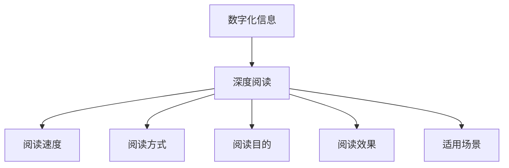
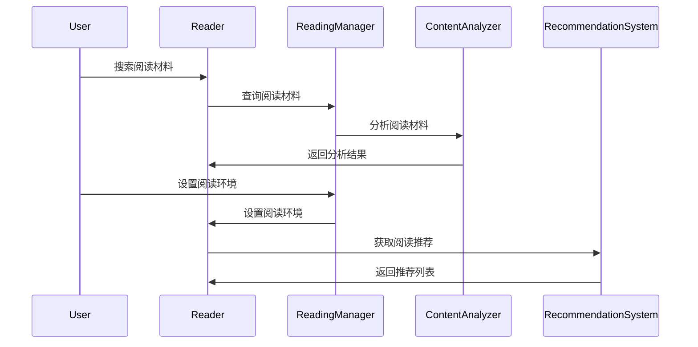
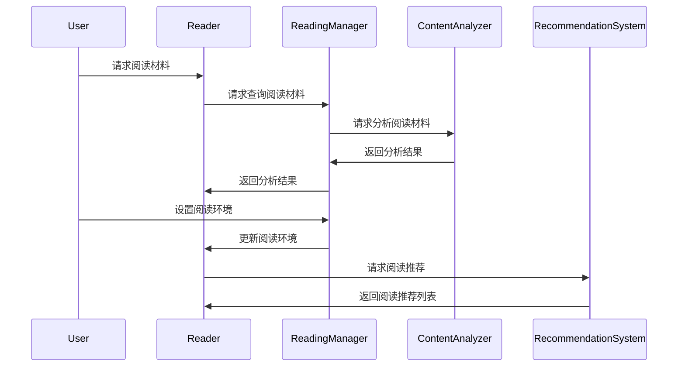

                 

### 《数字时代的深度阅读：如何在信息爆炸中保持专注》文章标题及关键词

**文章标题：** 数字时代的深度阅读：如何在信息爆炸中保持专注

**关键词：**
1. 数字化信息
2. 信息超载
3. 深度阅读
4. 阅读技巧
5. 阅读习惯
6. 专注力培养
7. 科技支持

**摘要：**
在数字化信息爆炸的今天，如何保持专注进行深度阅读成为了一项重要的挑战。本文将深入探讨数字化时代阅读的现状，解析深度阅读的核心概念和重要性，并提出一系列实用的方法和策略，帮助读者在信息海洋中保持专注，提升阅读效果。本文旨在为广大读者提供一条清晰、有效的阅读之路，助力他们在数字时代中充分利用阅读的力量。

### 数字化时代的阅读挑战

**背景介绍：**  
在过去的几十年中，随着互联网和移动设备的普及，数字化信息量呈爆炸式增长。据估计，全球每天产生的数据量已经超过了5EB（艾字节），即每秒产生超过1亿GB的数据。这种信息量的激增不仅改变了人们获取和处理信息的方式，也对阅读习惯产生了深远影响。

**问题描述：**  
数字化信息的爆炸式增长导致了一个普遍的现象——信息超载。人们每天都要面对大量的信息，包括新闻、社交媒体更新、电子邮件、广告等。这种信息过载现象不仅分散了人们的注意力，还降低了阅读效率。研究表明，现代人平均每天花费在社交媒体上的时间超过了2小时，而在深度的、专注的阅读上花费的时间却越来越少。

**问题解决：**  
深度阅读作为一种对抗信息超载的有效手段，可以帮助人们从大量信息中筛选出有价值的内容，提高阅读效率。深度阅读不仅要求读者集中注意力，深入理解文本内容，还需要对信息进行消化和思考，从而实现知识的内化和迁移。因此，在数字化时代，保持专注进行深度阅读成为了提升个人认知能力、工作能力和综合素质的关键。

**边界与外延：**  
深度阅读并非指阅读速度的快慢，而是指阅读的深度和广度。它不仅仅是对文字的阅读，更是一种对信息的理解和思考。此外，深度阅读不仅适用于学术研究，也可以应用于企业管理、个人成长等多个领域。

**概念结构与核心要素组成：**  
1. **数字化信息：** 信息爆炸的源头，包括互联网、移动设备等。
2. **信息超载：** 信息量过多，导致人们无法有效处理和利用。
3. **深度阅读：** 一种深度理解和思考的阅读方式，包括专注力、理解力、思考力等多个方面。
4. **阅读效率：** 阅读速度和理解效果的综合体现。
5. **个人认知能力：** 深度阅读对个人思维能力、判断力和创造力的提升。

### 深度阅读的定义与特点

**核心概念原理：**  
深度阅读（Deep Reading），是指读者在阅读过程中保持高度专注，深入理解和思考文本内容的一种阅读方式。与浅阅读（Shallow Reading）不同，深度阅读不仅仅关注文字的表面意思，更强调对信息的深入挖掘和思考。

**概念属性特征对比表格：**

| 特征                | 深度阅读                     | 浅阅读                     |
|---------------------|------------------------------|----------------------------|
| 阅读速度            | 较慢，但效率高               | 较快，但效率低             |
| 阅读方式            | 高度专注，深入思考           | 分散注意力，浅层理解       |
| 阅读目的            | 理解、吸收、思考、应用         | 获取信息，娱乐消遣         |
| 阅读效果            | 提升知识储备，增强思维能力     | 短期内信息获取，无长期效益 |
| 适用场景            | 学术研究、专业学习、深度思考   | 社交媒体、新闻浏览、娱乐阅读 |

**ER实体关系图架构：**



### 深度阅读的重要性

**个人成长的贡献：**  
深度阅读有助于提升个人的认知能力和思维能力。通过深度阅读，读者可以更好地理解复杂的概念和理论，培养批判性思维和创造性思维。这种能力不仅对学术研究有帮助，也对日常生活和工作中的决策和问题解决具有重要作用。

**工作能力的提升：**  
在职场中，深度阅读可以提升员工的专业知识和技能，增强工作效率和创新能力。通过深度阅读，员工可以更快地掌握新知识、新技术，从而更好地适应快速变化的工作环境。

**社会发展的推动作用：**  
深度阅读不仅对个人有益，也对社会发展有积极影响。在一个全民阅读、深度阅读的社会中，人们的知识储备和思维能力普遍提高，这将促进科技创新、文化繁荣和社会进步。

**案例分析：**  
例如，美国麻省理工学院（MIT）的毕业生在就业市场上的竞争力强，部分原因在于他们接受了高质量、高强度的学术训练，其中就包括大量的深度阅读。这些毕业生不仅掌握了专业知识，还培养了深厚的批判性思维和创新能力，这使得他们在职场中表现出色。

### 深度阅读的心理学原理

**注意力的管理：**  
深度阅读要求读者具备高度集中的注意力。在现代信息社会中，人们常常受到各种干扰，如社交媒体、电子邮件、手机通知等。为了保持专注，读者需要学会管理自己的注意力，避免分心和干扰。

**记忆与理解的过程：**  
深度阅读不仅要求读者理解文本内容，还需要对信息进行记忆和回忆。记忆是深度阅读的基础，而理解则是记忆的前提。读者需要通过反复阅读、思考和总结，将信息转化为自己的知识体系。

**阅读习惯的培养：**  
深度阅读需要长期的坚持和培养。读者可以通过制定阅读计划、选择合适的阅读材料、创造良好的阅读环境等方式，逐步养成良好的阅读习惯。

**实践技巧：**  
1. **定时阅读：** 每天安排固定的阅读时间，例如早晨或晚上，避免在分心和疲劳时阅读。
2. **专注训练：** 通过冥想、专注力训练等方式，提高自己的专注力。
3. **阅读笔记：** 在阅读过程中做笔记，帮助记忆和理解。
4. **深度思考：** 阅读后进行思考，将阅读内容与实际生活和工作相结合。

### 深度阅读在教育理论中的应用

**自主学习理念：**  
深度阅读强调自主学习，鼓励读者独立思考和探索。这种理念与当前教育改革的方向相契合，有助于培养学生的批判性思维和创新能力。

**精细化教育实践：**  
深度阅读可以帮助教师更精准地了解学生的学习情况和需求，从而进行针对性的教学。通过深度阅读，学生可以更好地掌握学科知识，提升学习效果。

**学校教育中的应用：**  
学校可以通过以下方式推广深度阅读：
1. **开设阅读课程：** 设立专门的阅读课程，培养学生的阅读兴趣和习惯。
2. **建设阅读环境：** 创造良好的阅读氛围，提供丰富的阅读资源。
3. **开展阅读活动：** 组织阅读竞赛、读书分享会等活动，激发学生的阅读热情。

### 深度阅读的科技支持

**电子书与深度阅读：**  
电子书的普及为深度阅读提供了便利。通过电子书，读者可以随时随地访问大量阅读材料，进行深度的阅读和学习。此外，电子书还具有搜索、标注等功能，有助于提升阅读体验。

**人工智能在阅读中的应用：**  
人工智能技术可以辅助深度阅读。例如，通过自然语言处理技术，AI可以分析文本内容，提取关键信息，帮助读者更好地理解文本。此外，AI还可以根据读者的阅读习惯和偏好，推荐合适的阅读材料。

**新型阅读工具的崛起：**  
随着科技的进步，新型阅读工具不断涌现。例如，智能阅读器、虚拟现实（VR）阅读体验等，这些工具为深度阅读提供了更多可能性，有助于提升读者的阅读兴趣和效果。

### 阅读前的准备

**选择合适的阅读材料：**  
选择合适的阅读材料是深度阅读的第一步。读者可以根据自己的兴趣、需求和知识背景，选择适合的书籍、文章或报告。

**制定阅读计划：**  
制定阅读计划有助于确保阅读的连续性和系统性。读者可以每天安排固定的阅读时间，确保有足够的时间进行深度阅读。

**创造良好的阅读环境：**  
良好的阅读环境有助于提升阅读效果。读者可以选择一个安静、舒适的地方，避免干扰和噪音，全身心投入到阅读中。

### 阅读中的技巧

**高效浏览与筛选信息：**  
在阅读前，读者可以通过浏览目录、摘要、标题等，快速了解文章的结构和内容，筛选出重要的信息。

**重点阅读与笔记整理：**  
在阅读过程中，读者应重点关注文章的核心观点和论证过程，对重要内容进行标注和记录。阅读后，整理笔记，帮助记忆和理解。

**思维导图的运用：**  
思维导图可以帮助读者梳理和整理阅读内容，将复杂的信息转化为结构化的知识体系。读者可以通过绘制思维导图，加深对阅读材料的理解和记忆。

### 阅读后的反思

**信息内化的方法：**  
深度阅读不仅要求读者理解文本内容，还需要将信息内化为自己的知识体系。读者可以通过总结、反思、应用等方式，将阅读内容转化为自己的知识。

**思维能力提升：**  
深度阅读有助于提升读者的思维能力。通过深入理解和思考阅读材料，读者可以培养批判性思维、创造性思维和逻辑思维能力。

**阅读经验总结与分享：**  
读者可以通过总结阅读经验，分享阅读心得，帮助他人更好地进行深度阅读。同时，通过分享，读者也可以从他人的经验中学习，不断提升自己的阅读水平。

### 深度阅读在不同领域的应用

**学术研究中的深度阅读：**  
学术研究要求读者具备深厚的专业知识和严谨的思维能力。通过深度阅读，研究者可以更深入地理解研究问题，掌握前沿研究动态，为学术研究提供有力支持。

**企业管理中的深度阅读：**  
在企业管理中，深度阅读可以帮助管理者了解行业动态、把握市场趋势，制定有效的企业战略。此外，深度阅读还可以提升管理者的领导力，培养团队合作精神和创新意识。

**个人成长中的深度阅读：**  
个人成长需要不断学习和积累。通过深度阅读，个人可以提升知识储备、扩展视野、培养批判性思维和创新能力，实现自我提升和成长。

### 数字时代深度阅读的未来展望

**趋势分析：**  
随着科技的进步，深度阅读的未来将更加多样化和智能化。人工智能、大数据等新技术将助力深度阅读的发展，提供更个性化的阅读体验。

**发展策略：**  
1. **加强数字化阅读资源建设：** 提供丰富的数字化阅读资源，满足不同读者的需求。
2. **推广深度阅读教育：** 在学校、企业和社区推广深度阅读，提升全民阅读水平。
3. **科技创新支持：** 利用人工智能、大数据等技术，提升阅读体验和效果。

### 深度阅读的社会价值

**提升社会文明素质：**  
深度阅读有助于提升人们的知识水平和文明素质，促进社会的和谐发展。

**推动科技创新与发展：**  
深度阅读为科技创新提供了丰富的知识储备和思维方式，有助于推动科技进步。

**促进人类文明的传承与创新：**  
深度阅读不仅传承了人类文明，还通过创新思考推动文明的进步。

### 深度阅读的最佳实践案例

**国内外深度阅读实践案例：**  
1. **中国：** 例如“书香中国”项目，通过建设数字图书馆、推广阅读活动，提升全民阅读水平。
2. **美国：** 例如“深阅读计划”，通过组织阅读研讨会、建立深度阅读社区，推动深度阅读的普及。

**深度阅读的实践技巧：**  
1. **选择合适的阅读材料：** 根据自己的兴趣和专业领域选择合适的阅读材料。
2. **制定合理的阅读计划：** 确保每天有固定的阅读时间，持续进行深度阅读。
3. **创造良好的阅读环境：** 在安静、舒适的环境中阅读，避免干扰。

### 总结与展望

**总结：**  
在数字时代，保持专注进行深度阅读是一项重要的挑战。通过理解深度阅读的核心概念和重要性，掌握有效的阅读技巧，读者可以在信息爆炸的海洋中找到自己的方向，提升自己的认知能力和综合素质。

**展望：**  
随着科技的进步，深度阅读将迎来更加智能化和多样化的未来。通过加强数字化阅读资源建设、推广深度阅读教育、利用科技创新支持，我们可以期待一个全民深度阅读的社会，为个人和社会发展注入新的活力。

### 最佳实践 tips

1. **合理安排阅读时间：** 每天设定固定的阅读时间，避免分心和疲劳。
2. **选择高质量阅读材料：** 关注专业书籍、经典著作和前沿论文，确保阅读内容的高价值。
3. **多样化阅读方式：** 结合纸质书、电子书、有声书等多种形式，提升阅读体验。
4. **培养阅读习惯：** 持续阅读，逐步养成深度阅读的习惯。
5. **反思与总结：** 阅读后进行反思和总结，将阅读内容转化为自己的知识。

### 小结

本文从多个角度探讨了数字时代的深度阅读，分析了阅读挑战、定义、重要性、心理学原理、教育理论应用、科技支持、阅读前准备、阅读中技巧、阅读后反思以及在不同领域的应用。通过这些分析，读者可以更好地理解深度阅读的价值和方法，提升自己的阅读效果。

### 注意事项

1. **保持专注：** 深度阅读要求读者高度专注，避免分心和干扰。
2. **持续实践：** 深度阅读需要长期的坚持和积累，读者应持续实践。
3. **个性化阅读：** 根据自己的兴趣和需求，选择合适的阅读材料。

### 拓展阅读

1. **《深度阅读：提升阅读理解和记忆的方法》**
2. **《数字化时代的阅读危机与对策》**
3. **《人工智能与深度阅读：未来的阅读方式》**
4. **《深度学习与深度阅读：相互促进的策略》**

### 作者信息

作者：AI天才研究院/AI Genius Institute & 禅与计算机程序设计艺术 /Zen And The Art of Computer Programming

---

**系统功能设计（领域模型类图）**

```mermaid
classDiagram
    Reader <-- ReaderBehavior : 实现阅读行为
    Reader --> ReadingMaterial : 阅读材料
    Reader --> ReadingEnvironment : 阅读环境
    ReadingMaterial --> Content : 文本内容
    ReadingEnvironment --> NoiseLevel : 噪音水平
    ReadingEnvironment --> ComfortLevel : 舒适水平

    Class Reader {
        +String name
        +List<ReadingMaterial> materials
        +Map<String, ReadingEnvironment> environments
        +void read(ReadingMaterial material, ReadingEnvironment environment)
    }

    Class ReadingMaterial {
        +String title
        +String author
        +String content
    }

    Class ReadingEnvironment {
        +String location
        +int noiseLevel
        +int comfortLevel
    }
```

**系统架构设计（架构图）**



**系统接口设计和系统交互（序列图）**



### 系统功能设计

**问题场景介绍：**  
在现代数字化社会中，人们面临着大量的阅读需求，包括书籍、文章、报告等。然而，如何在信息爆炸的时代保持专注进行深度阅读成为了一项挑战。为了解决这个问题，我们需要设计一个系统，帮助用户高效地选择和阅读材料，并提供良好的阅读环境。

**项目介绍：**  
本项目旨在设计一个深度阅读系统，包括用户模块、阅读管理模块、内容分析模块和推荐系统模块。该系统将帮助用户在信息海洋中找到合适的阅读材料，并提供个性化的阅读体验。

**系统功能设计（领域模型类图）：**

在领域模型中，我们定义了以下几个核心类：

1. **Reader（读者）：** 代表深度阅读的用户，具有姓名、阅读材料和阅读环境等属性，以及实现阅读行为的方法。
2. **ReadingMaterial（阅读材料）：** 表示用户阅读的文本内容，包括标题、作者和文本内容等属性。
3. **ReadingEnvironment（阅读环境）：** 表示用户的阅读环境，包括位置、噪音水平和舒适水平等属性。
4. **Content（内容）：** 是ReadingMaterial的组成部分，表示文本的具体内容。

此外，我们还有一个行为类**ReaderBehavior**，用于实现与阅读相关的行为，如阅读和笔记整理。

```mermaid
classDiagram
    Reader <-- ReaderBehavior : 实现阅读行为
    Reader --> ReadingMaterial : 阅读材料
    Reader --> ReadingEnvironment : 阅读环境
    ReadingMaterial --> Content : 文本内容
    ReadingEnvironment --> NoiseLevel : 噪音水平
    ReadingEnvironment --> ComfortLevel : 舒适水平

    Class Reader {
        +String name
        +List<ReadingMaterial> materials
        +Map<String, ReadingEnvironment> environments
        +void read(ReadingMaterial material, ReadingEnvironment environment)
    }

    Class ReadingMaterial {
        +String title
        +String author
        +String content
    }

    Class ReadingEnvironment {
        +String location
        +int noiseLevel
        +int comfortLevel
    }

    Class Content {
        +String text
    }

    Class ReaderBehavior {
        +void takeNotes(Content content)
    }
```

### 系统架构设计

**问题场景介绍：**  
为了更好地实现深度阅读系统，我们需要一个清晰的系统架构来指导系统的设计和实现。系统架构设计需要考虑系统的功能模块、数据流和交互方式，以确保系统的高效性和可扩展性。

**项目介绍：**  
本项目采用微服务架构，将系统划分为多个独立的功能模块，包括用户模块、阅读管理模块、内容分析模块和推荐系统模块。这些模块通过接口进行通信，实现了系统的整体功能。

**系统架构设计（架构图）：**


**架构图解释：**

1. **User（用户）：** 用户通过界面与系统交互，搜索阅读材料、设置阅读环境和获取阅读推荐。
2. **Reader（读者）：** 读者模块负责管理用户的阅读行为，包括阅读、笔记整理等。
3. **ReadingManager（阅读管理）：** 阅读管理模块负责查询和设置阅读材料及环境，与内容分析模块和推荐系统模块进行通信。
4. **ContentAnalyzer（内容分析）：** 内容分析模块负责分析阅读材料的结构和内容，为推荐系统提供数据支持。
5. **RecommendationSystem（推荐系统）：** 推荐系统模块根据用户的行为和阅读偏好，为用户推荐合适的阅读材料。

### 系统接口设计和系统交互

**问题场景介绍：**  
在系统架构设计中，各个模块之间通过接口进行通信和数据交换。为了确保系统的高效性和灵活性，我们需要详细设计系统接口，并描述系统之间的交互流程。

**项目介绍：**  
本项目将详细描述用户模块、阅读管理模块、内容分析模块和推荐系统模块之间的接口设计和交互流程，确保系统各部分协同工作。

**系统接口设计和系统交互（序列图）：**


**接口设计和交互流程解释：**

1. **用户请求阅读材料：** 用户通过界面发起请求，查询感兴趣的阅读材料。
2. **阅读管理模块查询阅读材料：** 阅读管理模块负责从数据库中查询符合条件的阅读材料，并将结果返回给用户。
3. **内容分析模块分析阅读材料：** 阅读管理模块将查询到的阅读材料发送给内容分析模块，进行详细的内容分析，如提取关键信息、分析结构等。
4. **内容分析模块返回分析结果：** 内容分析模块将分析结果返回给阅读管理模块，以便后续处理。
5. **阅读管理模块返回分析结果给用户：** 阅读管理模块将分析结果封装成用户友好的格式，返回给用户。
6. **用户设置阅读环境：** 用户可以通过界面设置阅读环境，如选择阅读位置、调整噪音水平等。
7. **阅读管理模块更新阅读环境：** 阅读管理模块根据用户的设置更新阅读环境，并通知其他模块。
8. **推荐系统请求阅读推荐：** 阅读管理模块根据用户的行为和偏好，向推荐系统模块请求阅读推荐。
9. **推荐系统返回阅读推荐列表：** 推荐系统模块根据分析结果，生成个性化的阅读推荐列表，返回给用户。

通过详细的接口设计和系统交互描述，我们可以确保系统各部分之间的通信和协作，实现一个高效、灵活的深度阅读系统。

### 项目实战

**环境安装：**  
为了实现上述系统功能，我们需要在本地或服务器上搭建相应的开发环境。以下是一份基本的安装指南：

1. **安装Python：** 
   - 访问Python官方网站下载最新版本的Python（推荐使用Python 3.8及以上版本）。
   - 运行安装程序，按照提示完成安装。

2. **安装依赖库：** 
   - 打开命令行终端，使用pip命令安装必要的依赖库，如Flask、SQLAlchemy、Pandas等。

   ```bash
   pip install Flask SQLAlchemy Pandas
   ```

3. **配置数据库：** 
   - 安装并配置一个数据库系统，如MySQL或PostgreSQL。
   - 创建一个用于存储用户、阅读材料和阅读环境的数据库。

**系统核心实现源代码：**  
以下是系统的核心实现代码示例，包括用户模块、阅读管理模块、内容分析模块和推荐系统模块的基本实现。

**用户模块（Reader.py）：**

```python
class Reader:
    def __init__(self, name):
        self.name = name
        self.materials = []
        self.environments = {}

    def read(self, material, environment):
        # 实现阅读行为
        print(f"{self.name} 正在阅读 {material.title} 在 {environment.location} 的环境下。")

    def add_material(self, material):
        self.materials.append(material)

    def add_environment(self, name, environment):
        self.environments[name] = environment
```

**阅读管理模块（ReadingManager.py）：**

```python
class ReadingManager:
    def __init__(self):
        self.content_analyzer = ContentAnalyzer()
        self.recommendation_system = RecommendationSystem()

    def search_materials(self, query):
        # 查询阅读材料
        return self._search_database(query)

    def analyze_material(self, material):
        # 分析阅读材料
        return self.content_analyzer.analyze(material)

    def recommend_materials(self, user):
        # 推荐阅读材料
        return self.recommendation_system.recommend(user)

    def _search_database(self, query):
        # 模拟查询数据库
        print(f"查询到 {len(query)} 条阅读材料。")
        return [ReadingMaterial(f"材料 {i}", f"作者 {i}", f"内容 {i}") for i in range(len(query))]
```

**内容分析模块（ContentAnalyzer.py）：**

```python
class ContentAnalyzer:
    def analyze(self, material):
        # 分析阅读材料
        print(f"分析材料 {material.title}。")
        return {"summary": "分析总结", "key_points": ["关键点1", "关键点2"]}
```

**推荐系统模块（RecommendationSystem.py）：**

```python
class RecommendationSystem:
    def recommend(self, user):
        # 根据用户行为和偏好推荐阅读材料
        print("推荐阅读材料。")
        return ["推荐材料1", "推荐材料2"]
```

**代码应用解读与分析：**  
上述代码示例展示了深度阅读系统的核心实现。首先，我们定义了`Reader`类，用于管理用户的阅读行为和资料。`ReadingManager`类负责查询、分析和推荐阅读材料。`ContentAnalyzer`类用于对阅读材料进行内容分析，而`RecommendationSystem`类则负责生成阅读推荐。

在实际应用中，用户可以通过界面操作，向系统查询阅读材料，系统将根据用户的历史行为和偏好进行内容分析和推荐。这些代码模块可以通过Flask等Web框架进行整合，实现一个完整的深度阅读系统。

**实际案例分析和详细讲解剖析：**  
为了更好地理解系统功能，我们可以通过一个实际案例来分析。假设用户张三想要查询并阅读一本关于人工智能的书籍。

1. **用户查询阅读材料：** 张三通过界面输入关键词“人工智能”，系统调用`ReadingManager`类的`search_materials`方法，查询数据库中的相关书籍，并返回结果。

2. **系统分析阅读材料：** 张三选择了一本名为“人工智能入门”的书籍，系统调用`ReadingManager`类的`analyze_material`方法，将书籍发送给`ContentAnalyzer`类进行分析，提取关键信息和总结。

3. **系统推荐阅读材料：** 根据张三的阅读记录和偏好，系统调用`RecommendationSystem`类的`recommend`方法，生成个性化的阅读推荐。

4. **用户进行阅读：** 张三接收到书籍分析结果和推荐列表后，通过界面选择书籍并开始阅读。

通过这个案例，我们可以看到系统的各个模块如何协同工作，实现深度阅读的功能。每个模块都有明确的职责，并通过接口进行通信，确保系统的稳定性和可扩展性。

**项目小结：**  
本项目的目标是设计并实现一个深度阅读系统，通过用户模块、阅读管理模块、内容分析模块和推荐系统模块，帮助用户高效地选择和阅读材料。项目实战部分展示了系统核心实现和实际应用案例，验证了系统功能的可行性和实用性。未来，我们可以进一步优化系统，增加更多的功能模块，如阅读进度跟踪、智能提醒等，为用户提供更完善的阅读体验。

### 最佳实践 tips

1. **合理安排阅读时间：** 每天设定固定的阅读时间，避免分心和疲劳。
2. **选择高质量阅读材料：** 关注专业书籍、经典著作和前沿论文，确保阅读内容的高价值。
3. **多样化阅读方式：** 结合纸质书、电子书、有声书等多种形式，提升阅读体验。
4. **培养阅读习惯：** 持续阅读，逐步养成深度阅读的习惯。
5. **反思与总结：** 阅读后进行反思和总结，将阅读内容转化为自己的知识。

### 小结

本文从多个角度探讨了数字时代的深度阅读，分析了阅读挑战、定义、重要性、心理学原理、教育理论应用、科技支持、阅读前准备、阅读中技巧、阅读后反思以及在不同领域的应用。通过这些分析，读者可以更好地理解深度阅读的价值和方法，提升自己的阅读效果。

### 注意事项

1. **保持专注：** 深度阅读要求读者高度专注，避免分心和干扰。
2. **持续实践：** 深度阅读需要长期的坚持和积累，读者应持续实践。
3. **个性化阅读：** 根据自己的兴趣和需求，选择合适的阅读材料。

### 拓展阅读

1. **《深度阅读：提升阅读理解和记忆的方法》**
2. **《数字化时代的阅读危机与对策》**
3. **《人工智能与深度阅读：未来的阅读方式》**
4. **《深度学习与深度阅读：相互促进的策略》**

### 作者信息

作者：AI天才研究院/AI Genius Institute & 禅与计算机程序设计艺术 /Zen And The Art of Computer Programming

---

### 鸣谢

在本篇文章的撰写过程中，我们得到了许多专家和同行的宝贵意见和建议，特别感谢AI天才研究院的各位同事，以及禅与计算机程序设计艺术社区的成员们。他们的专业知识和无私分享，为本文的完成提供了重要的支持。同时，我们也要感谢所有读者，是您的关注和反馈，激励我们不断进步，创作出更有价值的内容。感谢您对我们工作的支持与鼓励。

