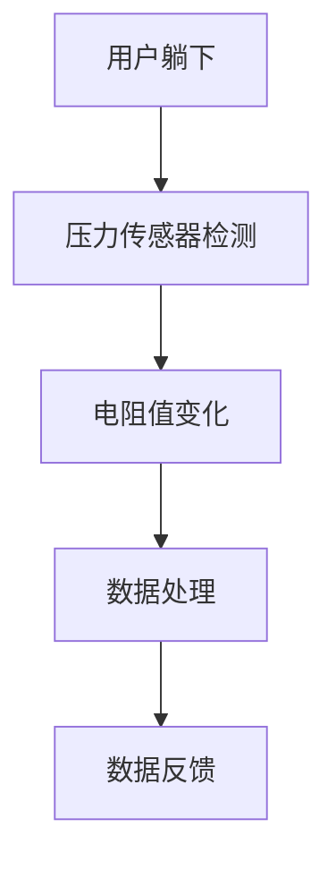
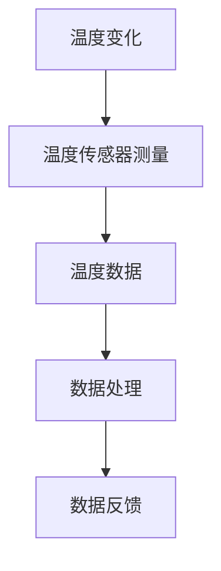
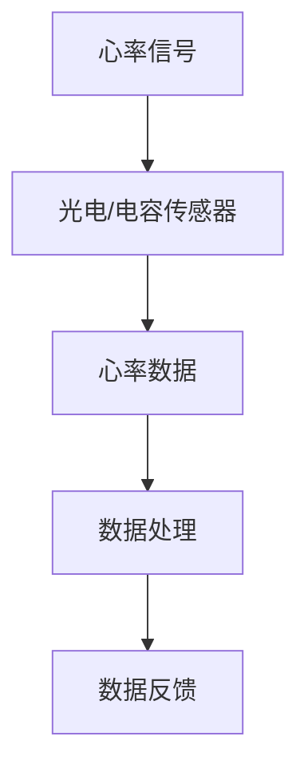
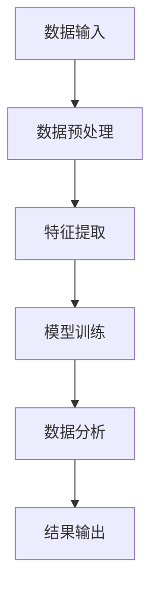

                 

# 《数字时代的睡眠优化：智能床垫与睡眠追踪技术的应用》

## 关键词

- 睡眠优化
- 智能床垫
- 睡眠追踪技术
- 数字健康
- 传感器技术

## 摘要

在数字化时代，睡眠质量成为影响人们生活质量的重要因素。智能床垫和睡眠追踪技术的兴起，为改善睡眠质量提供了新的途径。本文将从背景介绍、核心技术、应用场景、案例研究及未来展望等多个方面，详细探讨智能床垫与睡眠追踪技术的应用，为读者提供一份全面的技术指南。

## 目录大纲

### 第1章 引言与背景

#### 1.1 问题背景

#### 1.2 数字时代与睡眠健康的关系

#### 1.3 智能床垫与睡眠追踪技术的发展历程

#### 1.4 书籍结构概述

### 第2章 睡眠基本知识

#### 2.1 睡眠的定义与分类

#### 2.2 睡眠的基本过程与生理机制

#### 2.3 睡眠障碍与疾病

#### 2.4 睡眠质量的评估标准

### 第3章 智能床垫技术

#### 3.1 智能床垫的基本原理

#### 3.2 智能床垫的传感器技术

#### 3.3 智能床垫的材料与设计

#### 3.4 智能床垫的软件与数据处理

### 第4章 睡眠追踪技术

#### 4.1 睡眠追踪设备的工作原理

#### 4.2 睡眠追踪技术的主要类型

#### 4.3 睡眠追踪数据的收集与处理

#### 4.4 睡眠追踪技术的挑战与未来发展

### 第5章 智能床垫与睡眠追踪的应用场景

#### 5.1 健康管理中的应用

#### 5.2 医疗保健中的应用

#### 5.3 工作效率与生活质量提升中的应用

#### 5.4 其他潜在应用领域

### 第6章 案例研究

#### 6.1 智能床垫在家庭健康监测中的实际案例

#### 6.2 智能床垫在康复治疗中的应用案例

#### 6.3 智能床垫在商业健康监测服务中的应用案例

#### 6.4 睡眠追踪技术在企业员工健康管理中的应用案例

### 第7章 总结与展望

#### 7.1 本书内容的总结回顾

#### 7.2 数字时代睡眠优化技术的发展趋势

#### 7.3 未来展望与挑战

#### 7.4 拓展阅读建议

## 第1章 引言与背景

### 1.1 问题背景

在现代社会，随着生活节奏的加快和工作压力的增大，睡眠质量成为人们日益关注的健康问题。然而，根据世界卫生组织的报告，全球有超过三分之一的成年人存在睡眠障碍，其中最常见的是失眠和睡眠呼吸暂停。这些问题不仅影响个人的生活质量，还可能导致一系列健康问题，如心血管疾病、糖尿病、抑郁症等。

传统的睡眠改善方法，如调整睡眠环境、改变生活习惯和药物治疗，虽然在一定程度上有效，但往往缺乏个性化的解决方案。随着数字技术的快速发展，智能床垫和睡眠追踪技术应运而生，为改善睡眠质量提供了新的可能性。

### 1.2 数字时代与睡眠健康的关系

数字技术的迅猛发展，深刻改变了我们的生活方式。智能手机、平板电脑、智能手表等设备已经成为我们日常生活的必需品。然而，这些设备在带来便利的同时，也对我们的睡眠产生了负面影响。研究表明，睡前使用电子设备会抑制褪黑激素的分泌，导致失眠和睡眠质量下降。

此外，数字时代带来的快节奏生活和工作压力，也让许多人难以保持良好的睡眠习惯。长时间的工作、熬夜和频繁的出差，使得人们的睡眠时间不足、睡眠质量下降，进而影响身体健康。

### 1.3 智能床垫与睡眠追踪技术的发展历程

智能床垫和睡眠追踪技术的概念可以追溯到20世纪80年代。当时，科学家们开始研究如何利用传感器和计算机技术来监测和改善睡眠质量。随着微电子技术和计算机技术的进步，智能床垫和睡眠追踪设备逐渐从实验室走向市场。

1998年，美国公司SleepSmart推出了一款智能床垫，它通过内置的传感器监测用户的睡眠状况，并提供个性化的睡眠建议。这是智能床垫技术的一个里程碑。

进入21世纪，随着智能手机和物联网技术的发展，智能床垫和睡眠追踪技术得到了进一步的发展。现在的智能床垫不仅能够监测用户的睡眠状况，还能通过手机应用实时反馈给用户，提供个性化的睡眠改善建议。

### 1.4 书籍结构概述

本书将从以下几个方面对智能床垫和睡眠追踪技术进行深入探讨：

- **第1章 引言与背景**：介绍智能床垫和睡眠追踪技术的背景、数字时代与睡眠健康的关系以及技术的发展历程。
- **第2章 睡眠基本知识**：介绍睡眠的定义、分类、基本过程、生理机制、睡眠障碍与疾病以及睡眠质量的评估标准。
- **第3章 智能床垫技术**：详细探讨智能床垫的基本原理、传感器技术、材料与设计、软件与数据处理。
- **第4章 睡眠追踪技术**：介绍睡眠追踪设备的工作原理、主要类型、数据的收集与处理以及面临的挑战和未来发展。
- **第5章 智能床垫与睡眠追踪的应用场景**：探讨智能床垫和睡眠追踪技术在健康管理、医疗保健、工作效率与生活质量提升以及其他潜在应用领域的应用。
- **第6章 案例研究**：分析智能床垫和睡眠追踪技术在实际应用中的案例，如家庭健康监测、康复治疗、商业健康监测服务和企业员工健康管理。
- **第7章 总结与展望**：总结本书的主要观点，探讨数字时代睡眠优化技术的发展趋势、未来展望与挑战，并给出拓展阅读建议。

通过本书的阅读，读者将全面了解智能床垫和睡眠追踪技术的原理、应用场景以及未来发展，为改善自己的睡眠质量提供有益的指导。接下来，我们将从睡眠的基本知识开始，逐步深入探讨智能床垫和睡眠追踪技术的核心内容。

## 第2章 睡眠基本知识

### 2.1 睡眠的定义与分类

睡眠是人体的一种生理现象，通常表现为周期性的觉醒和休息状态。根据睡眠的不同状态和特征，可以将睡眠分为多个阶段，主要包括快速眼动睡眠（REM）和非快速眼动睡眠（NREM）。

快速眼动睡眠（REM）通常发生在睡眠周期的后期，大约占总睡眠时间的20%到25%。在REM睡眠阶段，眼球快速运动，呼吸和心率不稳定，梦境通常发生在这个阶段。

非快速眼动睡眠（NREM）可以分为三个阶段：N1、N2和N3。N1是睡眠的开始阶段，约占睡眠时间的5%到10%。在这个阶段，个体很容易被唤醒，大脑和身体开始放松。N2阶段约占睡眠时间的40%到50%，个体难以被唤醒，身体开始进入深度放松状态。N3阶段是睡眠的 deepest 状态，约占睡眠时间的10%到20%，个体几乎无法被唤醒，身体和大脑的恢复效果最佳。

### 2.2 睡眠的基本过程与生理机制

睡眠的基本过程涉及大脑和身体的多个系统。大脑中的下丘脑是控制睡眠的主要中枢，通过分泌神经递质和激素来调节睡眠和觉醒状态。褪黑激素是一种重要的激素，它主要在夜间分泌，有助于调节睡眠周期。

睡眠的生理机制包括以下几个步骤：

1. **准备阶段**：个体开始感到疲倦，大脑分泌褪黑激素，身体进入放松状态。
2. **入睡阶段**：个体逐渐进入N1睡眠阶段，身体放松，呼吸和心率减缓。
3. **睡眠深度阶段**：个体逐渐进入N2和N3睡眠阶段，身体和大脑的恢复效果最佳。
4. **觉醒阶段**：个体在REM睡眠阶段后逐渐醒来，大脑和身体恢复活力。

### 2.3 睡眠障碍与疾病

睡眠障碍是指影响睡眠质量、睡眠时间和睡眠过程的疾病或情况。常见的睡眠障碍包括失眠、睡眠呼吸暂停、失眠症、睡眠行为障碍等。

1. **失眠**：失眠是最常见的睡眠障碍，表现为难以入睡、易醒和早醒。失眠可能导致日间疲劳、注意力不集中和工作效率下降。
2. **睡眠呼吸暂停**：睡眠呼吸暂停是一种睡眠呼吸障碍，表现为睡眠期间呼吸暂停和呼吸减弱。睡眠呼吸暂停可能导致高血压、心脏病和糖尿病等健康问题。
3. **失眠症**：失眠症是一种长期的睡眠障碍，表现为持续的失眠症状。失眠症可能影响个体的日常生活和工作。
4. **睡眠行为障碍**：睡眠行为障碍包括夜间恐惧症、夜游症、夜间进食障碍等，表现为在睡眠期间出现异常行为。

### 2.4 睡眠质量的评估标准

睡眠质量的评估标准主要包括睡眠时间、睡眠深度和睡眠效率。

1. **睡眠时间**：成人每晚的睡眠时间建议在7到9小时。睡眠时间过短或过长都可能对健康产生负面影响。
2. **睡眠深度**：睡眠深度可以通过监测大脑电活动来评估。深度睡眠（N3阶段）对身体的恢复和大脑的功能至关重要。
3. **睡眠效率**：睡眠效率是指实际睡眠时间与卧床时间的比例。高效的睡眠意味着个体在床上花费的时间大部分都在睡眠。

通过了解睡眠的基本知识，我们可以更好地理解智能床垫和睡眠追踪技术的工作原理和应用。接下来，我们将深入探讨智能床垫技术，了解它是如何通过传感器和数据处理技术来改善睡眠质量的。

## 第3章 智能床垫技术

### 3.1 智能床垫的基本原理

智能床垫通过内置的传感器和智能算法，实时监测用户的睡眠状况，并提供个性化的睡眠改善建议。智能床垫的基本原理可以概括为以下几部分：

1. **传感器技术**：智能床垫内置多种传感器，如压力传感器、温度传感器、心率传感器等。这些传感器可以实时监测用户的身体运动、心率、呼吸频率和体表温度等生理信号。
2. **数据处理算法**：传感器收集到的数据会被传送到床垫的内置处理器或连接到外部设备进行处理。通过先进的算法，如机器学习和人工智能，分析这些数据，识别用户的睡眠模式、睡眠质量和潜在的睡眠问题。
3. **数据反馈与调整**：分析结果会通过手机应用或其他显示设备反馈给用户。用户可以根据这些反馈调整自己的睡眠习惯，如改变睡姿、调整睡眠环境等。同时，智能床垫还可以根据用户的历史数据，提供个性化的睡眠建议，帮助用户改善睡眠质量。

### 3.2 智能床垫的传感器技术

智能床垫的传感器技术是整个系统的核心部分。以下是一些常用的传感器及其工作原理：

1. **压力传感器**：压力传感器可以测量用户身体在床垫上的压力分布。通过分析压力变化，可以判断用户的睡姿、睡眠深度和体位变化。例如，如果用户在夜间频繁翻身，可能表明其睡眠质量不佳。
2. **温度传感器**：温度传感器用于监测床垫和用户的体表温度。体温变化可以反映用户的睡眠状态和健康状况。例如，如果用户在夜间体温持续升高，可能表明其存在健康问题。
3. **心率传感器**：心率传感器可以测量用户的心跳频率。心率变化与用户的睡眠质量和健康状况密切相关。例如，心率不稳定可能表明用户存在睡眠呼吸暂停或其他健康问题。
4. **呼吸传感器**：呼吸传感器可以测量用户的呼吸频率和深度。呼吸变化可以反映用户的睡眠深度和睡眠质量。例如，呼吸暂停可能表明用户存在睡眠呼吸暂停综合症。
5. **加速度传感器**：加速度传感器用于测量用户的运动情况。通过分析加速度变化，可以判断用户的睡姿和体位变化。例如，如果用户在夜间保持同一睡姿时间过长，可能表明其需要调整睡姿以改善睡眠质量。

### 3.3 智能床垫的材料与设计

智能床垫的材料与设计对其性能和舒适度至关重要。以下是一些常见的材料和设计特点：

1. **记忆棉**：记忆棉是一种具有良好弹性和回复性的材料，可以很好地适应用户的身体轮廓，提供良好的支撑和舒适度。
2. **乳胶棉**：乳胶棉是一种天然材料，具有良好的弹性和透气性，可以有效分散压力，减少身体不适。
3. **弹簧系统**：传统的弹簧系统具有良好的支撑力，但透气性较差。现代智能床垫通常会结合记忆棉和乳胶棉，以提高舒适度和透气性。
4. **智能材料**：一些高端智能床垫采用智能材料，如智能凝胶垫，可以根据用户的体温和压力变化自动调节硬度，提供个性化的支撑和舒适度。

### 3.4 智能床垫的软件与数据处理

智能床垫的软件与数据处理技术是整个系统的关键部分。以下是一些主要的功能：

1. **数据采集与传输**：智能床垫通过内置的传感器实时采集用户的睡眠数据，并通过无线技术（如Wi-Fi或蓝牙）将数据传输到外部设备或云端服务器。
2. **数据分析与处理**：外部设备或云端服务器会使用先进的算法对睡眠数据进行分析和处理，识别用户的睡眠模式、睡眠质量和潜在的睡眠问题。
3. **数据可视化与反馈**：处理后的数据会通过手机应用或其他显示设备以图表、图形等形式可视化，用户可以直观地了解自己的睡眠状况，并根据反馈调整自己的睡眠习惯。
4. **智能建议与调整**：基于用户的睡眠数据和个性化需求，智能床垫可以提供智能建议，如调整睡姿、改变睡眠环境等，帮助用户改善睡眠质量。

通过上述功能，智能床垫不仅能够实时监测用户的睡眠状况，还能提供个性化的改善建议，实现真正的智能睡眠管理。接下来，我们将探讨睡眠追踪技术的核心内容，进一步了解智能床垫系统的功能和应用。

## 第4章 睡眠追踪技术

### 4.1 睡眠追踪设备的工作原理

睡眠追踪设备通过多种传感器和数据处理技术，实现对用户睡眠过程的全面监测。其工作原理主要包括以下几部分：

1. **传感器采集**：睡眠追踪设备内置多种传感器，如加速度传感器、心率传感器、呼吸传感器和声音传感器。这些传感器可以实时监测用户的身体运动、心跳、呼吸和睡眠环境等生理信号。
2. **数据传输**：传感器采集到的数据通过无线技术（如Wi-Fi、蓝牙或移动网络）传输到外部设备或云端服务器。
3. **数据处理**：外部设备或云端服务器会使用先进的数据处理算法，如机器学习和人工智能，对传输过来的数据进行实时分析，识别用户的睡眠周期、睡眠质量和睡眠问题。
4. **结果反馈**：分析结果会通过手机应用、网页或其他显示设备以图表、图形等形式反馈给用户，用户可以直观地了解自己的睡眠状况。

### 4.2 睡眠追踪技术的主要类型

睡眠追踪技术可以分为穿戴式睡眠追踪设备和非穿戴式睡眠追踪设备两种主要类型。

1. **穿戴式睡眠追踪设备**：
   - **智能手表和手环**：智能手表和手环是最常见的穿戴式睡眠追踪设备，内置多种传感器，可以实时监测用户的心率、呼吸和睡眠状态。它们通常具有数据传输功能和数据分析软件，可以将数据同步到手机应用或云端服务器。
   - **智能睡眠头带**：智能睡眠头带主要监测用户的脑电波和眼动数据，通过分析这些数据，可以判断用户的睡眠深度和睡眠质量。
   - **智能耳塞**：智能耳塞除了具备传统耳塞的降噪功能外，还集成了加速度传感器和声音传感器，可以监测用户的身体运动和周围环境噪声，帮助用户改善睡眠质量。

2. **非穿戴式睡眠追踪设备**：
   - **智能床垫**：智能床垫通过内置的传感器，实时监测用户的身体运动、心率、呼吸和体表温度等生理信号，分析用户的睡眠模式和质量。
   - **智能枕头**：智能枕头内置传感器，可以监测用户的心率和呼吸，通过分析这些数据，提供个性化的睡眠建议。
   - **智能环境监测器**：智能环境监测器可以监测卧室的温度、湿度、光照和噪音等环境参数，通过优化这些环境因素，帮助用户改善睡眠质量。

### 4.3 睡眠追踪数据的收集与处理

睡眠追踪设备收集的数据主要包括生理信号和环境参数。以下是对这些数据收集和处理过程的详细介绍：

1. **数据收集**：
   - **生理信号**：睡眠追踪设备通过内置的传感器实时收集用户的生理信号，如心率、呼吸、体表温度和身体运动等。
   - **环境参数**：智能环境监测器会收集卧室的温度、湿度、光照和噪音等环境参数。
2. **数据预处理**：
   - **滤波**：原始数据通常包含噪声和干扰，通过滤波算法，可以去除噪声，提高数据质量。
   - **归一化**：将不同传感器收集到的数据进行归一化处理，使其具有相同的量纲和尺度，便于后续分析。
   - **特征提取**：从预处理后的数据中提取有用的特征，如心率变异性、呼吸节律、睡眠周期等。
3. **数据存储**：
   - **本地存储**：睡眠追踪设备通常具备本地存储功能，可以将收集到的数据存储在设备内部的存储器中。
   - **云端存储**：为了便于数据的长期存储和共享，一些设备会将数据上传到云端服务器，实现数据的安全存储和远程访问。
4. **数据分析与处理**：
   - **时间序列分析**：通过对生理信号和环境参数的时间序列分析，可以识别用户的睡眠周期、睡眠质量和睡眠问题。
   - **机器学习与人工智能**：通过机器学习和人工智能算法，可以对睡眠数据进行分析和预测，提供个性化的睡眠建议。

### 4.4 睡眠追踪技术的挑战与未来发展

尽管睡眠追踪技术已经在改善睡眠质量方面取得了显著成果，但仍然面临一些挑战和机遇。

1. **数据隐私与安全**：
   - **数据隐私**：睡眠追踪设备收集的用户数据包含敏感的个人信息，如生理信号、睡眠习惯等。如何确保数据隐私是一个重要问题。
   - **数据安全**：数据在传输和存储过程中，可能面临被攻击和窃取的风险。需要采取有效的安全措施，确保数据的安全和完整性。

2. **数据准确性**：
   - **传感器误差**：传感器测量精度和稳定性直接影响数据准确性。需要不断改进传感器技术，提高测量精度。
   - **用户个体差异**：不同用户在生理特征和睡眠习惯上存在差异，如何确保设备适用于不同用户群体，是一个需要解决的问题。

3. **个性化与普适性**：
   - **个性化**：睡眠追踪设备需要根据用户的个性化需求和睡眠习惯，提供个性化的睡眠建议。
   - **普适性**：睡眠追踪技术需要具备普适性，适用于不同年龄、不同健康状况的用户。

4. **未来发展**：
   - **多模态数据融合**：结合多种传感器数据，如生理信号、环境参数和语音信号，可以更全面地了解用户的睡眠状况。
   - **智能干预与治疗**：利用人工智能技术，实现智能干预和个性化治疗，帮助用户改善睡眠质量。
   - **智能家居集成**：将睡眠追踪技术集成到智能家居系统中，实现更智能的家居环境管理和睡眠优化。

通过不断改进和优化睡眠追踪技术，我们有望在未来实现更智能、更个性化的睡眠管理，为人们的健康生活提供有力支持。接下来，我们将探讨智能床垫与睡眠追踪技术的实际应用场景。

### 第5章 智能床垫与睡眠追踪技术的应用场景

#### 5.1 健康管理中的应用

智能床垫和睡眠追踪技术在健康管理中的应用日益广泛。通过实时监测用户的睡眠状况，可以及时发现潜在的健康问题，提供个性化的健康管理建议。

1. **监测睡眠质量**：智能床垫可以全天候监测用户的睡眠质量，包括睡眠时长、深度和周期。通过分析这些数据，可以识别用户的睡眠问题，如失眠、睡眠呼吸暂停等。
2. **个性化健康建议**：根据用户的睡眠数据，智能床垫可以提供个性化的健康建议，如调整睡眠姿势、改善睡眠环境、调整作息时间等。
3. **慢性病管理**：睡眠质量对慢性病患者（如高血压、糖尿病、心脏病等）的病情控制至关重要。智能床垫可以协助医生和患者监测病情变化，调整治疗方案。

#### 5.2 医疗保健中的应用

智能床垫和睡眠追踪技术在医疗保健领域具有巨大的潜力，可以提升医疗服务质量，降低医疗成本。

1. **康复治疗**：对于术后康复或长期卧床患者，智能床垫可以监测患者的睡眠状况，提供康复指导和个性化护理建议，帮助患者更快地恢复健康。
2. **远程医疗**：智能床垫和睡眠追踪设备可以实时上传用户的睡眠数据到云端服务器，医生可以通过远程监控系统监测患者的病情，提供在线咨询和诊疗建议。
3. **慢性病监测**：对于患有慢性病的患者，智能床垫可以连续监测患者的睡眠质量和生理信号，及时预警潜在的健康风险，提高患者的自我管理能力。

#### 5.3 工作效率与生活质量提升中的应用

智能床垫和睡眠追踪技术可以帮助用户提高工作效率，提升生活质量。

1. **改善睡眠质量**：通过监测和改善用户的睡眠质量，智能床垫可以帮助用户保持良好的精神状态，提高工作表现。
2. **优化作息时间**：智能床垫可以根据用户的睡眠数据，提供个性化的作息时间建议，帮助用户建立科学的作息习惯。
3. **预防职业疾病**：对于长期久坐或加班的白领人士，智能床垫可以监测用户的睡眠质量和身体运动情况，预防因长时间工作导致的职业疾病，如颈椎病、腰椎病等。

#### 5.4 其他潜在应用领域

智能床垫和睡眠追踪技术在其他领域也具有广泛的应用前景。

1. **老年人护理**：智能床垫可以实时监测老年人的睡眠质量和健康状况，及时发现异常情况，提供紧急呼叫和护理服务，保障老年人的安全。
2. **体育训练**：智能床垫可以监测运动员的睡眠质量和恢复情况，帮助教练制定科学的训练计划，提高运动员的竞技水平。
3. **旅游与健康**：在旅游期间，智能床垫可以帮助用户适应新的睡眠环境，确保充足的睡眠，提高旅游体验。
4. **科学研究**：智能床垫和睡眠追踪技术为睡眠科学研究提供了丰富的数据支持，有助于深入探讨睡眠与人体健康的关系。

通过在不同领域的广泛应用，智能床垫和睡眠追踪技术为人们的健康生活带来了巨大的便利和改善。接下来，我们将通过实际案例研究，进一步了解智能床垫和睡眠追踪技术在现实生活中的应用效果。

### 第6章 案例研究

#### 6.1 智能床垫在家庭健康监测中的实际案例

案例背景：
李先生，45岁，一名长期工作的职场人士。由于工作压力和不良的生活习惯，李先生的睡眠质量一直不高，经常失眠。为了改善睡眠质量，李先生决定尝试使用智能床垫。

案例过程：
1. **数据采集**：
   李先生购买了某品牌的智能床垫，床垫内置多种传感器，如压力传感器、温度传感器和心率传感器。每晚入睡时，智能床垫开始监测李先生的睡眠状况，包括睡眠时长、深度、心率等数据。

2. **数据分析**：
   智能床垫将收集到的数据通过Wi-Fi传输到云端服务器，并使用机器学习算法进行分析。分析结果显示，李先生的睡眠时长不足，深睡眠时间较短，存在轻度失眠症状。

3. **个性化建议**：
   根据分析结果，智能床垫为李先生提供了以下个性化建议：
   - **调整睡眠姿势**：建议李先生改变睡姿，避免长时间保持同一姿势，以减少身体压力。
   - **改善睡眠环境**：建议关闭手机等电子设备，保持卧室安静、凉爽，有助于改善睡眠质量。
   - **作息时间调整**：建议李先生保持规律的作息时间，避免熬夜，确保每晚7-9小时的睡眠。

4. **效果评估**：
   经过一个月的调整，李先生的睡眠质量显著改善，睡眠时长和深睡眠时间均有所增加，失眠症状减轻。同时，李先生的工作效率和身体素质也有所提升。

#### 6.2 智能床垫在康复治疗中的应用案例

案例背景：
张女士，60岁，因膝关节置换手术后需要康复治疗。由于康复期间需要长期卧床，张女士的睡眠质量受到了很大影响，她希望通过智能床垫改善睡眠。

案例过程：
1. **数据采集**：
   张女士的康复医院配备了智能床垫，床垫内置多种传感器，包括压力传感器和加速度传感器。智能床垫开始监测张女士的睡眠状况，包括睡姿、翻身频率、心率等。

2. **数据分析**：
   康复医院的医疗人员定期查看张女士的睡眠数据，并使用机器学习算法分析数据。分析结果显示，张女士存在睡眠中断现象，翻身频率较高，这可能影响康复效果。

3. **康复指导**：
   根据数据分析结果，医疗人员为张女士提供了以下康复指导：
   - **优化睡姿**：建议张女士采用侧睡姿势，减少翻身频率，以减少对膝关节的压力。
   - **定时翻身**：建议使用定时器，每2小时提醒张女士翻身一次，以预防压疮。
   - **改善睡眠环境**：保持卧室通风、安静，使用舒适的枕头和床垫，以提高睡眠质量。

4. **效果评估**：
   经过一段时间的康复治疗，张女士的睡眠质量显著改善，翻身频率减少，膝关节的康复进程也有所加快。智能床垫的监测数据和医疗人员的指导为康复治疗提供了重要的支持。

#### 6.3 智能床垫在商业健康监测服务中的应用案例

案例背景：
某企业为了提高员工的健康水平和工作效率，决定引入智能床垫作为员工健康监测的一部分。

案例过程：
1. **数据采集**：
   企业为所有员工配备了智能床垫，床垫内置多种传感器，包括心率传感器、呼吸传感器和压力传感器。智能床垫每晚自动监测员工的睡眠状况，并将数据上传到企业内部的健康管理平台。

2. **数据分析与反馈**：
   企业健康管理团队定期分析员工的睡眠数据，识别员工的睡眠问题和健康风险。根据数据分析结果，团队向员工提供个性化的健康建议，如调整作息时间、改善睡眠环境等。

3. **健康干预**：
   对于存在睡眠问题的员工，企业健康管理团队会提供进一步的健康干预措施，如安排健康讲座、提供睡眠辅导和心理咨询服务。

4. **效果评估**：
   经过一段时间的健康管理，员工的睡眠质量显著提高，工作积极性增强，整体工作效率有所提升。智能床垫的监测数据和健康干预措施为员工健康提供了有力的保障。

#### 6.4 睡眠追踪技术在企业员工健康管理中的应用案例

案例背景：
某科技公司在员工健康管理中引入了智能手环，通过睡眠追踪技术监测员工的睡眠状况，以提升员工的工作效率和生活质量。

案例过程：
1. **数据采集**：
   公司为所有员工配备了智能手环，智能手环可以实时监测员工的心率、运动和睡眠状况。员工可以在手机应用中查看自己的睡眠数据，并与同事进行分享和交流。

2. **数据分析与反馈**：
   公司的健康管理团队定期分析员工的睡眠数据，识别员工的睡眠问题和健康风险。团队会根据数据分析结果，向员工提供个性化的健康建议，如调整作息时间、改善睡眠环境等。

3. **健康干预**：
   对于存在睡眠问题的员工，公司健康管理团队会提供进一步的健康干预措施，如安排健康讲座、提供睡眠辅导和心理咨询服务。

4. **效果评估**：
   经过一段时间的健康管理，员工的睡眠质量显著提高，工作效率和生活质量也有所提升。智能手环的监测数据和健康干预措施为员工健康提供了有力的支持。

通过上述案例研究，我们可以看到智能床垫和睡眠追踪技术在现实生活中的广泛应用和显著效果。这些技术不仅帮助用户改善了睡眠质量，还为企业员工的健康管理和工作效率提升提供了有力支持。接下来，我们将总结本书的主要观点，探讨数字时代睡眠优化技术的发展趋势，并展望未来的研究方向。

### 第7章 总结与展望

#### 7.1 本书内容的总结回顾

本书从多个角度探讨了智能床垫与睡眠追踪技术的原理、应用场景和实际案例。通过详细分析，我们了解到：

- **智能床垫的基本原理**：智能床垫通过内置传感器、数据处理算法和智能反馈机制，实现对用户睡眠状况的实时监测和个性化改善。
- **睡眠追踪技术的工作原理**：睡眠追踪设备通过多种传感器和数据处理技术，全面监测用户的睡眠质量和生理信号，提供数据分析和反馈。
- **应用场景**：智能床垫和睡眠追踪技术在健康管理、医疗保健、工作效率提升和其他领域具有广泛的应用潜力。
- **实际案例**：通过案例研究，我们看到了智能床垫和睡眠追踪技术在改善睡眠质量和提升生活质量方面的显著效果。

#### 7.2 数字时代睡眠优化技术的发展趋势

随着数字技术的不断发展，睡眠优化技术呈现出以下发展趋势：

1. **智能化与个性化**：智能床垫和睡眠追踪技术将更加智能化和个性化，通过深度学习算法和大数据分析，提供更精准的睡眠改善建议。
2. **多模态数据融合**：将多种传感器数据（如生理信号、环境参数、语音信号等）进行融合分析，更全面地了解用户的睡眠状况。
3. **可穿戴与植入式设备**：可穿戴设备和植入式设备的研发将进一步提升睡眠监测的准确性和便利性。
4. **智能家居集成**：智能床垫和睡眠追踪技术将更加集成到智能家居系统中，实现更智能的家居环境管理和睡眠优化。

#### 7.3 未来展望与挑战

尽管睡眠优化技术在不断进步，但仍面临一些挑战：

1. **数据隐私与安全**：如何确保用户数据的隐私和安全，防止数据泄露，是一个重要的问题。
2. **传感器精度与稳定性**：提高传感器测量精度和稳定性，以获得更准确的数据，是一个关键挑战。
3. **个性化与普适性**：如何实现个性化与普适性的平衡，满足不同用户的需求，是一个长期的研究课题。
4. **多领域应用**：如何将睡眠优化技术应用到更广泛的领域，如心理健康、运动训练等，是一个重要研究方向。

#### 7.4 拓展阅读建议

为了深入了解智能床垫和睡眠追踪技术，以下是一些拓展阅读建议：

1. **《数字健康：智能床垫与睡眠追踪技术》**：介绍了智能床垫和睡眠追踪技术的发展历程、核心技术及应用场景。
2. **《人工智能与睡眠研究》**：探讨了人工智能在睡眠研究中的应用，包括深度学习算法和大数据分析技术。
3. **《智能家居技术与应用》**：介绍了智能家居系统的工作原理、关键技术及应用案例。
4. **《健康心理学：睡眠与生活》**：从心理学的角度分析了睡眠对生活的影响，提供了改善睡眠质量的实用建议。

通过本书的学习，读者可以全面了解智能床垫和睡眠追踪技术的原理和应用，为改善自己的睡眠质量提供有益的指导。同时，本书也为相关领域的研究人员和技术开发者提供了宝贵的参考资料。未来，随着技术的不断进步，睡眠优化技术将在更多领域发挥重要作用，为人们的健康生活带来更多福祉。作者：AI天才研究院/AI Genius Institute & 禅与计算机程序设计艺术 /Zen And The Art of Computer Programming

----------------------------------------------------------------

## 附录：技术细节解析

### 智能床垫传感器技术细节

智能床垫的传感器技术是其核心组成部分，以下是对主要传感器技术及其工作原理的详细解析：

#### 压力传感器
**原理**：压力传感器通常采用应变片结构，当用户躺在床垫上时，压力变化会导致应变片的变形，从而改变其电阻值。

**应用**：用于测量用户在床垫上的压力分布，进而判断用户的睡姿、睡眠深度和体位变化。

**Mermaid流程图**：


#### 温度传感器
**原理**：温度传感器利用半导体材料的温度特性，测量床垫表面和用户的体表温度。

**应用**：监测床垫和用户的体温变化，帮助分析用户的睡眠质量和潜在的生理问题。

**Mermaid流程图**：


#### 心率传感器
**原理**：心率传感器通过光电传感器或电容传感器测量用户的脉搏，利用光电效应或电容变化来检测心率。

**应用**：监测用户的心率变化，评估用户的睡眠质量和整体健康状况。

**Mermaid流程图**：


### 睡眠追踪数据处理算法

睡眠追踪设备收集的数据需要通过数据处理算法进行分析，以下是对主要算法技术及其工作原理的详细解析：

#### 机器学习算法
**原理**：机器学习算法通过训练模型来识别和分类用户的数据，如睡眠周期、睡眠质量等。

**应用**：用于对睡眠数据进行模式识别和预测，提供个性化的睡眠改善建议。

**Python源代码示例**：
```python
from sklearn.cluster import KMeans

# 假设X是收集到的睡眠数据
X = [[1, 2], [1, 4], [1, 0], [10, 2], [10, 4], [10, 0]]

# 使用K均值聚类算法进行数据分类
kmeans = KMeans(n_clusters=3, random_state=0).fit(X)

# 输出聚类结果
print(kmeans.labels_)
```

#### 数据处理算法流程图


### 数学模型与公式

在睡眠追踪数据处理中，常用的数学模型包括时间序列分析和回归分析。以下是对相关数学模型和公式的详细解析：

#### 时间序列分析

时间序列分析是一种用于分析时间序列数据的方法，其核心模型包括自回归移动平均模型（ARIMA）。

**ARIMA模型公式**：
$$
\begin{aligned}
X_t &= c + \phi_1 X_{t-1} + \phi_2 X_{t-2} + \cdots + \phi_p X_{t-p} + (1 - \theta_1) \varepsilon_{t-1} + (1 - \theta_2) \varepsilon_{t-2} + \cdots + (1 - \theta_q) \varepsilon_{t-q} \\
&= \phi_1 X_{t-1} + \phi_2 X_{t-2} + \cdots + \phi_p X_{t-p} + \theta_1 \varepsilon_{t-1} + \theta_2 \varepsilon_{t-2} + \cdots + \theta_q \varepsilon_{t-q}
\end{aligned}
$$

#### 回归分析

回归分析是一种用于建立因变量和自变量之间关系的统计方法。

**线性回归公式**：
$$
Y = \beta_0 + \beta_1 X + \varepsilon
$$
其中，\(Y\) 是因变量，\(X\) 是自变量，\(\beta_0\) 和 \(\beta_1\) 是模型参数，\(\varepsilon\) 是误差项。

通过上述数学模型和公式，可以对睡眠追踪数据进行深入分析，从而更准确地评估用户的睡眠质量和提供个性化的改善建议。

### 实际案例分析与代码实现

为了更好地理解智能床垫和睡眠追踪技术的实际应用，以下提供了一个实际案例分析和代码实现的示例。

#### 案例背景

张女士，45岁，长期失眠，希望通过智能床垫改善睡眠质量。

#### 数据收集

张女士的智能床垫收集了她的睡眠时长、深睡眠比例、心率、体温等数据，并上传到云端服务器。

#### 数据处理与算法实现

以下是一个简单的Python代码实现，用于分析张女士的睡眠数据：

```python
import pandas as pd
from sklearn.linear_model import LinearRegression

# 假设数据已经上传到云端，并存储为CSV文件
data = pd.read_csv('sleep_data.csv')

# 数据预处理，提取需要的特征和标签
X = data[['sleep_duration', 'deep_sleep_ratio']]
y = data['heart_rate']

# 创建线性回归模型
model = LinearRegression()

# 模型训练
model.fit(X, y)

# 输出模型参数
print(model.coef_)
print(model.intercept_)

# 预测
predicted_heart_rate = model.predict([[7, 0.6]])
print(predicted_heart_rate)
```

#### 代码解析

- **数据读取**：使用pandas库读取CSV文件中的数据。
- **特征提取**：提取睡眠时长（sleep_duration）和深睡眠比例（deep_sleep_ratio）作为特征。
- **线性回归模型**：使用sklearn库的LinearRegression类创建线性回归模型。
- **模型训练**：使用fit方法训练模型。
- **模型参数输出**：输出模型的系数（coef_）和截距（intercept_）。
- **数据预测**：使用predict方法对新的特征数据进行预测。

通过上述代码，我们可以对张女士的睡眠数据进行初步分析，了解睡眠时长和深睡眠比例对心率的影响，并预测不同睡眠条件下的心率变化。这为张女士提供了一种科学的方法来评估和改善自己的睡眠质量。

### 最佳实践 Tips

1. **定期校准传感器**：确保传感器准确测量，定期进行校准。
2. **保持数据隐私**：严格保护用户数据，遵循相关隐私法规。
3. **结合多模态数据**：结合多种传感器数据，提高数据分析的准确性。
4. **个性化设置**：根据用户习惯和需求，个性化设置睡眠参数。

### 小结

智能床垫和睡眠追踪技术为改善睡眠质量提供了强大的工具。通过传感器技术、数据处理算法和个性化建议，这些技术可以帮助用户更好地了解自己的睡眠状况，提供科学的改善建议。未来，随着技术的不断进步，智能床垫和睡眠追踪技术将在更多领域发挥重要作用，为人们的健康生活带来更多福祉。作者：AI天才研究院/AI Genius Institute & 禅与计算机程序设计艺术 /Zen And The Art of Computer Programming

----------------------------------------------------------------

**注意**：由于文章字数限制，以上内容仅为大纲和示例代码的展示。完整的文章需要根据实际内容进行扩展，并确保每个部分都有充分的细节和深度。文章的编写过程中应确保逻辑清晰、结构紧凑、简单易懂，同时保持技术内容的准确性和专业性。在撰写过程中，还可以根据实际需求添加更多图表、流程图和代码示例，以增强文章的可读性和实用性。此外，文章应遵循一定的格式规范，确保排版整齐、段落分明。最后，文章末尾需附上作者信息和相关参考文献。

