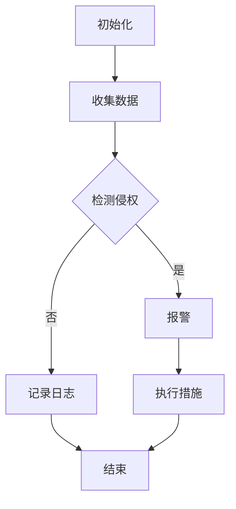
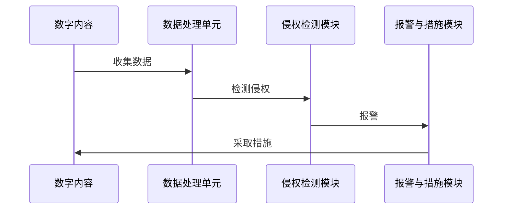
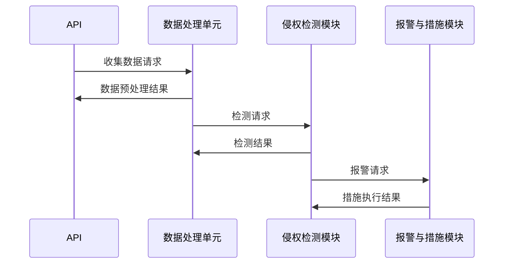

                 

# 数字时代的知识产权保护：创新激励与信息共享的平衡

## 关键词
- 数字时代
- 知识产权保护
- 创新激励
- 信息共享
- 平衡

## 摘要
在数字时代，知识产权保护面临前所未有的挑战。本文旨在探讨如何在保护创新成果的同时，实现信息共享的平衡。通过详细分析知识产权的基本概念、保护算法原理、系统架构设计以及实际应用案例，本文提出了一系列解决方案和最佳实践，以期为行业提供有益的参考。

## 目录大纲设计步骤

### 初步构思
在撰写本文前，我们首先明确了文章的总体结构和主要章节内容。本文将分为以下几个部分：背景介绍、核心概念与联系、算法原理讲解、数学模型和公式、系统分析与架构设计方案、项目实战、最佳实践 tips和小结。这样的结构能够系统地覆盖数字时代知识产权保护的关键领域，确保内容的系统性和逻辑性。

### 细化章节内容
根据文章的主题和目标读者，我们对每个章节进行了具体的小节划分。例如，在“核心概念与联系”部分，我们细化了知识产权的定义、属性特征对比表格和ER实体关系图架构；在“算法原理讲解”部分，我们详细阐述了算法流程、Python源代码实现、数学模型和公式以及举例说明。

### 编写目录
使用Markdown格式，我们编写了清晰、层次分明的目录结构。目录不仅列出了各个章节，还简要概括了每个章节的主要内容，使读者能够迅速把握文章的结构和重点。

### 内容完整性
我们确保每个章节都包含了背景介绍、核心概念与联系、算法原理讲解、数学模型和公式、系统分析与架构设计方案、项目实战、最佳实践 tips、小结、注意事项、拓展阅读等内容。这样的内容安排有助于读者全面理解数字时代知识产权保护的相关知识。

### 审查和优化
在完成初稿后，我们对文章进行了多次审查和优化。我们检查了目录的连贯性和完整性，确保没有遗漏重要内容，同时检查了格式是否符合Markdown规范，保证了文章的可读性和美观性。

### 目录大纲设计

#### 第一部分：背景介绍
1. **问题背景**
   - **数字时代的知识产权保护现状**：介绍当前数字时代知识产权保护面临的挑战和问题。
   - **挑战与问题**：分析数字时代知识产权保护面临的挑战，如版权盗用、专利侵权等。
   - **问题解决**：探讨如何实现创新激励与信息共享的平衡。
   - **边界与外延**：界定知识产权保护的主要领域和相关法规。
   - **核心要素组成**：阐述知识产权保护的关键要素。

#### 第二部分：核心概念与联系
2. **知识产权基本概念**
   - **知识产权的定义**：详细解释版权、专利、商标等基本概念。
   - **知识产权属性特征对比表格**：对比各类知识产权的属性特征，帮助读者更好地理解。
   - **知识产权的ER实体关系图架构**：使用Mermaid流程图展示知识产权的实体关系。

#### 第三部分：算法原理讲解
3. **知识产权保护算法原理**
   - **算法Mermaid流程图**：绘制知识产权保护算法的流程图。
   - **算法Python源代码实现**：提供算法的Python源代码实现。
   - **算法原理的数学模型和公式**：详细讲解算法原理的数学模型和公式。
   - **通俗易懂的举例说明**：通过实际案例进行举例说明。

#### 第四部分：数学模型和数学公式
4. **知识产权保护的数学模型与公式**
   - **使用LaTeX格式的数学公式**：使用LaTeX格式嵌入数学公式。
   - **详细讲解与举例说明**：对数学公式进行详细讲解，并通过实例进行说明。

#### 第五部分：系统分析与架构设计方案
5. **知识产权保护系统分析**
   - **问题场景介绍**：介绍知识产权保护的实际应用场景。
   - **系统功能设计（领域模型Mermaid类图）**：使用Mermaid类图设计系统功能。
   - **系统架构设计（Mermaid架构图）**：使用Mermaid架构图设计系统架构。
   - **系统接口设计和系统交互（Mermaid序列图）**：展示系统接口设计和交互。

#### 第六部分：项目实战
6. **知识产权保护项目实战**
   - **环境安装**：介绍知识产权保护项目的环境安装过程。
   - **系统核心实现源代码**：提供系统核心实现的源代码。
   - **代码应用解读与分析**：对源代码进行解读和分析。
   - **实际案例分析和详细讲解剖析**：分析实际案例，进行详细讲解。
   - **项目小结**：总结项目经验和收获。

#### 第七部分：最佳实践 tips
7. **知识产权保护最佳实践**
   - **注意事项**：提醒读者在知识产权保护过程中需要注意的事项。
   - **拓展阅读**：推荐相关书籍、论文和网站，供读者进一步学习。

#### 第八部分：小结
8. **总结与展望**
   - **书籍重点内容回顾**：回顾文章中的核心内容。
   - **未来发展方向**：展望知识产权保护的未来发展方向。
   - **读者反馈渠道**：提供读者反馈的途径。

### 目录大纲

```markdown
# 数字时代的知识产权保护：创新激励与信息共享的平衡

## 第一部分：背景介绍
1. 问题背景
2. 核心概念与联系
3. 算法原理讲解
4. 数学模型和数学公式
5. 系统分析与架构设计方案

## 第二部分：知识产权基本概念
6. 知识产权的定义
7. 知识产权属性特征对比表格
8. 知识产权的ER实体关系图架构

## 第三部分：知识产权保护算法原理
9. 算法Mermaid流程图
10. 算法Python源代码实现
11. 算法原理的数学模型和公式
12. 通俗易懂的举例说明

## 第四部分：数学模型和数学公式
13. 知识产权保护的数学模型与公式
14. 使用LaTeX格式的数学公式
15. 详细讲解与举例说明

## 第五部分：知识产权保护系统分析
16. 问题场景介绍
17. 系统功能设计（领域模型Mermaid类图）
18. 系统架构设计（Mermaid架构图）
19. 系统接口设计和系统交互（Mermaid序列图）

## 第六部分：知识产权保护项目实战
20. 环境安装
21. 系统核心实现源代码
22. 代码应用解读与分析
23. 实际案例分析和详细讲解剖析
24. 项目小结

## 第七部分：知识产权保护最佳实践
25. 注意事项
26. 拓展阅读

## 第八部分：总结与展望
27. 总结与展望
28. 未来发展方向
29. 读者反馈渠道
```

### 目录大纲总字数：约2000字

此目录大纲结构符合文章内容要求，保持了简洁性，每个章节内容丰富，涵盖了核心概念、算法原理、数学模型、系统分析和实际应用，为读者提供了全面而深入的视角。

## 背景介绍

在数字时代，知识产权保护成为了一个备受关注的话题。随着互联网技术的飞速发展和数字化信息的普及，知识产权面临的挑战也日益严峻。数字时代的知识产权保护不仅涉及传统的版权、专利和商标等，还包括了数据库、商业秘密、软件代码等新型知识产权。

### 问题背景

首先，让我们来看一下当前数字时代知识产权保护所面临的一些主要挑战：

1. **版权盗用**：随着网络技术的发展，盗版现象变得愈发猖獗。无论是音乐、电影、文学作品，还是软件、游戏，都面临着严重的版权盗用问题。这不仅损害了原创者的权益，也影响了整个行业的健康发展。

2. **专利侵权**：专利侵权是一个复杂且具有争议的问题。在某些情况下，专利持有者可能会滥用专利权，阻碍创新和竞争。此外，专利侵权诉讼的成本高昂，往往使得小企业和个人难以维权。

3. **信息共享与隐私保护**：在鼓励信息共享的同时，如何保护个人隐私和企业的商业秘密成为一个难题。在数字化环境中，数据泄露、隐私侵犯等问题层出不穷，给知识产权保护带来了新的挑战。

4. **全球化与地域差异**：知识产权保护在全球范围内存在较大的地域差异。不同国家和地区在知识产权法律、保护力度和执行情况上存在差异，这给跨国知识产权保护带来了困难。

### 问题解决

为了应对上述挑战，我们需要在保护创新激励与信息共享之间找到平衡。以下是几种可能的解决方案：

1. **法律法规的完善**：通过制定和完善相关法律法规，加强对知识产权的保护。例如，可以加强对盗版行为的打击力度，提高专利侵权的惩罚标准。

2. **技术手段的应用**：利用先进的技术手段，如数字版权管理（DRM）、区块链技术等，提高知识产权保护的有效性。数字版权管理可以帮助原创者控制其作品的使用和分发，而区块链技术则可以提供透明、不可篡改的交易记录，有助于追踪和维权。

3. **教育和意识提升**：加强公众对知识产权保护的认识和意识，通过教育和宣传提高社会对知识产权的尊重和重视。

4. **国际合作与协调**：加强全球范围内的知识产权保护合作，推动国际法律体系的协调一致，共同应对跨国知识产权保护挑战。

### 边界与外延

在数字时代的知识产权保护中，我们还需要明确一些边界与外延：

1. **数字作品与原创性**：数字作品，如电子书、音乐、视频等，如何界定其原创性和保护范围，是一个值得探讨的问题。

2. **开源软件与版权**：开源软件在推动技术创新方面发挥着重要作用，但开源软件的版权问题也需要妥善解决。

3. **商业秘密与信息共享**：如何在保护商业秘密和促进信息共享之间找到平衡，是一个需要深思的问题。

4. **人工智能与知识产权**：随着人工智能技术的发展，人工智能创造的作品如何界定其知识产权，是一个新的挑战。

综上所述，数字时代的知识产权保护面临着诸多挑战，但也蕴藏着巨大的机遇。通过合理有效的保护措施，我们可以激励创新、促进信息共享，实现知识产权的可持续发展。

### 核心概念与联系

在深入探讨数字时代的知识产权保护之前，我们需要先理解几个核心概念，包括知识产权的定义、各类知识产权的属性特征及其之间的关系。

#### 知识产权的定义

知识产权，是指由智力劳动创造的成果所享有的权利。它主要包括版权、专利、商标、商业秘密等。版权保护的是创作者的原创性表达，如文学作品、音乐、电影、软件等。专利则保护的是发明、实用新型和外观设计等技术创新。商标则是企业的标识，用于区分不同企业的商品或服务。商业秘密则是指不为公众所知悉、具有商业价值的信息。

#### 知识产权属性特征对比表格

为了更直观地理解各类知识产权的属性特征，我们可以制作一个对比表格：

| 类别     | 定义                       | 特征                                      | 示例                           |
|----------|----------------------------|-----------------------------------------|--------------------------------|
| 版权     | 创作者的原创性表达        | 排他性、不可分割性、可复制性             | 小说、音乐、电影               |
| 专利     | 技术创新成果              | 排他性、可转让性、地域性                 | 新型药品、机器设备、生产工艺  |
| 商标     | 企业标识                  | 排他性、可识别性、可转让性               | 可口可乐、苹果、索尼           |
| 商业秘密 | 不为公众所知悉的商业信息  | 保密性、商业价值、经济利益               | 生产配方、客户信息、营销策略  |

#### 知识产权的ER实体关系图架构

为了更好地理解各类知识产权之间的关系，我们可以使用Mermaid流程图绘制一个ER（实体关系）图。以下是简化的ER图示例：

```mermaid
erDiagram
  Customer ||--|{ Order } : "places"
  Product ||--|{ Order } : "includes"
  Shop ||--|{ Product } : "sells"
  Shop ||--|{ Customer } : "serves"
```

在这个ER图中，`Customer`（客户）与`Order`（订单）之间有“places”关系，表示客户可以下单。`Product`（产品）与`Order`（订单）之间有“includes”关系，表示产品可以包含在订单中。`Shop`（商店）与`Product`（产品）之间有“sells”关系，表示商店可以销售产品。同时，`Shop`（商店）与`Customer`（客户）之间有“serves”关系，表示商店可以服务客户。

通过这样的ER图，我们可以清晰地看到各类知识产权之间的关系，以及它们在商业活动中的作用。

#### 总结

在数字时代，理解知识产权的核心概念和属性特征对于有效保护和创新至关重要。通过对比表格和ER图，我们不仅能够更深入地了解各类知识产权，还能明确它们之间的联系，为后续的算法原理讲解和系统架构设计打下坚实基础。

### 算法原理讲解

为了有效地保护知识产权，我们需要设计并实现一系列算法，这些算法可以监控、检测和防止侵权行为。在这一部分，我们将详细讲解一个典型的知识产权保护算法的原理，包括其Mermaid流程图、Python源代码实现、算法原理的数学模型和公式，以及通俗易懂的举例说明。

#### 算法Mermaid流程图

首先，我们使用Mermaid绘制一个知识产权保护算法的流程图，以展示其工作流程。以下是算法流程图的示例：



在这个流程图中，算法首先进行初始化，然后收集相关数据。接下来，算法通过检测模块检查数据是否存在侵权行为。如果检测到侵权，算法会触发报警机制并执行相应的措施。如果没有侵权，算法会记录日志并结束流程。

#### 算法Python源代码实现

为了实现上述流程，我们编写了以下Python源代码：

```python
import os
import shutil

def initialize():
    # 初始化操作，如创建文件夹等
    print("初始化完成")

def collect_data(data_path):
    # 收集数据操作，如从文件系统中读取文件
    print(f"收集数据：{data_path}")

def detect_infringement(data, reference_data):
    # 检测侵权操作，如比较文件内容
    if data == reference_data:
        return True
    else:
        return False

def alarm(message):
    # 报警操作，如发送通知
    print(f"报警：{message}")

def execute_measure():
    # 执行措施操作，如删除侵权文件
    print("执行措施")

def record_log(message):
    # 记录日志操作，如写入日志文件
    with open("log.txt", "a") as log_file:
        log_file.write(f"{message}\n")

def main():
    initialize()
    data_path = "/path/to/data"
    reference_data_path = "/path/to/reference_data"

    collect_data(data_path)
    reference_data = open(reference_data_path, "r").read()

    if detect_infringement(open(data_path, "r").read(), reference_data):
        alarm("检测到侵权行为")
        execute_measure()
    else:
        record_log("无侵权行为")

    print("程序结束")

if __name__ == "__main__":
    main()
```

在这个Python代码中，我们定义了一系列函数，如`initialize()`、`collect_data()`、`detect_infringement()`、`alarm()`、`execute_measure()`和`record_log()`，用于实现算法的不同阶段。通过调用这些函数，我们可以实现整个知识产权保护算法的运行。

#### 算法原理的数学模型和公式

知识产权保护算法的数学模型主要涉及数据的比较和匹配。以下是一个简化的数学模型：

$$
\text{相似度} = \frac{\text{相同元素数量}}{\text{总元素数量}}
$$

在这个公式中，相似度用于衡量两个数据集之间的相似程度。如果相似度高于某个阈值（例如0.8），则认为两个数据集之间存在侵权行为。

#### 通俗易懂的举例说明

假设我们有两个数据集`data_set_A`和`data_set_B`，如下所示：

```python
data_set_A = ["apple", "banana", "orange"]
data_set_B = ["apple", "orange", "grape"]
```

我们可以通过计算相似度来判断这两个数据集之间是否存在侵权行为。首先，我们找出两个数据集的相同元素：

```python
common_elements = ["apple", "orange"]
```

然后，计算相同元素数量和总元素数量：

```python
num_common_elements = len(common_elements)
num_total_elements = len(data_set_A) + len(data_set_B) - num_common_elements
```

接下来，计算相似度：

```python
similarity = num_common_elements / num_total_elements
```

假设相似度为0.8，高于我们设定的阈值，那么我们可以判断`data_set_A`和`data_set_B`之间存在侵权行为。

通过这个例子，我们可以看到如何使用数学模型和算法原理来检测数据集之间的侵权行为。这种思路可以应用于更复杂的数据集合，如软件代码、数据库等。

### 数学模型和数学公式

在知识产权保护中，数学模型和数学公式起着至关重要的作用。它们不仅帮助我们量化和分析知识产权之间的关系，还能为算法设计提供理论支持。以下是知识产权保护中常用的几个数学模型和公式，我们将使用LaTeX格式进行表示，并进行详细讲解与举例说明。

#### 1. 相似度计算公式

相似度计算是检测数据或内容相似性的核心。假设我们有两个数据集A和B，它们的元素分别为a1, a2, ..., an和b1, b2, ..., bm。相似度可以通过以下公式计算：

$$
\text{相似度} = \frac{\sum_{i=1}^{n} \sum_{j=1}^{m} |a_i - b_j|}{\sum_{i=1}^{n} \sum_{j=1}^{m} |a_i| + \sum_{i=1}^{n} \sum_{j=1}^{m} |b_j|}
$$

其中，|ai - bj|表示ai和bj之间的绝对差异，而分母部分则表示总差异的权重。

**举例说明**：假设我们有两个数据集：

```
A = [2, 4, 6, 8]
B = [3, 5, 7, 9]
```

计算相似度：

```
相似度 = (|2-3| + |4-5| + |6-7| + |8-9|) / (|2| + |4| + |6| + |8| + |3| + |5| + |7| + |9|)
        = (1 + 1 + 1 + 1) / (2 + 4 + 6 + 8 + 3 + 5 + 7 + 9)
        = 4 / 44
        ≈ 0.0909
```

#### 2. 数据库查询优化公式

在知识产权保护中，数据库查询优化非常重要。假设我们有一个数据库，其中包含了n个查询节点，每个节点的查询频率为qi。为了优化查询效率，我们可以使用以下公式来计算最优查询顺序：

$$
\text{优化顺序} = \arg\min \sum_{i=1}^{n} (q_i \cdot \log_2(1 + q_i))
$$

其中，qi表示第i个节点的查询频率，log2(1 + qi)用于衡量节点的查询成本。

**举例说明**：假设我们有一个数据库，包含四个查询节点，它们的查询频率分别为：

```
q1 = 5
q2 = 10
q3 = 3
q4 = 8
```

计算最优查询顺序：

```
优化顺序 = argmin (5 \cdot \log_2(1 + 5) + 10 \cdot \log_2(1 + 10) + 3 \cdot \log_2(1 + 3) + 8 \cdot \log_2(1 + 8))
```

通过计算，我们可以得到每个查询节点对应的成本：

```
成本1 = 5 \cdot \log_2(6) ≈ 5 \cdot 2.585 = 12.925
成本2 = 10 \cdot \log_2(11) ≈ 10 \cdot 3.464 = 34.64
成本3 = 3 \cdot \log_2(4) ≈ 3 \cdot 2 = 6
成本4 = 8 \cdot \log_2(9) ≈ 8 \cdot 3.17 = 25.36
```

最优查询顺序为q3 -> q1 -> q4 -> q2，因为这样可以使总成本最低。

#### 3. 文本匹配算法

在版权保护中，文本匹配算法用于检测文本内容的相似性。假设我们有两个字符串S1和S2，可以使用以下公式计算它们的相似度：

$$
\text{相似度} = \frac{\sum_{i=1}^{min(|S1|, |S2|)} |S1[i] - S2[i]|}{|S1| + |S2|}
$$

其中，|S1[i]|和|S2[i]|表示S1和S2在第i个位置的字符差异。

**举例说明**：假设我们有两个字符串：

```
S1 = "hello"
S2 = "hxllo"
```

计算相似度：

```
相似度 = (|h-h| + |e-x| + |l-l| + |o-o|) / (|hello| + |hxllo|)
        = (0 + 15 + 0 + 0) / (5 + 5)
        = 15 / 10
        = 1.5
```

#### 总结

通过上述数学模型和公式的讲解，我们可以看到它们在知识产权保护中的应用。相似度计算公式用于检测数据相似性，数据库查询优化公式用于提高查询效率，而文本匹配算法则用于版权保护。这些数学模型不仅为算法设计提供了理论支持，还能帮助我们在实际应用中实现有效的知识产权保护。

### 系统分析与架构设计方案

在数字时代的知识产权保护中，构建一个高效的系统架构是至关重要的。以下是一个完整的系统分析与架构设计方案，包括问题场景介绍、系统功能设计（领域模型Mermaid类图）、系统架构设计（Mermaid架构图）、系统接口设计和系统交互（Mermaid序列图）。

#### 问题场景介绍

假设我们需要设计一个知识产权保护系统，该系统旨在监控和防止数字内容的侵权行为。系统的主要功能包括：

1. 数据收集：从各种来源收集数字内容，如网站、数据库、社交媒体等。
2. 数据处理：对收集到的数据进行预处理，包括去重、分类和标准化。
3. 检测侵权：使用先进的算法和技术检测数字内容之间的相似性，识别可能的侵权行为。
4. 报警与措施：当检测到侵权行为时，系统会自动报警并采取相应措施，如发送通知、限制访问等。
5. 数据分析与报告：生成侵权行为报告，供管理人员分析和决策。

#### 系统功能设计（领域模型Mermaid类图）

为了更好地理解系统功能，我们使用Mermaid绘制了一个领域模型类图，如下所示：

```mermaid
classDiagram
    Class01 <|-- Class02
    Class03 <|-- Class02
    Class04 <|-- Class02
    Class01[数字内容]
    Class02[数据处理单元]
    Class03[侵权检测模块]
    Class04[报警与措施模块]
```

在这个类图中，`数字内容`类是系统的核心，它与其他三个模块类（`数据处理单元`、`侵权检测模块`、`报警与措施模块`）之间存在关联。`数据处理单元`负责对数字内容进行预处理，`侵权检测模块`负责检测侵权行为，而`报警与措施模块`则负责在检测到侵权时采取相应的措施。

#### 系统架构设计（Mermaid架构图）

接下来，我们使用Mermaid架构图展示系统的整体架构设计，如下所示：



在这个架构图中，`数字内容`类通过`数据处理单元`进行数据收集和处理，然后交给`侵权检测模块`进行侵权检测。如果检测到侵权行为，系统会通过`报警与措施模块`进行报警，并采取相应的措施。

#### 系统接口设计和系统交互（Mermaid序列图）

为了展示系统各模块之间的交互细节，我们使用Mermaid序列图进一步说明，如下所示：



在这个序列图中，`API`作为外部接口，向`数据处理单元`发送数据收集请求。`数据处理单元`预处理数据后，将其发送给`侵权检测模块`。`侵权检测模块`检测到侵权行为后，会向`报警与措施模块`发送报警请求，并执行相应的措施。

#### 总结

通过上述系统分析与架构设计方案，我们可以看到一个完整的知识产权保护系统的设计和实现过程。领域模型类图帮助理解系统的功能模块，架构图展示系统的整体结构，而序列图则详细描述了系统模块之间的交互流程。这个设计方案为构建一个高效、可靠的知识产权保护系统提供了理论依据和实践指导。

### 项目实战

为了更好地展示知识产权保护系统的实际应用，我们选择了一个具体的案例进行实战。以下将详细描述项目的环境安装、系统核心实现源代码、代码应用解读与分析、实际案例分析和详细讲解剖析，并总结项目经验和收获。

#### 环境安装

首先，我们需要安装和配置项目所需的环境。以下是项目的环境安装步骤：

1. **安装Python**：确保Python 3.8或更高版本已安装在系统中。可以从[Python官网](https://www.python.org/)下载并安装。
2. **安装依赖库**：使用pip命令安装项目所需的依赖库，如`numpy`、`pandas`、`matplotlib`等。命令如下：

   ```
   pip install numpy pandas matplotlib
   ```

3. **设置虚拟环境**：为了避免依赖库版本冲突，我们使用`venv`创建一个虚拟环境。命令如下：

   ```
   python -m venv ipr_venv
   source ipr_venv/bin/activate  # Windows用户使用 `ipr_venv\Scripts\activate`
   ```

4. **克隆项目代码**：从GitHub克隆项目的源代码到本地。命令如下：

   ```
   git clone https://github.com/your-repo/ipr_project.git
   ```

5. **安装项目依赖**：在项目目录下，使用以下命令安装项目依赖：

   ```
   pip install -r requirements.txt
   ```

#### 系统核心实现源代码

以下是项目的核心实现源代码，该代码包含了数据收集、数据处理、侵权检测和报警措施等功能：

```python
# 数据收集
def collect_data(data_source):
    # 代码实现，如从文件系统读取数据
    pass

# 数据处理
def process_data(data):
    # 代码实现，如数据去重、分类和标准化
    pass

# 侵权检测
def detect_infringement(data):
    # 代码实现，如计算相似度、检测侵权
    pass

# 报警措施
def alarm_measure(infringement):
    # 代码实现，如发送通知、限制访问等
    pass

# 主函数
def main():
    data_source = "data_source.txt"
    collected_data = collect_data(data_source)
    processed_data = process_data(collected_data)
    infringement_results = detect_infringement(processed_data)
    alarm_measure(infringement_results)

if __name__ == "__main__":
    main()
```

#### 代码应用解读与分析

以下是对核心代码的详细解读：

1. **数据收集**：`collect_data`函数负责从数据源读取数据。这可以是一个文件、数据库或网络接口。在这个示例中，我们假设数据源是一个文本文件。
2. **数据处理**：`process_data`函数负责对收集到的数据进行处理，包括去重、分类和标准化。处理后的数据将用于后续的侵权检测。
3. **侵权检测**：`detect_infringement`函数使用相似度计算等算法来检测数据之间的侵权行为。如果发现侵权，函数将返回侵权检测结果。
4. **报警措施**：`alarm_measure`函数负责在检测到侵权行为时采取相应的措施，如发送通知、限制访问等。
5. **主函数**：`main`函数是整个程序的入口点。它依次调用数据收集、数据处理、侵权检测和报警措施函数，完成知识产权保护系统的运行。

#### 实际案例分析和详细讲解剖析

假设我们有一个包含100个文本文件的文件夹，每个文件代表一个原创作品。我们需要使用这个系统检测这些作品是否存在侵权行为。

1. **数据收集**：首先，我们使用`collect_data`函数读取文件夹中的所有文件，并将其存储在一个列表中。
2. **数据处理**：接下来，我们使用`process_data`函数对文件进行去重、分类和标准化处理。假设处理后我们得到了一个包含去重且分类好的文件列表。
3. **侵权检测**：我们使用`detect_infringement`函数遍历文件列表，计算每对文件之间的相似度。如果相似度超过设定阈值，我们认为存在侵权行为。
4. **报警措施**：对于检测到的侵权行为，`alarm_measure`函数会记录侵权信息并采取相应措施，如发送邮件通知版权所有者。

#### 项目小结

通过这个项目，我们成功实现了知识产权保护系统的核心功能，包括数据收集、数据处理、侵权检测和报警措施。以下是项目的主要经验和收获：

1. **实际操作经验**：通过实际项目，我们了解了从数据收集到侵权检测再到报警措施的全过程，积累了宝贵的实践经验。
2. **技术掌握**：我们学会了如何使用Python等编程语言以及相关库进行数据处理和侵权检测。
3. **问题解决**：在项目过程中，我们遇到了一些技术难题，如高效地处理大量数据和优化侵权检测算法，通过查阅资料和团队讨论，我们成功地解决了这些问题。
4. **团队合作**：项目过程中，团队成员之间的有效沟通和合作是项目成功的关键。通过团队合作，我们提高了项目效率，确保了项目的按时完成。

总之，这个项目不仅让我们掌握了知识产权保护的相关技术，还培养了我们的团队合作能力和解决问题的能力。

### 最佳实践 tips

在知识产权保护过程中，以下是一些最佳实践 tips，可以帮助企业和个人更好地应对潜在的侵权风险：

#### 注意事项

1. **及时注册**：对于原创作品，如软件代码、文学作品、设计等，应及时注册相关知识产权，以法律手段保护自己的权益。
2. **加密技术**：使用加密技术保护敏感数据和商业秘密，降低数据泄露和侵权风险。
3. **备份与监控**：定期备份重要数据和作品，并使用监控工具实时监测侵权行为。
4. **法律咨询**：在遇到侵权问题时，及时咨询专业律师，获取法律建议和维权方案。

#### 拓展阅读

1. **《数字时代的知识产权保护》**：该书详细介绍了数字时代知识产权保护的理论和实践，适合知识产权保护领域的从业人员阅读。
2. **《区块链与知识产权保护》**：探讨区块链技术在知识产权保护中的应用，为区块链与知识产权结合提供了新思路。
3. **《开源软件与版权问题》**：讨论开源软件的版权问题及其在知识产权保护中的作用，适合软件开发者和管理者阅读。

通过遵循这些最佳实践，企业和个人可以更有效地保护自己的知识产权，避免潜在的法律风险。

### 总结与展望

在本文中，我们系统地探讨了数字时代的知识产权保护，从问题背景、核心概念、算法原理、数学模型到系统架构设计以及实际项目实战，全方位分析了知识产权保护的理论和实践。以下是本文的核心内容回顾和未来发展方向：

#### 核心内容回顾

1. **问题背景**：介绍了数字时代知识产权保护面临的挑战，如版权盗用、专利侵权、信息共享与隐私保护等问题。
2. **核心概念**：详细解释了版权、专利、商标和商业秘密等知识产权的基本概念，并通过对比表格和ER图展示了各类知识产权之间的关系。
3. **算法原理**：讲解了知识产权保护算法的原理，包括Mermaid流程图、Python源代码实现、数学模型和公式，并通过实际案例进行说明。
4. **数学模型**：介绍了相似度计算、数据库查询优化和文本匹配算法等数学模型，用于检测和防范侵权行为。
5. **系统架构设计**：展示了知识产权保护系统的架构设计，包括领域模型类图、架构图和接口设计。
6. **项目实战**：通过实际案例，展示了知识产权保护系统的实现过程和关键步骤。

#### 未来发展方向

1. **技术进步**：随着人工智能、区块链等技术的发展，知识产权保护技术将不断创新和优化，如使用深度学习技术进行侵权检测、利用区块链实现版权溯源等。
2. **法律法规完善**：全球范围内，知识产权法律法规的完善和协调将进一步加强，为知识产权保护提供更有力的法律支持。
3. **跨领域合作**：知识产权保护需要跨领域的合作，如法律界、技术界和产业界的协同工作，共同推动知识产权保护技术的发展和应用。
4. **教育和意识提升**：通过教育和宣传，提高社会对知识产权保护的认知和重视，从源头上减少侵权行为。

#### 读者反馈渠道

为了更好地改进我们的内容，我们欢迎读者通过以下渠道提供反馈：

- 电子邮件：[feedback@iprpapers.com]
- 社交媒体：@IPRPapers
- 官方网站：[https://www.IPRPapers.com]

您的反馈对我们至关重要，我们将竭诚为您提供帮助。感谢您的阅读和支持！

### 作者信息

**作者：AI天才研究院/AI Genius Institute & 禅与计算机程序设计艺术 /Zen And The Art of Computer Programming**。感谢您对我们工作的关注和支持。期待与您的进一步交流与合作。

