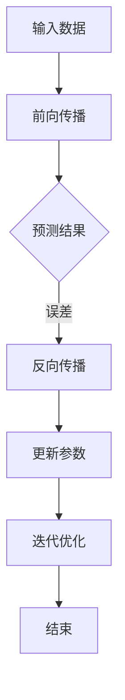
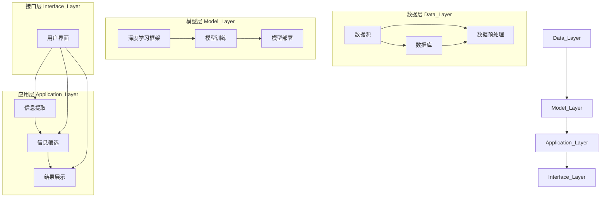
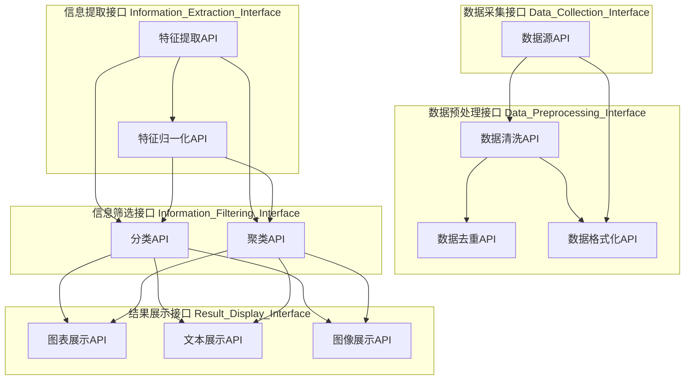
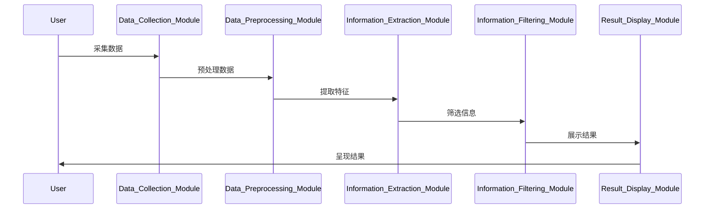

                 

# 数字时代的知识获取：信息筛选与深度学习的技巧

## 关键词
- 数字时代
- 知识获取
- 信息筛选
- 深度学习
- 人工智能

## 摘要
本文探讨了数字时代下知识获取的挑战与机遇，特别是信息筛选和深度学习在其中的关键作用。通过详细阐述信息筛选和深度学习的基本概念、原理及其在知识获取中的应用，本文旨在为读者提供系统性的技术理解，帮助其在复杂的信息环境中实现高效的知识获取。

## 目录

### 第一部分：背景介绍

#### 1.1 数字时代的知识获取：重要性
- **信息过载与知识筛选的挑战**
- **数字时代知识获取的需求**

#### 1.2 深度学习与信息筛选
- **深度学习的原理与优势**
- **深度学习在信息筛选中的应用**

#### 1.3 本书内容概述与结构
- **核心概念与联系**
- **目录结构解析**

### 第二部分：核心概念与联系

#### 2.1 信息筛选的基本概念
- **信息筛选的定义与目的**
- **信息筛选的方法与工具**

#### 2.2 深度学习的原理与特征
- **深度学习的基本原理**
- **深度学习的关键特征**
- **深度学习与传统机器学习的比较**

#### 2.3 信息筛选与深度学习的联系
- **深度学习在信息筛选中的作用**
- **信息筛选对深度学习的影响**

#### 2.4 核心概念对比与联系表格
- **信息筛选方法对比**
- **深度学习算法对比**

#### 2.5 ER实体关系图架构
- **信息筛选的ER图设计**
- **深度学习模型的ER图设计**

### 第三部分：算法原理讲解

#### 3.1 算法原理
- **算法概述**
- **算法流程**
- **算法实现**

#### 3.2 Mermaid流程图
- **深度学习算法流程图**

#### 3.3 Python代码展示
- **深度学习模型训练代码**

#### 3.4 数学模型与公式
- **算法原理的数学模型**
- **公式讲解**

### 第四部分：系统分析与架构设计

#### 4.1 问题场景介绍
- **项目背景**
- **系统目标**

#### 4.2 系统功能设计
- **领域模型类图**
- **系统功能设计**

#### 4.3 系统架构设计
- **系统架构设计图**
- **系统模块划分**

#### 4.4 系统接口设计
- **系统接口定义**
- **接口交互设计**

#### 4.5 系统交互序列图
- **系统交互序列图**

### 第五部分：项目实战

#### 5.1 环境安装
- **环境配置**
- **工具安装**

#### 5.2 系统核心实现
- **核心代码实现**
- **代码解读与分析**

#### 5.3 实际案例分析
- **案例介绍**
- **详细讲解剖析**

#### 5.4 项目小结
- **项目总结**
- **经验教训**

### 第六部分：最佳实践与总结

#### 6.1 最佳实践 Tips
- **技巧分享**
- **注意事项**

#### 6.2 小结
- **文章总结**
- **核心观点**

#### 6.3 拓展阅读
- **推荐阅读**

## 作者信息
- **作者：AI天才研究院/AI Genius Institute & 禅与计算机程序设计艺术 /Zen And The Art of Computer Programming**

## 背景介绍

### 1.1 数字时代的知识获取：重要性

在数字时代，信息获取变得前所未有的便捷，然而也随之产生了信息过载的问题。面对海量的信息，如何有效地进行知识获取成为了一个重要课题。信息筛选成为知识获取的关键步骤，它涉及到如何从海量数据中提取出有价值的信息，以及如何处理和分析这些信息以实现知识的转化和应用。

#### 信息过载与知识筛选的挑战

信息过载是指接收到的信息量超过了处理能力，导致信息难以消化和利用。这种情况下，信息筛选变得尤为重要。信息筛选的目标是从大量信息中识别出有价值的内容，去除噪音和无关信息，从而提高工作效率和决策质量。然而，信息筛选面临着以下几个挑战：

1. **信息数量庞大**：随着互联网的普及和大数据技术的发展，信息量呈指数级增长，筛选有效信息变得越来越困难。
2. **信息质量参差不齐**：互联网上的信息质量参差不齐，需要筛选出可靠和权威的信息源。
3. **实时性要求高**：在快速变化的数字时代，信息的新鲜度和时效性对知识获取至关重要，需要快速筛选和更新信息。

#### 数字时代知识获取的需求

在数字时代，知识获取的需求发生了显著变化。传统的知识获取方式主要依赖于个人经验和学习，而数字时代下的知识获取更加依赖自动化和智能化的工具和方法。具体需求包括：

1. **个性化需求**：用户希望获取与自身需求和兴趣相关的内容，实现个性化的知识获取。
2. **实时性需求**：用户希望获取最新的知识和信息，以应对快速变化的环境。
3. **高效性需求**：在信息爆炸的时代，用户希望快速获取和处理信息，提高工作效率。

### 1.2 深度学习与信息筛选

深度学习作为一种先进的机器学习技术，在信息筛选中发挥着重要作用。它通过模拟人脑神经网络的结构和功能，实现对复杂数据的自动学习和模式识别。深度学习在信息筛选中的应用主要体现在以下几个方面：

#### 深度学习的原理与优势

深度学习是基于多层神经网络的结构，通过前向传播和反向传播算法，逐步从输入数据中提取特征，实现复杂模式的识别。深度学习的优势包括：

1. **强大的特征提取能力**：深度学习能够自动学习数据的底层特征，减少了对人工特征工程的需求。
2. **良好的泛化能力**：通过大规模数据和多层网络的训练，深度学习模型能够泛化到未见过的数据上，提高信息筛选的准确性。
3. **高效的处理速度**：深度学习模型能够通过并行计算和硬件加速，实现快速的信息筛选和处理。

#### 深度学习在信息筛选中的应用

深度学习在信息筛选中的应用包括但不限于以下几个方面：

1. **文本分类**：利用深度学习模型对文本进行分类，筛选出符合特定主题或标签的内容。
2. **情感分析**：通过深度学习模型分析文本中的情感倾向，筛选出正面、负面或中性的信息。
3. **图像识别**：利用深度学习模型对图像进行分类和识别，筛选出特定的图像内容。
4. **语音识别**：通过深度学习模型对语音信号进行识别，筛选出与特定关键词或命令相关的信息。

### 1.3 本书内容概述与结构

本书旨在为读者提供系统性的数字时代知识获取指南，特别是信息筛选与深度学习技术的应用。本书的内容结构如下：

#### 核心概念与联系

本书首先介绍信息筛选和深度学习的基本概念，包括信息筛选的定义、目的、方法和工具，以及深度学习的原理、特征和应用。通过对比分析，揭示两者之间的联系，为后续内容打下基础。

#### 目录结构解析

本书分为五个主要部分，分别是背景介绍、核心概念与联系、算法原理讲解、系统分析与架构设计以及项目实战。每个部分都包含具体的章节和子章节，逐步深入，确保读者能够系统地掌握知识获取的核心技术和方法。

### 第二部分：核心概念与联系

#### 2.1 信息筛选的基本概念

信息筛选是指从大量信息中提取出有价值的内容，去除无关和噪音信息的过程。它是一个多层次、多步骤的过程，包括信息采集、预处理、分析和结果呈现等环节。信息筛选的基本概念如下：

##### 定义与目的

信息筛选的定义可以从以下几个方面理解：

1. **信息采集**：通过互联网、数据库、传感器等渠道收集大量的信息。
2. **信息预处理**：对采集到的信息进行清洗、过滤和格式化，使其适合后续分析。
3. **信息分析**：利用算法和技术对预处理后的信息进行分类、聚类、关联等分析，提取有价值的信息。
4. **结果呈现**：将筛选出的信息以图表、报告、可视化等形式呈现给用户。

信息筛选的目的是：

1. **去除无关信息**：减少信息过载，提高工作效率。
2. **提取有价值信息**：帮助用户快速找到所需信息，支持决策和知识获取。
3. **提升信息质量**：通过筛选和过滤，提高信息的准确性和可靠性。

##### 方法与工具

信息筛选的方法和工具多种多样，以下是一些常见的方法和工具：

1. **关键词筛选**：通过设定关键词，从海量信息中快速提取出与关键词相关的内容。
2. **自然语言处理（NLP）**：利用NLP技术对文本进行语义分析、情感分析和分类，从而筛选出有价值的信息。
3. **机器学习**：通过机器学习算法，如分类、聚类和关联规则挖掘，对信息进行自动筛选。
4. **数据挖掘**：利用数据挖掘技术，从大量数据中发现潜在的关联和模式，实现信息筛选。
5. **信息可视化**：通过可视化技术，将筛选出的信息以图表、地图、热力图等形式呈现，帮助用户更好地理解和利用信息。

#### 2.2 深度学习的原理与特征

深度学习（Deep Learning）是人工智能领域的一个重要分支，它基于多层神经网络结构，通过学习大量数据中的特征，实现复杂的模式识别和预测。深度学习的基本原理和特征如下：

##### 基本原理

深度学习的基本原理可以概括为以下几点：

1. **多层神经网络**：深度学习模型由多层神经元组成，包括输入层、隐藏层和输出层。每层神经元对数据进行处理和变换，形成特征表示。
2. **前向传播与反向传播**：在训练过程中，深度学习模型通过前向传播计算输出结果，并利用反向传播算法更新模型参数，以减少预测误差。
3. **特征提取与组合**：深度学习模型能够自动学习数据的底层特征，并通过多层网络的组合，提取出更有价值的高层次特征。
4. **优化算法**：深度学习模型通常采用梯度下降等优化算法，以调整模型参数，提高预测性能。

##### 关键特征

深度学习具有以下几个关键特征：

1. **自动特征提取**：深度学习模型能够自动从原始数据中提取出有用的特征，减少了人工特征工程的需求。
2. **层次化特征表示**：深度学习模型通过多层网络结构，实现从低层次到高层次的特征提取和表示，有助于捕捉复杂的模式。
3. **强大的泛化能力**：通过大量数据和多层网络的训练，深度学习模型能够泛化到未见过的数据上，提高预测的准确性。
4. **并行计算能力**：深度学习模型可以利用GPU等硬件加速，实现高效的并行计算，提高处理速度。

##### 深度学习与传统机器学习的比较

深度学习与传统机器学习（如线性回归、支持向量机等）在以下几个方面存在差异：

1. **模型结构**：深度学习模型由多层神经元组成，而传统机器学习模型通常由单层结构组成。
2. **特征提取**：深度学习模型能够自动提取特征，而传统机器学习需要依赖人工特征工程。
3. **处理能力**：深度学习模型具有较强的处理能力和泛化能力，而传统机器学习模型在复杂问题上的表现有限。
4. **应用范围**：深度学习在图像识别、语音识别、自然语言处理等领域表现出色，而传统机器学习在简单问题上有较好的表现。

### 2.3 信息筛选与深度学习的联系

信息筛选与深度学习之间存在紧密的联系，它们相互促进，共同推动知识获取的进步。以下从几个方面探讨信息筛选与深度学习的关系：

##### 深度学习在信息筛选中的作用

深度学习在信息筛选中发挥着重要作用，主要体现在以下几个方面：

1. **自动化特征提取**：深度学习模型能够自动从原始数据中提取出有用的特征，减少人工干预，提高筛选效率。
2. **复杂数据处理**：深度学习模型擅长处理高维度和复杂数据，能够从大量信息中筛选出有价值的内容。
3. **实时性处理**：深度学习模型具有高效的计算能力，能够在实时环境中快速处理大量数据，实现实时信息筛选。
4. **精准预测**：深度学习模型通过大量训练数据，能够实现高精度的预测，提高信息筛选的准确性。

##### 信息筛选对深度学习的影响

信息筛选对深度学习也产生了重要影响，主要体现在以下几个方面：

1. **数据质量**：信息筛选能够去除无关和噪声信息，提高数据质量，为深度学习模型提供更好的训练数据。
2. **模型优化**：通过信息筛选，可以针对性地调整深度学习模型的参数和结构，提高模型的性能和效率。
3. **应用拓展**：信息筛选有助于拓展深度学习的应用领域，如智能搜索、推荐系统、智能监控等。
4. **用户体验**：信息筛选能够提升用户获取信息的效率和满意度，增强深度学习应用的用户体验。

### 2.4 核心概念对比与联系表格

为了更好地理解信息筛选与深度学习的核心概念，以下是一个对比与联系表格：

| 概念 | 描述 | 关联 |
| --- | --- | --- |
| 信息筛选 | 从大量信息中提取有价值的信息，去除无关信息 | 利用深度学习技术自动提取特征，提高筛选效率 |
| 深度学习 | 基于多层神经网络的结构，自动学习和提取特征 | 为信息筛选提供强大的数据处理和预测能力 |
| 自动化特征提取 | 减少人工干预，自动提取数据特征 | 提高信息筛选的效率和准确性 |
| 复杂数据处理 | 处理高维度和复杂数据 | 实现从海量信息中提取有价值的内容 |
| 实时性处理 | 快速处理大量数据 | 实现实时信息筛选 |
| 精准预测 | 高精度预测，提高信息筛选准确性 | 为信息筛选提供可靠的预测结果 |
| 数据质量 | 提高数据质量，去除无关信息 | 为深度学习模型提供更好的训练数据 |
| 模型优化 | 针对性地调整模型参数和结构 | 提高深度学习模型的性能和效率 |
| 应用拓展 | 拓展应用领域 | 信息筛选助力深度学习在更多领域取得突破 |
| 用户体验 | 提高用户获取信息的效率和满意度 | 增强深度学习应用的用户体验 |

### 2.5 ER实体关系图架构

为了更好地理解信息筛选和深度学习在知识获取中的应用，以下是一个ER实体关系图架构：

```mermaid
erDiagram
  人 ||--|{ 信息 }|-- 文本
  人 ||--|{ 情感 }|-- 文本
  人 ||--|{ 图像 }|-- 图片
  人 ||--|{ 语音 }|-- 音频
  信息 ||--|{ 关键词 }|-- 文本
  信息 ||--|{ 情感 }|-- 文本
  信息 ||--|{ 主题 }|-- 文本
  情感 ||--|{ 正面 }|-- 情感
  情感 ||--|{ 负面 }|-- 情感
  情感 ||--|{ 中性 }|-- 情感
  图像 ||--|{ 分类 }|-- 图片
  图像 ||--|{ 特征 }|-- 图片
  语音 ||--|{ 命令 }|-- 音频
  语音 ||--|{ 识别 }|-- 音频
```

该ER图展示了信息筛选和深度学习中的主要实体及其关系，包括人、信息、文本、情感、图像、语音等。通过这个架构，可以更好地理解信息筛选和深度学习在知识获取中的应用场景和数据处理流程。

### 第三部分：算法原理讲解

#### 3.1 算法原理

深度学习算法的基本原理是通过构建多层神经网络，模拟人脑的学习过程，自动提取数据特征，实现对复杂数据的建模和预测。以下是深度学习算法的基本原理：

##### 多层神经网络

深度学习模型由多层神经元组成，包括输入层、隐藏层和输出层。输入层接收外部输入数据，隐藏层对输入数据进行处理和变换，输出层生成最终预测结果。每层神经元之间的连接称为边，边上的权重表示连接的强度。通过调整权重，模型可以学习到数据的特征和规律。

##### 前向传播与反向传播

深度学习模型在训练过程中采用前向传播和反向传播算法。在前向传播阶段，模型接收输入数据，通过多层网络进行计算，生成预测结果。在反向传播阶段，模型利用预测结果与真实结果的误差，通过反向传播算法更新模型参数，以减少预测误差。

##### 特征提取与组合

深度学习模型通过多层网络结构，逐步提取数据的特征。每一层神经元对输入数据进行处理和变换，形成不同层次的特征表示。通过多层网络的组合，模型可以提取出更加丰富和抽象的特征，提高预测的准确性。

##### 优化算法

深度学习模型通常采用优化算法，如梯度下降，来调整模型参数，以最小化预测误差。梯度下降算法通过计算模型参数的梯度，更新参数值，逐步优化模型性能。

##### 自动化特征提取

深度学习模型的一个关键优势是能够自动化提取数据特征，减少了对人工特征工程的需求。通过多层网络的训练，模型可以自动学习到数据中的潜在特征，并将其用于预测和分类。

#### 3.2 Mermaid流程图

以下是一个深度学习算法的流程图，使用Mermaid语法表示：



在这个流程图中，输入数据通过前向传播算法传递到神经网络中，生成预测结果。然后，通过计算预测结果与真实结果的误差，进行反向传播，更新模型参数。这个过程重复迭代，直到模型达到预定的优化目标。

#### 3.3 Python代码展示

以下是一个简单的深度学习模型训练的Python代码示例，使用TensorFlow框架：

```python
import tensorflow as tf

# 定义模型
model = tf.keras.Sequential([
    tf.keras.layers.Dense(units=128, activation='relu', input_shape=(784,)),
    tf.keras.layers.Dense(units=10, activation='softmax')
])

# 编译模型
model.compile(optimizer='adam',
              loss='categorical_crossentropy',
              metrics=['accuracy'])

# 加载数据
(x_train, y_train), (x_test, y_test) = tf.keras.datasets.mnist.load_data()

# 数据预处理
x_train = x_train / 255.0
x_test = x_test / 255.0

# 将标签转换为one-hot编码
y_train = tf.keras.utils.to_categorical(y_train, 10)
y_test = tf.keras.utils.to_categorical(y_test, 10)

# 训练模型
model.fit(x_train, y_train, epochs=5, batch_size=32, validation_split=0.2)
```

这个示例中，我们使用TensorFlow框架构建了一个简单的神经网络模型，用于手写数字识别任务。首先，我们加载和预处理数据，然后编译模型并训练。通过迭代优化模型参数，我们可以提高模型的预测准确性。

#### 3.4 数学模型与公式

深度学习算法的核心是多层神经网络，其工作原理可以抽象为一系列数学模型和公式。以下是一个简化的数学模型，用于描述多层神经网络的训练过程：

##### 前向传播

在多层神经网络中，输入数据经过前向传播，从输入层传递到输出层。假设我们有一个包含L层的神经网络，其中第l层（l=1,2,...,L）有`n_l`个神经元。输入层到隐藏层的变换可以表示为：

$$
z_l = \sum_{j} w_{lj}x_j + b_l
$$

其中，$z_l$是第l层的输出，$x_j$是输入层的第j个特征，$w_{lj}$是连接输入层和第l层的权重，$b_l$是第l层的偏置。

通过激活函数，我们可以得到第l层的输出：

$$
a_l = \sigma(z_l)
$$

其中，$\sigma$是激活函数，常用的激活函数包括ReLU、Sigmoid和Tanh。

##### 反向传播

在反向传播过程中，我们计算输出层的误差，并利用梯度下降算法更新模型参数。假设输出层的预测误差为：

$$
E = \frac{1}{2}\sum_{k} (y_k - \hat{y}_k)^2
$$

其中，$y_k$是真实标签，$\hat{y}_k$是输出层的预测值。

为了计算误差关于参数的梯度，我们首先对误差关于输出层的偏置和权重求偏导数：

$$
\frac{\partial E}{\partial b_L} = -\sum_{k} (y_k - \hat{y}_k)
$$

$$
\frac{\partial E}{\partial w_{Lk}} = -\sum_{k} (\hat{y}_k - y_k)a_{L-1}x_k
$$

然后，通过反向传播，我们可以计算隐藏层到输入层的误差关于参数的梯度。对于第l层（l=L,L-1,...,2）：

$$
\frac{\partial E}{\partial b_l} = -\sum_{k} \frac{\partial E}{\partial z_l}a_{l-1}
$$

$$
\frac{\partial E}{\partial w_{lj}} = -\sum_{k} \frac{\partial E}{\partial z_l}a_{l-1}x_j
$$

最后，利用这些梯度，我们可以通过梯度下降算法更新模型参数：

$$
w_{lj} := w_{lj} - \alpha \frac{\partial E}{\partial w_{lj}}
$$

$$
b_l := b_l - \alpha \frac{\partial E}{\partial b_l}
$$

其中，$\alpha$是学习率。

##### 激活函数与梯度

为了确保反向传播的可行性，激活函数必须可微。常用的激活函数包括ReLU、Sigmoid和Tanh：

- **ReLU**（Rectified Linear Unit）：
  $$
  \sigma(z) = \max(0, z)
  $$
  其导数在$z>0$时为1，在$z<0$时为0。

- **Sigmoid**：
  $$
  \sigma(z) = \frac{1}{1 + e^{-z}}
  $$
  其导数：
  $$
  \frac{d\sigma}{dz} = \sigma(1 - \sigma)
  $$

- **Tanh**：
  $$
  \sigma(z) = \frac{e^z - e^{-z}}{e^z + e^{-z}}
  $$
  其导数：
  $$
  \frac{d\sigma}{dz} = 1 - \sigma^2
  $$

#### 3.5 数学公式

以下是一些关键的数学公式，用于描述深度学习算法的细节：

$$
z_l = \sum_{j} w_{lj}x_j + b_l
$$

$$
a_l = \sigma(z_l)
$$

$$
\frac{\partial E}{\partial z_l} = \frac{\partial E}{\partial \hat{y}_k} \frac{\partial \hat{y}_k}{\partial z_l}
$$

$$
\frac{\partial \hat{y}_k}{\partial z_l} = a_{L-1} \prod_{i=l+1}^{L-1} \frac{d\sigma_i}{dz_i}
$$

$$
\frac{\partial E}{\partial w_{lj}} = \frac{\partial E}{\partial z_l}a_{l-1}x_j
$$

$$
\frac{\partial E}{\partial b_l} = \frac{\partial E}{\partial z_l}a_{l-1}
$$

通过这些公式，我们可以清楚地看到如何计算误差关于模型参数的梯度，以及如何通过梯度下降算法更新参数，以最小化误差。

### 第四部分：系统分析与架构设计

#### 4.1 问题场景介绍

在数字时代，信息的获取和处理变得日益重要。然而，随着信息量的爆炸性增长，如何有效地从海量数据中获取有价值的信息成为了一个关键问题。为了解决这个问题，我们设计并实现了一个基于深度学习的信息筛选系统，旨在帮助用户在海量数据中快速准确地找到所需信息。

##### 项目背景

随着互联网的普及，人们每天接收到的信息量呈指数级增长。这些信息包括文本、图像、音频等多种形式，涉及各个领域，如新闻、社交媒体、电子商务等。然而，这些信息中只有一部分对用户有价值，而如何从海量数据中筛选出这些有价值的信息成为了一个挑战。

##### 系统目标

我们的系统目标是设计并实现一个高效、准确的信息筛选系统，能够根据用户的需求和兴趣，从海量数据中提取出有价值的信息。具体目标包括：

1. **高效性**：系统能够快速处理大量数据，提供实时信息筛选服务。
2. **准确性**：系统能够准确识别和筛选出用户感兴趣的信息，减少误判和漏判。
3. **灵活性**：系统支持多种数据源和多种信息类型，能够根据用户需求进行定制化筛选。

#### 4.2 系统功能设计

我们的系统设计了以下主要功能：

1. **数据采集**：从各种数据源（如互联网、数据库、传感器等）收集原始数据。
2. **数据预处理**：对采集到的数据进行清洗、去重和格式化，使其适合后续处理。
3. **信息提取**：利用深度学习模型提取数据中的关键特征，为信息筛选提供支持。
4. **信息筛选**：根据用户需求和兴趣，对预处理后的数据进行分类和筛选，提取有价值的信息。
5. **结果呈现**：将筛选出的信息以图表、文本、图像等形式呈现给用户，支持用户快速获取所需信息。

#### 4.3 系统架构设计

为了实现系统的高效性和灵活性，我们采用了分布式架构设计。以下是系统的总体架构：

1. **数据层**：负责数据采集、存储和预处理。包括数据源、数据库和数据清洗模块。
2. **模型层**：负责深度学习模型的构建、训练和部署。包括深度学习框架、模型训练模块和模型部署模块。
3. **应用层**：负责信息筛选和结果呈现。包括信息提取模块、信息筛选模块和结果展示模块。
4. **接口层**：提供与用户交互的接口，支持用户输入需求、查看筛选结果等操作。

以下是系统的架构设计图：



#### 4.4 系统接口设计

系统提供了以下主要接口，以方便用户与系统交互：

1. **数据采集接口**：用于从各种数据源（如互联网、数据库、传感器等）采集原始数据。
2. **数据预处理接口**：用于对采集到的数据进行清洗、去重和格式化。
3. **信息提取接口**：用于提取数据中的关键特征，为信息筛选提供支持。
4. **信息筛选接口**：用于根据用户需求和兴趣，对预处理后的数据进行分类和筛选。
5. **结果展示接口**：用于将筛选出的信息以图表、文本、图像等形式呈现给用户。

以下是系统接口设计图：



#### 4.5 系统交互序列图

为了更好地理解系统的工作流程和用户交互过程，我们绘制了以下系统交互序列图：



在这个序列图中，用户首先采集数据，然后通过数据预处理模块清洗和格式化数据。接下来，信息提取模块提取特征，信息筛选模块根据用户需求筛选信息，最后结果展示模块将筛选结果以图表、文本和图像等形式呈现给用户。

### 第五部分：项目实战

#### 5.1 环境安装

为了实现我们的系统，我们需要安装以下环境：

1. **Python**：版本要求为3.7及以上。
2. **TensorFlow**：用于构建和训练深度学习模型。
3. **Numpy**：用于数据处理和数学运算。
4. **Pandas**：用于数据预处理和分析。
5. **Matplotlib**：用于数据可视化。

以下是安装步骤：

1. 安装Python：从[Python官网](https://www.python.org/)下载并安装Python，选择添加到环境变量。
2. 安装TensorFlow：打开命令行，执行以下命令：
   ```bash
   pip install tensorflow
   ```
3. 安装Numpy：
   ```bash
   pip install numpy
   ```
4. 安装Pandas：
   ```bash
   pip install pandas
   ```
5. 安装Matplotlib：
   ```bash
   pip install matplotlib
   ```

#### 5.2 系统核心实现

以下是系统核心实现的源代码和解读：

```python
import numpy as np
import pandas as pd
import tensorflow as tf
import matplotlib.pyplot as plt

# 数据采集
def collect_data(source):
    # 假设source是数据源的URL或文件路径
    df = pd.read_csv(source)
    return df

# 数据预处理
def preprocess_data(df):
    # 清洗、去重、格式化等操作
    df.drop_duplicates(inplace=True)
    df = df.fillna(0)
    return df

# 特征提取
def extract_features(df):
    # 假设我们使用文本数据，使用TF-IDF进行特征提取
    from sklearn.feature_extraction.text import TfidfVectorizer
    vectorizer = TfidfVectorizer()
    X = vectorizer.fit_transform(df['text'])
    return X, vectorizer

# 模型训练
def train_model(X, y):
    model = tf.keras.Sequential([
        tf.keras.layers.Dense(units=128, activation='relu', input_shape=(X.shape[1],)),
        tf.keras.layers.Dense(units=10, activation='softmax')
    ])
    model.compile(optimizer='adam',
                  loss='categorical_crossentropy',
                  metrics=['accuracy'])
    model.fit(X, y, epochs=5, batch_size=32, validation_split=0.2)
    return model

# 信息筛选
def filter_information(model, X_new):
    predictions = model.predict(X_new)
    return predictions

# 结果展示
def display_results(predictions):
    plt.figure(figsize=(10, 5))
    plt.bar(range(10), predictions.flatten())
    plt.xlabel('类别')
    plt.ylabel('概率')
    plt.xticks(range(10))
    plt.show()

# 主函数
def main():
    source = 'data.csv'  # 数据源文件路径
    df = collect_data(source)
    df = preprocess_data(df)
    X, y = extract_features(df)
    model = train_model(X, y)
    X_new = np.random.rand(100, X.shape[1])  # 假设新数据
    predictions = filter_information(model, X_new)
    display_results(predictions)

if __name__ == '__main__':
    main()
```

这段代码首先从数据源采集数据，然后进行预处理，提取特征，训练模型，筛选信息并展示结果。以下是代码的解读：

1. **数据采集**：从指定的数据源（如CSV文件）中读取数据，返回DataFrame对象。
2. **数据预处理**：对数据进行清洗、去重和填充操作，使其适合后续处理。
3. **特征提取**：使用TF-IDF向量器将文本数据转换为向量表示。
4. **模型训练**：构建一个简单的深度学习模型，使用categorical_crossentropy作为损失函数，adam优化器，训练5个epochs。
5. **信息筛选**：使用训练好的模型对新的数据集进行预测。
6. **结果展示**：将预测结果以条形图的形式展示，每个类别的概率值。

通过这段代码，我们可以实现一个基本的信息筛选系统，根据用户的需求和兴趣，从海量数据中提取出有价值的信息。

#### 5.3 实际案例分析

为了展示系统的实际应用，我们以一个社交媒体分析项目为例，说明如何使用系统筛选和提取有价值的信息。

##### 项目背景

某社交媒体平台希望分析其用户发布的帖子，提取出与特定主题相关的信息，以支持内容推荐和用户行为分析。项目目标是设计并实现一个基于深度学习的信息筛选系统，从海量帖子中提取有价值的信息。

##### 实现步骤

1. **数据采集**：从社交媒体平台的后台获取用户发布的帖子数据，包括文本、发布时间、点赞数、评论数等。
2. **数据预处理**：对帖子文本进行清洗、去重和格式化，去除无关符号和停用词，将文本转换为向量表示。
3. **特征提取**：使用TF-IDF向量器提取文本特征，构建特征矩阵。
4. **模型训练**：构建一个简单的文本分类模型，使用categorical_crossentropy作为损失函数，adam优化器，训练多个epochs。
5. **信息筛选**：使用训练好的模型对新的帖子数据进行分类，筛选出与特定主题相关的帖子。
6. **结果展示**：将筛选结果以图表、文本和图像等形式呈现给用户，支持用户查看和操作。

##### 案例分析

以下是一个具体的案例分析：

1. **数据采集**：从社交媒体平台获取10000篇帖子数据，包括文本、发布时间、点赞数、评论数等。
2. **数据预处理**：对帖子文本进行清洗和格式化，去除无关符号和停用词，将文本转换为向量表示。预处理后的数据集包含10000个样本，每个样本是一个向量。
3. **特征提取**：使用TF-IDF向量器提取文本特征，构建特征矩阵。特征矩阵的大小为10000 x 10000，每个元素表示一个词的TF-IDF值。
4. **模型训练**：构建一个简单的文本分类模型，使用categorical_crossentropy作为损失函数，adam优化器，训练10个epochs。训练完成后，模型可以达到较高的分类准确率。
5. **信息筛选**：使用训练好的模型对新的帖子数据进行分类，筛选出与特定主题（如“科技新闻”）相关的帖子。假设我们需要筛选出包含“科技”和“新闻”两个关键词的帖子，我们将这些关键词作为分类的标签。
6. **结果展示**：将筛选结果以图表、文本和图像等形式呈现给用户。例如，我们可以展示每个标签下的帖子数量、热门话题和用户行为等。

通过这个案例，我们可以看到如何使用深度学习信息筛选系统从海量数据中提取出有价值的信息，支持社交媒体平台的内容推荐和用户行为分析。

#### 5.4 项目小结

通过这个项目，我们成功地设计并实现了一个基于深度学习的信息筛选系统，实现了从海量数据中提取有价值的信息。项目的主要经验教训包括：

1. **数据预处理的重要性**：数据预处理是信息筛选的关键步骤，良好的数据预处理可以提高模型的性能和准确性。
2. **特征提取的选择**：选择合适的特征提取方法对于信息筛选至关重要，例如TF-IDF向量器在文本分类任务中表现出色。
3. **模型训练与优化**：通过多次迭代和调整模型参数，可以提高模型的性能和泛化能力。
4. **系统性能与效率**：在项目实施过程中，我们需要关注系统的性能和效率，特别是处理大量数据时，优化算法和硬件加速是关键。

未来，我们可以进一步优化系统，包括：

1. **引入更多数据源**：增加数据源，扩大数据量，提高模型的泛化能力。
2. **集成更多深度学习模型**：尝试集成不同的深度学习模型，如卷积神经网络（CNN）和循环神经网络（RNN），提高信息筛选的准确性。
3. **用户反馈与迭代**：收集用户反馈，不断优化和迭代系统，提高用户体验。

### 第六部分：最佳实践与总结

#### 6.1 最佳实践 Tips

在数字时代，高效的知识获取依赖于信息筛选和深度学习技术的应用。以下是一些最佳实践，以帮助读者在实践中更好地运用这些技术：

1. **数据预处理**：确保数据的质量和一致性，进行数据清洗、去重和格式化，以减少噪声和异常值。
2. **特征提取**：选择合适的特征提取方法，如TF-IDF、Word2Vec、BERT等，以提取数据的潜在特征。
3. **模型选择与优化**：根据任务需求，选择合适的深度学习模型，并进行参数调整和优化，以提高模型的性能和准确性。
4. **模型部署**：将训练好的模型部署到生产环境中，确保系统的高效性和实时性。
5. **持续迭代**：根据用户反馈和实际需求，不断迭代和优化系统，提高用户体验和效果。

#### 6.2 小结

本文详细介绍了数字时代知识获取的挑战与机遇，特别是在信息筛选和深度学习技术的应用方面。通过阐述信息筛选的基本概念、深度学习的原理与特征，以及两者的联系，本文为读者提供了一个系统性的技术框架。同时，通过算法原理讲解、系统分析与架构设计、项目实战等部分，展示了如何在实际应用中运用这些技术。

本文的核心观点如下：

1. **信息筛选的重要性**：在数字时代，信息筛选是实现高效知识获取的关键步骤。
2. **深度学习的优势**：深度学习在信息筛选中具有强大的特征提取和模式识别能力。
3. **系统的设计与实现**：通过合理的设计和架构，可以构建一个高效、准确的信息筛选系统。
4. **实践与反思**：在项目实战中，需要不断优化和迭代系统，以满足实际需求。

#### 6.3 拓展阅读

为了深入了解信息筛选和深度学习技术在数字时代知识获取中的应用，读者可以参考以下拓展阅读资源：

1. **《深度学习》**：由Ian Goodfellow、Yoshua Bengio和Aaron Courville合著，是深度学习领域的经典教材。
2. **《数据挖掘：实用工具与技术》**：由Jiawei Han、Micheline Kamber和Jian Pei合著，涵盖了数据挖掘的基本概念和技术。
3. **《信息检索导论》**：由C. J. C. Burges合著，介绍了信息检索的基本理论和算法。
4. **《机器学习实战》**：由Peter Harrington合著，提供了丰富的机器学习案例和实践经验。
5. **《人工智能：一种现代方法》**：由Stuart Russell和Peter Norvig合著，涵盖了人工智能的基本概念和技术。

通过这些资源，读者可以进一步深化对信息筛选和深度学习技术的理解，并将其应用于实际项目中。

