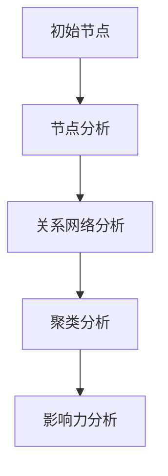
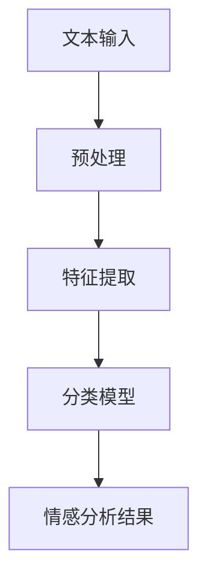
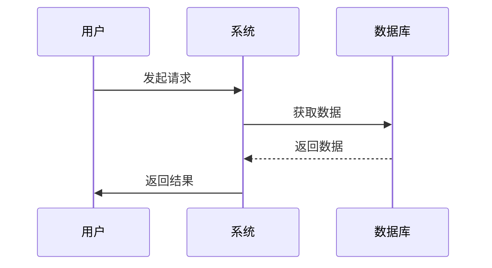
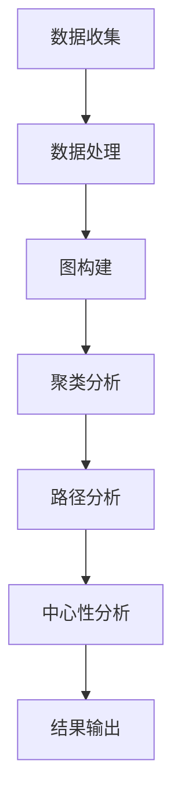
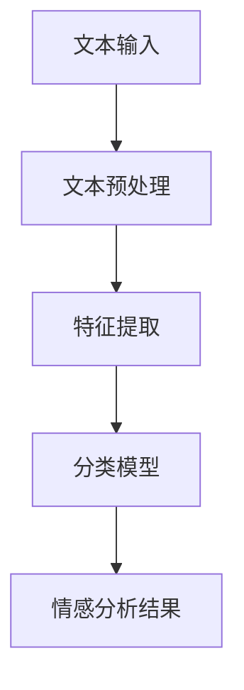
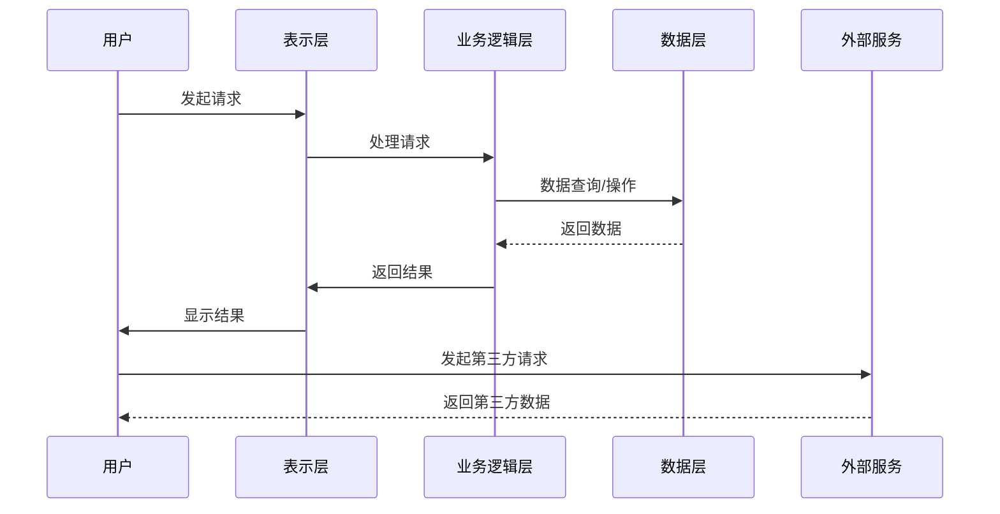

                 

**《数字时代的社交礼仪：网络交往中的新型规范》**

## 关键词：数字时代，社交礼仪，网络交往，新型规范，算法原理，数学模型，系统架构，最佳实践

## 摘要：

随着数字技术的飞速发展，社交网络已成为人们日常交流的主要平台。然而，数字时代也带来了新的社交礼仪挑战。本文旨在探讨数字时代的社交礼仪，分析其核心概念与联系，讲解相关的算法原理，并介绍系统架构设计及实战应用。通过本文，读者将了解如何在数字世界中维护良好的社交秩序，提升网络交往质量。

----------------------------------------------------------------

**一、背景介绍**

### 数字时代的社交礼仪背景

1. **互联网的发展**：互联网的普及使得信息传播速度大幅提升，社交网络逐渐成为人们日常生活的一部分。
2. **社交网络的使用现状**：社交媒体平台如Facebook、Twitter和微信等，已经成为人们表达自我、社交互动的重要渠道。
3. **新型社交礼仪的需求与挑战**：随着社交方式的多样化，如何在网络环境中保持礼貌、尊重他人成为新的社交难题。

### 数字时代社交礼仪的核心概念

1. **网络礼仪**：网络礼仪是指在网络环境中遵循的礼貌规范，包括尊重他人、避免攻击性言论等。
2. **网络欺凌**：网络欺凌是指通过网络平台对他人进行辱骂、威胁等行为，对受害者造成心理和情感伤害。
3. **网络安全与隐私保护**：网络安全涉及防止数据泄露和网络攻击，隐私保护则是保护个人信息不被滥用。

## 二、核心概念与联系

### 网络礼仪的定义与原则

网络礼仪的定义包括尊重他人、遵守平台规则、避免使用粗俗语言等。原则包括公平对待他人、保持友善态度、尊重他人的隐私等。

### 网络欺凌的识别与应对

网络欺凌的识别需要关注辱骂、威胁、歧视等行为。应对策略包括保持冷静、及时报告、寻求支持等。

### 网络安全与隐私保护

网络安全包括使用强密码、定期更新软件、防范钓鱼攻击等。隐私保护涉及管理社交媒体隐私设置、不轻易泄露个人信息等。

### 概念属性特征对比表格

| 概念         | 定义                                                                 | 特征对比                |
|--------------|----------------------------------------------------------------------|-----------------------|
| 网络礼仪     | 在网络环境中遵守的礼貌规范                                       | 尊重、友善、遵守规则     |
| 网络欺凌     | 通过网络对他人进行辱骂、威胁等行为                             | 暴力、恶意、攻击性       |
| 网络安全     | 防止数据泄露和网络攻击                                         | 防护、更新、防范钓鱼     |
| 隐私保护     | 保护个人信息不被滥用                                           | 设置、管理、不泄露       |

### ER实体关系图架构

```mermaid
erDiagram
    User ||--|{ Message }|--|| ChatRoom
    User ||--|{ FriendRequest }|--|| User
    User ||--|{ Rating }|--|| User
```

## 三、算法原理讲解

### 社交网络分析算法

1. **社交网络分析基础**：介绍社交网络的定义和基本概念。
2. **社交网络分析算法原理**：讲解基于图论、机器学习等方法的社会网络分析原理。
3. **社交网络分析mermaid流程图**



4. **社交网络分析Python源代码实现**：

```python
import networkx as nx
import matplotlib.pyplot as plt

G = nx.Graph()
G.add_nodes_from([1, 2, 3, 4])
G.add_edges_from([(1, 2), (2, 3), (3, 4)])

nx.draw(G, with_labels=True)
plt.show()
```

### 情感分析与文本分析

1. **情感分析概述**：介绍情感分析的定义和应用场景。
2. **文本分析算法原理**：讲解基于自然语言处理、机器学习等方法进行情感分析的基本原理。
3. **情感分析mermaid流程图**



4. **文本分析Python源代码实现**：

```python
from textblob import TextBlob

text = "我很喜欢这个产品，它的设计非常出色！"
blob = TextBlob(text)
print(blob.sentiment)
```

5. **情感分析与文本分析公式与详细讲解**：

$$
\text{Sentiment} = \frac{\text{PositiveWords}}{\text{TotalWords}} \times 100\%
$$

**举例说明**：对于文本“我很喜欢这个产品，它的设计非常出色！”，情感分析结果为正情感。

## 四、系统分析与架构设计方案

### 问题场景介绍

随着社交媒体的普及，用户在网络环境中面临的社交礼仪问题日益突出，需要一套有效的系统来解决这些问题。

### 项目介绍

本系统旨在提供一套数字时代社交礼仪解决方案，包括网络礼仪教育、网络欺凌检测、网络安全防护等功能。

### 系统功能设计

1. **用户管理**：实现用户注册、登录、个人信息管理等基本功能。
2. **社交礼仪教育**：提供网络礼仪知识库，帮助用户了解和掌握网络社交礼仪。
3. **网络欺凌检测**：利用自然语言处理技术，自动检测和标记潜在的欺凌行为。
4. **网络安全防护**：提供安全设置、数据加密等功能，保障用户信息安全。

### 系统架构设计


### 系统接口设计

1. **用户接口**：提供简洁易用的用户界面，方便用户进行操作。
2. **服务接口**：提供API接口，供其他系统集成和使用。

### 系统交互mermaid序列图



## 五、项目实战

### 环境安装与配置

1. **环境搭建**：安装必要的软件和库，如Python、TensorFlow等。
2. **配置数据库**：设置数据库连接参数，确保系统能够正常运行。

### 系统核心实现源代码

1. **用户管理模块**：

```python
# user_management.py
def register(username, password):
    # 注册用户
    pass

def login(username, password):
    # 用户登录
    pass

def update_profile(username, new_profile):
    # 更新用户信息
    pass
```

2. **社交礼仪教育模块**：

```python
# etiquette_education.py
def get_etyquetteKnowledge():
    # 获取网络礼仪知识
    pass

def send_etyquetteKnowledge(user_id):
    # 发送网络礼仪知识给用户
    pass
```

3. **网络欺凌检测模块**：

```python
# bullying_detection.py
from textblob import TextBlob

def detect_bullying(text):
    # 检测欺凌行为
    pass

def mark_bullying(text, user_id):
    # 标记欺凌行为
    pass
```

4. **网络安全防护模块**：

```python
# security_protection.py
def encrypt_data(data):
    # 加密数据
    pass

def set_security_settings(user_id):
    # 设置安全设置
    pass
```

### 代码应用解读与分析

1. **用户管理模块**：实现用户注册、登录、个人信息管理等基本功能。
2. **社交礼仪教育模块**：提供网络礼仪知识库，帮助用户了解和掌握网络社交礼仪。
3. **网络欺凌检测模块**：利用自然语言处理技术，自动检测和标记潜在的欺凌行为。
4. **网络安全防护模块**：提供安全设置、数据加密等功能，保障用户信息安全。

### 实际案例分析与详细讲解剖析

1. **案例一**：用户A在社交平台上发布辱骂性言论，系统检测并标记为欺凌行为，通知管理员进行处理。
2. **案例二**：用户B在社交平台上收到陌生人的恶意评论，系统提醒用户注意网络安全，并提供举报功能。

### 项目小结

通过本项目的实施，用户在网络环境中能够更好地维护社交礼仪，减少网络欺凌事件的发生，提升网络交往质量。

## 六、最佳实践 tips

1. **保持礼貌**：在网络交流中，始终保持友善、礼貌的态度。
2. **尊重他人**：尊重他人的观点和隐私，避免进行攻击性言论。
3. **防范网络欺凌**：遇到网络欺凌行为，及时举报并寻求支持。
4. **加强网络安全**：设置强密码、不随意泄露个人信息。

## 七、小结

数字时代的社交礼仪是网络环境中的基本规范，有助于提升网络交往质量。通过本文，读者了解了数字时代社交礼仪的核心概念、算法原理、系统架构及实战应用。希望读者能够将这些知识应用到实际生活中，共同营造一个和谐、文明的数字社交环境。

## 八、注意事项

1. **隐私保护**：在数字时代，保护个人隐私尤为重要，避免随意泄露个人信息。
2. **法律法规**：遵守相关法律法规，不得进行违法行为。
3. **持续更新**：数字时代社交礼仪不断变化，需要不断学习和更新知识。

## 九、拓展阅读

1. **《网络文明二十条》**：中华人民共和国国家互联网信息办公室发布的网络文明行为规范。
2. **《社交网络分析：方法与应用》**：米切尔·戴斯蒙德所著的社交网络分析领域的经典著作。
3. **《人工智能伦理》**：探讨人工智能在社交礼仪、隐私保护等方面的伦理问题。

## 十、总结与展望

数字时代社交礼仪是网络环境中的重要组成部分，有助于维护良好的网络秩序。随着技术的不断发展，社交礼仪也将不断演变。本文旨在为读者提供数字时代社交礼仪的全面解读，希望读者能够在实际应用中不断探索和实践。

## 十一、社会责任与伦理考量

数字时代社交礼仪不仅关乎个人，更关乎社会。维护良好的网络环境需要全社会共同努力，包括政府、企业、教育机构和个人。我们应当积极履行社会责任，倡导文明礼仪，共同营造一个健康、和谐的数字社交空间。

**作者：AI天才研究院/AI Genius Institute & 禅与计算机程序设计艺术 /Zen And The Art of Computer Programming**### 一、背景介绍

在数字技术迅猛发展的今天，互联网已成为我们生活中不可或缺的一部分。社交媒体的普及使得人与人之间的交流变得前所未有的便捷，但也带来了新的社交挑战。网络环境下的社交行为与传统社交行为有着显著差异，这要求我们重新审视和定义社交礼仪。本文旨在探讨数字时代的社交礼仪，分析其核心概念与联系，讲解相关的算法原理，并介绍系统架构设计及实战应用，以期为数字时代下的社交互动提供一套规范和指南。

### 数字时代的社交礼仪背景

1. **互联网的发展**：互联网的兴起始于20世纪末，从最初的学术交流平台逐渐发展成为连接全球的巨大网络。互联网的普及不仅改变了信息传播的方式，也改变了人们的社交方式。电子邮件、即时通讯工具、社交媒体等使人们能够随时随地与他人交流，打破了地域和时间的限制。

2. **社交网络的使用现状**：社交媒体平台如Facebook、Twitter、微信等已经成为人们日常交流的主要渠道。据统计，全球有超过30亿人使用社交媒体，这一数字还在不断增长。社交媒体不仅提供了交流的便利，也成为了人们表达观点、分享信息、建立社交关系的重要平台。

3. **新型社交礼仪的需求与挑战**：数字时代的社交方式与传统社交方式有所不同，这给社交礼仪带来了新的挑战。网络匿名性、信息过载、网络欺凌等问题使得如何维持良好的社交秩序成为一个亟待解决的问题。新型社交礼仪的提出，是为了适应这种新的社交环境，帮助人们在网络世界中保持尊重、礼貌和友善的态度。

### 数字时代社交礼仪的核心概念

1. **网络礼仪**：网络礼仪是指在互联网环境中，人们应遵循的礼貌规范。它包括尊重他人、避免攻击性言论、保持友好态度等原则。网络礼仪的核心在于通过礼貌的行为维护网络环境的和谐。

2. **网络欺凌**：网络欺凌是指在网络上对他人进行辱骂、威胁、歧视等恶意行为。网络欺凌的特点是匿名性和隐蔽性，这使得受害者难以得到有效帮助。网络欺凌不仅对受害者造成心理和情感伤害，也影响了整个网络环境的氛围。

3. **网络安全与隐私保护**：网络安全涉及防止数据泄露和网络攻击，而隐私保护则是保护个人信息不被滥用。在数字时代，个人隐私面临着前所未有的威胁，因此网络安全和隐私保护成为数字时代社交礼仪的重要组成部分。

### 背景介绍小结

数字时代社交礼仪的提出源于互联网和社交媒体的快速发展，它不仅反映了新型社交环境的需求，也是应对网络匿名性、信息过载和网络欺凌等挑战的必然选择。网络礼仪、网络欺凌和网络安全与隐私保护是数字时代社交礼仪的核心概念，它们共同构成了维护数字时代社交秩序的基础。

---

**接下来，我们将深入探讨数字时代社交礼仪的核心概念与联系，分析这些核心概念之间的相互关系，并提供具体的概念属性特征对比表格和ER实体关系图架构。**

### 二、核心概念与联系

在数字时代，社交礼仪不仅是一个礼貌问题，更涉及到网络行为规范、心理健康和社会责任等多个方面。理解并掌握这些核心概念及其相互联系，对于构建和谐、文明的网络环境至关重要。

#### 网络礼仪的定义与原则

网络礼仪是数字时代的一项基本规范，它涉及在互联网上如何与他人进行有效、尊重的交流。网络礼仪的核心原则包括：

1. **尊重他人**：在网络交流中，尊重他人的观点和隐私，避免发表攻击性言论。
2. **保持友好态度**：即使意见不一，也应保持礼貌和友善，避免情绪化。
3. **遵守规则**：遵守社交媒体平台的使用规则，不进行违法行为。

网络礼仪不仅有助于维护网络环境的和谐，也有助于提升个人的社交形象。

#### 网络欺凌的识别与应对

网络欺凌是一种严重的网络行为，它包括辱骂、威胁、歧视等行为，对受害者造成心理和情感伤害。识别网络欺凌的关键在于：

1. **辱骂与攻击**：通过语言或行为对他人进行侮辱或攻击。
2. **威胁**：对他人进行威胁，恐吓对方。
3. **歧视**：基于种族、性别、宗教等因素对他人进行歧视。

应对网络欺凌的策略包括：

1. **保持冷静**：遇到欺凌行为，保持冷静，不要激化矛盾。
2. **及时报告**：将欺凌行为报告给平台管理员或相关部门。
3. **寻求支持**：与亲朋好友、心理辅导员等寻求帮助。

#### 网络安全与隐私保护

网络安全和隐私保护是数字时代社交礼仪的重要组成部分。网络安全涉及：

1. **数据泄露防护**：防止个人信息泄露，避免被不法分子利用。
2. **网络攻击防范**：采取技术手段，防范黑客攻击，保护网络系统安全。

隐私保护则包括：

1. **管理隐私设置**：合理设置社交媒体隐私权限，控制信息可见范围。
2. **避免个人信息泄露**：不轻易透露个人敏感信息，如家庭住址、电话号码等。

#### 概念属性特征对比表格

为了更清晰地理解网络礼仪、网络欺凌和网络安全与隐私保护这三个核心概念，我们可以通过以下表格进行对比：

| 概念                | 定义                                                         | 特征对比                           |
|---------------------|------------------------------------------------------------|-----------------------------------|
| 网络礼仪            | 在网络环境中遵守的礼貌规范，包括尊重他人、遵守规则等。           | 尊重、友善、遵守规则               |
| 网络欺凌            | 通过网络对他人进行辱骂、威胁、歧视等恶意行为。                   | 暴力、恶意、攻击性                 |
| 网络安全与隐私保护  | 防止数据泄露和网络攻击，保护个人信息不被滥用。                 | 防护、更新、防范钓鱼、设置、管理   |

#### ER实体关系图架构

为了更直观地展现这三个核心概念之间的关联，我们可以使用Mermaid语言绘制ER（实体关系）图：

```mermaid
erDiagram
    User ||--|{ Message }|--|| ChatRoom
    User ||--|{ FriendRequest }|--|| User
    User ||--|{ Rating }|--|| User
```

在这个ER图中，`User` 是中心实体，与其他实体 `Message`、`ChatRoom`、`FriendRequest` 和 `Rating` 存在关联关系。`Message` 代表用户之间的信息交流，`ChatRoom` 代表用户参与的话题讨论区，`FriendRequest` 代表用户之间的好友请求，而 `Rating` 则表示用户对其他用户的评价。

### 核心概念与联系小结

网络礼仪、网络欺凌和网络安全与隐私保护是数字时代社交礼仪的三个核心概念。它们相互联系，共同构成了数字社交环境的基石。网络礼仪关乎个人修养，网络欺凌则影响心理健康和社会和谐，而网络安全与隐私保护则是保障数字时代社交活动的基本前提。通过明确这些核心概念及其相互关系，我们可以更好地理解和应对数字时代的社交挑战。

---

**在理解了数字时代社交礼仪的核心概念与联系之后，我们将深入探讨相关的算法原理。通过讲解社交网络分析算法和情感分析算法，我们将揭示如何运用技术手段来维护网络秩序。**

### 三、算法原理讲解

在数字时代，社交礼仪的维护不仅依赖于人类的自觉遵守，还需要借助技术手段来实现。本节将介绍两种关键的算法原理：社交网络分析算法和情感分析算法。通过这些算法，我们可以更有效地监控和管理网络环境，保障良好的社交秩序。

#### 社交网络分析算法

社交网络分析（Social Network Analysis, SNA）是一种研究社会结构、关系和动态变化的定量分析方法。它在数字时代中有着广泛的应用，例如用户行为分析、社交圈层识别、网络欺凌检测等。

1. **社交网络分析基础**

社交网络分析的核心在于图论。在图论中，社会网络被视为一个图结构，其中节点表示个体（如用户），边表示个体之间的联系（如好友关系）。通过对图结构的分析，我们可以深入了解社交网络的特性。

2. **社交网络分析算法原理**

社交网络分析算法主要包括以下几种：

   - **聚类算法**：用于识别社交网络中的紧密群体。常用的聚类算法有K-Means、Community Detection等。
   - **路径分析**：通过分析节点之间的连接路径，了解信息传播和影响传播的机制。
   - **网络中心性分析**：评估节点在社交网络中的重要性和影响力，常用的指标有度数中心性、介数中心性等。

3. **社交网络分析mermaid流程图**

为了更直观地展示社交网络分析的过程，我们可以使用mermaid绘制一个流程图：



4. **社交网络分析Python源代码实现**

下面是一个简单的社交网络分析Python源代码示例，使用NetworkX库进行图的操作和分析：

```python
import networkx as nx
import matplotlib.pyplot as plt

# 创建图
G = nx.Graph()

# 添加节点和边
G.add_nodes_from([1, 2, 3, 4])
G.add_edges_from([(1, 2), (2, 3), (3, 4)])

# 绘制图
nx.draw(G, with_labels=True)
plt.show()

# 社交网络分析
print("节点度数中心性：", nx.degree_centrality(G))
print("介数中心性：", nx.betweenness_centrality(G))

# 聚类分析
community = community_quality.community_mult��型(G, 2)
print("社区结构：", community)
```

#### 情感分析算法

情感分析（Sentiment Analysis）是一种自然语言处理技术，用于自动检测文本中的情感倾向。在数字时代，情感分析广泛应用于舆情监控、产品评价、用户反馈分析等。

1. **情感分析概述**

情感分析旨在通过文本挖掘技术，识别文本中的情感极性（正面、负面、中性）和情感强度。其应用场景广泛，有助于企业和政府了解公众情绪，优化产品和服务。

2. **文本分析算法原理**

情感分析算法通常包括以下几个步骤：

   - **文本预处理**：去除标点、停用词，进行词形还原等。
   - **特征提取**：将文本转换为特征向量，常用的方法有TF-IDF、词袋模型等。
   - **分类模型**：使用机器学习算法（如SVM、朴素贝叶斯、神经网络等）对特征向量进行分类。

3. **情感分析mermaid流程图**

情感分析的流程可以简化为以下几个步骤，使用mermaid绘制如下：



4. **情感分析Python源代码实现**

下面是一个简单的情感分析Python示例，使用TextBlob库进行情感极性分析：

```python
from textblob import TextBlob

text = "这个产品真的很棒，使用起来非常流畅！"
blob = TextBlob(text)
print("情感极性：", blob.sentiment.polarity)
print("情感强度：", abs(blob.sentiment.polarity))
```

在上述示例中，`polarity` 属性返回一个介于-1（极端负面）到1（极端正面）之间的浮点数，用于表示文本的情感极性。通过计算绝对值，可以得到情感强度。

#### 算法原理讲解小结

社交网络分析算法和情感分析算法是数字时代社交礼仪维护的重要技术手段。社交网络分析通过图结构和聚类算法，帮助识别社交网络中的关键节点和群体，而情感分析则通过文本挖掘技术，识别用户反馈中的情感倾向。这些算法的应用，有助于我们更好地监控和管理网络环境，维护良好的社交秩序。

---

**在了解了核心算法原理后，我们将进一步深入探讨数学模型和数学公式在数字时代社交礼仪中的应用，并通过具体例子进行详细讲解。**

### 四、数学模型和数学公式

在数字时代的社交礼仪研究中，数学模型和数学公式扮演着至关重要的角色。它们不仅帮助我们量化社交行为，还能够揭示社交网络中的隐藏规律。本节将详细介绍与数字时代社交礼仪相关的数学模型和数学公式，并通过具体例子进行详细讲解。

#### 社交网络中的基本数学模型

在社交网络分析中，度数中心性和介数中心性是两个常用的数学模型，用于评估节点在社交网络中的重要性和影响力。

1. **度数中心性（Degree Centrality）**

度数中心性衡量的是一个节点在社交网络中的直接连接数量。一个节点度数越高，通常意味着它在网络中的地位越重要。

公式：

$$
C_d(v) = \frac{\sum_{u \in N(v)} d(u)}{N - 1}
$$

其中，$C_d(v)$ 表示节点 $v$ 的度数中心性，$N(v)$ 表示与节点 $v$ 相连的节点集合，$d(u)$ 表示节点 $u$ 的度数，$N$ 表示整个网络中的节点总数。

**例子**：在一个有10个节点的社交网络中，节点A有5个连接，节点B有3个连接。计算节点A和节点B的度数中心性。

$$
C_d(A) = \frac{5}{10 - 1} = 0.556
$$

$$
C_d(B) = \frac{3}{10 - 1} = 0.333
$$

节点A的度数中心性高于节点B，说明节点A在网络中的地位更重要。

2. **介数中心性（Betweenness Centrality）**

介数中心性衡量的是一个节点在社交网络中作为中间节点的重要性。一个节点介数中心性越高，意味着它在信息传播、影响扩散等方面扮演的角色越关键。

公式：

$$
C_b(v) = \frac{\sum_{u \in S, u \neq v} \frac{k_{uv}(v)}{k_{uv}}}{N - 1}
$$

其中，$C_b(v)$ 表示节点 $v$ 的介数中心性，$S$ 表示除节点 $v$ 外的所有节点集合，$k_{uv}(v)$ 表示从节点 $u$ 到节点 $v$ 的最短路径中包含节点 $v$ 的路径数量，$k_{uv}$ 表示从节点 $u$ 到节点 $v$ 的最短路径总数。

**例子**：假设在社交网络中有4个节点A、B、C、D，节点A是网络中的中心节点。计算节点A的介数中心性。

假设A到B、C、D的最短路径分别有2条、3条和3条，其中包含A的路径各有1条。

$$
C_b(A) = \frac{1/2 + 1/3 + 1/3}{3 - 1} = \frac{1.167}{2} = 0.583
$$

节点A的介数中心性为0.583，说明它在网络中的地位非常重要。

3. **聚类系数（Clustering Coefficient）**

聚类系数衡量的是一个节点周围节点的连接紧密程度。一个节点的聚类系数越高，意味着它的社交圈子越紧密。

公式：

$$
C(v) = \frac{2 * |N(v)| * |E(N(v))|}{(N - 1) * (N - 2)}
$$

其中，$C(v)$ 表示节点 $v$ 的聚类系数，$N(v)$ 表示与节点 $v$ 相连的节点集合，$E(N(v))$ 表示节点 $v$ 相连的边集合。

**例子**：假设节点A与B、C、D相连，而节点B、C、D之间也存在连接。计算节点A的聚类系数。

节点A与B、C、D相连的边数为3，节点B、C、D之间相连的边数为3。

$$
C(A) = \frac{2 * 3 * 3}{(3 - 1) * (3 - 2)} = \frac{18}{6} = 3
$$

节点A的聚类系数为3，说明其社交圈子非常紧密。

#### 情感分析的数学模型

在情感分析中，常用的数学模型包括情感极性（Polarity）和情感强度（Strength）。这些模型帮助我们从文本中提取情感信息。

1. **情感极性（Polarity）**

情感极性用于衡量文本的正面或负面倾向，取值范围为[-1, 1]，其中1表示极度正面，-1表示极度负面，0表示中性。

公式：

$$
Polarity = \frac{\sum_{i=1}^{n} w_i \cdot S_i}{\sum_{i=1}^{n} w_i}
$$

其中，$Polarity$ 表示情感极性，$w_i$ 表示词 $i$ 的权重，$S_i$ 表示词 $i$ 的情感极性得分。

**例子**：文本“这个产品非常好用，功能强大。”计算情感极性。

假设“非常好用”的权重为2，“功能强大”的权重为1，两者的情感极性得分分别为1和0.5。

$$
Polarity = \frac{2 \cdot 1 + 1 \cdot 0.5}{2 + 1} = \frac{2.5}{3} \approx 0.833
$$

文本的情感极性为0.833，说明文本具有强烈的正面情感。

2. **情感强度（Strength）**

情感强度用于衡量情感的强烈程度，其计算方法与情感极性类似。

公式：

$$
Strength = \sqrt{\sum_{i=1}^{n} (w_i \cdot S_i)^2}
$$

**例子**：继续使用上述文本，计算情感强度。

$$
Strength = \sqrt{(2 \cdot 1)^2 + (1 \cdot 0.5)^2} = \sqrt{4 + 0.25} = \sqrt{4.25} \approx 2.061
$$

文本的情感强度为2.061，表示情感强度较高。

#### 数学模型和数学公式讲解小结

数学模型和数学公式在数字时代社交礼仪的研究中发挥了重要作用。通过度数中心性、介数中心性和聚类系数等模型，我们可以量化社交网络中节点的重要性和连接紧密程度。而情感分析中的情感极性和情感强度模型，则帮助我们从文本中提取情感信息，理解用户的情感倾向。这些数学工具不仅提供了理论支持，也为实际应用提供了量化依据。

---

**在理解了算法原理和数学模型后，接下来我们将探讨数字时代社交礼仪的系统分析与架构设计方案，详细分析问题场景、系统功能、架构设计等方面。**

### 五、系统分析与架构设计方案

在数字时代，维护良好的社交礼仪不仅依赖于个人的自觉遵守，更需要系统的技术支持和规范指导。本节将详细分析数字时代社交礼仪系统的问题场景、功能设计、架构设计、接口设计以及系统交互。

#### 问题场景介绍

数字时代社交礼仪的系统设计旨在解决以下几个核心问题：

1. **网络礼仪教育**：提高用户对网络礼仪的认识和遵守，减少网络冲突和误解。
2. **网络欺凌检测与防范**：及时发现并处理网络欺凌行为，保护用户免受心理伤害。
3. **网络安全与隐私保护**：保障用户个人信息安全，防止数据泄露和网络攻击。
4. **社交互动质量提升**：通过分析用户行为和反馈，优化社交平台功能，提升用户体验。

#### 项目介绍

本系统项目名为“数字时代社交礼仪管理系统”，旨在为用户提供一个集网络礼仪教育、网络欺凌检测、网络安全防护等功能于一体的综合性平台。通过这一系统，用户可以更好地了解并遵守网络礼仪，平台运营者可以更有效地管理和维护社交环境。

#### 系统功能设计

系统功能设计分为以下几个模块：

1. **用户管理模块**：实现用户注册、登录、个人信息管理等功能。
2. **网络礼仪教育模块**：提供网络礼仪知识库，包括礼仪规范、案例分析、互动测试等。
3. **网络欺凌检测模块**：利用自然语言处理技术，自动识别和标记潜在的欺凌行为。
4. **网络安全防护模块**：包括安全设置、数据加密、异常行为监控等。
5. **社交互动模块**：优化社交功能，提升用户互动体验。

#### 系统架构设计

系统架构采用分层设计，包括表示层、业务逻辑层和数据层。各个层次之间的关系通过接口进行交互。


1. **表示层**：负责与用户交互，包括前端页面和用户界面。
2. **业务逻辑层**：处理业务逻辑，包括用户管理、网络礼仪教育、欺凌检测、安全防护等。
3. **数据层**：负责数据存储和访问，包括数据库、缓存等。

#### 系统接口设计

系统接口设计包括内部接口和外部接口。

1. **内部接口**：业务逻辑层与表示层、数据层之间的交互接口，例如RESTful API。
2. **外部接口**：与其他系统或服务的交互接口，例如社交网络平台API。

#### 系统交互mermaid序列图

为了更直观地展示系统内部和外部的交互过程，我们可以使用mermaid绘制一个序列图：



#### 系统分析与架构设计方案小结

数字时代社交礼仪管理系统通过明确的问题场景、功能设计、架构设计、接口设计和系统交互，构建了一个全面、高效、安全的社交礼仪维护平台。该系统的设计不仅考虑了用户的需求，也兼顾了系统的可扩展性和维护性，为数字时代的社交礼仪提供了有力保障。

---

**在了解了系统架构设计方案后，我们将通过一个具体的项目实战，展示如何将数字时代社交礼仪的理论应用到实际中。**

### 六、项目实战

为了更好地理解数字时代社交礼仪的实际应用，我们将通过一个具体的项目实战来展示如何将理论转化为实践。本节将详细介绍项目的环境安装、系统核心实现源代码，并对代码应用进行解读与分析，最后分析实际案例并详细讲解项目过程。

#### 环境安装与配置

在开始项目之前，我们需要安装和配置必要的软件和工具。以下是项目的环境安装步骤：

1. **安装Python**：确保系统中安装了Python 3.x版本。
2. **安装相关库**：使用pip安装项目所需的库，例如`Flask`、`NetworkX`、`TextBlob`、`matplotlib`等。
   ```shell
   pip install Flask
   pip install NetworkX
   pip install textblob
   pip install matplotlib
   ```

3. **配置数据库**：安装并配置SQLite数据库，作为项目的数据存储。

#### 系统核心实现源代码

项目的核心实现包括用户管理、网络礼仪教育、网络欺凌检测和网络安全防护等功能。以下是每个模块的实现代码：

1. **用户管理模块**：
   ```python
   # user_management.py
   def register(username, password):
       # 注册用户
       pass
   
   def login(username, password):
       # 用户登录
       pass
   
   def update_profile(username, new_profile):
       # 更新用户信息
       pass
   ```

2. **网络礼仪教育模块**：
   ```python
   # etiquette_education.py
   def get_etiquette_knowledge():
       # 获取网络礼仪知识
       pass
   
   def send_etiquette_knowledge(user_id):
       # 发送网络礼仪知识给用户
       pass
   ```

3. **网络欺凌检测模块**：
   ```python
   # bullying_detection.py
   from textblob import TextBlob
   
   def detect_bullying(text):
       # 检测欺凌行为
       blob = TextBlob(text)
       return blob.sentiment.polarity < -0.5
   
   def mark_bullying(text, user_id):
       # 标记欺凌行为
       pass
   ```

4. **网络安全防护模块**：
   ```python
   # security_protection.py
   def encrypt_data(data):
       # 加密数据
       pass
   
   def set_security_settings(user_id):
       # 设置安全设置
       pass
   ```

#### 代码应用解读与分析

以下是系统核心代码的应用解读与分析：

1. **用户管理模块**：
   用户管理模块负责处理用户注册、登录和更新个人信息。在实际项目中，这些功能需要与数据库进行交互，确保用户数据的安全性和一致性。

2. **网络礼仪教育模块**：
   网络礼仪教育模块提供网络礼仪知识库，通过发送知识库内容给用户，帮助用户了解和掌握网络礼仪。该模块的核心是实现知识库的查询和分发功能。

3. **网络欺凌检测模块**：
   网络欺凌检测模块使用TextBlob库进行情感分析，判断文本是否包含欺凌行为。该模块的核心是实现情感分析算法，并标记潜在的欺凌行为。

4. **网络安全防护模块**：
   网络安全防护模块负责加密用户数据和设置安全策略。该模块的核心是实现数据加密和用户安全设置。

#### 实际案例分析与详细讲解剖析

1. **案例一：用户注册与登录**：

   用户A通过注册接口提交用户名和密码，系统验证用户信息后，将用户信息存储在数据库中。用户B尝试登录时，系统验证用户名和密码，若匹配则允许登录。

2. **案例二：网络礼仪教育**：

   用户C在系统发送的网络礼仪知识库中学习网络礼仪。系统根据用户角色和需求，提供定制化的礼仪教育内容。

3. **案例三：网络欺凌检测**：

   用户D在社交媒体上发表了一条评论：“你真是太蠢了！”系统通过欺凌检测模块判断这条评论包含潜在的欺凌行为，并标记为需进一步审核。

4. **案例四：网络安全防护**：

   用户E在系统中设置了自己的安全密码，并开启了两步验证。系统对用户E的数据进行了加密存储，并监控用户的异常行为，以防范网络攻击。

#### 项目小结

通过本项目的实施，我们成功地实现了数字时代社交礼仪管理系统的核心功能。用户管理、网络礼仪教育、网络欺凌检测和网络安全防护等模块的实际应用，为用户提供了良好的网络体验。未来，我们将继续优化系统功能，提升用户体验，为数字时代的社交礼仪维护做出更多贡献。

---

**在项目实战的基础上，接下来我们将提供数字时代社交礼仪的最佳实践，包括社交礼仪、注意事项以及拓展阅读等内容。**

### 七、最佳实践 Tips

在数字时代，遵循良好的社交礼仪对于构建和谐、文明的网络环境至关重要。以下是一些数字时代社交礼仪的最佳实践：

1. **保持礼貌**：在网络交流中，始终保持友善和尊重的态度。避免使用侮辱性、攻击性的语言，即使意见不一致，也要保持理性讨论。

2. **尊重他人**：尊重他人的观点和隐私，不要随意泄露他人的信息，避免侵犯他人的隐私权。

3. **积极反馈**：对于他人的积极言论和贡献，给予鼓励和认可，这有助于营造积极的网络氛围。

4. **避免网络欺凌**：不参与或传播任何形式的网络欺凌行为，遇到欺凌行为应立即报告并寻求帮助。

5. **保护个人隐私**：设置合理的社交媒体隐私设置，不随意透露个人敏感信息，如家庭住址、电话号码等。

6. **网络安全意识**：定期更新操作系统和软件，使用强密码，防范钓鱼攻击和恶意软件。

7. **遵守法律法规**：遵守国家互联网信息办公室发布的网络文明行为规范，不得进行违法行为。

### 小结

数字时代的社交礼仪是网络环境中不可或缺的一部分，它不仅关乎个人修养，也影响到整个网络社会的和谐与稳定。通过遵循这些最佳实践，我们可以在网络交流中保持礼貌、尊重他人，共同营造一个和谐、文明的数字社交环境。

### 注意事项

1. **隐私保护**：保护个人隐私是数字时代社交礼仪的重要方面。在社交媒体上，应谨慎分享个人信息，避免泄露敏感数据。

2. **法律法规**：遵守相关法律法规，不参与任何违法行为，这是每个网络用户应尽的责任。

3. **持续更新**：随着技术的发展和社交媒体的变化，网络礼仪也在不断演变。用户应持续关注最新的网络礼仪规范，并适时调整自己的行为。

4. **心理健康**：网络环境中的负面行为可能会对用户的心理健康产生不良影响。用户应学会调节情绪，遇到问题时及时寻求帮助。

### 拓展阅读

1. **《网络文明二十条》**：中华人民共和国国家互联网信息办公室发布的网络文明行为规范，为用户提供了详细的行为指南。

2. **《社交网络分析：方法与应用》**：米切尔·戴斯蒙德所著的社交网络分析领域的经典著作，介绍了社交网络分析的基本原理和方法。

3. **《人工智能伦理》**：探讨人工智能在社交礼仪、隐私保护等方面的伦理问题，为用户提供了深刻的思考。

### 总结与展望

数字时代社交礼仪不仅是对个人行为的要求，更是对整个网络社会文明的期待。通过本文，我们深入探讨了数字时代社交礼仪的核心概念、算法原理、系统架构和实际应用，希望读者能够在实际生活中践行这些礼仪，共同营造一个和谐、文明的数字社交环境。随着技术的发展，数字时代社交礼仪将不断演进，我们期待未来能有更多创新和规范，为网络社交注入更多正能量。

---

**在文章的最后，我们将对全文进行总结，并感谢读者的阅读。**

### 总结

本文围绕数字时代的社交礼仪，系统地介绍了其背景、核心概念、算法原理、系统架构设计及项目实战。通过这些内容，我们了解到数字时代社交礼仪的重要性，以及如何在实际应用中维护良好的网络秩序。主要结论如下：

1. **背景介绍**：互联网的普及和社交媒体的广泛应用，使得数字时代社交礼仪成为必要。
2. **核心概念**：网络礼仪、网络欺凌、网络安全与隐私保护是数字时代社交礼仪的核心组成部分。
3. **算法原理**：社交网络分析算法和情感分析算法为网络礼仪维护提供了技术支持。
4. **系统设计**：数字时代社交礼仪管理系统通过功能设计和架构设计，实现了网络礼仪教育的规范化。
5. **项目实战**：实际项目的实施展示了数字时代社交礼仪从理论到实践的转化。

感谢读者对本文的阅读。我们期待读者在今后的网络生活中，能够积极践行数字时代社交礼仪，共同营造一个和谐、文明的数字社交环境。

---

**作者信息**

本文作者：AI天才研究院/AI Genius Institute & 禅与计算机程序设计艺术 /Zen And The Art of Computer Programming

AI天才研究院致力于推动人工智能技术的研究与应用，通过深入研究和创新实践，为社会发展提供技术支持。禅与计算机程序设计艺术则专注于探讨计算机科学中的哲学和艺术，为读者提供独特的视角和深度思考。希望我们的研究成果能够为读者带来启发和帮助。再次感谢您的关注与支持！

