                 

### 数字时代的社交礼仪：网络交往中的新规则

**关键词**：数字时代、社交礼仪、网络交往、新规则、礼仪规范

**摘要**：
本文将深入探讨数字时代下的社交礼仪，阐述其在网络交往中的新规则。通过分析数字时代社交礼仪的兴起、核心概念、基本规则、特定场景下的礼仪以及实践指南，本文旨在帮助读者理解并遵循这些新规则，以建立和谐的数字社交环境。同时，本文还探讨了数字时代社交礼仪的发展趋势和未来展望，为读者提供了全面的指导。

### 目录大纲设计思路

在制定《数字时代的社交礼仪：网络交往中的新规则》的目录大纲时，我们需要从多个角度进行思考，以确保内容既有逻辑性又具备实用性。以下是我们设计目录大纲的几个关键点：

1. **全书结构规划**：
   - 整体结构应包含五个部分：背景介绍、核心规则解析、实践指南、未来展望和总结与反思。
   - 每个部分都有明确的主题和目标，确保文章内容环环相扣。

2. **核心概念介绍**：
   - 在背景介绍部分，详细解释数字时代社交礼仪的定义、重要性及其核心概念。
   - 为读者提供清晰的核心概念和基本原理，确保他们能够理解全书的基础内容。

3. **规则与实践结合**：
   - 在核心规则解析部分，不仅介绍社交礼仪的基本规则，还通过具体案例和操作指南，帮助读者将这些规则应用到实际生活中。

4. **章节内容细化**：
   - 每个章节根据其主题细化出子章节，确保内容全面且具有逻辑性。
   - 子章节内容之间相互关联，形成完整的知识体系。

5. **扩展与总结**：
   - 在适当章节加入拓展阅读和总结内容，帮助读者巩固知识并引导进一步学习。
   - 总结部分对全书内容进行回顾，强调核心要点。

### 具体目录大纲设计

#### 第一部分：背景介绍

**第1章：数字时代社交礼仪的兴起**

- **1.1 问题的提出**
  - 社交礼仪的定义
  - 数字时代社交礼仪的独特性
  - 数字时代社交礼仪的重要性

- **1.2 数字时代社交礼仪的核心概念**
  - 网络交往中的新规则
  - 数字时代社交礼仪的边界与外延
  - 核心要素组成

- **1.3 数字时代社交礼仪的现状**
  - 社交平台的发展对礼仪的影响
  - 不同年龄段人群的社交礼仪差异
  - 社交礼仪在不同文化背景下的表现

- **1.4 本章小结**

**第2章：核心概念与联系**

- **2.1 社交礼仪的演进**
  - 传统社交礼仪的演变
  - 数字时代社交礼仪的特点

- **2.2 数字时代社交礼仪的核心概念**
  - 礼貌、尊重、诚信等核心概念
  - 这些概念在数字时代的具体体现

- **2.3 数字时代社交礼仪的ER实体关系图**
  - 社交平台、用户、互动等实体
  - 实体之间的关系与互动

- **2.4 本章小结**

#### 第二部分：核心规则解析

**第3章：数字时代的基本社交礼仪**

- **3.1 网络用语与礼貌**
  - 网络语言的特点
  - 网络语言的使用规则
  - 礼貌用语在数字时代的应用

- **3.2 网络交往中的礼仪**
  - 网络沟通中的非语言符号
  - 网络互动中的礼仪规范
  - 社交软件的礼仪规则

- **3.3 社交平台礼仪**
  - 微博、微信、Facebook等平台的社交礼仪
  - 网络社区管理规范
  - 网络直播与视频会议的礼仪

- **3.4 本章小结**

**第4章：数字时代特定场景下的礼仪**

- **4.1 职场网络交往礼仪**
  - 职场邮件礼仪
  - 职场社交网络使用规范
  - 跨文化职场礼仪

- **4.2 网络购物礼仪**
  - 网络购物过程中的礼仪
  - 用户评论与评价的礼仪
  - 网络购物纠纷处理

- **4.3 社交媒体营销礼仪**
  - 企业社交媒体策略
  - 内容营销中的礼仪
  - 营销互动中的礼仪规范

- **4.4 本章小结**

#### 第三部分：实践指南

**第5章：数字时代社交礼仪实践**

- **5.1 社交礼仪自我评估**
  - 自我评估工具与方法
  - 社交礼仪的自我提升路径

- **5.2 社交礼仪训练与实践**
  - 社交礼仪训练的方法
  - 实践案例分享

- **5.3 社交礼仪案例分析**
  - 典型网络礼仪事件分析
  - 礼仪失范案例分析

- **5.4 本章小结**

#### 第四部分：未来展望

**第6章：数字时代社交礼仪的发展趋势**

- **6.1 社交礼仪与技术变革**
  - 技术发展对礼仪的影响
  - 未来社交礼仪的可能变化

- **6.2 社交礼仪与文化多样性的融合**
  - 全球化背景下的礼仪多样性
  - 文化多样性对社交礼仪的挑战与机遇

- **6.3 社交礼仪的教育与普及**
  - 社交礼仪教育的重要性
  - 社交礼仪普及策略

- **6.4 本章小结**

#### 第五部分：总结与反思

**第7章：数字时代社交礼仪的重要性与影响**

- **7.1 社交礼仪在数字时代的重要性**
  - 社交礼仪对个人形象的影响
  - 社交礼仪对社会和谐的贡献

- **7.2 数字时代社交礼仪的影响**
  - 社交礼仪对人际交往的影响
  - 社交礼仪对商业活动的影响

- **7.3 社交礼仪的边界与挑战**
  - 社交礼仪的适用范围
  - 社交礼仪面临的挑战

- **7.4 本章小结**

**第8章：未来数字时代社交礼仪的展望**

- **8.1 社交礼仪的发展方向**
  - 社交礼仪的未来趋势
  - 社交礼仪创新的可能性

- **8.2 社交礼仪的未来挑战与机遇**
  - 技术进步带来的挑战
  - 社交礼仪发展的新机遇

- **8.3 本章小结**

### 文章整体结构与逻辑关系

设计本文的整体结构和逻辑关系，是为了让读者能够循序渐进地理解数字时代社交礼仪的概念、规则和应用。以下是对文章结构的详细解释：

#### 开篇引入

文章以“数字时代的社交礼仪：网络交往中的新规则”为标题，直接点明主题。通过关键词和摘要，简要介绍文章的核心内容，吸引读者的兴趣。

#### 第一部分：背景介绍

**第1章** 介绍了数字时代社交礼仪的兴起，讨论了社交礼仪的定义、独特性以及重要性。这一章节为后续内容的深入探讨奠定了基础。

**第2章** 进一步探讨了核心概念与联系，通过社交礼仪的演进、核心概念的详细解释以及ER实体关系图的展示，帮助读者构建对数字时代社交礼仪的整体理解。

#### 第二部分：核心规则解析

**第3章** 和 **第4章** 分别从基本社交礼仪和特定场景下的礼仪两个角度，详细阐述了数字时代社交礼仪的具体规则。这些章节通过实例和案例分析，使读者能够具体了解和掌握社交礼仪的实践应用。

#### 第三部分：实践指南

**第5章** 提供了社交礼仪的实践指南，包括自我评估、训练和实践方法，帮助读者将理论知识转化为实际能力。

#### 第四部分：未来展望

**第6章** 探讨了数字时代社交礼仪的发展趋势，分析了技术变革和文化多样性的影响，为读者描绘了社交礼仪的未来前景。

#### 第五部分：总结与反思

**第7章** 对数字时代社交礼仪的重要性与影响进行了总结，讨论了社交礼仪的边界与挑战，为读者提供了深入的思考。

**第8章** 展望了未来数字时代社交礼仪的发展方向和机遇，强调了社交礼仪在技术进步和文化多样性背景下的持续发展。

### 文章结构的核心逻辑关系

1. **从背景介绍到核心规则解析**：文章从背景介绍入手，逐步引导读者进入核心规则的讨论。背景介绍部分解释了社交礼仪在数字时代的特殊重要性，为后续章节的核心规则解析提供了理论基础。

2. **核心规则与实践指南的结合**：核心规则章节不仅介绍了基本礼仪和特定场景下的礼仪，还通过实践指南部分，帮助读者将这些规则应用到实际生活中，确保读者能够学以致用。

3. **理论与实践相结合**：通过具体案例分析和实践指南，文章实现了理论与实践的结合，使读者不仅理解社交礼仪的理论基础，还能掌握实际操作技能。

4. **从现状到未来展望**：文章通过现状介绍和未来展望，使读者对数字时代社交礼仪有全面的认识，不仅了解当前的情况，还预见了未来的发展趋势。

5. **总结与反思**：总结部分对全文内容进行了回顾，强调了核心要点，使读者能够对数字时代社交礼仪有更深入的理解和反思。

整体而言，文章的结构设计旨在引导读者逐步深入，从理论到实践，从现状到未来，形成完整的知识体系，使读者不仅能够理解数字时代社交礼仪的重要性，还能掌握其实际应用，为建立和谐的数字社交环境提供指导。

### 数字时代社交礼仪的兴起

在当今数字化时代，社交礼仪经历了一场深刻的变革。随着互联网和社交媒体的普及，人们的社交方式发生了巨大的变化，传统社交礼仪逐渐演变为适应数字环境的全新规则。这种变化不仅改变了人们的日常交往方式，也对社交礼仪本身提出了新的要求。

**数字时代社交礼仪的定义**：社交礼仪是指在特定社会背景下，人们在交往过程中遵循的一系列行为规范，以展示对他人的尊重和礼貌。在数字时代，这些规范主要通过网络交往、电子邮件、社交媒体等数字工具来体现。

**数字时代社交礼仪的独特性**：与传统的面对面交往不同，数字时代社交礼仪具有以下几个独特特点：

1. **匿名性和虚拟性**：在数字环境中，人们可以通过匿名账号进行交流，这使得互动更加自由，但也带来了信任问题。因此，数字时代社交礼仪更强调诚信和真实性的维护。
   
2. **即时性和高效性**：数字工具使得信息传递变得迅速，这要求人们在交流中更加注重效率，同时也需要更加谨慎，避免因信息传递过快而造成误解或冒犯。

3. **互动的多渠道性**：数字时代社交不仅限于单一的社交媒体平台，还包括电子邮件、即时通讯工具、在线论坛等多种渠道。因此，社交礼仪需要适应这些不同渠道的特点。

**数字时代社交礼仪的重要性**：在数字时代，社交礼仪的重要性不容忽视。它不仅关系到个人的形象和声誉，还影响到社会和谐与商业活动的顺利进行。以下是几个方面的重要性体现：

1. **塑造个人形象**：良好的数字社交礼仪能够展示个人的专业素养和道德水平，有助于建立积极的人际关系和良好的社会声誉。

2. **促进社会和谐**：数字社交礼仪的遵循有助于减少网络冲突和误解，营造一个文明、和谐的数字社交环境。

3. **提升商业效益**：在商业活动中，良好的数字社交礼仪能够增强企业与客户之间的信任，提高客户满意度和忠诚度，进而提升商业效益。

**数字时代社交礼仪的边界与外延**：数字时代社交礼仪的边界相对传统社交礼仪更加模糊，因为不同的平台和工具可能有着不同的礼仪规则。然而，其核心原则是通用的，包括尊重、礼貌、诚信等。以下是其主要边界与外延：

1. **网络语言的使用**：网络语言的使用需要遵循一定的规范，以避免造成误解或冒犯。比如，使用礼貌用语、避免使用侮辱性词汇等。

2. **信息分享的边界**：在数字时代，信息分享需要谨慎，避免泄露个人隐私或敏感信息。

3. **社交平台的礼仪**：不同社交平台有不同的礼仪规则，比如微博的评论礼仪、微信的朋友圈礼仪等。了解并遵循这些规则是保持良好社交关系的重要一环。

**核心要素组成**：数字时代社交礼仪的核心要素主要包括：

1. **尊重**：尊重他人是社交礼仪的基础，无论是网络上的陌生人还是熟悉的朋友，都应保持尊重的态度。

2. **礼貌**：礼貌是数字时代社交的重要手段，包括使用礼貌用语、保持良好的沟通态度等。

3. **诚信**：诚信是建立信任的基础，数字时代社交中应避免虚假信息或欺骗行为。

4. **沟通技巧**：良好的沟通技巧是数字时代社交的关键，包括有效的表达、倾听和反馈。

**本章小结**：数字时代社交礼仪的兴起是互联网和社交媒体发展的必然结果，它为人们的网络交往提供了新的规则。了解并遵循这些规则，不仅有助于个人形象的塑造和社会和谐的维护，还能提升商业活动的效益。随着数字时代的不断演进，社交礼仪将继续发展，变得更加重要和复杂。

### 数字时代社交礼仪的核心概念与联系

在深入探讨数字时代社交礼仪之前，我们需要明确几个核心概念，并了解它们之间的联系。这些核心概念不仅构成了数字时代社交礼仪的基础，还为我们理解其运作方式提供了关键视角。

**礼貌**：礼貌是社交礼仪的基石，它体现了对他人的尊重和关心。在数字时代，礼貌表现为使用适当的语言和符号，以避免不必要的冲突和误解。例如，在邮件和社交媒体评论中使用礼貌用语，回复及时并保持友好的交流态度。

**尊重**：尊重是数字时代社交礼仪的重要方面，它要求我们尊重他人的观点、隐私和个人空间。在网络环境中，尊重体现在不进行人身攻击、不发布歧视性言论，以及不侵犯他人的隐私。

**诚信**：诚信是数字时代社交的基石，它要求我们在网络交往中保持真实和透明。诚信包括不发布虚假信息、不误导他人，以及在商业活动中遵守诚信原则。

**信任**：信任是数字时代社交的关键要素，它建立在礼貌、尊重和诚信的基础上。在网络上，信任通常通过良好的沟通、一致的言行以及可靠的信息传递来建立。

**透明度**：在数字时代，透明度意味着公开和诚实。数字工具使得信息传播更加迅速和广泛，因此，保持透明度是建立良好社交关系的重要一环。透明度有助于减少误解和猜疑，促进更有效的沟通。

**隐私**：隐私在数字时代尤为重要，因为网络环境使得个人信息的泄露变得更加容易。尊重他人的隐私意味着不泄露或滥用他人的个人信息，以及合理设置隐私保护措施。

**匿名性**：匿名性是数字时代的特色之一，它赋予用户更大的自由，但也带来了信任问题。在数字社交中，适当使用匿名性可以保护个人隐私，但同时也需要保持诚信和责任感。

**网络语言的规范**：数字时代社交礼仪要求网络语言的规范使用。网络语言包括表情符号、简写和俚语等，它们可以增强交流的趣味性，但也可能造成误解。因此，正确使用网络语言，保持清晰和尊重是至关重要的。

**数字时代社交礼仪的核心概念对比表格**：

| 核心概念 | 定义 | 数字时代特点 |
|----------|----------------|-----------------|
| 礼貌     | 尊重和关心他人 | 使用适当的语言和符号 |
| 尊重     | 尊重他人的观点和隐私 | 不进行人身攻击和歧视 |
| 诚信     | 真实和透明 | 不发布虚假信息，遵守商业诚信 |
| 信任     | 建立可靠的社交关系 | 通过良好的沟通和一致言行 |
| 透明度   | 公开和诚实 | 减少误解和猜疑 |
| 隐私     | 保护个人隐私 | 合理设置隐私保护措施 |
| 匿名性   | 保护个人身份 | 正确使用，同时保持责任感 |
| 网络语言 | 规范交流 | 保持清晰和尊重 |

**数字时代社交礼仪的ER实体关系图**：

```mermaid
graph TD
    A(用户) --> B(社交媒体平台)
    A --> C(评论)
    A --> D(私信)
    B --> E(内容)
    B --> F(互动规则)
    C --> G(点赞)
    C --> H(评论回复)
    D --> I(对话记录)
    E --> J(文章)
    E --> K(图片)
    F --> L(平台规则)
    G --> M(用户反馈)
    H --> N(多级评论)
    I --> O(隐私设置)
    J --> P(评论)
    K --> Q(评论)
    L --> R(违规处理)
    M --> S(点赞反馈)
    N --> T(子评论)
    O --> U(隐私保护)
    P --> V(点赞)
    Q --> W(点赞)
    R --> X(违规记录)
    S --> Y(用户反馈)
    T --> Z(子评论反馈)
    U --> V(隐私设置反馈)
    V --> W(点赞反馈)
    X --> Y(违规处理结果)
    Y --> Z(用户反馈处理)
```

**本章小结**：通过明确数字时代社交礼仪的核心概念及其联系，我们可以更好地理解其运作机制和重要性。这些核心概念不仅构成了数字时代社交礼仪的基础，还为我们提供了遵循这些规则的具体指导，以建立和谐的数字社交环境。

### 数字时代的基本社交礼仪

在数字时代，基本社交礼仪是确保网络交往顺利进行的关键。以下将详细阐述网络用语与礼貌、网络交往中的礼仪规范以及社交软件的礼仪规则。

#### 网络用语与礼貌

**网络用语的特点**：
网络用语具有简洁、生动、快速传递信息的特点。它包括表情符号、简写和俚语等。例如，“OMG”代表“哦我的天”，“BRB”代表“马上回来”。

**网络用语的使用规则**：
1. **适度使用**：虽然网络用语可以增加互动的趣味性，但应适度使用，避免过度使用导致交流困惑。
2. **场合适应**：根据交流的场合选择合适的网络用语，正式场合应避免使用过于随意或非正式的语言。
3. **尊重他人**：在使用网络用语时，要考虑到对方的接受程度，避免使用可能引起误解或冒犯的词汇。

**礼貌用语在数字时代的应用**：
1. **问候与道别**：在网络交流开始和结束时使用礼貌用语，例如“你好”、“再见”、“感谢你的回复”。
2. **尊重表达**：在网络评论或回复中，使用礼貌用语以展示对他人的尊重，如“请问”、“希望您能理解”、“非常感谢您的建议”。
3. **及时回复**：在收到信息后，及时回复以表达关注和礼貌。即使无法立即回复，也应及时告知对方自己的回复时间。

#### 网络交往中的礼仪规范

**网络沟通中的非语言符号**：
非语言符号在网络交往中扮演着重要角色，包括表情符号、视频和音频信号等。这些符号可以帮助传达情感和意图，减少文字交流的模糊性。

**网络互动中的礼仪规范**：
1. **尊重他人**：在网络交流中，应尊重他人的观点和感受，避免进行人身攻击或恶意评论。
2. **避免冲突**：在出现分歧或冲突时，应保持冷静，通过理智和礼貌的方式解决问题。
3. **及时反馈**：在网络互动中，应及时给予反馈，表明自己是否理解对方的意思，或对某个问题有进一步的讨论需求。

**社交软件的礼仪规则**：
不同的社交软件有不同的礼仪规则，以下是一些常见的社交软件礼仪规则：

- **微信**：
  1. **及时回复**：在收到微信消息后，应及时回复，以表示自己的关注和尊重。
  2. **群聊礼仪**：在微信群聊中，应遵守群规，尊重群主和管理员的决定，避免发布广告或不当言论。
  3. **朋友圈礼仪**：发布朋友圈时，应避免过度营销或发布过于私密的个人信息。

- **微博**：
  1. **评论礼仪**：在评论他人微博时，应尊重他人的观点，避免恶意攻击。
  2. **转发礼仪**：在转发微博时，应确保信息的准确性和真实性，避免传播不实信息。
  3. **互动礼仪**：在微博互动中，应积极回应他人的评论和互动，增加互动的乐趣和深度。

- **Facebook**：
  1. **评论礼仪**：在Facebook上评论时，应尊重他人的观点，避免发表侮辱性或攻击性的言论。
  2. **隐私设置**：应合理设置自己的隐私权限，确保个人信息的安全性。
  3. **群组礼仪**：在Facebook群组中，应遵守群规，积极参与讨论，避免发布广告或垃圾信息。

**网络直播与视频会议的礼仪**：
1. **着装规范**：在网络直播或视频会议中，应保持适当的着装，以展示专业形象。
2. **设备检查**：确保网络设备和摄像头正常工作，避免出现技术问题。
3. **遵守时间**：准时开始和结束直播或会议，避免迟到或缺席。
4. **互动礼仪**：在互动过程中，应尊重观众或参会者的发言，耐心倾听并给予反馈。

**本章小结**：数字时代的基本社交礼仪涉及多个方面，包括网络用语的使用、网络交往中的规范以及社交软件的特定礼仪。这些礼仪规则不仅有助于建立和谐的数字社交环境，还能提升个人的社交能力和形象。了解并遵循这些规则，可以帮助我们在数字时代中更加自如地与他人交往。

### 数字时代特定场景下的礼仪

数字时代不仅带来了新的社交方式，也产生了许多特定的社交场景，如职场网络交往、网络购物和社交媒体营销等。在这些场景下，社交礼仪有着不同的体现和规则。

#### 职场网络交往礼仪

**职场邮件礼仪**：
职场邮件是职场中最重要的沟通工具之一。遵循邮件礼仪有助于建立专业形象和提高沟通效率。

1. **清晰简洁**：邮件内容应简洁明了，避免冗长和复杂。标题应简洁明了，能够概括邮件的主要内容。
2. **礼貌用语**：使用正式和礼貌的语言，开头使用问候语，结尾使用感谢语或礼貌用语，例如“祝好”或“期待您的回复”。
3. **结构清晰**：邮件应分为开头、主体和结尾三个部分。开头部分简单介绍邮件背景，主体部分详细阐述邮件内容，结尾部分提出具体请求或建议。
4. **及时回复**：收到邮件后应及时回复，即使无法立即回复，也应尽快告知对方自己的回复时间。

**职场社交网络使用规范**：
职场社交网络如LinkedIn等，是建立职业关系和维护职业形象的重要平台。

1. **保持专业形象**：在个人资料中展示专业背景和成就，避免发布个人生活或娱乐内容。
2. **主动拓展关系**：通过发送邀请、接受邀请和参与讨论，主动拓展职场关系。
3. **分享有价值的信息**：分享行业动态、专业知识和职业建议，提高个人在职场社交网络中的影响力。
4. **避免过度互动**：在职场社交网络中，应保持适当的互动频率，避免过度打扰他人。

**跨文化职场礼仪**：
在全球化的职场环境中，跨文化交往日益增多。了解和尊重不同文化的礼仪规则，有助于建立和谐的工作关系。

1. **尊重文化差异**：了解和尊重不同文化背景下的礼仪规范，避免因文化差异而产生的误解或冲突。
2. **避免文化偏见**：在职场中，应避免对其他文化的偏见和歧视，以平等和开放的心态对待不同文化。
3. **文化敏感性培训**：企业应提供跨文化敏感性培训，帮助员工更好地理解和适应不同文化的职场环境。

#### 网络购物礼仪

**网络购物过程中的礼仪**：
网络购物是一种方便快捷的购物方式，但同样需要遵循一定的礼仪规则。

1. **诚信购物**：在购物过程中，应诚信购物，避免恶意评论或虚假评价。
2. **及时支付**：在确认收货后，应及时支付货款，避免拖延或恶意拖欠。
3. **礼貌沟通**：在与卖家沟通时，应保持礼貌和耐心，遇到问题时，通过合理的方式解决。

**用户评论与评价的礼仪**：
用户评论和评价是影响其他消费者决策的重要因素。因此，在发布评论和评价时应遵循以下礼仪规则。

1. **客观公正**：发布真实、客观的评论和评价，避免夸大事实或恶意诋毁。
2. **文明用语**：在评论中使用文明用语，避免使用侮辱性或攻击性的语言。
3. **尊重他人**：尊重其他用户的不同观点和评论，避免进行人身攻击或恶意回复。

**网络购物纠纷处理**：
在遇到网络购物纠纷时，应遵循以下步骤进行处理。

1. **冷静沟通**：首先通过沟通解决问题，保持冷静和理智，避免情绪化。
2. **提供证据**：在沟通过程中，提供相关证据，如交易记录、聊天记录等，以支持自己的观点。
3. **合理协商**：与卖家或平台协商解决问题，寻找双方都能接受的解决方案。
4. **投诉维权**：如果无法通过协商解决问题，可以寻求平台或相关机构的投诉和维权服务。

#### 社交媒体营销礼仪

**企业社交媒体策略**：
企业社交媒体营销需要制定明确的策略，以实现品牌推广和客户互动。

1. **内容策略**：发布有价值、有趣、相关的内容，以吸引和保持用户的关注。
2. **互动策略**：积极与用户互动，回复评论和私信，建立良好的用户关系。
3. **危机管理**：制定危机管理策略，及时处理负面评论和事件，避免声誉受损。

**内容营销中的礼仪**：
在内容营销中，企业应遵循以下礼仪规则。

1. **真实可信**：发布真实、可信的信息，避免虚假宣传或夸大事实。
2. **尊重用户**：尊重用户的隐私和权利，避免发布侵犯用户隐私的内容。
3. **礼貌互动**：在与用户互动时，使用礼貌、友好的语言，建立良好的品牌形象。

**营销互动中的礼仪规范**：
营销互动是社交媒体营销的重要组成部分，应遵循以下礼仪规范。

1. **适度推广**：在互动中适度推广产品或服务，避免过度营销和硬广。
2. **尊重反馈**：尊重用户的反馈和建议，积极回应并解决问题。
3. **避免刷赞或刷粉**：避免使用不正当手段刷赞或刷粉，以维护社交媒体的公平和健康环境。

**本章小结**：数字时代特定场景下的礼仪在职场网络交往、网络购物和社交媒体营销中都有重要体现。遵循这些礼仪规则，不仅有助于建立和谐的数字社交环境，还能提升个人的专业形象和企业的品牌形象。通过理解并遵循这些规则，我们可以在数字时代中更加自如地进行社交互动。

### 数字时代社交礼仪的实践指南

在数字时代，遵循社交礼仪不仅是个人素养的体现，也是维护和谐社交环境的必要手段。为了帮助读者在实际生活中更好地应用社交礼仪，以下提供了一些自我评估、训练和实践方法。

#### 自我评估

自我评估是了解自己在社交礼仪方面表现的重要步骤。以下是一些评估工具和方法：

1. **社交礼仪问卷**：可以参考一些现成的社交礼仪问卷，通过回答一系列问题来评估自己在不同方面的礼仪表现。
2. **反思日记**：记录自己在日常网络交往中的行为，定期进行反思，了解哪些行为是符合礼仪的，哪些需要改进。
3. **他人反馈**：向亲朋好友或同事询问他们对你的网络礼仪表现的看法，了解自己的不足之处。

#### 社交礼仪训练方法

1. **在线课程**：参加一些专门的社交礼仪在线课程，学习数字时代的社交礼仪规则和实践技巧。
2. **角色扮演**：通过角色扮演的方式，模拟各种网络交往场景，练习如何在不同的社交场合中表现恰当。
3. **模拟演练**：使用社交平台进行模拟演练，练习如何在电子邮件、社交媒体和即时通讯工具中恰当地表达自己。

#### 实践案例分享

以下是一些实际案例，展示了如何在不同场景下应用社交礼仪：

1. **职场邮件案例**：
   - **情景**：收到一封来自同事的邮件，请求帮助解决问题。
   - **做法**：首先表示感谢，然后在邮件中详细描述问题的背景和自己的解决方案，最后询问对方的意见。

2. **社交媒体互动案例**：
   - **情景**：在社交媒体上看到一篇与自己观点不同的文章。
   - **做法**：首先阅读并理解文章内容，然后以礼貌的方式表达自己的观点，避免使用攻击性语言。

3. **网络购物案例**：
   - **情景**：在电商平台购买商品，遇到商品质量或物流问题。
   - **做法**：首先保持冷静，通过客服渠道与商家沟通，说明问题并提供相关证据，寻求合理的解决方案。

#### 社交礼仪案例分析

通过以下案例，我们可以看到一些礼仪失范的情况以及如何改进：

1. **案例一**：某用户在社交媒体上发布恶意评论，攻击他人。
   - **问题**：这种做法不仅损害了他人形象，也破坏了网络社交环境的和谐。
   - **改进**：用户应意识到自己的行为对他人的影响，学会以理性和文明的方式表达不满。

2. **案例二**：某商家在社交媒体上发布虚假广告，误导消费者。
   - **问题**：这种做法不仅违反了诚信原则，也损害了消费者的利益。
   - **改进**：商家应遵守商业诚信，发布真实、准确的信息，避免误导消费者。

#### 本章小结

通过自我评估、系统训练和实际案例分享，读者可以更好地理解和应用数字时代社交礼仪。这些实践方法不仅有助于提升个人的社交能力，还能促进网络环境的和谐发展。

### 数字时代社交礼仪的发展趋势

随着技术的不断进步和全球化的深入发展，数字时代社交礼仪也呈现出一系列新的趋势。这些趋势不仅反映了社交方式的变革，也揭示了未来社交礼仪的发展方向。

**技术发展对礼仪的影响**：技术的进步极大地改变了人们的社交方式，对社交礼仪产生了深远的影响。

1. **人工智能和大数据**：人工智能和大数据技术的应用使得社交平台能够更加精准地推荐内容，但也带来了隐私保护和数据安全的问题。未来社交礼仪的发展需要更加注重保护个人隐私和数据安全，建立透明和可信的数字环境。

2. **虚拟现实和增强现实**：虚拟现实（VR）和增强现实（AR）技术的发展，为人们提供了全新的社交体验。这些技术不仅改变了人们互动的方式，也对社交礼仪提出了新的要求，如如何在虚拟环境中展示尊重和礼貌。

3. **自动化客服和机器人互动**：随着自动化客服和机器人互动的普及，如何与机器进行有效的沟通也成为了社交礼仪的新课题。人们需要学会如何以友好和尊重的方式与机器人互动，确保交流的顺畅和高效。

**未来社交礼仪的可能变化**：基于当前技术的发展趋势，未来社交礼仪可能会发生以下变化：

1. **更加重视隐私保护**：随着隐私问题日益突出，未来社交礼仪将更加注重保护个人隐私，人们可能会更倾向于使用匿名化工具和隐私保护功能。

2. **跨文化礼仪的融合**：全球化的加深使得跨文化交流变得更加频繁，未来社交礼仪可能会更加注重跨文化礼仪的融合，以适应多元文化背景下的社交需求。

3. **数字化身份的规范**：随着数字化身份的普及，如何建立和维护良好的数字化身份将成为社交礼仪的重要内容。人们需要学会如何在虚拟世界中展示真实的自己，建立诚信和可信的数字形象。

**社交礼仪与文化多样性的融合**：文化多样性是全球化背景下的一个重要特征，对社交礼仪产生了深远的影响。

1. **礼仪规则的多元化**：不同的文化背景可能有着不同的礼仪规则，未来社交礼仪将更加多元化和灵活，以适应不同文化背景下的社交需求。

2. **文化包容性**：未来社交礼仪将更加注重文化包容性，尊重和接纳不同文化的礼仪习惯，避免因文化差异而产生的误解和冲突。

3. **文化敏感性培训**：企业和教育机构可能会更加重视文化敏感性培训，帮助员工更好地理解和适应不同文化的礼仪规范，促进跨文化交流的顺利进行。

**社交礼仪的教育与普及**：为了应对数字时代社交礼仪的变革，社交礼仪的教育和普及变得尤为重要。

1. **学校教育**：学校应将社交礼仪教育纳入课程体系，培养学生的社交意识和礼仪素养。

2. **企业培训**：企业应提供定期的社交礼仪培训，帮助员工掌握数字时代的社交礼仪规则，提升职业素养。

3. **公众宣传**：通过媒体、网络和社区活动等渠道，加强社交礼仪的宣传教育，提高公众对社交礼仪的认识和重视。

**本章小结**：数字时代社交礼仪的发展趋势受到技术进步和文化多样性的深刻影响。未来社交礼仪将更加注重隐私保护、跨文化融合和数字化身份的规范。为了适应这些变化，我们需要加强社交礼仪的教育和普及，培养具有良好礼仪素养的社会成员，以建立和谐的数字社交环境。

### 数字时代社交礼仪的重要性与影响

在数字时代，社交礼仪不仅是个体行为的表现，更是社会和谐与商业活动顺利进行的基石。理解社交礼仪在数字时代的重要性，有助于我们更好地适应这一快速变化的社交环境。

**社交礼仪对个人形象的影响**：

1. **建立信任**：良好的社交礼仪能够建立和加强与他人之间的信任。在数字时代，信任尤为重要，因为大多数社交互动都是通过文字和符号进行的，而非面对面的交流。一个尊重他人、使用礼貌用语的个体，更容易赢得他人的信任和好感。

2. **提升职业素养**：在职场中，遵循数字时代社交礼仪的员工往往被认为更加专业和有修养。这有助于提升个人的职业形象，为职业发展打下坚实的基础。

3. **增强人际关系**：良好的社交礼仪有助于建立和维护良好的人际关系。无论是在个人生活中还是在职场中，人际关系都是成功的关键因素之一。通过适当的礼貌和尊重，个体能够与他人建立长期稳定的合作关系。

**社交礼仪对社会和谐的贡献**：

1. **减少冲突**：社交礼仪的遵循有助于减少网络冲突和误解。在数字时代，冲突往往因为缺乏面对面的交流而产生。通过适当的礼仪规范，人们能够更好地理解和尊重他人，减少不必要的争执。

2. **促进文明交往**：社交礼仪的普及和遵守，能够促进社会的文明交往。一个充满礼仪的社会，不仅更加和谐，也更具有凝聚力和归属感。

3. **构建网络文明**：网络文明是社会文明的重要组成部分。通过遵守社交礼仪，我们可以共同构建一个文明、健康、有序的数字社交环境，防止网络暴力、网络霸凌等不良现象的发生。

**社交礼仪对商业活动的影响**：

1. **提升品牌形象**：企业在数字平台上的表现，往往反映了其整体形象。遵循良好的社交礼仪，能够提升企业的品牌形象，增强消费者对企业的信任和忠诚度。

2. **增加商业机会**：良好的社交礼仪有助于建立和维护与客户的良好关系。这不仅可以增加现有客户的忠诚度，还可以吸引新客户，创造更多的商业机会。

3. **优化客户体验**：在商业活动中，良好的社交礼仪能够提供更优质的服务体验。客户在感受到尊重和礼貌的同时，更愿意进行消费和推荐，从而提高企业的业绩。

**社交礼仪的边界与挑战**：

1. **技术发展带来的挑战**：随着技术的快速发展，社交方式也在不断变化。这给社交礼仪的适用范围带来了挑战，需要我们不断更新和调整礼仪规范，以适应新的技术环境。

2. **文化多样性带来的挑战**：全球化使得不同文化之间的交流日益频繁，但这也带来了文化多样性的挑战。在数字时代，如何平衡不同文化的礼仪规范，确保公平和尊重，是一个需要持续关注和探讨的问题。

**本章小结**：数字时代社交礼仪的重要性不容忽视。它不仅对个人形象、社会和谐和商业活动产生深远影响，还面临着技术发展和文化多样性的挑战。通过不断学习和实践社交礼仪，我们能够更好地适应这一数字化的时代，建立和谐、文明的社交环境。

### 未来数字时代社交礼仪的展望

展望未来，数字时代社交礼仪将继续在技术进步和文化多样性的驱动下发展，面临一系列新的挑战和机遇。

**社交礼仪的发展方向**：

1. **更加智能化的社交礼仪**：随着人工智能和大数据技术的发展，社交平台和软件可能会更加智能化地推荐社交礼仪规范，根据用户的社交行为和偏好，提供个性化的礼仪指导。

2. **跨平台的统一礼仪规范**：随着社交平台的增多和功能的丰富，未来可能会出现更加统一和规范的跨平台社交礼仪。这将有助于减少因平台不同而导致的行为混乱。

3. **虚拟社交礼仪的兴起**：随着虚拟现实（VR）和增强现实（AR）技术的普及，虚拟社交礼仪将成为一个新的研究热点。人们需要在虚拟环境中学习如何展示尊重和礼貌，以适应这一新兴的社交形式。

**社交礼仪创新的可能性**：

1. **礼仪技术的结合**：未来社交礼仪可能会与技术更加紧密地结合，例如，通过使用虚拟现实技术进行礼仪培训，让用户在沉浸式环境中学习和实践礼仪。

2. **文化融合的礼仪创新**：随着全球化的加深，不同文化之间的融合将带来新的礼仪创新。未来可能会出现一种融合多种文化特点的“全球礼仪”，以适应多元文化背景下的社交需求。

3. **情感智能的运用**：情感智能技术的进步，将使社交平台能够更好地理解和分析用户的情感状态，提供更加贴心的礼仪建议，帮助用户更好地表达情感和建立社交关系。

**未来社交礼仪的挑战**：

1. **隐私保护与透明度**：随着隐私问题日益突出，如何在保护个人隐私的同时，维护社交礼仪的透明度，将是一个重要的挑战。

2. **文化多样性的平衡**：在多元文化背景下，如何平衡不同文化的礼仪规范，避免因文化差异而产生的冲突，是一个需要深入探讨的问题。

3. **人工智能的伦理问题**：随着人工智能在社交礼仪中的应用日益广泛，如何确保人工智能系统的伦理合规性，避免因算法偏差而导致不公平，也是未来需要关注的重要问题。

**未来社交礼仪的发展趋势**：

1. **智能化和个性化**：社交礼仪将更加智能化和个性化，能够根据用户的社交行为和偏好，提供个性化的礼仪指导和反馈。

2. **多元化和灵活性**：社交礼仪将更加多元化和灵活，以适应不同文化和社交场景的需求。

3. **情感化和人文化**：社交礼仪将更加注重情感表达和人文关怀，帮助用户在数字时代中建立更加真实和温馨的社交关系。

**本章小结**：未来数字时代社交礼仪将在技术进步和文化多样性的驱动下，不断发展和创新。面对隐私保护、文化多样性和人工智能等挑战，我们需要积极探索和应对，以确保社交礼仪在数字时代中能够发挥其应有的作用，促进和谐、文明的社交环境的建设。

### 总结

本文系统地探讨了数字时代社交礼仪的兴起、核心概念、基本规则、特定场景下的礼仪以及实践指南，并展望了其未来的发展趋势。通过详细分析，我们得出以下结论：

1. **数字时代社交礼仪的重要性**：良好的数字社交礼仪有助于建立个人信任、提升职业素养、促进社会和谐和优化商业活动。在数字化环境中，社交礼仪的遵循不仅是个人素质的体现，也是社会文明进步的重要标志。

2. **核心概念与联系**：礼貌、尊重、诚信、信任、透明度、隐私、匿名性和网络语言规范是数字时代社交礼仪的核心概念。这些概念相互联系，共同构成了数字社交礼仪的理论基础。

3. **基本规则与实践指南**：在数字时代，遵循基本社交礼仪、特定场景下的礼仪以及实践指南，是确保网络交往顺利进行的关键。通过自我评估、训练和实践，我们可以更好地应用这些礼仪规则，提升个人社交能力。

4. **未来发展展望**：随着技术进步和文化多样性的深入发展，数字时代社交礼仪将继续创新和变革。智能化和个性化、文化融合、情感智能的运用将成为未来社交礼仪的发展趋势。

**未来研究方向**：

1. **隐私保护与透明度的平衡**：在技术进步的背景下，如何平衡个人隐私保护与社交礼仪的透明度，是一个亟待解决的问题。

2. **跨文化礼仪研究**：随着全球化的加深，跨文化社交礼仪的研究将更加重要。需要进一步探讨如何在不同文化背景下，制定适应性和包容性的礼仪规则。

3. **人工智能在社交礼仪中的应用**：随着人工智能技术的快速发展，如何利用人工智能提高社交礼仪的智能化水平，是一个值得深入研究的方向。

4. **虚拟社交礼仪的研究**：随着虚拟现实和增强现实技术的普及，虚拟社交礼仪将成为一个新的研究领域。需要探索如何适应虚拟环境中的社交需求，制定相应的礼仪规范。

**注意事项**：

1. **持续学习与适应**：数字时代社交礼仪在不断变化，需要我们持续学习和适应，以保持礼仪的实践能力。

2. **文化敏感性**：在不同文化背景下，应保持文化敏感性，尊重和接纳不同文化的礼仪规范。

3. **隐私保护**：在数字交往中，应注重个人隐私保护，避免泄露敏感信息。

**拓展阅读**：

1. 《数字时代的沟通艺术》
2. 《跨文化交流学导论》
3. 《人工智能与社交礼仪》

通过本文的探讨，我们期待读者能够更加深入地理解和应用数字时代社交礼仪，为构建和谐、文明的数字社交环境贡献力量。

### 作者信息

**作者**：AI天才研究院/AI Genius Institute & 禅与计算机程序设计艺术 /Zen And The Art of Computer Programming

AI天才研究院致力于推动人工智能技术的创新与发展，融合哲学与科技，探讨计算机程序设计中的深层原理和艺术。而《禅与计算机程序设计艺术》则以其独特的视角，结合禅宗思想，深入解析编程的本质与美学。两位作者在计算机科学和人工智能领域有着深厚的学术背景和实践经验，致力于将前沿科技与人文关怀相结合，为读者提供高质量的技术洞察和思考。

