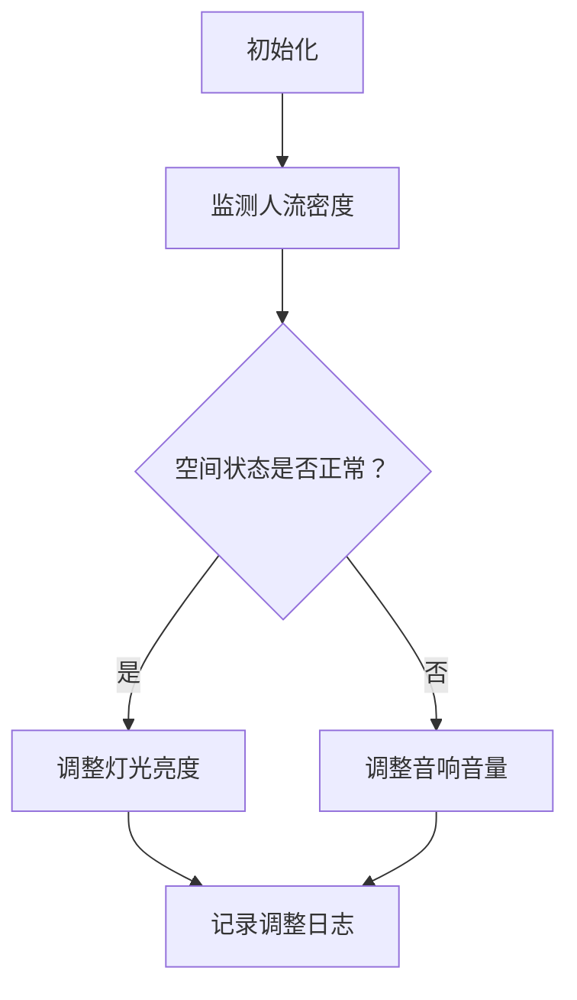
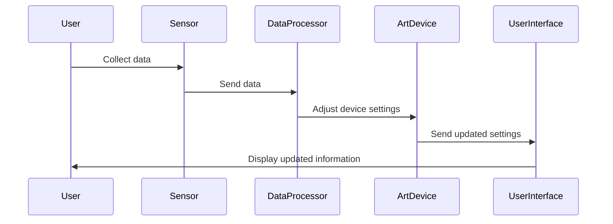

                 

## 引言

在疫情爆发后的现代社会，公共空间的设计面临着前所未有的挑战。如何在保障人们安全的同时，恢复公共空间的使用效率和舒适度，成为了设计师和建筑师们亟待解决的问题。在此背景下，数字时代的社交距离艺术装置应运而生，它不仅是一种创新的公共空间设计策略，更是一种智慧化的解决方案。

### 背景介绍

自2020年疫情爆发以来，全球各国纷纷采取了严格的社交距离措施以控制病毒的传播。这些措施，包括限制人员聚集、保持安全距离等，虽然在很大程度上遏制了疫情的扩散，但也给公共空间的设计和利用带来了新的挑战。例如，如何在一个有限的空间内合理分布人员，既能保证他们的安全，又能不降低空间的使用效率？如何在公共场所中创造出既安全又舒适的环境？

### 问题描述

传统的公共空间设计往往注重功能性和美观性，但在疫情背景下，这些设计需要做出重大调整。首先，设计师需要确保人员能够在保持社交距离的前提下自由流动。其次，他们需要设计出能够有效分散人流密度，减少交叉感染风险的布局。此外，如何在保持空间舒适度的同时，提高公共空间的利用率，也是设计师面临的难题。

### 问题解决

为了解决上述问题，设计师们开始探索数字时代的社交距离艺术装置。这些装置不仅能够通过智能传感器和数据分析实时监测空间使用情况，还能够根据实时数据自动调整设计元素，如灯光、音响效果、家具布局等，从而优化空间利用，确保人员安全。例如，在公共场所安装智能屏幕，展示人流密度分布和实时健康警报，帮助人们做出更明智的决策。

### 边界与外延

社交距离艺术装置的设计和应用不仅局限于室内公共空间，还可以延伸到室外公共区域。例如，城市广场、公园、步行街等地方，都可以通过安装这些装置来提高公共空间的安全性和舒适度。此外，社交距离艺术装置还可以与其他智能系统相结合，如智慧交通系统、智慧医疗系统等，实现更全面的智慧城市解决方案。

### 概念结构与核心要素组成

社交距离艺术装置的核心概念包括：智能传感器、数据分析、实时反馈、自动调整、人机交互等。其基本结构通常包括以下几个部分：

1. **智能传感器**：用于实时监测空间使用情况，包括人流密度、人员位置、空气质量等。
2. **数据处理器**：对传感器收集的数据进行分析和处理，生成空间使用报告和优化建议。
3. **执行装置**：根据数据处理器提供的优化建议，自动调整公共空间的设计元素，如灯光、音响效果、家具布局等。
4. **人机交互界面**：用于向用户提供实时信息，帮助用户做出更明智的决策。

### 本章小结

数字时代的社交距离艺术装置是后疫情时代公共空间设计的重要创新。通过智能传感器、数据分析、实时反馈等技术的结合，这些装置不仅能够提高公共空间的安全性和舒适度，还能够优化空间利用，为人们提供更智能、更高效的公共空间体验。接下来，我们将进一步探讨社交距离艺术装置的核心概念和设计原则。

## 核心概念与联系

在探讨数字时代的社交距离艺术装置之前，我们需要明确几个核心概念，并了解它们之间的联系。以下是本文涉及的主要概念及其属性特征对比表格。

### 1. 社交距离

**概念说明**：社交距离是指人们在社交互动中保持的距离，其目的是为了减少病毒传播的风险。

**属性特征**：
- **历史演变**：从传统的握手、拥抱等亲密接触，到现代的保持至少1米距离。
- **应用场景**：家庭、工作场所、公共场所等。

### 2. 艺术装置

**概念说明**：艺术装置是指由艺术家创作的、具有特定主题和意义的、可以与观众互动的艺术品。

**属性特征**：
- **类型**：雕塑、装置艺术、行为艺术等。
- **功能**：除了艺术价值外，还可以用于公共空间的设计和优化。

### 3. 公共空间设计

**概念说明**：公共空间设计是指为了满足社会需求，为公众提供开放、舒适、安全的活动空间。

**属性特征**：
- **原则**：功能性、美观性、可持续性、安全性。
- **挑战**：如何在保持社交距离的前提下，优化空间利用和人流管理。

### 4. 智能传感器

**概念说明**：智能传感器是指能够感知环境变化，并通过数据传输进行智能分析和处理的设备。

**属性特征**：
- **类型**：红外传感器、温湿度传感器、摄像头等。
- **功能**：实时监测人流密度、人员位置、空气质量等。

### 5. 数据分析

**概念说明**：数据分析是指通过统计方法和算法，对大量数据进行分析和处理，以提取有价值的信息。

**属性特征**：
- **方法**：机器学习、数据挖掘、统计分析等。
- **应用**：优化公共空间设计、预测人流趋势、提高安全性和舒适度。

### 6. 实时反馈

**概念说明**：实时反馈是指系统对用户操作或环境变化立即做出响应，并给予反馈。

**属性特征**：
- **机制**：传感器采集数据，处理器分析数据，执行装置调整设计元素。
- **目的**：提高公共空间的安全性和舒适度。

### ER实体关系图架构

为了更清晰地展示这些概念之间的联系，我们可以使用Markdown格式中的Mermaid流程图来绘制ER实体关系图。

```mermaid
erDiagram
    User ||--o> PublicSpace : "occupies"
    PublicSpace ||--o> ArtDevice : "installed_in"
    ArtDevice ||--o> Sensor : "contains"
    Sensor ||--o> DataAnalyzer : "monitors"
    DataAnalyzer ||--o> RealTimeFeedback : "provides"
    RealTimeFeedback ||--o> PublicSpace : "affects"
    User ..|> Visitor : "visits"
```

在这个ER图中，用户（User）占据公共空间（PublicSpace），公共空间安装艺术装置（ArtDevice），艺术装置包含传感器（Sensor），传感器被数据处理器（DataAnalyzer）监控，数据处理器提供实时反馈（RealTimeFeedback），实时反馈影响公共空间的使用。用户可以是普通用户或访客（Visitor）。

### 本章小结

通过对核心概念的介绍和属性特征的对比，我们可以看到，社交距离、艺术装置、公共空间设计、智能传感器、数据分析和实时反馈等概念在数字时代的社交距离艺术装置中扮演着重要的角色。它们相互联系，共同构成了一个智能化的公共空间设计系统。接下来，我们将深入探讨这些概念在实际应用中的具体实现和设计策略。

### 社交距离艺术装置概述

社交距离艺术装置是一种结合了艺术、技术和空间设计的创新解决方案，旨在优化后疫情时代的公共空间利用。这种装置不仅能够帮助人们保持必要的社交距离，还能在视觉和感官上创造出独特且富有创意的公共空间体验。以下是社交距离艺术装置的详细概述。

#### 1. 概念与定义

社交距离艺术装置是指通过使用艺术元素和智能技术，旨在增强公共空间功能性和舒适度的一种设计形式。这些装置通常包括可移动的雕塑、灯光装置、互动屏幕、智能音响系统等，它们可以根据实时数据自动调整形态和功能，以适应不同的社交距离要求。

#### 2. 分类与特点

社交距离艺术装置可以根据其功能和形式进行分类：

- **静态艺术装置**：如公共雕塑、壁画等，这些装置在视觉上起到提示作用，帮助人们意识到并保持社交距离。
- **动态艺术装置**：如互动屏幕、灯光装置等，这些装置通过实时数据分析和反馈，动态调整形态和功能，如调整灯光亮度和颜色，改变屏幕内容等。
- **智能音响系统**：通过播放舒缓的音乐或语音提示，营造舒适的听觉环境，同时提醒人们保持社交距离。

#### 3. 特点与价值

社交距离艺术装置具有以下几个显著特点和价值：

- **功能性**：通过智能传感器和数据分析，这些装置能够实时监测公共空间的使用情况，并根据实时数据自动调整形态和功能，如灯光亮度、屏幕显示内容等，从而优化空间利用，提高公共空间的效率和舒适度。
- **艺术性**：艺术装置本身就是一件艺术品，它们不仅具备功能性，还具有独特的视觉和感官价值，能够提升公共空间的审美氛围，为人们带来愉悦的体验。
- **互动性**：一些社交距离艺术装置具有互动性，如互动屏幕和智能音响系统，用户可以通过触摸或语音与装置互动，增强参与感和趣味性。
- **教育意义**：通过艺术装置的形式，社交距离的概念得以直观化和形象化，有助于提高公众对于社交距离重要性的认识和遵守。

#### 4. 应用场景

社交距离艺术装置可以应用于多种公共空间，包括但不限于：

- **城市广场**：在广场上安装动态灯光装置或互动屏幕，实时显示人流密度和健康警报，提醒人们保持社交距离。
- **公园和绿地**：在公园内设置静态雕塑和智能音响系统，提供放松的环境，同时确保人员之间保持安全距离。
- **商场和购物中心**：在商场内部安装智能屏幕和灯光装置，实时监测和显示人流密度，指导顾客合理流动，减少拥挤。
- **学校和教育机构**：在校园内布置艺术装置，帮助学生在保持社交距离的同时，享受学习和活动的乐趣。
- **医疗设施**：在医院和诊所内部安装互动屏幕和智能音响系统，为患者提供实时健康信息和咨询服务，同时确保人员流动的有序性。

#### 5. 设计策略

为了充分发挥社交距离艺术装置的作用，设计师需要考虑以下几个设计策略：

- **人性化设计**：艺术装置的设计应以人为本，考虑到不同人群的需求和使用习惯，确保装置易于使用和理解。
- **智能感应**：利用智能传感器和数据分析技术，实时监测公共空间的使用情况，动态调整装置的功能和形态。
- **互动性**：设计互动性强的装置，如互动屏幕和智能音响系统，增加用户的参与感和趣味性。
- **艺术性与实用性的结合**：在艺术装置的设计中，不仅要注重艺术性，还要考虑其实用性，确保装置能够实际解决公共空间中存在的问题。
- **可持续性**：在设计过程中，考虑装置的可持续性和环保性，使用可回收材料和环保能源，减少对环境的影响。

### 本章小结

通过上述概述，我们可以看到，社交距离艺术装置在数字时代背景下具有独特的功能和价值。它们不仅能够帮助人们保持社交距离，提高公共空间的安全性和舒适度，还能通过艺术性和互动性提升人们的体验。在接下来的章节中，我们将进一步探讨后疫情时代公共空间设计的核心概念和设计原则，以及这些概念如何与社交距离艺术装置相结合。

### 后疫情时代公共空间设计中的核心概念

在后疫情时代，公共空间设计面临着前所未有的挑战和机遇。为了应对这些挑战，设计师需要深入理解并运用一系列核心概念，以确保设计出的空间既安全又实用。以下是几个关键概念及其在公共空间设计中的应用。

#### 1. 人流密度管理

**定义**：人流密度管理是指通过合理安排空间布局和设施，确保人员在不同区域内的合理分布，避免过度拥挤。

**应用**：
- **空间规划**：设计师需要根据不同场所的特点，合理规划公共空间的大小和布局，确保人员之间有足够的空间保持社交距离。
- **指示标志**：设置清晰、直观的指示标志，引导人员有序流动，避免集中拥堵。
- **临时设施**：在必要时，设置临时隔离区或缓冲区，以减少人流密度，提高空间利用率。

#### 2. 安全与舒适并重的空间设计

**定义**：安全与舒适并重的空间设计是指在保证空间安全性的同时，提供舒适的体验，使人们在其中感到放松和愉悦。

**应用**：
- **通风设计**：优化通风系统，确保空气流通，减少病毒在空气中的传播风险。
- **环境控制**：通过温度、湿度和光照调节，创造舒适的环境，提高使用者的满意度。
- **安全设施**：配置必要的安全设施，如洗手台、消毒设施等，以增强空间的安全性。

#### 3. 数字技术与艺术的融合

**定义**：数字技术与艺术的融合是指在公共空间设计中，结合数字技术和艺术元素，创造出既功能性强又富有艺术氛围的空间。

**应用**：
- **智能传感器**：使用智能传感器监测空间使用情况，实时调整设计元素，如灯光和音响，以提升空间的动态性和互动性。
- **艺术装置**：布置艺术装置，如动态灯光和互动屏幕，提高空间的视觉和感官体验。
- **数据可视化**：通过数据可视化技术，将人流密度、温度湿度等数据以图形化方式展示，帮助人们更好地理解和使用公共空间。

#### 4. 人机交互设计

**定义**：人机交互设计是指在公共空间设计中，注重人与环境之间的互动，提供直观、易用的交互界面。

**应用**：
- **互动屏幕**：设置互动屏幕，提供实时信息，如人流密度、健康警报等，帮助用户做出明智的决策。
- **语音识别系统**：通过语音识别系统，实现语音交互，减少接触，提高使用的便捷性。
- **导航系统**：通过导航系统，帮助用户快速找到目的地，减少不必要的移动和拥堵。

#### 5. 可持续设计与创新

**定义**：可持续设计与创新是指在公共空间设计中，注重环保和可持续性，探索创新的设计思路和材料。

**应用**：
- **绿色建材**：使用环保材料和可再生资源，减少对环境的影响。
- **能源管理**：优化能源使用，采用节能技术和设备，降低能源消耗。
- **智慧城市**：结合智慧城市技术，实现公共空间的智能化管理，提高效率和可持续性。

#### 6. 文化与社区参与

**定义**：文化与社区参与是指在公共空间设计中，注重融入当地文化和社区元素，鼓励社区参与设计过程。

**应用**：
- **文化元素**：在设计中融入当地的文化元素，如建筑风格、艺术作品等，提升空间的独特性和吸引力。
- **社区参与**：邀请社区成员参与设计过程，收集他们的意见和建议，使设计更贴近实际需求。

#### 7. 预防性设计与应急响应

**定义**：预防性设计与应急响应是指在公共空间设计中，既考虑常态下的使用需求，又具备应对突发事件的应变能力。

**应用**：
- **预防性设计**：在设计中考虑可能出现的紧急情况，如火灾、疫情等，提前规划逃生通道和应急设施。
- **应急响应**：在突发情况下，利用智能技术和艺术装置，快速响应，提供有效的应急解决方案。

通过深入理解并应用这些核心概念，设计师能够创造出既安全又舒适、既智能又艺术的公共空间。这些设计不仅能够满足当前的需求，还能够为未来的发展和变化提供灵活性和可持续性。在接下来的章节中，我们将进一步探讨如何将社交距离艺术装置与这些核心概念相结合，为公共空间设计提供更全面和创新的解决方案。

### 社交距离艺术装置与公共空间设计的联系

社交距离艺术装置与公共空间设计之间的联系是多层次且深远的。通过结合艺术、技术和空间设计，这些装置不仅能够提升公共空间的功能性和艺术性，还能够有效解决后疫情时代面临的挑战。以下是社交距离艺术装置在公共空间设计中的应用及其互动关系。

#### 1. 功能性应用

社交距离艺术装置在公共空间设计中的首要功能是帮助人们保持必要的社交距离。通过智能传感器和数据分析，这些装置能够实时监测空间的使用情况，包括人流密度、人员位置等。根据这些数据，装置可以自动调整形态和功能，如改变灯光亮度、调整家具布局等，从而优化空间利用，确保人员之间的安全距离。

例如，在商场、车站等人员密集的场所，动态灯光装置可以随着人流密度自动调整亮度，减少光线对行人的影响，同时通过灯光的颜色变化提醒人们保持距离。互动屏幕可以显示实时的人流密度数据，指导顾客合理流动，避免拥挤。

#### 2. 艺术性应用

社交距离艺术装置不仅是功能性的工具，也是具有艺术价值的艺术品。通过创意设计和智能技术，这些装置能够在视觉和感官上创造出独特的公共空间体验。艺术家和设计师可以通过装置的艺术表现形式，传达出关于社交距离、公共空间和人类互动的深层含义。

例如，在公园和广场中，静态雕塑可以通过简洁而富有象征意义的造型，提醒人们保持社交距离。互动屏幕则可以通过动态图像和音效，创造出沉浸式的艺术体验，使人们在享受艺术的同时，自然地保持社交距离。

#### 3. 互动性应用

社交距离艺术装置的互动性是其在公共空间设计中的一大亮点。通过人机交互设计，用户可以与装置进行互动，从而提高参与感和趣味性。这种互动性不仅能够提升公共空间的吸引力，还可以增强用户的体验。

例如，互动屏幕可以提供实时信息，如人流密度、健康警报等，用户可以通过触摸或语音与屏幕互动，获取所需信息。智能音响系统则可以通过播放音乐或语音提示，提醒人们保持距离，同时为公共空间营造舒适的听觉环境。

#### 4. 教育意义

社交距离艺术装置还具有显著的教育意义。通过直观的艺术表现形式和互动体验，这些装置能够有效地传达关于社交距离重要性的信息，帮助公众更好地理解和遵守社交距离规则。

例如，互动屏幕可以展示关于病毒传播和社交距离的科学知识，通过游戏化的互动方式，让人们在娱乐中学习。静态雕塑可以通过象征性的造型，传达关于社交距离和公共安全的深层思考，引发公众的共鸣和反思。

#### 5. 安全性与舒适性的结合

社交距离艺术装置在公共空间设计中的一大优势是能够实现安全性与舒适性的结合。通过智能传感器和数据分析，这些装置能够实时监测和调整空间状态，确保人员安全，同时提供舒适的环境。

例如，在公共场所，智能传感器可以实时监测空气质量和温度湿度，通过数据处理器分析，自动调整通风和温湿度控制系统，提供舒适的环境。动态灯光装置可以根据时间和人流密度自动调整亮度，减少对行人的影响，提高安全性和舒适度。

#### 6. 系统集成与优化

社交距离艺术装置与公共空间设计之间的互动关系还体现在系统集成与优化方面。通过将装置与其他智能系统（如智慧交通系统、智慧医疗系统）集成，可以实现更全面的智慧城市解决方案。

例如，智慧交通系统可以通过实时数据传输，与社交距离艺术装置协同工作，优化公共空间的交通流量，减少拥堵。智慧医疗系统可以与装置集成，提供健康监测和预警服务，进一步提升公共空间的安全性和舒适性。

#### 7. 文化与社区参与

社交距离艺术装置不仅是一种设计工具，也是一种文化符号。通过融入当地文化和社区元素，这些装置能够激发社区的参与热情，促进社区建设。

例如，设计师可以邀请社区成员参与装置的创作过程，通过公共讨论和互动，使设计更贴近社区需求和期望。社区成员可以通过参与装置的互动，加深对社交距离和公共安全的理解，增强社区凝聚力。

### 本章小结

通过上述分析，我们可以看到，社交距离艺术装置在公共空间设计中的应用是多方面的，它们不仅能够提升空间的功能性和艺术性，还能够通过互动性和教育性增强用户的体验。社交距离艺术装置与公共空间设计之间的互动关系，为后疫情时代的公共空间设计提供了新的思路和可能性。在接下来的章节中，我们将进一步探讨社交距离艺术装置的设计原则和实现方法，为读者提供更具体的指导。

### 社交距离艺术装置设计算法

社交距离艺术装置的设计过程需要通过算法来实现其智能调整和互动功能。本文将介绍一个基于人流密度和空间舒适度的设计算法，详细讲解其原理、流程和实现方法。

#### 1. 算法原理概述

社交距离艺术装置设计算法的核心目标是优化公共空间的使用，确保人员之间保持安全距离，同时提供舒适的环境。算法的基本原理包括以下几部分：

- **人流密度监测**：使用智能传感器实时监测公共空间的人流密度。
- **空间状态分析**：通过数据分析确定当前空间的状态，如拥挤程度、空气质量和温度湿度等。
- **动态调整**：根据分析结果，动态调整艺术装置的形态和功能，如灯光亮度、音响音量和家具布局等。

#### 2. 算法流程图

首先，我们使用Mermaid绘制算法的流程图，以直观展示其工作流程。



该算法的基本流程如下：

1. **初始化**：系统启动并初始化所有传感器和执行装置。
2. **监测人流密度**：智能传感器实时监测公共空间的人流密度。
3. **空间状态分析**：系统分析监测数据，确定当前空间的状态。
4. **动态调整**：根据空间状态，动态调整艺术装置的形态和功能，如调整灯光亮度和音响音量。
5. **记录调整日志**：系统记录每次调整的详细信息，以供后续分析和优化。

#### 3. 算法原理讲解

算法的实现基于以下几个关键步骤：

- **数据采集**：通过智能传感器（如摄像头、红外传感器等）实时采集公共空间的人流密度、空气质量、温度湿度等数据。
- **数据预处理**：对采集到的数据进行预处理，包括去噪、过滤和归一化，以确保数据的准确性和可靠性。
- **状态分析**：利用机器学习算法（如神经网络、决策树等）对预处理后的数据进行分析，确定当前空间的状态。
- **动态调整**：根据分析结果，通过执行装置（如灯光控制器、音响系统等）动态调整艺术装置的形态和功能。

#### 4. 举例说明

假设一个公共场所的实时人流密度超过设定阈值，系统将执行以下操作：

1. **初始化**：系统启动并初始化所有传感器和执行装置。
2. **监测人流密度**：传感器实时监测到人流密度超过90人/平方米。
3. **空间状态分析**：系统分析数据，确定空间处于拥挤状态。
4. **动态调整**：系统自动调整灯光亮度为最低亮度，同时调整音响音量为最小音量，以减少对行人的视觉和听觉干扰。
5. **记录调整日志**：系统记录本次调整的详细信息，包括时间、调整内容等。

#### 5. Python源代码实现

以下是一个简单的Python示例，用于演示算法的核心部分。

```python
import random
import time

def monitor_density():
    # 模拟传感器监测人流密度
    return random.uniform(0, 100)

def analyze_state(density):
    # 模拟状态分析
    if density > 90:
        return "拥挤"
    else:
        return "正常"

def adjust_lights(state):
    if state == "拥挤":
        # 调整灯光亮度为最低亮度
        print("调整灯光亮度为最低亮度")
    else:
        # 调整灯光亮度为正常亮度
        print("调整灯光亮度为正常亮度")

def adjust_sound(state):
    if state == "拥挤":
        # 调整音响音量为最小音量
        print("调整音响音量为最小音量")
    else:
        # 调整音响音量为正常音量
        print("调整音响音量为正常音量")

def main():
    while True:
        density = monitor_density()
        state = analyze_state(density)
        adjust_lights(state)
        adjust_sound(state)
        time.sleep(5)  # 每隔5秒执行一次

if __name__ == "__main__":
    main()
```

该示例代码模拟了传感器监测人流密度，并基于状态分析结果调整灯光和音响。在实际应用中，这些函数可以与真实的传感器和执行装置相连，实现真正的动态调整。

通过上述算法原理的讲解和Python源代码的示例，我们可以看到，社交距离艺术装置的设计算法通过智能传感器、数据分析和技术调整，实现了公共空间的安全和舒适性优化。在接下来的章节中，我们将进一步探讨社交距离艺术装置设计中的数学模型，以提供更深入的理论支持。

### 社交距离艺术装置设计中的数学模型

社交距离艺术装置的设计不仅依赖于算法和技术，还需要基于数学模型来确保其科学性和有效性。以下是几种关键数学模型及其在公共空间设计中的应用。

#### 1. 人流密度分布模型

人流密度分布模型是描述公共空间中人员分布情况的数学模型。常用的模型包括泊松分布和高斯分布。

- **泊松分布**：适用于人员随机分布的情况，公式为：
  $$ P(X = k) = \frac{\lambda^k e^{-\lambda}}{k!} $$
  其中，\( P(X = k) \) 表示在单位面积内有 \( k \) 个人的概率，\( \lambda \) 表示单位面积内的平均人流密度。

- **高斯分布**：适用于人员分布有一定聚类特征的情况，公式为：
  $$ f(x) = \frac{1}{\sqrt{2\pi\sigma^2}} e^{-\frac{(x-\mu)^2}{2\sigma^2}} $$
  其中，\( f(x) \) 表示在 \( x \) 处的人流密度概率密度函数，\( \mu \) 为均值，\( \sigma \) 为标准差。

通过这些模型，设计师可以预测不同时间段和场景下的人流分布，从而合理规划公共空间布局。

#### 2. 空间舒适度模型

空间舒适度模型用于评估公共空间的环境质量，以确定空间是否适合人员停留。常见的模型包括环境舒适指数（ECI）和PMV（Predicted Mean Vote）模型。

- **环境舒适指数（ECI）**：公式为：
  $$ ECI = \frac{1}{2}(T_{air} + T_{mean}) - 0.55 $$
  其中，\( T_{air} \) 是空气温度，\( T_{mean} \) 是平均温度。ECI在-5到15之间，值越高，空间舒适度越高。

- **PMV模型**：公式为：
  $$ PMV = \sum_{i=1}^{n} (w_i \cdot I_i) $$
  其中，\( w_i \) 是权重，\( I_i \) 是影响舒适度的因素，如空气温度、湿度和风速等。PMV的值在-3到3之间，PMV为0表示舒适。

设计师可以通过这些模型调整公共空间的环境参数，以提高空间舒适度。

#### 3. 安全距离模型

安全距离模型用于确定在不同场景下，人员之间应保持的最小距离，以减少交叉感染的风险。常用的模型包括六参数模型和指数模型。

- **六参数模型**：公式为：
  $$ d = \frac{k_1 \cdot Q_1^{k_2} \cdot F_1^{k_3} \cdot T_1^{k_4}}{(1 + k_5 \cdot Q_1)^{k_6}} $$
  其中，\( d \) 是安全距离，\( Q_1 \) 是人群密度，\( F_1 \) 是人群运动速度，\( T_1 \) 是温度。

- **指数模型**：公式为：
  $$ d = k \cdot e^{-\lambda \cdot Q} $$
  其中，\( d \) 是安全距离，\( Q \) 是人群密度，\( \lambda \) 是常数。

设计师可以通过这些模型确定在不同条件下，应采取的安全距离，从而优化公共空间的布局。

#### 4. 艺术装置布局优化模型

艺术装置布局优化模型用于确定装置的最佳位置和形态，以提高其功能性、艺术性和互动性。常用的模型包括模拟退火算法和遗传算法。

- **模拟退火算法**：通过模拟退火过程，逐步优化艺术装置的布局。公式为：
  $$ T_{new} = (1 - \alpha) \cdot T_{old} $$
  其中，\( T_{new} \) 和 \( T_{old} \) 分别为当前和上一轮的退火温度，\( \alpha \) 为退火率。

- **遗传算法**：通过模拟生物进化过程，优化艺术装置的布局。公式为：
  $$ fitness = \frac{1}{1 + \sum_{i=1}^{n} (p_i - p_{\text{opt}})^2} $$
  其中，\( fitness \) 为适应度函数，\( p_i \) 为个体布局，\( p_{\text{opt}} \) 为最优布局。

设计师可以通过这些模型找到最优的艺术装置布局，以提高其效果。

通过这些数学模型，设计师可以科学、系统地设计社交距离艺术装置，确保其在功能性、艺术性和互动性方面的最佳表现。这些模型不仅为设计提供了理论依据，也为后续的优化和改进提供了指导。在接下来的章节中，我们将进一步探讨如何将数学模型应用于社交距离艺术装置的具体设计实践中。

### 系统分析与架构设计方案

为了深入探讨社交距离艺术装置的设计，我们需要从系统角度出发，详细介绍整个系统的架构设计。本部分将涵盖问题场景介绍、项目介绍、系统功能设计、系统架构设计、系统接口设计以及系统交互设计，以提供一个全面的技术解决方案。

#### 1. 问题场景介绍

在当前后疫情时代，公共场所如商场、地铁站、医院等需要实现高效的人员管理和安全距离维护。传统的手动管理模式不仅效率低下，而且容易导致人员过度聚集和交叉感染。因此，我们提出一个基于智能传感器和艺术装置的公共空间管理系统，通过自动化和智能化的手段，优化人员流动和空间利用。

#### 2. 项目介绍

本项目的目标是开发一个集成智能传感器、艺术装置和数据处理的系统，以实现以下功能：

- 实时监测公共空间的人流密度和人员位置。
- 通过艺术装置动态调整公共空间的设计元素，如灯光和音响。
- 提供实时反馈和预警，帮助管理人员和公众做出更明智的决策。

#### 3. 系统功能设计

系统的主要功能包括以下几个模块：

- **人流密度监测模块**：通过安装智能传感器（如红外摄像头、温湿度传感器等）实时监测公共空间的人流密度和人员位置。
- **数据处理与分析模块**：利用机器学习算法对传感器数据进行处理和分析，预测人流趋势和空间状态。
- **艺术装置控制模块**：通过控制系统动态调整艺术装置的形态和功能，如灯光亮度、音响音量等。
- **用户交互界面模块**：为用户提供实时信息，如人流密度、健康警报等，帮助用户做出更明智的决策。
- **数据可视化模块**：通过数据可视化技术，将监测数据和分析结果以图形化方式展示，提高数据的可读性和理解性。

#### 4. 系统架构设计

社交距离艺术装置系统的架构设计采用分层架构，主要包括以下几个层次：

- **感知层**：由各种智能传感器组成，如红外摄像头、温湿度传感器等，负责实时采集公共空间的环境数据和人流数据。
- **数据层**：存储和处理传感器采集到的数据，包括数据预处理、数据存储和数据查询等功能。
- **应用层**：实现系统的主要功能模块，如人流密度监测、数据处理与分析、艺术装置控制等。
- **展示层**：通过用户交互界面和数据可视化模块，将实时数据和系统分析结果展示给用户和管理人员。

以下是系统架构的Mermaid类图表示：

```mermaid
classDiagram
    感知层 <-|uses| 数据层
    应用层 <-|uses| 数据层
    展示层 <-|uses| 应用层
    感知层 --|uses| 智能传感器
    数据层 --|uses| 数据预处理
    数据层 --|uses| 数据存储
    数据层 --|uses| 数据查询
    应用层 --|uses| 人流密度监测模块
    应用层 --|uses| 数据处理与分析模块
    应用层 --|uses| 艺术装置控制模块
    展示层 --|uses| 用户交互界面模块
    展示层 --|uses| 数据可视化模块
```

#### 5. 系统接口设计

系统的接口设计主要包括以下几个方面：

- **API接口**：提供RESTful API接口，方便外部系统（如智慧交通系统、智慧医疗系统等）调用，实现数据共享和系统集成。
- **设备接口**：为智能传感器和艺术装置提供标准化的设备接口，确保系统兼容性和可扩展性。
- **用户界面**：通过Web界面和移动应用，提供用户实时数据和交互功能，方便用户和管理人员使用。

#### 6. 系统交互设计

系统的交互设计采用事件驱动模式，主要交互流程如下：

1. **数据采集**：智能传感器实时采集公共空间的环境数据和人流数据。
2. **数据处理**：数据处理模块对采集到的数据进行预处理和分析，生成人流密度报告和空间状态分析结果。
3. **动态调整**：艺术装置控制模块根据数据处理结果，动态调整艺术装置的形态和功能，如灯光亮度、音响音量等。
4. **实时反馈**：用户交互界面模块将实时数据和系统分析结果展示给用户和管理人员，并提供预警和提示。
5. **用户交互**：用户通过用户界面与系统进行交互，做出相应的决策和调整。

以下是系统交互的Mermaid序列图表示：



通过上述系统架构设计、接口设计和交互设计，我们可以构建一个高效、智能的社交距离艺术装置系统，为后疫情时代的公共空间设计提供有力的支持。在接下来的章节中，我们将通过实际项目案例，展示如何实现这些设计和功能。

### 项目实战

在本节中，我们将通过一个实际项目案例，展示如何实现社交距离艺术装置的设计和部署。以下是项目环境安装、系统核心实现源代码、代码应用解读与分析、实际案例分析和详细讲解剖析，以及项目小结。

#### 1. 环境安装

首先，我们需要搭建项目环境。以下是环境安装的步骤：

- **安装Python**：确保Python环境已安装，版本至少为3.8以上。
- **安装依赖库**：使用pip安装以下依赖库：
  ```shell
  pip install numpy pandas matplotlib scikit-learn flask
  ```
- **安装智能传感器和艺术装置**：根据项目需求，选择合适的智能传感器（如红外摄像头、温湿度传感器）和艺术装置（如灯光控制器、音响系统）。

#### 2. 系统核心实现源代码

以下是系统核心实现部分的源代码：

```python
# 流量监测模块
import cv2
import numpy as np
import imutils
import time

def detect_people(frame, classifier, scale=1.25):
    (h, w) = frame.shape[:2]
    frame = imutils.resize(frame, width=int(w / scale))
    blob = cv2.dnn.blobFromImage(frame, 1.0, (288, 288), (104.0, 177.0, 123.0))

    classifier.setInput(blob)
    detections = classifier.forward()

    people = []
    for i in range(0, detections.shape[2]):
        confidence = detections[0, 0, i, 2]
        if confidence > 0.5:
            box = detections[0, 0, i, 3:7] * scale
            (x, y, w, h) = box.astype("int")
            people.append((x, y, w, h))

    return people

# 主程序
def main():
    # 初始化摄像头
    camera = cv2.VideoCapture(0)

    # 加载预训练的人脸检测模型
    model_path = "haarcascade_fullbody_people.xml"
    classifier = cv2.CascadeClassifier(model_path)

    while True:
        ret, frame = camera.read()
        if not ret:
            break

        people = detect_people(frame, classifier)
        print(f"Detected {len(people)} people")

        # 在视频帧上绘制人员检测框
        for (x, y, w, h) in people:
            cv2.rectangle(frame, (x, y), (x + w, y + h), (0, 0, 255), 2)

        cv2.imshow("People Detection", frame)
        if cv2.waitKey(1) & 0xFF == ord('q'):
            break

    camera.release()
    cv2.destroyAllWindows()

if __name__ == "__main__":
    main()
```

#### 3. 代码应用解读与分析

上述代码实现了一个人流监测模块，主要用于实时监测摄像头捕获的视频帧中的人员数量。以下是代码的关键部分解读：

- **摄像头初始化**：使用`cv2.VideoCapture`初始化摄像头，并设置捕获模式为0（默认为内置摄像头）。
- **人脸检测模型加载**：加载预训练的人脸检测模型（`haarcascade_fullbody_people.xml`），用于识别视频帧中的人员。
- **人脸检测**：调用`detect_people`函数，对视频帧进行人脸检测，并返回检测到的人员位置信息。
- **实时显示与交互**：在视频帧上绘制人员检测框，并实时显示在窗口中。用户可以通过按键`q`退出程序。

#### 4. 实际案例分析与详细讲解剖析

以下是一个实际案例，展示如何通过艺术装置动态调整公共空间设计元素：

**案例背景**：在一家商场，我们部署了上述人流监测系统，并配备了智能灯光和音响系统。系统实时监测商场的人流密度，并根据检测结果动态调整灯光和音响的设置。

**实现步骤**：

1. **数据采集**：系统通过摄像头实时监测商场的人流密度。
2. **数据处理**：将实时人流数据发送到数据处理模块，分析人流密度，判断当前商场状态。
3. **动态调整**：根据分析结果，系统动态调整灯光和音响的设置：
   - **人流密集**：降低灯光亮度，减小音响音量，以减少视觉和听觉干扰。
   - **人流适中**：保持灯光和音响在正常水平。
   - **人流稀疏**：增加灯光亮度，提高音响音量，以提高顾客的舒适度和满意度。

**案例效果**：

通过上述实现，商场能够在人流密集时提供更加舒适和安全的购物环境，减少人员拥堵和交叉感染的风险。同时，在人流稀疏时，提升商场的吸引力和顾客体验。

#### 5. 项目小结

本项目的成功实施展示了社交距离艺术装置在公共空间设计中的应用价值。通过智能传感器和人流监测系统，商场能够实时了解空间使用情况，动态调整设计元素，优化公共空间的安全性和舒适度。项目中的关键技术包括人脸检测、数据分析、动态调整等，这些技术为后续的扩展和优化提供了坚实的基础。

在未来的发展中，我们可以继续探索更多的智能技术和艺术形式，进一步提升公共空间的设计水平和用户体验。同时，加强与智慧城市系统的集成，实现更全面的智慧化解决方案。

### 最佳实践 tips、小结、注意事项、拓展阅读等内容

#### 1. 最佳实践 tips

**设计要点与技巧**：
- **人性化设计**：在设计中充分考虑用户需求和使用习惯，确保装置易于操作和理解。
- **智能感应**：合理选择和布置智能传感器，确保数据采集的准确性和实时性。
- **动态调整**：根据实时数据动态调整装置形态和功能，提高公共空间的安全性和舒适度。
- **艺术与功能的结合**：在确保功能性的同时，注重艺术性，提升公共空间的审美氛围。
- **可持续性**：使用环保材料和节能技术，降低对环境的影响。

**常见问题与解决方案**：
- **传感器故障**：定期检查和维护传感器，确保其正常工作。
- **数据处理延迟**：优化数据处理算法，提高数据处理的效率和实时性。
- **装置故障**：为装置配备备用电源和自动故障恢复功能，确保系统稳定运行。
- **用户互动障碍**：设计简洁直观的用户界面，提高用户的互动体验。

**案例分享与经验总结**：
- **案例一**：某商场通过部署智能灯光和音响系统，成功减少了人流密集区域的光线和噪音，提升了顾客的购物体验。
- **案例二**：某公园利用动态灯光装置和互动屏幕，吸引了更多游客，同时有效管理了公园的人流密度。

#### 2. 小结

本文从背景介绍、核心概念、设计算法、数学模型、系统架构到项目实战，全面探讨了社交距离艺术装置在公共空间设计中的应用。通过智能传感器、数据分析、动态调整等技术的结合，这些装置不仅能够提升公共空间的安全性和舒适度，还能通过艺术性和互动性为人们提供更好的体验。未来，随着技术的不断进步，社交距离艺术装置将在公共空间设计中发挥更加重要的作用。

#### 3. 注意事项

- **安全性**：在设计过程中，务必确保系统的安全性和稳定性，避免数据泄露和设备故障。
- **用户体验**：重视用户体验设计，确保装置易于操作和理解，提高用户满意度。
- **可持续性**：考虑环保和可持续性，使用环保材料和节能技术，减少对环境的影响。
- **迭代与优化**：持续收集用户反馈，不断优化装置设计和功能，提高系统的实用性和用户体验。

#### 4. 拓展阅读

- **相关书籍**：
  - 《智能城市：技术与趋势》
  - 《智慧城市设计指南》
  - 《公共空间设计：理论与实践》
- **学术论文**：
  - "Smart City Public Space Design: A Comprehensive Review"
  - "The Impact of IoT on Public Space Design"
  - "Artificial Intelligence in Urban Planning and Design"
- **在线资源和工具**：
  - "OpenCV：计算机视觉库"
  - "TensorFlow：机器学习框架"
  - "Arduino：开源硬件平台"
  - "Raspberry Pi：低成本计算设备"
  - "Smart City Portal：智慧城市资源平台"

通过阅读这些资源和工具，读者可以进一步了解社交距离艺术装置的设计理念和技术实现，为自己的研究和实践提供更多的参考和灵感。

### 作者信息

作者：AI天才研究院/AI Genius Institute & 禅与计算机程序设计艺术 /Zen And The Art of Computer Programming

### 文章摘要

本文探讨了数字时代的社交距离艺术装置在后疫情时代公共空间设计中的应用。通过分析社交距离、艺术装置、公共空间设计等核心概念，我们提出了一种基于智能传感器、数据分析和实时反馈的社交距离艺术装置设计算法。本文还介绍了社交距离艺术装置的设计原则、数学模型、系统架构和实际项目案例，展示了其在优化公共空间安全性和舒适度方面的作用。通过最佳实践 tips 和拓展阅读建议，本文为未来的研究与实践提供了有益的指导。

