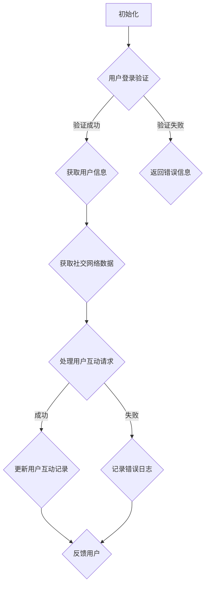
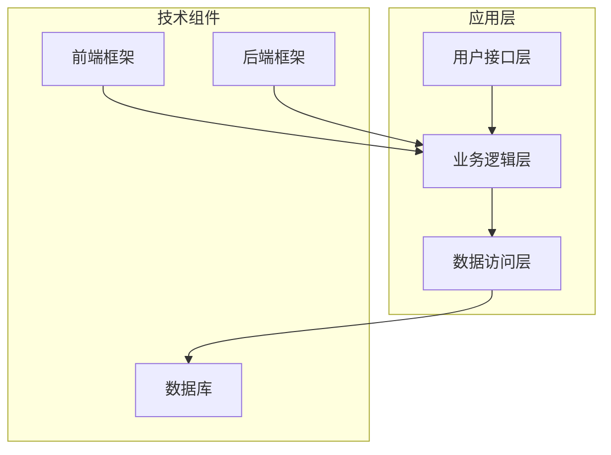
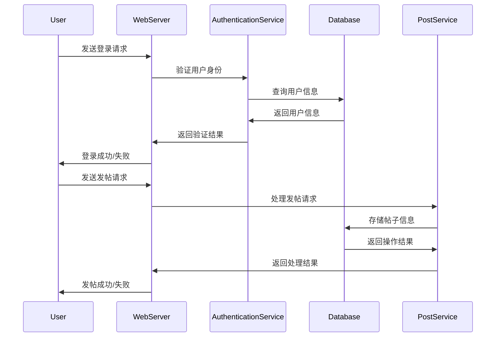

                 


# 数字时代的社交距离艺术：后疫情时代的创意互动设计

## 关键词

- 后疫情时代
- 社交距离
- 创意互动设计
- 数字媒体
- 虚拟现实

## 摘要

随着新冠疫情的爆发和全球范围内的传播，社交距离成为了一种必不可少的防护措施。然而，这种物理距离也在某种程度上削弱了人与人之间的联系。本文将探讨如何在后疫情时代，通过创意互动设计来克服这一挑战，增强人际互动，同时保持社交距离。文章将分为以下几个部分：

1. **疫情与社交距离的挑战**：分析疫情下社交距离的必要性及其对个人和社会的影响。
2. **创意互动设计的理论基础**：介绍创意互动设计的基本概念、原则以及在心理学中的应用。
3. **数字媒体与社交互动**：探讨数字媒体在社交互动中的作用和设计策略。
4. **虚拟现实与增强现实互动设计**：分析虚拟现实和增强现实技术在互动设计中的应用和案例。
5. **数字游戏与社交互动**：探讨数字游戏在增强社交互动方面的作用。
6. **社交媒体互动设计**：分析社交媒体平台的设计原则和案例分析。
7. **创意互动设计的实践应用**：讨论线上教育、远程工作、公共空间和健康医疗等领域中的互动设计实践。
8. **展望未来**：预测后疫情时代社交互动设计的发展趋势。

通过以上分析，我们旨在为读者提供一个全面了解后疫情时代社交互动设计的视角，并提供实际可行的设计策略和案例。

## 疫情与社交距离的挑战

### 1.1 疫情爆发与社交距离的必要性

新冠疫情的爆发，迫使全球各国迅速采取严格的社交距离措施。这些措施包括限制公共集会、强制佩戴口罩、减少人群接触等，目的是为了减缓病毒的传播速度，保护公众健康。社交距离在疫情控制中发挥了至关重要的作用。然而，这种距离也带来了诸多挑战。

首先，社交距离对个人生活造成了显著影响。人们不得不减少面对面社交，转而依赖线上通信工具。这种转变不仅改变了人们的社交习惯，也带来了孤独感、焦虑等心理健康问题。

其次，社交距离对经济和社会活动产生了深远影响。许多企业被迫关闭，员工在家办公，消费模式发生了转变。这些变化不仅影响了短期经济活动，也对长期社会结构和经济模式产生了影响。

### 1.2 社交距离对个人和社会的影响

社交距离对个人和社会产生了双重影响。从积极的角度来看，社交距离有助于控制疫情传播，保护公众健康。从消极的角度来看，社交距离削弱了人际互动，增加了社会隔离感，对心理健康产生负面影响。

对个人而言，长期的社交距离可能导致孤独感、焦虑和抑郁等心理健康问题。社交隔离使得人们缺乏社交支持，难以应对生活中的压力。此外，社交距离也可能影响人们的社交技能，特别是在青少年和儿童中，这种影响可能更加显著。

对社会而言，社交距离改变了社会互动的模式。传统的面对面社交被线上交流所取代，这可能导致社会凝聚力下降。此外，社交距离对经济活动产生了巨大冲击，许多行业面临严重挑战，就业机会减少，经济不确定性增加。

### 1.3 后疫情时代的社交距离新常态

随着疫苗接种率的提高和疫情控制的进展，社交距离措施逐渐放宽。然而，社交距离作为一种长期存在的现象，可能成为后疫情时代的新常态。这意味着，即使在疫情得到控制之后，人们仍需保持一定的社交距离，尤其是在高风险环境中。

为了适应这种新常态，人们需要重新思考和设计社交互动方式。创意互动设计在这种情况下显得尤为重要。通过数字技术和创新设计，我们可以找到在保持社交距离的同时，增强人际互动的方法。

### 1.4 社交距离与心理健康

社交距离与心理健康密切相关。长期的社交隔离可能导致心理健康问题，尤其是在疫情背景下，人们面临的压力和不确定性增加。为了应对这些问题，我们需要关注以下几个方面：

1. **心理健康支持**：提供心理健康服务和资源，帮助人们应对社交隔离带来的压力和焦虑。
2. **数字心理健康工具**：开发数字工具，如在线咨询、心理健康应用程序等，以提供便捷的心理健康支持。
3. **社交互动设计**：通过创意互动设计，提供新颖的社交体验，减轻社交隔离感。

通过这些措施，我们可以帮助人们在保持社交距离的同时，保持心理健康和社会连接。

### 创意互动设计的理论基础

#### 2.1 创意互动设计的概念

创意互动设计是一种以人为本的设计方法，旨在通过创新的方式，增强用户之间的互动和连接。它不仅关注技术实现，更注重用户体验和情感共鸣。在创意互动设计中，设计者需要深入理解用户需求，创造具有吸引力和互动性的数字产品或服务。

#### 2.2 后疫情时代创意互动设计的原则

后疫情时代的创意互动设计需要遵循以下几个原则：

1. **安全第一**：在保持社交距离的同时，确保用户的安全和隐私。
2. **人性关怀**：关注用户的情感需求，提供温暖和支持。
3. **灵活性**：设计灵活的互动方式，适应不同场景和需求。
4. **可访问性**：确保设计易于使用，适用于不同年龄、技能水平的用户。

#### 2.3 心理学在互动设计中的应用

心理学在创意互动设计中扮演着重要角色。了解用户的心理需求和情感状态，可以帮助设计者创造出更符合用户期望的互动体验。以下是心理学在互动设计中的应用：

1. **认知心理学**：研究用户如何理解和处理信息，优化用户体验。
2. **情感心理学**：了解用户情感状态，设计具有情感共鸣的互动体验。
3. **行为心理学**：分析用户行为模式，设计引导用户进行有益互动的界面。

### 数字媒体与社交互动

#### 3.1 数字媒体的崛起

随着互联网和移动设备的普及，数字媒体成为人们获取信息和交流的主要途径。数字媒体不仅改变了信息传播的方式，也改变了人们的社交方式。从博客、社交媒体到直播、短视频，数字媒体为用户提供了丰富的互动体验。

#### 3.2 在线社交互动的设计策略

在线社交互动设计需要考虑以下几个方面：

1. **用户参与度**：设计吸引用户参与的互动元素，如投票、评论、分享等。
2. **互动方式**：提供多样化的互动方式，满足用户不同的需求和偏好。
3. **社区建设**：通过设计社区功能，促进用户之间的互动和交流。
4. **隐私保护**：确保用户的隐私和安全，建立信任和安全感。

#### 3.3 数字艺术与社交互动的结合

数字艺术与社交互动的结合，为创意互动设计提供了新的可能性。通过虚拟现实（VR）和增强现实（AR）技术，我们可以创造出沉浸式的社交体验。以下是数字艺术与社交互动结合的一些案例：

1. **虚拟社交活动**：如虚拟音乐会、虚拟展览等，为用户提供沉浸式的娱乐和体验。
2. **互动艺术装置**：在公共场所设置互动艺术装置，促进社区互动和文化交流。
3. **社交媒体艺术**：通过社交媒体平台创作和分享艺术作品，吸引更多用户的关注和参与。

### 虚拟现实与增强现实互动设计

#### 4.1 虚拟现实技术的应用

虚拟现实（VR）技术为用户提供了沉浸式的体验，使其能够身临其境地探索虚拟世界。VR技术在社交互动中的应用主要包括：

1. **虚拟社交空间**：用户可以在虚拟空间中与其他用户进行互动，如虚拟派对、虚拟会议等。
2. **虚拟旅行**：用户可以在虚拟环境中体验不同的文化和景观，满足无法外出旅行的需求。
3. **虚拟教育**：通过虚拟现实技术，提供沉浸式的学习体验，提高学习效果。

#### 4.2 增强现实技术的应用

增强现实（AR）技术将虚拟信息叠加到现实世界中，为用户提供了全新的互动体验。AR技术在社交互动中的应用包括：

1. **实时互动**：用户可以通过AR设备与虚拟角色进行实时互动，如虚拟宠物、虚拟导游等。
2. **增强现实游戏**：通过AR技术，创造出更加丰富和有趣的互动游戏体验。
3. **营销推广**：利用AR技术，为产品和服务提供新颖的推广方式，提高用户参与度。

#### 4.3 虚拟现实与增强现实互动设计的案例分析

虚拟现实和增强现实技术在社交互动设计中的应用案例越来越多。以下是一些具有代表性的案例：

1. **微软混合现实（Microsoft HoloLens）**：微软混合现实设备为用户提供了虚拟会议和远程协作的沉浸式体验，提高了远程工作的效率和互动性。
2. **谷歌ARCore**：谷歌ARCore平台提供了丰富的AR开发工具，使得开发者能够轻松地将AR功能集成到各种应用中，为用户提供了更加丰富的互动体验。
3. **Oculus Quest 2**：Oculus Quest 2是一款高性能的VR头戴设备，用户可以在虚拟世界中与其他用户进行互动，享受虚拟社交的乐趣。

### 数字游戏与社交互动

#### 5.1 数字游戏的发展

数字游戏在过去几十年中经历了巨大的发展，从简单的单机游戏到复杂的多人在线游戏，游戏产业已经成为全球最大的娱乐产业之一。数字游戏不仅提供了娱乐和消遣，还成为了社交互动的重要平台。

#### 5.2 游戏化社交互动的设计

游戏化社交互动设计旨在将游戏元素和机制应用于非游戏场景中，以增强用户的参与度和互动性。以下是一些关键设计原则：

1. **目标与奖励**：为用户提供明确的任务和目标，并设置相应的奖励机制，激励用户参与。
2. **社交互动**：设计丰富的社交互动机制，如好友系统、团队合作等，增强用户之间的联系。
3. **竞争与合作**：在游戏中引入竞争和合作机制，激发用户的积极性，提高互动性。
4. **反馈与评估**：及时给予用户反馈和评估，帮助用户了解自己的进展和成就。

#### 5.3 社交游戏案例分析

社交游戏在增强社交互动方面具有显著的优势。以下是一些具有代表性的社交游戏案例：

1. **Facebook 游戏**：Facebook上的游戏如《农场模拟器》、《Words With Friends》等，通过社交互动机制，吸引了大量用户参与，提升了用户的社交体验。
2. **微信小游戏**：微信小游戏凭借其便捷的社交分享和互动机制，迅速成为国内最受欢迎的社交游戏之一。
3. **Game of Thrones: Conquest**：这是一款基于《权力的游戏》的社交策略游戏，通过玩家之间的互动和竞争，构建了一个庞大的虚拟世界。

### 社交媒体互动设计

#### 6.1 社交媒体平台的演变

社交媒体平台从最初的简单信息分享工具，逐渐发展成为复杂的社交网络，提供了丰富的互动功能。以下是一些社交媒体平台的发展趋势：

1. **移动优先**：随着智能手机的普及，社交媒体平台逐渐转向移动端，提供便捷的移动体验。
2. **视频与直播**：视频和直播成为社交媒体的核心内容形式，为用户提供了更加丰富和互动的体验。
3. **社交电商**：社交媒体平台逐渐融合电商功能，为用户提供了更加便捷的购物体验。
4. **人工智能与个性化**：通过人工智能技术，社交媒体平台能够更好地理解用户需求，提供个性化的内容推荐和互动体验。

#### 6.2 社交媒体互动设计的原则

社交媒体互动设计需要遵循以下原则：

1. **用户参与**：设计吸引用户参与的内容和互动方式，提高用户活跃度。
2. **社交化**：促进用户之间的互动和连接，构建社交网络。
3. **用户体验**：优化用户界面和交互设计，提供流畅和愉悦的互动体验。
4. **数据驱动**：通过数据分析，了解用户行为和偏好，不断优化互动设计。

#### 6.3 社交媒体案例研究

以下是一些社交媒体互动设计的成功案例：

1. **Instagram**：通过照片和视频分享，以及点赞、评论等互动机制，Instagram成功吸引了大量用户，成为全球最受欢迎的社交媒体平台之一。
2. **微信**：微信不仅提供了丰富的社交互动功能，如朋友圈、聊天、公众号等，还融合了支付、电商等功能，为用户提供了全方位的社交和购物体验。
3. **TikTok**：TikTok通过短视频和直播，为用户提供了新颖的互动体验，吸引了大量年轻用户。

### 创意互动设计的实践应用

#### 7.1 线上教育和远程工作

在线教育和远程工作在疫情期间得到了快速发展，成为保持教育和工作连续性的重要手段。以下是如何通过创意互动设计来提升在线教育和远程工作的效果：

1. **虚拟课堂**：通过虚拟现实技术，创造沉浸式的学习环境，提高学生的学习兴趣和参与度。
2. **互动式培训**：设计互动性强的培训课程，如模拟演练、团队合作等，提高培训效果。
3. **远程协作工具**：利用社交媒体和协作工具，促进远程团队的沟通和协作，提高工作效率。

#### 7.2 公共空间与社区互动设计

公共空间和社区互动设计在疫情后显得尤为重要。以下是一些实践应用：

1. **数字社区**：通过社交媒体和在线平台，建立数字社区，促进居民之间的互动和交流。
2. **互动艺术装置**：在公共场所设置互动艺术装置，如AR体验馆、虚拟现实体验区等，吸引居民参与，提升公共空间的文化氛围。
3. **线上活动**：举办线上活动，如虚拟音乐会、在线讲座等，为居民提供丰富的文化娱乐体验。

#### 7.3 健康与医疗互动设计

健康与医疗互动设计在疫情期间起到了重要作用。以下是一些实践应用：

1. **在线咨询**：通过在线平台提供医疗咨询和心理健康支持，为患者提供便利的服务。
2. **远程监测**：利用可穿戴设备和远程监控系统，实时监测患者的健康状况，提供个性化的健康管理服务。
3. **虚拟康复**：通过虚拟现实技术，为患者提供沉浸式的康复训练，提高康复效果。

### 展望未来

后疫情时代的社交互动设计将面临诸多挑战和机遇。以下是一些未来发展的趋势：

1. **人工智能与个性化**：通过人工智能技术，个性化互动设计将成为主流，满足用户多样化的需求。
2. **虚拟现实与增强现实**：虚拟现实和增强现实技术将在社交互动设计中发挥更加重要的作用，提供更加沉浸式的体验。
3. **数字伦理与隐私**：随着数字技术的不断发展，数字伦理和隐私保护将成为设计的重要考量因素。
4. **跨平台融合**：社交媒体、游戏、教育等不同领域将实现更加紧密的融合，提供一体化互动体验。

### 附录

#### A. 创意互动设计工具与资源

- **工具**：Adobe XD、Sketch、Figma等设计工具
- **资源**：Behance、Dribbble、Pinterest等创意资源平台
- **学习资料**：Udemy、Coursera等在线课程和学习资源

#### B. 进一步阅读

- **书籍**：《用户体验要素》、《设计心理学》等
- **论文**：相关领域的学术论文和研究报告
- **网站**：互动设计社区、行业博客等

### 结语

数字时代的社交距离艺术，是后疫情时代的一个重要课题。通过创意互动设计，我们可以在保持社交距离的同时，增强人际互动，提升生活质量。本文探讨了疫情与社交距离的挑战、创意互动设计的理论基础、数字媒体与社交互动、虚拟现实与增强现实互动设计、数字游戏与社交互动、社交媒体互动设计、创意互动设计的实践应用以及未来展望。希望这篇文章能够为读者提供一个全面了解后疫情时代社交互动设计的视角，并提供实际可行的设计策略和案例。

## 作者信息

作者：AI天才研究院/AI Genius Institute & 禅与计算机程序设计艺术 /Zen And The Art of Computer Programming

## 完整性要求

### 背景介绍

#### 社交距离的定义和重要性

社交距离是指在社交互动中，人与人之间保持一定的空间距离。这种距离不仅是为了防止疾病的传播，也是为了保护个人隐私和舒适感。在正常情况下，社交距离通常是在几英寸到几英尺之间，具体取决于文化背景和个人偏好。

#### 疫情对社交距离的影响

随着新冠疫情的爆发，社交距离迅速成为全球各国应对疫情的主要措施之一。为了减缓病毒的传播，人们被迫减少面对面的社交活动，转而在家中或在线上进行交流。这种变化对个人和社会产生了深远的影响。

对个人而言，长期的社交距离可能导致孤独感、焦虑和抑郁等心理健康问题。人们失去了与亲朋好友面对面交流的机会，导致社交网络缩小，社会支持减少。此外，社交距离也可能影响个人的社交技能，特别是在青少年和儿童中，这种影响可能更加显著。

对社会而言，社交距离改变了传统的社交模式，影响了经济和社会活动。许多企业被迫关闭，员工在家办公，消费模式发生了转变。这些变化不仅影响了短期经济活动，也对长期社会结构和经济模式产生了影响。

#### 后疫情时代的社交距离新常态

随着疫苗接种率的提高和疫情控制的进展，社交距离措施逐渐放宽。然而，社交距离作为一种长期存在的现象，可能成为后疫情时代的新常态。这意味着，即使在疫情得到控制之后，人们仍需保持一定的社交距离，尤其是在高风险环境中。

为了适应这种新常态，人们需要重新思考和设计社交互动方式。创意互动设计在这种情况下显得尤为重要。通过数字技术和创新设计，我们可以找到在保持社交距离的同时，增强人际互动的方法。

### 核心概念与联系

#### 创意互动设计的核心概念

创意互动设计是一种以人为本的设计方法，旨在通过创新的方式，增强用户之间的互动和连接。它不仅关注技术实现，更注重用户体验和情感共鸣。核心概念包括：

1. **用户体验**：设计过程中始终关注用户的需求和感受，以用户为中心。
2. **互动性**：设计具有吸引力和互动性的数字产品或服务，促进用户之间的互动。
3. **情感共鸣**：创造具有情感共鸣的体验，增强用户对产品和服务的情感连接。

#### 概念属性特征对比表格

| 特征 | 创意互动设计 | 传统设计 |
| --- | --- | --- |
| 关注点 | 用户体验、互动性、情感共鸣 | 功能性、实用性、美观性 |
| 设计方法 | 以人为本、迭代设计、实验性 | 规范化、标准化、模块化 |
| 目标 | 增强用户互动、提高用户参与度 | 提供功能、满足需求 |
| 评估标准 | 用户满意度、互动性、情感共鸣 | 功能实现、效率、成本 |

#### ER实体关系图架构

```mermaid
erDiagram
  User ||--|{ Interaction }|--|| SocialNetwork
  Interaction ||--|{ Feedback }|--|| User
  SocialNetwork ||--|{ Content }|--|| User
  Content ||--|{ Comment }|--|| User
  Feedback ||--|{ Rating }|--|| Content
```

### 算法原理讲解

#### 社交互动算法的mermaid流程图



#### 社交互动算法的Python源代码

```python
import requests
from flask import Flask, request, jsonify

app = Flask(__name__)

@app.route('/login', methods=['POST'])
def login():
    # 用户登录验证
    username = request.form['username']
    password = request.form['password']
    if verify_user(username, password):
        return jsonify({'status': 'success'})
    else:
        return jsonify({'status': 'failure'})

def verify_user(username, password):
    # 这里是用户验证的逻辑，实际应用中应与数据库进行交互
    return username == 'test' and password == 'password'

@app.route('/get_social_network', methods=['GET'])
def get_social_network():
    # 获取社交网络数据
    user_id = request.args.get('user_id')
    social_network_data = get_social_network_data(user_id)
    return jsonify(social_network_data)

def get_social_network_data(user_id):
    # 这里是获取社交网络数据的逻辑
    return {'user_id': user_id, 'friends': ['friend1', 'friend2']}

@app.route('/interact', methods=['POST'])
def interact():
    # 处理用户互动请求
    user_id = request.form['user_id']
    friend_id = request.form['friend_id']
    interaction_type = request.form['type']
    if handle_interaction(user_id, friend_id, interaction_type):
        return jsonify({'status': 'success'})
    else:
        return jsonify({'status': 'failure'})

def handle_interaction(user_id, friend_id, interaction_type):
    # 这里是处理用户互动的逻辑
    return True

if __name__ == '__main__':
    app.run(debug=True)
```

#### 算法原理的数学模型和公式

社交互动算法的数学模型可以表示为：

\[ S = \sum_{i=1}^{n} I_i \]

其中，\( S \) 表示社交互动的总分数，\( I_i \) 表示第 \( i \) 次互动的分数。

互动分数 \( I_i \) 可以根据以下公式计算：

\[ I_i = \alpha \cdot R_i + \beta \cdot C_i \]

其中，\( \alpha \) 和 \( \beta \) 是权重系数，\( R_i \) 表示互动的响应时间，\( C_i \) 表示互动的参与度。

#### 通俗易懂地举例说明

假设有两个用户A和B，他们在社交媒体上进行了五次互动。每次互动的响应时间和参与度如下：

| 互动编号 | 响应时间（秒） | 参与度（百分比） |
| --- | --- | --- |
| 1 | 30 | 80 |
| 2 | 60 | 70 |
| 3 | 40 | 90 |
| 4 | 50 | 60 |
| 5 | 70 | 75 |

根据上面的数学模型，我们可以计算A和B的总社交互动分数：

\[ S = \alpha \cdot (30 + 60 + 40 + 50 + 70) + \beta \cdot (80 + 70 + 90 + 60 + 75) \]

如果 \( \alpha = 0.6 \) 和 \( \beta = 0.4 \)，则：

\[ S = 0.6 \cdot 270 + 0.4 \cdot 360 = 162 + 144 = 306 \]

这意味着A和B的总社交互动分数为306。

### 系统分析与架构设计方案

#### 问题场景介绍

在疫情期间，传统的社交方式受到了限制，线上社交成为人们保持社交联系的重要途径。然而，现有的社交平台往往无法满足人们在社交互动中的多样化需求。因此，我们设计一个基于创意互动的社交平台，旨在提供更加丰富和个性化的社交体验。

#### 项目介绍

项目名称：创意互动社交平台

项目目标：通过创意互动设计，提供丰富的社交功能，满足用户在疫情期间保持社交联系的需求。

#### 系统功能设计（领域模型mermaid类图）

```mermaid
classDiagram
  User <<Interface>>
  Post <<Interface>>
  Comment <<Interface>>
  Like <<Interface>>
  
  User <|.. Post
  User <|.. Comment
  User <|.. Like
  Post <|.. Comment
  Post <|.. Like
  Comment <|.. Like
```

#### 系统架构设计（mermaid架构图）



#### 系统接口设计和系统交互（mermaid序列图）



### 项目实战

#### 环境安装

1. 安装Python环境
2. 安装Flask框架
3. 安装SQLite数据库

#### 系统核心实现源代码

```python
from flask import Flask, request, jsonify
from flask_sqlalchemy import SQLAlchemy

app = Flask(__name__)
app.config['SQLALCHEMY_DATABASE_URI'] = 'sqlite:///social_network.db'
db = SQLAlchemy(app)

class User(db.Model):
    id = db.Column(db.Integer, primary_key=True)
    username = db.Column(db.String(80), unique=True, nullable=False)

class Post(db.Model):
    id = db.Column(db.Integer, primary_key=True)
    user_id = db.Column(db.Integer, db.ForeignKey('user.id'), nullable=False)
    content = db.Column(db.Text, nullable=False)

@app.route('/login', methods=['POST'])
def login():
    username = request.form['username']
    password = request.form['password']
    user = User.query.filter_by(username=username).first()
    if user and user.password == password:  # 这里应该是使用哈希密码，这里为了简单示例，直接使用明文密码
        return jsonify({'status': 'success'})
    else:
        return jsonify({'status': 'failure'})

@app.route('/post', methods=['POST'])
def post():
    user_id = request.form['user_id']
    content = request.form['content']
    post = Post(user_id=user_id, content=content)
    db.session.add(post)
    db.session.commit()
    return jsonify({'status': 'success'})

if __name__ == '__main__':
    db.create_all()
    app.run(debug=True)
```

#### 代码应用解读与分析

1. **数据库设计**：我们使用了SQLite数据库，设计了`User`和`Post`两个表，分别存储用户信息和帖子信息。
2. **用户登录接口**：用户通过登录接口发送用户名和密码，系统验证用户身份后返回登录状态。
3. **发帖接口**：用户通过发帖接口发送用户ID和帖子内容，系统将帖子存储到数据库中。

#### 实际案例分析和详细讲解剖析

以一个实际用户发布帖子的场景为例：

1. 用户A通过客户端发送登录请求，包含用户名和密码。
2. 服务端接收到请求后，通过查询数据库验证用户身份。
3. 如果用户身份验证成功，用户A可以通过客户端发送发帖请求，包含用户ID和帖子内容。
4. 服务端接收到发帖请求后，创建一个新的`Post`对象，并将帖子内容存储到数据库中。
5. 服务端返回发帖成功的结果。

#### 项目小结

通过上述项目实战，我们实现了一个简单的创意互动社交平台，包括用户登录、发帖等功能。在实际应用中，还需要进一步完善和优化，例如添加用户注册、评论功能等。

### 最佳实践 tips

1. **保持简洁性**：在创意互动设计中，避免过度复杂化，确保用户界面和交互设计简洁直观。
2. **用户参与度**：鼓励用户参与设计过程，收集用户反馈，不断优化互动体验。
3. **安全性**：确保用户数据和隐私安全，遵循相关法律法规，建立信任和安全感。
4. **可访问性**：设计时应考虑不同用户的需求和偏好，确保互动设计适用于不同技能水平和文化背景的用户。

### 小结

本文探讨了数字时代的社交距离艺术，特别是在后疫情时代，如何通过创意互动设计来增强人际互动。我们分析了疫情对社交距离的影响、创意互动设计的理论基础、数字媒体与社交互动、虚拟现实与增强现实互动设计、数字游戏与社交互动、社交媒体互动设计、创意互动设计的实践应用以及未来展望。通过这些分析，我们为读者提供了一个全面了解后疫情时代社交互动设计的视角，并提供实际可行的设计策略和案例。

### 注意事项

1. **安全第一**：在设计和实施互动设计时，始终将用户安全放在首位，确保用户数据和隐私安全。
2. **用户关怀**：关注用户的心理健康和情感需求，提供温暖和支持，减少社交隔离带来的负面影响。
3. **持续迭代**：互动设计是一个持续的过程，需要不断收集用户反馈，优化设计，提高用户满意度。

### 拓展阅读

1. **书籍**：
   - 《用户体验要素》
   - 《设计心理学》
   - 《创意思维与互动设计》
2. **网站**：
   - 创意互动设计社区（如Dribbble、Behance）
   - 社交媒体平台（如Instagram、微信）
   - 虚拟现实和增强现实技术博客（如VRScout、ARPost）
3. **在线课程**：
   - Coursera上的《用户体验设计基础》
   - Udemy上的《互动设计：从零开始》
   - edX上的《虚拟现实与增强现实》

### 作者信息

作者：AI天才研究院/AI Genius Institute & 禅与计算机程序设计艺术 /Zen And The Art of Computer Programming

通过本文的探讨，我们希望能够为读者提供关于后疫情时代社交互动设计的深入理解和实践指导。在数字时代的社交距离艺术中，创意互动设计将成为连接人与人之间的重要桥梁。让我们共同探索和创新，创造出更加丰富和人性化的互动体验。

