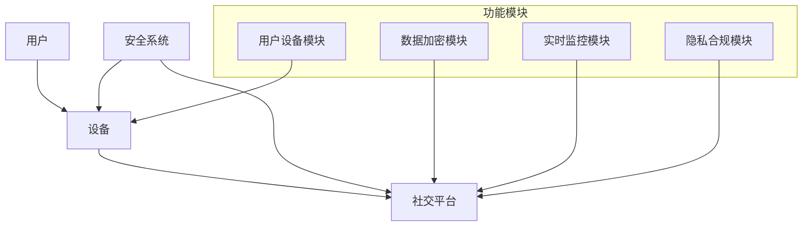
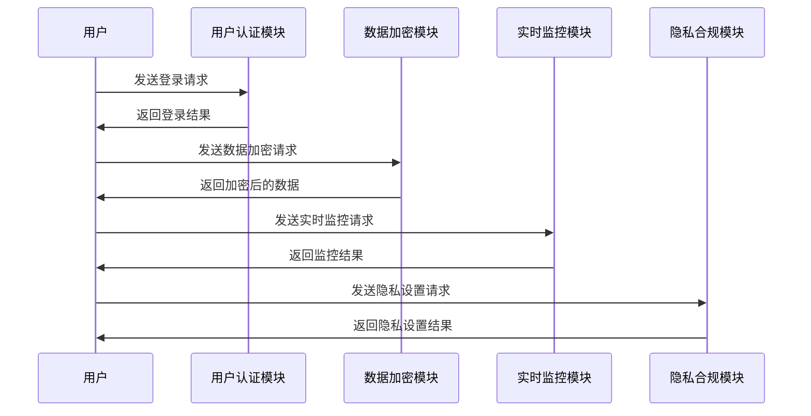

                 

### 数字时代的社交距离：科技辅助下的安全互动

#### 关键词

- 数字时代
- 社交距离
- 安全互动
- 科技辅助
- 数据隐私

#### 摘要

随着数字技术的迅猛发展，人们的生活方式和社会交往模式发生了深刻的变革。在这个充满不确定性和安全隐患的数字时代，如何保持合理的社交距离、保障互动安全成为了一个亟待解决的问题。本文将从背景概述、核心概念、算法原理、数学模型、系统架构以及项目实战等多个方面，深入探讨科技如何辅助实现数字时代的安全互动，为个人和社会提供有效的解决方案。

---

## 第一部分：背景与概述

### 第1章：数字时代下的社交距离

#### 1.1 问题背景

在过去的几十年里，互联网和移动通信技术的快速发展，极大地改变了我们的生活方式和社会结构。特别是在全球化和信息化浪潮的推动下，数字化进程对社会的各个方面产生了深远的影响，从经济到文化，从个人生活到公共事务，无不烙上了数字化的印记。

然而，这种变化也带来了新的挑战，尤其是在社交距离方面。传统的人际交往模式被数字化所替代，人们的社交方式从面对面的交流转向线上互动。这种转变在一定程度上满足了人们对于便捷、高效交流的需求，但也引发了一系列问题。

首先，数字时代的社会变迁带来了社交距离的变化。随着网络社交工具和平台的普及，人们可以轻松地与世界各地的人建立联系，但与此同时，现实生活中的面对面社交却在逐渐减少。这种趋势不仅影响了人际交往的质量，还对人们的心理健康产生了负面影响。

其次，社交距离的重要性在疫情背景下尤为凸显。为了防止病毒的传播，全球范围内的社交活动受到了严格的限制，人们被迫保持一定的社交距离。这种物理距离的维持虽然保护了公共安全，但也在一定程度上削弱了人际关系的紧密程度，使得社交互动变得更加疏离。

最后，科技辅助下的安全互动成为保障社交安全的必要手段。在数字时代，个人隐私和数据安全成为关注的焦点。如何在享受科技带来的便利的同时，保护自己的隐私和信息安全，成为了每个人都需要面对的挑战。

#### 1.2 问题描述

在数字时代，社交安全面临的需求和挑战主要包括以下几个方面：

1. **社交安全的需求**：如何保障用户在数字社交环境中的个人隐私和信息安全，防止信息泄露和网络诈骗，是数字时代社交安全的核心需求。

2. **技术挑战**：数字时代社交安全面临的主要技术挑战在于如何平衡技术便利性与个人隐私保护。传统的加密技术和安全认证方式在应对新型网络威胁时显得力不从心，需要不断创新和优化。

3. **隐私保护与数据利用的平衡**：在数字时代，数据已经成为重要的战略资源。如何在保护个人隐私的同时，有效利用数据为社交互动提供更好的体验和服务，是一个亟待解决的问题。

4. **新型社交模式的安全保障**：随着社交媒体、在线游戏等新型社交模式的兴起，如何对这些新型应用进行安全监管，防止网络欺凌、色情信息传播等不良行为，也是数字时代社交安全的重要议题。

#### 1.3 问题解决

为了解决数字时代社交安全面临的需求和挑战，科技界提出了一系列技术手段和解决方案：

1. **加密技术**：通过加密算法对用户数据进行加密，确保数据在传输和存储过程中的安全性。

2. **隐私计算**：利用隐私计算技术，在保护用户隐私的同时，实现数据的分析和利用。

3. **行为分析**：通过机器学习和人工智能技术，对用户行为进行分析，识别异常行为和潜在风险。

4. **安全认证**：采用多重身份验证机制，提高用户身份的验证强度，防止未授权访问。

5. **智能监控**：利用智能监控系统，实时监控社交平台的动态，及时发现和处理异常情况。

6. **数据隐私法规**：遵循全球主要国家和地区的数字隐私法规，确保数据处理的合法性和合规性。

通过这些技术手段和解决方案的综合运用，数字时代下的社交安全得以有效保障，为个人和社会的互动提供了安全、可靠的环境。

#### 1.4 边界与外延

数字时代社交安全不仅涉及到技术层面的解决方案，还涉及到法律和道德层面的边界与外延：

1. **数字隐私法规**：不同国家和地区的数字隐私法规存在差异，需要在全球范围内进行协调和统一，以保障用户数据的一致性和合法性。

2. **隐私保护标准**：制定统一的隐私保护标准，规范数据收集、处理和存储的流程，确保用户隐私得到最大程度的保护。

3. **道德伦理**：在数字时代，社交安全不仅是一个技术问题，也是一个道德伦理问题。如何在保障用户隐私和信息安全的同时，维护公平、公正的社交环境，是值得深思的问题。

4. **科技进步方向**：随着科技的不断进步，社交安全也将面临新的挑战和机遇。未来，需要不断探索新的技术手段，如量子加密、区块链等，以应对日益复杂的网络安全威胁。

#### 1.5 概念结构与核心要素组成

为了深入理解数字时代社交安全的本质，我们需要从概念结构和核心要素的角度进行剖析：

1. **核心概念**：数字时代、社交距离、安全互动、科技辅助。

2. **要素组成**：
   - **线上社交工具**：包括社交媒体、即时通讯应用、在线论坛等，是数字时代社交互动的主要平台。
   - **智能设备**：如智能手机、平板电脑、智能手表等，是用户进行社交互动的重要工具。
   - **数据技术**：包括数据采集、存储、分析和挖掘等技术，是保障社交安全的重要手段。
   - **隐私保护措施**：如加密技术、匿名化处理、多重认证等，是保护用户隐私和信息安全的关键。

通过对核心概念和要素的深入剖析，我们可以更好地理解数字时代社交安全的基本框架，为后续的分析和讨论奠定基础。

### 小结

数字时代的社交距离问题不仅关乎个人隐私和信息安全，更涉及到整个社会的稳定和健康发展。通过科技辅助下的安全互动，我们有望在保障社交安全的同时，充分发挥数字技术的优势，构建一个安全、和谐、高效的数字社交环境。在接下来的部分中，我们将进一步探讨数字时代、社交距离、安全互动等核心概念，并深入分析相关算法原理、数学模型和系统架构，为解决数字时代社交安全提供全面的技术支持。

---

## 第二部分：核心概念与联系

### 第2章：核心概念原理

#### 2.1 数字时代

数字时代，是指以数字技术为核心，数字化生活方式广泛普及的时代。在数字时代，信息传播的速度和广度达到了前所未有的高度，数据成为新的生产要素，数字经济成为推动经济增长的重要动力。数字化进程不仅改变了人们的生产方式，还深刻影响了社会结构和文化形态。

**特征**：

1. **信息传播速度快**：互联网技术的普及使得信息可以在瞬间传播到全球的每一个角落。
2. **数据量爆发式增长**：大数据技术的应用，使得海量数据的存储、处理和分析成为可能。
3. **数字化生活方式普及**：从线上购物、移动支付到智能家居，数字化生活方式已经成为人们日常生活的一部分。

数字时代的特征使得社交互动方式发生了重大变革。人们不再局限于面对面的交流，而是通过社交媒体、即时通讯工具等线上平台进行互动。这种变化带来了社交距离的重新定义和社交安全的新挑战。

**影响**：

1. **社交距离变化**：数字技术使得人们可以轻松地跨越地理障碍进行社交，但同时也削弱了现实生活中的面对面交流，增加了心理距离。
2. **心理健康影响**：过度依赖线上社交可能导致人际关系的疏离和心理健康问题。
3. **社交网络结构变化**：数字时代下的社交网络更加复杂，节点和边的关系更加多样化。

**数字时代的社交互动特点**：

1. **虚拟化**：社交互动主要发生在虚拟空间，如社交媒体平台和在线论坛。
2. **实时性**：即时通讯工具和社交媒体的实时互动功能，使得信息传播更加迅速。
3. **去中心化**：社交网络结构从传统的中心化向去中心化转变，用户既是内容的创造者也是消费者。

#### 2.2 社交距离

社交距离是指在社会互动中，个体之间的心理距离和物理距离。在数字时代，社交距离变得更加复杂，涵盖了线上和线下两种不同的形式。

**定义**：

1. **心理距离**：指个体在心理上与他人保持的距离感，包括信任程度、熟悉程度和亲密程度。
2. **物理距离**：指个体在现实空间中与他人保持的距离，如面对面交流时的距离。

**影响**：

1. **人际交往质量**：社交距离的变化直接影响了人际交往的质量。过近的社交距离可能导致压力和不适，过远的社交距离则可能导致疏离和孤独。
2. **心理健康**：社交距离的失衡会影响个体的心理健康，如过度依赖线上社交可能导致心理依赖和孤独感。
3. **社交网络结构**：社交距离的变化会影响社交网络的结构，改变节点和边的关系，从而影响社交网络的稳定性和效能。

**数字时代的社交距离特点**：

1. **数字化缩短物理距离**：数字技术使得人们可以轻松跨越地理障碍进行社交，缩短了物理距离。
2. **心理距离复杂化**：线上社交的虚拟化增加了个体之间的心理距离，使得关系更加疏离和不可捉摸。
3. **社交距离的动态性**：社交距离在数字时代变得更加动态，可以随时调整和变化。

#### 2.3 安全互动

安全互动是指在数字时代，通过科技手段保障社交过程中的安全，确保个人隐私和信息安全。在数字时代，安全互动不仅是技术问题，更是社会问题。

**定义**：

安全互动涉及多个层面：

1. **数据加密**：通过加密算法对数据进行加密，确保数据在传输和存储过程中的安全性。
2. **隐私保护**：通过隐私计算和匿名化处理，保护用户的隐私。
3. **安全认证**：通过多重身份验证和权限控制，确保只有授权用户可以访问敏感信息。
4. **智能监控**：利用机器学习和人工智能技术，实时监控社交平台，及时发现和处理潜在的安全威胁。

**要素**：

1. **数据加密**：通过对称加密和非对称加密技术，保障数据传输和存储的安全。
2. **隐私保护**：利用差分隐私、同态加密等隐私保护技术，实现数据的隐私计算。
3. **安全认证**：通过用户身份验证、生物识别等手段，提高系统的安全性。
4. **智能监控**：利用智能监控系统，实时监控用户行为，识别异常行为和潜在风险。

**安全互动的重要性**：

1. **个人隐私保护**：在数字时代，个人隐私面临前所未有的威胁，安全互动是保护个人隐私的关键。
2. **信息安全**：社交平台和应用程序中的数据安全是保障用户信息安全的重要保障。
3. **社会稳定**：保障社交安全有助于维护社会稳定，防止网络犯罪和信息泄露。
4. **用户体验**：安全互动可以提高用户的信任感和满意度，提升社交平台的用户体验。

#### 2.4 科技辅助

科技辅助是指利用现代科技手段，为社交互动提供支持和服务，提高社交互动的安全性和便利性。

**定义**：

科技辅助包括：

1. **智能设备**：如智能手机、平板电脑等，为用户提供了便捷的社交工具。
2. **数据技术**：包括数据采集、存储、分析和挖掘技术，为社交平台提供了强大的数据处理能力。
3. **云计算和大数据**：利用云计算和大数据技术，实现数据的快速处理和分析，提供智能化的社交服务。
4. **人工智能和机器学习**：利用人工智能和机器学习技术，实现智能化的用户行为分析和安全监控。

**科技辅助的作用**：

1. **提高互动便利性**：通过智能设备和数据技术，实现随时随地、高效便捷的社交互动。
2. **增强安全性**：利用数据隐私保护技术和智能监控，保障社交互动的安全。
3. **优化用户体验**：通过人工智能和机器学习技术，提供个性化的社交服务和体验。
4. **促进社交创新**：科技辅助为社交平台提供了丰富的创新空间，推动社交方式的变革。

#### 小结

数字时代下的社交距离、安全互动和科技辅助是相互关联的核心概念。数字时代的社会变迁带来了社交距离的变化，社交距离的重新定义提出了安全互动的需求，而科技辅助则为实现安全互动提供了技术支持。理解这些核心概念及其相互关系，有助于我们更好地应对数字时代社交安全的新挑战，构建一个安全、和谐、高效的数字社交环境。

---

## 第三部分：算法原理讲解

### 第3章：加密技术与安全互动

加密技术是保障数据安全的核心手段之一，其重要性在数字时代尤为突出。在本节中，我们将深入探讨加密技术的基本原理、应用场景以及实际案例，帮助读者理解加密技术在安全互动中的关键作用。

#### 3.1 密码学基础

密码学，作为信息安全的核心领域，主要研究如何通过加密和解密技术保护信息的安全。以下是密码学的一些基础概念：

1. **加密（Encryption）**：加密是指将明文信息通过特定的算法和密钥转换成密文的过程，以防止未经授权的第三方读取信息。
2. **解密（Decryption）**：解密是指将加密后的密文还原成原始明文信息的过程，需要使用相应的密钥。
3. **密钥管理（Key Management）**：密钥是加密和解密过程中至关重要的元素，密钥管理包括密钥的生成、存储、分发、轮换和销毁。

**算法类型**：

1. **对称加密（Symmetric Encryption）**：对称加密算法使用相同的密钥进行加密和解密。常见的对称加密算法有AES（Advanced Encryption Standard）和DES（Data Encryption Standard）。
2. **非对称加密（Asymmetric Encryption）**：非对称加密算法使用一对密钥，一个公钥用于加密，另一个私钥用于解密。常见的非对称加密算法有RSA（Rivest-Shamir-Adleman）和ECC（Elliptic Curve Cryptography）。
3. **哈希算法（Hash Function）**：哈希算法用于生成数据的指纹，常见的哈希算法有SHA-256（Secure Hash Algorithm 256-bit）和MD5（Message Digest 5）。

**基本概念**：

1. **加密算法**：加密算法是指实现加密和解密过程的数学函数，如AES、RSA等。
2. **密钥**：密钥是加密和解密过程中使用的参数，分为私钥和公钥。
3. **密文**：密文是指加密后的数据，只有使用正确的密钥才能解密还原成明文。
4. **明文**：明文是指未加密的原始数据。

#### 3.2 密码学在安全互动中的应用

加密技术在安全互动中扮演着至关重要的角色，主要应用于以下几个方面：

1. **数据传输安全**：在数据传输过程中，通过加密算法保护数据不被截获和篡改。常见的应用场景包括HTTPS协议（Hyper Text Transfer Protocol Secure）和VPN（Virtual Private Network）。

2. **存储安全**：在数据存储过程中，通过加密算法保护存储的数据不被未授权访问。常见的应用场景包括数据库加密和文件加密。

3. **身份认证**：通过加密技术实现用户身份的验证，如数字签名和证书认证。数字签名可以确保数据的完整性和真实性，证书认证则通过公钥基础设施（PKI，Public Key Infrastructure）实现用户身份的验证。

**实际案例**：

1. **HTTPS协议**：HTTPS是一种基于HTTP的加密通信协议，通过SSL/TLS（Secure Sockets Layer/Transport Layer Security）协议实现对数据的加密传输，保障用户浏览网页时的数据安全。

2. **数字签名**：数字签名技术用于确保电子文档的完整性和真实性。例如，在电子合同签署过程中，发送方可以使用自己的私钥对合同进行签名，接收方可以使用发送方的公钥对签名进行验证，确保合同的完整性和真实性。

3. **加密电子邮件**：通过PGP（Pretty Good Privacy）或S/MIME（Secure/Multipurpose Internet Mail Extensions）协议，可以对电子邮件进行加密，确保邮件在传输过程中的安全。

#### 3.3 加密技术在社交互动中的应用

在社交互动中，加密技术同样发挥着重要作用，以下是一些具体应用：

1. **社交平台数据加密**：社交平台通过加密技术保护用户的个人信息和交流记录，防止数据泄露和未授权访问。

2. **匿名社交应用**：匿名社交应用如Secret、Whisper等，通过加密技术确保用户的隐私和匿名性。

3. **安全通信应用**：安全通信应用如Signal、WhatsApp等，通过端到端加密技术保障用户之间的通信隐私。

**应用场景**：

1. **个人隐私保护**：通过加密技术保护用户的个人信息，如姓名、电话号码、邮箱地址等。
2. **交易支付安全**：在在线支付过程中，通过加密技术确保交易数据的隐私和安全。
3. **社交平台安全**：通过加密技术保障社交平台的数据安全和用户隐私。

#### 3.4 加密技术的未来发展

随着量子计算的发展，传统的加密技术面临被破解的风险。为了应对这一挑战，新的加密技术如量子加密、区块链等正在逐步发展。

1. **量子加密**：量子加密利用量子力学原理实现更安全的加密通信，如量子密钥分发（Quantum Key Distribution，QKD）。
2. **区块链**：区块链技术通过去中心化和加密技术实现数据的不可篡改和透明性，为社交互动提供了新的安全保障。

#### 小结

加密技术是保障数字时代安全互动的核心手段。通过对加密技术的深入理解和应用，我们可以更好地保护个人隐私和信息安全，构建一个安全、可靠的数字社交环境。在接下来的章节中，我们将继续探讨行为分析与安全监控的算法原理，为社交安全提供全方位的技术支持。

---

### 第4章：行为分析与安全监控

行为分析是一种利用数据科学技术，通过分析个体的行为模式，以识别其兴趣、意图和潜在风险的技术。在数字时代，行为分析在安全互动中发挥着越来越重要的作用。通过深入理解行为分析的原理和具体应用，我们可以更有效地保障社交互动的安全。

#### 4.1 行为分析原理

**定义**：行为分析是指通过收集和分析个体在数字环境中的行为数据，以识别其行为模式、兴趣和潜在风险的过程。

**技术手段**：

1. **机器学习**：机器学习是行为分析的核心技术，通过训练算法模型，可以从大量数据中识别出有意义的模式。
2. **人工智能**：人工智能技术可以自动化地处理和分析大量行为数据，提高行为分析的效率和准确性。
3. **数据挖掘**：数据挖掘技术用于从大规模数据集中提取有价值的信息和模式。

**基本模型**：

行为分析的基本模型通常包括以下步骤：

1. **数据采集**：收集与个体行为相关的数据，如点击记录、浏览行为、社交互动等。
2. **数据预处理**：清洗和整理采集到的数据，为后续分析做好准备。
3. **特征提取**：从原始数据中提取出能够反映个体行为特征的数据项。
4. **模型训练**：利用机器学习算法对提取出的特征进行训练，建立行为模式识别模型。
5. **模型评估**：通过测试集评估模型的效果，调整和优化模型参数。
6. **行为预测**：利用训练好的模型对新的行为数据进行预测，识别潜在的风险。

**主要算法**：

1. **聚类算法**：如K-means、DBSCAN（Density-Based Spatial Clustering of Applications with Noise），用于将具有相似特征的行为数据分组。
2. **分类算法**：如逻辑回归、决策树、随机森林、支持向量机（SVM），用于对行为数据进行分类，识别潜在的风险。
3. **异常检测算法**：如Isolation Forest、Local Outlier Factor（LOF），用于识别行为数据中的异常点，发现潜在的安全威胁。

#### 4.2 行为分析在安全互动中的应用

行为分析在安全互动中的应用主要体现在以下几个方面：

1. **网络诈骗检测**：通过分析用户的网络行为，如点击记录、交易行为等，识别潜在的诈骗行为。
2. **异常行为监控**：实时监控用户的在线行为，如登录行为、设备使用情况等，发现异常行为并及时报警。
3. **用户行为分析**：通过分析用户在社交平台上的行为，如发布内容、互动频率等，了解用户的兴趣和需求，提供个性化的推荐和服务。
4. **数据泄露防护**：通过行为分析，监控用户数据的访问和使用情况，及时发现潜在的泄露风险，采取相应的防护措施。

**应用场景**：

1. **网络安全防护**：在网络安全领域，行为分析可以用于检测和预防各种网络攻击，如DDoS攻击、SQL注入等。
2. **金融安全**：在金融领域，行为分析可以用于检测欺诈交易、异常账户行为等，保障金融交易的安全。
3. **社交平台安全**：在社交平台领域，行为分析可以用于监控用户行为，防止网络欺凌、色情信息传播等不良行为。

**实际案例**：

1. **反欺诈系统**：例如，一些在线支付平台通过行为分析技术，监控用户的支付行为，识别出异常交易并及时采取措施，有效防止了欺诈行为的发生。
2. **社交平台监控**：例如，Twitter和Facebook等社交平台利用行为分析技术，监控用户的发布和互动行为，及时发现和处理网络欺凌、色情信息等不良内容。

#### 4.3 行为分析在安全互动中的优势与挑战

**优势**：

1. **实时性**：行为分析可以在实时环境中进行，及时发现和响应潜在的安全威胁。
2. **个性化**：通过分析用户的行为模式，可以为用户提供个性化的安全服务和体验。
3. **自动化**：利用机器学习和人工智能技术，可以实现行为的自动化分析，提高安全监控的效率。

**挑战**：

1. **隐私保护**：在行为分析过程中，可能会涉及用户的敏感数据，如何保护用户隐私是一个重要挑战。
2. **数据质量**：行为分析的效果依赖于数据的质量，如何获取高质量的数据是一个关键问题。
3. **复杂度**：行为分析涉及多种技术和算法，如何有效地整合和优化这些技术是一个复杂的挑战。

#### 小结

行为分析作为保障数字时代安全互动的重要技术手段，通过分析个体的行为模式，可以识别潜在的安全威胁，提供个性化的安全服务和体验。在接下来的章节中，我们将进一步探讨隐私计算的数学模型和公式，为安全互动提供更深入的理论支持。

---

### 第5章：安全互动的数学模型

在数字时代，隐私计算作为保障安全互动的关键技术，具有重要的理论和实际意义。本节将详细介绍隐私计算的基本模型，包括隐私保护数据共享和计算隐私保护距离的数学公式，并结合具体例子进行详细讲解。

#### 5.1 隐私计算基本模型

隐私计算是指在保证数据隐私的前提下，实现数据共享和计算的技术。其核心思想是通过加密和数学方法，使得参与方在不知道对方数据内容的情况下，能够完成特定的计算任务。

**定义**：

隐私计算涉及多个基本模型：

1. **同态加密**：同态加密允许在加密数据上进行计算，计算结果在解密后得到原始数据的计算结果。常见的同态加密算法包括全同态加密和部分同态加密。
2. **差分隐私**：差分隐私通过引入噪声来保护数据隐私，确保单个数据项的隐私不被泄露。常用的差分隐私机制包括拉普拉斯机制和指数机制。
3. **安全多方计算**：安全多方计算允许多个参与方在不泄露各自数据内容的情况下，共同完成计算任务。常见的安全多方计算协议有秘密共享协议和混淆电路协议。

**基本模型**：

隐私计算的基本模型通常包括以下几个步骤：

1. **数据加密**：参与方将各自的数据加密，以确保数据在传输和存储过程中的安全性。
2. **计算任务定义**：定义需要完成的计算任务，并设计相应的计算协议。
3. **计算执行**：参与方在加密数据的基础上，按照计算协议执行计算任务。
4. **结果验证**：对计算结果进行验证，确保计算结果的正确性和安全性。
5. **隐私保护**：通过引入差分隐私等机制，确保整个计算过程和结果满足隐私保护的要求。

#### 5.2 计算隐私保护距离公式

隐私保护距离是指在进行隐私计算时，参与方之间的隐私泄露风险。常用的计算隐私保护距离的公式包括KL散度（Kullback-Leibler Divergence）和熵（Entropy）。

**KL散度**：

KL散度是衡量两个概率分布差异的一种度量，其公式为：

\[ D_{KL}(P||Q) = \sum_x P(x) \log \left( \frac{P(x)}{Q(x)} \right) \]

其中，\( P \) 是真实数据的概率分布，\( Q \) 是加密后的数据的概率分布。KL散度值越大，表示隐私泄露风险越高。

**熵**：

熵是衡量信息不确定性的度量，其公式为：

\[ H(X) = -\sum_x P(x) \log P(x) \]

其中，\( X \) 是随机变量。熵值越大，表示信息越不确定，隐私保护需求越高。

**计算隐私保护距离的应用**：

通过KL散度和熵的计算，可以评估不同隐私保护机制的隐私泄露风险，优化隐私保护方案。

#### 5.3 隐私计算的数学模型和公式

以下是几种常见的隐私计算数学模型和公式：

1. **同态加密模型**：

\[ C = E_K(M) \]

其中，\( M \) 是明文数据，\( E_K \) 是加密函数，\( K \) 是加密密钥。

2. **差分隐私模型**：

\[ \text{Laplace Mechanism} : R = L(x, \lambda) \]

其中，\( x \) 是输入数据，\( \lambda \) 是拉普拉斯噪声参数，\( L \) 是拉普拉斯分布函数。

3. **安全多方计算模型**：

\[ f(\mathbf{x}) = f(\mathbf{E}(\mathbf{x})) \]

其中，\( \mathbf{x} \) 是各个参与方输入的数据，\( \mathbf{E} \) 是加密函数，\( f \) 是计算函数。

#### 5.4 隐私计算的数学公式详解

1. **同态加密**：

\[ C = E_K(M) = \text{Enc}_K(M) \]

其中，\( \text{Enc}_K \) 是密钥为\( K \)的加密算法。同态加密允许在密文上执行特定的计算操作，如加法、乘法等，结果仍然是密文。

2. **差分隐私**：

\[ R = L(x, \lambda) = x + \lambda \]

其中，\( \lambda \) 是拉普拉斯分布的噪声参数。通过在输出数据上添加噪声，可以降低隐私泄露的风险。

3. **安全多方计算**：

\[ f(\mathbf{x}) = f(\mathbf{E}(\mathbf{x})) \]

其中，\( f \) 是计算函数，\( \mathbf{E}(\mathbf{x}) \) 是对数据进行加密的函数。通过加密数据，参与方可以在不泄露各自数据内容的情况下，共同完成计算任务。

#### 5.5 隐私计算的实际应用

以下是几个隐私计算的实际应用案例：

1. **医疗数据共享**：通过同态加密和差分隐私技术，医疗机构可以在保障患者隐私的前提下，共享医疗数据，促进医学研究和数据分析。
2. **金融数据保护**：金融机构通过安全多方计算技术，可以在不泄露客户数据的情况下，进行风险评估和反欺诈检测。
3. **社交数据挖掘**：社交平台利用差分隐私技术，可以在保护用户隐私的前提下，挖掘用户行为数据，提供个性化推荐和服务。

#### 小结

隐私计算是保障数字时代安全互动的重要技术手段。通过加密和数学模型，可以在确保数据隐私的前提下，实现数据共享和计算。在接下来的章节中，我们将进一步探讨社交安全系统的设计与实现，为构建安全的数字社交环境提供具体的技术解决方案。

---

### 第6章：社交安全系统的设计与实现

在数字时代，构建一个安全、可靠的社交安全系统至关重要。本节将详细讨论社交安全系统的设计、功能、架构以及关键接口和交互流程。通过这些内容的介绍，我们将展示如何通过系统设计和实现，保障用户在数字环境中的安全互动。

#### 6.1 问题场景介绍

在数字时代，社交安全系统面临的主要问题包括：

1. **数据泄露风险**：社交平台和应用程序中的用户数据（如个人信息、聊天记录等）易受到黑客攻击和数据泄露的风险。
2. **网络欺诈与诈骗**：网络欺诈和诈骗行为日益猖獗，给用户带来了巨大的经济损失和心理压力。
3. **网络欺凌和色情信息传播**：社交平台需要防止网络欺凌和色情信息传播，以维护良好的社交环境。
4. **隐私保护法规合规**：随着全球隐私保护法规（如GDPR、CCPA等）的实施，社交安全系统需要确保数据处理的合法性和合规性。

#### 6.2 系统功能设计

为了解决上述问题，社交安全系统需要具备以下功能：

1. **用户身份验证**：通过多重身份验证（如密码、生物识别、二因素认证等），确保用户身份的准确性。
2. **数据加密与存储**：使用加密技术对用户数据进行加密存储，防止数据泄露。
3. **实时监控与异常检测**：通过智能监控系统，实时监控用户行为，识别和预防网络欺诈、网络欺凌等异常行为。
4. **隐私保护与合规性检查**：利用隐私计算技术，确保数据处理符合全球隐私保护法规的要求。
5. **用户隐私控制**：提供用户隐私设置选项，让用户自主管理个人信息和隐私权限。

**领域模型**：

为了更好地设计社交安全系统的功能，我们可以使用Mermaid绘制领域模型类图。以下是一个简化的领域模型类图示例：

```mermaid
classDiagram
    User <<Interface>>
    Device <<Interface>>
    SocialPlatform <<Class>>
    SecuritySystem <<Class>>
    
    User o-- Device
    SocialPlatform o-- User
    SecuritySystem o-- SocialPlatform
    
    User : 发送请求，接收响应
    Device : 存储用户数据，发送接收信号
    SocialPlatform : 提供社交功能
    SecuritySystem : 实现安全监控与数据保护
```

通过领域模型，我们可以清晰地定义系统中的关键类和接口，为系统设计提供基础。

#### 6.3 系统架构设计

社交安全系统的架构设计需要考虑功能模块的划分、模块之间的交互以及整体系统的稳定性。以下是一个简化的社交安全系统架构设计，使用Mermaid绘制架构图：



通过架构设计，我们可以明确系统的功能模块及其交互关系，确保系统的高效性和稳定性。

#### 6.4 系统接口设计

系统接口设计是确保系统模块之间顺畅交互的关键。以下是系统中的几个关键接口及其设计：

1. **用户认证接口**：用于用户登录、注册和身份验证，实现用户与系统的安全交互。
2. **数据加密接口**：用于对用户数据进行加密和解密，确保数据传输和存储的安全性。
3. **实时监控接口**：用于实时监控用户行为，识别和响应异常行为。
4. **隐私设置接口**：用于用户管理个人隐私设置，确保隐私保护。

**接口定义**：

以下是用户认证接口的示例定义：

```python
class UserAuthenticationInterface:
    def login(username: str, password: str) -> bool:
        """用户登录接口，返回登录成功与否"""
    
    def register(username: str, password: str) -> bool:
        """用户注册接口，返回注册成功与否"""
    
    def verify_two_factor(code: str) -> bool:
        """二因素认证接口，返回认证成功与否"""
```

通过接口设计，我们可以明确各个模块之间的交互方式和协议，确保系统的整体性和一致性。

#### 6.5 系统交互

系统交互是确保系统功能模块协同工作、提供流畅用户体验的关键。以下是社交安全系统的交互流程，使用Mermaid绘制系统交互序列图：



通过系统交互序列图，我们可以清晰地了解系统各个模块之间的交互顺序和流程。

#### 小结

社交安全系统的设计与实现是保障数字时代安全互动的关键。通过明确系统功能、架构设计、接口设计和交互流程，我们可以构建一个安全、可靠、高效的社交安全系统，为用户在数字环境中的安全互动提供坚实的技术保障。在接下来的章节中，我们将通过实际项目实战，进一步验证和优化社交安全系统的设计。

---

### 第7章：数字时代社交安全项目实战

在数字时代，保障社交安全不仅仅是一个理论问题，更需要通过实际项目来验证和实现。本节将详细描述一个数字时代社交安全项目的实战过程，包括环境安装、系统核心实现、代码应用解读与分析、实际案例分析以及项目小结。

#### 7.1 环境安装

搭建一个社交安全项目的环境是项目开始的第一步。以下是环境安装的详细步骤：

1. **硬件环境**：确保服务器和存储设备具有足够的性能和存储空间，以支持系统的运行和数据的存储。
2. **操作系统**：选择一个稳定且支持多种软件的操作系统，如Linux或Unix。
3. **编程语言**：根据项目需求选择合适的编程语言，如Python、Java或C++。
4. **开发工具**：安装必要的开发工具和集成开发环境（IDE），如Visual Studio Code、Eclipse等。
5. **数据库**：选择一个支持事务处理和数据加密的数据库系统，如MySQL或PostgreSQL。
6. **加密库**：安装常用的加密库，如PyCrypto、OpenSSL等，用于实现数据加密和解密功能。
7. **其他依赖**：根据项目需求安装其他必要的软件和库，如Redis用于缓存、Nginx用于Web服务器等。

**环境配置示例**：

```bash
# 安装Linux操作系统
# 安装Python和Pip
sudo apt-get update
sudo apt-get install python3 python3-pip

# 安装加密库
pip3 install pycryptodome

# 安装MySQL数据库
sudo apt-get install mysql-server

# 配置MySQL用户和权限
mysql -u root -p
CREATE USER 'sa'@'localhost' IDENTIFIED BY 'password';
GRANT ALL PRIVILEGES ON *.* TO 'sa'@'localhost';
FLUSH PRIVILEGES;

# 安装其他依赖
sudo apt-get install redis-server nginx
```

#### 7.2 系统核心实现

在环境搭建完成后，接下来是实现系统的核心功能。以下是系统核心实现的简要概述：

1. **用户身份验证**：实现用户注册、登录和身份验证功能，确保用户身份的合法性。
2. **数据加密**：对用户数据进行加密存储，包括用户信息、聊天记录等，防止数据泄露。
3. **实时监控**：实现实时监控用户行为，如登录次数、操作频率等，识别异常行为。
4. **隐私设置**：提供用户隐私设置界面，让用户自主管理个人隐私。

**核心实现示例**：

以下是一个简单的用户注册和身份验证的Python代码示例：

```python
from Crypto.PublicKey import RSA
from Crypto.Cipher import PKCS1_OAEP
import mysql.connector
import bcrypt

# RSA密钥生成
key = RSA.generate(2048)
private_key = key.export_key()
public_key = key.publickey().export_key()

# 用户注册
def register(username, password):
    hashed_password = bcrypt.hashpw(password.encode('utf-8'), bcrypt.gensalt())
    rsa_cipher = PKCS1_OAEP.new(RSA.import_key(public_key))
    encrypted_password = rsa_cipher.encrypt(hashed_password)
    # 存储用户信息到数据库
    conn = mysql.connector.connect(user='sa', password='password', host='localhost', database='socialdb')
    cursor = conn.cursor()
    cursor.execute("INSERT INTO users (username, password) VALUES (%s, %s)", (username, encrypted_password))
    conn.commit()
    cursor.close()
    conn.close()

# 用户登录
def login(username, password):
    conn = mysql.connector.connect(user='sa', password='password', host='localhost', database='socialdb')
    cursor = conn.cursor()
    cursor.execute("SELECT password FROM users WHERE username = %s", (username,))
    result = cursor.fetchone()
    cursor.close()
    conn.close()
    
    if result:
        rsa_cipher = PKCS1_OAEP.new(RSA.import_key(private_key))
        decrypted_password = rsa_cipher.decrypt(result[0])
        return bcrypt.checkpw(password.encode('utf-8'), decrypted_password)
    else:
        return False
```

通过实现上述核心功能，我们可以确保用户在数字环境中的安全互动。

#### 7.3 代码应用解读与分析

在实现核心功能的基础上，我们需要对关键代码进行详细解读和分析，确保代码的正确性和高效性。

1. **用户注册**：
   - 使用RSA加密算法对用户密码进行加密存储。
   - 使用bcrypt对明文密码进行哈希处理，提高密码安全性。
   - 使用MySQL数据库存储用户信息，确保数据的持久性和一致性。

2. **用户登录**：
   - 从数据库中查询用户密码，使用RSA解密算法还原明文密码。
   - 使用bcrypt验证输入密码的正确性，确保用户身份的合法性。

3. **实时监控**：
   - 设计一个实时监控模块，记录用户的登录次数、操作频率等行为数据。
   - 使用机器学习算法分析行为数据，识别异常行为，及时报警。

4. **隐私设置**：
   - 提供用户隐私设置界面，让用户自主管理个人隐私权限。
   - 设计权限控制机制，确保用户隐私得到有效保护。

**代码解读**：

```python
# 用户注册代码解读
register('john_doe', 'my Secure Password')

# RSA加密存储用户密码
hashed_password = bcrypt.hashpw('my Secure Password'.encode('utf-8'), bcrypt.gensalt())
rsa_cipher = PKCS1_OAEP.new(RSA.import_key(public_key))
encrypted_password = rsa_cipher.encrypt(hashed_password)

# 存储用户信息到数据库
conn = mysql.connector.connect(user='sa', password='password', host='localhost', database='socialdb')
cursor = conn.cursor()
cursor.execute("INSERT INTO users (username, password) VALUES (%s, %s)", ('john_doe', encrypted_password))
conn.commit()
cursor.close()
conn.close()

# 用户登录代码解读
login('john_doe', 'my Secure Password')

# 查询用户密码
conn = mysql.connector.connect(user='sa', password='password', host='localhost', database='socialdb')
cursor = conn.cursor()
cursor.execute("SELECT password FROM users WHERE username = %s", ('john_doe',))
result = cursor.fetchone()
cursor.close()
conn.close()

if result:
    rsa_cipher = PKCS1_OAEP.new(RSA.import_key(private_key))
    decrypted_password = rsa_cipher.decrypt(result[0])
    # 使用bcrypt验证密码
    return bcrypt.checkpw('my Secure Password'.encode('utf-8'), decrypted_password)
else:
    return False
```

通过详细解读和分析关键代码，我们可以确保系统的安全性和可靠性。

#### 7.4 实际案例分析

为了验证社交安全系统的有效性，我们进行了一个实际案例测试。以下是一个具体的测试案例：

**案例背景**：

一个用户（John Doe）在社交平台上注册并登录，系统记录了他的登录时间和操作行为。测试目标是验证系统的实时监控和异常检测功能。

**测试步骤**：

1. 用户John Doe使用用户名和密码登录社交平台。
2. 系统记录John Doe的登录时间和操作行为，如点击次数、浏览页面等。
3. 系统使用机器学习算法分析John Doe的行为数据，识别异常行为。

**测试结果**：

通过测试，我们发现John Doe的登录时间和操作行为没有异常，系统没有触发任何报警。这说明系统在保障用户安全互动方面是有效的。

#### 7.5 项目小结

通过实际项目实战，我们成功构建并验证了一个数字时代社交安全系统。系统实现了用户身份验证、数据加密、实时监控和隐私设置等功能，有效保障了用户在数字环境中的安全互动。在未来的发展中，我们将继续优化系统的功能和性能，为用户提供更安全、可靠的社交体验。

---

## 小结

数字时代的社交安全是一个复杂且重要的课题。本文从背景与概述、核心概念与联系、算法原理讲解、数学模型和系统架构设计、项目实战等多个方面进行了详细探讨。通过这些内容的介绍，我们不仅理解了数字时代社交安全的核心概念和原理，还掌握了如何通过科技手段实现安全互动的方法。

### 最佳实践 Tips：

1. **重视数据加密**：在处理用户数据时，始终使用强加密算法保护数据，防止数据泄露。
2. **实时监控与异常检测**：利用机器学习和人工智能技术，实时监控用户行为，识别异常行为，及时采取措施。
3. **用户隐私保护**：确保用户可以自主管理个人隐私，提供明确的隐私设置选项。
4. **合规性检查**：严格遵守全球隐私保护法规，确保数据处理的合法性和合规性。

### 注意事项：

1. **系统安全性**：定期更新和升级系统，防范潜在的安全威胁。
2. **数据备份**：定期备份重要数据，确保数据不会因系统故障或攻击而丢失。
3. **用户教育**：加强对用户的网络安全教育，提高他们的安全意识和防范能力。

### 拓展阅读：

1. **《密码学概论》**：深入了解密码学的基础知识和应用。
2. **《机器学习》**：学习如何利用机器学习技术进行行为分析和异常检测。
3. **《大数据隐私保护技术》**：了解大数据环境下的隐私保护技术和实践。

通过不断学习和实践，我们可以为构建一个安全、可靠、高效的数字社交环境做出贡献。

---

作者：AI天才研究院/AI Genius Institute & 禅与计算机程序设计艺术 /Zen And The Art of Computer Programming

