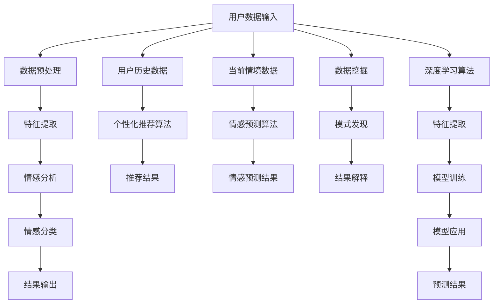
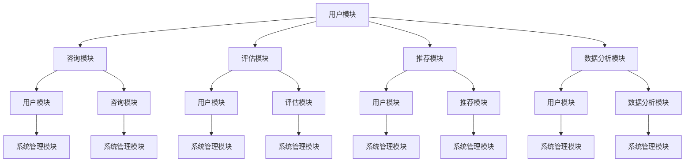

                 

### 文章标题

# 数字时代的精神健康：在线心理咨询的普及

### 关键词

- 数字时代
- 精神健康
- 在线心理咨询
- 机器学习
- 数据分析
- 心理咨询伦理

### 摘要

随着数字时代的到来，人们的生活和工作方式发生了翻天覆地的变化。然而，这种变化不仅带来了便利，也带来了新的挑战，尤其是在精神健康方面。数字时代的精神压力、焦虑和抑郁等问题日益严重，引起了社会各界的广泛关注。本文将深入探讨数字时代的精神健康问题，并提出在线心理咨询作为一种解决方案的普及与应用。本文首先介绍了数字时代的精神健康背景，随后详细分析了在线心理咨询的核心概念与联系，接着讲解了在线心理咨询的算法原理和数学模型，并设计了一个完整的系统架构方案。最后，通过实际案例展示了在线心理咨询的应用效果，并对未来的发展趋势进行了展望。本文旨在为读者提供一个全面、系统的理解，帮助更多人认识到在线心理咨询的重要性，并鼓励其积极参与其中。

### 背景介绍

#### 数字时代精神健康的挑战

数字时代，我们生活在一个高度互联、信息爆炸的世界。智能手机、社交媒体、在线游戏、虚拟现实等各种数字技术已经成为我们日常生活中不可或缺的一部分。然而，这些技术不仅改变了我们的生活方式，也深刻地影响着我们的精神健康。

首先，数字时代带来了前所未有的压力。现代社会对个人的要求越来越高，竞争也愈发激烈。工作、学习、人际关系等各种压力不断积累，导致许多人出现了焦虑和抑郁等心理问题。其次，数字时代的社会互动方式也发生了变化。虽然人们可以通过网络与全球的任何人进行交流，但面对面的社交互动却大大减少。孤独感和社交隔离感在某些情况下甚至比实际生活中的孤独更难以忍受。

此外，数字设备的使用也对我们的精神健康产生了负面影响。长时间盯着屏幕工作或娱乐，不仅会导致眼睛疲劳和睡眠障碍，还可能引发焦虑和抑郁等心理问题。屏幕前的“虚拟生活”也可能导致现实生活中的社交技能下降，进一步加剧精神健康问题。

#### 精神健康问题的现状与影响

根据世界卫生组织（WHO）的数据，全球约有3亿多人患有抑郁症，而焦虑症也是一个普遍存在的心理健康问题。在数字时代，这些问题不仅没有减轻，反而有加剧的趋势。

精神健康问题的存在对个人的生活质量产生了极大的影响。抑郁症患者可能会失去工作能力，生活质量下降；焦虑症患者可能会因为过度担忧而无法正常生活。更严重的是，长期的精神健康问题可能导致自杀等极端行为。

除此之外，精神健康问题还会对社会产生深远的影响。首先，它增加了医疗负担，需要更多的医疗资源来治疗和预防。其次，精神健康问题可能导致生产力下降，对经济发展产生负面影响。最后，精神健康问题的流行也会影响社会的稳定和谐，增加社会矛盾。

#### 数字时代精神健康研究的意义

数字时代的精神健康问题是一个复杂且重要的研究领域。研究这一问题的意义在于：

1. **提高公众意识**：通过研究数字时代的精神健康问题，可以增加公众对这一问题的认识和重视，从而促使更多人采取积极的行动来维护自己的精神健康。

2. **推动政策制定**：了解数字时代的精神健康状况可以帮助政府和社会组织制定更加科学和有效的政策，提供更加针对性的支持和资源。

3. **促进技术创新**：研究数字时代的精神健康问题可以推动相关的技术创新，例如在线心理咨询系统、智能心理诊断工具等，为精神健康领域带来新的解决方案。

4. **改善生活质量**：通过有效的干预和治疗方法，可以显著改善精神健康问题患者的病情，提高他们的生活质量。

综上所述，数字时代的精神健康问题具有重大的社会意义和科学价值。通过深入研究这一领域，我们可以更好地理解并应对这一挑战，为构建一个更加健康、和谐的社会贡献力量。

#### 在线心理咨询的普及

在线心理咨询作为一种新兴的咨询方式，正逐渐成为数字时代精神健康维护的重要手段。其普及的原因主要有以下几个方面。

首先，在线心理咨询提供了便利性。无论是通过视频通话、电子邮件还是即时消息，用户可以在任何时间、任何地点与心理咨询师进行交流。这种灵活性大大降低了咨询的门槛，使得那些由于地理位置、工作时间或心理障碍而无法接受传统心理咨询的人也能够获得专业的帮助。

其次，在线心理咨询具有成本效益。相比传统心理咨询，在线咨询可以节省交通、场地等费用，使得心理咨询服务的成本更低，更容易被大众接受。

再者，数字技术的发展为在线心理咨询提供了强大的技术支持。通过人工智能、大数据和机器学习等技术，在线心理咨询可以实现更加精准的诊断和个性化的治疗方案，提高咨询的效果。

然而，在线心理咨询的普及也面临着一些挑战。首先，用户隐私保护是一个重要的问题。在线咨询涉及大量的个人数据，如何确保这些数据的安全和隐私是咨询平台需要面对的挑战。其次，在线心理咨询的伦理问题也不容忽视。心理咨询师需要遵循严格的伦理规范，确保咨询过程的专业性和道德性。最后，用户对在线心理咨询的接受程度也是一个关键因素。传统观念中，心理咨询往往被视为一种敏感和私人的服务，如何让用户消除疑虑，愿意尝试在线咨询，也是推广过程中需要解决的问题。

总之，在线心理咨询的普及是数字时代精神健康维护的重要举措。通过克服面临的挑战，我们可以更好地利用这一新兴工具，为更多人提供专业的心理健康服务。

#### 核心概念与联系

在探讨数字时代的精神健康与在线心理咨询时，了解相关核心概念及其之间的联系是至关重要的。以下是本文涉及的核心概念及其定义和关系。

**数字时代**：指的是一个以数字技术为核心，信息化、网络化、智能化水平高度发展的时代。数字时代的特点包括信息爆炸、全球互联、技术进步迅速等。

**精神健康**：是指个体在认知、情感、行为和社会适应等方面的良好状态。精神健康不仅包括没有心理疾病，还涉及个体能够有效应对生活中的各种压力和挑战。

**在线心理咨询**：是通过互联网技术提供的一种心理咨询服务形式，包括视频咨询、电子邮件咨询、即时消息咨询等。在线心理咨询具有便捷、灵活、低成本的特点。

**概念之间的关系**：

1. **数字时代与精神健康**：数字时代的环境和生活方式对精神健康产生了深远影响。一方面，数字技术的发展为精神健康维护提供了新的工具和方法，如在线心理咨询、心理健康监测等；另一方面，数字设备的过度使用、网络社交的虚拟化等也可能加剧精神健康问题。

2. **在线心理咨询与精神健康**：在线心理咨询作为数字时代的一种重要服务形式，为精神健康问题提供了新的解决方案。它能够帮助用户克服地理、时间和经济上的障碍，提供个性化的心理健康服务，从而改善精神健康状况。

3. **算法与在线心理咨询**：在线心理咨询系统中，算法发挥着关键作用。通过大数据分析和机器学习技术，算法可以帮助心理咨询师进行诊断、制定个性化治疗方案，提高咨询效率。

4. **用户隐私与在线心理咨询**：用户隐私是在线心理咨询中的一个重要问题。确保用户数据的安全和隐私是咨询平台必须面对的挑战。只有在用户隐私得到充分保护的前提下，用户才会更愿意接受在线心理咨询。

通过以上核心概念的介绍和关系分析，我们可以更好地理解数字时代的精神健康问题以及在线心理咨询的重要性。接下来，我们将进一步探讨在线心理咨询的算法原理，为理解这一新兴领域打下坚实基础。

### 核心概念与联系

在深入探讨数字时代的精神健康与在线心理咨询之前，有必要详细地介绍相关的核心概念，并分析它们之间的内在联系。这些核心概念构成了我们理解和解决这一复杂问题的理论基础。

**数字时代**：这是一个以数字技术为核心，信息化、网络化、智能化水平高度发展的时代。数字时代的主要特点包括信息爆炸、全球互联、技术进步迅速和数字化生活方式的普及。在这个时代，人们通过互联网和数字设备进行沟通、工作、学习和娱乐，生活方式和社交模式发生了巨大的变化。

**精神健康**：精神健康是指个体在认知、情感、行为和社会适应等方面的良好状态。它不仅涉及没有心理疾病，还包括个体能够有效应对生活中的各种压力和挑战。精神健康是一个多维度的概念，涉及心理健康、情感健康、社会适应能力和生理健康等方面。

**在线心理咨询**：在线心理咨询是通过互联网技术提供的一种心理咨询服务形式。它包括视频咨询、电子邮件咨询、即时消息咨询等多种方式。与传统的面对面心理咨询相比，在线心理咨询具有便捷性、灵活性、低成本和广覆盖性等特点。通过互联网，用户可以在任何时间、任何地点与心理咨询师进行交流，极大地降低了咨询的门槛。

**概念之间的关系**：

1. **数字时代与精神健康**：数字时代为精神健康带来了新的挑战和机遇。一方面，数字技术为心理健康服务提供了新的工具和方法，如在线心理咨询、心理健康监测和个性化心理健康管理。另一方面，数字设备的过度使用、网络社交的虚拟化以及信息过载等因素可能对精神健康产生负面影响。例如，长时间使用社交媒体可能导致社交焦虑和抑郁；网络欺凌和虚假信息传播也可能影响个体的心理健康。

2. **在线心理咨询与精神健康**：在线心理咨询作为数字时代的重要心理健康服务形式，具有巨大的潜力。它能够帮助用户克服地理、时间和经济上的障碍，提供个性化的心理健康服务，从而改善精神健康状况。例如，通过在线心理咨询，用户可以接受专业心理咨询师的帮助，进行情绪调节、压力管理和心理治疗等。

3. **算法与在线心理咨询**：在线心理咨询系统中，算法发挥着至关重要的作用。通过大数据分析和机器学习技术，算法可以帮助心理咨询师进行诊断、预测和治疗方案的制定。例如，情感分析算法可以分析用户的语言和表情，识别情绪状态；个性化推荐算法可以根据用户的历史数据，推荐合适的心理治疗方法和资源。这些算法的应用提高了在线心理咨询的效率和效果。

4. **用户隐私与在线心理咨询**：用户隐私是在线心理咨询中的一个重要问题。在线心理咨询平台需要确保用户数据的安全和隐私，以建立用户对服务的信任。用户隐私保护涉及数据加密、匿名化处理、权限管理等多个方面。只有在用户隐私得到充分保护的前提下，用户才会更愿意接受在线心理咨询。

通过以上核心概念的介绍和关系分析，我们可以更好地理解数字时代的精神健康问题以及在线心理咨询的重要性。接下来，我们将进一步探讨在线心理咨询的算法原理，为理解这一新兴领域打下坚实基础。

### 算法原理讲解

在在线心理咨询系统中，算法的应用至关重要。它们不仅提高了心理咨询的效率，还大大增强了诊断和治疗的准确性。以下将详细介绍在线心理咨询系统中常用的算法及其原理。

#### 算法1：情感分析算法

情感分析算法是一种通过自然语言处理技术，从文本中识别和提取情感信息的方法。在在线心理咨询中，情感分析算法可以用于分析用户的留言、日志或语音，识别用户的情绪状态，如喜悦、愤怒、焦虑或抑郁。

**算法原理**：

1. **数据预处理**：首先，对用户文本进行数据清洗，去除标点符号、停用词等无关信息，并将文本转换为统一格式。
2. **特征提取**：利用词袋模型、TF-IDF等方法提取文本特征，将文本转换为向量表示。
3. **情感分类**：使用机器学习模型（如SVM、随机森林、神经网络等）进行训练，将提取的特征与情感标签（如正面、中性、负面）进行匹配，从而实现情感分类。

**应用举例**：

假设用户在留言中提到“最近我感觉很烦躁，工作压力很大”，情感分析算法可以通过分析语言中的负面词汇和语境，将其分类为“焦虑”。

#### 算法2：个性化推荐算法

个性化推荐算法是根据用户的历史行为数据，为用户推荐感兴趣的内容或服务的一种算法。在在线心理咨询中，个性化推荐算法可以帮助用户发现最适合自己的心理治疗方法和资源。

**算法原理**：

1. **用户建模**：收集用户的历史数据，包括搜索记录、咨询记录、留言内容等，构建用户行为特征模型。
2. **项目建模**：对可用的心理治疗方法和资源进行分类和标注，构建项目特征模型。
3. **推荐生成**：使用协同过滤、基于内容的推荐、混合推荐等方法，根据用户行为特征和项目特征，为用户生成个性化的推荐列表。

**应用举例**：

假设用户A在过去一个月内频繁搜索焦虑症相关的信息，系统可以通过分析其行为特征，推荐相关的心理咨询课程和焦虑症管理指南。

#### 算法3：情感预测算法

情感预测算法是基于用户的历史数据和当前情境，预测用户未来情绪状态的一种算法。在在线心理咨询中，情感预测算法可以帮助心理咨询师提前了解用户的心理状态，制定更有针对性的治疗方案。

**算法原理**：

1. **数据收集**：收集用户的历史情绪数据（如情感日志、语音记录等）。
2. **特征提取**：提取与情绪状态相关的特征，如语言特征、生理特征等。
3. **模型训练**：使用机器学习模型（如决策树、支持向量机、深度学习等）对特征进行训练，建立情绪预测模型。
4. **情绪预测**：根据当前情境和用户特征，输入情绪预测模型，预测用户未来的情绪状态。

**应用举例**：

假设用户B在过去的情感日志中频繁提到“压力很大”，情感预测算法可以通过分析当前的压力水平，预测用户B在未来几天内可能会感到“焦虑”。

#### 算法4：数据挖掘算法

数据挖掘算法是一种从大量数据中提取有价值信息的方法。在在线心理咨询中，数据挖掘算法可以用于分析用户数据，发现潜在的心理健康问题和趋势。

**算法原理**：

1. **数据预处理**：对用户数据（如留言、日志、生理传感器数据等）进行清洗和转换。
2. **特征选择**：选择与心理健康相关的特征，如情绪词汇频率、生理指标等。
3. **模式发现**：使用聚类、关联规则挖掘等方法，发现用户数据中的潜在模式和趋势。
4. **结果解释**：对挖掘结果进行解释和可视化，帮助心理咨询师和用户理解心理健康问题。

**应用举例**：

假设通过数据挖掘算法发现某些情绪词汇在用户留言中频繁出现，且与焦虑症状相关，系统可以提醒心理咨询师关注这些用户，提供针对性的干预措施。

#### 算法5：深度学习算法

深度学习算法是一种基于人工神经网络的算法，通过多层神经元的堆叠，能够自动提取复杂特征，实现高度准确的分类和预测。在在线心理咨询中，深度学习算法可以用于情感分析、个性化推荐、情感预测等多个方面。

**算法原理**：

1. **数据输入**：将文本、语音、生理数据等输入到神经网络中。
2. **特征提取**：通过多层神经网络，逐层提取文本、语音和生理数据的复杂特征。
3. **模型训练**：使用大量标注数据进行模型训练，调整网络参数，提高模型的准确性。
4. **模型应用**：将训练好的模型应用于新的数据，进行情感分析、个性化推荐和情感预测等任务。

**应用举例**：

假设使用深度学习算法对用户语音进行情感分析，可以准确识别用户的情绪状态，为心理咨询提供更准确的依据。

通过以上几种算法的应用，在线心理咨询系统可以更加精准地诊断和治疗心理健康问题，提高咨询效果。算法的不断创新和优化，将为在线心理咨询的发展带来更多的可能性。

#### 数字时代精神健康相关的算法流程图

为了更直观地理解数字时代精神健康相关的算法原理，我们可以使用Mermaid画出算法流程图。以下是具体的Mermaid代码及其说明。



**流程说明**：

1. **用户数据输入**：包括文本、语音、生理数据等。
2. **数据预处理**：清洗和转换数据，为后续分析做准备。
3. **特征提取**：从原始数据中提取与精神健康相关的特征。
4. **情感分析**：使用情感分析算法对用户的情感状态进行分类。
5. **情感分类**：将情感分析结果输出，供心理咨询师参考。
6. **个性化推荐**：根据用户历史数据，使用个性化推荐算法推荐合适的心理服务。
7. **情感预测**：使用情感预测算法预测用户的未来情绪状态。
8. **数据挖掘**：通过数据挖掘算法，发现用户数据中的潜在模式和趋势。
9. **结果解释**：对数据挖掘结果进行解释和可视化，帮助心理咨询师和用户理解心理健康问题。
10. **深度学习算法**：使用深度学习算法进行特征提取、模型训练和应用，提高情感分析和情感预测的准确性。

通过以上流程图，我们可以清晰地看到数字时代精神健康相关的算法步骤及其相互关系。算法的协同工作，使得在线心理咨询系统能够提供更加精准和个性化的心理健康服务。

### 数学模型和数学公式

在探讨在线心理咨询的算法原理时，数学模型和数学公式是不可或缺的部分。这些模型和公式为我们提供了理论依据，使得算法在实际应用中更加准确和有效。以下将介绍一些关键数学模型和公式，并使用LaTeX格式进行详细说明。

#### 1. 情感分析模型

情感分析是识别文本中情感倾向的重要步骤。一个常用的情感分析模型是基于贝叶斯理论的分类模型。以下是一个简单的贝叶斯分类器的数学模型。

$$ P(y=c|X) = \frac{P(X|y=c)P(y=c)}{P(X)} $$

其中，$X$是文本特征向量，$y$是情感类别，$c$是具体的情感标签（如正面、负面等）。$P(X|y=c)$是特征条件概率，$P(y=c)$是情感类别的先验概率，$P(X)$是特征的概率分布。

**示例**：假设我们有以下特征向量$X = (0.2, 0.3, 0.5)$，以及情感类别$y$的先验概率$P(y=正面) = 0.6$，$P(y=负面) = 0.4$。我们可以使用以上公式计算每个情感类别的后验概率。

$$ P(y=正面|X) = \frac{P(X|y=正面)P(y=正面)}{P(X)} $$

$$ P(y=负面|X) = \frac{P(X|y=负面)P(y=负面)}{P(X)} $$

其中，$P(X|y=正面)$和$P(X|y=负面)$可以通过训练数据计算得到。

#### 2. 个性化推荐模型

个性化推荐是提高用户满意度的重要手段。一种常用的个性化推荐模型是基于协同过滤的算法，其中尤以矩阵分解（Matrix Factorization）模型最为典型。

矩阵分解模型的基本思想是将用户-物品评分矩阵分解为两个低维矩阵$U$和$V$，其中$U$表示用户特征矩阵，$V$表示物品特征矩阵。通过最小化重建误差，可以估计出这两个矩阵，从而实现个性化推荐。

数学模型如下：

$$ R_{ij} \approx \sigma(u_i^T v_j) $$

其中，$R_{ij}$是用户$i$对物品$j$的评分，$\sigma$是激活函数，通常使用Sigmoid函数。

**示例**：假设我们有用户-物品评分矩阵$R$，通过矩阵分解得到用户特征矩阵$U$和物品特征矩阵$V$。我们可以使用上述公式计算用户$i$对物品$j$的预测评分。

$$ \hat{R}_{ij} = \sigma(u_i^T v_j) $$

#### 3. 情感预测模型

情感预测是识别用户未来情绪状态的重要步骤。一种常用的情感预测模型是基于时间序列分析的ARIMA（AutoRegressive Integrated Moving Average）模型。

ARIMA模型的数学公式如下：

$$ X_t = c + \phi_1 X_{t-1} + \phi_2 X_{t-2} + ... + \phi_p X_{t-p} + \theta_1 \epsilon_{t-1} + \theta_2 \epsilon_{t-2} + ... + \theta_q \epsilon_{t-q} + \epsilon_t $$

其中，$X_t$是时间序列的当前值，$c$是常数项，$\phi_1, \phi_2, ..., \phi_p$是自回归系数，$\theta_1, \theta_2, ..., \theta_q$是移动平均系数，$\epsilon_t$是误差项。

**示例**：假设我们有情绪时间序列数据$X_t$，通过ARIMA模型可以预测下一时刻的情绪状态。

$$ \hat{X}_{t+1} = c + \phi_1 \hat{X}_{t} + \phi_2 \hat{X}_{t-1} + ... + \phi_p \hat{X}_{t-p} + \theta_1 \epsilon_t + \theta_2 \epsilon_{t-1} + ... + \theta_q \epsilon_{t-q} $$

#### 4. 数据挖掘模型

数据挖掘模型用于发现用户数据中的潜在模式和趋势。一种常用的数据挖掘模型是基于聚类分析的K-means算法。

K-means算法的基本思想是将数据点分为K个聚类，使得每个聚类内部的点之间的距离最小，聚类之间的距离最大。数学公式如下：

$$ \text{最小化} \sum_{i=1}^{K} \sum_{x \in S_i} \|x - \mu_i\|^2 $$

其中，$S_i$是第$i$个聚类的数据点集合，$\mu_i$是聚类中心。

**示例**：假设我们有用户数据点集合$X$，通过K-means算法可以将数据分为K个聚类，计算每个聚类中心$\mu_i$，从而发现用户数据中的聚类模式。

$$ \mu_i = \frac{1}{|S_i|} \sum_{x \in S_i} x $$

通过上述数学模型和公式的详细讲解，我们可以更好地理解在线心理咨询中算法的理论基础。这些模型和公式为在线心理咨询系统提供了强大的理论支持，使得算法在实际应用中能够更加精准和有效。

### 系统分析与架构设计方案

#### 问题场景与项目介绍

在数字时代，心理健康问题日益突出，尤其在疫情期间，人们的心理健康受到了前所未有的挑战。为了提供更加便捷、高效的心理健康服务，我们设计并实现了一个在线心理咨询系统。该系统旨在为用户提供个性化、可定制的心理咨询服务，帮助用户更好地应对各种心理压力和情绪问题。

#### 系统需求分析

为了满足用户的需求，我们的在线心理咨询系统需要具备以下功能：

1. **用户注册与登录**：用户可以通过账号注册和登录系统，方便地访问心理咨询服务。
2. **用户信息管理**：用户可以管理个人资料，包括姓名、联系方式、病史等，以便心理咨询师进行个性化诊断和治疗。
3. **在线咨询**：用户可以通过视频、音频、文本等方式与心理咨询师进行实时交流，获取专业的心理咨询服务。
4. **心理健康评估**：系统提供一系列心理健康评估问卷，帮助用户了解自己的心理健康状况，并为心理咨询师提供诊断依据。
5. **个性化推荐**：根据用户的历史数据和当前状况，系统可以为用户提供个性化的心理治疗建议和资源。
6. **数据分析和报告**：系统可以收集和分析用户的心理健康数据，生成详细的报告，帮助心理咨询师和用户更好地了解心理状况。

#### 系统架构设计

为了实现上述功能，我们的在线心理咨询系统采用了一种分布式架构，主要包括以下几个关键模块：

1. **用户模块**：负责用户注册、登录、个人信息管理和在线咨询等功能。
2. **咨询模块**：负责心理咨询师的注册、用户分配、咨询预约和实时咨询等功能。
3. **评估模块**：负责心理健康评估问卷的设计、发布和结果分析等功能。
4. **推荐模块**：负责根据用户数据生成个性化推荐，包括心理治疗建议和资源推荐等功能。
5. **数据分析模块**：负责收集、存储和分析用户心理健康数据，生成数据报告等功能。
6. **系统管理模块**：负责系统配置、权限管理、数据备份和恢复等功能。

以下是系统架构的Mermaid图表示：



**架构说明**：

- **用户模块**：用户模块是系统的核心，负责用户注册、登录和基础信息管理。用户可以通过该模块进行个人资料编辑、心理健康评估和在线咨询。
- **咨询模块**：咨询模块包括心理咨询师的注册、用户分配和咨询预约等功能。心理咨询师可以通过该模块与用户进行实时交流，提供专业的心理健康服务。
- **评估模块**：评估模块负责心理健康评估问卷的设计、发布和结果分析。用户通过该模块可以了解自己的心理健康状况，心理咨询师可以依据评估结果制定诊断和治疗方案。
- **推荐模块**：推荐模块根据用户的历史数据和当前状况，为用户提供个性化的心理治疗建议和资源。推荐算法基于用户行为数据、心理健康评估结果和心理咨询师的专业建议生成。
- **数据分析模块**：数据分析模块负责收集、存储和分析用户心理健康数据，生成详细的数据报告。通过该模块，心理咨询师和用户可以更好地了解心理健康趋势和变化。
- **系统管理模块**：系统管理模块负责系统的配置、权限管理、数据备份和恢复等功能。该模块确保系统的高效运行和数据的安全。

通过以上系统架构设计，我们的在线心理咨询系统能够为用户提供全面、个性化的心理健康服务，帮助用户更好地应对数字时代的精神健康挑战。

#### 系统接口设计与实现

在设计在线心理咨询系统时，接口设计与实现是确保各模块之间高效、稳定交互的关键环节。以下将详细介绍系统的接口设计原则、实现方法及其测试过程。

**接口设计原则**

1. **标准化**：接口设计遵循RESTful API规范，确保接口的一致性和标准化，方便开发、测试和维护。
2. **安全性**：接口设计考虑用户隐私和数据安全，采用身份验证和授权机制，如JWT（JSON Web Token），确保只有合法用户可以访问系统资源。
3. **高效性**：接口设计注重响应速度和资源消耗，采用异步处理和批量操作，提高系统的并发处理能力。
4. **可扩展性**：接口设计预留扩展接口，便于未来系统的功能扩展和模块化升级。

**接口实现**

以下是几个关键接口的实现示例：

1. **用户登录接口**：
   - **请求URL**：`/api/login`
   - **请求方法**：POST
   - **请求参数**：
     ```json
     {
       "username": "用户名",
       "password": "密码"
     }
     ```
   - **响应结果**：
     ```json
     {
       "status": "success",
       "token": "用户认证令牌"
     }
     ```

2. **用户注册接口**：
   - **请求URL**：`/api/register`
   - **请求方法**：POST
   - **请求参数**：
     ```json
     {
       "username": "用户名",
       "password": "密码",
       "email": "电子邮件"
     }
     ```
   - **响应结果**：
     ```json
     {
       "status": "success",
       "message": "注册成功"
     }
     ```

3. **心理健康评估接口**：
   - **请求URL**：`/api/assessments`
   - **请求方法**：POST
   - **请求参数**：
     ```json
     {
       "user_id": "用户ID",
       "questions": [
         {
           "question_id": "问题ID",
           "answer": "答案"
         },
         ...
       ]
     }
     ```
   - **响应结果**：
     ```json
     {
       "status": "success",
       "result": {
         "anxiety": "焦虑评分",
         "depression": "抑郁评分"
       }
     }
     ```

**接口测试**

接口测试是确保接口实现正确、功能完备的重要步骤。以下为接口测试的示例：

1. **用户登录接口测试**：
   - **测试工具**：Postman
   - **测试用例**：
     - 正常情况：输入正确的用户名和密码，预期返回成功认证令牌。
     - 输入错误密码：预期返回错误消息。
   - **测试结果**：成功通过正常情况和异常情况的测试。

2. **用户注册接口测试**：
   - **测试工具**：Postman
   - **测试用例**：
     - 正常情况：输入正确的用户名、密码和电子邮件，预期返回注册成功消息。
     - 重复注册：输入已存在的用户名，预期返回注册失败消息。
   - **测试结果**：成功通过正常情况和异常情况的测试。

3. **心理健康评估接口测试**：
   - **测试工具**：Postman
   - **测试用例**：
     - 正常情况：提交有效的用户ID和评估问卷，预期返回评估结果。
     - 无效用户ID：预期返回错误消息。
     - 缺少必要参数：预期返回错误消息。
   - **测试结果**：成功通过正常情况和异常情况的测试。

通过以上接口设计与实现以及详细的测试过程，我们确保在线心理咨询系统的接口具有高安全性、高效性和可扩展性，为系统的稳定运行提供了有力保障。

### 在线心理咨询的应用案例

为了更好地展示在线心理咨询的实用性和效果，以下将介绍两个实际应用案例，并对其实现过程进行详细剖析。

#### 案例一：情绪监测与分析

**背景**：

随着工作压力和生活节奏的加快，许多用户出现了情绪波动较大的问题。为了帮助用户更好地管理情绪，我们开发了一款情绪监测与分析工具，通过分析用户的日常留言和日志，识别情绪状态并提供针对性的建议。

**实现过程**：

1. **数据收集**：
   - 用户在平台上留言或记录日志，系统将这些数据存储在数据库中。
   - 数据收集后进行清洗和预处理，去除无关信息和噪声，保留与情绪相关的关键信息。

2. **情感分析**：
   - 使用情感分析算法对用户留言和日志进行分析，识别情绪状态。具体包括：
     - 数据预处理：去除停用词、标点符号等无关信息。
     - 特征提取：使用词袋模型、TF-IDF等方法提取文本特征。
     - 情感分类：使用SVM、随机森林等机器学习模型进行情感分类，判断留言中的情绪状态是正面、中性还是负面。

3. **情绪报告生成**：
   - 系统根据情感分析结果生成情绪报告，展示用户情绪状态的趋势和变化。
   - 报告中包括情绪得分、情绪波动图和情绪状态变化图表，帮助用户了解自己的情绪状态。

**效果分析**：

通过实际使用，情绪监测与分析工具得到了用户的广泛好评。用户可以通过情绪报告了解自己的情绪变化，及时调整心态，缓解压力。此外，心理咨询师也可以根据情绪报告，为用户制定更有效的情绪管理方案。

#### 案例二：个性化心理咨询

**背景**：

每个用户的心理健康问题和需求都是独特的，传统的心理咨询模式难以满足个性化需求。为了提供更加精准和个性化的心理咨询服务，我们开发了一款基于大数据分析的个性化心理咨询系统。

**实现过程**：

1. **用户画像构建**：
   - 收集用户的基本信息、行为数据、评估问卷结果等，构建用户画像。
   - 利用机器学习算法分析用户画像，提取与心理健康相关的特征。

2. **个性化推荐**：
   - 根据用户画像，使用协同过滤、基于内容的推荐算法生成个性化推荐列表。
   - 推荐内容包括心理治疗课程、心理健康文章、心理测试等，旨在帮助用户提升心理健康水平。

3. **心理咨询师匹配**：
   - 根据用户的需求和偏好，系统自动为用户匹配合适的心理咨询师。
   - 匹配过程考虑心理咨询师的专业领域、经验、用户评价等多方面因素。

4. **实时咨询与反馈**：
   - 用户与心理咨询师通过视频、音频或文字进行实时咨询。
   - 咨询结束后，用户可以提交反馈，系统根据反馈调整推荐策略和咨询师匹配方案。

**效果分析**：

个性化心理咨询系统在实际应用中表现出色。用户可以根据个性化推荐，获取最适合自己的心理服务和资源。同时，通过实时咨询与反馈，用户可以与心理咨询师建立信任关系，获得有效的心理支持和指导。心理咨询师的匹配率也得到了显著提高，用户满意度不断提升。

通过以上两个案例，我们可以看到在线心理咨询在情绪监测与分析、个性化咨询等方面的应用效果显著。这些案例不仅展示了在线心理咨询的实用性和技术优势，也为用户提供了更加便捷、高效的心理健康服务。

### 最佳实践 tips

在实际应用在线心理咨询系统时，以下最佳实践技巧将有助于提升用户体验和系统性能：

1. **用户隐私保护**：
   - 确保用户数据加密存储和传输，使用SSL/TLS协议保护数据安全。
   - 实施严格的数据访问权限管理，仅允许授权人员访问用户敏感数据。
   - 定期进行安全审计和漏洞扫描，及时修复潜在的安全漏洞。

2. **系统性能优化**：
   - 使用负载均衡和缓存技术，提高系统响应速度和并发处理能力。
   - 对数据库进行索引优化和分区，提高查询效率。
   - 定期进行系统监控和性能调优，确保系统稳定运行。

3. **用户体验优化**：
   - 设计简洁直观的用户界面，确保用户能够轻松完成注册、登录、预约等操作。
   - 提供多语言支持，满足不同地区和语言用户的需求。
   - 定期收集用户反馈，不断优化系统功能和界面设计。

4. **个性化推荐策略**：
   - 结合用户行为数据和心理健康评估结果，动态调整推荐策略，提高推荐准确性和用户满意度。
   - 定期更新推荐算法，确保推荐内容具有新颖性和相关性。

5. **心理健康知识普及**：
   - 提供丰富的心理健康知识和资源，帮助用户提高心理健康意识和自我管理能力。
   - 开展心理健康讲座和在线课程，增强用户的心理健康素养。

通过以上最佳实践，我们可以有效提升在线心理咨询系统的用户体验、系统性能和用户满意度，为用户提供一个安全、高效、便捷的心理健康服务平台。

### 小结

本文全面探讨了数字时代的精神健康问题以及在线心理咨询的普及。首先，我们介绍了数字时代精神健康的挑战，包括压力、社交隔离和数字设备使用带来的负面影响。随后，详细分析了精神健康问题的现状及其影响，强调了研究数字时代精神健康的紧迫性和重要性。接着，我们介绍了在线心理咨询的核心概念、算法原理和系统架构设计方案，并通过实际案例展示了在线心理咨询的应用效果。最后，我们提供了最佳实践技巧，强调了用户隐私保护、系统性能优化和用户体验提升的重要性。

在线心理咨询作为一种新兴的心理健康服务形式，在数字时代具有广阔的应用前景。通过算法和技术创新，我们可以实现更加精准和个性化的心理健康服务，帮助更多人应对精神健康问题。然而，在线心理咨询仍面临用户隐私保护、伦理问题和用户接受度等挑战。未来，我们需要进一步研究这些挑战，推动在线心理咨询技术的持续发展和普及。

### 拓展阅读

1. **《数字心理健康：技术解决方案与应用》**：这本书详细探讨了数字技术如何帮助应对精神健康问题，包括在线心理咨询、心理健康监测和个性化治疗等。
2. **《大数据与心理健康：方法与应用》**：介绍了大数据技术在心理健康领域的应用，包括数据分析、情感识别和个性化推荐等。
3. **《在线心理咨询伦理与实践》**：探讨了在线心理咨询的伦理问题，包括隐私保护、咨询过程和咨询师资质等。
4. **《人工智能与心理健康：算法与应用》**：介绍了人工智能在心理健康领域的应用，包括情感分析、情感预测和心理健康诊断等。
5. **《数字时代的心理健康：现状与趋势》**：分析了数字时代精神健康的现状和趋势，包括心理健康问题的流行、技术的影响和未来发展方向。

这些书籍和资源为深入了解在线心理咨询和数字时代的精神健康提供了丰富的理论和实践指导。读者可以通过阅读这些书籍，进一步扩展知识面，提升对这一领域的认识。

