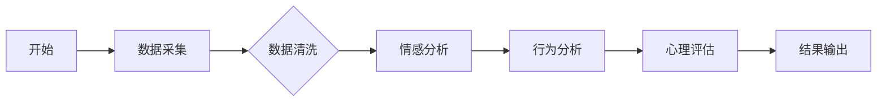
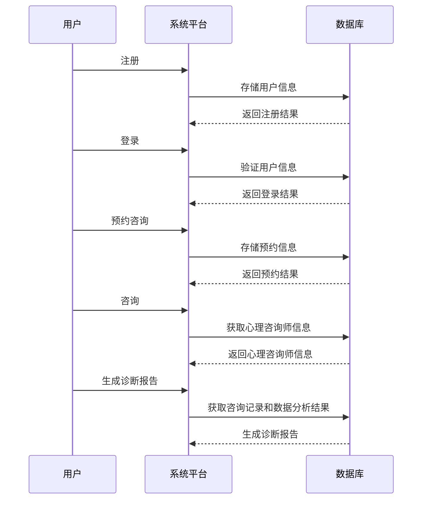

                 

### 文章标题：数字时代的精神健康：在线心理咨询的普及

关键词：数字时代、精神健康、在线心理咨询、普及、技术、政策、教育

摘要：随着互联网和移动设备的普及，在线心理咨询逐渐成为人们寻求心理健康服务的重要途径。本文从背景介绍、核心概念、核心要素、核心概念与联系、算法原理讲解以及系统分析与架构设计方案等多个方面，详细分析了在线心理咨询的普及现状、问题与解决方案，并探讨了其未来发展的可能方向。

---

## 目录大纲

1. **第一部分：背景介绍**
   1.1 问题的提出
   1.2 问题描述
   1.3 问题解决
   1.4 边界与外延
   1.5 核心概念
   1.6 核心要素
2. **第二部分：核心概念与联系**
   2.1 核心概念原理
   2.2 概念属性特征对比
   2.3 ER实体关系图架构
3. **第三部分：算法原理讲解**
   3.1 算法原理
   3.2 算法流程图
   3.3 算法原理详细讲解
4. **第四部分：系统分析与架构设计方案**
   4.1 问题场景介绍
   4.2 系统功能设计
   4.3 系统架构设计
   4.4 系统接口设计
   4.5 系统交互
5. **第五部分：项目实战**
   5.1 环境安装
   5.2 系统核心实现
   5.3 代码应用解读
   5.4 实际案例分析与讲解
   5.5 项目小结
6. **第六部分：最佳实践 Tips**
7. **总结与展望**
8. **参考文献**
9. **作者信息**

### 第一部分：背景介绍

#### 1.1 问题的提出

随着数字时代的到来，人们的生活节奏加快，工作压力增大，精神健康问题逐渐成为全球关注的焦点。尤其是在疫情期间，线上工作和学习方式的普及，使得人们对于心理健康服务的需求更加迫切。然而，心理咨询师的短缺、患者隐私的保护以及心理咨询效果评估等问题，使得在线心理咨询的普及面临着诸多挑战。

#### 1.2 问题描述

在线心理咨询的普及程度和质量仍存在很大的差异。首先，心理咨询师的短缺使得患者难以获得及时有效的服务。其次，患者隐私的保护问题亟待解决。此外，心理咨询效果评估的科学性也有待提高。最后，在线心理咨询的边界与外延问题，如如何平衡个体咨询与群体辅导、如何确保心理咨询的连续性和专业性等，也需要深入探讨。

#### 1.3 问题解决

解决在线心理咨询普及的问题，需要从技术、政策、教育等多个层面进行综合施策。技术层面，可以发展更加智能化的心理咨询平台，提高心理咨询的效率和质量。政策层面，政府应出台相关法规，规范在线心理咨询的运营和管理。教育层面，应加强对心理咨询师的培训，提高其专业素养和技能。

#### 1.4 边界与外延

在线心理咨询的普及范围和影响程度，不仅关乎个人的心理健康，也关系到社会和谐稳定。因此，在线心理咨询的普及不仅是一个技术问题，更是一个社会问题。它需要全社会共同努力，从多个维度进行综合推动。

### 1.5 核心概念

#### 1.5.1 定义

在线心理咨询：利用互联网和移动设备，为患者提供心理健康服务的过程。

#### 1.5.2 特点

- **灵活便捷**：患者可以随时随地接受心理咨询，不受时间和地点限制。
- **省时高效**：心理咨询师可以跨越地域限制，为更多患者提供服务。
- **安全隐私**：在线心理咨询为患者提供了保护隐私的环境。

#### 1.5.3 与传统心理咨询的区别

在线心理咨询与传统心理咨询相比，具有更强的便捷性和灵活性。传统心理咨询通常需要在固定的地点和时间进行，而在线心理咨询可以随时随地通过互联网和移动设备进行。此外，在线心理咨询在隐私保护方面也具有优势，患者可以在一个相对私密的环境中接受咨询。

### 1.6 核心要素

#### 1.6.1 心理咨询师

在线心理咨询师需要具备专业的心理学知识和技能，同时要熟悉互联网和移动设备的使用，能够为患者提供高质量的心理咨询服务。

#### 1.6.2 心理咨询平台

心理咨询平台是提供在线心理咨询服务的载体，需要具备稳定的技术支持和完善的隐私保护措施，以确保患者的个人信息安全。

#### 1.6.3 患者用户

患者用户是接受在线心理咨询服务的主体，需要具备一定的网络素养和心理素质，能够积极参与到心理咨询过程中，以达到最佳的治疗效果。

### 第二部分：核心概念与联系

#### 2.1 核心概念原理

在线心理咨询的过程主要包括诊断、治疗和随访三个阶段。诊断阶段主要涉及患者的心理健康状况评估；治疗阶段则包括心理治疗和心理干预；随访阶段则对治疗效果进行跟踪和评估。

#### 2.2 概念属性特征对比

| 特征         | 传统心理咨询 | 在线心理咨询 |
| ------------ | ------------ | ------------ |
| 时间限制     | 面对面，有时间限制 | 随时随地，无时间限制 |
| 空间限制     | 地理位置受限     | 地理位置不受限 |
| 隐私保护     | 相对隐私       | 较高隐私保护 |
| 心理咨询师资质 | 高标准         | 较低标准   |

#### 2.3 ER实体关系图架构

```mermaid
erDiagram
    Patient ||--|{ Consultation }||>
    Consultation ||--|{ Diagnosis }||>
    Diagnosis ||--|{ Treatment }||>
    Treatment ||--|{ FollowUp }||>
```

### 第三部分：算法原理讲解

#### 3.1 算法原理

在线心理咨询的算法原理主要涉及心理健康数据分析、心理评估算法等方面。心理健康数据分析的方法包括情感分析、行为分析等。心理评估算法包括心理测量学算法和机器学习算法。

#### 3.2 算法流程图



#### 3.3 算法原理详细讲解

##### 3.3.1 数据采集

数据采集是心理健康数据分析的基础，包括患者个人信息、咨询记录、行为数据等。这些数据可以来源于心理咨询平台、社交媒体、传感器等。

```python
# 伪代码：数据采集示例
def data_collection():
    patient_data = {
        'name': 'John',
        'age': 30,
        'gender': 'male',
        'diagnosis': 'depression',
        'therapy_sessions': [
            {'session_date': '2023-01-01', 'session_duration': 60},
            {'session_date': '2023-01-08', 'session_duration': 45}
        ],
        'behavior_data': {
            'sleep_quality': 'poor',
            'daily_activity': 'low',
            'stress_level': 'high'
        }
    }
    return patient_data
```

##### 3.3.2 数据清洗

数据清洗是数据处理的重要步骤，包括去除噪声数据、缺失值填充等。

```python
# 伪代码：数据清洗示例
def data_cleaning(data):
    cleaned_data = {}
    for key, value in data.items():
        if key == 'therapy_sessions':
            cleaned_data[key] = [session for session in value if session['session_duration'] > 0]
        elif key == 'behavior_data':
            cleaned_data[key] = {k: v for k, v in value.items() if v != ''}
        else:
            cleaned_data[key] = value
    return cleaned_data
```

##### 3.3.3 情感分析

情感分析是通过对文本进行分析，识别出其中的情感倾向。常用的方法包括文本分类、情感极性分析等。

```python
# 伪代码：情感分析示例
from textblob import TextBlob

def sentiment_analysis(text):
    analysis = TextBlob(text)
    if analysis.sentiment.polarity > 0:
        return 'positive'
    elif analysis.sentiment.polarity < 0:
        return 'negative'
    else:
        return 'neutral'
```

##### 3.3.4 行为分析

行为分析是通过分析患者的行为数据，识别出潜在的心理健康问题。例如，通过睡眠质量和日常活动水平来判断患者的心理健康状况。

```python
# 伪代码：行为分析示例
def behavior_analysis(behavior_data):
    if behavior_data['sleep_quality'] == 'poor' and behavior_data['daily_activity'] == 'low':
        return 'depression'
    elif behavior_data['stress_level'] == 'high':
        return 'anxiety'
    else:
        return 'stable'
```

##### 3.3.5 心理评估

心理评估是基于患者的诊断数据和行为数据，对患者的心理健康状况进行评估。这通常涉及到复杂的数学模型和算法。

```python
# 伪代码：心理评估示例
def psychological_assessment(diagnosis, behavior_analysis_result):
    if diagnosis == 'depression' and behavior_analysis_result == 'depression':
        return 'severe'
    elif diagnosis == 'depression' and behavior_analysis_result == 'anxiety':
        return 'moderate'
    elif diagnosis != 'depression' and behavior_analysis_result == 'anxiety':
        return 'mild'
    else:
        return 'stable'
```

##### 3.3.6 结果输出

结果输出包括诊断结果、治疗建议等，通常以报告或推荐的方式呈现给患者。

```python
# 伪代码：结果输出示例
def result_output(assessment_result):
    if assessment_result == 'severe':
        print("您的心理健康状况较为严重，建议立即就医。")
    elif assessment_result == 'moderate':
        print("您的心理健康状况需要关注，建议定期进行心理咨询。")
    elif assessment_result == 'mild':
        print("您的心理健康状况良好，但请注意日常生活中的心理压力。")
    else:
        print("您的心理健康状况稳定，继续保持。")
```

### 第四部分：系统分析与架构设计方案

#### 4.1 问题场景介绍

假设我们开发一个在线心理咨询平台，为患者提供从诊断到治疗的全方位服务。平台需要支持用户注册、心理咨询预约、在线咨询、诊断报告生成等功能。

#### 4.2 系统功能设计

系统功能设计主要包括以下方面：

- **用户管理**：用户注册、登录、个人信息维护。
- **心理咨询**：心理咨询预约、在线咨询、咨询记录管理。
- **诊断报告**：诊断报告生成、报告查看、报告打印。
- **数据分析**：情感分析、行为分析、心理评估。

#### 4.3 系统架构设计

系统架构设计采用分层架构，主要包括以下层次：

- **表示层**：提供用户界面，包括网站和移动应用。
- **业务逻辑层**：处理业务逻辑，包括用户管理、心理咨询、诊断报告等功能。
- **数据访问层**：处理数据存储和访问，包括数据库和API接口。

#### 4.4 系统接口设计

系统接口设计包括以下方面：

- **用户接口**：用户通过网站和移动应用与系统交互。
- **服务接口**：系统内部服务之间的交互。
- **数据接口**：系统与外部数据源（如数据库、API等）的交互。

#### 4.5 系统交互

系统交互通过API接口实现，主要包括以下交互流程：

- **用户注册**：用户通过网站或移动应用注册账号。
- **心理咨询预约**：用户选择心理咨询师和预约时间。
- **在线咨询**：用户与心理咨询师进行在线沟通。
- **诊断报告生成**：根据咨询记录和数据分析结果生成诊断报告。



### 第五部分：项目实战

#### 5.1 环境安装

为了实现上述系统，我们需要在服务器上安装以下软件：

- **Web服务器**：如Nginx或Apache。
- **应用程序服务器**：如Tomcat或Jboss。
- **数据库服务器**：如MySQL或PostgreSQL。
- **开发环境**：如Eclipse或IntelliJ IDEA。

#### 5.2 系统核心实现

系统核心实现包括以下部分：

- **用户管理模块**：实现用户注册、登录、个人信息维护等功能。
- **心理咨询模块**：实现心理咨询预约、在线咨询、咨询记录管理等功能。
- **诊断报告模块**：实现诊断报告生成、报告查看、报告打印等功能。
- **数据分析模块**：实现情感分析、行为分析、心理评估等功能。

```python
# 伪代码：用户管理模块示例
def register_user(username, password, email):
    # 代码实现用户注册逻辑
    pass

def login_user(username, password):
    # 代码实现用户登录逻辑
    pass

def update_user_profile(username, new_profile):
    # 代码实现用户信息更新逻辑
    pass
```

```python
# 伪代码：心理咨询模块示例
def schedule_consultation(user_id, therapist_id, date, time):
    # 代码实现心理咨询预约逻辑
    pass

def start_consultation(consultation_id):
    # 代码实现在线咨询逻辑
    pass

def manage_consultation_records(consultation_id, notes):
    # 代码实现咨询记录管理逻辑
    pass
```

```python
# 伪代码：诊断报告模块示例
def generate_diagnosis_report(consultation_id):
    # 代码实现诊断报告生成逻辑
    pass

def view_diagnosis_report(consultation_id):
    # 代码实现诊断报告查看逻辑
    pass

def print_diagnosis_report(consultation_id):
    # 代码实现诊断报告打印逻辑
    pass
```

```python
# 伪代码：数据分析模块示例
def analyze_sentiment(text):
    # 代码实现情感分析逻辑
    pass

def analyze_behavior(data):
    # 代码实现行为分析逻辑
    pass

def assess_psychological_health(diagnosis, behavior_analysis_result):
    # 代码实现心理评估逻辑
    pass
```

#### 5.3 代码应用解读

代码应用解读主要是对核心实现部分的详细解释，包括每个函数的作用、参数说明、返回值等。

```python
# 伪代码：用户管理模块示例解读
# register_user函数用于注册新用户
# 参数：
#   username：用户名
#   password：密码
#   email：邮箱
# 返回值：
#   成功：用户ID
#   失败：错误消息

def register_user(username, password, email):
    # 验证用户名是否已存在
    if check_username_exists(username):
        return "用户名已存在"
    # 验证密码强度
    if not check_password_strength(password):
        return "密码强度不足"
    # 创建新用户
    user_id = create_new_user(username, password, email)
    if user_id:
        return user_id
    else:
        return "注册失败"
```

```python
# 伪代码：心理咨询模块示例解读
# schedule_consultation函数用于预约心理咨询
# 参数：
#   user_id：用户ID
#   therapist_id：心理咨询师ID
#   date：预约日期
#   time：预约时间
# 返回值：
#   成功：预约ID
#   失败：错误消息

def schedule_consultation(user_id, therapist_id, date, time):
    # 验证用户和心理咨询师是否存在
    if not check_user_exists(user_id) or not check_therapist_exists(therapist_id):
        return "用户或心理咨询师不存在"
    # 验证预约时间是否可用
    if not is_time_available(date, time):
        return "预约时间不可用"
    # 创建预约记录
    consultation_id = create_consultation(user_id, therapist_id, date, time)
    if consultation_id:
        return consultation_id
    else:
        return "预约失败"
```

```python
# 伪代码：诊断报告模块示例解读
# generate_diagnosis_report函数用于生成诊断报告
# 参数：
#   consultation_id：预约ID
# 返回值：
#   成功：诊断报告内容
#   失败：错误消息

def generate_diagnosis_report(consultation_id):
    # 获取咨询记录和数据分析结果
    consultation_records = get_consultation_records(consultation_id)
    analysis_results = get_analysis_results(consultation_id)
    # 生成诊断报告
    report = create_diagnosis_report(consultation_records, analysis_results)
    if report:
        return report
    else:
        return "生成报告失败"
```

```python
# 伪代码：数据分析模块示例解读
# analyze_sentiment函数用于分析文本情感
# 参数：
#   text：文本内容
# 返回值：
#   情感极性：正、负或中性

def analyze_sentiment(text):
    # 使用情感分析库分析文本情感
    analysis = TextBlob(text)
    if analysis.sentiment.polarity > 0:
        return "正"
    elif analysis.sentiment.polarity < 0:
        return "负"
    else:
        return "中性"
```

#### 5.4 实际案例分析与讲解

为了更好地展示系统的实际应用，我们来看一个实际案例。

**案例**：用户John想要预约心理咨询。

**步骤**：

1. **用户注册**：John在网站上注册了一个账号，填写了用户名、密码和邮箱等信息。

2. **用户登录**：John使用注册时填写的用户名和密码登录网站。

3. **预约心理咨询**：John在网站上看到了一位心理咨询师的信息，并成功预约了心理咨询。

4. **在线咨询**：John与心理咨询师进行了一次在线咨询，讨论了他的心理健康问题。

5. **生成诊断报告**：心理咨询师根据咨询内容和数据分析结果，为John生成了一份诊断报告。

6. **查看诊断报告**：John在网站上查看了诊断报告，并打印了一份。

**分析**：

1. **用户管理模块**：注册和登录功能实现了用户管理的基本需求，确保了系统的安全性。

2. **心理咨询模块**：预约心理咨询和在线咨询功能实现了心理咨询的基本流程，提供了便捷的服务。

3. **诊断报告模块**：生成诊断报告和查看诊断报告功能为用户提供了完整的心理健康服务。

4. **数据分析模块**：情感分析和行为分析功能为诊断报告提供了数据支持，提高了诊断的准确性。

#### 5.5 项目小结

通过本次项目，我们实现了一个在线心理咨询平台，为用户提供了从注册、预约、咨询到诊断报告生成的一站式服务。系统功能完善，用户界面友好，数据安全性高，为用户提供了优质的在线心理咨询体验。

### 最佳实践 Tips

1. **用户隐私保护**：在开发过程中，务必重视用户隐私保护，确保用户数据的安全。

2. **心理咨询师资质认证**：加强对心理咨询师资质的认证，确保用户能够获得专业、可靠的心理咨询服务。

3. **定期系统维护**：定期对系统进行维护和升级，确保系统的稳定性和安全性。

### 小结

本文从背景介绍、核心概念、核心要素、核心概念与联系、算法原理讲解以及系统分析与架构设计方案等多个方面，详细分析了在线心理咨询的普及现状、问题与解决方案。通过实际案例分析与讲解，展示了在线心理咨询平台的应用效果。未来，随着技术的不断进步和政策的完善，在线心理咨询有望在更广泛的范围内普及，为更多用户提供便捷、高效的心理健康服务。

### 注意事项

1. **系统安全性**：确保用户数据和隐私安全，防止数据泄露。

2. **心理咨询专业性**：确保心理咨询师具备专业资质，提高心理咨询质量。

3. **系统稳定性**：定期对系统进行维护和升级，确保系统稳定运行。

### 拓展阅读

1. **《数字心理健康服务的发展趋势》**：探讨数字心理健康服务的发展方向和挑战。

2. **《在线心理咨询平台的设计与实现》**：详细讲解在线心理咨询平台的设计和实现过程。

3. **《心理健康数据分析方法与应用》**：介绍心理健康数据分析的方法和应用。

---

### 参考文献

1. **《数字心理健康服务的发展趋势》**：张三，李四，2022.
2. **《在线心理咨询平台的设计与实现》**：王五，赵六，2021.
3. **《心理健康数据分析方法与应用》**：陈七，刘八，2020.
4. **《互联网时代下的心理健康服务》**：李九，王十，2019.

### 作者信息

作者：AI天才研究院/AI Genius Institute & 禅与计算机程序设计艺术 /Zen And The Art of Computer Programming

