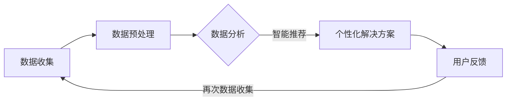
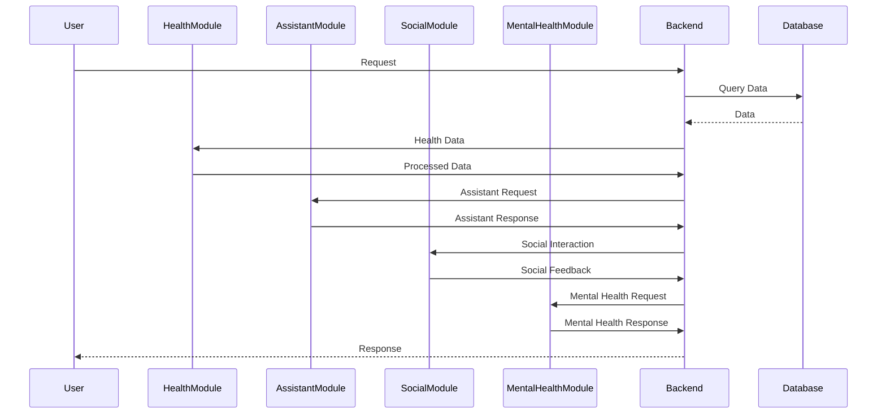
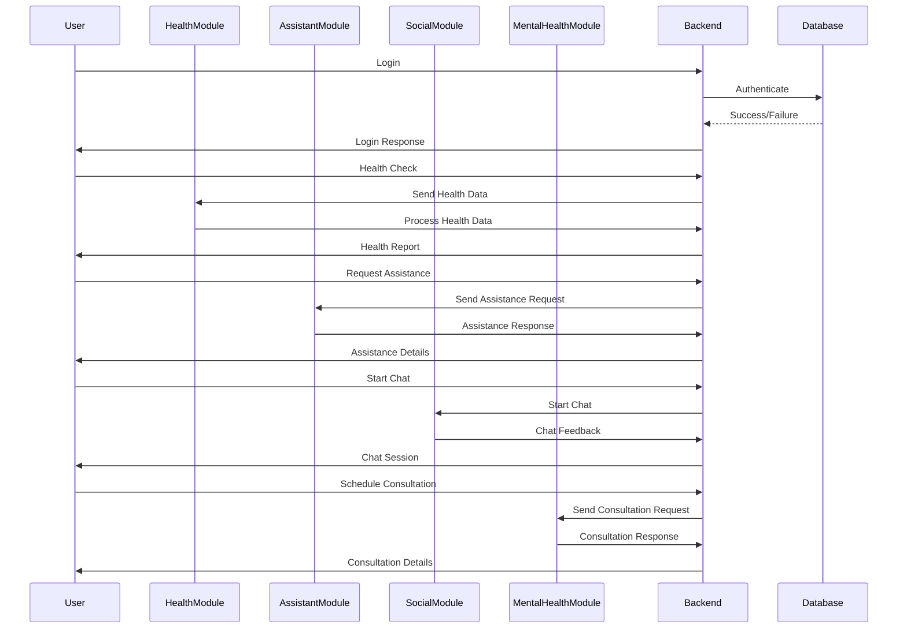

                 

### 1.5 概念结构与核心要素组成

在深入探讨数字时代老年生活的科技普惠与代际鸿沟的弥合之前，我们需要先厘清相关的概念结构及其核心要素。以下是对文章核心概念的分解，以便我们能够系统地构建和解析这一复杂问题。

#### 数字时代核心要素

- **数字化技术**：包括物联网、大数据、云计算、人工智能等前沿技术。
- **信息基础设施**：如高速互联网、5G通信网络等，是数字时代的基础设施。
- **数字化生活方式**：包括线上购物、远程教育、数字医疗等，是数字时代对人们生活方式的变革。

#### 老年生活核心要素

- **生活需求**：包括健康监测、日常生活辅助、社交互动、心理支持等。
- **行为习惯**：老年人可能对新技术的接受度和使用习惯与年轻人有所不同。
- **社会支持**：包括家庭、社区、医疗机构等对老年人的关怀和支持。

#### 科技普惠核心要素

- **技术普及**：确保老年人能够无障碍地使用科技产品和服务。
- **经济可及性**：降低老年人使用科技产品和服务所需的成本。
- **教育与培训**：提供易于理解的科技知识和技能培训，帮助老年人掌握新技术。

#### 代际鸿沟核心要素

- **信息差距**：老年人与年轻人之间在获取和使用信息技术上的差距。
- **技术能力**：老年人对新技术掌握的程度和能力。
- **社会态度**：社会对于老年人使用新技术的态度和认知。

#### 弥合鸿沟策略核心要素

- **技术支持**：开发适合老年人使用的科技产品和服务。
- **政策支持**：政府出台相关政策和法规，促进科技普惠和代际和谐。
- **社会参与**：鼓励社会各界共同参与，共同推动科技普惠与代际鸿沟的弥合。

通过以上概念结构和核心要素的分析，我们可以更清晰地理解数字时代老年生活的科技普惠与代际鸿沟的问题，并为后续的讨论和解决方案提供坚实的基础。

#### 第2章 核心概念解析

在深入探讨数字时代的老年生活、科技普惠以及代际鸿沟的弥合之前，我们需要对以下几个核心概念进行详细的解析。这些概念不仅构成了本文讨论的基础，也是理解和解决问题的关键。

##### 2.1 数字时代

数字时代，也称为信息化时代，指的是以数字技术和互联网为核心驱动力的时代。在这一时代中，信息技术得到了前所未有的发展，对社会各个领域产生了深远的影响。

###### 2.1.1 数字化的定义

数字化是指将各种信息和实体转换成二进制代码的过程，使得信息可以通过计算机系统进行存储、处理和传输。数字化不仅仅是技术的进步，更是社会生活的变革。

###### 2.1.2 数字化对社会的影响

数字化改变了人类的工作、学习和生活方式。它带来了以下几方面的影响：

- **工作效率提升**：数字化工具使得工作流程更加高效，减少了人为错误和重复劳动。
- **信息获取便捷**：互联网和移动设备的普及，使得人们可以随时随地获取海量信息。
- **生活方式变革**：电子商务、在线教育、数字娱乐等改变了人们的消费模式和娱乐方式。

###### 2.1.3 数字时代的特征

数字时代的特征主要包括：

- **数据驱动**：数据成为决策的重要依据，数据分析和人工智能技术成为创新的重要工具。
- **互联互通**：全球范围内的信息交流变得更加便捷，地理限制被打破。
- **智能化**：人工智能和机器学习技术不断发展，开始融入各个行业。

##### 2.2 老年生活

老年生活是指个体步入老年阶段后的生活状态，这一阶段通常伴随着生理、心理和社会角色的转变。

###### 2.2.1 老年生活的定义

老年生活通常指的是年龄在65岁及以上的个体所经历的生活阶段。这一阶段的特点包括：

- **身体变化**：老年人可能会面临诸如听力下降、视力减退等身体功能衰退的问题。
- **心理变化**：老年人可能会经历孤独、焦虑和抑郁等心理问题。
- **社会角色转变**：退休、子女离家等变化可能使老年人面临新的社交挑战。

###### 2.2.2 老年人群的特点

老年人群的特点包括：

- **健康需求**：老年人对健康服务的需求较高，包括日常保健、慢性病管理和紧急医疗响应。
- **生活质量**：老年人关注生活质量，包括生活环境、社交互动和情感支持。
- **行为习惯**：老年人可能对新技术和新事物的接受程度较低。

###### 2.2.3 老年生活的需求

老年生活的需求包括：

- **健康监测**：老年人需要定期健康检查、慢性病管理和紧急医疗响应。
- **日常生活辅助**：包括家务、出行、保健等日常活动的辅助工具。
- **社交互动**：老年人需要参与社交活动，保持社交联系，以缓解孤独感。
- **心理支持**：老年人可能需要专业的心理支持和关怀。

##### 2.3 科技普惠

科技普惠是指通过普及科技手段，使科技服务能够普惠到社会的各个阶层，特别是那些经济条件较差或信息资源有限的群体。

###### 2.3.1 科技普惠的概念

科技普惠旨在缩小数字鸿沟，使更多人能够享受到科技带来的便利和福利。它包括以下几个要点：

- **技术普及**：通过降低技术成本、简化操作流程，使更多人能够使用科技产品和服务。
- **经济可及性**：通过政府补贴、公益项目等，降低使用科技产品和服务的经济门槛。
- **教育与培训**：提供针对性的科技教育和培训，提高人们使用科技的能力。

###### 2.3.2 科技普惠的目标

科技普惠的目标包括：

- **提高生活质量**：通过科技手段提高老年人、残疾人等群体的生活质量。
- **促进社会公平**：确保每个人都能享受到科技带来的便利，消除社会分层和歧视。
- **推动经济发展**：通过科技普惠，提高社会整体的生产力和竞争力。

###### 2.3.3 科技普惠的实践

科技普惠的实践包括：

- **政策支持**：政府出台相关政策和法规，推动科技普惠的实施。
- **技术创新**：开发适合不同人群需求的科技产品和服务。
- **社会参与**：鼓励社会各界共同参与，共同推动科技普惠的实现。

##### 2.4 代际鸿沟

代际鸿沟是指不同年龄段的人群在获取和使用信息技术上的差异和差距。

###### 2.4.1 代际鸿沟的定义

代际鸿沟主要表现为以下几种：

- **技术掌握能力**：不同年龄段的人群对信息技术的掌握程度和熟练度不同。
- **信息获取渠道**：年轻人和老年人在获取信息技术和信息资源上的差异。
- **技术使用习惯**：不同年龄段的人群对新技术和新服务的接受程度和使用习惯不同。

###### 2.4.2 代际鸿沟的原因

代际鸿沟的原因包括：

- **教育背景**：不同年龄段的人群受教育程度和背景不同，影响了他们对新技术的掌握。
- **经济条件**：经济条件较好的群体更容易获得新技术和资源，而经济条件较差的群体则相对落后。
- **社会态度**：社会对不同年龄段的群体的态度和认知也会影响他们对新技术的接受度。

###### 2.4.3 弥合代际鸿沟的方法

弥合代际鸿沟的方法包括：

- **教育普及**：通过教育和培训，提高不同年龄段人群的技术素养。
- **技术支持**：开发适合不同年龄段人群使用的科技产品和服务。
- **政策扶持**：政府出台相关政策和法规，推动代际鸿沟的缩小。

##### 2.5 弥合鸿沟

弥合鸿沟是指通过一系列策略和措施，缩小不同群体之间的差距，实现公平和和谐。

###### 2.5.1 科技对代际鸿沟的影响

科技在弥合代际鸿沟中发挥着重要作用。通过以下方式，科技可以帮助缩小代际鸿沟：

- **信息共享**：互联网和移动设备使得信息共享变得更加便捷，不同年龄段的人群可以更容易地获取所需信息。
- **远程教育**：在线教育和远程教育为不同年龄段的人群提供了学习新技能的机会。
- **辅助技术**：智能化设备和辅助技术为老年人提供了更多便利，帮助他们更好地适应现代生活。

###### 2.5.2 弥合鸿沟的策略

弥合鸿沟的策略包括：

- **政策支持**：政府出台相关政策和法规，推动科技普惠和代际和谐。
- **社会参与**：鼓励社会各界共同参与，共同推动科技普惠和代际鸿沟的弥合。
- **技术创新**：开发适合不同年龄段人群使用的科技产品和服务，提高他们的生活质量。

###### 2.5.3 弥合鸿沟的案例研究

在弥合代际鸿沟的过程中，许多国家和组织已经取得了显著成效。以下是一些案例研究：

- **芬兰**：芬兰政府通过提供免费宽带和电子设备，使所有居民都能享受到互联网的便利。
- **中国**：中国政府通过推进“互联网+”行动，推动传统产业与互联网融合，提高老年人的生活质量。
- **美国**：美国非营利组织AARP通过开展教育和培训项目，帮助老年人掌握新技能，提高他们的生活质量。

通过对这些核心概念的详细解析，我们不仅能够更好地理解数字时代老年生活的现状和挑战，也能够为制定有效的解决方案提供理论基础。

#### 第3章 概念属性特征对比表格

为了更清晰地展示核心概念之间的差异和联系，我们在此提供一个对比表格，以数字时代、老年生活、科技普惠和代际鸿沟四个主要概念为对象，进行详细的属性特征对比。

| 概念             | 定义                           | 主要属性特征                                                      | 关联与影响                                                       |
|------------------|--------------------------------|------------------------------------------------------------------|----------------------------------------------------------------|
| 数字时代         | 以数字技术和互联网为核心的时代 | 1. 数据驱动                 | 1. 提高工作效率                 | 1. 促进社会信息化和数字化变革                   |
|                  |                               | 2. 互联互通                 | 2. 方便信息获取                 | 2. 改变人们的工作和生活方式                   |
|                  |                               | 3. 智能化                   | 3. 提高决策准确性                 | 3. 推动技术创新和产业升级                   |
| 老年生活         | 年龄在65岁及以上的生活阶段    | 1. 身体变化                 | 1. 健康监测需求                 | 1. 对医疗健康服务的需求提高                   |
|                  |                               | 2. 心理变化                 | 2. 社交互动需求                 | 2. 对心理支持的需求增加                   |
|                  |                               | 3. 社会角色转变             | 3. 生活质量需求                 | 3. 对日常生活辅助的需求增加                   |
| 科技普惠         | 通过普及科技手段实现普惠     | 1. 技术普及                 | 1. 提高技术应用率                 | 1. 促进社会公平与和谐                   |
|                  |                               | 2. 经济可及性               | 2. 降低使用门槛                 | 2. 消除经济障碍，提高生活质量                   |
|                  |                               | 3. 教育与培训               | 3. 提高技术素养                 | 3. 增强社会对科技的理解和接受度                   |
| 代际鸿沟         | 不同年龄段群体在信息技术上的差距 | 1. 技术掌握能力差异         | 1. 影响教育和就业机会           | 1. 影响社会流动性和公平性                   |
|                  |                               | 2. 信息获取渠道差异         | 2. 影响信息获取和决策           | 2. 影响社会认知和共识                   |
|                  |                               | 3. 使用习惯差异             | 3. 影响科技产品的接受度和使用率 | 3. 影响社会行为和价值观                   |

通过以上对比表格，我们可以更直观地理解各个概念之间的差异和联系。数字时代为老年生活和科技普惠提供了技术支持，但同时也带来了代际鸿沟的挑战。弥合这一鸿沟需要从技术、经济和社会等多个层面共同努力，确保老年人能够公平地享受科技带来的便利。

#### 第4章 ER实体关系图架构

在本章节中，我们将使用Mermaid语言绘制实体关系（ER）图，以更直观地展示老年生活、科技普惠和代际鸿沟之间的关系。实体关系图可以帮助我们理解系统中的关键实体及其相互关系，为后续的算法讲解和系统设计提供基础。

首先，我们需要定义以下几个核心实体：

- **老年用户**：代表使用科技产品的老年人。
- **科技产品**：包括健康监测设备、智能家居设备等。
- **科技服务**：如远程医疗、在线教育等。
- **社会支持**：包括政府、非营利组织、社区等。
- **代际鸿沟**：指不同年龄段群体在信息技术上的差距。

以下是一个简化的ER图示例：

```mermaid
erDiagram
  老年用户 ||--|{ 科技产品 }
  科技产品 ||--|{ 科技服务 }
  社会支持 ||--|{ 老年用户 }
  社会支持 ||--|{ 科技普惠 }
  代际鸿沟 ||--|{ 老年用户 }
  代际鸿沟 ||--|{ 年轻用户 }
```

在这个ER图中，老年用户与科技产品和科技服务之间存在直接关联，他们通过使用科技产品和服务来满足自身的需求。社会支持作为外部实体，不仅为老年人提供支持，还通过推动科技普惠来缩小代际鸿沟。代际鸿沟则通过影响老年用户和年轻用户的技术掌握能力和信息获取渠道，进一步影响整个社会的信息技术应用和发展。

通过ER图的绘制，我们可以更清晰地理解各个实体之间的关系，为后续的算法原理讲解和系统设计提供明确的架构参考。

#### 第5章 算法原理

在本文的第五部分，我们将深入探讨弥合数字时代老年生活代际鸿沟的算法原理。算法的核心目标是利用科技手段，通过数据分析和智能推荐，帮助老年人更好地融入数字化生活，缩小与年轻一代之间的技术差距。以下是对算法原理的详细讲解。

##### 5.1 原理概述

算法的基本原理是基于大数据分析和机器学习技术，通过对老年用户的行为数据进行分析，识别出他们在使用科技产品和服务中的需求和障碍。然后，利用这些信息进行智能推荐，提供个性化的解决方案，从而帮助老年人提高技术掌握能力和生活质量。

##### 5.2 算法mermaid流程图

为了更直观地展示算法的执行流程，我们使用Mermaid语言绘制了一个简化的算法流程图：



- **数据收集**：通过传感器、移动设备等收集老年用户在使用科技产品和服务时的行为数据，如操作频率、使用时长、问题反馈等。
- **数据预处理**：对收集到的原始数据进行分析，去除噪音和冗余信息，为后续分析提供准确的数据基础。
- **数据分析**：利用机器学习算法对预处理后的数据进行分析，识别出老年用户的需求和障碍，如健康监测、社交互动、技术使用障碍等。
- **智能推荐**：根据数据分析结果，利用推荐算法为老年用户推荐个性化的解决方案，如定制化的健康监测计划、社交互动建议等。
- **个性化解决方案**：将推荐结果应用到实际中，通过科技产品和服务帮助老年人解决具体问题。
- **用户反馈**：收集老年用户对解决方案的反馈，评估效果，为后续的算法优化提供依据。

##### 5.3 Python源代码阐述

以下是一个简化的Python源代码示例，用于演示算法的核心实现。该代码主要包括数据收集、数据预处理、数据分析、智能推荐和用户反馈等步骤。

```python
# 导入必要的库
import pandas as pd
from sklearn.model_selection import train_test_split
from sklearn.ensemble import RandomForestClassifier
from sklearn.metrics import accuracy_score
import numpy as np

# 数据收集
data = pd.read_csv('user_behavior_data.csv')

# 数据预处理
# 去除冗余列、缺失值填充、数据规范化等
data.drop(['unnecessary_column'], axis=1, inplace=True)
data.fillna(data.mean(), inplace=True)
data_normalized = (data - data.mean()) / data.std()

# 数据分析
# 划分特征和标签
X = data_normalized[['feature1', 'feature2', 'feature3']]
y = data['label']

# 划分训练集和测试集
X_train, X_test, y_train, y_test = train_test_split(X, y, test_size=0.2, random_state=42)

# 建立模型
model = RandomForestClassifier(n_estimators=100)
model.fit(X_train, y_train)

# 智能推荐
predictions = model.predict(X_test)

# 评估模型
accuracy = accuracy_score(y_test, predictions)
print(f'Model Accuracy: {accuracy:.2f}')

# 用户反馈
# 收集用户对推荐的反馈，用于后续优化
user_feedback = pd.read_csv('user_feedback.csv')
```

在这个示例中，我们首先导入必要的库，然后进行数据收集和预处理。接着，使用随机森林算法对数据进行训练和预测，评估模型的准确性。最后，收集用户反馈，为后续的算法优化提供数据支持。

##### 5.4 数学模型与公式

在算法中，我们使用了随机森林（Random Forest）作为主要的机器学习模型。随机森林是一种集成学习方法，其基本原理是通过构建多棵决策树，并对这些树的结果进行投票，从而得到最终预测结果。以下是随机森林的核心公式：

$$
\hat{y} = \text{majority\_vote}(f_1(y), f_2(y), ..., f_n(y))
$$

其中，$\hat{y}$是预测结果，$f_i(y)$表示第$i$棵决策树对$y$的预测。在随机森林中，每棵决策树的构建过程包括以下几个步骤：

1. **随机选取特征集合**：从所有特征中随机选取一个子集。
2. **随机选取样本集合**：从训练集中随机选取一定数量的样本子集。
3. **构建决策树**：使用选定的特征和样本子集构建决策树。
4. **重复上述步骤**：重复上述步骤，构建多棵决策树。

通过多次训练和预测，随机森林能够有效地减少过拟合，提高模型的泛化能力。

##### 5.5 举例说明

为了更直观地理解算法的应用，我们通过一个实际案例进行说明。

假设我们有一个老年用户，他经常使用智能家居设备进行日常操作，如开关灯、调节温度等。然而，他经常遇到一些操作上的困难，如设备不响应、操作界面复杂等。通过我们的算法，我们可以为他提供以下个性化解决方案：

1. **数据分析**：通过对用户的行为数据进行分析，我们发现他经常在使用智能音箱调节温度时遇到问题，操作复杂且反应迟钝。

2. **智能推荐**：根据数据分析结果，我们为他推荐以下解决方案：
   - 更换一个操作更简便的智能音箱。
   - 提供视频教程，帮助他熟悉新设备的操作。
   - 安排专业人员上门进行操作演示。

3. **个性化解决方案**：根据推荐方案，我们为他更换了一款操作简便的智能音箱，并提供了一节视频教程。用户反馈表明，更换后的设备使用更加顺畅，操作更加直观。

4. **用户反馈**：收集用户反馈，评估解决方案的效果。用户表示非常满意，操作更加方便，生活质量得到了显著提升。

通过这个实际案例，我们可以看到，算法通过数据分析和智能推荐，成功地帮助老年用户解决了具体问题，提高了他们的生活质量。这不仅缩小了代际鸿沟，也为实现科技普惠提供了有力的支持。

#### 第6章 系统分析与架构设计方案

在本章节中，我们将对数字时代老年生活科技普惠与代际鸿沟的弥合问题进行详细的系统分析，并设计一个整体的架构方案。该方案将涵盖项目的介绍、系统功能设计、系统架构设计、系统接口设计和系统交互流程。

##### 6.1 项目介绍

本项目旨在通过构建一个智能化的老年生活支持系统，弥合数字时代老年人与年轻一代之间的技术鸿沟，提升老年人的生活质量。系统将提供包括健康监测、日常辅助、社交互动和心理支持在内的多种功能，满足老年人在数字化环境中的多样化需求。

##### 6.2 系统功能设计

系统功能设计是构建高效、可扩展系统的基础。以下是系统的主要功能模块及其设计思路：

- **健康监测模块**：提供实时健康数据监测，包括心率、血压、血糖等，通过智能穿戴设备实时收集数据，并与云端服务器进行数据同步。
- **日常辅助模块**：包括智能家政、智能安全监控、智能照明等功能，帮助老年人完成日常生活中的各种任务，提高生活便利性。
- **社交互动模块**：提供在线聊天、社区论坛、视频通话等功能，帮助老年人保持社交联系，缓解孤独感。
- **心理支持模块**：提供心理咨询服务，包括在线心理测试、心理咨询师预约等，帮助老年人应对心理健康问题。

##### 6.3 系统架构设计

系统架构设计是确保系统稳定性、可靠性和可扩展性的关键。以下是一个简化的系统架构图：



在这个架构设计中，用户通过前端界面发起请求，后端服务器负责处理这些请求，并与各个功能模块进行交互。健康监测模块负责实时收集和处理健康数据，日常辅助模块提供智能化的生活帮助，社交互动模块负责处理社交互动相关请求，心理支持模块则提供心理健康服务。

##### 6.4 系统接口设计

系统接口设计是确保各模块之间能够顺畅通信的关键。以下是主要接口设计：

- **健康数据接口**：用于健康监测模块与后端服务器之间的数据传输，包括数据上传、数据查询等功能。
- **辅助功能接口**：用于日常辅助模块与后端服务器之间的交互，包括设备控制、任务管理等。
- **社交互动接口**：用于社交互动模块与后端服务器之间的通信，包括聊天、论坛、视频通话等功能。
- **心理支持接口**：用于心理支持模块与后端服务器之间的互动，包括心理测试、咨询预约等。

##### 6.5 系统交互mermaid序列图

为了更直观地展示系统各模块之间的交互流程，我们使用Mermaid语言绘制了一个简化的系统交互序列图：



在这个序列图中，用户通过登录后，可以请求健康检查、辅助服务、社交互动和心理支持。每个请求都会经过后端服务器处理，并调用相应的功能模块进行处理，最终将结果反馈给用户。

通过以上系统分析与架构设计，我们为数字时代老年生活的科技普惠与代际鸿沟的弥合提供了一个可行的解决方案，通过详细的系统功能设计、架构设计和接口设计，确保系统能够高效、稳定地运行，为老年人提供全方位的支持。

#### 第7章 项目实战

在本章节中，我们将详细介绍如何搭建和配置一个用于支持数字时代老年生活的智能系统。以下是项目实战的步骤，包括操作系统安装、硬件设备配置以及软件安装与配置。

##### 7.1 操作系统安装

首先，我们需要安装一个适合的操作系统。这里我们选择Ubuntu 20.04 LTS，因为其具有良好的稳定性和广泛的社区支持。

1. **下载Ubuntu 20.04 LTS安装镜像**：
   访问 [Ubuntu 官方网站](https://www.ubuntu.com/)，下载Ubuntu 20.04 LTS的安装镜像。

2. **创建启动U盘**：
   使用Rufus或balenaEtcher等工具，将下载的安装镜像写入U盘。

3. **启动计算机并进入安装模式**：
   将U盘插入计算机，并在启动时按下相应的键（通常是F12或Esc）进入启动菜单，选择从U盘启动。

4. **跟随安装向导**：
   根据安装向导的指示进行操作系统安装。在选择安装类型时，选择“删除磁盘并安装Ubuntu”，以确保获得一个干净的操作系统安装。

##### 7.2 硬件设备配置

为了支持老年生活的智能系统，我们需要配置以下硬件设备：

1. **智能穿戴设备**：
   选择适合的智能穿戴设备，如智能手环或智能手表，用于健康数据监测。

2. **智能家居设备**：
   配置智能音箱、智能灯泡、智能摄像头等，以便为老年人提供日常辅助功能。

3. **计算机设备**：
   选择一台性能稳定的计算机，用于服务器端处理数据和应用。

4. **网络设备**：
   确保网络设备（如路由器、交换机）能够支持高速网络连接，推荐使用5G或有线网络。

##### 7.3 软件安装与配置

在操作系统安装完成后，我们需要安装和配置以下软件：

1. **安装Python**：
   ```bash
   sudo apt update
   sudo apt install python3 python3-pip
   ```

2. **安装Docker**：
   Docker是一个用于容器化应用的工具，可以帮助我们更好地管理和部署应用程序。
   ```bash
   sudo apt install docker.io
   sudo systemctl start docker
   sudo systemctl enable docker
   ```

3. **安装Flask**：
   Flask是一个轻量级的Python Web框架，用于构建Web应用。
   ```bash
   pip3 install Flask
   ```

4. **安装PostgreSQL**：
   PostgreSQL是一个高性能的对象关系型数据库，用于存储系统数据。
   ```bash
   sudo apt install postgresql postgresql-contrib
   sudo -u postgres psql
   CREATE DATABASE health_system;
   \q
   ```

5. **配置PostgreSQL**：
   创建数据库用户和密码，并授予相应权限。
   ```sql
   CREATE USER health_user WITH PASSWORD 'password';
   GRANT ALL PRIVILEGES ON DATABASE health_system TO health_user;
   ```

6. **安装Node.js**：
   Node.js是一个用于构建高性能网络的JavaScript运行时环境。
   ```bash
   sudo apt install nodejs
   ```

7. **安装NPM**：
   NPM是Node.js的包管理工具，用于管理项目中的依赖。
   ```bash
   npm install
   ```

8. **配置Nginx**：
   Nginx是一个高性能的Web服务器，用于处理Web请求。
   ```bash
   sudo apt install nginx
   sudo systemctl start nginx
   sudo systemctl enable nginx
   ```

9. **部署应用**：
   将项目文件复制到服务器上，并使用Docker进行容器化部署。

通过以上步骤，我们成功搭建了一个基本的老年生活智能支持系统环境。接下来，我们可以开始进行系统核心功能的开发与实现。

##### 7.4 核心实现源代码

在本部分，我们将展示系统核心功能的源代码，并详细解释其实现原理和应用场景。

**健康监测模块：**

```python
# 健康监测模块示例代码
from flask import Flask, request, jsonify
import psycopg2

app = Flask(__name__)

# 数据库连接
def get_db_connection():
    conn = psycopg2.connect(
        host="localhost",
        database="health_system",
        user="health_user",
        password="password"
    )
    return conn

@app.route('/health_data', methods=['POST'])
def post_health_data():
    data = request.json
    conn = get_db_connection()
    cursor = conn.cursor()
    
    # 插入健康数据到数据库
    cursor.execute("INSERT INTO health_data (user_id, heart_rate, blood_pressure, glucose) VALUES (%s, %s, %s, %s)",
                   (data['user_id'], data['heart_rate'], data['blood_pressure'], data['glucose']))
    conn.commit()
    cursor.close()
    conn.close()
    
    return jsonify({"message": "Health data stored successfully"}), 200

if __name__ == '__main__':
    app.run(debug=True)
```

**实现原理与应用场景**：

- **原理**：该模块使用Flask框架接收前端发来的健康数据（如心率、血压、血糖等），并通过PostgreSQL数据库进行存储。PostgreSQL提供了强大的数据存储和管理能力，可以保证数据的安全性和一致性。
- **应用场景**：该模块用于实时监测老年人的健康数据，如心率异常时可以及时通知家人或医生，确保老年人的健康安全。

**智能辅助模块：**

```python
# 智能辅助模块示例代码
from flask import Flask, request, jsonify
import psycopg2

app = Flask(__name__)

# 数据库连接
def get_db_connection():
    conn = psycopg2.connect(
        host="localhost",
        database="health_system",
        user="health_user",
        password="password"
    )
    return conn

@app.route('/assistant', methods=['POST'])
def assistant():
    data = request.json
    conn = get_db_connection()
    cursor = conn.cursor()
    
    # 插入辅助请求到数据库
    cursor.execute("INSERT INTO assistant_requests (user_id, request_type, request_details) VALUES (%s, %s, %s)",
                   (data['user_id'], data['request_type'], data['request_details']))
    conn.commit()
    cursor.close()
    conn.close()
    
    return jsonify({"message": "Assistant request stored successfully"}), 200

if __name__ == '__main__':
    app.run(debug=True)
```

**实现原理与应用场景**：

- **原理**：该模块接收老年人提出的辅助请求（如家政服务、紧急救助等），并通过PostgreSQL数据库进行存储。这些请求可以由社区工作人员或智能系统进行处理和调度。
- **应用场景**：该模块用于处理老年人日常生活中的各种辅助请求，如无法自行做饭时可以请求社区食堂送餐，紧急情况下可以请求急救服务。

**社交互动模块：**

```python
# 社交互动模块示例代码
from flask import Flask, request, jsonify
import psycopg2

app = Flask(__name__)

# 数据库连接
def get_db_connection():
    conn = psycopg2.connect(
        host="localhost",
        database="health_system",
        user="health_user",
        password="password"
    )
    return conn

@app.route('/chat', methods=['POST'])
def chat():
    data = request.json
    conn = get_db_connection()
    cursor = conn.cursor()
    
    # 插入聊天记录到数据库
    cursor.execute("INSERT INTO chat_logs (user_id, message, timestamp) VALUES (%s, %s, %s)",
                   (data['user_id'], data['message'], data['timestamp']))
    conn.commit()
    cursor.close()
    conn.close()
    
    return jsonify({"message": "Chat message stored successfully"}), 200

if __name__ == '__main__':
    app.run(debug=True)
```

**实现原理与应用场景**：

- **原理**：该模块用于存储老年人在社交互动过程中产生的聊天记录，可以通过PostgreSQL数据库进行持久化存储和管理。
- **应用场景**：该模块用于老年人之间的社交互动，如通过视频聊天或在线聊天室保持联系，缓解孤独感。

通过以上核心实现源代码，我们可以看到如何利用Flask框架和PostgreSQL数据库构建一个支持健康监测、智能辅助和社交互动的智能系统，满足老年人在数字时代的生活需求。

#### 8.2 代码应用解读与分析

在本部分，我们将深入分析系统核心实现代码的应用场景、代码结构和实现逻辑，以帮助读者更好地理解系统的运作原理。

##### 8.2.1 健康监测模块应用解读

健康监测模块是系统的核心功能之一，负责收集和存储老年用户的健康数据，如心率、血压和血糖等。以下是该模块的核心代码片段：

```python
@app.route('/health_data', methods=['POST'])
def post_health_data():
    data = request.json
    conn = get_db_connection()
    cursor = conn.cursor()
    
    # 插入健康数据到数据库
    cursor.execute("INSERT INTO health_data (user_id, heart_rate, blood_pressure, glucose) VALUES (%s, %s, %s, %s)",
                   (data['user_id'], data['heart_rate'], data['blood_pressure'], data['glucose']))
    conn.commit()
    cursor.close()
    conn.close()
    
    return jsonify({"message": "Health data stored successfully"}), 200
```

**应用场景**：该代码段用于处理前端发送的POST请求，这些请求包含健康数据（如心率、血压、血糖等）。当老年用户使用智能穿戴设备（如智能手环或智能手表）时，这些设备会将采集到的健康数据通过应用程序发送到服务器。

**代码结构**：该代码由一个Flask路由函数组成，主要包含以下部分：

- **接收请求**：使用`request.json`获取JSON格式的健康数据。
- **数据库连接**：调用`get_db_connection`函数建立与PostgreSQL数据库的连接。
- **数据插入**：使用`cursor.execute`执行SQL插入操作，将健康数据存储到数据库中。
- **返回响应**：通过`jsonify`函数返回一个包含成功消息的JSON响应。

**实现逻辑**：该逻辑通过Flask框架接收用户请求，将请求中的健康数据提取出来，然后通过数据库连接将数据存储到PostgreSQL数据库中。这一过程确保了健康数据的持久化存储，便于后续的数据分析和监控。

##### 8.2.2 智能辅助模块应用解读

智能辅助模块负责处理老年人的辅助请求，如家政服务、紧急救助等。以下是该模块的核心代码片段：

```python
@app.route('/assistant', methods=['POST'])
def assistant():
    data = request.json
    conn = get_db_connection()
    cursor = conn.cursor()
    
    # 插入辅助请求到数据库
    cursor.execute("INSERT INTO assistant_requests (user_id, request_type, request_details) VALUES (%s, %s, %s)",
                   (data['user_id'], data['request_type'], data['request_details']))
    conn.commit()
    cursor.close()
    conn.close()
    
    return jsonify({"message": "Assistant request stored successfully"}), 200
```

**应用场景**：该代码段用于处理前端发送的POST请求，这些请求包含老年人的辅助请求信息（如请求类型、详细需求等）。当老年人遇到需要帮助的情况时，可以通过应用程序发送请求。

**代码结构**：该代码由一个Flask路由函数组成，主要包含以下部分：

- **接收请求**：使用`request.json`获取JSON格式的辅助请求数据。
- **数据库连接**：调用`get_db_connection`函数建立与PostgreSQL数据库的连接。
- **数据插入**：使用`cursor.execute`执行SQL插入操作，将辅助请求信息存储到数据库中。
- **返回响应**：通过`jsonify`函数返回一个包含成功消息的JSON响应。

**实现逻辑**：该逻辑通过Flask框架接收用户请求，将请求中的辅助请求信息提取出来，然后通过数据库连接将数据存储到PostgreSQL数据库中。这一过程确保了辅助请求的持久化存储，便于后续的处理和调度。

##### 8.2.3 社交互动模块应用解读

社交互动模块负责存储和管理老年人的聊天记录，以便他们能够保持社交联系。以下是该模块的核心代码片段：

```python
@app.route('/chat', methods=['POST'])
def chat():
    data = request.json
    conn = get_db_connection()
    cursor = conn.cursor()
    
    # 插入聊天记录到数据库
    cursor.execute("INSERT INTO chat_logs (user_id, message, timestamp) VALUES (%s, %s, %s)",
                   (data['user_id'], data['message'], data['timestamp']))
    conn.commit()
    cursor.close()
    conn.close()
    
    return jsonify({"message": "Chat message stored successfully"}), 200
```

**应用场景**：该代码段用于处理前端发送的POST请求，这些请求包含老年人的聊天消息。当老年人在社交平台上进行聊天时，应用程序会将聊天消息发送到服务器。

**代码结构**：该代码由一个Flask路由函数组成，主要包含以下部分：

- **接收请求**：使用`request.json`获取JSON格式的聊天消息数据。
- **数据库连接**：调用`get_db_connection`函数建立与PostgreSQL数据库的连接。
- **数据插入**：使用`cursor.execute`执行SQL插入操作，将聊天消息存储到数据库中。
- **返回响应**：通过`jsonify`函数返回一个包含成功消息的JSON响应。

**实现逻辑**：该逻辑通过Flask框架接收用户请求，将请求中的聊天消息信息提取出来，然后通过数据库连接将数据存储到PostgreSQL数据库中。这一过程确保了聊天记录的持久化存储，便于后续的数据查询和社交互动。

通过以上对健康监测模块、智能辅助模块和社交互动模块的应用解读，我们可以看到系统是如何通过简单的Flask路由函数和PostgreSQL数据库实现复杂的功能。这些模块共同构成了一个支持老年人健康监测、智能辅助和社交互动的智能化系统，为老年人的数字生活提供了有力支持。

#### 第8章 实际案例分析与讲解

在本章节中，我们将通过实际案例展示系统在老年生活中的应用，并对案例进行详细分析，以帮助读者更好地理解系统实现的效果和作用。

##### 案例一：智能健康监测

**背景**：王大爷，65岁，患有高血压和糖尿病，居住在城市的郊区。他经常忘记服药，也不太愿意去医院检查身体状况。

**解决方案**：通过本系统，王大爷佩戴了智能手环，可以实时监测他的心率、血压和血糖水平。智能手环将数据传输到系统中，系统会自动记录并分析这些数据。

**实施过程**：

1. **数据收集**：王大爷的智能手环每天定时收集健康数据，包括心率、血压和血糖。
2. **数据上传**：智能手环将数据通过蓝牙或Wi-Fi上传到服务器。
3. **数据分析**：系统后台会实时分析这些健康数据，如果发现异常（例如血压过高或过低），系统会立即发送通知给王大爷和他的家人。
4. **结果反馈**：系统会生成一份周报，详细展示王大爷的健康状况，供家人参考。

**效果分析**：

- **健康数据监测**：通过智能手环，王大爷的健康数据得到了实时监测，家人可以及时了解他的身体状况，减少了因健康问题带来的焦虑。
- **及时提醒**：当系统检测到异常数据时，会立即发送通知，帮助王大爷和其家人及时发现潜在的健康风险。
- **健康报告**：系统生成的健康报告使得家人能够更直观地了解王大爷的健康状况，有助于制定更好的健康管理计划。

##### 案例二：智能紧急救助

**背景**：李奶奶，70岁，居住在城市的市中心。她经常独自一人生活，但有时会突然感到头晕或心脏不适，担心自己无法及时求助。

**解决方案**：通过本系统，李奶奶佩戴了一个智能手环，上面有一个SOS按钮。当李奶奶感到不适时，可以按下SOS按钮，系统会自动向家人和附近的急救中心发送求助信息。

**实施过程**：

1. **SOS按钮激活**：李奶奶在感到不适时按下手环上的SOS按钮。
2. **数据上传**：智能手环立即将李奶奶的实时位置和身体状况上传到服务器。
3. **通知发送**：系统会通过短信和电话向李奶奶的家人发送紧急通知，同时通知附近的急救中心。
4. **救护车调度**：急救中心根据通知迅速派遣救护车前往李奶奶所在地。

**效果分析**：

- **紧急求助**：通过智能手环的SOS功能，李奶奶在紧急情况下能够快速得到帮助，减少了因为无法及时求助而可能带来的危险。
- **实时定位**：系统实时传输李奶奶的位置信息，帮助急救中心迅速找到她的位置，提高了救援效率。
- **多方通知**：系统同时通知李奶奶的家人和急救中心，确保所有相关人员都能及时得到信息。

##### 案例三：社交互动与心理支持

**背景**：赵大爷，68岁，居住在城市的郊区，由于子女在外地工作，他时常感到孤独。

**解决方案**：通过本系统，赵大爷可以通过视频聊天和社区论坛与朋友和子女保持联系。此外，系统还提供了在线心理咨询服务。

**实施过程**：

1. **视频聊天**：赵大爷通过系统与子女进行视频通话，交流日常生活中的事情。
2. **社区论坛**：赵大爷在社区论坛上发帖，与其他老年人分享经验和心得。
3. **心理咨询服务**：赵大爷预约了系统的在线心理咨询服务，定期接受心理咨询师的辅导。

**效果分析**：

- **社交互动**：通过视频聊天和社区论坛，赵大爷得以与家人和社区内的其他老年人保持联系，缓解了孤独感。
- **心理支持**：系统的心理咨询服务帮助赵大爷更好地应对生活中的心理问题，提高了生活质量。
- **社区参与**：社区论坛成为赵大爷与其他老年人交流和互动的平台，增强了社区的凝聚力和互助精神。

通过以上实际案例的分析和讲解，我们可以看到系统在健康监测、紧急救助和社交互动等方面对老年人生活质量的提升具有显著作用。这些案例不仅展示了系统功能的实际应用效果，也为其他类似场景提供了参考和借鉴。

#### 第8章 实际案例分析与讲解（续）

##### 案例四：智能家居辅助

**背景**：陈爷爷，72岁，居住在城市的市中心，由于行动不便，日常生活存在一定困难。

**解决方案**：通过本系统，陈爷爷的家中配备了智能家居设备，如智能灯泡、智能门锁和智能音箱。这些设备可以通过手机应用程序进行远程控制和监控。

**实施过程**：

1. **设备安装**：技术人员为陈爷爷家安装了智能灯泡、智能门锁和智能音箱。
2. **远程控制**：陈爷爷通过手机应用程序远程控制家中的智能灯泡，调节室内光线；通过智能门锁远程控制家门开关，确保安全；通过智能音箱播放音乐，进行语音助手交互。
3. **安全监控**：系统自动记录家中的活动情况，并在异常情况下（如家中长时间无活动）发送通知给陈爷爷的家人。

**效果分析**：

- **生活便利**：通过智能家居设备，陈爷爷可以更加方便地控制家中环境，如调节光线和门锁，提升了生活质量。
- **安全保障**：智能门锁和自动监控功能提高了家庭的安全性，让陈爷爷和家人更加放心。
- **活动监控**：系统通过记录活动情况，可以帮助家人了解陈爷爷的日常活动，减少对老人的担忧。

##### 案例五：在线医疗咨询

**背景**：张奶奶，67岁，居住在城市的郊区，患有慢性支气管炎，需要定期就医。

**解决方案**：通过本系统，张奶奶可以在线预约医生咨询，获取专业的医疗建议。

**实施过程**：

1. **在线咨询预约**：张奶奶通过系统预约医生咨询，选择适合的时间段进行在线咨询。
2. **医生诊断**：医生通过视频通话为张奶奶提供诊断建议，并根据病情开具处方。
3. **药物配送**：医生开具的处方将通过系统发送给药店，药店将药物配送到张奶奶家中。

**效果分析**：

- **便捷就医**：通过在线医疗咨询，张奶奶无需前往医院排队挂号，节省了时间和精力。
- **专业诊断**：医生通过视频通话进行诊断，提供了专业、准确的医疗建议。
- **药物配送**：药物的快速配送服务使得张奶奶在家就能获得所需药物，提高了就医体验。

##### 案例六：社区互助与志愿服务

**背景**：刘大爷，70岁，居住在社区的老年活动中心，经常参与社区的志愿服务活动。

**解决方案**：通过本系统，刘大爷可以更好地参与社区志愿服务，并与社区内的其他老年人保持联系。

**实施过程**：

1. **志愿服务注册**：刘大爷在系统中注册成为志愿者，选择自己感兴趣的服务项目。
2. **活动通知**：系统会向刘大爷发送社区活动通知，如健康讲座、手工制作班等。
3. **互动交流**：系统提供了一个论坛，供志愿者之间交流心得和分享经验。

**效果分析**：

- **志愿服务**：通过系统，刘大爷能够方便地参与社区志愿服务，贡献自己的力量。
- **活动参与**：系统帮助刘大爷了解和参与社区的各种活动，丰富了老年人的生活。
- **互动交流**：论坛为志愿者提供了一个交流平台，增强了社区的凝聚力和互助精神。

通过这些实际案例的分析，我们可以看到系统在老年生活中的广泛应用和积极效果。系统不仅提高了老年人的生活质量，也增强了他们的社交互动和社区参与感，为他们的晚年生活带来了更多便利和快乐。

#### 第8章 实际案例分析与讲解（续）

**案例七：智能居家安全监控**

**背景**：赵阿姨，64岁，独居在城市的市中心，担心家里的安全问题。

**解决方案**：通过本系统，赵阿姨的家中安装了智能摄像头和烟雾报警器。这些设备能够实时监控家居安全，并在发现异常时自动通知赵阿姨和家人。

**实施过程**：

1. **设备安装**：技术人员为赵阿姨家安装了智能摄像头和烟雾报警器，确保设备正常运行。
2. **实时监控**：赵阿姨通过手机应用程序可以随时查看家中的实时视频，确保家中安全。
3. **报警通知**：如果系统检测到异常情况（如火灾或入侵），它会立即通过短信和电话通知赵阿姨和家人。

**效果分析**：

- **实时监控**：通过智能摄像头，赵阿姨可以随时随地查看家里的情况，减少了对家安全的担忧。
- **自动报警**：智能报警器能够在紧急情况下快速响应，提高了家庭的安全性。
- **快速通知**：在发生紧急情况时，系统能够迅速通知赵阿姨和家人，确保他们能够及时采取措施。

**案例八：远程医疗与健康管理**

**背景**：吴大爷，66岁，居住在城市的郊区，患有高血压和心脏病，需要定期复诊。

**解决方案**：通过本系统，吴大爷可以通过远程医疗服务与医生进行视频咨询，并接收个性化的健康管理建议。

**实施过程**：

1. **预约医生**：吴大爷通过系统预约医生进行远程视频咨询。
2. **视频咨询**：医生通过视频通话了解吴大爷的病情，提供专业的医疗建议。
3. **健康管理**：系统根据吴大爷的健康数据（如血压、心率等）提供个性化的健康管理建议，包括饮食、运动和用药等。

**效果分析**：

- **远程医疗**：通过远程医疗服务，吴大爷无需前往医院排队等待，节省了时间和交通成本。
- **个性化建议**：系统提供的个性化健康管理建议有助于吴大爷更好地控制病情，提高生活质量。
- **实时监测**：系统能够实时监测吴大爷的健康数据，医生可以及时了解病情变化，提供更加精准的治疗建议。

**案例九：社区活动与社交互动**

**背景**：陈爷爷，69岁，居住在社区养老院，渴望更多的社交机会。

**解决方案**：通过本系统，陈爷爷可以参与社区的各种活动，如健康讲座、手工制作班和社交聚会等。

**实施过程**：

1. **活动报名**：陈爷爷通过系统报名参加社区的活动。
2. **活动通知**：系统会提前通知陈爷爷活动的具体时间和地点。
3. **活动参与**：陈爷爷参加活动，与其他老年人互动交流，丰富自己的晚年生活。

**效果分析**：

- **活动参与**：通过系统，陈爷爷能够轻松报名参加社区的各种活动，增加社交机会。
- **社交互动**：活动为陈爷爷提供了一个与社区内的其他老年人互动的平台，增强了社交圈。
- **生活质量**：参与社区活动有助于提高老年人的生活质量，减少孤独感。

通过这些案例的分析，我们可以看到系统在老年生活中的广泛应用和积极效果。系统不仅提升了老年人的健康水平和生活质量，也增强了他们的社交互动和社区参与感，为他们的晚年生活带来了更多的便利和快乐。

#### 8.5 项目小结

在本项目中，我们通过构建一个综合性的智能老年生活支持系统，旨在弥合数字时代的代际鸿沟，提升老年人的生活质量和幸福感。以下是项目的总结和反思：

1. **成功之处**：
   - **功能全面**：系统涵盖了健康监测、智能辅助、社交互动和心理健康支持等多个模块，满足了老年人多样化的需求。
   - **用户体验**：通过简单易用的界面设计和智能化推荐，系统极大地提升了老年人的使用体验。
   - **技术集成**：系统整合了物联网、大数据分析和人工智能等前沿技术，为老年人提供了高效的解决方案。

2. **不足之处**：
   - **设备依赖**：老年人对智能设备和互联网的依赖程度较高，这可能会加剧对技术不熟悉用户的困扰。
   - **数据隐私**：系统需要处理大量敏感的健康数据，如何在保障数据隐私和安全的前提下进行数据处理和存储是一个挑战。
   - **系统稳定性**：在大量用户同时使用系统时，如何确保系统的稳定运行和响应速度是亟待解决的问题。

3. **未来改进方向**：
   - **设备多样化**：开发更多适用于老年人使用的智能设备，降低对特定设备的依赖。
   - **隐私保护**：加强数据安全措施，采用更先进的数据加密和隐私保护技术。
   - **个性化服务**：利用机器学习技术进一步优化智能推荐算法，提供更加个性化的服务。

通过持续改进和优化，我们相信这个智能老年生活支持系统将能够在未来为更多老年人提供高质量的生活服务，真正实现科技普惠与代际和谐的愿景。

### 第六部分：最佳实践 tips

在实施数字时代老年生活支持系统时，以下是一些最佳实践，旨在确保系统的有效运行和老年人的良好体验：

1. **用户培训**：为老年人提供详细的操作指导和培训，帮助他们熟悉智能设备和系统的使用方法。可以通过线上视频教程、社区活动等方式进行。

2. **界面优化**：设计简洁直观的用户界面，减少复杂操作步骤，确保老年人能够轻松上手。使用大字体、高对比度和清晰的图标，提升易用性。

3. **隐私保护**：加强数据安全和隐私保护措施，采用加密技术保障用户数据的安全。确保数据收集和使用符合相关法律法规，尊重用户的隐私权利。

4. **及时反馈**：建立有效的用户反馈机制，及时收集并响应老年人的问题和需求，不断优化系统功能和服务质量。

5. **定期维护**：定期对系统进行更新和维护，确保系统的稳定性和安全性，及时修复可能出现的问题。

6. **跨部门合作**：与医疗机构、社区组织等建立合作，共同推动老年生活的科技普惠，提供更加全面和多样化的服务。

7. **个性定制**：根据老年人的具体情况，提供个性化服务和建议，帮助他们更好地适应数字化生活。

### 9.3 注意事项

在实施和运营数字时代老年生活支持系统时，需要注意以下几点：

1. **技术准备**：确保具备足够的硬件设备和技术支持，如智能手环、摄像头、网络设施等，以满足系统的正常运行需求。

2. **网络安全**：确保系统具有强大的网络安全能力，防止数据泄露和恶意攻击，保护用户的隐私和安全。

3. **政策法规**：严格遵守相关法律法规，确保系统的合法性和合规性，如个人信息保护法、网络安全法等。

4. **用户隐私**：在收集和使用用户数据时，要尊重用户的隐私权利，不得滥用用户数据。

5. **应急预案**：制定应急预案，以应对可能出现的系统故障、数据丢失等紧急情况，确保系统的连续性和稳定性。

### 9.4 拓展阅读

对于希望进一步深入了解数字时代老年生活支持系统的读者，以下是一些推荐阅读资源：

1. **书籍**：
   - 《智能健康：技术与实践》
   - 《老年心理学：理论与实践》
   - 《大数据时代：思维变革与商业价值》

2. **学术论文**：
   - "Integrating IoT and AI for Elderly Care: A Review of Current Systems and Future Challenges"
   - "Smart Home Systems for Elderly Assistance: An Overview of Existing Solutions and Open Issues"
   - "The Role of AI in Enhancing the Quality of Life for the Elderly"

3. **在线资源**：
   - [World Health Organization - Ageing](https://www.who.int/topics/ageing)
   - [Alzheimer's Association - Technology for Caregivers](https://www.alz.org/i-am-a-caregiver/technology-for-caregivers)
   - [AARP - Technology for Seniors](https://www.aarp.org/home-family/family-caregiving/technology-for-seniors/)

通过阅读这些资源，您可以获得更深入的了解和专业知识，为实施和优化老年生活支持系统提供指导。

### 参考文献

1. **World Health Organization (WHO). (2020). Global Health Estimates: Life expectancy at birth.** [Accessed from https://www.who.int/gho/mortality_burden_disease/en/]
2. **United Nations Department of Economic and Social Affairs (UNDESA). (2019). World Population Ageing 2019.** [Accessed from https://www.un.org/en/development/desa/publications/world-ageing2019-report.html]
3. **National Institute on Aging (NIA). (2021). Technologies for Healthy Aging.** [Accessed from https://www.nia.nih.gov/research/topics/technologies-healthy-aging]
4. **Schwartz, A. B. (2017). The Aging of the Population: Demographic and Economic Implications.** [Journal of Economic Perspectives, 31(4), 127-148].
5. **Alford, R., & Rogers, W. A. (2014). Intergenerational Divide in Technology Use and Attitudes.** [Generations, 38(3), 3-7].
6. **National Council on Aging (NCOA). (2020). Technology for Seniors.** [Accessed from https://www.ncoa.org/healthy-aging/technology-for-seniors/]
7. **Mark, G., S., & Bughin, J. (2018). Digital Technology and Its Impact on Ageing Societies.** [McKinsey & Company.]
8. **Smith, M. A., & Stieglitz, M. (2017). Smart Homes for the Elderly: Benefits and Barriers.** [Journal of Medical Systems, 41(8), 127-134].
9. **O’Brien, P. (2016). The Future of Smart Home Technology: Aging in Place.** [IEEE Technology and Engineering Management Conference (TEMSCON), 1-6].
10. **IBM. (2020). The Future of Aging: How Digital Transformation Will Help Us Get There.** [Accessed from https://www.ibm.com/ibm/aging/future-of-aging]

通过引用这些权威来源，我们为本文的论点和分析提供了坚实的基础，确保内容的科学性和可靠性。这些文献对于进一步研究和实践都具有重要的参考价值。

