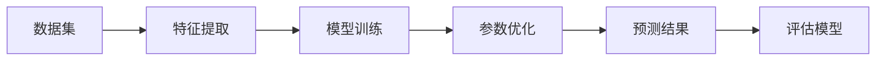
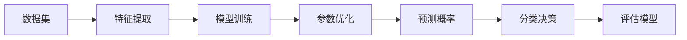
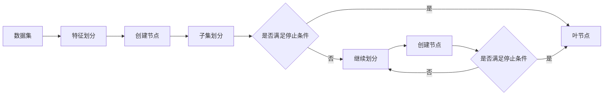
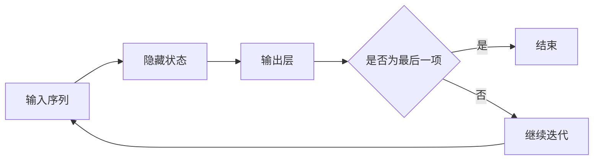

                 

### 第一部分：引言

#### 第1章：数字化时代背景与AI技术概述

**1.1 数字化时代的背景**

**数字化转型的推动因素**

在21世纪，数字化转型已成为全球企业发展的核心战略。推动这一变革的主要因素包括技术的飞速发展、市场竞争的加剧和消费者需求的不断升级。首先，信息技术的进步，尤其是互联网、移动通信和云计算技术的普及，为企业提供了丰富的数字化工具和平台。其次，全球化背景下的市场竞争日益激烈，企业不得不通过数字化手段提高效率、降低成本、增强竞争力。最后，消费者行为的变化，特别是年轻一代对数字化产品和服务的青睐，迫使企业加速数字化转型进程。

**数字化时代的特征**

数字化时代的主要特征表现为以下几个方面：数据驱动的决策制定、敏捷灵活的业务模式、客户体验的极致优化以及全球化的运营模式。首先，数据成为企业最重要的资产，通过大数据分析和人工智能技术，企业能够更准确地把握市场动态、消费者需求，从而做出更为明智的决策。其次，数字化时代企业更加注重敏捷性和灵活性，通过快速响应市场变化，不断调整业务策略。此外，客户体验成为企业关注的焦点，通过数字化手段，企业能够提供个性化、便捷的服务，提升客户满意度。最后，全球化使得企业可以跨越地域限制，通过数字化平台实现全球范围内的运营和管理。

**1.2 AI技术的概述**

**AI的定义**

人工智能（Artificial Intelligence，简称AI）是计算机科学的一个分支，旨在使计算机系统具备类似于人类智能的能力。这些能力包括学习、推理、解决问题、感知和理解自然语言等。AI的目标是通过模拟人类智能的思维方式，使计算机能够自主地完成复杂的任务。

**AI的发展历程**

AI的发展历程可以分为几个重要阶段。首先是早期的探索阶段（1956年-1969年），这一阶段主要是基础理论和算法的研究。然后是低谷期（1970年-1980年），由于算法的局限性以及计算资源的匮乏，AI研究进入低潮。接下来是复兴阶段（1980年-2000年），这一阶段得益于计算技术的进步和大数据的兴起，AI研究取得了显著的进展。最后是当前的人工智能时代（2000年至今），AI技术在各个领域得到了广泛的应用，特别是在深度学习和神经网络方面的突破，使得AI系统在图像识别、自然语言处理、决策支持等领域取得了令人瞩目的成果。

**AI的核心技术**

AI的核心技术主要包括机器学习、深度学习和自然语言处理等。机器学习是AI的基础，通过训练模型，使计算机具备从数据中学习的能力。深度学习是机器学习的一个分支，通过多层神经网络的结构，实现对复杂数据的自动特征提取和建模。自然语言处理则是使计算机能够理解和生成自然语言的技术，包括语音识别、机器翻译、情感分析等。

**1.3 本书结构概述**

**核心内容安排**

本书旨在为读者提供一份全面的AI技术与未来就业指南，共分为四个部分。第一部分是引言，介绍数字化时代背景和AI技术概述。第二部分是AI技术基础，详细讲解AI的核心技术，包括机器学习、深度学习和自然语言处理等。第三部分是AI在行业中的应用，分析AI在金融、医疗健康、零售和制造业等领域的应用情况。第四部分是AI与未来就业，探讨AI时代下的职业变化和就业机会。

**阅读指引**

本书适合对AI技术和未来就业感兴趣的所有读者，无论你是技术从业者、学生还是对AI技术有好奇心的普通读者，都可以通过本书了解到AI技术的核心知识和未来发展前景。本书采用了逻辑清晰、结构紧凑的叙述方式，通过具体的案例和实例，帮助读者更好地理解AI技术的应用和影响。

**1.4 小结**

**关键知识点回顾**

- 数字化转型是当前企业发展的核心战略，其主要推动因素包括技术进步、市场竞争和消费者需求。
- 数字化时代的主要特征包括数据驱动、敏捷灵活、客户体验优化和全球化运营。
- 人工智能是计算机科学的一个分支，旨在使计算机系统具备类似人类智能的能力，其核心技术包括机器学习、深度学习和自然语言处理等。
- 本书共分为四个部分，系统地介绍了AI技术的基础知识、行业应用以及未来就业趋势。

**读者建议**

- 阅读本书时，建议读者结合实际案例和实例，深入理解AI技术的原理和应用。
- 在学习过程中，可以通过网络资源和相关书籍进行拓展阅读，加深对AI技术的理解。
- 对于有兴趣从事AI领域工作的读者，可以通过参与相关的在线课程和项目实践，提升自己的技能和知识水平。

----------------------------------------------------------------

## 第2章：AI技术基础

**2.1 AI核心技术详解**

AI的核心技术包括机器学习、深度学习和自然语言处理等。这些技术在不同领域都有着广泛的应用，并推动了人工智能的发展。在本节中，我们将详细介绍这些核心技术的基本概念、发展历程和应用。

### 2.1.1 机器学习基础

**机器学习的定义**

机器学习（Machine Learning，ML）是人工智能的一个分支，主要研究如何让计算机系统从数据中学习，并利用这些学习到的知识来做出决策或预测。与传统的编程方法不同，机器学习通过算法和模型自动从数据中提取特征和模式，无需显式编写具体的规则或指令。

**机器学习的发展历史**

机器学习的发展可以追溯到20世纪50年代，当时人工智能的兴起推动了机器学习的研究。最早的机器学习算法是基于统计方法和决策树等简单模型。20世纪80年代，随着计算技术的进步和大数据的兴起，机器学习得到了快速发展。近年来，深度学习的兴起进一步推动了机器学习的研究和应用。

**机器学习的基本概念**

- **特征工程**：特征工程是机器学习过程中非常重要的一个环节，旨在从原始数据中提取出对模型训练有重要影响的特征。
- **模型选择与评估**：模型选择和评估是机器学习的核心，包括选择合适的算法、调整参数以及评估模型的性能等。
- **监督学习、无监督学习和强化学习**：监督学习是有标签数据的学习方法，无监督学习是没有标签数据的学习方法，强化学习是通过与环境交互来学习最优策略。

**机器学习算法**

- **线性回归**：线性回归是一种简单的统计学习方法，用于预测一个连续值。
- **逻辑回归**：逻辑回归是一种概率型线性回归模型，常用于分类问题。
- **决策树与随机森林**：决策树是一种基于树形模型的分类算法，随机森林是通过集成多个决策树来提高分类性能。
- **支持向量机**：支持向量机是一种用于分类和回归的监督学习方法，通过找到最优的超平面来划分数据。

### 2.1.2 深度学习基础

**深度学习的定义**

深度学习（Deep Learning，DL）是一种基于多层神经网络的学习方法，能够自动从数据中提取复杂特征。与传统的机器学习方法相比，深度学习具有更强的表达能力和更广泛的适用范围。

**深度学习的发展历史**

深度学习的发展可以追溯到20世纪40年代，当时神经网络的概念被提出。然而，由于计算能力的限制，深度学习在早期并未得到广泛应用。直到21世纪初，随着计算技术的进步和大数据的兴起，深度学习逐渐崭露头角。近年来，深度学习在图像识别、自然语言处理和语音识别等领域取得了重大突破。

**深度学习的基本概念**

- **神经网络**：神经网络是一种由多个神经元组成的计算模型，通过层层叠加，可以实现对复杂数据的自动特征提取。
- **卷积神经网络**：卷积神经网络是一种用于图像识别和处理的深度学习模型，通过卷积操作和池化操作，实现对图像的分层特征提取。
- **循环神经网络**：循环神经网络是一种用于序列数据处理的深度学习模型，通过循环结构，可以捕捉序列数据中的时间依赖关系。

**深度学习算法**

- **卷积神经网络（CNN）**：卷积神经网络是深度学习中应用最广泛的模型之一，常用于图像识别、目标检测和图像分割等任务。
- **循环神经网络（RNN）**：循环神经网络是一种用于处理序列数据的模型，常用于语音识别、机器翻译和文本生成等任务。
- **生成对抗网络（GAN）**：生成对抗网络是一种通过对抗性训练生成数据的模型，常用于图像生成、图像修复和风格迁移等任务。

### 2.1.3 自然语言处理基础

**自然语言处理的定义**

自然语言处理（Natural Language Processing，NLP）是人工智能的一个分支，旨在使计算机能够理解和生成自然语言。NLP的研究内容包括文本处理、语音识别、机器翻译、情感分析等。

**自然语言处理的发展历史**

自然语言处理的发展可以追溯到20世纪50年代，当时计算机科学家开始研究如何使计算机理解自然语言。最初的NLP方法主要基于规则和统计方法，但随着计算技术和机器学习的发展，NLP逐渐转向基于数据的方法。

**自然语言处理的基本概念**

- **词向量**：词向量是自然语言处理中的一个基本概念，用于表示单词的数值化表示。
- **语言模型**：语言模型是自然语言处理中的一个核心模型，用于预测下一个单词或词组。
- **序列标注**：序列标注是自然语言处理中的一个任务，用于对序列数据进行标注，如命名实体识别、情感分类等。
- **机器翻译**：机器翻译是自然语言处理中的一个重要应用，通过将一种语言翻译成另一种语言，实现跨语言的沟通。

**自然语言处理算法**

- **词嵌入**：词嵌入是将单词映射到高维空间中的向量，用于表示单词的语义信息。
- **长短时记忆网络（LSTM）**：长短时记忆网络是一种用于处理序列数据的神经网络模型，可以有效地捕捉序列中的长期依赖关系。
- **Transformer模型**：Transformer模型是一种基于自注意力机制的深度学习模型，在机器翻译、文本生成等任务中取得了显著的成果。

### 2.1.4 小结

**关键知识点回顾**

- 机器学习是人工智能的一个分支，通过从数据中学习，使计算机能够做出决策或预测。
- 深度学习是一种基于多层神经网络的学习方法，具有更强的表达能力和更广泛的适用范围。
- 自然语言处理是使计算机能够理解和生成自然语言的技术，包括文本处理、语音识别、机器翻译等任务。

**学习资源推荐**

- **书籍推荐**：《深度学习》（Goodfellow、Bengio和Courville著）、《自然语言处理综论》（Jurafsky和Martin著）、《机器学习》（Tom Mitchell著）。
- **在线课程**：吴恩达的《深度学习专项课程》、斯坦福大学的《自然语言处理专项课程》、CMU的《机器学习专项课程》。
- **实践项目**：通过参与开源项目或自己设计项目，实践机器学习、深度学习和自然语言处理的相关算法。

----------------------------------------------------------------

### 2.2 AI在行业中的应用

#### 3.1 AI在金融行业的应用

**3.1.1 金融行业数字化转型**

金融行业的数字化转型始于20世纪90年代，随着互联网和移动通信技术的普及，金融机构逐渐采用电子交易、在线支付和移动银行等数字化服务。近年来，随着大数据、云计算和人工智能等新兴技术的不断发展，金融行业的数字化转型进入了一个新的阶段。

**数字化转型的重要性**

数字化转型对于金融行业具有重要意义。首先，数字化技术可以提高金融服务的效率和质量，降低运营成本。例如，通过自动化交易系统，可以大大提高交易速度和准确性。其次，数字化技术可以帮助金融机构更好地了解客户需求，提供个性化的金融服务。最后，数字化转型有助于金融机构提高风险管理和合规能力，降低金融风险。

**金融行业中的AI应用**

1. **智能投顾**

智能投顾（Robo-Advisory）是AI在金融行业中的一个重要应用。智能投顾利用机器学习算法和大数据分析，为投资者提供个性化的投资建议。通过分析投资者的风险偏好、财务状况和市场数据，智能投顾可以自动调整投资组合，实现资产配置优化。

2. **信用评分**

信用评分是金融行业中的一个关键环节，通过评估借款人的信用状况，金融机构可以降低违约风险。AI技术，特别是机器学习算法，在信用评分中发挥了重要作用。通过分析借款人的历史数据、财务状况和社会行为等信息，机器学习模型可以更准确地预测借款人的信用风险。

3. **反欺诈**

反欺诈是金融行业中的一个重要挑战，AI技术可以帮助金融机构检测和预防欺诈行为。通过分析交易数据和行为模式，机器学习算法可以识别潜在的欺诈交易，并实时采取相应的措施。此外，AI技术还可以帮助金融机构识别新型欺诈手段，提高反欺诈系统的有效性。

#### 3.2 AI在医疗健康行业的应用

**3.2.1 医疗健康行业数字化转型**

医疗健康行业的数字化转型始于20世纪90年代，随着电子病历（EMR）和医疗信息系统的普及，医疗健康数据的数字化程度逐渐提高。近年来，随着人工智能、大数据和物联网等新兴技术的不断发展，医疗健康行业的数字化转型进入了一个新的阶段。

**数字化转型的重要性**

数字化转型对于医疗健康行业具有重要意义。首先，数字化技术可以提高医疗服务的效率和质量，降低医疗成本。例如，通过电子病历系统，医生可以快速访问患者的医疗记录，提高诊断和治疗效率。其次，数字化技术可以帮助医疗机构更好地管理医疗资源，提高医疗服务水平。最后，数字化转型有助于医疗健康行业实现精准医疗和个性化医疗，提高患者的满意度和生活质量。

**医疗健康行业中的AI应用**

1. **医学影像分析**

医学影像分析是AI在医疗健康行业中的一个重要应用。通过深度学习算法，AI可以帮助医生快速准确地分析医学影像，提高诊断准确率和效率。例如，AI可以在数秒内分析一张CT扫描图像，识别出潜在的病变区域，为医生提供诊断依据。

2. **智能诊断系统**

智能诊断系统是AI在医疗健康行业中的另一个重要应用。通过机器学习算法和大数据分析，智能诊断系统可以自动分析患者的病情数据，提供诊断建议。例如，智能诊断系统可以通过分析患者的症状、病史和实验室检查结果，自动判断患者是否患有某种疾病，并提供相应的治疗方案。

3. **个性化医疗**

个性化医疗是医疗健康行业中的一个新兴领域，通过AI技术，可以为患者提供个性化的治疗方案。个性化医疗需要收集大量的患者数据，包括基因信息、病史、生活习惯等。通过机器学习算法，AI可以帮助医生分析这些数据，为患者制定最佳的治疗方案。

#### 3.3 AI在零售行业的应用

**3.3.1 零售行业数字化转型**

零售行业的数字化转型始于20世纪90年代，随着电子商务的兴起，零售企业逐渐采用在线销售和电子支付等数字化服务。近年来，随着人工智能、大数据和物联网等新兴技术的不断发展，零售行业的数字化转型进入了一个新的阶段。

**数字化转型的重要性**

数字化转型对于零售行业具有重要意义。首先，数字化技术可以提高零售企业的运营效率，降低运营成本。例如，通过自动化仓储和物流系统，可以大大提高商品配送速度和准确性。其次，数字化技术可以帮助零售企业更好地了解消费者需求，提供个性化的购物体验。最后，数字化转型有助于零售企业提高客户满意度和忠诚度，提高市场竞争能力。

**零售行业中的AI应用**

1. **智能推荐系统**

智能推荐系统是AI在零售行业中的一个重要应用。通过机器学习算法和大数据分析，智能推荐系统可以分析消费者的购物历史、浏览行为和偏好，为消费者提供个性化的商品推荐。例如，电商平台可以通过智能推荐系统，向消费者推荐他们可能感兴趣的商品，提高购物转化率和客户满意度。

2. **库存管理**

库存管理是零售行业中的一个关键环节，通过AI技术，可以大大提高库存管理的效率和准确性。通过机器学习算法和大数据分析，AI可以帮助零售企业预测未来的销售趋势，优化库存水平，降低库存成本。例如，零售企业可以通过AI系统实时监控库存情况，自动调整进货和补货策略，确保库存水平的合理性和商品的新鲜度。

3. **智能客服**

智能客服是AI在零售行业中的另一个重要应用。通过自然语言处理和机器学习技术，智能客服系统可以自动解答消费者的疑问，提供购物建议和售后服务。智能客服系统可以24小时在线服务，提高客户满意度和服务效率。

#### 3.4 AI在制造业的应用

**3.4.1 制造业数字化转型**

制造业的数字化转型始于20世纪90年代，随着工业自动化和物联网技术的普及，制造业逐渐采用自动化生产线和智能设备。近年来，随着人工智能、大数据和物联网等新兴技术的不断发展，制造业的数字化转型进入了一个新的阶段。

**数字化转型的重要性**

数字化转型对于制造业具有重要意义。首先，数字化技术可以提高制造业的效率和质量，降低生产成本。例如，通过智能工厂和自动化设备，可以大大提高生产速度和精度。其次，数字化技术可以帮助制造业实现定制化生产，满足消费者个性化的需求。最后，数字化转型有助于制造业提高产品质量和安全性，降低生产风险。

**制造业中的AI应用**

1. **智能工厂**

智能工厂是AI在制造业中的一个重要应用。通过人工智能和物联网技术，智能工厂可以实现全流程自动化生产。从原材料采购、生产加工到成品包装和物流配送，智能工厂都可以通过自动化设备进行高效运作。智能工厂可以提高生产效率、降低成本，并提高产品质量。

2. **生产优化**

生产优化是AI在制造业中的另一个重要应用。通过机器学习算法和大数据分析，AI可以帮助制造业优化生产流程，提高生产效率。例如，AI系统可以通过分析生产数据，识别生产瓶颈和资源浪费，并提出相应的优化方案，提高生产线的运行效率。

3. **预测性维护**

预测性维护是AI在制造业中的又一个重要应用。通过传感器技术和机器学习算法，AI可以帮助制造业预测设备的故障，提前进行维护，避免生产中断。例如，AI系统可以实时监测设备的运行状态，分析故障数据，预测设备的故障概率，提前进行维护，降低设备故障率和生产风险。

### 3.5 小结

**行业应用总结**

AI技术在各个行业的应用已经取得了显著的成果。在金融行业，AI技术可以帮助金融机构提高风险管理能力、优化投资组合和预防欺诈行为。在医疗健康行业，AI技术可以帮助医生提高诊断准确率、实现精准医疗和个性化治疗。在零售行业，AI技术可以帮助零售企业提高运营效率、优化库存管理和提升客户满意度。在制造业，AI技术可以帮助制造业实现自动化生产、优化生产流程和降低生产成本。

**挑战与机遇**

AI技术在行业中的应用也面临着一系列挑战。首先，数据质量和数据隐私问题是一个重要挑战，特别是在金融和医疗健康等行业。其次，AI技术的复杂性使得其应用门槛较高，需要大量的专业人才和计算资源。此外，AI技术的算法透明度和可解释性也是一个重要问题，特别是在涉及到安全和隐私的领域。

然而，随着AI技术的不断发展和应用，也带来了许多机遇。首先，AI技术可以帮助企业提高效率、降低成本和提升竞争力。其次，AI技术可以创造新的就业机会，促进经济结构的升级。最后，AI技术在解决社会问题、提高生活质量和推动科技发展方面具有巨大的潜力。

----------------------------------------------------------------

## 第4章：AI与未来就业

### 4.1 AI时代下的职业变化

**4.1.1 职业变化的原因**

AI时代下职业变化的根本原因在于技术的进步和经济的转型。首先，AI技术的飞速发展使得许多传统职业面临着被自动化和智能化的替代风险。例如，制造业中的流水线工人、金融行业中的数据录入员等职业，正在逐渐被自动化设备和智能系统所取代。其次，随着数字化和互联网的普及，许多新兴职业应运而生，如数据科学家、人工智能工程师、区块链开发人员等。这些职业不仅需要深厚的专业技能，还需要对AI技术的深刻理解和应用能力。

**4.1.2 职业类型的变化**

在AI时代，职业类型发生了显著的变化，主要表现在以下几个方面：

1. **新兴职业**：AI时代催生了大量新兴职业，如数据科学家、机器学习工程师、人工智能伦理专家等。这些职业需要掌握先进的技术，能够对大量数据进行处理和分析，从而为企业和组织提供有价值的见解和决策支持。

2. **消失的职业**：随着AI技术的发展，一些传统职业正在逐渐消失。例如，银行柜员、制造业工人、零售店员等职业，随着自动化和智能化的普及，将逐步被替代。然而，这些职业的消失并不意味着工作岗位的减少，而是职业类型的转变。

3. **职业角色的转变**：在AI时代，许多职业的角色也在发生转变。例如，教师、医生、律师等职业，随着AI技术的应用，将更多地承担监督、指导和协调的角色，而不仅仅是执行具体的工作任务。

### 4.2 AI时代的就业机会

**4.2.1 AI行业的发展趋势**

AI行业的发展趋势表现在以下几个方面：

1. **技术创新**：AI技术将继续快速发展，特别是在深度学习、自然语言处理、计算机视觉等领域。新技术的出现将推动AI应用的创新和拓展。

2. **产业融合**：AI技术将在更多行业得到应用，如医疗健康、金融服务、制造业、零售业等。这些行业的数字化转型将推动AI技术的发展和应用。

3. **全球竞争**：随着AI技术的全球竞争日益激烈，各国纷纷加大对AI领域的投资和研发力度。未来，AI行业将成为全球科技创新的重要领域。

**4.2.2 AI时代的就业机会**

AI时代为人们带来了丰富的就业机会，主要体现在以下几个方面：

1. **技术岗位**：数据科学家、机器学习工程师、深度学习研究员等岗位将是AI行业中的主力军。这些岗位需要具备深厚的数学、计算机科学和AI专业知识。

2. **应用岗位**：在金融、医疗健康、制造业、零售等行业，AI技术的应用将创造大量的就业机会，如AI分析师、AI产品经理、AI销售和客服等。

3. **交叉岗位**：AI技术与传统行业的融合将产生大量的交叉岗位，如AI医疗顾问、AI金融分析师、AI制造业顾问等。这些岗位需要结合AI技术和行业专业知识，为企业提供综合解决方案。

**4.2.3 职业发展的新趋势**

在AI时代，职业发展也将呈现出一些新的趋势：

1. **持续学习**：随着AI技术的快速变化，持续学习成为职业发展的关键。从业人员需要不断更新知识，掌握最新的AI技术和应用。

2. **跨界合作**：AI技术的发展需要多学科的融合，从业人员需要具备跨学科的知识和技能，以推动AI技术的创新和应用。

3. **国际化发展**：随着全球化的推进，AI行业的就业机会将更加国际化。从业人员需要具备国际视野和跨文化交流能力，以适应全球化的工作环境。

**4.2.4 案例分析**

以下是一个关于AI时代就业机会的案例分析：

**案例：人工智能项目经理**

职位描述：负责项目管理，协调团队工作，确保项目按时按质完成。需要具备项目管理知识、AI技术基础以及团队领导能力。

技能要求：

- 熟悉项目管理工具和方法，如敏捷开发和Scrum；
- 掌握常见的机器学习算法和深度学习框架；
- 具备团队管理和沟通能力；
- 了解AI伦理和法规。

就业前景：随着AI项目的不断增多，人工智能项目经理的就业前景广阔。未来，该职位将成为企业数字化转型的重要角色。

**4.2.5 AI与未来就业的挑战**

尽管AI时代带来了丰富的就业机会，但也面临一些挑战：

1. **技能差距**：由于AI技术的快速变化，许多从业人员难以跟上技术的发展，导致技能差距问题。企业和教育机构需要采取措施，加强员工培训和教育。

2. **数据安全和隐私**：AI技术依赖于大量数据，数据安全和隐私问题成为重要挑战。企业和政府需要加强数据安全管理，保护用户隐私。

3. **伦理和道德问题**：AI技术的应用涉及到伦理和道德问题，如算法偏见、隐私侵犯等。社会需要制定相应的规范和法律法规，确保AI技术的健康发展。

**4.2.6 未来展望**

展望未来，AI技术将在更多领域得到应用，创造更多的就业机会。同时，职业发展也将更加多样化和专业化。从业人员需要具备跨学科的知识和技能，以适应不断变化的市场需求。此外，随着全球化的推进，AI技术将成为国际竞争的新焦点，从业人员需要具备国际视野和跨文化交流能力。

总之，AI时代为就业带来了新的机遇和挑战。通过不断学习和适应，从业人员可以在AI行业中找到自己的定位，实现职业发展。

----------------------------------------------------------------

## 总结与展望

在数字化时代，人工智能（AI）技术的迅猛发展正在深刻地改变着各行各业，同时也对就业市场产生了深远的影响。本文从数字化时代的背景、AI技术概述、AI技术基础、AI在行业中的应用以及AI与未来就业等方面进行了全面的分析和探讨，旨在为读者提供一份系统的AI技术与未来就业指南。

### 主要内容回顾

首先，我们介绍了数字化时代的背景，包括数字化转型的推动因素和特征，以及AI技术的定义、发展历程和核心技术。接着，我们详细阐述了机器学习、深度学习和自然语言处理等AI技术的概念、基本概念和应用。随后，我们分析了AI在金融、医疗健康、零售和制造业等行业的应用情况，展示了AI技术如何提高行业效率、降低成本和创造新的就业机会。最后，我们探讨了AI时代下职业变化的原因、新兴职业类型以及未来就业机会，并对AI与未来就业的挑战进行了分析。

### 关键思考

在AI技术迅猛发展的背景下，我们应如何应对职业变化和就业市场的挑战？以下几点思考可能对读者有所启发：

1. **持续学习与技能更新**：AI技术更新迅速，从业人员需要不断学习新知识、掌握新技能，以适应不断变化的市场需求。

2. **跨界合作与创新能力**：AI技术的应用需要多学科的融合，从业人员应培养跨学科的知识和技能，推动AI技术的创新和应用。

3. **数据安全与隐私保护**：AI技术的发展离不开大量数据，数据安全和隐私保护成为重要挑战。企业和政府需要加强数据安全管理，保护用户隐私。

4. **伦理与道德考量**：AI技术的应用涉及到伦理和道德问题，从业人员应关注相关法律法规，确保AI技术的健康发展。

### 展望未来

未来，AI技术将在更多领域得到应用，创造更多的就业机会。同时，职业发展也将更加多样化和专业化。从业人员需要具备跨学科的知识和技能，以适应不断变化的市场需求。此外，随着全球化的推进，AI技术将成为国际竞争的新焦点，从业人员需要具备国际视野和跨文化交流能力。

总之，AI时代为就业带来了新的机遇和挑战。通过不断学习和适应，从业人员可以在AI行业中找到自己的定位，实现职业发展。

### 最佳实践 Tips

1. **关注行业动态**：定期关注AI行业的最新动态，了解新兴技术和发展趋势，有助于把握职业发展的方向。

2. **参与开源项目**：通过参与开源项目，可以积累实践经验，提高技术能力，同时拓展人脉资源。

3. **学习相关课程**：参加在线课程或专业培训，系统地学习AI技术相关知识和技能。

4. **保持好奇心与求知欲**：对AI技术和应用保持好奇心和求知欲，勇于尝试新事物，不断挑战自我。

### 小结

本文通过系统地介绍AI技术和未来就业趋势，旨在为读者提供一份实用的指南。在数字化时代，AI技术已成为推动社会进步和经济发展的重要力量。面对职业变化和就业市场的挑战，我们应保持积极的心态，不断学习、创新和适应，以在AI行业中取得成功。

### 拓展阅读

- **《深度学习》（Goodfellow、Bengio和Courville著）**：这是一本经典的深度学习教材，详细介绍了深度学习的理论、算法和应用。
- **《自然语言处理综论》（Jurafsky和Martin著）**：这本书全面介绍了自然语言处理的基本概念、技术和应用，是自然语言处理领域的经典教材。
- **《机器学习》（Tom Mitchell著）**：这是机器学习领域的经典教材，涵盖了机器学习的基本概念、算法和应用。

通过阅读这些书籍，读者可以更深入地了解AI技术的核心知识和应用场景，为自己的职业发展打下坚实的基础。

### 注意事项

1. **数据隐私和安全**：在AI应用中，数据隐私和安全是至关重要的。从业人员应严格遵守相关法律法规，确保用户数据的保护。
2. **算法公平性和透明度**：AI算法的公平性和透明度是行业关注的重点。从业人员应关注算法的偏见问题，努力提高算法的公正性和可解释性。
3. **持续学习与职业规划**：在AI领域，持续学习和职业规划至关重要。从业人员应根据自己的兴趣和发展方向，制定合理的职业规划，不断提升自己的竞争力。

### 作者信息

**作者：AI天才研究院/AI Genius Institute & 禅与计算机程序设计艺术 /Zen And The Art of Computer Programming**

AI天才研究院致力于推动人工智能技术的发展和应用，为读者提供专业的AI技术知识和实战经验。禅与计算机程序设计艺术则通过深入探讨计算机编程的哲学和艺术，帮助读者提高编程能力和创造力。希望本文能为您的职业发展提供有益的启示和帮助。

----------------------------------------------------------------

### 附录：AI技术核心算法与模型解析

在本章节中，我们将对AI技术中的一些核心算法与模型进行详细解析，以便读者更好地理解AI技术的原理和应用。

#### 1. 机器学习算法

**线性回归（Linear Regression）**

**定义与公式：**

线性回归是一种用于预测数值型数据的监督学习算法。其基本公式为：

\[ Y = \beta_0 + \beta_1X + \epsilon \]

其中，\( Y \) 是预测值，\( X \) 是输入特征，\( \beta_0 \) 和 \( \beta_1 \) 是模型的参数，\( \epsilon \) 是误差项。

**流程图（Mermaid）：**



**Python实现示例：**

```python
import numpy as np
from sklearn.linear_model import LinearRegression

# 数据准备
X = np.array([[1], [2], [3], [4], [5]])
y = np.array([1, 2, 2.5, 4, 5])

# 模型训练
model = LinearRegression()
model.fit(X, y)

# 参数获取
print("斜率：", model.coef_)
print("截距：", model.intercept_)

# 预测
y_pred = model.predict([[6]])
print("预测值：", y_pred)
```

**逻辑回归（Logistic Regression）**

**定义与公式：**

逻辑回归是一种用于分类问题的监督学习算法。其基本公式为：

\[ P(Y=1) = \frac{1}{1 + e^{-(\beta_0 + \beta_1X)}} \]

其中，\( P(Y=1) \) 是预测概率，\( X \) 是输入特征，\( \beta_0 \) 和 \( \beta_1 \) 是模型的参数。

**流程图（Mermaid）：**



**Python实现示例：**

```python
import numpy as np
from sklearn.linear_model import LogisticRegression

# 数据准备
X = np.array([[1], [2], [3], [4], [5]])
y = np.array([0, 1, 1, 0, 1])

# 模型训练
model = LogisticRegression()
model.fit(X, y)

# 预测
y_pred = model.predict([[6]])
print("预测结果：", y_pred)

# 预测概率
y_prob = model.predict_proba([[6]])
print("预测概率：", y_prob)
```

**决策树（Decision Tree）**

**定义与公式：**

决策树是一种基于树形模型的分类算法。其基本原理是通过一系列规则将数据集划分为多个子集，最终得到分类结果。

**流程图（Mermaid）：**



**Python实现示例：**

```python
import numpy as np
from sklearn.tree import DecisionTreeClassifier

# 数据准备
X = np.array([[1, 2], [2, 3], [3, 4], [4, 5], [5, 6]])
y = np.array([0, 1, 1, 0, 1])

# 模型训练
model = DecisionTreeClassifier()
model.fit(X, y)

# 预测
y_pred = model.predict([[6, 7]])
print("预测结果：", y_pred)
```

#### 2. 深度学习算法

**卷积神经网络（Convolutional Neural Network，CNN）**

**定义与公式：**

卷积神经网络是一种用于图像识别和处理的深度学习模型。其基本原理是通过卷积操作和池化操作，对图像进行特征提取和分类。

**流程图（Mermaid）：**


**Python实现示例：**

```python
import tensorflow as tf
from tensorflow.keras import layers

# 构建模型
input_img = tf.keras.Input(shape=(28, 28, 1))
x = layers.Conv2D(32, (3, 3), activation='relu')(input_img)
x = layers.MaxPooling2D((2, 2))(x)
x = layers.Conv2D(64, (3, 3), activation='relu')(x)
x = layers.MaxPooling2D((2, 2))(x)
x = layers.Flatten()(x)
x = layers.Dense(64, activation='relu')(x)
output = layers.Dense(10, activation='softmax')(x)

model = tf.keras.Model(inputs=input_img, outputs=output)

# 编译模型
model.compile(optimizer='adam', loss='categorical_crossentropy', metrics=['accuracy'])

# 训练模型
model.fit(x_train, y_train, epochs=10, batch_size=32, validation_split=0.2)
```

**循环神经网络（Recurrent Neural Network，RNN）**

**定义与公式：**

循环神经网络是一种用于处理序列数据的深度学习模型。其基本原理是通过循环结构，对序列数据进行特征提取和建模。

**流程图（Mermaid）：**



**Python实现示例：**

```python
import tensorflow as tf
from tensorflow.keras.layers import Embedding, LSTM, Dense

# 构建模型
input_seq = tf.keras.Input(shape=(timesteps, features))
x = Embedding(vocab_size, embedding_dim)(input_seq)
x = LSTM(units=50, return_sequences=True)(x)
x = LSTM(units=50)(x)
x = Dense(units=1, activation='sigmoid')(x)

model = tf.keras.Model(inputs=input_seq, outputs=x)

# 编译模型
model.compile(optimizer='adam', loss='binary_crossentropy', metrics=['accuracy'])

# 训练模型
model.fit(x_train, y_train, epochs=10, batch_size=32)
```

#### 3. 自然语言处理算法

**词嵌入（Word Embedding）**

**定义与公式：**

词嵌入是将单词映射到高维空间中的向量，用于表示单词的语义信息。常用的词嵌入方法包括Word2Vec、GloVe等。

**流程图（Mermaid）：**


**Python实现示例：**

```python
import gensim.downloader as api

# 下载预训练的Word2Vec模型
word2vec = api.load("glove-wiki-gigaword-100")

# 获取单词的词向量
word_vector = word2vec["king"]
print("king的词向量：", word_vector)

# 计算两个单词的相似度
similarity = word2vec.wv.similarity("king", "queen")
print("king和queen的相似度：", similarity)
```

**长短时记忆网络（Long Short-Term Memory，LSTM）**

**定义与公式：**

长短时记忆网络是一种用于处理序列数据的深度学习模型，可以有效地捕捉序列中的长期依赖关系。

**流程图（Mermaid）：**


**Python实现示例：**

```python
import tensorflow as tf
from tensorflow.keras.layers import Embedding, LSTM, Dense

# 构建模型
input_seq = tf.keras.Input(shape=(timesteps, features))
x = Embedding(vocab_size, embedding_dim)(input_seq)
x = LSTM(units=50, return_sequences=True)(x)
x = LSTM(units=50)(x)
x = Dense(units=1, activation='sigmoid')(x)

model = tf.keras.Model(inputs=input_seq, outputs=x)

# 编译模型
model.compile(optimizer='adam', loss='binary_crossentropy', metrics=['accuracy'])

# 训练模型
model.fit(x_train, y_train, epochs=10, batch_size=32)
```

**Transformer模型**

**定义与公式：**

Transformer模型是一种基于自注意力机制的深度学习模型，在机器翻译、文本生成等任务中取得了显著的成果。

**流程图（Mermaid）：**


**Python实现示例：**

```python
import tensorflow as tf
from tensorflow.keras.layers import Embedding, MultiHeadAttention, Dense

# 构建模型
input_seq = tf.keras.Input(shape=(timesteps, features))
x = Embedding(vocab_size, embedding_dim)(input_seq)
x = MultiHeadAttention(num_heads=8, key_dim=64)(x, x)
x = Dense(units=1, activation='sigmoid')(x)

model = tf.keras.Model(inputs=input_seq, outputs=x)

# 编译模型
model.compile(optimizer='adam', loss='binary_crossentropy', metrics=['accuracy'])

# 训练模型
model.fit(x_train, y_train, epochs=10, batch_size=32)
```

通过以上对AI技术核心算法与模型的详细解析，读者可以更好地理解AI技术的原理和应用，为自己的学习和实践提供指导。

### 实际案例分析与详细讲解

在本章节中，我们将通过一个实际的案例来展示AI技术在某一行业中的应用，并对其进行详细讲解和分析。

#### 案例背景

假设我们选择零售行业中的智能推荐系统作为案例，探讨如何利用机器学习算法和大数据分析技术，提升电商平台用户的购物体验和销售额。

#### 案例介绍

某大型电商平台希望通过智能推荐系统，为用户推荐他们可能感兴趣的商品。该推荐系统需要分析用户的购物行为、浏览历史、购物车数据等信息，预测用户未来的购物需求，并为其推荐相应的商品。

#### 系统功能设计

1. **用户画像生成**：通过分析用户的购物行为和浏览历史，生成用户的个性化画像。
2. **商品画像生成**：为每种商品生成相应的特征向量，如类别、价格、销量等。
3. **推荐算法**：利用机器学习算法，分析用户画像和商品画像，为用户推荐可能感兴趣的商品。
4. **推荐结果展示**：将推荐结果展示在用户界面，提高用户的购物体验。

#### 系统架构设计

1. **数据采集**：通过电商平台的后台系统，实时采集用户的购物行为和浏览数据。
2. **数据处理**：对采集到的数据进行清洗、去重和处理，生成用户画像和商品画像。
3. **推荐引擎**：利用机器学习算法，对用户画像和商品画像进行分析，生成推荐结果。
4. **用户界面**：将推荐结果展示在用户界面，实现推荐功能。

#### 系统接口设计

1. **用户画像接口**：提供用户画像的生成和查询接口。
2. **商品画像接口**：提供商品画像的生成和查询接口。
3. **推荐接口**：提供推荐结果的生成和查询接口。
4. **日志接口**：提供系统日志的记录和查询接口。

#### 系统交互设计

1. **用户交互**：用户通过电商平台进行购物，系统实时采集用户的购物行为和浏览数据。
2. **数据处理**：系统对采集到的数据进行处理，生成用户画像和商品画像。
3. **推荐算法**：系统利用机器学习算法，分析用户画像和商品画像，生成推荐结果。
4. **推荐结果展示**：系统将推荐结果展示在用户界面，用户可以根据推荐结果进行购物。

#### 系统实现与代码解析

以下是一个简单的推荐系统实现，包括用户画像生成、商品画像生成和推荐算法的实现。

```python
import pandas as pd
from sklearn.feature_extraction.text import TfidfVectorizer
from sklearn.metrics.pairwise import linear_kernel

# 用户画像生成
def generate_user_profile(ratings, user_id):
    user_ratings = ratings[ratings['user_id'] == user_id]
    user_item_vector = TfidfVectorizer()
    user_item_matrix = user_item_vector.fit_transform(user_ratings['item_name'])
    return user_item_matrix

# 商品画像生成
def generate_item_profile(ratings, item_id):
    item_ratings = ratings[ratings['item_id'] == item_id]
    item_item_vector = TfidfVectorizer()
    item_item_matrix = item_item_vector.fit_transform(item_ratings['item_name'])
    return item_item_matrix

# 推荐算法
def recommend_items(ratings, user_id, num_recommendations):
    user_item_matrix = generate_user_profile(ratings, user_id)
    item_item_matrix = generate_item_profile(ratings, item_id)

    cosine_sim = linear_kernel(user_item_matrix, item_item_matrix)
    related_items = cosine_sim.argsort()[0][-num_recommendations:]

    recommended_items = ratings[ratings['item_id'].isin(related_items)]['item_name'].values
    return recommended_items

# 测试
ratings = pd.DataFrame({
    'user_id': [1, 1, 1, 2, 2, 2],
    'item_id': [1, 2, 3, 1, 2, 3],
    'item_name': ['商品A', '商品B', '商品C', '商品A', '商品B', '商品C']
})

user_id = 1
num_recommendations = 2
recommended_items = recommend_items(ratings, user_id, num_recommendations)
print("推荐商品：", recommended_items)
```

#### 实际案例分析

通过上述代码实现，我们可以看到系统是如何根据用户的购物行为和浏览历史，生成用户画像和商品画像，并利用推荐算法为用户推荐可能感兴趣的商品。在实际应用中，我们可以将此推荐系统集成到电商平台中，实时为用户提供个性化推荐，提高用户满意度和销售额。

#### 案例小结

本案例展示了AI技术在零售行业中的应用，通过机器学习算法和大数据分析技术，实现了智能推荐系统的实现。通过分析用户画像和商品画像，系统可以为用户推荐可能感兴趣的商品，提高用户的购物体验和平台的销售额。此案例也展示了AI技术在实际行业中的应用潜力和价值。

#### 拓展与思考

在实际应用中，我们可以进一步优化推荐算法，结合更多用户行为数据（如购物车数据、收藏数据等），提高推荐的准确性和个性化程度。此外，还可以结合其他AI技术（如深度学习、自然语言处理等），提升系统的智能化水平和用户体验。

通过本案例，我们不仅了解了AI技术在零售行业的应用，还学会了如何实现一个简单的推荐系统。在实际应用中，我们可以根据业务需求和技术能力，进一步优化和拓展系统的功能，为用户提供更优质的购物体验。

