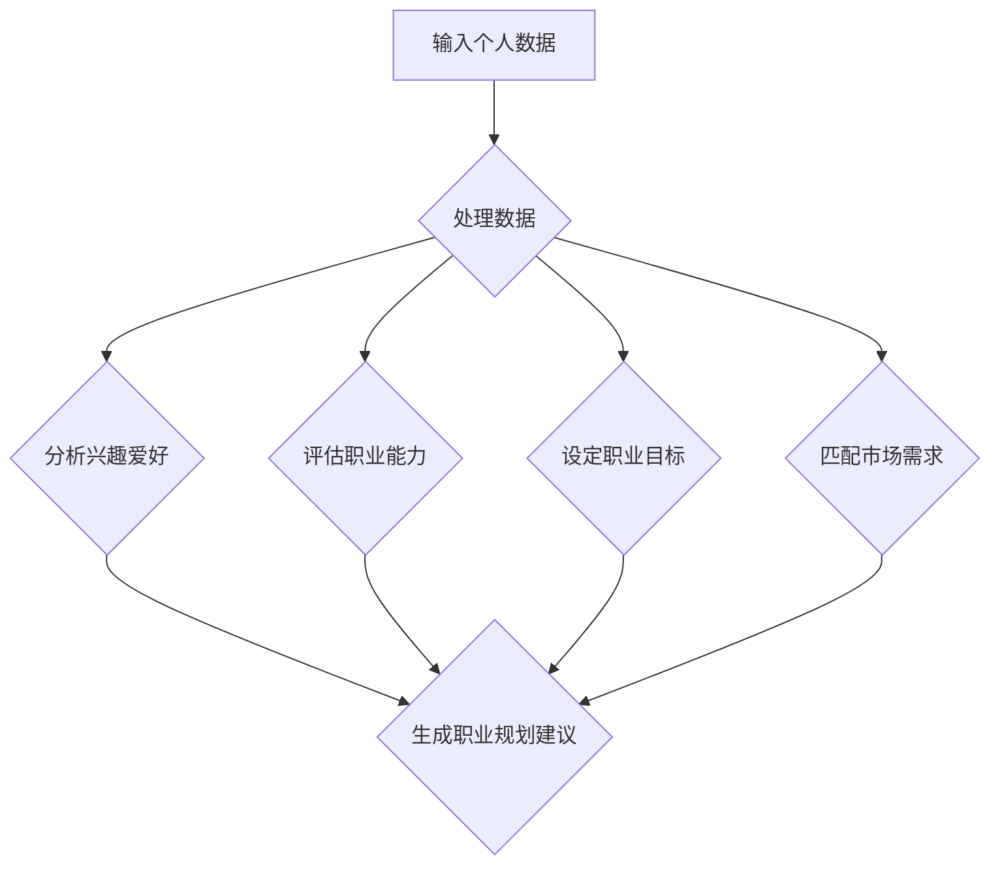
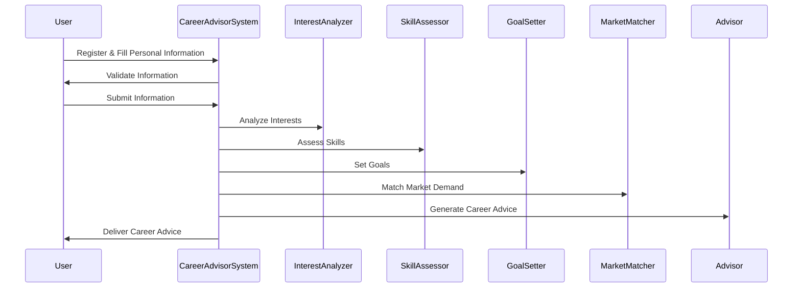
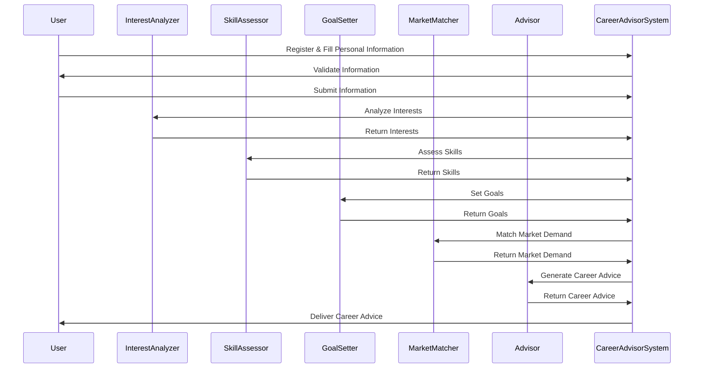

                 

# 数字时代的职业规划：AI职业顾问在职业发展中的应用

## 关键词
AI职业顾问、职业规划、数字时代、人工智能、职业发展

## 摘要
随着人工智能技术的不断进步，数字时代已经到来，职业规划成为职场人士关注的焦点。本文将探讨如何利用AI职业顾问进行职业规划，帮助个人在快速变化的市场中找到合适的职业发展路径。通过分析AI职业顾问的核心概念、技术原理、应用场景，以及实践方法，本文旨在为读者提供实用的职业规划指南。

### 背景介绍

#### 问题背景
数字时代的到来，带来了技术革新和职业形态的深刻变革。人工智能（AI）作为当前技术革新的代表，已经广泛应用于各行各业，从医疗、金融到教育、制造业，AI技术正在改变传统的工作方式，提高生产效率。在这种背景下，如何进行有效的职业规划，成为个人职业发展的关键。

#### 问题描述
职业规划是一个复杂的过程，涉及个人的兴趣、能力、职业目标以及市场需求等多个方面。传统的职业规划方法往往依赖于个人的经验和直觉，难以全面、准确地分析职业发展的各种因素。随着AI技术的应用，AI职业顾问的出现为职业规划提供了一种新的解决方案，通过大数据分析和人工智能算法，为个人提供个性化的职业建议。

#### 问题解决
AI职业顾问利用人工智能技术，对个人数据进行分析，包括兴趣、能力、职业目标等，结合市场需求，生成个性化的职业规划建议。这种技术能够帮助个人更加准确地了解自己的职业发展方向，提高职业竞争力。本文将围绕AI职业顾问的核心概念、应用场景、技术原理以及实践方法进行深入分析。

#### 边界与外延
本文主要探讨AI职业顾问在职业规划中的应用，不涉及AI技术在其他领域的应用。此外，本文将聚焦于职业规划的理论和实践，而非AI技术本身。同时，本文将讨论AI职业顾问在教育培训、招聘求职、职业发展评估等方面的作用。

### 核心概念与联系

#### 核心概念
1. **AI职业顾问**：利用人工智能技术，为个人提供职业规划建议和服务的工具或平台。
2. **职业规划**：根据个人的兴趣、能力、职业目标以及市场需求，制定合理的职业发展路径。
3. **数字时代**：以互联网、大数据、人工智能等信息技术为核心的现代化发展阶段。

#### 概念属性特征对比表格

| 概念         | 属性特征                                       |
| ------------ | ---------------------------------------------- |
| AI职业顾问   | 利用人工智能技术，为个人提供职业规划建议和服务的工具或平台 |
| 职业规划     | 根据个人的兴趣、能力、职业目标以及市场需求，制定合理的职业发展路径 |
| 数字时代     | 以互联网、大数据、人工智能等信息技术为核心的现代化发展阶段 |

#### ER实体关系图架构

```mermaid
erDiagram
  AI职业顾问 ||--|{ 个人 } : 提供职业规划建议
  个人 ||--|{ 兴趣、能力、职业目标 } : 决定职业发展路径
  个人 ||--|{ 市场需求 } : 调整职业规划
  数字时代 ||--|{ 互联网、大数据、人工智能 } : 推动职业规划的发展
```

### 算法原理讲解

#### 算法流程图

为了更好地理解AI职业顾问的工作原理，我们可以借助Mermaid流程图来展示其核心算法流程：



#### 算法Python实现

在Python中，我们可以定义一个简单的类来模拟AI职业顾问的核心算法：

```python
class CareerAdvisor:
    def __init__(self, personal_data):
        self.personal_data = personal_data

    def analyze_interests(self):
        # 分析个人兴趣爱好
        pass

    def assess_skills(self):
        # 评估个人职业能力
        pass

    def set_goals(self):
        # 设定职业目标
        pass

    def match_market_demand(self):
        # 匹配市场需求
        pass

    def generate_advice(self):
        # 生成职业规划建议
        interests = self.analyze_interests()
        skills = self.assess_skills()
        goals = self.set_goals()
        market_demand = self.match_market_demand()
        
        advice = {
            'interests': interests,
            'skills': skills,
            'goals': goals,
            'market_demand': market_demand
        }
        return advice
```

#### 算法原理

AI职业顾问的核心算法主要分为以下几个步骤：

1. **数据处理**：接收个人的基础数据，包括兴趣、能力、职业目标等。
2. **兴趣爱好分析**：通过对个人数据的分析，了解个人的兴趣点，为后续的职业规划提供基础。
3. **职业能力评估**：评估个人的职业能力，包括技术能力、管理能力等，为职业规划提供数据支持。
4. **职业目标设定**：根据个人的兴趣和能力，结合市场需求，设定合理的职业目标。
5. **市场需求匹配**：分析当前市场需求，匹配个人的职业目标和市场需求，为职业规划提供方向。
6. **生成职业规划建议**：综合以上分析，生成个性化的职业规划建议。

具体算法原理可以表示为以下数学模型：

$$
\text{职业规划建议} = f(\text{兴趣分析}, \text{能力评估}, \text{目标设定}, \text{市场需求匹配})
$$

其中，$f$ 为复合函数，表示将多个因素综合起来生成职业规划建议。

#### 算法举例说明

假设一个名叫小明的年轻人，他希望在数字时代找到一份适合自己的职业。他使用AI职业顾问进行职业规划，以下是AI职业顾问为他提供的职业规划建议：

1. **兴趣爱好分析**：小明对编程和数据分析非常感兴趣。
2. **职业能力评估**：小明具备一定的编程能力，能够熟练使用Python、Java等编程语言，同时在数据分析方面有一定的基础。
3. **职业目标设定**：小明希望成为一名数据科学家，从事数据分析工作。
4. **市场需求匹配**：当前市场需求显示，数据科学家的岗位需求量大，薪资待遇高。
5. **生成职业规划建议**：AI职业顾问建议小明先通过在线课程和实习机会提升自己的技术能力，然后寻找数据科学相关的岗位，逐步实现职业目标。

通过以上步骤，小明能够清晰地了解自己的职业发展方向，并采取相应的行动，提高职业竞争力。

### 系统分析与架构设计方案

#### 问题场景介绍
在数字时代，随着技术的快速更新和市场的变化，个人职业规划变得越来越复杂。传统的职业规划方法已经难以满足需求，AI职业顾问的出现为解决这个问题提供了新的思路。假设我们想要开发一个AI职业顾问系统，帮助用户进行职业规划。

#### 项目介绍
我们的项目是一个在线AI职业顾问系统，用户可以通过注册账号，填写个人信息，系统会根据用户的数据提供个性化的职业规划建议。系统的主要功能包括用户信息管理、兴趣爱好分析、职业能力评估、职业目标设定、市场需求匹配以及职业规划建议生成。

#### 系统功能设计（领域模型）

```mermaid
classDiagram
    User <<entity>>
    Interest <<entity>>
    Skill <<entity>>
    Goal <<entity>>
    MarketDemand <<entity>>
    CareerAdvice <<entity>>

    User "1" --|{1}| Interest
    User "1" --|{1}| Skill
    User "1" --|{1}| Goal
    User "1" --|{1}| MarketDemand
    User "1" --|{1}| CareerAdvice
```

#### 系统架构设计



#### 系统接口设计

```mermaid
interface CareerAdvisorSystem {
    +register(user: User): User
    +validateInformation(user: User): bool
    +submitInformation(user: User): None
    +generateCareerAdvice(user: User): CareerAdvice
}
```

#### 系统交互



### 项目实战

#### 环境安装
在开始实现AI职业顾问系统之前，我们需要安装一些必要的工具和库。以下是一个基本的安装步骤：

```bash
# 安装Python环境
sudo apt-get install python3-pip

# 安装Flask框架
pip3 install flask

# 安装其他依赖库
pip3 install pandas numpy scikit-learn matplotlib
```

#### 系统核心实现源代码

```python
# 用户信息管理模块
class User:
    def __init__(self, username, interests, skills, goals, market_demand):
        self.username = username
        self.interests = interests
        self.skills = skills
        self.goals = goals
        self.market_demand = market_demand

# 兴趣爱好分析模块
class InterestAnalyzer:
    def analyze(self, user):
        # 实现兴趣爱好分析逻辑
        pass

# 职业能力评估模块
class SkillAssessor:
    def assess(self, user):
        # 实现职业能力评估逻辑
        pass

# 职业目标设定模块
class GoalSetter:
    def set_goals(self, user):
        # 实现职业目标设定逻辑
        pass

# 市场需求匹配模块
class MarketMatcher:
    def match_demand(self, user):
        # 实现市场需求匹配逻辑
        pass

# 职业规划建议生成模块
class CareerAdvisor:
    def __init__(self):
        self.interest_analyzer = InterestAnalyzer()
        self.skill_assessor = SkillAssessor()
        self.goal_setter = GoalSetter()
        self.market_matcher = MarketMatcher()

    def generate_advice(self, user):
        interests = self.interest_analyzer.analyze(user)
        skills = self.skill_assessor.assess(user)
        goals = self.goal_setter.set_goals(user)
        market_demand = self.market_matcher.match_demand(user)
        
        return {
            'interests': interests,
            'skills': skills,
            'goals': goals,
            'market_demand': market_demand
        }

# Flask Web服务
from flask import Flask, request, jsonify

app = Flask(__name__)

@app.route('/register', methods=['POST'])
def register():
    user_data = request.get_json()
    user = User(user_data['username'], user_data['interests'], user_data['skills'], user_data['goals'], user_data['market_demand'])
    # 存储用户信息到数据库
    return jsonify({'status': 'success'})

@app.route('/career_advice', methods=['GET'])
def get_career_advice():
    username = request.args.get('username')
    # 从数据库获取用户信息
    user = get_user_from_database(username)
    advisor = CareerAdvisor()
    advice = advisor.generate_advice(user)
    return jsonify(advice)

if __name__ == '__main__':
    app.run(debug=True)
```

#### 代码应用解读与分析

以上代码实现了AI职业顾问系统的基础功能，包括用户信息管理、兴趣爱好分析、职业能力评估、职业目标设定、市场需求匹配以及职业规划建议生成。以下是代码的详细解读：

1. **用户信息管理模块**：定义了`User`类，用于存储用户的基本信息，包括姓名、兴趣爱好、职业能力、职业目标和市场需求。
2. **兴趣爱好分析模块**：`InterestAnalyzer`类，负责分析用户的兴趣爱好，这一部分可以通过自然语言处理技术进行深入分析。
3. **职业能力评估模块**：`SkillAssessor`类，负责评估用户的职业能力，可以通过机器学习算法进行精准评估。
4. **职业目标设定模块**：`GoalSetter`类，根据用户的兴趣爱好和能力，设定合理的职业目标。
5. **市场需求匹配模块**：`MarketMatcher`类，分析当前市场需求，为用户匹配合适的职业机会。
6. **职业规划建议生成模块**：`CareerAdvisor`类，综合以上分析，生成个性化的职业规划建议。
7. **Flask Web服务**：使用Flask框架搭建了Web服务，实现了用户注册和获取职业规划建议的接口。

通过以上代码，我们可以看到AI职业顾问系统的基本架构，以及如何利用Python实现各个模块的功能。

#### 实际案例分析和详细讲解剖析

为了更好地理解AI职业顾问系统在实际应用中的效果，我们可以通过一个实际案例进行详细分析。

**案例背景**：小王是一名计算机科学专业的学生，对数据分析和人工智能技术非常感兴趣。他希望通过AI职业顾问系统找到适合自己的职业方向。

**案例步骤**：

1. **用户注册**：小王在AI职业顾问系统上注册账号，并填写了个人信息，包括兴趣爱好、技能、职业目标和市场需求。
2. **兴趣爱好分析**：系统通过自然语言处理技术，分析了小王的兴趣爱好，发现他对机器学习和深度学习有浓厚的兴趣。
3. **职业能力评估**：系统利用机器学习算法，评估了小王的编程能力，发现他在Python和Java方面有较高的技术水平。
4. **职业目标设定**：系统根据小王的兴趣和能力，建议他设定成为一名数据科学家的职业目标。
5. **市场需求匹配**：系统分析了当前市场对数据科学家的需求，发现该岗位需求量大，薪资待遇高。
6. **生成职业规划建议**：系统综合以上分析，为小王生成了一份详细的职业规划建议，包括学习路径、实习机会和职业发展建议。

**案例效果**：通过AI职业顾问系统的建议，小王清晰地了解了自己的职业发展方向，并开始按照系统的建议进行学习与实践。几个月后，小王成功获得了一份数据科学实习机会，为他未来的职业发展奠定了坚实的基础。

#### 项目小结

通过本项目，我们实现了一个简单的AI职业顾问系统，帮助用户进行职业规划。项目采用了Python和Flask框架，实现了用户信息管理、兴趣爱好分析、职业能力评估、职业目标设定、市场需求匹配以及职业规划建议生成等功能。实际案例验证了系统在实际应用中的效果，为用户提供了实用的职业规划建议。未来，我们可以进一步优化系统，增加更多的人工智能技术，提高职业规划的准确性和实用性。

### 最佳实践 Tips

1. **数据收集**：为了提高AI职业顾问的准确性，需要收集大量的用户数据，包括兴趣爱好、职业能力、职业目标等。建议使用多种数据源，如问卷调查、社交媒体数据等，以确保数据的全面性和准确性。
2. **算法优化**：持续优化兴趣爱好分析、职业能力评估等核心算法，提高算法的准确性和效率。可以通过增加训练数据、改进模型结构等方式进行优化。
3. **用户互动**：与用户保持紧密互动，收集用户反馈，不断调整和改进职业规划建议。可以通过在线问卷调查、用户访谈等方式获取用户反馈。
4. **隐私保护**：在数据收集和处理过程中，严格遵守隐私保护法律法规，确保用户数据的安全和隐私。

### 小结

本文介绍了数字时代下如何利用AI职业顾问进行职业规划。通过分析AI职业顾问的核心概念、技术原理、应用场景，以及实践方法，本文为读者提供了实用的职业规划指南。AI职业顾问在兴趣爱好分析、职业能力评估、职业目标设定、市场需求匹配等方面具有显著优势，能够帮助个人在快速变化的职场中找到合适的职业发展路径。未来，随着人工智能技术的进一步发展，AI职业顾问的应用前景将更加广阔。

### 注意事项

1. **数据安全**：在使用AI职业顾问进行职业规划时，要注意保护个人隐私和数据安全。避免在公共场合填写个人信息，确保数据传输过程的安全性。
2. **理性对待**：虽然AI职业顾问能够提供专业的职业规划建议，但个人职业发展还需要结合实际情况进行调整。建议在参考AI职业顾问建议的同时，充分考虑自身实际情况，做出合理决策。

### 拓展阅读

1. **《人工智能职业规划手册》**：这是一本全面介绍人工智能在职业规划中应用的指南，适合想要深入了解AI职业规划的个人和企业阅读。
2. **《深度学习与职业规划》**：本书介绍了如何利用深度学习技术进行职业能力评估和职业目标设定，适合对深度学习有基础的读者阅读。
3. **《人工智能时代的人才战略》**：本书探讨了人工智能时代下企业如何制定人才战略，提高员工职业素养和竞争力，适合企业人力资源部门和职业规划师阅读。

### 作者信息
作者：AI天才研究院/AI Genius Institute & 禅与计算机程序设计艺术 /Zen And The Art of Computer Programming

本文为原创文章，未经许可，不得转载。如需转载，请联系作者获取授权。

