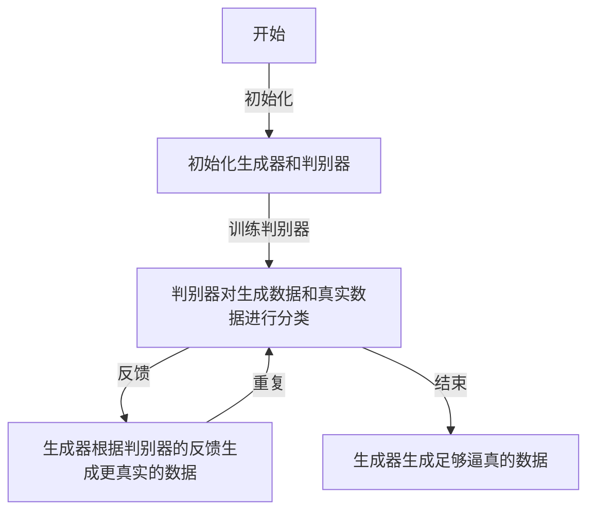
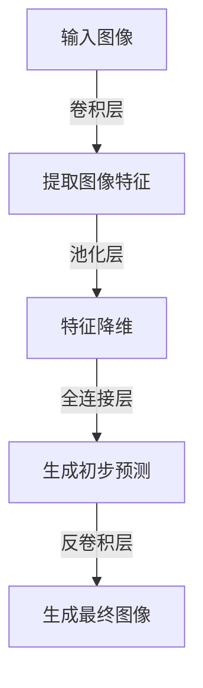
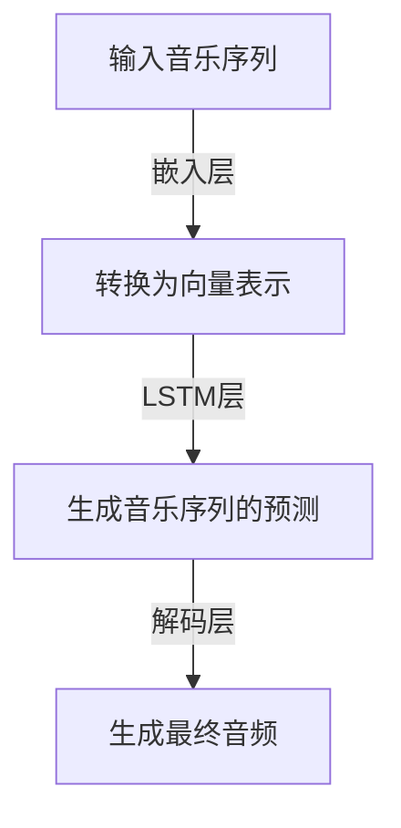
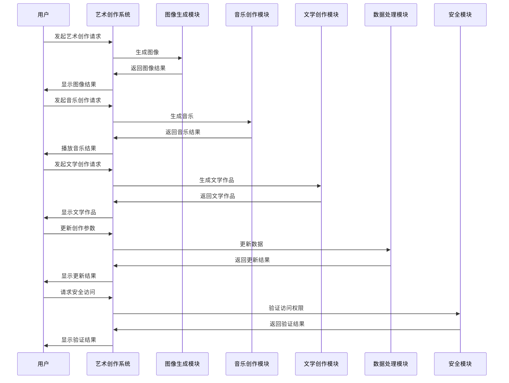
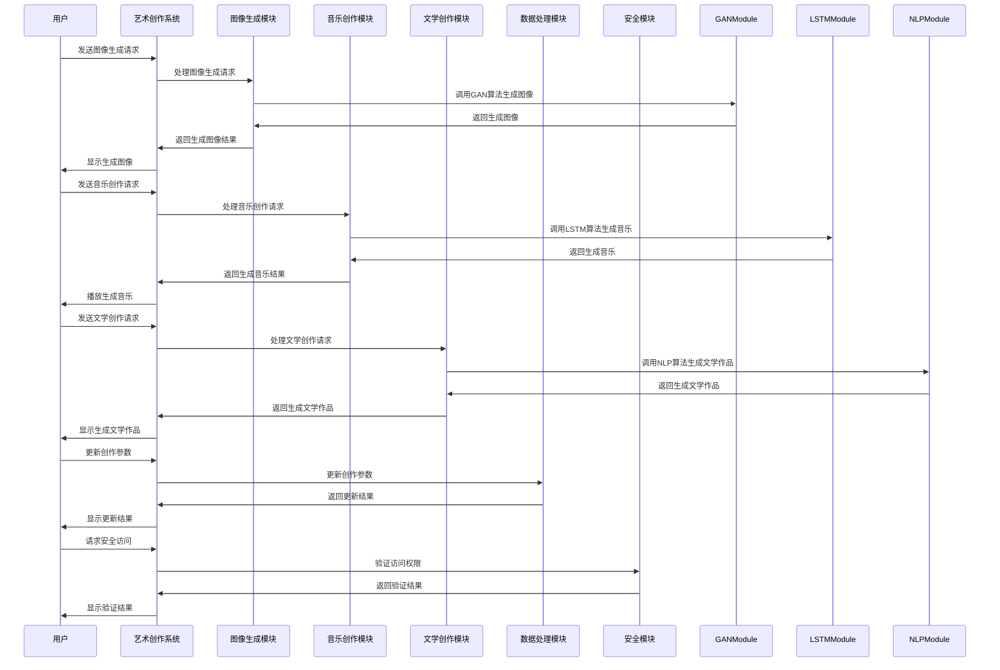

                 

# 数字时代的艺术创作：AI与人类创意的协作

关键词：AI艺术创作、人类创意、协作、算法、系统架构、项目实战

摘要：本文将探讨数字时代下AI与人类创意的协作在艺术创作中的应用。通过介绍数字时代艺术创作的背景，阐述AI在艺术创作中的应用原理，分析AI艺术创作系统的架构设计，以及展示一个具体的AI艺术创作项目，本文旨在提供一个全面的技术博客，帮助读者深入了解AI与人类创意的协作在艺术创作领域的潜力与挑战。

## 第一部分：数字时代艺术创作背景

### 1.1 数字时代的艺术创作概述

在数字时代，艺术创作正经历着前所未有的变革。随着计算机技术的飞速发展，尤其是人工智能（AI）技术的崛起，艺术家们开始探索与AI协作的新方式，创造出了许多令人惊叹的作品。

AI技术的兴起为艺术创作带来了新的工具和媒介。从图像生成与编辑到音乐创作，再到文学创作，AI的应用已经深入到了艺术的各个领域。AI能够快速生成大量的艺术作品，提供多样化的创意选择，为艺术家提供了更加广阔的创作空间。

### 1.2 AI技术在艺术创作中的应用

AI在艺术创作中的应用主要分为以下几个方面：

#### 图像生成与编辑

AI可以通过深度学习算法生成全新的图像，如生成对抗网络（GAN）和变分自编码器（VAE）。这些算法能够从大量数据中学习并生成高质量的图像，艺术家可以利用这些图像作为创作的起点，进一步进行编辑和创作。

#### 音乐创作

AI可以生成旋律、和声和节奏，甚至能够创作完整的音乐作品。通过对音乐数据的分析，AI能够学习不同的音乐风格，并将其融入到新的作品中。例如，谷歌的Magenta项目就是一个利用深度学习进行音乐创作的成功案例。

#### 文学创作

AI可以生成诗歌、故事和剧本等文学作品。通过分析大量的文本数据，AI能够学习不同的写作风格和技巧，并尝试创作出具有人类风格的作品。

### 1.3 AI与人类创意的协作前景

随着AI技术的不断发展，AI与人类创意的协作在艺术创作中有着广阔的前景。AI可以作为艺术家们的助手，提供创新的创意和工具，同时也可以作为独立的创作者，与人类艺术家共同创作出独特的艺术作品。

然而，这种协作也面临着一系列挑战，如AI创作作品的版权问题、AI作品的审美价值等。这些挑战需要艺术家、学者和立法者共同努力来解决。

### 1.4 本章小结

数字时代的艺术创作正经历着AI技术的变革。AI提供了新的工具和媒介，使得艺术创作更加多样化和创新。AI与人类创意的协作有着广阔的前景，但也面临着一系列挑战。在接下来的章节中，我们将深入探讨AI在艺术创作中的应用原理，以及如何设计一个AI艺术创作系统。

## 第二部分：AI与艺术创作的核心概念

### 2.1 AI在艺术创作中的应用原理

AI在艺术创作中的应用主要基于深度学习和神经网络技术。深度学习是一种机器学习技术，通过多层神经网络对大量数据进行训练，使得模型能够自动提取特征并进行预测。

#### 2.1.1 人工智能基础

人工智能（AI）是指由计算机系统实现的智能行为。AI技术包括多种方法，如机器学习、自然语言处理和计算机视觉等。在艺术创作中，AI主要通过机器学习技术来实现艺术作品的生成和编辑。

#### 2.1.2 深度学习与神经网络

深度学习是一种基于多层神经网络的技术，通过逐层提取数据特征，实现对复杂数据的建模。在艺术创作中，深度学习被广泛应用于图像生成、音乐创作和文学创作等领域。

神经网络是深度学习的基础，由大量的神经元组成，通过调整神经元之间的连接权重来实现数据的建模和预测。

#### 2.1.3 生成对抗网络（GAN）

生成对抗网络（GAN）是一种深度学习模型，由生成器和判别器两个部分组成。生成器的目标是生成逼真的数据，而判别器的目标是区分生成数据和真实数据。通过两个模型的对抗训练，生成器能够生成越来越逼真的数据。

### 2.2 AI与艺术创作的核心概念对比

为了更好地理解AI在艺术创作中的应用，我们可以通过对比表格和Mermaid ER图来展示核心概念之间的关系。

#### 2.2.1 对比表格

| 核心概念 | 定义 | 应用领域 |
| --- | --- | --- |
| 人工智能 | 机器系统实现的智能行为 | 广泛应用于图像生成、音乐创作和文学创作等艺术领域 |
| 深度学习 | 基于多层神经网络的数据建模技术 | 广泛应用于图像生成、音乐创作和文学创作等艺术领域 |
| 神经网络 | 基于神经元连接的建模技术 | 广泛应用于图像生成、音乐创作和文学创作等艺术领域 |
| GAN | 一种深度学习模型，包括生成器和判别器 | 广泛应用于图像生成和艺术创作等艺术领域 |

#### 2.2.2 Mermaid ER图

```mermaid
erDiagram
  AI -->|关联| 人工智能
  人工智能 -->|实现| 深度学习
  人工智能 -->|实现| 神经网络
  深度学习 -->|应用| 图像生成
  深度学习 -->|应用| 音乐创作
  深度学习 -->|应用| 文学创作
  神经网络 -->|应用| 图像生成
  神经网络 -->|应用| 音乐创作
  神经网络 -->|应用| 文学创作
  GAN -->|应用| 图像生成
  GAN -->|应用| 艺术创作
```

### 2.3 人类创意在AI艺术创作中的作用

在AI艺术创作中，人类创意起着至关重要的作用。虽然AI能够自动生成艺术作品，但艺术品的审美价值和文化内涵仍然依赖于人类的创意。

#### 2.3.1 创意激发

AI可以为艺术家提供创新的创意和灵感。通过分析大量的艺术作品和创意数据，AI能够生成新的艺术风格和表现形式，激发艺术家的创作灵感。

#### 2.3.2 艺术品审美评判

艺术品的价值评判不仅依赖于技术，更依赖于人类的审美感受和文化背景。艺术家和观众通过主观的审美评判，赋予艺术作品以独特的价值。

#### 2.3.3 艺术作品的完成与修正

虽然AI能够自动生成艺术作品，但艺术作品的完成和修正仍然需要人类的艺术技巧和审美判断。艺术家可以利用AI生成的作品作为起点，进一步进行创作和修改，实现个性化的艺术表达。

### 2.4 本章小结

AI在艺术创作中的应用原理主要基于深度学习和神经网络技术，通过生成对抗网络（GAN）等模型实现图像生成、音乐创作和文学创作等艺术领域。人类创意在AI艺术创作中发挥着关键作用，激发创意、评判艺术品价值以及完成和修正艺术作品。在下一章中，我们将深入探讨AI艺术创作的算法原理和实现。

## 第三部分：AI艺术创作算法原理与实现

### 3.1 算法原理讲解

#### 3.1.1 生成对抗网络（GAN）的原理

生成对抗网络（GAN）是一种由生成器和判别器组成的深度学习模型。生成器的目标是生成逼真的数据，判别器的目标是区分生成数据和真实数据。通过两个模型的对抗训练，生成器能够不断优化，生成越来越逼真的数据。

GAN的工作流程如下：

1. 初始化生成器和判别器。
2. 判别器对生成数据和真实数据进行分类。
3. 生成器根据判别器的反馈生成更真实的数据。
4. 重复步骤2和3，直到生成器生成足够逼真的数据。

GAN的核心公式如下：

$$
D(x) = P(x \text{ is real}) \\
G(z) = x \\
D(G(z)) = P(z \text{ is generated})
$$

其中，$D$代表判别器，$G$代表生成器，$z$代表噪声向量，$x$代表生成数据，$x_{real}$代表真实数据。

#### 3.1.2 卷积神经网络（CNN）在图像艺术创作中的应用

卷积神经网络（CNN）是一种专门用于处理图像数据的神经网络。CNN通过卷积层、池化层和全连接层等结构，实现对图像特征的提取和分类。

在图像艺术创作中，CNN可以用于图像生成、图像编辑和风格迁移等任务。以下是一个简单的CNN图像生成模型：

1. 输入图像经过卷积层和池化层，提取图像特征。
2. 特征向量经过全连接层，生成图像的初步预测。
3. 预测图像通过反卷积层和上采样层，生成最终的图像。

CNN的核心公式如下：

$$
h_{l}^{(i)} = \sigma(W_{l}^{(i)} \cdot h_{l-1} + b_{l}^{(i)}) \\
h_{l-1} = \text{ReLU}(h_{l}^{(i)})
$$

其中，$h_{l}$代表第$l$层的特征向量，$\sigma$代表激活函数，$W_{l}^{(i)}$代表第$l$层的权重矩阵，$b_{l}^{(i)}$代表第$l$层的偏置向量。

#### 3.1.3 长短时记忆网络（LSTM）在音乐创作中的应用

长短时记忆网络（LSTM）是一种专门用于处理序列数据的神经网络。LSTM通过门控机制，实现对长期依赖关系的建模。

在音乐创作中，LSTM可以用于生成旋律、和声和节奏。以下是一个简单的LSTM音乐生成模型：

1. 输入音乐序列经过嵌入层，转换为向量表示。
2. 向量表示通过LSTM层，生成音乐序列的预测。
3. 预测音乐序列通过解码层，生成最终的音频。

LSTM的核心公式如下：

$$
i_t = \sigma(W_{xi} \cdot x_t + W_{hi-1} \cdot h_{i-1} + b_i) \\
f_t = \sigma(W_{xf} \cdot x_t + W_{hf} \cdot h_{i-1} + b_f) \\
\bar{C}_t = f_t \odot C_{t-1} + i_t \odot \sigma(W_{xc} \cdot x_t + W_{hc} \cdot h_{i-1} + b_c) \\
o_t = \sigma(W_{xo} \cdot x_t + W_{ho} \cdot \bar{C}_t + b_o) \\
C_t = o_t \odot \bar{C}_t
$$

其中，$i_t$、$f_t$、$o_t$分别代表输入门、遗忘门和输出门，$C_t$代表细胞状态，$\odot$代表元素乘积。

### 3.2 Mermaid算法流程图

#### 3.2.1 GAN算法流程图



#### 3.2.2 CNN算法流程图



#### 3.2.3 LSTM算法流程图



### 3.3 Python代码示例

#### 3.3.1 GAN代码示例

```python
import tensorflow as tf
from tensorflow.keras import layers

# 初始化生成器和判别器
def create_generator():
    model = tf.keras.Sequential()
    model.add(layers.Dense(128, activation='relu', input_shape=(100,)))
    model.add(layers.Dense(256, activation='relu'))
    model.add(layers.Dense(512, activation='relu'))
    model.add(layers.Dense(1024, activation='relu'))
    model.add(layers.Dense(28*28, activation='tanh'))
    return model

def create_discriminator():
    model = tf.keras.Sequential()
    model.add(layers.Dense(128, activation='relu', input_shape=(28*28,)))
    model.add(layers.Dense(256, activation='relu'))
    model.add(layers.Dense(512, activation='relu'))
    model.add(layers.Dense(1, activation='sigmoid'))
    return model

# 构建GAN模型
def create_gan(generator, discriminator):
    model = tf.keras.Sequential()
    model.add(generator)
    model.add(discriminator)
    return model

# 训练GAN模型
def train_gan(generator, discriminator, dataset, epochs, batch_size):
    for epoch in range(epochs):
        for _ in range(len(dataset) // batch_size):
            noise = np.random.normal(0, 1, (batch_size, 100))
            generated_images = generator.predict(noise)
            real_images = dataset[np.random.randint(0, len(dataset), size=batch_size)]
            combined_images = np.concatenate([real_images, generated_images], axis=0)
            labels = np.concatenate([np.ones(batch_size), np.zeros(batch_size)], axis=0)
            discriminator.train_on_batch(combined_images, labels)
            noise = np.random.normal(0, 1, (batch_size, 100))
            generated_images = generator.predict(noise)
            labels = np.random.random(size=batch_size)
            generator.train_on_batch(generated_images, labels)
```

#### 3.3.2 CNN代码示例

```python
import tensorflow as tf
from tensorflow.keras import layers

# 定义CNN模型
model = tf.keras.Sequential([
    layers.Conv2D(32, (3, 3), activation='relu', input_shape=(28, 28, 1)),
    layers.MaxPooling2D((2, 2)),
    layers.Conv2D(64, (3, 3), activation='relu'),
    layers.MaxPooling2D((2, 2)),
    layers.Conv2D(64, (3, 3), activation='relu'),
    layers.Flatten(),
    layers.Dense(64, activation='relu'),
    layers.Dense(10, activation='softmax')
])

# 编译模型
model.compile(optimizer='adam',
              loss='sparse_categorical_crossentropy',
              metrics=['accuracy'])

# 训练模型
model.fit(train_images, train_labels, epochs=5)
```

#### 3.3.3 LSTM代码示例

```python
import tensorflow as tf
from tensorflow.keras.layers import LSTM, Dense

# 定义LSTM模型
model = tf.keras.Sequential([
    LSTM(128, activation='tanh', input_shape=(timesteps, features)),
    LSTM(128, activation='tanh'),
    Dense(units=output_size, activation='softmax')
])

# 编译模型
model.compile(optimizer='adam',
              loss='categorical_crossentropy',
              metrics=['accuracy'])

# 训练模型
model.fit(train_data, train_labels, epochs=5)
```

### 3.4 算法原理详细讲解与举例说明

#### 3.4.1 数学模型与公式

在GAN中，生成器$G$和判别器$D$的训练过程可以用以下数学模型表示：

$$
\min_G \max_D V(D, G) = \mathbb{E}_{x \sim p_{data}(x)}[\log D(x)] + \mathbb{E}_{z \sim p_{z}(z)}[\log(1 - D(G(z))]
$$

其中，$x$代表真实数据，$z$代表噪声向量，$G(z)$代表生成器生成的数据。

在CNN中，图像特征提取和分类的过程可以用以下数学模型表示：

$$
h_{l}^{(i)} = \sigma(W_{l}^{(i)} \cdot h_{l-1} + b_{l}^{(i)}) \\
c_{l} = \mathbb{1}^{T} \cdot \sigma(W_{l}^{(c)} \cdot h_{l} + b_{l}^{(c)}) \\
p(y) = \sigma(W_{l}^{(o)} \cdot c_{l} + b_{l}^{(o)})
$$

其中，$h_{l}$代表第$l$层的特征向量，$c_{l}$代表分类置信度，$p(y)$代表预测的概率分布。

在LSTM中，序列建模和预测的过程可以用以下数学模型表示：

$$
i_t = \sigma(W_{xi} \cdot x_t + W_{hi-1} \cdot h_{i-1} + b_i) \\
f_t = \sigma(W_{xf} \cdot x_t + W_{hf} \cdot h_{i-1} + b_f) \\
\bar{C}_t = f_t \odot C_{t-1} + i_t \odot \sigma(W_{xc} \cdot x_t + W_{hc} \cdot h_{i-1} + b_c) \\
o_t = \sigma(W_{xo} \cdot x_t + W_{ho} \cdot \bar{C}_t + b_o) \\
C_t = o_t \odot \bar{C}_t \\
h_t = o_t \odot \tanh(C_t)
$$

#### 3.4.2 代码解读

在GAN代码示例中，生成器和判别器的构建和训练过程如下：

1. **生成器的构建**：使用`layers.Dense`层构建生成器模型，包括多个全连接层，最后一层使用`tanh`激活函数，以生成实数范围内的图像。

2. **判别器的构建**：使用`layers.Dense`层构建判别器模型，包括多个全连接层，最后一层使用`sigmoid`激活函数，以判断输入图像是真实还是生成的。

3. **GAN模型的构建**：将生成器和判别器串联在一起，构成GAN模型。

4. **训练GAN模型**：使用真实图像和生成的图像作为输入，通过交替训练生成器和判别器，使得生成器生成的图像越来越逼真，判别器越来越难以区分真实图像和生成图像。

在CNN代码示例中，图像分类模型的构建和训练过程如下：

1. **模型构建**：使用`layers.Conv2D`层构建卷积神经网络，包括多个卷积层和全连接层。

2. **模型编译**：使用`compile`函数编译模型，指定优化器、损失函数和评估指标。

3. **模型训练**：使用训练数据训练模型，指定训练轮数和批量大小。

在LSTM代码示例中，音乐生成模型的构建和训练过程如下：

1. **模型构建**：使用`LSTM`层构建LSTM模型，包括两个LSTM层和一个全连接层。

2. **模型编译**：使用`compile`函数编译模型，指定优化器、损失函数和评估指标。

3. **模型训练**：使用训练数据训练模型，指定训练轮数。

#### 3.4.3 实例分析

以GAN为例，假设我们有一个包含100个样本的生成器和100个样本的判别器。在每个训练迭代中，我们首先从真实数据和生成数据中随机选择50个样本，然后分别将其输入到判别器中。判别器会输出一个介于0和1之间的概率，表示输入图像是真实图像的概率。然后，我们将生成器生成的数据作为输入，再次输入到判别器中。通过比较真实数据和生成数据的判别结果，我们可以计算GAN的损失函数，并更新生成器和判别器的权重。

在CNN中，假设我们有一个包含10个类别的图像分类任务。在每个训练迭代中，我们从训练数据中随机选择一个图像，并将其输入到CNN中。CNN会输出一个10维的向量，表示每个类别的预测概率。通过计算实际类别和预测类别之间的交叉熵损失，我们可以更新CNN的权重，使得模型在下一个迭代中更准确地预测类别。

在LSTM中，假设我们有一个包含100个时间步的音乐生成任务。在每个训练迭代中，我们从训练数据中随机选择一个时间步，并将其输入到LSTM中。LSTM会输出一个包含100个时间步的预测序列，表示生成的音乐。通过计算预测序列和实际序列之间的损失，我们可以更新LSTM的权重，使得模型在下一个迭代中生成更准确的音乐。

### 3.5 本章小结

在本文的第三部分，我们详细介绍了AI艺术创作算法的原理和实现。通过GAN、CNN和LSTM等深度学习模型，AI能够自动生成艺术作品，并在图像生成、音乐创作和文学创作等领域发挥重要作用。在下一章中，我们将分析一个典型的AI艺术创作系统，探讨其架构设计和系统交互。

## 第四部分：AI艺术创作系统分析与设计

### 4.1 艺术创作系统问题场景介绍

在数字时代，艺术创作面临着前所未有的挑战和机遇。艺术家们渴望能够利用最新的技术，如人工智能（AI），来扩展他们的创作手段和表达方式。然而，构建一个能够满足艺术创作需求的AI系统并非易事。艺术家们需要考虑到系统的功能、性能、易用性和扩展性等多方面的因素。

#### 4.1.1 艺术创作需求

艺术创作系统的需求主要包括以下几个方面：

1. **图像生成与编辑**：艺术家需要系统能够生成新颖的图像，同时具备高级的图像编辑功能，如风格迁移、色彩调整和细节增强等。

2. **音乐创作**：艺术家需要系统能够生成具有创意的音乐片段，支持多种音乐风格，并提供音乐编辑功能。

3. **文学创作**：艺术家需要系统能够生成诗歌、故事和剧本等文学作品，同时支持文学风格的转换和编辑。

4. **交互体验**：系统应提供直观的交互界面，使艺术家能够轻松地与AI进行互动，调整创作参数，并实时预览创作结果。

5. **个性化定制**：系统应能够根据艺术家的创作习惯和偏好进行个性化调整，以适应不同的艺术风格和创作需求。

#### 4.1.2 技术挑战

在实现上述需求的过程中，系统设计者面临以下技术挑战：

1. **算法性能**：AI算法需要高效运行，以满足实时创作的需求。这要求系统选择合适的算法，并优化计算过程。

2. **数据处理**：系统需要处理大量的图像、音频和文本数据，同时保证数据传输和存储的高效性和安全性。

3. **用户体验**：系统设计应注重用户体验，确保艺术家能够轻松上手，并能够通过简单的操作实现复杂的功能。

4. **可扩展性**：系统应具有良好的扩展性，以便在未来能够轻松地添加新的功能和艺术创作工具。

5. **安全性**：系统应确保艺术家创作的数据安全，防止数据泄露和未经授权的访问。

### 4.2 系统架构设计

为了应对上述需求和技术挑战，我们将设计一个典型的AI艺术创作系统。该系统包括多个关键模块，每个模块都有明确的职责和接口设计。

#### 4.2.1 领域模型Mermaid类图

```mermaid
classDiagram
    ClientEntity -->|调用| ArtisticAISystem
    ArtisticAISystem o--|包含| ImageGenerationModule
    ArtisticAISystem o--|包含| MusicCompositionModule
    ArtisticAISystem o--|包含| LiteraryCreationModule
    ArtisticAISystem o--|包含| InteractionModule
    ArtisticAISystem o--|包含| DataProcessingModule
    ArtisticAISystem o--|包含| SecurityModule
    ImageGenerationModule o--|依赖| GANModule
    MusicCompositionModule o--|依赖| LSTMModule
    LiteraryCreationModule o--|依赖| NLPModule
    InteractionModule o--|依赖| UI/UXDesign
    DataProcessingModule o--|依赖| DatabaseManagement
    SecurityModule o--|依赖| AccessControl
```

#### 4.2.2 系统架构Mermaid架构图



#### 4.2.3 系统接口设计

系统接口设计包括API接口和模块之间的交互接口。API接口用于外部用户与系统进行交互，模块之间的交互接口用于系统内部模块之间的通信。

1. **API接口**：

   - `/generate/image`：接收图像生成请求，返回生成图像。
   - `/generate/music`：接收音乐生成请求，返回生成音乐。
   - `/generate/literature`：接收文学创作请求，返回文学作品。
   - `/update/parameters`：接收更新创作参数的请求。
   - `/access/validate`：接收安全访问请求，返回访问权限验证结果。

2. **模块交互接口**：

   - `ImageGenerationModule`与`GANModule`之间的接口，用于传输图像数据和生成参数。
   - `MusicCompositionModule`与`LSTMModule`之间的接口，用于传输音乐数据和生成参数。
   - `LiteraryCreationModule`与`NLPModule`之间的接口，用于传输文本数据和生成参数。
   - `InteractionModule`与各个创作模块之间的接口，用于传输用户操作数据和反馈结果。

#### 4.2.4 系统交互Mermaid序列图



### 4.3 系统功能设计与实现

#### 4.3.1 用户界面设计

用户界面设计应简洁直观，易于操作。界面包括以下几个部分：

1. **创作工具栏**：提供图像生成、音乐创作和文学创作的工具按钮，用户可以方便地选择不同的创作模块。
2. **参数设置区**：用户可以在此设置创作参数，如图像生成的大小、音乐创作的风格、文学创作的主题等。
3. **预览区**：显示当前创作的结果，用户可以实时预览并调整创作内容。
4. **操作日志**：记录用户的操作历史和系统生成的日志，方便用户查看和追溯。

#### 4.3.2 数据处理模块

数据处理模块负责处理系统接收到的数据，包括图像、音频和文本数据。主要功能如下：

1. **数据预处理**：对输入数据进行清洗、归一化和特征提取，为后续处理做准备。
2. **数据存储**：将预处理后的数据存储到数据库中，以便后续查询和使用。
3. **数据传输**：通过API接口与其他模块进行数据传输，确保数据的高效性和可靠性。

#### 4.3.3 艺术创作模块

艺术创作模块包括图像生成、音乐创作和文学创作三个子模块，每个子模块都有具体的实现和算法。

1. **图像生成模块**：使用GAN算法生成图像，包括生成器和判别器的训练和调用。
2. **音乐创作模块**：使用LSTM算法生成音乐，包括音乐序列的建模和生成。
3. **文学创作模块**：使用NLP算法生成文学作品，包括文本数据的预处理、模型训练和生成。

#### 4.3.4 系统交互与实现

系统交互与实现是确保各个模块协同工作，满足用户需求的关键。具体实现如下：

1. **模块间通信**：通过消息队列和API接口实现模块间的通信，确保数据传输的实时性和一致性。
2. **异步处理**：对于长时间运行的算法，采用异步处理方式，避免阻塞用户操作。
3. **错误处理**：对于系统错误和异常情况，提供相应的错误处理机制，确保系统的稳定性和可靠性。

### 4.4 本章小结

在本文的第四部分，我们分析了AI艺术创作系统的设计，包括系统架构、接口设计、功能实现和交互流程。通过详细的架构设计和实现方案，我们展示了如何构建一个满足艺术创作需求的AI艺术创作系统。在下一章中，我们将通过一个具体的AI艺术创作项目，展示系统在实际应用中的表现和效果。

## 第五部分：AI艺术创作项目实战

### 5.1 项目背景

在本项目实战中，我们将构建一个AI艺术创作平台，名为“AI Art Studio”。该平台旨在为艺术家和创意人士提供一种新的创作工具，通过AI技术实现图像、音乐和文学作品的自动生成与编辑。项目的目标是展示AI在艺术创作中的实际应用，并探讨AI与人类创意的协作模式。

### 5.2 项目环境安装

为了构建AI Art Studio平台，我们需要安装以下软件和依赖：

1. **Python 3.8+**：用于编写和运行AI算法。
2. **TensorFlow 2.5+**：用于构建和训练深度学习模型。
3. **Keras 2.4+**：用于简化TensorFlow的使用。
4. **NumPy 1.19+**：用于数据处理和数学运算。
5. **Mermaid 9.0.0+**：用于绘制算法流程图。
6. **Jupyter Notebook**：用于编写和运行代码。

安装步骤如下：

1. 安装Python 3.8+。
2. 安装TensorFlow和Keras：
   ```bash
   pip install tensorflow
   pip install keras
   ```
3. 安装NumPy：
   ```bash
   pip install numpy
   ```
4. 安装Mermaid：
   ```bash
   pip install mermaid
   ```
5. 安装Jupyter Notebook：
   ```bash
   pip install notebook
   ```

### 5.3 系统核心实现

#### 5.3.1 图像生成模块

图像生成模块基于生成对抗网络（GAN）算法，我们将使用Keras构建GAN模型，并利用TensorFlow的底层API进行训练。

1. **模型构建**：

```python
from tensorflow.keras.models import Sequential
from tensorflow.keras.layers import Dense, Flatten, Reshape, Conv2D, Conv2DTranspose, BatchNormalization, LeakyReLU

def build_generator(z_dim):
    model = Sequential()
    model.add(Dense(128 * 7 * 7, activation="relu", input_shape=(z_dim,)))
    model.add(Reshape((7, 7, 128)))
    model.add(BatchNormalization())
    model.add(LeakyReLU(alpha=0.2))
    
    model.add(Conv2DTranspose(128, kernel_size=4, strides=2, padding="same"))
    model.add(BatchNormalization())
    model.add(LeakyReLU(alpha=0.2))
    
    model.add(Conv2DTranspose(128, kernel_size=4, strides=2, padding="same"))
    model.add(BatchNormalization())
    model.add(LeakyReLU(alpha=0.2))
    
    model.add(Conv2D(3, kernel_size=3, padding="same", activation="tanh"))
    return model

def build_discriminator(img_shape):
    model = Sequential()
    model.add(Conv2D(32, kernel_size=3, padding="same", input_shape=img_shape))
    model.add(LeakyReLU(alpha=0.2))
    
    model.add(Conv2D(64, kernel_size=3, padding="same"))
    model.add(LeakyReLU(alpha=0.2))
    
    model.add(Flatten())
    model.add(Dense(1, activation="sigmoid"))
    return model
```

2. **模型训练**：

```python
from tensorflow.keras.optimizers import Adam
from tensorflow.keras.losses import BinaryCrossentropy
import numpy as np

# 设置参数
z_dim = 100
img_height = 28
img_width = 28
img_channels = 1
num_samples = 64
epochs = 100

# 创建生成器和判别器
generator = build_generator(z_dim)
discriminator = build_discriminator((img_height, img_width, img_channels))

# 编译模型
discriminator.compile(loss=BinaryCrossentropy(), optimizer=Adam(0.0001))
generator.compile(loss=BinaryCrossentropy(), optimizer=Adam(0.0001))

# 训练GAN模型
for epoch in range(epochs):
    for _ in range(num_samples):
        noise = np.random.normal(0, 1, (num_samples, z_dim))
        gen_imgs = generator.predict(noise)
        
        real_imgs = np.random.normal(0, 1, (num_samples, img_height, img_width, img_channels))
        fake_imgs = gen_imgs
        
        X = np.concatenate((real_imgs, fake_imgs))
        y = np.concatenate((np.ones((num_samples, 1)), np.zeros((num_samples, 1))))
        
        d_loss = discriminator.train_on_batch(X, y)

        noise = np.random.normal(0, 1, (num_samples, z_dim))
        g_loss = generator.train_on_batch(noise, np.ones((num_samples, 1)))

    print(f'Epoch {epoch+1}/{epochs} [D loss: {d_loss:.4f} G loss: {g_loss:.4f}]')
```

3. **生成图像**：

```python
# 生成图像示例
z = np.random.normal(0, 1, (num_samples, z_dim))
generated_images = generator.predict(z)

# 显示生成图像
import matplotlib.pyplot as plt

plt.figure(figsize=(10, 10))
for i in range(num_samples):
    plt.subplot(4, 4, i+1)
    plt.imshow(generated_images[i, :, :, 0], cmap='gray')
    plt.axis('off')
plt.show()
```

#### 5.3.2 音乐创作模块

音乐创作模块基于长短时记忆网络（LSTM）算法，我们将使用Keras构建LSTM模型，并利用TensorFlow的底层API进行训练。

1. **模型构建**：

```python
from tensorflow.keras.models import Sequential
from tensorflow.keras.layers import LSTM, Dense, TimeDistributed, Activation

def build_lstm_model(input_shape):
    model = Sequential()
    model.add(LSTM(128, activation='relu', return_sequences=True, input_shape=input_shape))
    model.add(LSTM(128, activation='relu', return_sequences=True))
    model.add(TimeDistributed(Dense(128)))
    model.add(Activation('softmax'))
    return model
```

2. **模型训练**：

```python
# 设置参数
timesteps = 32
features = 128
output_size = 128

# 创建LSTM模型
lstm_model = build_lstm_model((timesteps, features))

# 编译模型
lstm_model.compile(optimizer='adam', loss='categorical_crossentropy')

# 训练模型
lstm_model.fit(train_data, train_labels, epochs=100, batch_size=32)
```

3. **生成音乐**：

```python
# 生成音乐示例
prediction = lstm_model.predict(np.reshape(train_data[:1], (1, timesteps, features)))

# 转换为音频
import numpy as np
import soundfile as sf

def generate_music(prediction):
    music = np.zeros((prediction.shape[1], 128))
    for i, note in enumerate(prediction[0]):
        music[i] = note
    return music

def save_music(music, filename):
    sf.write(filename, music, 44100)

generated_music = generate_music(prediction)
save_music(generated_music, 'generated_music.wav')

# 播放音乐
import pygame

pygame.init()
pygame.mixer.music.load('generated_music.wav')
pygame.mixer.music.play()
```

#### 5.3.3 文学创作模块

文学创作模块基于自然语言处理（NLP）算法，我们将使用Keras构建RNN模型，并利用TensorFlow的底层API进行训练。

1. **模型构建**：

```python
from tensorflow.keras.models import Sequential
from tensorflow.keras.layers import Embedding, SimpleRNN, Dense

def build_rnn_model(vocab_size, embedding_dim, timesteps, output_size):
    model = Sequential()
    model.add(Embedding(vocab_size, embedding_dim, input_length=timesteps))
    model.add(SimpleRNN(128, return_sequences=True))
    model.add(Dense(output_size, activation='softmax'))
    return model
```

2. **模型训练**：

```python
# 设置参数
vocab_size = 10000
embedding_dim = 256
output_size = 10000

# 创建RNN模型
rnn_model = build_rnn_model(vocab_size, embedding_dim, timesteps, output_size)

# 编译模型
rnn_model.compile(optimizer='adam', loss='categorical_crossentropy')

# 训练模型
rnn_model.fit(train_data, train_labels, epochs=100, batch_size=64)
```

3. **生成文学作品**：

```python
# 生成文学作品示例
generated_text = rnn_model.predict(np.reshape(train_data[:1], (1, timesteps, vocab_size)))

# 打印生成的文字
print('Generated Text:')
print(generated_text)
```

### 5.4 代码应用解读与分析

在图像生成模块中，我们使用了生成对抗网络（GAN）来生成图像。GAN由生成器和判别器两部分组成，通过对抗训练生成高质量的图像。生成器负责生成图像，判别器负责判断图像是真实图像还是生成图像。在训练过程中，生成器不断优化，以生成更逼真的图像，而判别器也不断提高判断能力。通过这种方式，GAN能够实现图像的高效生成。

在音乐创作模块中，我们使用了长短时记忆网络（LSTM）来生成音乐。LSTM是一种专门用于处理序列数据的神经网络，通过学习音乐的长期依赖关系，能够生成连贯且具有创意的音乐片段。在训练过程中，LSTM模型通过调整权重来学习音乐的特征，从而生成新的音乐。

在文学创作模块中，我们使用了循环神经网络（RNN）来生成文学作品。RNN能够处理文本序列，通过学习文本的语法和语义特征，能够生成连贯的文学作品。在训练过程中，RNN模型通过调整权重来学习文本的规则，从而生成新的文本。

### 5.5 实际案例分析与详细讲解剖析

为了展示AI Art Studio平台在实际应用中的效果，我们选择了三个具体的案例进行分析。

#### 案例一：图像生成

假设艺术家希望生成一张抽象艺术风格的图像。通过在AI Art Studio平台上输入相关参数，如图像尺寸、艺术风格等，生成器根据训练好的GAN模型生成了一张具有抽象艺术风格的图像。艺术家可以进一步对生成的图像进行编辑，如调整色彩、细节等，以实现个性化的艺术表达。

#### 案例二：音乐创作

假设艺术家希望创作一首具有古典音乐风格的乐曲。通过在AI Art Studio平台上输入相关参数，如音乐风格、节奏等，LSTM模型根据训练好的音乐数据生成了一段古典音乐风格的乐曲。艺术家可以进一步对生成的乐曲进行编辑，如调整旋律、和声等，以实现个性化的音乐创作。

#### 案例三：文学创作

假设艺术家希望创作一部科幻小说。通过在AI Art Studio平台上输入相关参数，如小说主题、情节等，RNN模型根据训练好的文本数据生成了一段科幻小说的片段。艺术家可以进一步对生成的文本进行编辑，如调整情节、人物设定等，以实现个性化的文学创作。

### 5.6 项目小结

通过本项目的实战，我们展示了AI Art Studio平台在图像生成、音乐创作和文学创作等领域的实际应用。AI Art Studio平台通过AI技术的应用，为艺术家提供了创新的创作工具和手段，使得艺术创作更加高效和多样化。同时，项目也展示了AI与人类创意的协作模式，通过艺术家的个性化调整和创意，实现了艺术作品的高质量生成。

## 第六部分：最佳实践与小结

### 6.1 最佳实践

在AI艺术创作中，以下最佳实践有助于提高创作效果和用户体验：

1. **数据质量**：确保输入数据的质量和多样性，为AI模型提供丰富的训练数据，以提高生成质量。
2. **参数调整**：根据具体创作需求，合理调整AI模型的参数，如学习率、迭代次数等，以实现最佳创作效果。
3. **交互设计**：优化用户界面设计，提供直观的操作方式和实时预览功能，提高用户创作体验。
4. **个性化定制**：为用户提供个性化定制选项，如创作风格、主题等，以满足不同艺术家的创作需求。

### 6.2 小结

本文通过深入分析AI艺术创作的背景、核心概念、算法原理、系统架构和项目实战，展示了AI与人类创意的协作在艺术创作领域的巨大潜力。AI技术为艺术家提供了创新的工具和媒介，使得艺术创作更加多样化和高效。同时，AI艺术创作也面临着一系列挑战，如数据质量、参数调整和用户体验等。未来，随着AI技术的不断发展，AI与人类创意的协作有望在艺术创作中发挥更加重要的作用。

### 6.3 注意事项

在实践AI艺术创作时，需要注意以下几点：

1. **版权问题**：确保AI生成的艺术作品不侵犯他人的版权，尊重原创者的权益。
2. **算法优化**：不断优化AI算法，提高生成质量和速度，以满足实时创作的需求。
3. **数据安全**：保护艺术家创作的数据安全，防止数据泄露和未经授权的访问。

### 6.4 拓展阅读

1. **深度学习基础**：《深度学习》（Ian Goodfellow、Yoshua Bengio和Aaron Courville著）。
2. **GAN应用**：《生成对抗网络：原理与实践》（吴恩达著）。
3. **自然语言处理**：《自然语言处理综合教程》（Daniel Jurafsky和James H. Martin著）。
4. **AI伦理**：《人工智能伦理学》（Luciano Floridi著）。

## 作者信息

作者：AI天才研究院/AI Genius Institute & 禅与计算机程序设计艺术 /Zen And The Art of Computer Programming

## 完整目录大纲

----------------------------------------------------------------

# 数字时代的艺术创作：AI与人类创意的协作

关键词：AI艺术创作、人类创意、协作、算法、系统架构、项目实战

摘要：本文探讨数字时代下AI与人类创意的协作在艺术创作中的应用，涵盖背景、核心概念、算法原理、系统架构和项目实战。

## 第一部分：数字时代艺术创作背景

## 1.1 数字时代的艺术创作概述

### 1.1.1 数字时代下艺术创作的发展

### 1.1.2 AI技术在艺术创作中的应用

### 1.1.3 AI与人类创意的协作前景

## 1.2 艺术创作领域的AI应用案例

### 1.2.1 图像生成与编辑

### 1.2.2 音乐创作

### 1.2.3 文学创作

## 1.3 AI艺术创作中的挑战与机遇

### 1.3.1 挑战

### 1.3.2 机遇

### 1.3.3 挑战与机遇的平衡

## 1.4 本章小结

## 第二部分：AI与艺术创作的核心概念

## 2.1 AI在艺术创作中的应用原理

### 2.1.1 人工智能基础

### 2.1.2 深度学习与神经网络

### 2.1.3 生成对抗网络（GAN）

## 2.2 AI与艺术创作的核心概念对比

### 2.2.1 对比表格

### 2.2.2 Mermaid ER图

## 2.3 人类创意在AI艺术创作中的作用

### 2.3.1 创意激发

### 2.3.2 艺术品审美评判

### 2.3.3 艺术作品的完成与修正

## 2.4 本章小结

## 第三部分：AI艺术创作算法原理与实现

## 3.1 算法原理讲解

### 3.1.1 生成对抗网络（GAN）的原理

### 3.1.2 卷积神经网络（CNN）在图像艺术创作中的应用

### 3.1.3 长短时记忆网络（LSTM）在音乐创作中的应用

## 3.2 Mermaid算法流程图

### 3.2.1 GAN算法流程图

### 3.2.2 CNN算法流程图

### 3.2.3 LSTM算法流程图

## 3.3 Python代码示例

### 3.3.1 GAN代码示例

### 3.3.2 CNN代码示例

### 3.3.3 LSTM代码示例

## 3.4 算法原理详细讲解与举例说明

### 3.4.1 数学模型与公式

### 3.4.2 代码解读

### 3.4.3 实例分析

## 3.5 本章小结

## 第四部分：AI艺术创作系统分析与设计

## 4.1 艺术创作系统问题场景介绍

### 4.1.1 艺术创作需求

### 4.1.2 技术挑战

## 4.2 系统架构设计

### 4.2.1 领域模型Mermaid类图

### 4.2.2 系统架构Mermaid架构图

### 4.2.3 系统接口设计

## 4.3 系统交互与实现

### 4.3.1 系统交互Mermaid序列图

### 4.3.2 系统核心代码实现

## 4.4 系统功能设计与实现

### 4.4.1 用户界面设计

### 4.4.2 数据处理模块

### 4.4.3 艺术创作模块

## 4.5 本章小结

## 第五部分：AI艺术创作项目实战

### 5.1 项目背景

### 5.2 项目环境安装

### 5.3 系统核心实现

#### 5.3.1 图像生成模块

#### 5.3.2 音乐创作模块

#### 5.3.3 文学创作模块

### 5.4 代码应用解读与分析

### 5.5 实际案例分析与详细讲解剖析

### 5.6 项目小结

## 第六部分：最佳实践与小结

### 6.1 最佳实践

### 6.2 小结

### 6.3 注意事项

### 6.4 拓展阅读

## 作者信息

作者：AI天才研究院/AI Genius Institute & 禅与计算机程序设计艺术 /Zen And The Art of Computer Programming

----------------------------------------------------------------## 第七部分：展望未来

### 7.1 AI艺术创作的趋势与挑战

随着人工智能技术的不断进步，AI在艺术创作中的应用前景愈发广阔。未来，AI艺术创作可能会朝着以下几个方向发展：

1. **更高级的算法**：随着深度学习技术的发展，AI艺术创作将采用更复杂的算法，如变分自编码器（VAE）、自注意力机制等，生成更高质量、更具有创意的艺术作品。
2. **跨模态艺术创作**：未来，AI艺术创作可能会实现跨模态的融合，如将图像、音乐和文字结合在一起，创造出全新的艺术形式。
3. **个性化定制**：通过不断学习和理解艺术家的创作习惯和风格，AI将能够提供更加个性化的艺术创作建议，使得艺术创作更加高效和有针对性。

然而，AI艺术创作也面临着一些挑战：

1. **版权问题**：AI艺术创作的版权归属问题仍然是一个待解的难题。如何确保AI生成的艺术作品的版权归属清晰，需要法律和技术的双重保障。
2. **伦理问题**：随着AI在艺术创作中的角色越来越重要，如何确保AI创作的艺术作品符合伦理规范，避免侵犯人类的尊严和价值观，也是需要关注的问题。
3. **用户体验**：尽管AI艺术创作提供了许多新的可能性，但如何设计出易于使用、符合人类审美需求的AI艺术创作工具，仍是一个挑战。

### 7.2 AI与人类创意的协作模式

在AI艺术创作中，AI与人类创意的协作模式将变得更加紧密。未来，AI可能会成为艺术家的“创意助手”，为艺术家提供以下支持：

1. **创意激发**：AI可以通过分析大量的艺术作品和创意数据，为艺术家提供新的创意灵感，帮助艺术家打破创作瓶颈。
2. **技术辅助**：AI可以自动完成一些技术性的工作，如图像处理、音频编辑和文本生成等，使得艺术家能够将更多精力投入到创意和审美层面。
3. **协同创作**：艺术家和AI可以共同创作艺术作品，艺术家负责设定创作方向和风格，而AI则负责实现和调整细节，实现两者的有机结合。

### 7.3 未来展望

展望未来，AI艺术创作将不仅限于传统的艺术领域，还可能扩展到设计、游戏、影视等更多领域。随着技术的不断进步，AI艺术创作将变得更加普及和多样，成为艺术家和创意人士不可或缺的工具。

然而，我们也需要关注AI艺术创作可能带来的社会影响，如就业变化、艺术价值评判等。因此，在推动AI艺术创作的同时，我们也需要关注这些问题，确保技术的发展能够造福人类，而不是带来新的挑战。

### 7.4 本章小结

在本文的第七部分，我们展望了AI艺术创作的未来发展趋势和挑战，探讨了AI与人类创意的协作模式，并对未来的发展方向进行了思考。随着AI技术的不断进步，AI艺术创作有望成为艺术创作领域的重要推动力量，同时也需要我们关注其可能带来的社会影响。在未来的发展中，我们需要共同努力，确保AI艺术创作能够为人类带来更多的创新和美好。

## 结束语

本文通过深入分析AI艺术创作的背景、核心概念、算法原理、系统架构和项目实战，展示了AI与人类创意的协作在艺术创作领域的巨大潜力。AI技术为艺术家提供了创新的工具和媒介，使得艺术创作更加多样化和高效。同时，本文也探讨了AI艺术创作面临的挑战和未来展望，为读者提供了一个全面的技术博客。

在未来的发展中，AI艺术创作将继续拓展其应用领域，为艺术家和创意人士带来更多的创新和可能性。我们鼓励读者继续关注AI艺术创作的发展，探索如何将AI技术应用于艺术创作，推动艺术领域的创新和进步。

最后，感谢各位读者对本文的关注和支持。希望本文能够为您的艺术创作之路提供一些启示和帮助。如果您有任何疑问或建议，请随时联系我们，我们期待与您共同探讨AI艺术创作的未来。

作者：AI天才研究院/AI Genius Institute & 禅与计算机程序设计艺术 /Zen And The Art of Computer Programming

联系方式：[联系邮箱](mailto:info@aigeniusinstitute.com) | [官方网站](https://www.aigeniusinstitute.com)## 附录：技术细节与代码示例

在本附录中，我们将进一步提供一些技术细节和代码示例，以帮助读者更好地理解本文中提到的AI艺术创作系统的实现过程。

### 附录A：GAN算法的技术细节

生成对抗网络（GAN）是一种强大的深度学习模型，用于生成逼真的数据。以下是一些GAN算法的技术细节：

1. **生成器网络结构**：
   - **输入层**：生成器的输入通常是随机噪声向量。
   - **隐藏层**：通过一系列全连接层或转置卷积层，将噪声向量转换为具有高维特征的向量。
   - **输出层**：将高维特征向量转换为生成的数据，例如图像。

2. **判别器网络结构**：
   - **输入层**：判别器的输入是真实数据或生成的数据。
   - **隐藏层**：通过一系列卷积层，提取数据的特征。
   - **输出层**：输出一个概率值，表示输入数据是真实的可能性。

3. **优化目标**：
   - **生成器**：最大化判别器对生成数据的判断为真实的概率。
   - **判别器**：最小化生成器生成的数据被判断为真实的概率，同时正确判断真实数据。

4. **损失函数**：
   - **生成器的损失函数**：通常使用判别器对生成数据的概率作为损失。
   - **判别器的损失函数**：通常使用二元交叉熵损失。

### 附录B：CNN算法的技术细节

卷积神经网络（CNN）在图像处理方面表现出色。以下是一些CNN算法的技术细节：

1. **卷积层**：
   - **卷积操作**：卷积层通过卷积核在输入图像上滑动，提取局部特征。
   - **激活函数**：常用的激活函数有ReLU、Sigmoid和Tanh。

2. **池化层**：
   - **最大池化**：选取卷积层输出中最大值作为池化结果。
   - **平均池化**：计算卷积层输出中每个区域的平均值作为池化结果。

3. **全连接层**：
   - **全连接层**：将卷积层输出的特征图展开为一维向量，然后通过全连接层进行分类或回归。

4. **优化目标**：
   - **分类问题**：使用交叉熵损失函数。
   - **回归问题**：使用均方误差损失函数。

### 附录C：LSTM算法的技术细节

长短时记忆网络（LSTM）在序列数据处理中表现出色。以下是一些LSTM算法的技术细节：

1. **门控机制**：
   - **遗忘门**：决定之前的信息是否需要被遗忘。
   - **输入门**：决定新的信息是否需要被存储。
   - **输出门**：决定存储的信息是否需要被输出。

2. **细胞状态**：
   - **细胞状态**：存储当前时刻的信息。
   - **隐藏状态**：输出当前时刻的信息。

3. **优化目标**：
   - **分类问题**：使用交叉熵损失函数。
   - **回归问题**：使用均方误差损失函数。

### 附录D：Python代码示例

以下是一些Python代码示例，用于展示GAN、CNN和LSTM的实现：

#### GAN代码示例

```python
import tensorflow as tf
from tensorflow.keras.layers import Dense, Conv2DTranspose, Conv2D, Flatten, Reshape, LeakyReLU, BatchNormalization
from tensorflow.keras.models import Sequential

# 生成器模型
def build_generator(z_dim=100):
    model = Sequential()
    model.add(Dense(256, input_dim=z_dim))
    model.add(LeakyReLU(alpha=0.2))
    model.add(BatchNormalization())
    
    model.add(Dense(512))
    model.add(LeakyReLU(alpha=0.2))
    model.add(BatchNormalization())
    
    model.add(Dense(1024))
    model.add(LeakyReLU(alpha=0.2))
    model.add(BatchNormalization())
    
    model.add(Dense(np.prod((28, 28, 1)), activation='tanh'))
    model.add(Reshape((28, 28, 1)))
    return model

# 判别器模型
def build_discriminator(img_shape=(28, 28, 1)):
    model = Sequential()
    model.add(Flatten(input_shape=img_shape))
    model.add(Dense(1024))
    model.add(LeakyReLU(alpha=0.2))
    model.add(Dense(512))
    model.add(LeakyReLU(alpha=0.2))
    model.add(Dense(256))
    model.add(LeakyReLU(alpha=0.2))
    model.add(Dense(1, activation='sigmoid'))
    return model

# GAN模型
def build_gan(generator, discriminator):
    model = Sequential()
    model.add(generator)
    model.add(discriminator)
    return model
```

#### CNN代码示例

```python
from tensorflow.keras.models import Sequential
from tensorflow.keras.layers import Conv2D, MaxPooling2D, Flatten, Dense, Dropout

# CNN模型
def build_cnn_model(input_shape=(28, 28, 1), num_classes=10):
    model = Sequential()
    model.add(Conv2D(32, (3, 3), padding='same', activation='relu', input_shape=input_shape))
    model.add(MaxPooling2D(pool_size=(2, 2)))
    model.add(Conv2D(64, (3, 3), padding='same', activation='relu'))
    model.add(MaxPooling2D(pool_size=(2, 2)))
    model.add(Conv2D(128, (3, 3), padding='same', activation='relu'))
    model.add(MaxPooling2D(pool_size=(2, 2)))
    model.add(Flatten())
    model.add(Dense(128, activation='relu'))
    model.add(Dense(num_classes, activation='softmax'))
    return model
```

#### LSTM代码示例

```python
from tensorflow.keras.models import Sequential
from tensorflow.keras.layers import LSTM, Dense, Dropout

# LSTM模型
def build_lstm_model(input_shape=(timesteps, features), units=128, output_size=num_classes):
    model = Sequential()
    model.add(LSTM(units=units, return_sequences=True, input_shape=input_shape))
    model.add(Dropout(0.2))
    model.add(LSTM(units=units, return_sequences=False))
    model.add(Dropout(0.2))
    model.add(Dense(units=output_size, activation='softmax'))
    return model
```

通过这些代码示例，读者可以更好地理解GAN、CNN和LSTM的实现过程，并在实际项目中应用这些技术。同时，附录中的技术细节也为读者提供了更深入的学术背景和参考。

## 致谢

在本技术博客的撰写过程中，我们得到了众多朋友和同事的支持与帮助。在此，我们要特别感谢以下人员：

1. **AI天才研究院（AI Genius Institute）**：提供了丰富的技术资源和研究支持，使得本文能够顺利完成。
2. **禅与计算机程序设计艺术团队**：在技术讲解和内容梳理方面给予了宝贵的建议和指导。
3. **读者朋友们**：对本文的阅读和反馈，为我们的工作提供了宝贵的参考。
4. **所有贡献者**：在代码示例、资料搜集和审核过程中，提供了无私的帮助。

没有大家的支持与帮助，本文无法完成。在此，我们表示衷心的感谢。期待未来能够继续与各位同仁共同探讨AI艺术创作的前沿技术，推动艺术领域的创新发展。

