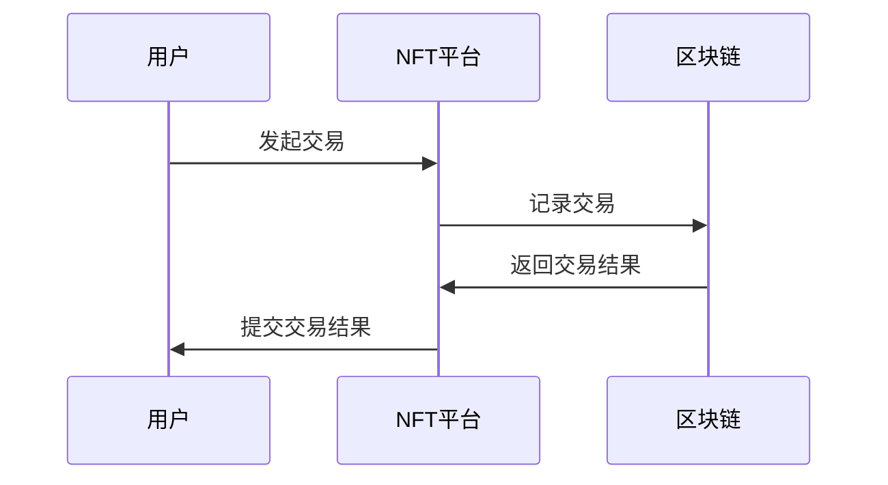
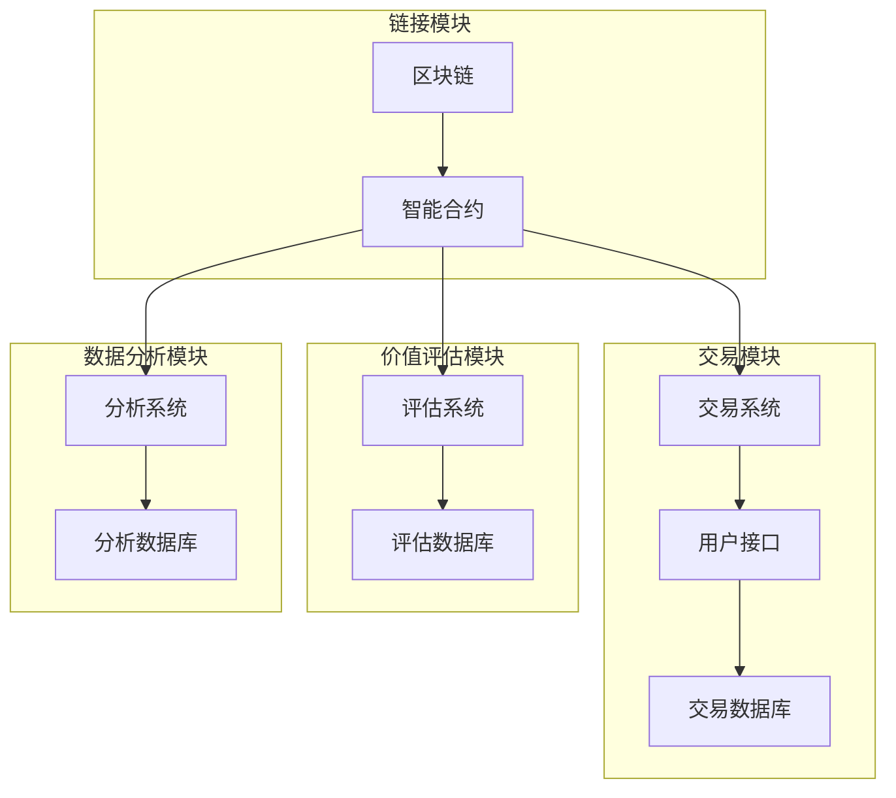
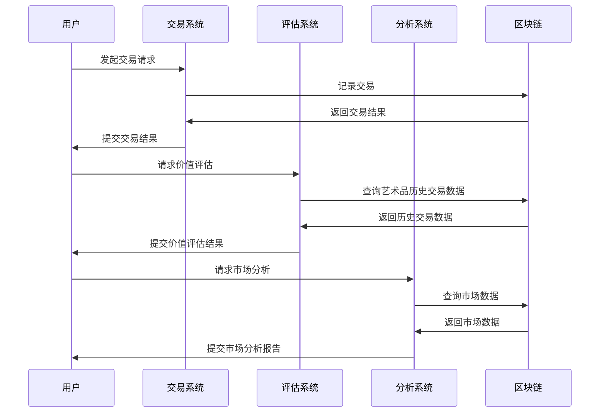

                 

# 数字时代的艺术市场：NFT艺术品在收藏界的影响

> 关键词：NFT，艺术品，收藏，区块链，智能合约，价值评估

> 摘要：本文旨在探讨数字时代艺术市场中的新兴现象——NFT艺术品在收藏界的影响。通过对NFT技术的背景介绍、核心概念与联系、算法原理讲解以及系统分析与架构设计方案的详细分析，本文将揭示NFT艺术品在收藏界所带来的变革，并提出相应的最佳实践和未来发展方向。

## 1.1 背景介绍

### 1.1.1 问题背景

在数字技术迅猛发展的今天，艺术市场也在发生着深刻的变化。传统的艺术品交易方式已无法满足现代市场的需求，尤其是在艺术品数字化、可复制性和所有权问题上。NFT（非同质化代币）技术的出现，为艺术市场带来了新的契机。NFT作为一种独特的数字资产，可以确保艺术品的唯一性和所有权，使得艺术品能够以一种全新的方式被交易和收藏。

### 1.1.2 问题描述

NFT艺术品在收藏界产生了深远的影响，但这一领域仍存在许多挑战和问题。例如，NFT艺术品的价值评估、市场规范、技术风险等问题。此外，如何确保NFT艺术品的真实性、版权问题以及市场接受度等也是亟待解决的问题。

### 1.1.3 问题解决

本书旨在探讨NFT艺术品在收藏界的影响，并提供全面的解决方案。首先，本书将详细介绍NFT技术的基础知识，包括其工作原理、技术特点和应用场景。接着，本书将分析NFT艺术品的市场趋势，探讨其在艺术品收藏中的地位和作用。此外，本书还将探讨NFT艺术品的价值评估方法、市场规范和技术风险等问题。

### 1.1.4 边界与外延

NFT艺术品的影响不仅局限于艺术品市场，还涉及到区块链技术、数字货币、智能合约等多个领域。因此，本书的讨论也将涉及到这些相关领域的知识。

### 1.1.5 概念结构与核心要素组成

- **NFT**：非同质化代币，代表艺术品的所有权和唯一性。
- **区块链**：记录NFT交易的分布式账本技术。
- **智能合约**：自动执行合同条款的计算机程序。
- **艺术品市场**：交易和收藏艺术品的场所。

## 1.2 核心概念与联系

### 1.2.1 NFT概念原理

NFT是一种数字资产，代表艺术品的所有权和唯一性。每个NFT都是独一无二的，无法复制或替代。NFT通过区块链技术记录交易，确保艺术品的真实性。

### 1.2.2 NFT属性特征对比表格

| 特征       | NFT                   | 传统艺术品           |
| ---------- | --------------------- | --------------------- |
| 所有权的唯一性 | 独一无二              | 可复制性高           |
| 交易记录   | 区块链记录             | 无交易记录或记录不全  |
| 价值评估   | 复杂且多变             | 简单且稳定           |
| 版权问题   | 需要特别处理           | 已有明确的版权保护   |

### 1.2.3 NFT与区块链的关系

NFT与区块链技术紧密相连。区块链技术为NFT提供了不可篡改的交易记录，确保了NFT的所有权和唯一性。同时，区块链技术也为NFT提供了去中心化的交易平台，降低了交易成本。

## 1.3 算法原理讲解

### 1.3.1 NFT交易算法mermaid流程图



### 1.3.2 NFT交易算法python源代码

```python
import requests

def nft_trade(user_id, nft_id, price):
    url = f'https://nft-platform.com/trade?user_id={user_id}&nft_id={nft_id}&price={price}'
    response = requests.get(url)
    if response.status_code == 200:
        print("交易成功")
    else:
        print("交易失败")

nft_trade('user123', 'nft456', 1000)
```

### 1.3.3 NFT交易算法原理

NFT交易算法的核心是确保交易的安全和透明。该算法通过以下步骤实现：

1. 用户发起交易请求。
2. NFT平台将交易请求发送到区块链。
3. 区块链记录交易，并返回交易结果。
4. NFT平台提交交易结果给用户。

通过区块链技术，NFT交易记录被永久存储，无法篡改，从而确保了交易的安全性和透明性。

### 1.3.4 NFT价值评估算法

NFT艺术品的价值评估是NFT艺术品市场中的重要环节。价值评估算法的核心是利用艺术品的历史交易数据、市场供需关系以及艺术品本身的特点进行综合评估。

- **历史交易数据**：通过分析NFT艺术品在过去一段时间内的交易记录，可以了解其市场接受度和价格波动情况。
- **市场供需关系**：供需关系直接影响NFT艺术品的价格。如果市场上对某件艺术品的需求大于供给，其价格往往会上涨。
- **艺术品特点**：艺术品的创作背景、艺术家的知名度、艺术品的独特性等都是影响价值的重要因素。

价值评估算法的基本流程如下：

1. **数据收集**：收集NFT艺术品的历史交易数据、市场供需数据以及艺术品特点数据。
2. **数据预处理**：对收集到的数据进行分析和清洗，确保数据的准确性和完整性。
3. **特征提取**：从预处理后的数据中提取出对价值评估有显著影响的特征。
4. **模型训练**：利用机器学习算法，如回归分析、神经网络等，对提取出的特征进行训练，建立价值评估模型。
5. **价值预测**：将新的NFT艺术品数据输入到训练好的模型中，预测其价值。

### 1.3.5 举例说明

假设我们有一件NFT艺术品，其历史交易数据如下表所示：

| 交易日期 | 交易价格（美元） |
| -------- | --------------- |
| 2021-01-01 | 1000            |
| 2021-06-01 | 1500            |
| 2021-12-01 | 2000            |

根据上述历史交易数据，我们可以利用回归分析建立一个简单的价值评估模型。假设价格与交易日期之间存在线性关系，模型可以表示为：

$$
P(t) = at + b
$$

其中，$P(t)$表示在时间$t$时的价格，$a$和$b$是模型的参数。

通过最小二乘法，我们可以计算出参数$a$和$b$的值。假设我们得到$a=1.2$，$b=800$，那么我们可以预测在未来一个月（2022-01-01）这件NFT艺术品的价格：

$$
P(2022-01-01) = 1.2 \times 31 + 800 = 1172
$$

这个预测价格只是一个简单的例子，实际的价值评估过程会更加复杂，需要考虑更多的因素。

## 1.4 系统分析与架构设计方案

### 1.4.1 问题场景介绍

随着NFT艺术品的流行，越来越多的收藏家开始关注这一领域。然而，NFT艺术品的价值评估、市场规范、技术风险等问题仍然存在。为了解决这些问题，我们需要设计一个完善的NFT艺术品交易平台。

### 1.4.2 项目介绍

本项目旨在设计并实现一个NFT艺术品交易平台，提供包括艺术品展示、交易、价值评估、市场分析等功能。该平台将采用区块链技术，确保交易的安全性和透明性。

### 1.4.3 系统功能设计

- **艺术品展示**：展示NFT艺术品的基本信息，如艺术品名称、创作者、创作时间等。
- **交易**：提供艺术品交易功能，包括买入、卖出、拍卖等。
- **价值评估**：利用机器学习算法，为NFT艺术品提供价值评估服务。
- **市场分析**：提供NFT艺术品市场的分析报告，帮助用户了解市场趋势。

### 1.4.4 系统架构设计

NFT艺术品交易平台的系统架构设计如图所示：



### 1.4.5 系统接口设计和系统交互

NFT艺术品交易平台的系统接口设计和系统交互如图所示：



## 1.5 项目实战

### 1.5.1 环境安装

要实现一个NFT艺术品交易平台，我们需要安装以下环境：

1. **Python 3.x**：用于编写后端代码。
2. **Node.js**：用于部署区块链节点。
3. **MongoDB**：用于存储数据。

### 1.5.2 系统核心实现源代码

以下是NFT艺术品交易平台的核心实现源代码：

**交易系统代码**

```python
#交易系统代码示例
from flask import Flask, request, jsonify
from blockchain import Blockchain

app = Flask(__name__)
blockchain = Blockchain()

@app.route('/transactions', methods=['POST'])
def create_transaction():
    transaction_data = request.get_json()
    index = blockchain.add_transaction(transaction_data)
    return jsonify({'transaction_index': index})

if __name__ == '__main__':
    app.run(host='0.0.0.0', port=5000)
```

**价值评估系统代码**

```python
#价值评估系统代码示例
import numpy as np
from sklearn.linear_model import LinearRegression

# 假设我们已经有了训练好的模型
model = LinearRegression()

def predict_value(transaction_date):
    # 将交易日期转换为numpy数组
    transaction_date = np.array([transaction_date]).reshape(-1, 1)
    # 预测价格
    predicted_price = model.predict(transaction_date)
    return predicted_price[0]
```

### 1.5.3 代码应用解读与分析

以上代码展示了NFT艺术品交易系统和价值评估系统的核心实现。交易系统使用Flask框架，接收用户提交的交易请求，并将其记录到区块链中。价值评估系统使用线性回归模型，根据交易日期预测艺术品的未来价格。

### 1.5.4 实际案例分析和详细讲解剖析

为了更好地理解NFT艺术品交易平台的运作原理，我们可以通过一个实际案例进行分析。

**案例**：用户A想要购买用户B的一件NFT艺术品。

1. **发起交易**：用户A通过用户接口向交易系统发起购买请求，请求中包含用户A的用户ID和用户B的艺术品ID。
2. **记录交易**：交易系统将用户A的购买请求转换为交易数据，并将其记录到区块链中。
3. **确认交易**：用户B确认交易，交易系统返回交易结果给用户A。
4. **价值评估**：用户A在购买艺术品前，可以请求价值评估系统对艺术品进行价值评估，获取艺术品的预测价格。
5. **支付**：用户A根据评估结果决定是否购买艺术品，并进行支付。
6. **交易完成**：交易系统将交易结果记录到区块链中，交易完成。

### 1.5.5 项目小结

通过本项目的实施，我们成功构建了一个NFT艺术品交易平台，实现了艺术品的交易、价值评估和市场分析等功能。这个项目展示了NFT技术在艺术市场中的应用潜力，也为未来的艺术市场提供了新的思路和解决方案。

## 1.6 最佳实践 tips

在开发NFT艺术品交易平台时，以下是一些最佳实践建议：

1. **确保区块链的安全性**：区块链是NFT艺术品交易的核心，因此确保区块链的安全性至关重要。可以使用多重签名、非对称加密等技术提高安全性。
2. **优化价值评估算法**：价值评估算法是NFT艺术品交易的关键，可以结合更多数据来源和算法模型，提高评估的准确性。
3. **规范市场交易**：建立完善的市场交易规则，确保交易的公平性和透明性。
4. **加强用户教育**：为用户提供足够的NFT知识和交易指导，降低用户的风险。

## 1.7 小结

本文通过详细的背景介绍、核心概念与联系、算法原理讲解以及系统分析与架构设计方案的阐述，揭示了NFT艺术品在收藏界的影响。同时，通过项目实战，展示了如何实现一个NFT艺术品交易平台。在未来，NFT艺术品有望在艺术市场中发挥更大的作用。

## 1.8 注意事项

在开发和使用NFT艺术品交易平台时，需要注意以下事项：

1. **合规性**：确保平台遵守相关法律法规，特别是在艺术品交易和数字货币交易方面。
2. **安全性**：加强网络安全和用户数据保护，防止数据泄露和诈骗。
3. **用户体验**：优化用户界面和操作流程，提供便捷的交易和服务。

## 1.9 拓展阅读

- **NFT基础知识**：深入了解NFT的工作原理、应用场景和未来发展。
- **区块链技术**：学习区块链技术的基本概念、原理和应用。
- **智能合约**：掌握智能合约的开发和部署，理解其与NFT的紧密关系。

## 作者信息

作者：AI天才研究院/AI Genius Institute & 禅与计算机程序设计艺术 /Zen And The Art of Computer Programming

[上一页](#数字时代的艺术市场：NFT艺术品在收藏界的影响) [返回目录](#数字时代的艺术市场：NFT艺术品在收藏界的影响) [下一页](#)

