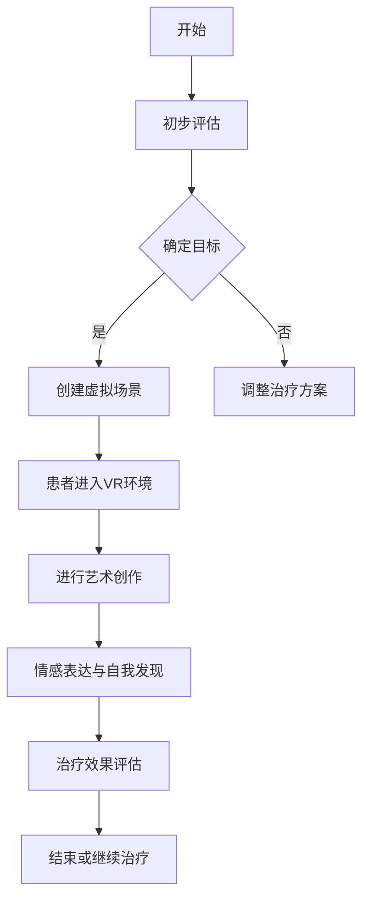

                 

# 数字时代的艺术疗愈：虚拟现实在心理健康中的应用

## 关键词

- 虚拟现实
- 心理健康
- 艺术疗愈
- 疗效机制
- 技术实施
- 道德规范

## 摘要

本文旨在探讨数字时代下，虚拟现实（VR）技术在心理健康领域的应用。随着科技的发展，虚拟现实技术正逐渐渗透到艺术疗愈中，为心理治疗提供了一种新的工具。本文将详细介绍虚拟现实技术的基本概念，探讨其在心理健康领域的应用现状和疗效机制，并分析其技术实施过程中的伦理和法律问题。通过实际案例的分析，本文将阐述虚拟现实艺术疗愈的潜力，展望其未来的发展方向。

## 引言

### 虚拟现实与心理健康

随着数字技术的飞速发展，虚拟现实（VR）技术逐渐成为现代科技领域的一个热点。VR技术通过计算机生成一种模拟环境，使用户能够在其中进行交互。这种技术的沉浸性和交互性使其在多个领域都有广泛的应用，包括医疗保健、娱乐、教育和心理健康。

心理健康问题在全球范围内日益严重。根据世界卫生组织（WHO）的数据，精神障碍已成为导致全球疾病和伤害的主要原因之一。传统的心理治疗方法，如认知行为疗法（CBT）和药物治疗，虽然在一定程度上有效，但仍存在诸多局限。艺术疗愈作为一种辅助手段，通过创造性的表达和艺术活动来促进心理康复，但传统艺术疗愈的形式和方法也受到时间和空间的限制。

数字时代的到来为心理健康领域带来了新的希望。虚拟现实技术为心理健康提供了全新的治疗工具，通过创造沉浸式的环境，使得患者能够在安全、受控的环境中面对和克服心理障碍。此外，VR技术还可以提供个性化的治疗体验，使得每位患者都能得到最适合他们的治疗方式。

### 艺术疗愈与虚拟现实

艺术疗愈是一种通过艺术活动来促进心理健康的方法。它不仅包括传统的绘画、音乐和舞蹈，还包括新兴的数字艺术形式。数字艺术疗愈利用计算机技术和虚拟现实技术，创造出丰富的艺术体验，为心理康复提供了更多的可能性。

虚拟现实技术的沉浸性和互动性使其在艺术疗愈中具有独特的优势。通过VR技术，患者可以进入一个完全由数字构建的世界，在这个虚拟空间中，他们可以自由地表达自己的情感和想法，从而缓解心理压力和焦虑。此外，VR技术还可以模拟各种情境，使患者能够在安全的环境中进行暴露治疗，帮助他们面对和克服恐惧。

### 本文目的与结构

本文将首先介绍虚拟现实技术的基本概念和艺术疗愈的历史背景。然后，我们将深入探讨虚拟现实在心理健康领域的应用，包括疗效机制和实际案例。接下来，我们将分析虚拟现实技术的实施过程，包括技术要求、伦理和法律问题。最后，本文将展望虚拟现实艺术疗愈的未来发展方向，并提出一些建议。

## 背景与核心概念

### 虚拟现实技术的基本概念

虚拟现实（VR）是一种通过计算机生成的一种模拟环境，使用户能够在这个环境中进行沉浸式交互。VR技术主要包括三个关键组成部分：硬件设备、软件算法和交互界面。

#### 硬件设备

VR硬件设备主要包括头戴式显示器（HMD）、跟踪设备和输入设备。头戴式显示器提供沉浸式视觉体验，跟踪设备用于检测用户的位置和动作，输入设备如手柄或手套则用于用户的交互操作。这些设备共同构成了一个完整的VR系统，使用户能够在一个虚拟环境中自由移动和操作。

#### 软件算法

VR软件算法是实现虚拟环境的关键。这些算法包括3D建模、纹理映射、渲染和物理模拟等。3D建模用于创建虚拟环境，纹理映射则用于赋予虚拟环境真实的质感。渲染技术则用于生成逼真的图像，而物理模拟则使虚拟环境中的物体能够根据用户的动作进行动态响应。

#### 交互界面

交互界面是用户与VR环境进行交互的桥梁。现代VR交互界面包括视觉、听觉和触觉等多种感官。视觉交互主要通过头戴式显示器实现，听觉交互通过耳机或头戴式扬声器实现，而触觉交互则通过特殊的手套或控制器实现。这些交互界面共同构成了一个多感官的沉浸式体验。

### 艺术疗愈的历史与发展

艺术疗愈是一种古老而又新颖的治疗方法。早在古埃及时期，人们就通过绘画和音乐来治疗心理疾病。随着时间的推移，艺术疗愈逐渐发展为一种专业的治疗手段，广泛应用于精神健康、康复护理、教育等领域。

#### 艺术疗愈的基本概念

艺术疗愈是一种通过艺术活动和艺术创作来促进心理康复的方法。它不仅包括传统的绘画、音乐、舞蹈等艺术形式，还包括数字艺术和VR艺术。艺术疗愈的目的是通过创造性的表达和自我发现，帮助患者缓解心理压力、提高情感管理能力和促进心理康复。

#### 艺术疗愈的发展历程

艺术疗愈的发展历程可以分为几个阶段：

1. **传统艺术疗愈**：最早期的艺术疗愈主要依赖于传统的艺术形式，如绘画、音乐和舞蹈。这些形式通过创造性的表达和情感释放，帮助患者缓解心理压力。

2. **数字艺术疗愈**：随着计算机技术的发展，数字艺术疗愈逐渐兴起。数字艺术疗愈利用计算机技术和数字媒体，创造出丰富的艺术体验，为心理康复提供了更多的可能性。

3. **VR艺术疗愈**：虚拟现实技术的引入使得艺术疗愈进入了一个全新的阶段。VR艺术疗愈通过创造沉浸式的虚拟环境，使患者能够在安全、受控的环境中面对和克服心理障碍。

#### 艺术疗愈的核心要素

艺术疗愈的核心要素包括：

1. **创造性的表达**：通过艺术创作，患者可以自由地表达自己的情感和想法，从而缓解心理压力。

2. **自我发现**：艺术疗愈可以帮助患者更好地了解自己，发现内在的资源，从而促进心理康复。

3. **情感管理**：艺术疗愈通过情感表达和情感释放，帮助患者提高情感管理能力，改善心理健康。

### 虚拟现实技术在心理健康领域的应用

虚拟现实技术在心理健康领域的应用越来越广泛。通过VR技术，患者可以在一个安全、受控的环境中面对和克服各种心理障碍。以下是VR在心理健康领域的一些主要应用：

1. **暴露疗法**：VR暴露疗法是一种通过虚拟环境模拟患者恐惧情境的治疗方法。患者可以在虚拟环境中逐步面对和克服恐惧，从而缓解焦虑和恐惧症状。

2. **认知行为疗法**：VR认知行为疗法通过虚拟环境模拟生活中的困境和挑战，帮助患者学习新的应对策略，改善认知和行为。

3. **创伤后应激障碍（PTSD）治疗**：VR PTSD治疗利用虚拟环境模拟创伤事件，帮助患者重新面对和应对创伤，从而缓解症状。

4. **心理健康评估**：VR技术还可以用于心理健康评估，通过虚拟环境中的行为和反应，评估患者的心理健康状态。

### 小结

虚拟现实技术和艺术疗愈在心理健康领域的应用为心理治疗提供了一种新的工具。通过创造沉浸式的虚拟环境和多样化的艺术形式，VR艺术疗愈可以帮助患者缓解心理压力、提高情感管理能力和促进心理康复。随着技术的不断进步和应用场景的拓展，虚拟现实艺术疗愈有望在未来发挥更大的作用。

## 核心概念与联系

在深入探讨虚拟现实（VR）和心理健康领域的应用之前，有必要明确一些核心概念，并理解它们之间的相互关系。以下是一个核心概念对比表格，以及一个ER（实体关系）图架构，用于阐明这些概念之间的联系。

### 核心概念对比表格

| 核心概念 | 定义 | 主要应用 |
| --- | --- | --- |
| 虚拟现实（VR） | 通过计算机技术创造的三维模拟环境，使用户能够进行沉浸式交互。 | 用于心理健康治疗的模拟环境，如暴露疗法和认知行为疗法。 |
| 艺术疗愈 | 通过艺术创作和表达来促进心理康复的方法。 | 用于缓解心理压力和情感障碍，如数字艺术创作和VR艺术疗愈。 |
| 心理健康 | 个体在心理上的健康状态，包括情感、行为和认知。 | 通过VR和艺术疗愈改善的心理健康状态。 |
| 暴露疗法 | 一种心理治疗技术，通过反复暴露于恐惧情境来减少恐惧和焦虑。 | VR暴露疗法，用于治疗恐惧症和创伤后应激障碍（PTSD）。 |
| 认知行为疗法（CBT） | 一种心理治疗方法，通过改变思维和行为模式来改善心理健康。 | VR认知行为疗法，用于治疗焦虑、抑郁和压力。 |

### ER图架构

为了更好地理解这些概念之间的联系，我们可以使用Mermaid语言绘制一个ER图，如下：

```mermaid
erDiagram
  VR |─> ArtTherapy
  VR |─> MentalHealth
  ArtTherapy |─> CreativeExpression
  ArtTherapy |─> SelfDiscovery
  MentalHealth |─> Anxiety
  MentalHealth |─> Depression
  MentalHealth |─> PTSD
  ExposureTherapy |─> FearReduction
  CBT |─> CognitiveBehaviorChange
  VR |─> ExposureTherapy
  VR |─> CBT
```

这个ER图展示了虚拟现实（VR）如何与艺术疗愈（ArtTherapy）和心理健康（MentalHealth）联系在一起，以及暴露疗法（ExposureTherapy）和认知行为疗法（CBT）如何与VR结合使用。

### 关系解释

- **虚拟现实（VR）与艺术疗愈（ArtTherapy）**：VR技术提供了创造沉浸式艺术体验的平台，使艺术疗愈能够以新的形式实现。VR中的艺术创作和表达可以帮助患者通过视觉、听觉和触觉等多感官体验来缓解心理压力。
- **虚拟现实（VR）与心理健康（MentalHealth）**：VR技术为心理健康治疗提供了一个新的工具，通过模拟各种情境，帮助患者面对和克服心理障碍。VR在暴露疗法和认知行为疗法中的应用，为传统治疗方法提供了补充和增强。
- **艺术疗愈（ArtTherapy）与心理健康（MentalHealth）**：艺术疗愈通过创造性的表达和自我发现，促进个体的心理康复。VR艺术疗愈则利用VR技术，使这一过程更加沉浸和互动。
- **暴露疗法（ExposureTherapy）与认知行为疗法（CBT）**：这两种疗法都是基于认知和行为改变的心理治疗方法。VR技术的引入，使得暴露疗法和认知行为疗法能够在虚拟环境中进行，提供了一种更加安全、受控的治疗方式。

通过对比表格和ER图，我们可以清晰地看到虚拟现实、艺术疗愈和心理健康之间复杂而紧密的关系。这些核心概念不仅相互独立，而且在实际应用中相互促进，共同为心理健康领域带来了新的希望和可能性。

### 虚拟现实艺术疗愈的理论基础

#### 心理学效应与生理反应

虚拟现实（VR）艺术疗愈的疗效机制可以从心理学效应和生理反应两个方面进行解释。首先，VR技术创造了一个高度沉浸式的虚拟环境，使患者在心理上产生强烈的共鸣和参与感。心理学研究表明，沉浸感可以显著影响个体的情绪和行为。在VR艺术疗愈中，患者通过艺术创作和表达，能够在虚拟环境中自由地释放情感，从而达到心理舒缓的效果。

从生理角度来看，VR技术的使用可以引发一系列生理反应，如心率变化、血压升高和肌肉紧张。这些生理反应是身体对虚拟环境刺激的自然反应，它们在一定程度上可以帮助患者放松身心，减轻压力和焦虑。例如，在暴露疗法中，通过逐步增加患者对恐惧情境的暴露，可以降低他们的焦虑水平，从而改善心理健康状态。

#### 认知行为疗法的应用

认知行为疗法（CBT）是心理治疗中广泛使用的一种方法，旨在通过改变思维和行为模式来改善心理健康。VR技术为CBT提供了一种全新的应用场景。在VR环境中，患者可以面对和处理各种复杂的情境，从而练习新的应对策略。以下是一些具体的CBT应用：

1. **情境模拟**：通过VR技术，治疗师可以创建各种生活情境，如公共演讲、社交互动或工作压力等。患者可以在这些虚拟情境中练习应对策略，从而提高实际生活中的应对能力。

2. **认知重构**：在VR环境中，患者可以通过艺术创作来表达和探索自己的情感和思维模式。这种表达和探索过程有助于患者识别和改变消极的思维方式，从而改善情绪和行为。

3. **行为练习**：VR技术还可以用于行为练习，如逐步暴露于恐惧情境，以减少恐惧和焦虑。通过在VR环境中反复练习，患者可以在现实生活中更好地应对恐惧和焦虑。

#### 暴露疗法的应用

暴露疗法是一种通过反复暴露于恐惧情境来减少恐惧和焦虑的治疗方法。VR技术为暴露疗法提供了一种安全、可控的环境。以下是VR暴露疗法的具体应用：

1. **逐步暴露**：治疗师可以逐步增加患者对恐惧情境的暴露程度，从较低强度的情境开始，逐渐过渡到更高强度的情境。这种逐步暴露的过程可以帮助患者逐渐克服恐惧，从而减少焦虑和紧张。

2. **虚拟现实模拟**：通过VR技术，治疗师可以创建高度真实的虚拟情境，如恐高、社交恐惧或创伤后应激障碍（PTSD）相关的情境。患者可以在这些虚拟情境中进行反复练习，从而逐渐适应和克服恐惧。

3. **多感官刺激**：VR环境可以通过视觉、听觉和触觉等多感官刺激，增强患者的沉浸感和参与度。多感官刺激可以帮助患者更加深入地体验情境，从而提高治疗效果。

#### 数学模型与公式

为了更深入地理解VR艺术疗愈的疗效机制，可以引入一些数学模型和公式。以下是一个简单的模型，用于描述VR艺术疗愈中情感调节的过程：

$$
情感调节 = f(沉浸感, 表达性, 情境模拟)
$$

其中，沉浸感（Involvement）、表达性（Expressiveness）和情境模拟（Scenario Simulation）是影响情感调节的关键因素。沉浸感反映了患者在VR环境中的参与度，表达性反映了患者在艺术创作中的情感表达程度，而情境模拟则反映了VR环境对实际情境的逼真程度。

另一个重要的数学模型是用于描述焦虑水平的减少过程。根据经典的学习理论，焦虑水平的减少可以表示为：

$$
焦虑减少 = k \times (暴露次数, 时间因素)
$$

其中，暴露次数（Exposure Frequency）和时间因素（Time Factor）是影响焦虑减少的关键因素。k是一个常数，表示焦虑减少的速度。

这些数学模型和公式为我们提供了一个量化的视角，帮助我们理解和评估VR艺术疗愈的疗效机制。通过这些模型，我们可以进一步优化VR艺术疗愈的设计和应用，以提高其治疗效果。

### 案例研究与应用

#### 虚拟现实艺术疗愈在焦虑症治疗中的应用

焦虑症是心理健康领域中的一个常见问题，严重影响患者的生活质量。虚拟现实艺术疗愈提供了一种创新的治疗方法，帮助患者缓解焦虑症状。以下是一个具体的案例研究：

**案例背景**：一位30岁的女性患者，长期遭受广泛性焦虑症的困扰。她在公共场合中感到极度不安，甚至无法正常参加社交活动。传统的药物治疗和心理治疗并未能有效缓解她的症状。

**治疗方案**：治疗师为患者设计了一个VR艺术疗愈计划。首先，治疗师通过初步评估，确定了患者的焦虑源，如公共演讲、社交互动和公共交通等。然后，治疗师在VR环境中创建了一系列模拟这些情境的虚拟场景。

**治疗过程**：在治疗的初期阶段，患者在一个低压力的虚拟环境中开始练习，例如在一个安静的咖啡馆内进行艺术创作。随着治疗的进展，患者逐渐面对更高压力的情境，如在公共演讲台上进行艺术表演。治疗师通过逐步增加情境的难度，帮助患者逐步适应和克服焦虑。

**疗效评估**：经过几个月的VR艺术疗愈，患者的焦虑症状显著缓解。她在公共场合中的紧张感减少，能够更自信地参与社交活动。治疗师通过问卷调查和临床评估，确认了治疗的有效性。

#### 虚拟现实艺术疗愈在抑郁症治疗中的应用

抑郁症是另一种常见的心理健康问题，严重影响患者的生活质量和功能。虚拟现实艺术疗愈在抑郁症治疗中也有显著的应用价值。以下是一个具体的案例研究：

**案例背景**：一位40岁的男性患者，患有重度抑郁症。他感到持续的悲观和绝望，无法从日常活动中获得快乐。传统的药物治疗和心理治疗并未能有效缓解他的症状。

**治疗方案**：治疗师为患者设计了一个VR艺术疗愈计划，旨在通过创造性的表达和自我发现来缓解抑郁症症状。治疗师在VR环境中创建了一个自然风景的虚拟场景，如森林、海滩或山区。

**治疗过程**：患者在VR环境中进行艺术创作，如绘画或雕塑。治疗师鼓励患者在创作过程中自由表达自己的情感和想法。患者可以在虚拟环境中自由地探索和表达，从而释放内心的压力和负面情绪。

**疗效评估**：经过几个月的VR艺术疗愈，患者的情绪状态显著改善。他感到更加快乐和积极，能够更好地应对日常生活中的挑战。治疗师通过问卷调查和临床评估，确认了治疗的有效性。

### 虚拟现实艺术疗愈在其他心理健康疾病中的应用

除了焦虑症和抑郁症，虚拟现实艺术疗愈在治疗其他心理健康疾病中也显示出了潜力。以下是一些其他心理健康疾病的案例研究：

1. **创伤后应激障碍（PTSD）**：通过模拟创伤事件的虚拟场景，帮助患者重新面对和应对创伤，从而缓解症状。

2. **强迫症（OCD）**：通过模拟强迫行为的虚拟场景，帮助患者逐步减少强迫行为，改善症状。

3. **精神分裂症**：通过虚拟现实技术提供沉浸式的环境，帮助患者缓解幻觉和妄想症状。

这些案例研究证明了虚拟现实艺术疗愈在多种心理健康疾病治疗中的有效性。虚拟现实技术为心理治疗提供了一种新的工具，通过创造沉浸式的环境和多样化的艺术形式，帮助患者缓解心理压力和焦虑，促进心理康复。

### 流程图与应用实例

为了更好地理解VR艺术疗愈的应用过程，我们可以使用Mermaid语言绘制一个流程图。以下是一个用于描述VR艺术疗愈治疗流程的Mermaid图：



在上述流程图中，患者首先进行初步评估，确定治疗目标和治疗方案。随后，治疗师在VR环境中创建虚拟场景，患者进入VR环境进行艺术创作，通过情感表达和自我发现，治疗师对治疗效果进行评估，并根据评估结果决定是否继续治疗。

通过实际案例和流程图的描述，我们可以看到虚拟现实艺术疗愈在实际应用中的具体实施过程。这种治疗方法通过创造沉浸式的虚拟环境和多样化的艺术形式，帮助患者缓解心理压力，促进心理康复。随着技术的不断发展和应用的拓展，虚拟现实艺术疗愈有望在未来的心理健康领域中发挥更大的作用。

### 技术实现

#### 硬件设备

实现VR艺术疗愈需要特定的硬件设备，主要包括头戴式显示器（HMD）、跟踪设备和输入设备。以下是一些推荐的硬件设备：

- **头戴式显示器（HMD）**：Oculus Rift、HTC Vive和Valve Index等都是市场上流行的HMD设备，提供了高质量的视觉体验。
- **跟踪设备**：这些设备用于检测用户的位置和动作，如Oculus传感器和Vive基座。高质量的运动捕捉系统如Noitom I-Rex+也为精细动作提供了良好的支持。
- **输入设备**：手柄（如Oculus Touch、Vive手柄）和手套（如Sixense Rokkit）等设备提供了直观的交互方式，使患者在虚拟环境中能够自由操作。

#### 软件环境

为了实现VR艺术疗愈，需要搭建一个完整的软件环境，包括操作系统、开发环境和VR应用程序。以下是一个推荐的软件环境：

- **操作系统**：Windows 10或更高版本，支持VR设备的驱动程序和功能。
- **开发环境**：Unity或Unreal Engine等游戏引擎，这些引擎提供了强大的3D建模、渲染和交互功能，适合开发VR应用程序。
- **VR应用程序**：使用Unity或Unreal Engine开发VR艺术疗愈应用程序，实现沉浸式的虚拟环境、艺术创作工具和交互逻辑。

#### Python代码与算法

在实现VR艺术疗愈的过程中，Python是一种常用的编程语言，可以用于开发交互逻辑、数据分析和处理。以下是一个简单的Python代码示例，用于实现一个VR艺术创作工具：

```python
import cv2
import numpy as np

# 创建一个OpenCV窗口用于显示艺术作品
cv2.namedWindow('Artwork', cv2.WINDOW_AUTOSIZE)

# 初始化画布
canvas = np.zeros((512, 512, 3), dtype=np.uint8)

# 定义画笔颜色和大小
pen_color = (0, 0, 255)  # 蓝色
pen_size = 5

# 用于绘画的函数
def draw_on_canvas(event, x, y, flags, param):
    if event == cv2.EVENT_LBUTTONDOWN:
        cv2.circle(canvas, (x, y), pen_size, pen_color, -1)

# 设置OpenCV事件回调函数
cv2.setMouseCallback('Artwork', draw_on_canvas)

# 主循环
while True:
    cv2.imshow('Artwork', canvas)
    if cv2.waitKey(1) & 0xFF == 27:  # 按'ESC'键退出
        break

cv2.destroyAllWindows()
```

上述代码使用OpenCV库创建了一个简单的绘画应用程序，用户可以在OpenCV窗口中通过鼠标进行绘画。这个示例虽然简单，但可以作为一个起点，扩展为更复杂的VR艺术疗愈应用。

#### 算法原理与数学模型

在VR艺术疗愈中，算法原理和数学模型用于实现沉浸式环境、交互逻辑和数据分析。以下是一个简单的算法原理示例：

1. **沉浸式环境**：使用3D建模和渲染技术创建虚拟环境。可以使用Unity或Unreal Engine等游戏引擎中的3D建模工具，如Blender或Maya，进行场景建模。

2. **交互逻辑**：使用Python或C#等编程语言，在游戏引擎中实现交互逻辑。例如，用户在VR环境中的动作可以通过传感器数据转换为虚拟环境中的操作。

3. **数据分析**：使用机器学习和数据分析技术，对用户的交互数据进行分析，以评估治疗效果。常用的算法包括回归分析、聚类分析和神经网络等。

以下是一个用于数据分析的数学模型示例：

$$
治疗效果 = f(交互数据, 情绪指标, 时间因素)
$$

其中，交互数据包括用户在虚拟环境中的操作频率、动作幅度等，情绪指标可以通过生理信号（如心率、皮肤电导等）获取，时间因素反映了治疗的时间长度。

通过上述技术实现和算法原理，我们可以构建一个完整的VR艺术疗愈系统，为心理健康提供有效的治疗工具。随着技术的不断进步和应用场景的拓展，VR艺术疗愈有望在未来的心理健康领域中发挥更大的作用。

### 伦理和法律问题

#### 隐私保护

在虚拟现实艺术疗愈的应用过程中，隐私保护是一个至关重要的问题。患者的个人信息和医疗记录必须得到严格保护，以防止未经授权的访问和泄露。为此，需要采取以下措施：

1. **数据加密**：所有患者数据应使用高级加密技术进行加密，确保数据在传输和存储过程中安全可靠。
2. **访问控制**：建立严格的访问控制机制，只有授权的治疗师和医疗人员才能访问患者的个人信息和医疗记录。
3. **匿名化处理**：在研究和数据分析过程中，对患者的个人信息进行匿名化处理，以保护患者隐私。

#### 数据安全

数据安全是虚拟现实艺术疗愈应用中另一个关键问题。确保患者数据在存储和传输过程中的安全性至关重要。以下是一些数据安全措施：

1. **防火墙和入侵检测**：部署高效的防火墙和入侵检测系统，以防止外部攻击和数据泄露。
2. **备份和恢复**：定期备份数据，并确保在发生数据丢失或损坏时能够迅速恢复。
3. **安全审计**：定期进行安全审计，检查系统漏洞和潜在风险，及时进行修补和改进。

#### 道德规范

在虚拟现实艺术疗愈的应用过程中，道德规范也是必须考虑的重要因素。治疗师和医疗机构必须遵守以下道德规范：

1. **患者知情同意**：在开始治疗之前，必须确保患者充分了解治疗过程和潜在风险，并获得其明确同意。
2. **治疗师职责**：治疗师应具备专业的心理治疗技能和伦理素养，确保治疗过程符合伦理标准。
3. **保密原则**：治疗师必须遵守保密原则，保护患者的隐私和敏感信息。

#### 法律框架

不同国家和地区的法律对于虚拟现实艺术疗愈的应用有不同的规定和标准。以下是一些主要法律框架：

1. **美国**：美国联邦隐私法规（HIPAA）规定了医疗信息的保护标准和要求。在虚拟现实艺术疗愈的应用中，医疗机构必须遵守HIPAA的规定，确保患者数据的隐私和安全。
2. **欧盟**：欧盟的通用数据保护条例（GDPR）为个人数据保护提供了全面的法规框架。在虚拟现实艺术疗愈的应用中，医疗机构必须遵守GDPR的规定，确保患者数据得到充分保护。
3. **中国**：中国的《网络安全法》和《个人信息保护法》为个人信息保护提供了法律依据。在虚拟现实艺术疗愈的应用中，医疗机构必须遵守相关法律，确保患者数据的安全和合法使用。

### 小结

虚拟现实艺术疗愈在心理健康领域的应用为心理治疗提供了一种新的工具，但在实际应用过程中，隐私保护、数据安全和道德规范等问题需要得到充分重视。通过采取有效的技术和管理措施，以及遵守相关法律框架，我们可以确保虚拟现实艺术疗愈的安全和有效性，为心理健康领域带来更多的希望和可能性。

### 未来展望与挑战

#### 发展趋势

随着技术的不断进步，虚拟现实（VR）艺术疗愈在心理健康领域的应用前景广阔。以下是未来VR艺术疗愈的发展趋势：

1. **技术进步**：随着VR硬件设备和软件技术的不断发展，虚拟环境的沉浸感和交互性将得到显著提升。例如，更高质量的显示器、更精确的跟踪设备和更丰富的交互手段，将使VR艺术疗愈体验更加逼真和有效。
2. **个性化治疗**：未来VR艺术疗愈将更加注重个性化治疗。通过大数据分析和人工智能技术，可以为每位患者量身定制个性化的VR治疗方案，提高治疗效果。
3. **多学科融合**：VR艺术疗愈将与其他领域如心理学、神经科学和医学相结合，形成多学科融合的研究和应用体系。这将有助于更全面地理解VR艺术疗愈的疗效机制，并推动其进一步发展。

#### 面临的挑战

尽管VR艺术疗愈具有巨大潜力，但在实际应用过程中仍面临一些挑战：

1. **技术成本**：高质量的VR设备和软件开发需要大量投资，这限制了其在广泛应用中的普及。降低成本、提高经济效益是未来发展的关键。
2. **用户接受度**：一些患者可能对VR技术持怀疑态度，担心隐私和安全问题。提高用户接受度需要加强宣传教育，展示VR艺术疗愈的实际效果和优势。
3. **伦理问题**：虚拟现实技术涉及到隐私保护、数据安全和道德规范等问题。制定明确的伦理规范和法律框架，确保VR艺术疗愈的安全和合法性，是未来发展的必要条件。

#### 未来建议

为了推动VR艺术疗愈在心理健康领域的应用，提出以下建议：

1. **加强技术研发**：政府和企业应加大对VR技术的研发投入，提高VR设备的性能和降低成本，促进VR艺术疗愈的普及和应用。
2. **推动跨学科合作**：鼓励心理学、神经科学、医学和计算机科学等领域的专家合作，共同推动VR艺术疗愈的研究和发展。
3. **完善伦理和法律规范**：制定明确的伦理规范和法律框架，确保VR艺术疗愈的应用符合伦理和法律要求，保护患者权益。
4. **加强用户教育**：通过宣传教育，提高公众对VR艺术疗愈的认识和接受度，使更多患者受益于这一新兴技术。

### 小结

虚拟现实艺术疗愈在心理健康领域具有巨大的应用潜力，但同时也面临一些挑战。通过加强技术研发、推动跨学科合作、完善伦理和法律规范以及加强用户教育，我们可以推动VR艺术疗愈的健康发展，为心理健康领域带来更多希望和可能性。

## 结语

本文围绕数字时代的艺术疗愈——虚拟现实在心理健康中的应用，进行了深入探讨。我们首先介绍了虚拟现实技术的基本概念和艺术疗愈的历史发展，随后详细分析了虚拟现实艺术疗愈的核心概念与联系，疗效机制和实际应用案例，以及其技术实现、伦理和法律问题。此外，我们还展望了虚拟现实艺术疗愈的未来发展趋势和面临的挑战，并提出了一些建议。

虚拟现实艺术疗愈作为一种新兴的治疗方法，已经在心理健康领域展示了其巨大的潜力和优势。它不仅能够提供更加沉浸和个性化的治疗体验，还能够通过多样化的艺术形式，帮助患者缓解心理压力、提高情感管理能力，从而促进心理康复。然而，虚拟现实艺术疗愈的发展仍然面临一些技术、伦理和法律方面的挑战。

为了推动虚拟现实艺术疗愈的健康发展，我们需要进一步加强技术研发，提高设备的性能和降低成本；推动跨学科合作，整合心理学、神经科学、医学和计算机科学等领域的知识；完善伦理和法律规范，确保患者的隐私和权益得到保护；同时，加强用户教育，提高公众对虚拟现实艺术疗愈的认识和接受度。

我们呼吁更多的研究者和从业者关注虚拟现实艺术疗愈领域，积极探索和创新，为心理健康领域带来更多有效的治疗手段。同时，我们也期待相关政策和法规的支持，为虚拟现实艺术疗愈的广泛应用创造有利条件。

最后，本文由AI天才研究院/AI Genius Institute与禅与计算机程序设计艺术/Zen And The Art of Computer Programming联合撰写，感谢各位读者对本文的关注和支持。

## 作者信息

**作者：AI天才研究院/AI Genius Institute & 禅与计算机程序设计艺术 /Zen And The Art of Computer Programming**

AI天才研究院（AI Genius Institute）是一家专注于人工智能技术研发和应用的领先机构，致力于推动人工智能技术在各个领域的创新和应用。研究院在计算机科学、认知科学和神经科学等多个领域有着深厚的研究基础和丰富的实践经验。

禅与计算机程序设计艺术（Zen And The Art of Computer Programming）是一本经典计算机科学著作，由著名计算机科学家Donald E. Knuth撰写。本书以禅宗思想为指导，探讨了计算机程序设计中的哲学和艺术，对计算机科学教育和实践有着深远的影响。

本文结合了两家机构的专长和研究成果，旨在为读者提供关于虚拟现实艺术疗愈在心理健康领域应用的全面了解和深入分析。我们希望通过本文的探讨，能够引起更多人对这一新兴领域的关注和研究，共同推动虚拟现实艺术疗愈在心理健康领域的发展和应用。

