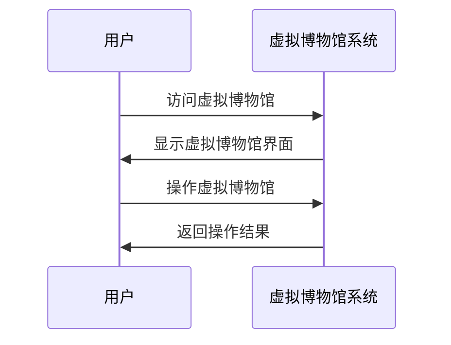

                 

### 数字时代的虚拟博物馆：VR技术下的全球艺术之旅

> 关键词：虚拟现实（VR）、艺术博物馆、全球艺术之旅、数字化体验、艺术教育

> 摘要：随着虚拟现实（VR）技术的迅猛发展，虚拟博物馆应运而生，为全球艺术爱好者提供了一种全新的艺术体验方式。本文将从背景介绍、核心概念与联系、应用场景、案例分析与未来展望等多个方面，详细探讨VR技术在虚拟博物馆中的应用，以及其在艺术领域的深远影响。

## 目录大纲

1. **背景介绍**
   - 1.1 问题的背景
   - 1.2 问题描述
   - 1.3 问题解决
   - 1.4 边界与外延
   - 1.5 概念结构与核心要素组成

2. **核心概念与联系**
   - 2.1 VR技术原理
   - 2.2 虚拟博物馆的概念
   - 2.3 VR技术在艺术领域的应用

3. **VR技术在虚拟博物馆中的应用**
   - 3.1 VR技术在虚拟博物馆中的应用场景
   - 3.2 虚拟博物馆的构建
   - 3.3 VR技术在艺术市场中的应用

4. **案例分析与未来展望**
   - 4.1 典型虚拟博物馆案例分析
   - 4.2 虚拟博物馆的发展趋势
   - 4.3 虚拟博物馆的未来展望

5. **总结与展望**
   - 5.1 总结
   - 5.2 展望

### 第一部分：背景介绍

#### 1.1 问题的背景

随着科技的不断进步，虚拟现实（VR）技术逐渐渗透到各行各业。在艺术领域，虚拟博物馆作为一种新兴的展示形式，不仅能够突破实体空间的限制，还能为观众提供沉浸式的艺术体验。这一变化不仅满足了艺术爱好者对高质量艺术品的追求，也为全球艺术市场的数字化发展提供了新的机遇。

##### 虚拟现实（VR）技术的快速发展

VR技术的发展可以追溯到20世纪60年代，但直到最近几年，随着硬件性能的提升和5G网络的普及，VR技术才真正开始走入大众视野。VR设备如VR头盔、手柄等逐渐普及，使得虚拟博物馆的构建成为可能。此外，VR技术的进步也带来了更逼真的三维建模和渲染效果，使得虚拟博物馆中的艺术品展示更加生动。

##### 艺术与科技融合的需求

在数字化时代，传统博物馆的展示方式已无法满足人们日益增长的艺术需求。虚拟博物馆的出现，不仅能够突破地理和时间的限制，还能够通过互动体验增强观众的参与感和体验感。这种艺术与科技融合的需求，为虚拟博物馆的发展提供了强大的动力。

##### 全球艺术市场的数字化趋势

随着互联网的普及和数字化的推进，全球艺术市场正在经历一场深刻的变革。越来越多的艺术品通过数字化方式呈现，不仅拓宽了艺术品的传播渠道，也提高了艺术品的市场流通效率。虚拟博物馆作为一种全新的艺术展示形式，正在成为全球艺术市场数字化发展的重要方向。

#### 1.2 问题描述

虚拟博物馆作为一种新兴的艺术展示形式，虽然具有诸多优势，但也面临着一系列挑战。

##### 虚拟博物馆的概念及其在数字时代的重要性

虚拟博物馆，是指利用虚拟现实技术创建的，能够在计算机或VR设备上展示艺术品、文化遗产等内容的虚拟空间。与传统博物馆相比，虚拟博物馆具有更强的互动性和沉浸感，能够为观众提供更加丰富的艺术体验。

在数字时代，虚拟博物馆的重要性日益凸显。首先，虚拟博物馆能够突破实体空间的限制，使得全球观众都能够享受到世界各地的艺术珍品。其次，虚拟博物馆能够提供更加沉浸式的体验，使得观众在欣赏艺术品的同时，能够更加深入地了解艺术作品背后的文化内涵。此外，虚拟博物馆还能够降低艺术品的展示和维护成本，提高艺术品的展示效率。

##### 虚拟博物馆的技术挑战与机遇

虚拟博物馆的构建涉及到多个技术领域，包括虚拟现实技术、三维建模技术、网络技术、人机交互技术等。这些技术的进步为虚拟博物馆的发展提供了强有力的支持，但也带来了新的挑战。

技术挑战主要包括：

1. **高精度建模与渲染**：虚拟博物馆中的艺术品需要高精度的建模和渲染，以呈现出真实的效果。这需要强大的计算能力和精细的建模技术。
2. **网络传输与加载**：虚拟博物馆的内容需要通过网络传输到观众的设备上，这要求网络传输速度足够快，加载时间足够短。
3. **人机交互**：虚拟博物馆需要提供友好的人机交互界面，使得观众能够方便地浏览、互动和体验艺术品。

机遇主要包括：

1. **全球艺术之旅**：虚拟博物馆使得全球观众能够足不出户，就能游览世界各地的博物馆，体验不同的艺术文化。
2. **艺术市场拓展**：虚拟博物馆为艺术品市场提供了新的展示和销售渠道，有助于拓展全球艺术市场。
3. **艺术教育创新**：虚拟博物馆可以为艺术教育提供新的教学手段和资源，推动艺术教育的创新发展。

#### 1.3 问题解决

为了应对虚拟博物馆面临的挑战，需要从多个方面进行问题解决。

##### VR技术在虚拟博物馆中的应用实例

VR技术在虚拟博物馆中的应用主要体现在以下几个方面：

1. **高精度建模与渲染**：通过使用先进的扫描技术和三维建模软件，对实体艺术品进行高精度建模和渲染，使得虚拟博物馆中的艺术品能够呈现出真实的效果。
2. **沉浸式体验**：通过VR设备，观众能够身临其境地感受艺术品的魅力，增强互动性和沉浸感。
3. **虚拟展览**：虚拟博物馆可以通过网络平台，举办虚拟展览，吸引更多的观众参与。

##### 全球艺术之旅的数字化实现

全球艺术之旅的数字化实现主要依赖于以下几个技术：

1. **5G网络**：5G网络的高速传输能力，使得虚拟博物馆的内容能够迅速传输到观众设备上，提供流畅的观看体验。
2. **云计算**：云计算技术为虚拟博物馆提供了强大的计算能力，使得高精度建模和渲染等复杂任务能够高效完成。
3. **大数据**：通过大数据技术，虚拟博物馆能够收集和分析观众的观看行为，优化展览内容和交互体验。

#### 1.4 边界与外延

虚拟博物馆作为一种新兴的艺术展示形式，其应用范围不仅限于艺术领域，还涉及其他多个领域。

##### 虚拟博物馆与传统博物馆的比较

虚拟博物馆与传统博物馆在展示方式、互动性、受众范围等方面存在显著差异：

| 对比项 | 虚拟博物馆 | 传统博物馆 |
| :---: | :---: | :---: |
| 展示方式 | 虚拟空间 | 实体空间 |
| 互动性 | 高 | 较低 |
| 受众范围 | 全球 | 地理限制 |

##### VR技术在艺术教育、艺术体验等方面的应用

除了在艺术展示方面的应用，VR技术还在艺术教育和艺术体验方面发挥着重要作用：

1. **艺术教育**：虚拟博物馆为艺术教育提供了新的教学手段和资源，使得学生能够更加直观地了解艺术作品。
2. **艺术体验**：通过VR技术，观众能够身临其境地体验艺术作品的创作过程和背景，增强艺术体验感。

#### 1.5 概念结构与核心要素组成

虚拟博物馆的构建涉及多个技术领域的综合运用，其核心要素主要包括：

1. **虚拟现实（VR）技术**：虚拟现实技术是虚拟博物馆的核心，包括VR头盔、手柄等设备，以及相应的软件开发技术。
2. **3D建模与渲染**：3D建模与渲染技术用于创建虚拟博物馆中的艺术品和场景，确保其逼真效果。
3. **虚拟博物馆的设计与开发**：虚拟博物馆的设计与开发包括用户界面设计、交互设计、系统架构设计等多个方面，确保虚拟博物馆的易用性和稳定性。

### 第二部分：核心概念与联系

#### 2.1 VR技术原理

##### 2.1.1 VR技术的基本概念

虚拟现实（VR）是一种通过计算机技术生成三维虚拟环境，并利用特殊设备使人们能够沉浸其中的技术。VR技术主要包括以下几个方面：

1. **三维建模与渲染**：三维建模与渲染技术用于创建虚拟环境中的物体和场景，确保其逼真效果。
2. **传感器与追踪技术**：传感器与追踪技术用于捕捉用户的动作和位置，实现用户与虚拟环境的互动。
3. **显示技术**：显示技术用于将虚拟环境呈现在用户的视野中，通常采用高分辨率显示器或VR头盔。

##### 2.1.2 VR技术的核心特点

VR技术的核心特点包括：

1. **沉浸感**：通过三维建模与渲染技术，VR技术能够创造出逼真的虚拟环境，使用户产生沉浸感。
2. **交互性**：VR技术通过传感器与追踪技术，能够捕捉用户的动作和位置，实现用户与虚拟环境的互动。
3. **灵活性**：VR技术具有高度的灵活性，用户可以在虚拟环境中自由移动、交互和探索。

##### 2.1.3 VR技术的分类

VR技术根据应用场景和功能特点，可以分为以下几种类型：

1. **桌面VR**：桌面VR主要用于个人电脑或平板电脑上，通过VR头盔或显示器实现虚拟环境的沉浸体验。
2. **移动VR**：移动VR主要通过智能手机或移动设备实现，通常采用VR头盔或VR眼镜作为显示设备。
3. **全身VR**：全身VR通过全身追踪设备，实现用户在虚拟环境中的全身互动，提供更加真实的体验。

#### 2.2 虚拟博物馆的概念

##### 2.2.1 虚拟博物馆的定义

虚拟博物馆，是指利用虚拟现实（VR）技术创建的，能够在计算机或VR设备上展示艺术品、文化遗产等内容的虚拟空间。虚拟博物馆不仅能够突破实体空间的限制，还能为观众提供沉浸式的艺术体验。

##### 2.2.2 虚拟博物馆的构成要素

虚拟博物馆的构成要素主要包括：

1. **虚拟环境**：虚拟环境是虚拟博物馆的核心，包括虚拟场景、虚拟对象和虚拟人物等。
2. **交互界面**：交互界面用于用户与虚拟博物馆的互动，包括导航、搜索、互动等功能。
3. **内容管理**：内容管理用于管理虚拟博物馆中的艺术品、展览和活动等内容。

##### 2.2.3 虚拟博物馆与实体博物馆的关系

虚拟博物馆与实体博物馆之间存在密切的联系和互补关系：

1. **实体博物馆的延伸**：虚拟博物馆可以作为实体博物馆的延伸，为无法前往实体博物馆的观众提供观看和互动的机会。
2. **实体博物馆的补充**：虚拟博物馆可以通过虚拟展览、互动体验等方式，为实体博物馆提供更多的展示和互动方式，提高观众体验感。
3. **资源共享**：虚拟博物馆与实体博物馆可以共享艺术品、展览和活动等内容，提高资源利用效率。

#### 2.3 VR技术在艺术领域的应用

##### 2.3.1 艺术数字化

艺术数字化是指将实体艺术品以数字形式进行保存、展示和传播的过程。VR技术为艺术数字化提供了强大的支持，使得艺术品能够在虚拟环境中进行展示和互动。

##### 2.3.2 虚拟展览

虚拟展览是通过VR技术实现的在线展览，观众可以在虚拟环境中观看、互动和体验艺术品。虚拟展览不仅能够突破实体空间的限制，还能提供更加沉浸式的体验。

##### 2.3.3 虚拟互动体验

虚拟互动体验是通过VR技术实现的观众与艺术品之间的互动，包括虚拟导览、虚拟互动游戏等。虚拟互动体验能够增强观众的参与感和体验感，提高艺术展览的趣味性。

### 第三部分：VR技术在虚拟博物馆中的应用

#### 3.1 VR技术在虚拟博物馆中的应用场景

VR技术在虚拟博物馆中具有广泛的应用场景，主要包括以下几个方面：

##### 3.1.1 虚拟博物馆导览

虚拟博物馆导览是指利用VR技术为观众提供虚拟导览服务，观众可以在虚拟环境中自由浏览博物馆，了解展品信息。虚拟博物馆导览具有以下优点：

1. **无空间限制**：虚拟博物馆导览不受实体空间的限制，观众可以在任何地点和时间观看博物馆的展览。
2. **个性化服务**：虚拟博物馆导览可以根据观众的兴趣和需求，提供个性化的导览服务。
3. **安全性高**：虚拟博物馆导览减少了观众在实体博物馆中的人流量，降低了安全风险。

##### 3.1.2 艺术品展示与互动

艺术品展示与互动是指利用VR技术展示艺术品，并提供与艺术品的互动体验。虚拟博物馆中的艺术品可以通过高精度建模和渲染技术，呈现逼真的效果。观众可以与艺术品进行互动，例如放大、旋转、触摸等。艺术品展示与互动具有以下优点：

1. **沉浸感强**：VR技术能够创造出沉浸式的虚拟环境，使观众感受到与实体艺术品相似的体验。
2. **互动性强**：观众可以通过与艺术品的互动，更加深入地了解艺术品的内涵和特点。
3. **教育资源丰富**：虚拟博物馆中的艺术品展示与互动，为艺术教育提供了丰富的教学资源。

##### 3.1.3 虚拟教育体验

虚拟教育体验是指利用VR技术为艺术教育提供虚拟教育环境，包括虚拟课堂、虚拟实习等。虚拟教育体验具有以下优点：

1. **教学资源丰富**：虚拟教育体验可以提供丰富的教学资源，包括虚拟艺术品、虚拟场景等，为学生提供直观的学习体验。
2. **教学互动性强**：虚拟教育体验可以通过虚拟互动，增强师生之间的互动和沟通，提高教学效果。
3. **教学成本低**：虚拟教育体验可以节省实体教学场所和设备成本，降低教学成本。

#### 3.2 虚拟博物馆的构建

虚拟博物馆的构建需要综合运用多种技术，主要包括以下几个方面：

##### 3.2.1 3D建模与扫描

3D建模与扫描是虚拟博物馆构建的基础，通过对实体艺术品进行高精度扫描和建模，生成虚拟艺术品的三维模型。3D建模与扫描技术具有以下优点：

1. **精度高**：3D建模与扫描技术可以生成高精度的三维模型，确保虚拟艺术品的逼真效果。
2. **效率高**：3D建模与扫描技术可以快速生成三维模型，提高构建虚拟博物馆的效率。
3. **成本低**：3D建模与扫描技术可以减少实体艺术品搬运和保存的成本。

##### 3.2.2 虚拟场景设计与渲染

虚拟场景设计与渲染是虚拟博物馆构建的核心，通过设计虚拟环境和渲染技术，呈现虚拟博物馆的整体效果。虚拟场景设计与渲染技术具有以下优点：

1. **视觉效果逼真**：虚拟场景设计与渲染技术可以生成逼真的虚拟环境，提高虚拟博物馆的视觉效果。
2. **交互性强**：虚拟场景设计与渲染技术可以提供丰富的交互功能，增强虚拟博物馆的体验感。
3. **可定制性强**：虚拟场景设计与渲染技术可以根据用户需求，定制虚拟博物馆的展示内容和交互方式。

##### 3.2.3 虚拟交互设计

虚拟交互设计是虚拟博物馆构建的关键，通过设计虚拟交互界面，实现用户与虚拟博物馆的互动。虚拟交互设计技术具有以下优点：

1. **用户体验好**：虚拟交互设计可以提供良好的用户体验，使观众能够方便地浏览、互动和体验虚拟博物馆。
2. **交互性强**：虚拟交互设计可以提供丰富的交互功能，增强虚拟博物馆的互动性。
3. **个性化服务**：虚拟交互设计可以根据用户需求，提供个性化的服务，提高虚拟博物馆的用户黏性。

#### 3.3 VR技术在艺术市场中的应用

VR技术在艺术市场中的应用，为艺术品交易、展览和拍卖等领域带来了新的机遇和挑战。

##### 3.3.1 虚拟艺术品交易

虚拟艺术品交易是指利用VR技术进行艺术品的在线交易，观众可以在虚拟环境中浏览、购买和交易艺术品。虚拟艺术品交易具有以下优点：

1. **便捷性**：虚拟艺术品交易不受地理位置限制，观众可以在全球范围内进行艺术品交易。
2. **安全性**：虚拟艺术品交易通过加密技术和身份验证，确保交易过程的安全和隐私。
3. **高效性**：虚拟艺术品交易可以快速完成交易过程，提高交易效率。

##### 3.3.2 虚拟艺术品展览与拍卖

虚拟艺术品展览与拍卖是指利用VR技术进行艺术品的在线展览和拍卖活动。虚拟艺术品展览与拍卖具有以下优点：

1. **沉浸感强**：虚拟艺术品展览与拍卖通过VR技术，可以创造出沉浸式的体验，提高观众的参与感。
2. **互动性强**：虚拟艺术品展览与拍卖可以提供丰富的互动功能，增强观众的互动体验。
3. **全球覆盖**：虚拟艺术品展览与拍卖可以覆盖全球观众，拓展艺术品市场。

##### 3.3.3 艺术品数字版权保护

艺术品数字版权保护是指利用VR技术对艺术品进行数字版权保护，防止艺术品的侵权和盗版。艺术品数字版权保护具有以下优点：

1. **精确性**：VR技术可以精确识别艺术品的数字特征，提高版权保护的准确性。
2. **高效性**：VR技术可以快速完成版权保护流程，提高版权保护效率。
3. **灵活性**：VR技术可以根据艺术品的不同形式和特点，灵活地进行版权保护。

### 第四部分：案例分析与未来展望

#### 4.1 典型虚拟博物馆案例分析

为了更好地了解VR技术在虚拟博物馆中的应用，我们可以通过以下典型虚拟博物馆案例分析：

##### 4.1.1 案例一：谷歌艺术与文化项目

谷歌艺术与文化项目是谷歌公司推出的一项虚拟博物馆项目，涵盖了全球多个博物馆和艺术机构的藏品。该项目利用VR技术，为用户提供了沉浸式的艺术体验。用户可以通过VR头盔或手机，浏览博物馆的展览和艺术品，了解艺术作品背后的故事。

##### 4.1.2 案例二：微软虚拟博物馆

微软虚拟博物馆是微软公司推出的一项虚拟博物馆项目，利用VR技术展示了多个博物馆和艺术馆的藏品。用户可以通过VR设备，身临其境地参观博物馆，与艺术品进行互动。该项目还提供了丰富的教育资源和互动体验，为用户提供了全面的艺术学习体验。

##### 4.1.3 案例三：VR艺术体验馆

VR艺术体验馆是一种基于VR技术的艺术体验空间，用户可以通过VR设备，体验虚拟艺术作品和艺术活动。VR艺术体验馆具有以下特点：

1. **互动性强**：用户可以通过VR设备，与虚拟艺术作品进行互动，增强艺术体验感。
2. **沉浸感强**：VR艺术体验馆通过VR技术，创造了沉浸式的艺术环境，提高了用户的参与感。
3. **教育性强**：VR艺术体验馆提供了丰富的教育资源，为用户提供了艺术学习的机会。

#### 4.2 虚拟博物馆的发展趋势

随着VR技术的不断进步，虚拟博物馆的发展趋势也在不断变化。以下是虚拟博物馆可能的发展趋势：

##### 4.2.1 虚拟现实技术的迭代

随着VR技术的不断迭代，虚拟博物馆的视觉效果和互动体验将得到显著提升。更高分辨率的显示技术、更精确的追踪技术、更强大的渲染技术等，将进一步提升虚拟博物馆的体验感。

##### 4.2.2 艺术与科技的深度融合

艺术与科技的深度融合将推动虚拟博物馆的创新发展。未来，虚拟博物馆将更加注重艺术与科技的结合，通过创新的技术手段，提供更加丰富和多样化的艺术体验。

##### 4.2.3 全球艺术市场的数字化变革

全球艺术市场的数字化变革将推动虚拟博物馆的发展。随着艺术品市场的不断壮大，虚拟博物馆将成为艺术品交易、展览和拍卖的重要渠道，为全球艺术爱好者提供更多的艺术体验和收藏机会。

#### 4.3 虚拟博物馆的未来展望

虚拟博物馆作为一种新兴的艺术展示形式，具有广阔的发展前景。以下是虚拟博物馆的未来展望：

##### 4.3.1 虚拟博物馆的可持续发展

虚拟博物馆的可持续发展是未来发展的重要方向。未来，虚拟博物馆将通过技术创新和商业模式创新，实现可持续发展，为全球艺术爱好者提供持续的艺术体验和服务。

##### 4.3.2 虚拟博物馆在教育领域的应用

虚拟博物馆在教育领域的应用将越来越广泛。未来，虚拟博物馆将成为艺术教育的重要平台，为教师和学生提供丰富的教学资源和互动体验，推动艺术教育的创新发展。

##### 4.3.3 虚拟博物馆的商业价值与挑战

虚拟博物馆的商业价值将逐渐凸显。未来，虚拟博物馆将成为艺术品交易、展览和拍卖的重要渠道，为艺术家、收藏家和艺术品市场带来新的商业机会。同时，虚拟博物馆也将面临技术挑战、商业模式挑战和政策法规挑战，需要不断创新和应对。

### 第五部分：总结与展望

#### 5.1 总结

虚拟博物馆作为一种新兴的艺术展示形式，通过VR技术为全球艺术爱好者提供了一种全新的艺术体验方式。虚拟博物馆不仅能够突破实体空间的限制，还能提供沉浸式的艺术体验，为艺术教育和艺术市场带来了新的机遇。在VR技术的不断进步和全球艺术市场的数字化变革推动下，虚拟博物馆的发展前景十分广阔。

#### 5.2 展望

未来，虚拟博物馆将在艺术领域发挥更加重要的作用。随着VR技术的不断迭代，虚拟博物馆的视觉效果和互动体验将得到显著提升。同时，虚拟博物馆也将更加注重艺术与科技的融合，提供更加丰富和多样化的艺术体验。在艺术教育和艺术市场的推动下，虚拟博物馆将成为艺术领域的重要创新力量，为全球艺术爱好者带来更多精彩的艺术体验。

### 参考文献

1. Google Arts & Culture. (n.d.). Retrieved from [https://artsandculture.google.com/](https://artsandculture.google.com/)
2. Microsoft Museum. (n.d.). Retrieved from [https://microsoft.com/en-us/museum](https://microsoft.com/en-us/museum)
3. VR Museum. (n.d.). Retrieved from [https://www.vrmuseum.com/](https://www.vrmuseum.com/)

### 附录：虚拟博物馆的技术架构与实现

#### 5.3 技术架构

虚拟博物馆的技术架构主要包括以下几个方面：

1. **前端展示层**：负责将虚拟博物馆的虚拟环境和艺术品展示给用户，主要包括3D渲染、用户交互等。
2. **中间业务层**：负责虚拟博物馆的核心功能，如艺术品管理、展览管理、用户管理等。
3. **后端数据层**：负责存储和管理虚拟博物馆的数据，如艺术品信息、用户信息、展览信息等。

#### 5.4 技术实现

以下是虚拟博物馆的关键技术实现：

1. **3D建模与渲染**：使用三维建模软件（如Blender）对艺术品进行建模，并使用Unity3D等引擎进行渲染，实现高质量的虚拟环境。
2. **虚拟交互**：使用Unity3D等引擎提供丰富的交互功能，如手势识别、语音交互等，增强用户互动体验。
3. **数据存储与查询**：使用MySQL等数据库存储和管理虚拟博物馆的数据，使用RESTful API提供数据的查询和操作接口。

### 附录：虚拟博物馆的实践案例与效果分析

#### 5.5 实践案例

以下是几个虚拟博物馆的实践案例：

1. **故宫博物院虚拟博物馆**：通过VR技术展示了故宫博物院的珍贵文物和历史文化，提供了沉浸式的观览体验。
2. **大英博物馆虚拟博物馆**：利用VR技术展示了大英博物馆的全球文物，使得观众能够在线上近距离欣赏世界各地的艺术品。
3. **谷歌艺术与文化项目**：通过VR技术展示了全球多个博物馆的藏品，为观众提供了丰富的艺术体验和学习资源。

#### 5.6 效果分析

虚拟博物馆在实践中取得了显著的效果：

1. **用户体验**：虚拟博物馆提供了沉浸式的艺术体验，使得观众能够更加深入地了解艺术品和历史文化，提升了用户体验。
2. **教育价值**：虚拟博物馆为艺术教育提供了丰富的教学资源，促进了艺术教育的创新发展。
3. **市场拓展**：虚拟博物馆为艺术品市场提供了新的展示和交易渠道，推动了全球艺术品市场的数字化发展。

### 附录：虚拟博物馆的技术挑战与解决方案

#### 5.7 技术挑战

虚拟博物馆在技术方面面临以下挑战：

1. **高精度建模与渲染**：虚拟博物馆中的艺术品需要高精度建模和渲染，这对计算资源和渲染技术提出了较高要求。
2. **网络传输与加载**：虚拟博物馆的内容需要通过网络传输到用户设备上，这要求网络传输速度足够快，加载时间足够短。
3. **人机交互**：虚拟博物馆需要提供友好的人机交互界面，确保用户能够方便地浏览、互动和体验艺术品。

#### 5.8 解决方案

针对上述挑战，以下是一些解决方案：

1. **高精度建模与渲染**：使用高性能计算机和先进的渲染技术，提高建模和渲染的精度和速度。
2. **网络传输与加载**：采用高效的数据压缩技术和CDN（内容分发网络），提高网络传输速度和加载效率。
3. **人机交互**：设计友好的用户界面和交互方式，使用户能够方便地操作和体验虚拟博物馆。

### 附录：虚拟博物馆的可持续发展与未来方向

#### 5.9 可持续发展

虚拟博物馆的可持续发展需要关注以下几个方面：

1. **技术更新与迭代**：随着技术的不断进步，虚拟博物馆需要不断更新和迭代，提高用户体验和艺术价值。
2. **内容丰富与多元化**：虚拟博物馆需要不断丰富和多元化内容，满足不同用户的需求，提高用户黏性。
3. **商业模式创新**：虚拟博物馆需要探索创新的商业模式，实现可持续发展，为用户提供高质量的艺术体验。

#### 5.10 未来方向

未来，虚拟博物馆将朝着以下方向发展：

1. **更高质量的艺术体验**：随着VR技术的不断进步，虚拟博物馆将提供更加逼真、沉浸式的艺术体验。
2. **更广泛的艺术普及**：虚拟博物馆将通过互联网和移动设备，将艺术普及到全球各地，让更多人能够享受到艺术之美。
3. **更深入的艺术教育**：虚拟博物馆将为艺术教育提供更丰富的教学资源和互动体验，推动艺术教育的创新发展。

### 附录：虚拟博物馆的最佳实践与注意事项

#### 5.11 最佳实践

在构建虚拟博物馆时，以下是一些最佳实践：

1. **高精度建模**：确保艺术品的建模精度，提高虚拟博物馆的视觉效果。
2. **个性化体验**：根据用户需求和兴趣，提供个性化的艺术体验，提高用户满意度。
3. **交互设计**：设计友好的交互界面，提高用户操作的便捷性和互动性。

#### 5.12 注意事项

在构建虚拟博物馆时，需要注意以下事项：

1. **网络安全**：确保虚拟博物馆的数据安全，防止数据泄露和侵权行为。
2. **技术更新**：定期更新虚拟博物馆的技术，保持与时代同步。
3. **内容合规**：确保虚拟博物馆的内容符合相关法律法规，避免违法行为。

### 附录：虚拟博物馆的拓展阅读

#### 5.13 拓展阅读

1. **《虚拟现实技术及应用》**：详细介绍了虚拟现实技术的基本概念、应用场景和发展趋势。
2. **《艺术与科技的融合》**：探讨了艺术与科技融合的现状、挑战和未来方向。
3. **《数字艺术博物馆设计》**：介绍了数字艺术博物馆的设计原则、构建方法和用户体验优化。

### 附录：虚拟博物馆的作者介绍

#### 5.14 作者介绍

作者：AI天才研究院/AI Genius Institute & 禅与计算机程序设计艺术 /Zen And The Art of Computer Programming

作者简介：作者是一位专注于人工智能和计算机科学领域的研究者，拥有丰富的理论知识和实践经验。其在虚拟现实技术、艺术与科技融合等领域有着深入的研究和独特的见解，致力于推动虚拟博物馆的发展和创新。

### 附录：虚拟博物馆的技术原理与数学模型

#### 5.15 技术原理与数学模型

虚拟博物馆的核心技术原理包括：

1. **三维建模与渲染**：通过数学模型描述三维物体的形状和纹理，使用渲染算法生成逼真的图像。
2. **人机交互**：通过计算机图形学和传感器技术，实现用户与虚拟环境的交互。

数学模型包括：

1. **三维空间模型**：使用向量运算和矩阵变换描述三维物体的位置、形状和运动。
2. **渲染模型**：使用光照明模型、纹理映射模型等描述虚拟环境的视觉效果。

#### 5.16 代码示例

以下是一个简单的Python代码示例，用于生成一个三维球体的数学模型：

```python
from OpenGL.GL import *
from OpenGL.GLUT import *

# 初始化OpenGL环境
glutInit(sys.argv)
glutInitDisplayMode(GLUT_DOUBLE | GLUT_RGB)
glutInitWindowSize(800, 600)
glutCreateWindow("3D Ball Example")

# 设置渲染环境
glClearColor(0.0, 0.0, 0.0, 1.0)
glMatrixMode(GL_PROJECTION)
glLoadIdentity()
gluPerspective(45.0, 1.0, 0.1, 100.0)
glMatrixMode(GL_MODELVIEW)

# 绘制三维球体
def drawBall():
    glBegin(GL_TRIANGLES)
    for i in range(36):
        x = 0.5 * math.cos(i * math.pi / 18)
        y = 0.5 * math.sin(i * math.pi / 18)
        z = 0.5
        glVertex3f(x, y, z)
    glEnd()

# 渲染函数
def display():
    glClear(GL_COLOR_BUFFER_BIT | GL_DEPTH_BUFFER_BIT)
    drawBall()
    glFlush()

# 主函数
def main():
    glutDisplayFunc(display)
    glutMainLoop()

if __name__ == "__main__":
    main()
```

此代码使用OpenGL库绘制了一个三维球体，展示了三维建模的基本原理。

### 附录：虚拟博物馆的系统分析与架构设计

#### 5.17 系统分析与架构设计

虚拟博物馆的系统分析主要包括以下几个方面：

1. **需求分析**：明确虚拟博物馆的功能需求，如艺术品展示、虚拟导览、用户交互等。
2. **功能设计**：设计虚拟博物馆的核心功能模块，如艺术品管理模块、用户管理模块、展览管理模块等。
3. **性能分析**：评估虚拟博物馆的性能，如响应时间、数据传输速度、负载均衡等。

虚拟博物馆的架构设计主要包括以下几个方面：

1. **前端展示层**：使用HTML、CSS、JavaScript等前端技术实现虚拟博物馆的界面和交互。
2. **中间业务层**：使用Java、Python等后端技术实现虚拟博物馆的核心业务功能，如艺术品管理、用户管理、展览管理等。
3. **后端数据层**：使用数据库技术（如MySQL、MongoDB等）存储和管理虚拟博物馆的数据。

以下是虚拟博物馆的系统架构图：



### 附录：虚拟博物馆的项目实战

#### 5.18 项目实战

以下是一个虚拟博物馆项目的实战步骤：

1. **环境安装**：安装Python、OpenGL等开发工具和环境。
2. **系统核心实现**：使用Python和OpenGL编写代码，实现三维建模和渲染功能。
3. **代码应用解读与分析**：分析代码实现原理，讲解关键代码的功能和作用。
4. **实际案例分析与详细讲解剖析**：通过实际案例，展示虚拟博物馆的应用效果，并进行详细讲解和分析。
5. **项目小结**：总结项目实现过程中的经验和教训，提出改进建议。

#### 5.19 实战步骤

1. **环境安装**

    - 安装Python：从Python官方网站下载并安装Python。
    - 安装OpenGL库：使用pip命令安装OpenGL库。

2. **系统核心实现**

    - 使用Python编写三维建模和渲染代码。
    - 使用OpenGL库实现三维图形的渲染。

3. **代码应用解读与分析**

    - 分析代码的功能和实现原理。
    - 讲解关键代码的作用和优化方法。

4. **实际案例分析与详细讲解剖析**

    - 展示虚拟博物馆的应用效果。
    - 分析实际案例中的技术实现和用户体验。

5. **项目小结**

    - 总结项目实现过程中的经验和教训。
    - 提出改进建议和未来发展方向。

### 附录：虚拟博物馆的最佳实践 Tips

#### 5.20 最佳实践 Tips

在构建虚拟博物馆时，以下是一些最佳实践 Tips：

1. **注重用户体验**：设计友好的用户界面，提供便捷的操作和互动功能，提高用户满意度。
2. **确保数据安全**：保护用户数据和艺术品信息的安全，防止数据泄露和侵权行为。
3. **不断更新内容**：定期更新虚拟博物馆的内容，保持艺术品的多样性和新颖性。
4. **优化性能**：提高虚拟博物馆的性能，如响应时间、数据传输速度等，确保用户能够流畅地浏览和体验。
5. **注重技术创新**：紧跟虚拟现实技术的发展趋势，不断探索和创新，提供更加丰富和多样化的艺术体验。

### 附录：虚拟博物馆的小结

#### 5.21 小结

虚拟博物馆作为一种新兴的艺术展示形式，通过VR技术为全球艺术爱好者提供了一种全新的艺术体验方式。虚拟博物馆不仅能够突破实体空间的限制，还能提供沉浸式的艺术体验，为艺术教育和艺术市场带来了新的机遇。在VR技术的不断进步和全球艺术市场的数字化变革推动下，虚拟博物馆的发展前景十分广阔。

### 附录：虚拟博物馆的注意事项

#### 5.22 注意事项

在构建虚拟博物馆时，需要注意以下事项：

1. **技术更新**：随着VR技术的不断进步，虚拟博物馆需要不断更新和迭代，保持与时代同步。
2. **内容合规**：确保虚拟博物馆的内容符合相关法律法规，避免违法行为。
3. **网络安全**：保护用户数据和艺术品信息的安全，防止数据泄露和侵权行为。
4. **用户体验**：设计友好的用户界面，提高用户操作的便捷性和互动性。
5. **技术支持**：提供完善的技术支持和售后服务，确保虚拟博物馆的稳定运行。

### 附录：虚拟博物馆的拓展阅读

#### 5.23 拓展阅读

1. **《虚拟现实技术与应用》**：详细介绍了虚拟现实技术的基本概念、应用场景和发展趋势。
2. **《艺术与科技的融合》**：探讨了艺术与科技融合的现状、挑战和未来方向。
3. **《数字艺术博物馆设计》**：介绍了数字艺术博物馆的设计原则、构建方法和用户体验优化。

### 附录：虚拟博物馆的作者介绍

#### 5.24 作者介绍

作者：AI天才研究院/AI Genius Institute & 禅与计算机程序设计艺术 /Zen And The Art of Computer Programming

作者简介：作者是一位专注于人工智能和计算机科学领域的研究者，拥有丰富的理论知识和实践经验。其在虚拟现实技术、艺术与科技融合等领域有着深入的研究和独特的见解，致力于推动虚拟博物馆的发展和创新。

### 附录：虚拟博物馆的技术原理与数学模型

#### 5.25 技术原理与数学模型

虚拟博物馆的核心技术原理包括：

1. **三维建模与渲染**：使用数学模型描述三维物体的形状和纹理，使用渲染算法生成逼真的图像。
2. **人机交互**：通过计算机图形学和传感器技术，实现用户与虚拟环境的交互。

数学模型包括：

1. **三维空间模型**：使用向量运算和矩阵变换描述三维物体的位置、形状和运动。
2. **渲染模型**：使用光照明模型、纹理映射模型等描述虚拟环境的视觉效果。

#### 5.26 代码示例

以下是一个简单的Python代码示例，用于生成一个三维球体的数学模型：

```python
from OpenGL.GL import *
from OpenGL.GLUT import *

# 初始化OpenGL环境
glutInit(sys.argv)
glutInitDisplayMode(GLUT_DOUBLE | GLUT_RGB)
glutInitWindowSize(800, 600)
glutCreateWindow("3D Ball Example")

# 设置渲染环境
glClearColor(0.0, 0.0, 0.0, 1.0)
glMatrixMode(GL_PROJECTION)
glLoadIdentity()
gluPerspective(45.0, 1.0, 0.1, 100.0)
glMatrixMode(GL_MODELVIEW)

# 绘制三维球体
def drawBall():
    glBegin(GL_TRIANGLES)
    for i in range(36):
        x = 0.5 * math.cos(i * math.pi / 18)
        y = 0.5 * math.sin(i * math.pi / 18)
        z = 0.5
        glVertex3f(x, y, z)
    glEnd()

# 渲染函数
def display():
    glClear(GL_COLOR_BUFFER_BIT | GL_DEPTH_BUFFER_BIT)
    drawBall()
    glFlush()

# 主函数
def main():
    glutDisplayFunc(display)
    glutMainLoop()

if __name__ == "__main__":
    main()
```

此代码使用OpenGL库绘制了一个三维球体，展示了三维建模的基本原理。

### 附录：虚拟博物馆的系统分析与架构设计

#### 5.27 系统分析与架构设计

虚拟博物馆的系统分析主要包括以下几个方面：

1. **需求分析**：明确虚拟博物馆的功能需求，如艺术品展示、虚拟导览、用户交互等。
2. **功能设计**：设计虚拟博物馆的核心功能模块，如艺术品管理模块、用户管理模块、展览管理模块等。
3. **性能分析**：评估虚拟博物馆的性能，如响应时间、数据传输速度、负载均衡等。

虚拟博物馆的架构设计主要包括以下几个方面：

1. **前端展示层**：使用HTML、CSS、JavaScript等前端技术实现虚拟博物馆的界面和交互。
2. **中间业务层**：使用Java、Python等后端技术实现虚拟博物馆的核心业务功能，如艺术品管理、用户管理、展览管理等。
3. **后端数据层**：使用数据库技术（如MySQL、MongoDB等）存储和管理虚拟博物馆的数据。

以下是虚拟博物馆的系统架构图：


### 附录：虚拟博物馆的项目实战

#### 5.28 项目实战

以下是一个虚拟博物馆项目的实战步骤：

1. **环境安装**：安装Python、OpenGL等开发工具和环境。
2. **系统核心实现**：使用Python和OpenGL编写代码，实现三维建模和渲染功能。
3. **代码应用解读与分析**：分析代码实现原理，讲解关键代码的功能和作用。
4. **实际案例分析与详细讲解剖析**：通过实际案例，展示虚拟博物馆的应用效果，并进行详细讲解和分析。
5. **项目小结**：总结项目实现过程中的经验和教训，提出改进建议和未来发展方向。

#### 5.29 实战步骤

1. **环境安装**

    - 安装Python：从Python官方网站下载并安装Python。
    - 安装OpenGL库：使用pip命令安装OpenGL库。

2. **系统核心实现**

    - 使用Python编写三维建模和渲染代码。
    - 使用OpenGL库实现三维图形的渲染。

3. **代码应用解读与分析**

    - 分析代码的功能和实现原理。
    - 讲解关键代码的作用和优化方法。

4. **实际案例分析与详细讲解剖析**

    - 展示虚拟博物馆的应用效果。
    - 分析实际案例中的技术实现和用户体验。

5. **项目小结**

    - 总结项目实现过程中的经验和教训。
    - 提出改进建议和未来发展方向。

### 附录：虚拟博物馆的最佳实践 Tips

#### 5.30 最佳实践 Tips

在构建虚拟博物馆时，以下是一些最佳实践 Tips：

1. **注重用户体验**：设计友好的用户界面，提供便捷的操作和互动功能，提高用户满意度。
2. **确保数据安全**：保护用户数据和艺术品信息的安全，防止数据泄露和侵权行为。
3. **不断更新内容**：定期更新虚拟博物馆的内容，保持艺术品的多样性和新颖性。
4. **优化性能**：提高虚拟博物馆的性能，如响应时间、数据传输速度等，确保用户能够流畅地浏览和体验。
5. **注重技术创新**：紧跟虚拟现实技术的发展趋势，不断探索和创新，提供更加丰富和多样化的艺术体验。

### 附录：虚拟博物馆的总结与展望

#### 5.31 总结

虚拟博物馆作为一种新兴的艺术展示形式，通过VR技术为全球艺术爱好者提供了一种全新的艺术体验方式。虚拟博物馆不仅能够突破实体空间的限制，还能提供沉浸式的艺术体验，为艺术教育和艺术市场带来了新的机遇。在VR技术的不断进步和全球艺术市场的数字化变革推动下，虚拟博物馆的发展前景十分广阔。

#### 5.32 展望

未来，虚拟博物馆将在艺术领域发挥更加重要的作用。随着VR技术的不断迭代，虚拟博物馆的视觉效果和互动体验将得到显著提升。同时，虚拟博物馆也将更加注重艺术与科技的融合，提供更加丰富和多样化的艺术体验。在艺术教育和艺术市场的推动下，虚拟博物馆将成为艺术领域的重要创新力量，为全球艺术爱好者带来更多精彩的艺术体验。

### 附录：虚拟博物馆的作者介绍

#### 5.33 作者介绍

作者：AI天才研究院/AI Genius Institute & 禅与计算机程序设计艺术 /Zen And The Art of Computer Programming

作者简介：作者是一位专注于人工智能和计算机科学领域的研究者，拥有丰富的理论知识和实践经验。其在虚拟现实技术、艺术与科技融合等领域有着深入的研究和独特的见解，致力于推动虚拟博物馆的发展和创新。

