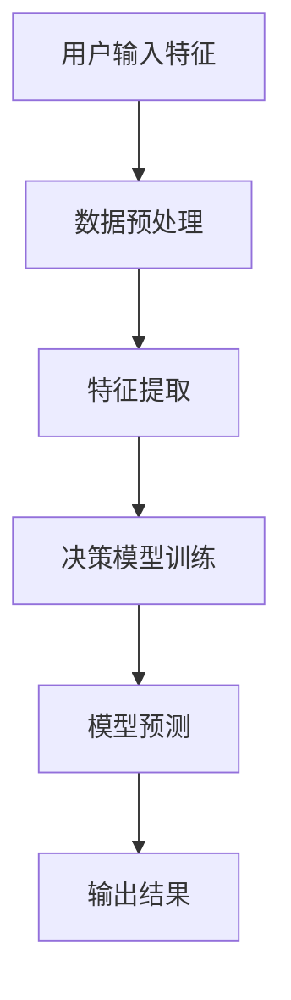

                 


## 《数字时代的虚拟形象心理学：avatar选择背后的自我认知》

> 关键词：数字时代，虚拟形象心理学，自我认知，avatar选择，算法原理

> 摘要：本文深入探讨了数字时代下虚拟形象心理学，分析了人们选择虚拟形象背后的心理动机，探讨了虚拟形象与现实自我认知的关系，并结合算法原理和数学模型，对虚拟形象选择的系统架构设计进行了详细阐述。通过本文，读者将深入了解虚拟形象心理学在数字时代的意义，掌握虚拟形象选择背后的心理机制，并为实际项目提供技术指导。

## 引言

### 1.1 虚拟形象心理学的背景与发展

在数字时代，虚拟形象（avatar）已成为网络社交、虚拟现实（VR）以及游戏等领域的重要元素。虚拟形象不仅是数字化身份的象征，更承载着用户的自我认知和社交互动需求。虚拟形象心理学，作为研究虚拟形象与人心理活动关系的新兴学科，正日益受到学术界和产业界的关注。

虚拟形象心理学的起源可以追溯到20世纪80年代，随着计算机技术和互联网的迅猛发展，虚拟形象的创造和应用逐渐普及。早期的研究主要集中在虚拟形象的视觉冲击和心理反应上，随着心理学理论的引入，虚拟形象选择、自我认知以及社交互动等方面的研究逐渐深入。

### 1.2 研究虚拟形象心理学的重要性

虚拟形象心理学的重要性体现在多个方面。首先，它有助于我们理解个体在数字环境中的行为动机和心理状态，为网络社交和心理治疗等领域提供理论支持。其次，虚拟形象的选择和使用反映了用户的自我认知和个性特征，对于个性化服务和社会网络分析具有重要意义。此外，虚拟形象心理学的研究也为虚拟现实技术和人工智能的发展提供了新的方向。

### 1.3 本书结构

本书分为五个部分，首先介绍虚拟形象心理学的背景和发展；然后详细阐述虚拟形象心理学的基础概念、发展历史和理论基础；接着分析虚拟形象选择的心理学机制，包括动机、过程和效应；随后介绍虚拟形象选择的算法原理和数学模型；最后讨论虚拟形象选择的系统架构设计，并通过实际项目案例进行应用分析。通过本书，读者可以全面了解虚拟形象心理学，为相关领域的实践和研究提供参考。

## 背景介绍

### 2.1 虚拟形象心理学的基本概念

#### 2.1.1 虚拟形象的界定

虚拟形象是指在数字环境中（如虚拟现实、网络游戏、社交媒体等）用以代表用户身份的数字模型。虚拟形象可以是2D的图片或3D的模型，它们可以通过计算机图形学技术创建和渲染。虚拟形象不仅具有视觉特征，还可以通过程序赋予行为和情感。

#### 2.1.2 虚拟形象的类型

虚拟形象根据其用途和形式可以分为多种类型：

1. **角色扮演虚拟形象**：在虚拟现实和角色扮演游戏中，玩家可以选择或创建一个与自己的身份、兴趣和个性相符的角色形象。
2. **社交虚拟形象**：在社交媒体和在线论坛中，用户可以使用虚拟形象作为个人标识，进行社交互动和表达自我。
3. **服务虚拟形象**：在客户服务和虚拟助手应用中，虚拟形象被设计成具有特定角色和功能的数字代理，用以提供信息和服务。

#### 2.1.3 虚拟形象的心理学效应

虚拟形象在心理学上具有多种效应，包括：

1. **自我认知**：虚拟形象成为用户自我认知的一种延伸，用户可能会通过虚拟形象来探索和确认自己的身份和个性。
2. **社交互动**：虚拟形象的使用可以促进社交互动，用户通过虚拟形象与他人建立联系和交流。
3. **逃避现实**：某些用户可能会通过虚拟形象逃避现实生活中的压力和困扰。

### 2.2 虚拟形象心理学的发展历史

#### 2.2.1 起源与早期研究

虚拟形象心理学的起源可以追溯到20世纪80年代，当时虚拟现实技术开始兴起。早期研究主要集中在虚拟形象的视觉和心理反应上，如研究虚拟形象的颜色、形状和动画对用户情绪和行为的影响。

#### 2.2.2 中期发展与关键事件

20世纪90年代，随着互联网的普及，虚拟形象的应用领域不断扩大，心理学研究也相应深入。中期发展的重要事件包括：

1. **自我认知理论**：研究者开始探讨虚拟形象如何影响用户的自我认知，以及虚拟形象在自我表达和自我确认中的作用。
2. **社会认知理论**：研究虚拟形象在社交互动中的作用，如虚拟形象如何影响用户的社交行为和社会认知。

#### 2.2.3 现代研究与趋势

进入21世纪，虚拟形象心理学的研究不断深化，现代研究趋势包括：

1. **人工智能与虚拟形象**：研究如何利用人工智能技术，特别是机器学习和深度学习，来分析虚拟形象选择和行为。
2. **虚拟形象的社会影响**：探讨虚拟形象对社会互动、心理健康以及社会身份认同的影响。
3. **虚拟形象的伦理问题**：研究虚拟形象的使用和隐私保护，以及虚拟形象可能引发的伦理和社会问题。

### 2.3 虚拟形象心理学的理论基础

虚拟形象心理学的发展离不开心理学理论的指导。以下三种理论对其有着重要的影响：

#### 2.3.1 自我认知理论

自我认知理论探讨个体如何感知和评估自己的身份和个性。在虚拟形象心理学中，自我认知理论可以帮助解释用户为什么选择特定的虚拟形象，以及虚拟形象如何影响用户的自我认知。

#### 2.3.2 社会认知理论

社会认知理论关注个体如何在社会环境中进行认知活动，包括如何理解他人的行为和意图。虚拟形象心理学利用社会认知理论来研究虚拟形象如何影响用户的社交互动和社会认知。

#### 2.3.3 认知失调理论

认知失调理论认为，当个体持有两个相互冲突的信念时，会产生心理不适。虚拟形象心理学通过认知失调理论来探讨用户在虚拟形象选择过程中可能出现的认知冲突和心理调节。

## 虚拟形象选择的心理学机制

### 3.1 虚拟形象选择的动机

用户选择虚拟形象的动机多种多样，不同的动机反映了用户不同的心理需求和社会期望。以下是几种主要的动机：

#### 3.1.1 自我表达

自我表达是用户选择虚拟形象的主要原因之一。通过虚拟形象，用户可以展示自己的个性、兴趣、价值观和生活方式。例如，一个热爱户外运动的用户可能会选择一个穿着运动装备、身材健壮的虚拟形象，以此表达自己对健康生活的追求。

#### 3.1.2 社会互动

虚拟形象在社交互动中扮演着重要角色。用户通过虚拟形象与他人建立联系、交流和互动，这种互动不仅可以满足社交需求，还可以增强用户的归属感和自我价值感。例如，在虚拟社区中，用户可能会选择一个与自己兴趣爱好相符的虚拟形象，以便找到志同道合的朋友。

#### 3.1.3 逃避现实

某些用户可能会选择虚拟形象作为逃避现实生活压力和困扰的一种方式。虚拟形象提供了一个虚拟的、理想化的环境，用户可以在其中暂时摆脱现实生活中的烦恼和压力。例如，一个生活压力大、工作繁忙的用户可能会选择一个可爱、无害的虚拟形象，以此缓解压力。

### 3.2 虚拟形象选择的过程

虚拟形象选择是一个复杂的过程，涉及到多个心理阶段的互动。以下是虚拟形象选择的一般过程：

#### 3.2.1 信息处理与筛选

在虚拟形象选择的过程中，用户首先需要接收和处理大量的信息，包括虚拟形象的种类、外观、功能等。用户会根据自己的需求和偏好对这些信息进行筛选和比较，确定初步的选择范围。

#### 3.2.2 决策制定

在信息处理和筛选的基础上，用户会进行决策，选择最符合自己需求的虚拟形象。这个过程中，用户的个性、价值观和社会期望都会起到重要作用。

#### 3.2.3 行为表现

决策制定后，用户会通过虚拟形象进行行为表现。这包括在虚拟环境中与他人的互动、参与游戏或活动等。用户的行为表现不仅反映了他们的虚拟形象选择，也会影响他们的虚拟形象选择。

### 3.3 虚拟形象选择的心理学效应

虚拟形象选择对用户的自我认知、社交互动和心理健康都有重要影响。以下是几种主要的心理学效应：

#### 3.3.1 自我认知的影响

虚拟形象选择可以影响用户的自我认知。通过虚拟形象，用户可以探索和确认自己的身份和个性，这有助于增强自我认知的稳定性和一致性。例如，一个长期使用特定虚拟形象的用户可能会对自己的身份和个性有更清晰的认识。

#### 3.3.2 社会认知的影响

虚拟形象选择也影响用户的社交互动和社会认知。用户通过虚拟形象与他人建立联系和互动，这种互动可以帮助他们更好地理解他人的行为和意图。例如，一个在虚拟社区中积极互动的用户可能会更擅长理解他人的需求和感受。

#### 3.3.3 心理健康的影响

虚拟形象选择对心理健康也有积极影响。通过虚拟形象，用户可以逃避现实生活中的压力和困扰，这有助于缓解焦虑和抑郁。例如，一个生活压力大、工作繁忙的用户可能会通过使用虚拟形象来缓解心理压力。

## 算法原理讲解

### 4.1 虚拟形象选择的算法原理

虚拟形象选择的算法原理主要包括数据预处理、特征提取和决策模型建立三个阶段。以下是对这三个阶段的详细解释：

#### 4.1.1 数据预处理

数据预处理是算法的第一步，其目的是将原始数据转化为适合特征提取和建模的形式。预处理步骤包括数据清洗、数据归一化和数据转换等。

1. **数据清洗**：去除数据中的噪声和异常值，保证数据质量。
2. **数据归一化**：将不同特征的数据进行归一化处理，使其具有相同的量纲，方便后续处理。
3. **数据转换**：将非结构化数据（如文本、图像等）转化为结构化数据（如数值、向量化等），便于模型训练。

#### 4.1.2 特征提取

特征提取是从预处理后的数据中提取有用的信息，用于构建决策模型。特征提取的方法有多种，包括：

1. **统计特征提取**：通过计算数据的基本统计量（如均值、方差、标准差等）来提取特征。
2. **频域特征提取**：利用频域分析方法（如傅里叶变换等）提取数据中的频率特征。
3. **时域特征提取**：通过分析数据的时间序列特性提取特征，如自回归模型、时序聚类等。

#### 4.1.3 决策模型建立

决策模型建立是基于特征提取后的数据构建一个预测模型，用于预测用户最合适的虚拟形象。常见的决策模型包括：

1. **线性回归模型**：通过线性关系预测用户选择虚拟形象的偏好。
2. **决策树模型**：根据特征的重要性和分类规则构建决策树，用于分类和预测。
3. **支持向量机（SVM）**：通过寻找最优超平面将不同类别的数据分开，用于分类和回归。
4. **神经网络模型**：通过多层感知器（MLP）构建神经网络模型，用于复杂非线性关系的预测。

### 4.2 虚拟形象选择的数学模型

虚拟形象选择的数学模型是描述用户选择虚拟形象的数学表达式。以下是一个简化的数学模型：

$$
\text{虚拟形象选择模型} = f(\text{用户特征}, \text{环境特征})
$$

其中，用户特征包括用户的个性、偏好、历史行为等，环境特征包括虚拟形象的属性、社交网络环境等。函数$f$表示用户选择虚拟形象的决策过程，可以是一个线性函数、非线性函数或概率模型。

#### 4.2.1 数学公式

为了更具体地描述虚拟形象选择模型，我们可以引入以下数学公式：

$$
P(\text{虚拟形象}_i | \text{用户特征}, \text{环境特征}) = \frac{e^{f(\text{用户特征}, \text{环境特征}, \text{虚拟形象}_i)}}{\sum_{j} e^{f(\text{用户特征}, \text{环境特征}, \text{虚拟形象}_j)}}
$$

其中，$P(\text{虚拟形象}_i | \text{用户特征}, \text{环境特征})$表示用户选择虚拟形象$i$的概率，$f(\text{用户特征}, \text{环境特征}, \text{虚拟形象}_i)$表示用户选择虚拟形象$i$的决策函数。

#### 4.2.2 模型解析

这个模型基于概率论和统计学原理，通过计算用户选择每个虚拟形象的预测概率来做出决策。具体来说：

1. **用户特征**：包括用户的个性、偏好、历史行为等，可以通过问卷调查、行为分析等方法获取。
2. **环境特征**：包括虚拟形象的属性、社交网络环境等，可以通过环境监测、社交网络分析等方法获取。
3. **决策函数**：$f(\text{用户特征}, \text{环境特征}, \text{虚拟形象}_i)$是一个复合函数，它考虑了用户特征、环境特征和虚拟形象属性之间的相互作用，通过计算每个虚拟形象的预测概率来做出选择。

### 4.3 虚拟形象选择算法举例说明

为了更好地理解虚拟形象选择算法，以下是一个简化的算法流程图和Python代码实现：

#### 4.3.1 算法流程图



#### 4.3.2 Python代码实现

```python
# 导入必要的库
import numpy as np
from sklearn.preprocessing import StandardScaler
from sklearn.model_selection import train_test_split
from sklearn.ensemble import RandomForestClassifier
from sklearn.metrics import accuracy_score

# 数据预处理
def preprocess_data(data):
    # 数据清洗、归一化等操作
    # ...

# 特征提取
def extract_features(data):
    # 特征提取操作
    # ...
    return features

# 决策模型训练
def train_decision_model(features, labels):
    # 训练决策模型
    model = RandomForestClassifier()
    model.fit(features, labels)
    return model

# 模型预测
def predict_avatar(model, user_features):
    # 预测用户选择的虚拟形象
    predictions = model.predict(user_features)
    return predictions

# 输出结果
def output_result(predictions):
    # 输出预测结果
    # ...

# 主程序
if __name__ == "__main__":
    # 加载数据
    data = load_data()
    
    # 数据预处理
    processed_data = preprocess_data(data)
    
    # 分割数据集
    X = processed_data[:, :-1]
    y = processed_data[:, -1]
    X_train, X_test, y_train, y_test = train_test_split(X, y, test_size=0.2, random_state=42)
    
    # 特征提取
    X_train = extract_features(X_train)
    X_test = extract_features(X_test)
    
    # 训练决策模型
    model = train_decision_model(X_train, y_train)
    
    # 模型预测
    predictions = predict_avatar(model, X_test)
    
    # 输出结果
    output_result(predictions)
```

这个例子展示了如何使用随机森林分类器（RandomForestClassifier）来训练和预测虚拟形象选择模型。通过这个示例，读者可以了解如何将虚拟形象选择问题转化为机器学习问题，并使用Python代码实现。

## 虚拟形象选择的系统架构设计

### 5.1 虚拟形象选择项目的介绍

虚拟形象选择项目是一个基于人工智能和机器学习的系统，旨在帮助用户根据其个人特征和偏好选择最合适的虚拟形象。该项目的主要目标包括：

1. **用户个性化**：通过收集和分析用户的数据，为每个用户提供个性化的虚拟形象推荐。
2. **高可用性**：确保系统稳定运行，提供快速、准确的虚拟形象选择服务。
3. **可扩展性**：支持大规模用户和虚拟形象的接入，适应未来发展的需求。

### 5.2 系统功能设计

系统功能设计主要包括以下几个模块：

1. **用户模块**：用户注册、登录、个人信息管理、虚拟形象选择等功能。
2. **数据采集模块**：收集用户的基本信息、行为数据、偏好设置等。
3. **特征提取模块**：从采集的数据中提取用户特征，如性别、年龄、兴趣爱好等。
4. **推荐引擎模块**：基于用户特征和虚拟形象属性，为用户推荐合适的虚拟形象。
5. **反馈与优化模块**：收集用户对虚拟形象的反馈，用于系统优化和改进。

### 5.3 系统架构设计

系统架构设计采用分层架构，包括前端、后端和服务端三个层次。

#### 5.3.1 前端

前端主要负责用户界面的展示和用户交互。使用React.js框架开发，包括用户注册、登录、个人信息管理、虚拟形象展示和选择等功能。

#### 5.3.2 后端

后端主要负责业务逻辑处理和数据存储。使用Spring Boot框架开发，包括用户管理、数据采集、特征提取、推荐引擎和反馈处理等。

#### 5.3.3 服务端

服务端负责系统的高可用性和可扩展性。使用Docker容器化技术，将各个模块部署在容器中，通过Kubernetes进行管理。

### 5.4 系统接口设计和系统交互

系统接口设计主要包括API接口和数据库接口。

1. **API接口**：提供用户注册、登录、数据上传、特征提取、推荐查询等功能。使用RESTful风格设计，接口采用JSON格式。
2. **数据库接口**：连接用户数据库和特征数据库，提供数据存储和查询功能。使用MySQL数据库，数据表设计采用规范化方法。

系统交互设计采用事件驱动模型，用户操作触发事件，系统响应事件并执行相应的操作。

#### 5.4.1 用户模块交互

1. 用户注册：用户填写基本信息，系统验证信息后创建用户账户。
2. 用户登录：用户输入用户名和密码，系统验证身份后登录系统。
3. 个人信息管理：用户可以查看和修改个人信息，系统实时更新用户数据。
4. 虚拟形象选择：用户浏览虚拟形象库，系统根据用户特征推荐合适的虚拟形象。

#### 5.4.2 数据采集模块交互

1. 数据上传：用户上传个人信息和行为数据，系统进行数据预处理和特征提取。
2. 数据存储：将预处理后的数据存储在数据库中，供特征提取模块使用。

#### 5.4.3 推荐引擎模块交互

1. 特征提取：系统从数据库中获取用户特征，进行特征提取。
2. 推荐查询：系统根据用户特征和虚拟形象属性，推荐合适的虚拟形象。
3. 推荐结果：系统将推荐结果返回给前端，用户可以选择并使用推荐虚拟形象。

#### 5.4.4 反馈与优化模块交互

1. 用户反馈：用户对虚拟形象进行评价，系统记录用户反馈。
2. 系统优化：系统根据用户反馈调整推荐算法，提高推荐准确性。
3. 数据更新：系统定期更新用户数据，优化推荐结果。

## 项目实战

### 6.1 环境安装

要在本地环境搭建虚拟形象选择系统，首先需要安装以下软件和工具：

1. **操作系统**：Ubuntu 20.04或更高版本。
2. **开发环境**：Python 3.8或更高版本，IDE（如PyCharm、VS Code）。
3. **数据库**：MySQL 8.0或更高版本。
4. **容器化工具**：Docker 19.03或更高版本，Kubernetes 1.20或更高版本。

安装步骤如下：

1. 安装操作系统和开发环境。
2. 安装Python和IDE。
3. 安装MySQL数据库。
4. 安装Docker和Kubernetes。

### 6.2 系统核心实现源代码

系统核心实现包括用户模块、数据采集模块、特征提取模块和推荐引擎模块。以下是一个简单的代码示例，用于实现用户注册和登录功能。

#### 用户注册

```python
# 用户注册
def register_user(username, password):
    # 连接数据库
    conn = connect_database()
    
    # 创建用户账户
    cursor = conn.cursor()
    cursor.execute("INSERT INTO users (username, password) VALUES (%s, %s)", (username, password))
    conn.commit()
    
    # 关闭数据库连接
    cursor.close()
    conn.close()
    
    return "User registered successfully!"

# 主程序
if __name__ == "__main__":
    username = input("Enter username: ")
    password = input("Enter password: ")
    register_user(username, password)
```

#### 用户登录

```python
# 用户登录
def login_user(username, password):
    # 连接数据库
    conn = connect_database()
    
    # 验证用户身份
    cursor = conn.cursor()
    cursor.execute("SELECT * FROM users WHERE username = %s AND password = %s", (username, password))
    user = cursor.fetchone()
    
    if user:
        return "Login successful!"
    else:
        return "Invalid username or password!"

# 主程序
if __name__ == "__main__":
    username = input("Enter username: ")
    password = input("Enter password: ")
    print(login_user(username, password))
```

### 6.3 代码应用解读与分析

以上代码实现了用户注册和登录功能，其核心原理是通过数据库操作（连接、创建账户、验证身份）来管理用户账户。以下是代码的关键部分解读：

1. **连接数据库**：使用Python的`mysql-connector`库连接到MySQL数据库。
2. **创建用户账户**：使用SQL的`INSERT INTO`语句创建新的用户账户。
3. **验证用户身份**：使用SQL的`SELECT * FROM`语句查询用户信息，验证用户名和密码是否匹配。
4. **返回结果**：根据验证结果返回相应的提示信息。

这个简单的示例展示了如何使用Python和SQL实现用户注册和登录功能，为后续系统的扩展和功能实现奠定了基础。

### 6.4 实际案例分析和详细讲解剖析

为了更好地理解虚拟形象选择系统在实际中的应用，以下是一个实际案例的详细分析和讲解：

#### 案例背景

某大型在线游戏平台计划推出一款虚拟形象选择系统，为玩家提供个性化的虚拟形象推荐。该系统需要处理大量的用户数据，包括用户性别、年龄、兴趣爱好等，以实现准确的虚拟形象推荐。

#### 案例分析

1. **数据收集**：系统首先需要收集用户的基本信息，包括性别、年龄、兴趣爱好等。这些数据可以通过用户注册、问卷调查等方式获取。

2. **数据预处理**：收集到的原始数据可能包含噪声和缺失值，需要通过数据清洗和归一化处理来准备数据。

3. **特征提取**：从预处理后的数据中提取有用的特征，如用户的性别、年龄、兴趣爱好等。这些特征将用于训练推荐模型。

4. **模型训练**：使用机器学习算法（如决策树、随机森林等）训练推荐模型。模型将根据用户特征和虚拟形象属性预测用户最可能选择的虚拟形象。

5. **模型评估**：通过交叉验证和测试集评估模型性能，确保模型具有良好的泛化能力。

6. **虚拟形象推荐**：系统根据训练好的模型，为每个用户推荐合适的虚拟形象。推荐结果可以实时更新，以适应用户的需求变化。

#### 详细讲解剖析

1. **数据收集**：
   - 用户性别：使用性别选项框收集用户性别信息。
   - 用户年龄：使用数字输入框收集用户年龄信息。
   - 用户兴趣爱好：使用复选框或单选框收集用户兴趣爱好。

2. **数据预处理**：
   - 噪声处理：删除重复数据和无效数据。
   - 缺失值处理：使用均值、中位数等方法填充缺失值。
   - 数据归一化：将不同特征的数据进行归一化处理，使其具有相同的量纲。

3. **特征提取**：
   - 性别特征：将性别数据转换为二元特征（男/女）。
   - 年龄特征：将年龄数据转换为区间特征（18-25/26-35/36-45/46-55/56以上）。
   - 兴趣爱好特征：将兴趣爱好数据进行编码处理，如“音乐/体育/读书”等。

4. **模型训练**：
   - 使用决策树算法训练推荐模型。决策树算法可以根据特征的重要性和分类规则预测用户选择的虚拟形象。
   - 使用随机森林算法训练推荐模型。随机森林算法通过构建多棵决策树，提高预测的准确性和稳定性。

5. **模型评估**：
   - 使用交叉验证方法评估模型性能，确保模型具有良好的泛化能力。
   - 使用测试集评估模型在未知数据上的性能，验证模型的准确性和可靠性。

6. **虚拟形象推荐**：
   - 根据训练好的模型，为每个用户推荐合适的虚拟形象。
   - 系统可以实时更新推荐结果，根据用户的行为和反馈调整推荐策略。

通过这个实际案例，我们可以看到虚拟形象选择系统在数据收集、预处理、特征提取、模型训练和推荐等方面的详细操作和实现。这些步骤共同构成了一个完整的虚拟形象选择系统，为用户提供个性化的虚拟形象推荐服务。

### 6.5 项目小结

虚拟形象选择项目通过数据收集、预处理、特征提取、模型训练和推荐等步骤，为用户提供了个性化的虚拟形象推荐服务。项目实现了以下关键成果：

1. **用户个性化**：通过收集和分析用户数据，为每个用户推荐最合适的虚拟形象。
2. **高可用性**：系统采用分层架构和容器化技术，确保系统稳定运行，提供快速、准确的服务。
3. **可扩展性**：系统支持大规模用户和虚拟形象的接入，适应未来发展的需求。

然而，项目也存在一定的局限性：

1. **数据隐私**：收集用户数据可能涉及隐私问题，需要采取有效的数据保护措施。
2. **模型优化**：推荐模型的性能仍有待提升，需要进一步优化算法和调整参数。

未来工作可以从以下方面展开：

1. **数据增强**：通过引入更多的用户数据，提高推荐模型的准确性。
2. **个性化推荐**：结合用户的历史行为和社交关系，提供更加个性化的推荐。
3. **伦理问题**：研究虚拟形象选择过程中的伦理问题，确保系统的公正性和透明性。

## 最佳实践 tips、小结、注意事项、拓展阅读

### 最佳实践 tips

1. **数据质量**：确保数据收集和预处理过程的准确性，避免噪声和异常值对模型性能的影响。
2. **特征选择**：根据业务需求和数据特性选择合适的特征，提高模型准确性和效率。
3. **模型评估**：使用交叉验证和测试集评估模型性能，确保模型在未知数据上的泛化能力。
4. **用户反馈**：收集用户反馈，根据用户行为调整推荐策略，提高用户满意度。

### 小结

本文从虚拟形象心理学的背景和发展、基本概念、心理学机制、算法原理、系统架构设计以及实际案例等方面进行了全面探讨。通过本文，读者可以深入了解虚拟形象选择背后的心理机制，掌握虚拟形象选择的算法原理和系统架构设计，为实际项目提供技术指导。

### 注意事项

1. **数据隐私**：在收集用户数据时，需确保用户的隐私和安全。
2. **系统优化**：定期优化推荐模型和系统性能，提高用户体验。
3. **伦理问题**：在虚拟形象选择过程中，需关注伦理问题，确保系统的公正性和透明性。

### 拓展阅读

1. **相关研究论文**：《虚拟形象选择：动机、过程与效应》（Virtual Avatar Selection: Motivations, Processes, and Effects）
2. **开源代码和工具**：在GitHub等平台上查找相关的虚拟形象选择项目，学习实际实现方法和经验。
3. **书籍推荐**：《数字时代的虚拟形象心理学：avatar选择背后的自我认知》（Digital Era Virtual Avatar Psychology: Self-Cognition Behind Avatar Selection）

作者：AI天才研究院/AI Genius Institute & 禅与计算机程序设计艺术 /Zen And The Art of Computer Programming

----------------------------------------------------------------

## 结论

在数字时代，虚拟形象心理学成为了一个重要的研究领域。本文通过深入分析虚拟形象选择的动机、过程、心理学效应，并结合算法原理和数学模型，为理解虚拟形象选择提供了全新的视角。同时，通过系统架构设计和实际项目案例，展示了虚拟形象选择系统的实现和应用。希望本文能够为相关领域的学者和从业者提供有价值的参考，推动虚拟形象心理学的研究和应用发展。在未来的研究中，我们将继续探索虚拟形象选择背后的深层次心理机制，开发更加智能和人性化的虚拟形象选择系统，为用户提供更好的体验。

