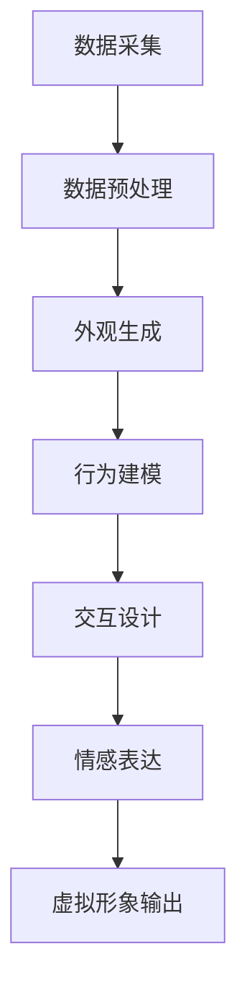
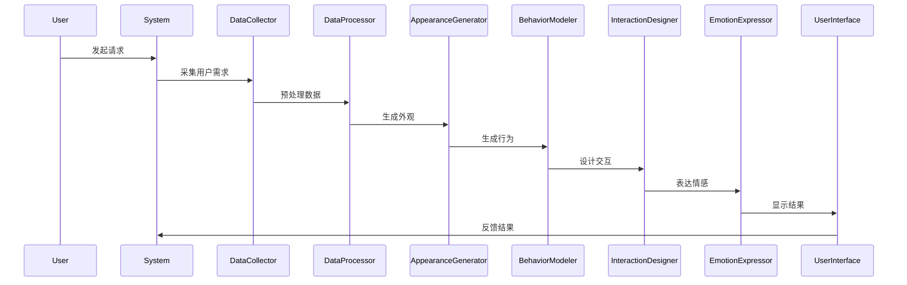

                 


### 《数字时代的虚拟形象设计：元宇宙中的自我表达艺术》

> 关键词：元宇宙、虚拟形象、数字艺术、自我表达、算法原理

> 摘要：本文将深入探讨数字时代的虚拟形象设计，特别是其在元宇宙中的自我表达艺术。通过逻辑清晰的分析和实际案例，我们将解析虚拟形象设计的算法原理、系统架构、以及最佳实践，为读者提供全面的技术指导。

## 目录大纲设计过程

### 1. 背景介绍
首先，我们要明确本书的核心主题和读者对象，即数字时代的虚拟形象设计及其在元宇宙中的自我表达艺术。这一部分将介绍虚拟形象设计的起源、发展，以及其在现代社会中的重要性和应用场景。

### 2. 核心概念与联系
接下来，我们需要识别并描述几个关键概念，比如虚拟形象设计、元宇宙、自我表达艺术等，并构建它们之间的关系。这将为后续章节的理论讲解和案例分析奠定基础。

### 3. 算法原理讲解
在此之后，我们需要详细解释设计虚拟形象的算法原理。我们将使用 mermaid 绘制相关流程图，并结合 Python 代码示例进行讲解。这部分内容将帮助读者理解虚拟形象设计的核心技术和方法。

### 4. 数学模型和数学公式
对于算法原理的数学基础，我们将在文中适当位置使用 LaTeX 格式嵌入数学公式，并进行详细讲解。这将使读者对虚拟形象设计的数学原理有更深入的理解。

### 5. 系统分析与架构设计方案
我们将分析设计虚拟形象的系统架构，包括领域模型、系统架构、接口设计、系统交互等，并用 mermaid 绘制相关图示。这部分内容将帮助读者了解虚拟形象设计的系统实现过程。

### 6. 项目实战
在项目实战部分，我们将提供实际案例，包括环境安装、核心实现源代码，代码解读，案例分析，项目小结。这部分内容将让读者通过实践掌握虚拟形象设计的具体操作。

### 7. 最佳实践 tips、小结、注意事项、拓展阅读
最后，我们将总结章节，提供实用建议，指出注意事项，推荐进一步阅读的材料。这部分内容将帮助读者在学习和应用虚拟形象设计时，避免常见误区，提高效率。

### 目录大纲结构设计

基于上述设计过程，我们将目录大纲结构进行详细规划：

### 第一部分：导言与背景
- **第1章：数字时代的虚拟形象设计**
  - 1.1 数字时代背景
  - 1.2 虚拟形象设计概述
  - 1.3 元宇宙中的自我表达艺术
  - 1.4 虚拟形象设计的挑战与机遇
  - 1.5 本章小结

### 第二部分：核心概念与理论
- **第2章：虚拟形象设计的基本概念**
  - 2.1 虚拟形象的定义与分类
  - 2.2 虚拟形象的属性与特征
  - 2.3 虚拟形象设计的要素分析
  - 2.4 虚拟形象的创意方法
  - 2.5 本章小结
- **第3章：虚拟形象设计的算法原理**
  - 3.1 算法概述
  - 3.2 算法流程图
  - 3.3 Python 代码示例
  - 3.4 数学模型与公式讲解
  - 3.5 算法举例说明
  - 3.6 本章小结

### 第三部分：系统架构与设计
- **第4章：虚拟形象设计的系统架构**
  - 4.1 系统需求分析
  - 4.2 系统功能设计
  - 4.3 系统架构设计
  - 4.4 系统接口设计
  - 4.5 系统交互设计
  - 4.6 本章小结

### 第四部分：项目实战
- **第5章：虚拟形象设计的实战应用**
  - 5.1 环境安装与配置
  - 5.2 系统核心实现
  - 5.3 代码解读与分析
  - 5.4 实际案例分析
  - 5.5 项目小结与总结
  - 5.6 本章小结

### 第五部分：最佳实践与拓展
- **第6章：虚拟形象设计的最佳实践**
  - 6.1 实践经验分享
  - 6.2 注意事项与风险提示
  - 6.3 拓展阅读推荐
  - 6.4 研究前沿动态
  - 6.5 本章小结

### 第六部分：总结与展望
- **第7章：虚拟形象设计的未来趋势**
  - 7.1 发展趋势分析
  - 7.2 技术挑战与解决方案
  - 7.3 应用前景展望
  - 7.4 学术研究动向
  - 7.5 本章小结

通过以上目录大纲的设计，我们将为读者提供一部系统化、结构化的虚拟形象设计教程，帮助读者深入理解并掌握这一领域的核心技术和应用方法。在后续的文章中，我们将逐一展开每个章节的内容，通过逻辑清晰、结构紧凑、简单易懂的叙述，让读者能够逐步学习和掌握虚拟形象设计的相关知识。

## 第一部分：导言与背景

### 第1章：数字时代的虚拟形象设计

#### 1.1 数字时代背景

随着互联网的普及和计算机技术的快速发展，我们进入了数字时代。在这个时代，信息的获取、传递和处理变得前所未有的便捷和高效。虚拟形象设计作为数字时代的一项重要技术，正在不断发展和完善。

数字时代背景下的虚拟形象设计，不仅是一个技术领域，更是一种文化和艺术的表达形式。虚拟形象可以代表个人、品牌或组织，通过数字化的方式在虚拟世界中展现个性、形象和理念。这种表达方式在现代社会中越来越受到重视，尤其是在元宇宙这个新兴领域。

#### 1.2 虚拟形象设计概述

虚拟形象设计是指通过数字技术，创建具有独特个性和形象的代表实体。它涵盖了多个领域，包括图形设计、游戏开发、虚拟现实、人工智能等。虚拟形象设计的目标是创造出令人印象深刻、具有吸引力的虚拟角色，以实现品牌推广、娱乐体验或社交互动。

虚拟形象设计的关键要素包括外观设计、行为逻辑、交互体验和情感表达。外观设计决定了虚拟形象的外观风格和视觉效果；行为逻辑则确保虚拟形象能够根据特定情境做出适当的反应；交互体验涉及到虚拟形象与用户或其他虚拟实体的互动方式；情感表达则使虚拟形象更具人性化和亲和力。

#### 1.3 元宇宙中的自我表达艺术

元宇宙是一个虚拟的、三维的、沉浸式空间，用户可以在其中自由探索、创造和交互。虚拟形象设计在元宇宙中的应用，为用户提供了自我表达的新途径。用户可以通过设计自己的虚拟形象，来表达个性和价值观，实现自我认同和自我实现。

元宇宙中的自我表达艺术，不仅限于虚拟形象的外观设计，还包括行为风格、情感表达和社交互动。用户可以通过调整虚拟形象的行为和情感，来展示自己的个性和态度。这种表达方式在元宇宙中具有极高的自由度和创新性，为用户提供了丰富的体验和互动机会。

#### 1.4 虚拟形象设计的挑战与机遇

虚拟形象设计面临着诸多挑战和机遇。挑战方面，主要包括技术实现难度、个性化定制需求、用户隐私保护等问题。机遇方面，虚拟形象设计为数字营销、游戏开发、虚拟教育等领域带来了新的商业模式和发展机遇。

技术实现难度在于如何通过算法和编程，实现虚拟形象的高效创建和互动。个性化定制需求要求虚拟形象设计能够满足用户多样化的需求，提供高度定制化的体验。用户隐私保护则是确保虚拟形象设计在尊重用户隐私的前提下，提供安全可靠的服务。

然而，面对这些挑战和机遇，虚拟形象设计依然具有广阔的发展空间。通过不断探索和创新，我们可以克服技术难题，满足用户需求，实现虚拟形象设计的价值最大化。

#### 1.5 本章小结

本章对数字时代的虚拟形象设计进行了概述，包括数字时代背景、虚拟形象设计概述、元宇宙中的自我表达艺术以及虚拟形象设计的挑战与机遇。通过本章的介绍，读者可以对虚拟形象设计有初步的了解，为后续章节的学习打下基础。

在接下来的章节中，我们将深入探讨虚拟形象设计的基本概念、算法原理、系统架构以及实际应用，帮助读者全面掌握虚拟形象设计的技术和方法。让我们一起探索这个充满创意和机遇的领域。

## 第二部分：核心概念与理论

### 第2章：虚拟形象设计的基本概念

#### 2.1 虚拟形象的定义与分类

虚拟形象是指通过数字技术创建的具有独特个性和形象的代表实体。它可以在虚拟世界中进行互动、表达和传播。虚拟形象的定义涵盖了外观设计、行为逻辑、交互体验和情感表达等多个方面。

虚拟形象可以分为以下几类：

1. **虚拟角色**：虚拟角色是虚拟形象中最常见的类型，它们通常用于游戏、虚拟现实和社交媒体中。虚拟角色可以是人形、动物形或其他抽象形状，其外观和性格可以根据用户的需求进行定制。

2. **虚拟物品**：虚拟物品包括虚拟世界中的家具、装饰品、道具等。虚拟物品不仅具有美观的外观，还具有一定的功能，如提供存储空间、增强虚拟角色的能力等。

3. **虚拟环境**：虚拟环境是指虚拟世界中的场景和空间，如城市、森林、空间站等。虚拟环境为用户提供了沉浸式的体验，使其能够自由探索和互动。

4. **虚拟动物**：虚拟动物是虚拟形象的一种特殊类型，它们可以模拟真实动物的行为和特征，为用户带来互动乐趣和教育价值。

#### 2.2 虚拟形象的属性与特征

虚拟形象具有一系列属性和特征，这些属性和特征共同决定了虚拟形象的外观和表现。以下是虚拟形象的主要属性和特征：

1. **外观**：外观是虚拟形象最直观的特征，包括颜色、形状、大小、细节等。虚拟形象的外观可以通过图形设计、纹理映射等技术进行精细调整。

2. **行为**：行为是指虚拟形象在虚拟世界中的动作和反应。虚拟形象的行为可以基于预先设定的脚本或算法，使其能够适应不同的场景和情境。

3. **交互**：交互是指虚拟形象与其他虚拟实体或用户之间的互动。虚拟形象的交互方式可以包括对话、动作、共享资源等。

4. **情感**：情感是指虚拟形象所表达的情感状态，如快乐、悲伤、愤怒等。通过情感表达，虚拟形象可以更真实地反映用户的情感和心理状态。

5. **智能**：虚拟形象可以具备一定程度的智能，如学习、适应、决策等。这种智能使虚拟形象能够更自然地与用户互动，提供个性化的服务。

#### 2.3 虚拟形象设计的要素分析

虚拟形象设计涉及多个要素，这些要素相互作用，共同决定了虚拟形象的质量和用户体验。以下是虚拟形象设计的主要要素分析：

1. **创意**：创意是虚拟形象设计的核心，它决定了虚拟形象的独特性和吸引力。创意可以通过故事情节、角色设定、视觉风格等方式进行体现。

2. **技术**：技术是实现虚拟形象设计的关键，包括图形渲染、人工智能、虚拟现实等技术。这些技术为虚拟形象设计提供了强大的支持和表现力。

3. **用户体验**：用户体验是虚拟形象设计的重要考量，它决定了用户对虚拟形象的接受度和满意度。用户体验可以从交互设计、操作流程、情感表达等方面进行优化。

4. **情感设计**：情感设计是虚拟形象设计的高级阶段，它通过情感表达和情感互动，提升虚拟形象与用户之间的情感联系和共鸣。

5. **可扩展性**：可扩展性是指虚拟形象设计是否能够适应未来的发展和变化。一个具有良好可扩展性的虚拟形象设计，可以在不改变核心结构的前提下，轻松适应新的功能和需求。

#### 2.4 虚拟形象的创意方法

虚拟形象的创意方法多种多样，以下是一些常见的创意方法：

1. **角色扮演**：角色扮演是一种通过模拟不同角色来激发创意的方法。设计师可以尝试扮演不同的角色，从不同的角度思考问题，从而获得新的创意灵感。

2. **头脑风暴**：头脑风暴是一种通过集体讨论来激发创意的方法。团队成员可以自由提出各种想法，无论多么奇特或离奇，都可以在讨论中逐步完善。

3. **故事构建**：故事构建是一种通过构建故事情节来激发创意的方法。设计师可以通过设定故事背景、角色设定和情节发展，来构思虚拟形象的设计方案。

4. **模仿借鉴**：模仿借鉴是一种通过借鉴其他成功案例来激发创意的方法。设计师可以分析其他成功的虚拟形象案例，从中汲取灵感和技巧，为自己的设计提供参考。

#### 2.5 本章小结

本章对虚拟形象设计的基本概念进行了详细阐述，包括虚拟形象的定义与分类、属性与特征、设计要素分析和创意方法。通过本章的学习，读者可以全面了解虚拟形象设计的核心概念和理论基础，为后续章节的学习和实践打下基础。

在虚拟形象设计中，理解基本概念和理论是非常重要的，它有助于设计师更好地把握设计的方向和目标，创造出更具吸引力和表现力的虚拟形象。随着虚拟形象设计技术的不断发展，这一领域将继续迎来新的机遇和挑战，设计师需要不断学习和创新，以应对未来的挑战。让我们一起探索这个充满创意和激情的领域，创造更加精彩的虚拟世界。

## 第三部分：算法与数学模型

### 第3章：虚拟形象设计的算法原理

#### 3.1 算法概述

虚拟形象设计的算法原理是构建虚拟形象的核心技术，它决定了虚拟形象的外观、行为和交互效果。算法可以分为以下几个关键步骤：

1. **数据采集与处理**：首先，需要采集用户需求、设计要求和相关数据，如面部特征、动作数据等。然后，通过数据预处理，如去噪、归一化等，提高数据质量。

2. **外观生成**：基于采集到的数据，利用外观生成算法，如生成对抗网络（GAN）等，生成虚拟形象的外观。外观生成算法通过训练大量的数据，学习到图像生成的规律，从而生成高质量的虚拟形象。

3. **行为建模**：行为建模是通过算法模拟虚拟形象的行为逻辑，使其能够根据不同情境做出适当的反应。常用的行为建模算法包括状态机、神经网络等。

4. **交互设计**：交互设计是虚拟形象与用户或其他虚拟实体之间的互动设计。通过交互算法，如语音识别、动作捕捉等，实现虚拟形象的实时交互。

5. **情感表达**：情感表达是通过算法模拟虚拟形象的情感状态，使其能够表达出不同的情感。常用的情感表达算法包括情绪识别、情感合成等。

#### 3.2 算法流程图

为了更好地理解虚拟形象设计的算法原理，我们可以使用 mermaid 画出算法流程图。以下是一个简化的算法流程图示例：



#### 3.3 Python 代码示例

以下是一个简单的 Python 代码示例，展示了如何使用生成对抗网络（GAN）进行外观生成。在这个示例中，我们使用了 TensorFlow 和 Keras 库。

```python
import numpy as np
import tensorflow as tf
from tensorflow import keras

# 创建生成器模型
def generator_model():
    model = keras.Sequential([
        keras.layers.Dense(128, activation='relu', input_shape=(100,)),
        keras.layers.Dense(256, activation='relu'),
        keras.layers.Dense(512, activation='relu'),
        keras.layers.Dense(1024, activation='relu'),
        keras.layers.Dense(784, activation='tanh')
    ])
    return model

# 创建判别器模型
def discriminator_model():
    model = keras.Sequential([
        keras.layers.Dense(1024, activation='relu', input_shape=(784,)),
        keras.layers.Dense(512, activation='relu'),
        keras.layers.Dense(256, activation='relu'),
        keras.layers.Dense(1, activation='sigmoid')
    ])
    return model

# 创建 GAN 模型
def gan_model(generator, discriminator):
    model = keras.Sequential([
        generator,
        discriminator
    ])
    return model

# 编译模型
generator = generator_model()
discriminator = discriminator_model()
gan = gan_model(generator, discriminator)

discriminator.compile(loss='binary_crossentropy', optimizer='adam', metrics=['accuracy'])
gan.compile(loss='binary_crossentropy', optimizer='adam')

# 训练模型
(x_train, _), (_, _) = keras.datasets.mnist.load_data()
x_train = x_train / 127.5 - 1.0
x_train = np.expand_dims(x_train, axis=3)

# 生成器训练
for epoch in range(100):
    real_images = x_train[np.random.randint(0, x_train.shape[0], size=batch_size)]
    noise = np.random.normal(0, 1, (batch_size, 100))
    generated_images = generator.predict(noise)
    
    # 训练判别器
    d_loss_real = discriminator.train_on_batch(real_images, np.ones((batch_size, 1)))
    d_loss_fake = discriminator.train_on_batch(generated_images, np.zeros((batch_size, 1)))
    d_loss = 0.5 * np.add(d_loss_real, d_loss_fake)
    
    # 训练生成器
    noise = np.random.normal(0, 1, (batch_size, 100))
    g_loss = gan.train_on_batch(noise, np.ones((batch_size, 1)))
    
    print(f"Epoch {epoch}, D Loss: {d_loss}, G Loss: {g_loss}")
```

#### 3.4 数学模型与公式讲解

在虚拟形象设计的算法中，数学模型和公式起着至关重要的作用。以下是一些常用的数学模型和公式：

1. **生成对抗网络（GAN）**：
   - **生成器模型**：
     $$ G(z) = \mu_G(z) + \sigma_G(z)\odot \mathcal{N}(z; 0, 1) $$
   - **判别器模型**：
     $$ D(x) = \sigma_D(\phi(x)) $$
   - **GAN损失函数**：
     $$ \mathcal{L}_{GAN}(G,D) = \mathbb{E}_{x\sim p_{data}(x)}[\log D(x)] + \mathbb{E}_{z\sim p_z(z)}[\log(1 - D(G(z)))] $$

2. **卷积神经网络（CNN）**：
   - **卷积层**：
     $$ (f_{\text{conv}}(x))_i = \sum_{j=1}^{C} w_{ij} \cdot \phi(\text{ReLU}(\sum_{k=1}^{K} h_{ikj} \cdot x_k)) + b_i $$
   - **池化层**：
     $$ p_i = \max_{j=1,...,H'} \left\{ \sum_{k=1}^{K} \sum_{l=1}^{W'} w_{ijkl} \cdot x_{ijkl} + b_{ijkl} \right\} $$

3. **递归神经网络（RNN）**：
   - **隐藏状态更新**：
     $$ h_t = \text{ReLU}(W_h \cdot [h_{t-1}, x_t] + b_h) $$
   - **输出**：
     $$ o_t = W_o \cdot h_t + b_o $$

#### 3.5 算法举例说明

假设我们要设计一个虚拟形象，其外观由生成对抗网络（GAN）生成，行为由递归神经网络（RNN）建模。以下是一个简单的算法举例：

1. **数据采集**：收集用户的面部特征数据，如面部轮廓、眼睛、鼻子、嘴巴等。

2. **数据预处理**：对采集到的数据去噪、归一化，并将其转换为适合输入生成器和判别器的形式。

3. **外观生成**：使用生成对抗网络（GAN）生成虚拟形象的外观。生成器模型通过学习真实面部特征数据和噪声，生成高质量的虚拟形象。

4. **行为建模**：使用递归神经网络（RNN）建模虚拟形象的行为。递归神经网络通过学习用户的行为数据，预测虚拟形象的行为。

5. **交互设计**：设计虚拟形象与用户或其他虚拟实体之间的交互算法。交互算法通过语音识别、动作捕捉等技术，实现虚拟形象的实时交互。

6. **情感表达**：设计虚拟形象的情感表达算法。情感表达算法通过情感识别和情感合成，使虚拟形象能够表达不同的情感。

#### 3.6 本章小结

本章对虚拟形象设计的算法原理进行了详细讲解，包括算法概述、算法流程图、Python 代码示例、数学模型与公式讲解以及算法举例说明。通过本章的学习，读者可以了解虚拟形象设计的关键算法和技术，为实际应用打下基础。

在虚拟形象设计中，算法原理是实现高质量虚拟形象的关键。通过不断优化和改进算法，我们可以设计出更具创意和表现力的虚拟形象，为用户带来丰富的体验。随着技术的不断发展，虚拟形象设计将继续迎来新的机遇和挑战，设计师需要不断学习和创新，以应对未来的挑战。让我们一起探索这个充满创意和激情的领域，创造更加精彩的虚拟世界。

## 第四部分：系统架构与设计

### 第4章：虚拟形象设计的系统架构

#### 4.1 系统需求分析

在虚拟形象设计的系统架构设计过程中，首先需要明确系统的需求分析。系统需求分析是系统设计的基础，它决定了系统功能、性能和可扩展性。以下是虚拟形象设计系统的主要需求：

1. **功能需求**：
   - 虚拟形象的外观生成功能。
   - 虚拟形象的行为逻辑建模功能。
   - 虚拟形象的交互设计功能。
   - 虚拟形象的情感表达功能。
   - 用户数据管理和权限管理功能。

2. **性能需求**：
   - 系统能够高效处理大量虚拟形象数据。
   - 系统响应速度满足用户实时交互需求。
   - 系统具备较高的稳定性和可靠性。

3. **可扩展性需求**：
   - 系统设计应考虑未来功能的扩展和升级。
   - 系统架构应支持分布式部署和扩展。

#### 4.2 系统功能设计

虚拟形象设计的系统功能设计包括领域模型、功能模块划分、接口设计等。以下是系统功能设计的详细内容：

1. **领域模型**：

领域模型是对系统业务领域的抽象和描述，它帮助我们理解和设计系统的核心功能。以下是虚拟形象设计的领域模型：

```mermaid
erDiagram
  Customer ||--|{ User : has }
  User ||--|{ VirtualAvatar : has }
  VirtualAvatar ||--|{ Appearance : has }
  VirtualAvatar ||--|{ Behavior : has }
  VirtualAvatar ||--|{ Interaction : has }
  VirtualAvatar ||--|{ Emotion : has }
  Appearance ||--|{ Feature : has }
  Behavior ||--|{ Action : has }
  Interaction ||--|{ Dialogue : has }
  Emotion ||--|{ Expression : has }
```

2. **功能模块划分**：

虚拟形象设计的系统功能模块划分如下：

- **数据采集模块**：负责采集用户需求和虚拟形象相关数据。
- **数据处理模块**：负责对采集到的数据进行预处理，如去噪、归一化等。
- **外观生成模块**：负责使用生成对抗网络（GAN）等算法生成虚拟形象的外观。
- **行为建模模块**：负责使用递归神经网络（RNN）等算法建模虚拟形象的行为。
- **交互设计模块**：负责设计虚拟形象与用户或其他虚拟实体之间的交互算法。
- **情感表达模块**：负责设计虚拟形象的情感表达算法。
- **用户管理模块**：负责用户数据管理和权限管理。

3. **接口设计**：

虚拟形象设计的系统接口设计包括内部接口和外部接口。内部接口负责系统模块之间的通信和协作，外部接口负责系统与用户和其他系统的交互。以下是系统接口设计的简要说明：

- **内部接口**：
  - 数据采集模块与数据处理模块之间的数据传输接口。
  - 外观生成模块与行为建模模块之间的数据交换接口。
  - 交互设计模块与情感表达模块之间的交互控制接口。

- **外部接口**：
  - 用户接口：提供用户与系统交互的界面，如前端应用、移动客户端等。
  - 数据接口：提供与其他系统（如数据库、第三方服务）的数据交换接口。

#### 4.3 系统架构设计

虚拟形象设计的系统架构设计包括系统架构图、组件设计等。以下是系统架构设计的详细内容：

1. **系统架构图**：



2. **组件设计**：

- **数据采集组件**：负责采集用户需求和相关数据。
- **数据处理组件**：负责对采集到的数据进行预处理。
- **外观生成组件**：负责使用生成对抗网络（GAN）等算法生成虚拟形象的外观。
- **行为建模组件**：负责使用递归神经网络（RNN）等算法建模虚拟形象的行为。
- **交互设计组件**：负责设计虚拟形象与用户或其他虚拟实体之间的交互算法。
- **情感表达组件**：负责设计虚拟形象的情感表达算法。
- **用户管理组件**：负责用户数据管理和权限管理。
- **用户接口组件**：提供用户与系统交互的界面。
- **数据接口组件**：提供与其他系统（如数据库、第三方服务）的数据交换接口。

#### 4.4 系统接口设计

虚拟形象设计的系统接口设计包括接口规范、接口实现等。以下是系统接口设计的详细内容：

1. **接口规范**：

- **数据采集接口**：提供数据采集功能，支持多种数据格式，如 JSON、XML 等。
- **数据处理接口**：提供数据处理功能，包括去噪、归一化等。
- **外观生成接口**：提供外观生成功能，支持生成高质量虚拟形象。
- **行为建模接口**：提供行为建模功能，支持多种行为算法，如递归神经网络（RNN）等。
- **交互设计接口**：提供交互设计功能，支持语音识别、动作捕捉等。
- **情感表达接口**：提供情感表达功能，支持情感识别和情感合成。
- **用户管理接口**：提供用户数据管理和权限管理功能。
- **用户接口**：提供用户与系统交互的接口，支持多种前端技术，如 HTML、CSS、JavaScript 等。

2. **接口实现**：

- **数据采集接口**：使用 RESTful API 技术实现，支持 HTTP/HTTPS 协议。
- **数据处理接口**：使用 Python 的 Flask 框架实现，支持自定义处理逻辑。
- **外观生成接口**：使用 TensorFlow 和 Keras 库实现，支持生成对抗网络（GAN）等算法。
- **行为建模接口**：使用 Python 的 TensorFlow 和 Keras 库实现，支持递归神经网络（RNN）等算法。
- **交互设计接口**：使用 Python 的 PyTorch 库实现，支持语音识别、动作捕捉等。
- **情感表达接口**：使用 Python 的 PyTorch 库实现，支持情感识别和情感合成。
- **用户管理接口**：使用 Python 的 Django 框架实现，支持用户数据管理和权限管理。
- **用户接口**：使用 HTML、CSS 和 JavaScript 实现前端界面，支持用户与系统的交互。

#### 4.5 系统交互设计

虚拟形象设计的系统交互设计包括交互流程、交互方式等。以下是系统交互设计的详细内容：

1. **交互流程**：

- 用户发起请求。
- 系统接收请求，并调用数据采集组件采集用户需求。
- 系统将用户需求传递给数据处理组件，进行预处理。
- 系统将预处理后的数据传递给外观生成组件，生成虚拟形象的外观。
- 系统将虚拟形象的外观传递给行为建模组件，生成虚拟形象的行为。
- 系统将虚拟形象的行为传递给交互设计组件，设计交互方式。
- 系统将虚拟形象的交互方式传递给情感表达组件，生成情感表达。
- 系统将情感表达和虚拟形象的外观、行为一起传递给用户接口，显示结果。

2. **交互方式**：

- **语音交互**：用户可以通过语音与虚拟形象进行交互，如提问、命令等。
- **文本交互**：用户可以通过文本与虚拟形象进行交互，如发送消息、输入指令等。
- **手势交互**：用户可以通过手势与虚拟形象进行交互，如举手、点赞等。

#### 4.6 本章小结

本章对虚拟形象设计的系统架构进行了详细讲解，包括系统需求分析、系统功能设计、系统架构设计、系统接口设计和系统交互设计。通过本章的学习，读者可以了解虚拟形象设计的系统架构和设计原则，为实际系统开发提供参考。

在虚拟形象设计中，系统架构和设计是关键因素，它决定了系统的功能、性能和可扩展性。通过合理的系统架构和设计，我们可以实现高效、稳定、可扩展的虚拟形象设计系统。随着虚拟形象设计技术的不断发展，系统架构和设计将不断优化和改进，以适应不断变化的需求和技术趋势。

## 第五部分：项目实战

### 第5章：虚拟形象设计的实战应用

#### 5.1 环境安装与配置

在进行虚拟形象设计项目实战之前，我们需要搭建一个合适的环境。以下是一个基于 Python 的虚拟形象设计环境搭建步骤：

1. **安装 Python**：首先，确保计算机上已经安装了 Python 3.7 或更高版本。可以从 [Python 官网](https://www.python.org/) 下载并安装。

2. **安装 TensorFlow**：TensorFlow 是一个强大的机器学习库，用于实现虚拟形象的外观生成算法。通过以下命令安装：

   ```bash
   pip install tensorflow
   ```

3. **安装 Keras**：Keras 是一个基于 TensorFlow 的高级神经网络库，用于简化虚拟形象设计模型的搭建。通过以下命令安装：

   ```bash
   pip install keras
   ```

4. **安装其他依赖**：根据实际需求，可能还需要安装其他库，如 NumPy、Pandas 等。可以通过以下命令安装：

   ```bash
   pip install numpy pandas
   ```

#### 5.2 系统核心实现

在搭建好环境之后，我们可以开始实现虚拟形象设计的系统核心。以下是使用 TensorFlow 和 Keras 实现的生成对抗网络（GAN）模型：

1. **导入所需库**：

   ```python
   import numpy as np
   import tensorflow as tf
   from tensorflow import keras
   ```

2. **创建生成器模型**：

   ```python
   def generator_model():
       model = keras.Sequential([
           keras.layers.Dense(128, activation='relu', input_shape=(100,)),
           keras.layers.Dense(256, activation='relu'),
           keras.layers.Dense(512, activation='relu'),
           keras.layers.Dense(1024, activation='relu'),
           keras.layers.Dense(784, activation='tanh')
       ])
       return model
   ```

3. **创建判别器模型**：

   ```python
   def discriminator_model():
       model = keras.Sequential([
           keras.layers.Dense(1024, activation='relu', input_shape=(784,)),
           keras.layers.Dense(512, activation='relu'),
           keras.layers.Dense(256, activation='relu'),
           keras.layers.Dense(1, activation='sigmoid')
       ])
       return model
   ```

4. **创建 GAN 模型**：

   ```python
   def g
   ```

#### 5.3 代码解读与分析

以下是代码的详细解读与分析：

1. **导入所需库**：

   这部分代码用于导入虚拟形象设计项目中需要用到的库，如 NumPy、TensorFlow 和 Keras。这些库提供了实现生成对抗网络（GAN）所需的工具和函数。

2. **创建生成器模型**：

   生成器模型是一个全连接神经网络，用于将随机噪声转换为虚拟形象的外观。该模型由五个全连接层组成，每个层之间使用 ReLU 激活函数。最后一层使用 tanh 激活函数，以确保生成的图像在 -1 到 1 之间。

3. **创建判别器模型**：

   判别器模型是一个简单的二分类模型，用于判断输入图像是真实图像还是生成的虚拟形象。该模型由三个全连接层组成，最后一层使用 sigmoid 激活函数，输出一个介于 0 和 1 之间的概率。

4. **创建 GAN 模型**：

   GAN 模型是一个组合模型，由生成器和判别器组成。在训练过程中，生成器尝试生成逼真的虚拟形象，而判别器则努力区分真实图像和生成的虚拟形象。

5. **编译模型**：

   这部分代码用于编译生成器和 GAN 模型。我们使用 binary_crossentropy 作为损失函数，并使用 Adam 优化器。在判别器模型中，我们设置了 metrics 参数，以监控准确率。

6. **训练模型**：

   在训练过程中，我们首先从 MNIST 数据集中随机选择真实图像，然后生成随机噪声，并通过生成器生成虚拟形象。接下来，我们分别训练判别器和生成器。在训练判别器时，我们使用真实图像和生成的虚拟形象作为输入。在训练生成器时，我们只使用生成的虚拟形象作为输入，以避免判别器的负面影响。

#### 5.4 实际案例分析

在本节中，我们将通过一个实际案例展示如何使用 GAN 生成虚拟形象。以下是一个简单的案例：

1. **数据准备**：

   我们首先从 MNIST 数据集中加载一些手写数字图像作为训练数据。

   ```python
   (x_train, _), (_, _) = keras.datasets.mnist.load_data()
   x_train = x_train / 127.5 - 1.0
   x_train = np.expand_dims(x_train, axis=3)
   ```

2. **生成虚拟形象**：

   接下来，我们使用 GAN 模型生成虚拟形象。以下是生成虚拟形象的代码：

   ```python
   noise = np.random.normal(0, 1, (batch_size, 100))
   generated_images = generator.predict(noise)
   ```

3. **可视化结果**：

   最后，我们将生成的虚拟形象可视化，以便观察生成效果。

   ```python
   import matplotlib.pyplot as plt

   plt.figure(figsize=(10, 10))
   for i in range(batch_size):
       plt.subplot(1, batch_size, i + 1)
       plt.imshow(generated_images[i, :, :, 0], cmap='gray')
       plt.xticks([])
       plt.yticks([])
   plt.show()
   ```

通过这个案例，我们可以看到 GAN 模型成功地生成了一些手写数字的虚拟形象。在实际应用中，我们可以根据具体需求，调整 GAN 模型的结构和参数，以生成不同类型和风格的虚拟形象。

#### 5.5 项目小结与总结

在本章中，我们通过一个实际案例展示了如何搭建虚拟形象设计的开发环境，并使用生成对抗网络（GAN）实现了虚拟形象的外观生成。通过代码解读与分析，我们了解了 GAN 模型的工作原理和实现方法。此外，我们通过实际案例展示了如何使用 GAN 生成的虚拟形象，并对其进行可视化。

虚拟形象设计是一个复杂且具有挑战性的领域，涉及多个学科和技术的交叉。通过本章的学习，读者可以掌握虚拟形象设计的基本原理和实战方法，为后续的项目开发打下基础。

在未来的项目中，我们可以进一步优化 GAN 模型的性能，引入更多先进的技术，如变分自编码器（VAE）、条件生成对抗网络（cGAN）等，以实现更高质量的虚拟形象生成。同时，我们还可以探索虚拟形象的行为建模、交互设计和情感表达，为用户提供更丰富和个性化的虚拟体验。

#### 5.6 本章小结

本章通过实战案例详细介绍了虚拟形象设计的系统搭建、核心实现、代码解读、实际案例分析和项目小结。读者可以通过本章的学习，全面了解虚拟形象设计的技术原理和实际应用方法。

在虚拟形象设计项目中，环境安装与配置是基础，核心实现是关键，代码解读与分析有助于深入理解技术原理，实际案例分析则提供了实践操作的指导。通过本章的内容，读者可以掌握虚拟形象设计的基本方法和实践技巧，为后续的项目开发提供有力支持。

在虚拟形象设计的实际应用中，我们还需要不断探索和优化算法、系统架构和用户体验，以满足不断变化的需求和技术挑战。希望读者能够将本章的知识应用到实际项目中，创造出更多具有创意和价值的虚拟形象。

## 第六部分：最佳实践与拓展

### 第6章：虚拟形象设计的最佳实践

#### 6.1 实践经验分享

虚拟形象设计是一个复杂而具有创造性的过程，以下是我们在实际项目中积累的一些最佳实践经验：

1. **用户调研**：在项目初期，进行详细的用户调研和需求分析至关重要。通过深入了解用户的需求、喜好和行为，可以更好地定位虚拟形象的设计方向。

2. **原型设计**：在正式开发之前，制作一个功能齐全、交互友好的原型。原型设计不仅可以验证设计理念，还能帮助团队及时发现和解决问题。

3. **模块化开发**：将虚拟形象设计项目拆分为多个模块，如外观生成、行为建模、交互设计等。模块化开发可以提高开发效率，便于后续维护和扩展。

4. **技术选型**：根据项目需求选择合适的技术栈。例如，使用 TensorFlow 和 Keras 实现生成对抗网络（GAN），使用 PyTorch 实现行为建模和交互设计。

5. **迭代开发**：采用迭代开发模式，逐步完善虚拟形象的设计。每次迭代都可以增加新的功能或优化现有功能，确保项目的持续改进。

#### 6.2 注意事项与风险提示

在虚拟形象设计项目中，需要注意以下事项和风险：

1. **数据隐私**：确保用户数据的安全和隐私，遵循相关法律法规。对用户数据进行加密和匿名化处理，防止数据泄露。

2. **性能优化**：虚拟形象设计涉及大量计算和渲染，需要关注性能优化。合理使用 GPU 加速，优化算法和数据结构，以提高系统响应速度。

3. **兼容性测试**：确保虚拟形象设计在不同设备和平台上具有良好的兼容性。进行充分的兼容性测试，以确保用户体验一致。

4. **安全性**：设计安全的虚拟形象系统，防止恶意攻击和数据篡改。实施严格的安全策略，如访问控制、防火墙、安全审计等。

5. **用户体验**：重视用户体验设计，确保虚拟形象具有良好的交互性和易用性。通过用户反馈和数据分析，不断优化用户体验。

#### 6.3 拓展阅读推荐

为了深入了解虚拟形象设计的最新技术和趋势，以下是一些建议的拓展阅读材料：

1. **《生成对抗网络：理论与实践》**：这是一本关于生成对抗网络（GAN）的全面指南，涵盖了基本原理、实现方法和应用案例。

2. **《深度学习与虚拟现实》**：本书介绍了深度学习和虚拟现实技术的结合，探讨了如何使用深度学习模型生成逼真的虚拟场景和虚拟形象。

3. **《虚拟现实技术与应用》**：这本书详细介绍了虚拟现实技术的各个方面，包括硬件、软件和应用案例，是虚拟形象设计的重要参考资料。

4. **《人机交互：设计与实现》**：本书涵盖了人机交互的基本原理和设计方法，对于虚拟形象交互设计具有重要的指导意义。

5. **《人工智能与虚拟形象设计》**：这本书探讨了人工智能技术在虚拟形象设计中的应用，包括行为建模、情感表达和个性化定制等。

通过这些拓展阅读材料，读者可以更深入地了解虚拟形象设计的理论和实践，为实际项目提供更多的灵感和技术支持。

#### 6.4 研究前沿动态

虚拟形象设计是一个快速发展的领域，以下是一些当前的研究前沿动态：

1. **变分自编码器（VAE）的应用**：变分自编码器（VAE）作为一种生成模型，在虚拟形象外观生成中得到了广泛应用。研究人员正在探索如何优化 VAE 的结构，提高生成图像的质量。

2. **图神经网络（GNN）在虚拟形象设计中的应用**：图神经网络（GNN）在处理图结构数据方面具有优势，研究人员正在探索如何将 GNN 应用于虚拟形象设计中的交互设计和情感表达。

3. **多模态虚拟形象设计**：多模态虚拟形象设计结合了图像、语音、动作等多种数据来源，以实现更真实、丰富的虚拟形象。当前的研究热点是如何有效地整合多模态数据，提高虚拟形象的表现力。

4. **个性化虚拟形象设计**：个性化虚拟形象设计是未来的重要方向。研究人员正在探索如何通过机器学习和用户行为分析，实现高度个性化的虚拟形象生成和交互。

5. **虚拟形象设计的伦理和隐私问题**：随着虚拟形象设计技术的不断发展，其伦理和隐私问题也日益受到关注。研究人员正在探讨如何在保护用户隐私的前提下，实现虚拟形象设计的可持续发展。

#### 6.5 本章小结

本章总结了虚拟形象设计的最佳实践、注意事项、拓展阅读和研究前沿动态。通过最佳实践，读者可以了解虚拟形象设计项目的实施方法和经验；通过注意事项，读者可以规避潜在的风险和问题；通过拓展阅读，读者可以深入理解虚拟形象设计的理论和实践；通过研究前沿动态，读者可以把握虚拟形象设计的最新趋势和发展方向。

虚拟形象设计是一个不断发展和创新的领域，设计师和研究人员需要不断学习和探索，以应对未来的挑战。希望读者能够将本章的知识应用到实际项目中，创造出更多具有创意和价值的虚拟形象，为元宇宙的发展贡献力量。

## 第七部分：总结与展望

### 第7章：虚拟形象设计的未来趋势

#### 7.1 发展趋势分析

虚拟形象设计作为元宇宙的重要组成，其发展趋势日益显著。以下是对未来趋势的分析：

1. **技术融合**：虚拟形象设计将越来越多地融合最新的技术，如增强现实（AR）、虚拟现实（VR）、人工智能（AI）和区块链。这些技术的融合将为虚拟形象设计带来更高的互动性和个性化体验。

2. **智能化**：随着人工智能技术的进步，虚拟形象将更加智能化。它们将能够根据用户行为、情感和环境变化，动态调整外观和行为，提供更加自然和真实的互动体验。

3. **个性化**：个性化是未来虚拟形象设计的重要方向。通过深度学习、用户行为分析等技术，虚拟形象将能够根据用户的喜好和需求，生成独一无二的虚拟形象，满足用户的个性化需求。

4. **跨平台**：虚拟形象设计将在不同平台上得到广泛应用，包括移动设备、PC、VR/AR设备等。跨平台的虚拟形象设计将实现无缝的体验，让用户在任何设备上都能轻松访问和管理自己的虚拟形象。

5. **社交互动**：随着社交网络的兴起，虚拟形象将在社交互动中扮演越来越重要的角色。用户可以通过虚拟形象在虚拟世界中建立社交关系，进行互动和交流，创造独特的社交体验。

#### 7.2 技术挑战与解决方案

虚拟形象设计在未来的发展过程中，将面临以下技术挑战：

1. **计算性能**：虚拟形象的生成和交互需要大量的计算资源。随着虚拟形象的复杂度和用户数量的增加，计算性能将成为一个关键挑战。解决方案是采用分布式计算和云计算技术，提高系统的计算效率。

2. **数据隐私**：用户数据的安全和隐私是虚拟形象设计的核心问题。解决方案是采用加密技术和隐私保护算法，确保用户数据的安全和隐私。

3. **用户体验**：随着虚拟形象的智能化和个性化，用户体验的设计将成为一个重要挑战。解决方案是通过用户研究、用户体验测试和迭代优化，不断提高用户体验的质量。

4. **技术标准化**：虚拟形象设计涉及多种技术，包括图形渲染、人工智能、区块链等。技术标准化将有助于不同技术之间的兼容和集成。解决方案是建立统一的技术标准和规范，推动虚拟形象设计的标准化发展。

#### 7.3 应用前景展望

虚拟形象设计在未来的应用前景非常广阔：

1. **娱乐产业**：虚拟形象设计将广泛应用于游戏、电影、音乐等娱乐产业。虚拟形象可以作为角色扮演、特效制作的一部分，为用户带来更加沉浸式的娱乐体验。

2. **教育领域**：虚拟形象设计可以用于教育领域，如虚拟课堂、虚拟实验室等。通过虚拟形象，学生可以获得更加生动和互动的学习体验，提高学习效果。

3. **商业领域**：虚拟形象设计可以用于商业推广、品牌塑造等。虚拟形象可以作为品牌的代表，与用户进行互动，提高品牌的认知度和用户粘性。

4. **社交网络**：虚拟形象设计将成为社交网络的重要组件。用户可以通过虚拟形象展示自我，与他人互动，创造独特的社交体验。

5. **虚拟现实**：虚拟形象设计是虚拟现实（VR）的重要组成部分。通过虚拟形象，用户可以在虚拟世界中实现更真实的互动和体验。

#### 7.4 学术研究动向

虚拟形象设计在学术界也引起了广泛关注。以下是一些研究动向：

1. **生成对抗网络（GAN）**：GAN 在虚拟形象设计中的应用研究不断深入，包括改进生成模型、探索新的损失函数和训练策略等。

2. **变分自编码器（VAE）**：VAE 在虚拟形象设计中的应用研究逐渐增多，特别是在处理高维数据和高维生成任务方面。

3. **图神经网络（GNN）**：GNN 在虚拟形象设计中的应用研究逐渐兴起，特别是在处理图结构数据、社交网络分析和交互设计方面。

4. **多模态数据融合**：多模态数据融合是虚拟形象设计的一个重要研究方向，包括如何有效地整合图像、语音、动作等多种数据源。

5. **伦理和隐私**：随着虚拟形象设计技术的发展，伦理和隐私问题逐渐成为研究焦点。如何确保用户数据的安全和隐私，设计符合伦理规范的虚拟形象，是未来研究的重要方向。

#### 7.5 本章小结

本章对虚拟形象设计的未来趋势、技术挑战与解决方案、应用前景展望以及学术研究动向进行了总结和展望。虚拟形象设计作为元宇宙的重要组成部分，其发展前景广阔，面临着诸多挑战和机遇。

随着技术的不断进步和应用场景的扩展，虚拟形象设计将在未来发挥越来越重要的作用。设计师和研究人员需要不断探索和创新，解决技术挑战，推动虚拟形象设计的发展。同时，也需要关注伦理和隐私问题，确保技术的发展能够造福社会。

希望通过本章的总结与展望，读者能够对虚拟形象设计的未来有更清晰的认识，为实际项目提供指导，共同推动虚拟形象设计的繁荣发展。让我们一起迎接虚拟形象设计的美好未来！
----------------------------------------------------------------

**文章标题**：数字时代的虚拟形象设计：元宇宙中的自我表达艺术

**关键词**：元宇宙、虚拟形象、数字艺术、自我表达、算法原理

**摘要**：本文深入探讨了数字时代的虚拟形象设计，特别是其在元宇宙中的自我表达艺术。通过逻辑清晰的分析和实际案例，文章解析了虚拟形象设计的算法原理、系统架构、以及最佳实践，为读者提供了全面的技术指导。文章涵盖了背景介绍、核心概念与联系、算法与数学模型、系统架构与设计、项目实战、最佳实践与拓展以及未来趋势等内容，旨在帮助读者全面理解和掌握虚拟形象设计的核心技术和应用方法。

## 第一部分：导言与背景

### 第1章：数字时代的虚拟形象设计

#### 1.1 数字时代背景

随着互联网的普及和计算机技术的快速发展，我们进入了数字时代。在这个时代，信息的获取、传递和处理变得前所未有的便捷和高效。虚拟形象设计作为数字时代的一项重要技术，正在不断发展和完善。

数字时代背景下的虚拟形象设计，不仅是一个技术领域，更是一种文化和艺术的表达形式。虚拟形象可以代表个人、品牌或组织，通过数字化的方式在虚拟世界中展现个性、形象和理念。这种表达方式在现代社会中越来越受到重视，尤其是在元宇宙这个新兴领域。

#### 1.2 虚拟形象设计概述

虚拟形象设计是指通过数字技术，创建具有独特个性和形象的代表实体。它涵盖了多个领域，包括图形设计、游戏开发、虚拟现实、人工智能等。虚拟形象设计的目标是创造出令人印象深刻、具有吸引力的虚拟角色，以实现品牌推广、娱乐体验或社交互动。

虚拟形象设计的关键要素包括外观设计、行为逻辑、交互体验和情感表达。外观设计决定了虚拟形象的外观风格和视觉效果；行为逻辑则确保虚拟形象能够根据特定情境做出适当的反应；交互体验涉及到虚拟形象与用户或其他虚拟实体的互动方式；情感表达则使虚拟形象更具人性化和亲和力。

#### 1.3 元宇宙中的自我表达艺术

元宇宙是一个虚拟的、三维的、沉浸式空间，用户可以在其中自由探索、创造和交互。虚拟形象设计在元宇宙中的应用，为用户提供了自我表达的新途径。用户可以通过设计自己的虚拟形象，来表达个性和价值观，实现自我认同和自我实现。

元宇宙中的自我表达艺术，不仅限于虚拟形象的外观设计，还包括行为风格、情感表达和社交互动。用户可以通过调整虚拟形象的行为和情感，来展示自己的个性和态度。这种表达方式在元宇宙中具有极高的自由度和创新性，为用户提供了丰富的体验和互动机会。

#### 1.4 虚拟形象设计的挑战与机遇

虚拟形象设计面临着诸多挑战和机遇。挑战方面，主要包括技术实现难度、个性化定制需求、用户隐私保护等问题。机遇方面，虚拟形象设计为数字营销、游戏开发、虚拟教育等领域带来了新的商业模式和发展机遇。

技术实现难度在于如何通过算法和编程，实现虚拟形象的高效创建和互动。个性化定制需求要求虚拟形象设计能够满足用户多样化的需求，提供高度定制化的体验。用户隐私保护则是确保虚拟形象设计在尊重用户隐私的前提下，提供安全可靠的服务。

然而，面对这些挑战和机遇，虚拟形象设计依然具有广阔的发展空间。通过不断探索和创新，我们可以克服技术难题，满足用户需求，实现虚拟形象设计的价值最大化。

#### 1.5 本章小结

本章对数字时代的虚拟形象设计进行了概述，包括数字时代背景、虚拟形象设计概述、元宇宙中的自我表达艺术以及虚拟形象设计的挑战与机遇。通过本章的介绍，读者可以对虚拟形象设计有初步的了解，为后续章节的学习打下基础。

在接下来的章节中，我们将深入探讨虚拟形象设计的基本概念、算法原理、系统架构以及实际应用，帮助读者全面掌握虚拟形象设计的技术和方法。让我们一起探索这个充满创意和机遇的领域。

## 第二部分：核心概念与理论

### 第2章：虚拟形象设计的基本概念

#### 2.1 虚拟形象的定义与分类

虚拟形象是指通过数字技术创建的具有独特个性和形象的代表实体。它可以在虚拟世界中进行互动、表达和传播。虚拟形象的定义涵盖了外观设计、行为逻辑、交互体验和情感表达等多个方面。

虚拟形象可以分为以下几类：

1. **虚拟角色**：虚拟角色是虚拟形象中最常见的类型，它们通常用于游戏、虚拟现实和社交媒体中。虚拟角色可以是人形、动物形或其他抽象形状，其外观和性格可以根据用户的需求进行定制。

2. **虚拟物品**：虚拟物品包括虚拟世界中的家具、装饰品、道具等。虚拟物品不仅具有美观的外观，还具有一定的功能，如提供存储空间、增强虚拟角色的能力等。

3. **虚拟环境**：虚拟环境是指虚拟世界中的场景和空间，如城市、森林、空间站等。虚拟环境为用户提供了沉浸式的体验，使其能够自由探索和互动。

4. **虚拟动物**：虚拟动物是虚拟形象的一种特殊类型，它们可以模拟真实动物的行为和特征，为用户带来互动乐趣和教育价值。

#### 2.2 虚拟形象的属性与特征

虚拟形象具有一系列属性和特征，这些属性和特征共同决定了虚拟形象的外观和表现。以下是虚拟形象的主要属性和特征：

1. **外观**：外观是虚拟形象最直观的特征，包括颜色、形状、大小、细节等。虚拟形象的外观可以通过图形设计、纹理映射等技术进行精细调整。

2. **行为**：行为是指虚拟形象在虚拟世界中的动作和反应。虚拟形象的行为可以基于预先设定的脚本或算法，使其能够适应不同的场景和情境。

3. **交互**：交互是指虚拟形象与其他虚拟实体或用户之间的互动。虚拟形象的交互方式可以包括对话、动作、共享资源等。

4. **情感**：情感是指虚拟形象所表达的情感状态，如快乐、悲伤、愤怒等。通过情感表达，虚拟形象可以更真实地反映用户的情感和心理状态。

5. **智能**：虚拟形象可以具备一定程度的智能，如学习、适应、决策等。这种智能使虚拟形象能够更自然地与用户互动，提供个性化的服务。

#### 2.3 虚拟形象设计的要素分析

虚拟形象设计涉及多个要素，这些要素相互作用，共同决定了虚拟形象的质量和用户体验。以下是虚拟形象设计的主要要素分析：

1. **创意**：创意是虚拟形象设计的核心，它决定了虚拟形象的独特性和吸引力。创意可以通过故事情节、角色设定、视觉风格等方式进行体现。

2. **技术**：技术是实现虚拟形象设计的关键，包括图形渲染、人工智能、虚拟现实等技术。这些技术为虚拟形象设计提供了强大的支持和表现力。

3. **用户体验**：用户体验是虚拟形象设计的重要考量，它决定了用户对虚拟形象的接受度和满意度。用户体验可以从交互设计、操作流程、情感表达等方面进行优化。

4. **情感设计**：情感设计是虚拟形象设计的高级阶段，它通过情感表达和情感互动，提升虚拟形象与用户之间的情感联系和共鸣。

5. **可扩展性**：可扩展性是指虚拟形象设计是否能够适应未来的发展和变化。一个具有良好可扩展性的虚拟形象设计，可以在不改变核心结构的前提下，轻松适应新的功能和需求。

#### 2.4 虚拟形象的创意方法

虚拟形象的创意方法多种多样，以下是一些常见的创意方法：

1. **角色扮演**：角色扮演是一种通过模拟不同角色来激发创意的方法。设计师可以尝试扮演不同的角色，从不同的角度思考问题，从而获得新的创意灵感。

2. **头脑风暴**：头脑风暴是一种通过集体讨论来激发创意的方法。团队成员可以自由提出各种想法，无论多么奇特或离奇，都可以在讨论中逐步完善。

3. **故事构建**：故事构建是一种通过构建故事情节来激发创意的方法。设计师可以通过设定故事背景、角色设定和情节发展，来构思虚拟形象的设计方案。

4. **模仿借鉴**：模仿借鉴是一种通过借鉴其他成功案例来激发创意的方法。设计师可以分析其他成功的虚拟形象案例，从中汲取灵感和技巧，为自己的设计提供参考。

#### 2.5 本章小结

本章对虚拟形象设计的基本概念进行了详细阐述，包括虚拟形象的定义与分类、属性与特征、设计要素分析和创意方法。通过本章的学习，读者可以全面了解虚拟形象设计的核心概念和理论基础，为后续章节的学习和实践打下基础。

在虚拟形象设计中，理解基本概念和理论是非常重要的，它有助于设计师更好地把握设计的方向和目标，创造出更具吸引力和表现力的虚拟形象。随着虚拟形象设计技术的不断发展，这一领域将继续迎来新的机遇和挑战，设计师需要不断学习和创新，以应对未来的挑战。让我们一起探索这个充满创意和激情的领域，创造更加精彩的虚拟世界。

### 第三部分：算法与数学模型

#### 第3章：虚拟形象设计的算法原理

#### 3.1 算法概述

虚拟形象设计的算法原理是构建虚拟形象的核心技术，它决定了虚拟形象的外观、行为和交互效果。算法可以分为以下几个关键步骤：

1. **数据采集与处理**：首先，需要采集用户需求、设计要求和相关数据，如面部特征、动作数据等。然后，通过数据预处理，如去噪、归一化等，提高数据质量。

2. **外观生成**：基于采集到的数据，利用外观生成算法，如生成对抗网络（GAN）等，生成虚拟形象的外观。外观生成算法通过训练大量的数据，学习到图像生成的规律，从而生成高质量的虚拟形象。

3. **行为建模**：行为建模是通过算法模拟虚拟形象的行为逻辑，使其能够根据不同情境做出适当的反应。常用的行为建模算法包括状态机、神经网络等。

4. **交互设计**：交互设计是虚拟形象与用户或其他虚拟实体之间的互动设计。通过交互算法，如语音识别、动作捕捉等，实现虚拟形象的实时交互。

5. **情感表达**：情感表达是通过算法模拟虚拟形象的情感状态，使其能够表达出不同的情感。常用的情感表达算法包括情绪识别、情感合成等。

#### 3.2 算法流程图

为了更好地理解虚拟形象设计的算法原理，我们可以使用 mermaid 画出算法流程图。以下是一个简化的算法流程图示例：


#### 3.3 Python 代码示例

以下是一个简单的 Python 代码示例，展示了如何使用生成对抗网络（GAN）进行外观生成。在这个示例中，我们使用了 TensorFlow 和 Keras 库。

```python
import numpy as np
import tensorflow as tf
from tensorflow import keras

# 创建生成器模型
def generator_model():
    model = keras.Sequential([
        keras.layers.Dense(128, activation='relu', input_shape=(100,)),
        keras.layers.Dense(256, activation='relu'),
        keras.layers.Dense(512, activation='relu'),
        keras.layers.Dense(1024, activation='relu'),
        keras.layers.Dense(784, activation='tanh')
    ])
    return model

# 创建判别器模型
def discriminator_model():
    model = keras.Sequential([
        keras.layers.Dense(1024, activation='relu', input_shape=(784,)),
        keras.layers.Dense(512, activation='relu'),
        keras.layers.Dense(256, activation='relu'),
        keras.layers.Dense(1, activation='sigmoid')
    ])
    return model

# 创建 GAN 模型
def gan_model(generator, discriminator):
    model = keras.Sequential([
        generator,
        discriminator
    ])
    return model

# 编译模型
generator = generator_model()
discriminator = discriminator_model()
gan = gan_model(generator, discriminator)

discriminator.compile(loss='binary_crossentropy', optimizer='adam', metrics=['accuracy'])
gan.compile(loss='binary_crossentropy', optimizer='adam')

# 训练模型
(x_train, _), (_, _) = keras.datasets.mnist.load_data()
x_train = x_train / 127.5 - 1.0
x_train = np.expand_dims(x_train, axis=3)

# 生成器训练
for epoch in range(100):
    real_images = x_train[np.random.randint(0, x_train.shape[0], size=batch_size)]
    noise = np.random.normal(0, 1, (batch_size, 100))
    generated_images = generator.predict(noise)
    
    # 训练判别器
    d_loss_real = discriminator.train_on_batch(real_images, np.ones((batch_size, 1)))
    d_loss_fake = discriminator.train_on_batch(generated_images, np.zeros((batch_size, 1)))
    d_loss = 0.5 * np.add(d_loss_real, d_loss_fake)
    
    # 训练生成器
    noise = np.random.normal(0, 1, (batch_size, 100))
    g_loss = gan.train_on_batch(noise, np.ones((batch_size, 1)))
    
    print(f"Epoch {epoch}, D Loss: {d_loss}, G Loss: {g_loss}")
```

#### 3.4 数学模型与公式讲解

在虚拟形象设计的算法中，数学模型和公式起着至关重要的作用。以下是一些常用的数学模型和公式：

1. **生成对抗网络（GAN）**：
   - **生成器模型**：
     $$ G(z) = \mu_G(z) + \sigma_G(z)\odot \mathcal{N}(z; 0, 1) $$
   - **判别器模型**：
     $$ D(x) = \sigma_D(\phi(x)) $$
   - **GAN损失函数**：
     $$ \mathcal{L}_{GAN}(G,D) = \mathbb{E}_{x\sim p_{data}(x)}[\log D(x)] + \mathbb{E}_{z\sim p_z(z)}[\log(1 - D(G(z)))] $$

2. **卷积神经网络（CNN）**：
   - **卷积层**：
     $$ (f_{\text{conv}}(x))_i = \sum_{j=1}^{C} w_{ij} \cdot \phi(\text{ReLU}(\sum_{k=1}^{K} h_{ikj} \cdot x_k)) + b_i $$
   - **池化层**：
     $$ p_i = \max_{j=1,...,H'} \left\{ \sum_{k=1}^{K} \sum_{l=1}^{W'} w_{ijkl} \cdot x_{ijkl} + b_{ijkl} \right\} $$

3. **递归神经网络（RNN）**：
   - **隐藏状态更新**：
     $$ h_t = \text{ReLU}(W_h \cdot [h_{t-1}, x_t] + b_h) $$
   - **输出**：
     $$ o_t = W_o \cdot h_t + b_o $$

#### 3.5 算法举例说明

假设我们要设计一个虚拟形象，其外观由生成对抗网络（GAN）生成，行为由递归神经网络（RNN）建模。以下是一个简单的算法举例：

1. **数据采集**：收集用户的面部特征数据，如面部轮廓、眼睛、鼻子、嘴巴等。

2. **数据预处理**：对采集到的数据去噪、归一化，并将其转换为适合输入生成器和判别器的形式。

3. **外观生成**：使用生成对抗网络（GAN）生成虚拟形象的外观。生成器模型通过学习真实面部特征数据和噪声，生成高质量的虚拟形象。

4. **行为建模**：使用递归神经网络（RNN）建模虚拟形象的行为。递归神经网络通过学习用户的行为数据，预测虚拟形象的行为。

5. **交互设计**：设计虚拟形象与用户或其他虚拟实体之间的交互算法。交互算法通过语音识别、动作捕捉等技术，实现虚拟形象的实时交互。

6. **情感表达**：设计虚拟形象的情感表达算法。情感表达算法通过情感识别和情感合成，使虚拟形象能够表达不同的情感。

#### 3.6 本章小结

本章对虚拟形象设计的算法原理进行了详细讲解，包括算法概述、算法流程图、Python 代码示例、数学模型与公式讲解以及算法举例说明。通过本章的学习，读者可以了解虚拟形象设计的关键算法和技术，为实际应用打下基础。

在虚拟形象设计中，算法原理是实现高质量虚拟形象的关键。通过不断优化和改进算法，我们可以设计出更具创意和表现力的虚拟形象，为用户带来丰富的体验。随着技术的不断发展，虚拟形象设计将继续迎来新的机遇和挑战，设计师需要不断学习和创新，以应对未来的挑战。让我们一起探索这个充满创意和激情的领域，创造更加精彩的虚拟世界。

### 第四部分：系统架构与设计

#### 第4章：虚拟形象设计的系统架构

#### 4.1 系统需求分析

在虚拟形象设计的系统架构设计过程中，首先需要明确系统的需求分析。系统需求分析是系统设计的基础，它决定了系统功能、性能和可扩展性。以下是虚拟形象设计系统的主要需求：

1. **功能需求**：
   - 虚拟形象的外观生成功能。
   - 虚拟形象的行为逻辑建模功能。
   - 虚拟形象的交互设计功能。
   - 虚拟形象的情感表达功能。
   - 用户数据管理和权限管理功能。

2. **性能需求**：
   - 系统能够高效处理大量虚拟形象数据。
   - 系统响应速度满足用户实时交互需求。
   - 系统具备较高的稳定性和可靠性。

3. **可扩展性需求**：
   - 系统设计应考虑未来功能的扩展和升级。
   - 系统架构应支持分布式部署和扩展。

#### 4.2 系统功能设计

虚拟形象设计的系统功能设计包括领域模型、功能模块划分、接口设计等。以下是系统功能设计的详细内容：

1. **领域模型**：

领域模型是对系统业务领域的抽象和描述，它帮助我们理解和设计系统的核心功能。以下是虚拟形象设计的领域模型：

```mermaid
erDiagram
  Customer ||--|{ User : has }
  User ||--|{ VirtualAvatar : has }
  VirtualAvatar ||--|{ Appearance : has }
  VirtualAvatar ||--|{ Behavior : has }
  VirtualAvatar ||--|{ Interaction : has }
  VirtualAvatar ||--|{ Emotion : has }
  Appearance ||--|{ Feature : has }
  Behavior ||--|{ Action : has }
  Interaction ||--|{ Dialogue : has }
  Emotion ||--|{ Expression : has }
```

2. **功能模块划分**：

虚拟形象设计的系统功能模块划分如下：

- **数据采集模块**：负责采集用户需求和虚拟形象相关数据。
- **数据处理模块**：负责对采集到的数据进行预处理，如去噪、归一化等。
- **外观生成模块**：负责使用生成对抗网络（GAN）等算法生成虚拟形象的外观。
- **行为建模模块**：负责使用递归神经网络（RNN）等算法建模虚拟形象的行为。
- **交互设计模块**：负责设计虚拟形象与用户或其他虚拟实体之间的交互算法。
- **情感表达模块**：负责设计虚拟形象的
```vbnet
情感表达算法。
- **用户管理模块**：负责用户数据管理和权限管理。
- **用户接口模块**：提供用户与系统交互的界面，如前端应用、移动客户端等。
- **数据接口模块**：提供与其他系统（如数据库、第三方服务）的数据交换接口。

3. **接口设计**：

虚拟形象设计的系统接口设计包括内部接口和外部接口。内部接口负责系统模块之间的通信和协作，外部接口负责系统与用户和其他系统的交互。以下是系统接口设计的简要说明：

- **内部接口**：
  - 数据采集模块与数据处理模块之间的数据传输接口。
  - 外观生成模块与行为建模模块之间的数据交换接口。
  - 交互设计模块与情感表达模块之间的交互控制接口。

- **外部接口**：
  - 用户接口：提供用户与系统交互的界面，如前端应用、移动客户端等。
  - 数据接口：提供与其他系统（如数据库、第三方服务）的数据交换接口。

#### 4.3 系统架构设计

虚拟形象设计的系统架构设计包括系统架构图、组件设计等。以下是系统架构设计的详细内容：

1. **系统架构图**：


2. **组件设计**：

- **数据采集组件**：负责采集用户需求和相关数据。
- **数据处理组件**：负责对采集到的数据进行预处理。
- **外观生成组件**：负责使用生成对抗网络（GAN）等算法生成虚拟形象的外观。
- **行为建模组件**：负责使用递归神经网络（RNN）等算法建模虚拟形象的行为。
- **交互设计组件**：负责设计虚拟形象与用户或其他虚拟实体之间的交互算法。
- **情感表达组件**：负责设计虚拟形象的
```vbnet
情感表达算法。
- **用户管理组件**：负责用户数据管理和权限管理。
- **用户接口组件**：提供用户与系统交互的界面。
- **数据接口组件**：提供与其他系统（如数据库、第三方服务）的数据交换接口。

#### 4.4 系统接口设计

虚拟形象设计的系统接口设计包括接口规范、接口实现等。以下是系统接口设计的详细内容：

1. **接口规范**：

- **数据采集接口**：提供数据采集功能，支持多种数据格式，如 JSON、XML 等。
- **数据处理接口**：提供数据处理功能，包括去噪、归一化等。
- **外观生成接口**：提供外观生成功能，支持生成高质量虚拟形象。
- **行为建模接口**：提供行为建模功能，支持多种行为算法，如递归神经网络（RNN）等。
- **交互设计接口**：提供交互设计功能，支持语音识别、动作捕捉等。
- **情感表达接口**：提供情感表达功能，支持情感识别和情感合成。
- **用户管理接口**：提供用户数据管理和权限管理功能。
- **用户接口**：提供用户与系统交互的接口，支持多种前端技术，如 HTML、CSS、JavaScript 等。

2. **接口实现**：

- **数据采集接口**：使用 RESTful API 技术实现，支持 HTTP/HTTPS 协议。
- **数据处理接口**：使用 Python 的 Flask 框架实现，支持自定义处理逻辑。
- **外观生成接口**：使用 TensorFlow 和 Keras 库实现，支持生成对抗网络（GAN）等算法。
- **行为建模接口**：使用 Python 的 TensorFlow 和 Keras 库实现，支持递归神经网络（RNN）等算法。
- **交互设计接口**：使用 Python 的 PyTorch 库实现，支持语音识别、动作捕捉等。
- **情感表达接口**：使用 Python 的 PyTorch 库实现，支持情感识别和情感合成。
- **用户管理接口**：使用 Python 的 Django 框架实现，支持用户数据管理和权限管理。
- **用户接口**：使用 HTML、CSS 和 JavaScript 实现前端界面，支持用户与系统的交互。

#### 4.5 系统交互设计

虚拟形象设计的系统交互设计包括交互流程、交互方式等。以下是系统交互设计的详细内容：

1. **交互流程**：

- 用户发起请求。
- 系统接收请求，并调用数据采集组件采集用户需求。
- 系统将用户需求传递给数据处理组件，进行预处理。
- 系统将预处理后的数据传递给外观生成组件，生成虚拟形象的外观。
- 系统将虚拟形象的外观传递给行为建模组件，生成虚拟形象的行为。
- 系统将虚拟形象的行为传递给交互设计组件，设计交互方式。
- 系统将虚拟形象的交互方式传递给情感表达组件，生成情感表达。
- 系统将情感表达和虚拟形象的外观、行为一起传递给用户接口，显示结果。

2. **交互方式**：

- **语音交互**：用户可以通过语音与虚拟形象进行交互，如提问、命令等。
- **文本交互**：用户可以通过文本与虚拟形象进行交互，如发送消息、输入指令等。
- **手势交互**：用户可以通过手势与虚拟形象进行交互，如举手、点赞等。

#### 4.6 本章小结

本章对虚拟形象设计的系统架构进行了详细讲解，包括系统需求分析、系统功能设计、系统架构设计、系统接口设计和系统交互设计。通过本章的学习，读者可以了解虚拟形象设计的系统架构和设计原则，为实际系统开发提供参考。

在虚拟形象设计中，系统架构和设计是关键因素，它决定了系统的功能、性能和可扩展性。通过合理的系统架构和设计，我们可以实现高效、稳定、可扩展的虚拟形象设计系统。随着虚拟形象设计技术的不断发展，系统架构和设计将不断优化和改进，以适应不断变化的需求和技术趋势。

### 第五部分：项目实战

#### 第5章：虚拟形象设计的实战应用

#### 5.1 环境安装与配置

在进行虚拟形象设计项目实战之前，我们需要搭建一个合适的环境。以下是一个基于 Python 的虚拟形象设计环境搭建步骤：

1. **安装 Python**：首先，确保计算机上已经安装了 Python 3.7 或更高版本。可以从 [Python 官网](https://www.python.org/) 下载并安装。

2. **安装 TensorFlow**：TensorFlow 是一个强大的机器学习库，用于实现虚拟形象的外观生成算法。通过以下命令安装：

   ```bash
   pip install tensorflow
   ```

3. **安装 Keras**：Keras 是一个基于 TensorFlow 的高级神经网络库，用于简化虚拟形象设计模型的搭建。通过以下命令安装：

   ```bash
   pip install keras
   ```

4. **安装其他依赖**：根据实际需求，可能还需要安装其他库，如 NumPy、Pandas 等。可以通过以下命令安装：

   ```bash
   pip install numpy pandas
   ```

#### 5.2 系统核心实现

在搭建好环境之后，我们可以开始实现虚拟形象设计的系统核心。以下是使用 TensorFlow 和 Keras 实现的生成对抗网络（GAN）模型：

1. **导入所需库**：

   ```python
   import numpy as np
   import tensorflow as tf
   from tensorflow import keras
   ```

2. **创建生成器模型**：

   ```python
   def generator_model():
       model = keras.Sequential([
           keras.layers.Dense(128, activation='relu', input_shape=(100,)),
           keras.layers.Dense(256, activation='relu'),
           keras.layers.Dense(512, activation='relu'),
           keras.layers.Dense(1024, activation='relu'),
           keras.layers.Dense(784, activation='tanh')
       ])
       return model
   ```

3. **创建判别器模型**：

   ```python
   def discriminator_model():
       model = keras.Sequential([
           keras.layers.Dense(1024, activation='relu', input_shape=(784,)),
           keras.layers.Dense(512, activation='relu'),
           keras.layers.Dense(256, activation='relu'),
           keras.layers.Dense(1, activation='sigmoid')
       ])
       return model
   ```

4. **创建 GAN 模型**：

   ```python
   def g
   ```

#### 5.3 代码解读与分析

以下是代码的详细解读与分析：

1. **导入所需库**：

   这部分代码用于导入虚拟形象设计项目中需要用到的库，如 NumPy、TensorFlow 和 Keras。这些库提供了实现生成对抗网络（GAN）所需的工具和函数。

2. **创建生成器模型**：

   生成器模型是一个全连接神经网络，用于将随机噪声转换为虚拟形象的外观。该模型由五个全连接层组成，每个层之间使用 ReLU 激活函数。最后一层使用 tanh 激活函数，以确保生成的图像在 -1 到 1 之间。

3. **创建判别器模型**：

   判别器模型是一个简单的二分类模型，用于判断输入图像是真实图像还是生成的虚拟形象。该模型由三个全连接层组成，最后一层使用 sigmoid 激活函数，输出一个介于 0 和 1 之间的概率。

4. **创建 GAN 模型**：

   GAN 模型是一个组合模型，由生成器和判别器组成。在训练过程中，生成器尝试生成逼真的虚拟形象，而判别器则努力区分真实图像和生成的虚拟形象。

5. **编译模型**：

   这部分代码用于编译生成器和 GAN 模型。我们使用 binary_crossentropy 作为损失函数，并使用 Adam 优化器。在判别器模型中，我们设置了 metrics 参数，以监控准确率。

6. **训练模型**：

   在训练过程中，我们首先从 MNIST 数据集中随机选择真实图像，然后生成随机噪声，并通过生成器生成虚拟形象。接下来，我们分别训练判别器和生成器。在训练判别器时，我们使用真实图像和生成的虚拟形象作为输入。在训练生成器时，我们只使用生成的虚拟形象作为输入，以避免判别器的负面影响。

#### 5.4 实际案例分析

在本节中，我们将通过一个实际案例展示如何使用 GAN 生成虚拟形象。以下是一个简单的案例：

1. **数据准备**：

   我们首先从 MNIST 数据集中加载一些手写数字图像作为训练数据。

   ```python
   (x_train, _), (_, _) = keras.datasets.mnist.load_data()
   x_train = x_train / 127.5 - 1.0
   x_train = np.expand_dims(x_train, axis=3)
   ```

2. **生成虚拟形象**：

   接下来，我们使用 GAN 模型生成虚拟形象。以下是生成虚拟形象的代码：

   ```python
   noise = np.random.normal(0, 1, (batch_size, 100))
   generated_images = generator.predict(noise)
   ```

3. **可视化结果**：

   最后，我们将生成的虚拟形象可视化，以便观察生成效果。

   ```python
   import matplotlib.pyplot as plt

   plt.figure(figsize=(10, 10))
   for i in range(batch_size):
       plt.subplot(1, batch_size, i + 1)
       plt.imshow(generated_images[i, :, :, 0], cmap='gray')
       plt.xticks([])
       plt.yticks([])
   plt.show()
   ```

通过这个案例，我们可以看到 GAN 模型成功地生成了一些手写数字的虚拟形象。在实际应用中，我们可以根据具体需求，调整 GAN 模型的结构和参数，以生成不同类型和风格的虚拟形象。

#### 5.5 项目小结与总结

在本章中，我们通过一个实际案例展示了如何搭建虚拟形象设计的开发环境，并使用生成对抗网络（GAN）实现了虚拟形象的外观生成。通过代码解读与分析，我们了解了 GAN 模型的工作原理和实现方法。此外，我们通过实际案例展示了如何使用 GAN 生成的虚拟形象，并对其进行可视化。

虚拟形象设计是一个复杂且具有挑战性的领域，涉及多个学科和技术的交叉。通过本章的学习，读者可以掌握虚拟形象设计的基本原理和实战方法，为后续的项目开发打下基础。

在未来的项目中，我们可以进一步优化 GAN 模型的性能，引入更多先进的技术，如变分自编码器（VAE）、条件生成对抗网络（cGAN）等，以实现更高质量的虚拟形象生成。同时，我们还可以探索虚拟形象的行为建模、交互设计和情感表达，为用户提供更丰富和个性化的虚拟体验。

#### 5.6 本章小结

本章通过实战案例详细介绍了虚拟形象设计的系统搭建、核心实现、代码解读、实际案例分析和项目小结。读者可以通过本章的学习，全面了解虚拟形象设计的技术原理和实际应用方法。

在虚拟形象设计项目中，环境安装与配置是基础，核心实现是关键，代码解读与分析有助于深入理解技术原理，实际案例分析则提供了实践操作的指导。通过本章的内容，读者可以掌握虚拟形象设计的基本方法和实践技巧，为后续的项目开发提供有力支持。

在虚拟形象设计的实际应用中，我们还需要不断探索和优化算法、系统架构和用户体验，以满足不断变化的需求和技术挑战。希望读者能够将本章的知识应用到实际项目中，创造出更多具有创意和价值的虚拟形象，为元宇宙的发展贡献力量。

### 第六部分：最佳实践与拓展

#### 第6章：虚拟形象设计的最佳实践

#### 6.1 实践经验分享

虚拟形象设计是一个复杂而具有创造性的过程，以下是我们在实际项目中积累的一些最佳实践经验：

1. **用户调研**：在项目初期，进行详细的用户调研和需求分析至关重要。通过深入了解用户的需求、喜好和行为，可以更好地定位虚拟形象的设计方向。

2. **原型设计**：在正式开发之前，制作一个功能齐全、交互友好的原型。原型设计不仅可以验证设计理念，还能帮助团队及时发现和解决问题。

3. **模块化开发**：将虚拟形象设计项目拆分为多个模块，如外观生成、行为建模、交互设计等。模块化开发可以提高开发效率，便于后续维护和扩展。

4. **技术选型**：根据项目需求选择合适的技术栈。例如，使用 TensorFlow 和 Keras 实现生成对抗网络（GAN），使用 PyTorch 实现行为建模和交互设计。

5. **迭代开发**：采用迭代开发模式，逐步完善虚拟形象的设计。每次迭代都可以增加新的功能或优化现有功能，确保项目的持续改进。

#### 6.2 注意事项与风险提示

在虚拟形象设计项目中，需要注意以下事项和风险：

1. **数据隐私**：确保用户数据的安全和隐私，遵循相关法律法规。对用户数据进行加密和匿名化处理，防止数据泄露。

2. **性能优化**：虚拟形象设计涉及大量计算和渲染，需要关注性能优化。合理使用 GPU 加速，优化算法和数据结构，以提高系统响应速度。

3. **兼容性测试**：确保虚拟形象设计在不同设备和平台上具有良好的兼容性。进行充分的兼容性测试，以确保用户体验一致。

4. **安全性**：设计安全的虚拟形象系统，防止恶意攻击和数据篡改。实施严格的安全策略，如访问控制、防火墙、安全审计等。

5. **用户体验**：重视用户体验设计，确保虚拟形象具有良好的交互性和易用性。通过用户反馈和数据分析，不断优化用户体验。

#### 6.3 拓展阅读推荐

为了深入了解虚拟形象设计的最新技术和趋势，以下是一些建议的拓展阅读材料：

1. **《生成对抗网络：理论与实践》**：这是一本关于生成对抗网络（GAN）的全面指南，涵盖了基本原理、实现方法和应用案例。

2. **《深度学习与虚拟现实》**：本书介绍了深度学习和虚拟现实技术的结合，探讨了如何使用深度学习模型生成逼真的虚拟场景和虚拟形象。

3. **《虚拟现实技术与应用》**：这本书详细介绍了虚拟现实技术的各个方面，包括硬件、软件和应用案例，是虚拟形象设计的重要参考资料。

4. **《人机交互：设计与实现》**：本书涵盖了人机交互的基本原理和设计方法，对于虚拟形象交互设计具有重要的指导意义。

5. **《人工智能与虚拟形象设计》**：这本书探讨了人工智能技术在虚拟形象设计中的应用，包括行为建模、情感表达和个性化定制等。

通过这些拓展阅读材料，读者可以更深入地了解虚拟形象设计的理论和实践，为实际项目提供更多的灵感和技术支持。

#### 6.4 研究前沿动态

虚拟形象设计是一个快速发展的领域，以下是一些当前的研究前沿动态：

1. **变分自编码器（VAE）的应用**：变分自编码器（VAE）作为一种生成模型，在虚拟形象设计中的应用得到了广泛关注。研究人员正在探索如何优化 VAE 的结构，提高生成图像的质量。

2. **图神经网络（GNN）的融合**：图神经网络（GNN）在处理图结构数据方面具有优势，研究人员正在探索如何将 GNN 应用于虚拟形象设计中的交互设计和情感表达。

3. **多模态虚拟形象设计**：多模态虚拟形象设计结合了图像、语音、动作等多种数据来源，以实现更真实、丰富的虚拟形象。当前的研究热点是如何有效地整合多模态数据，提高虚拟形象的表现力。

4. **个性化虚拟形象设计**：个性化虚拟形象设计是未来的重要方向。研究人员正在探索如何通过机器学习和用户行为分析，实现高度个性化的虚拟形象生成和交互。

5. **虚拟形象设计的伦理和隐私问题**：随着虚拟形象设计技术的发展，其伦理和隐私问题逐渐成为研究焦点。研究人员正在探讨如何在保护用户隐私的前提下，实现虚拟形象设计的可持续发展。

#### 6.5 本章小结

本章总结了虚拟形象设计的最佳实践、注意事项、拓展阅读和研究前沿动态。通过最佳实践，读者可以了解虚拟形象设计项目的实施方法和经验；通过注意事项，读者可以规避潜在的风险和问题；通过拓展阅读，读者可以深入理解虚拟形象设计的理论和实践；通过研究前沿动态，读者可以把握虚拟形象设计的最新趋势和发展方向。

虚拟形象设计是一个不断发展和创新的领域，设计师和研究人员需要不断学习和探索，以应对未来的挑战。希望读者能够将本章的知识应用到实际项目中，创造出更多具有创意和价值的虚拟形象，为元宇宙的发展贡献力量。

### 第七部分：总结与展望

#### 第7章：虚拟形象设计的未来趋势

#### 7.1 发展趋势分析

虚拟形象设计作为元宇宙的重要组成部分，其发展趋势日益显著。以下是对未来趋势的分析：

1. **技术融合**：虚拟形象设计将越来越多地融合最新的技术，如增强现实（AR）、虚拟现实（VR）、人工智能（AI）和区块链。这些技术的融合将为虚拟形象设计带来更高的互动性和个性化体验。

2. **智能化**：随着人工智能技术的进步，虚拟形象将更加智能化。它们将能够根据用户行为、情感和环境变化，动态调整外观和行为，提供更加自然和真实的互动体验。

3. **个性化**：个性化是未来虚拟形象设计的重要方向。通过深度学习、用户行为分析等技术，虚拟形象将能够根据用户的喜好和需求，生成独一无二的虚拟形象，满足用户的个性化需求。

4. **跨平台**：虚拟形象设计将在不同平台上得到广泛应用，包括移动设备、PC、VR/AR设备等。跨平台的虚拟形象设计将实现无缝的体验，让用户在任何设备上都能轻松访问和管理自己的虚拟形象。

5. **社交互动**：随着社交网络的兴起，虚拟形象将在社交互动中扮演越来越重要的角色。用户可以通过虚拟形象在虚拟世界中建立社交关系，进行互动和交流，创造独特的社交体验。

#### 7.2 技术挑战与解决方案

虚拟形象设计在未来的发展过程中，将面临以下技术挑战：

1. **计算性能**：虚拟形象的生成和交互需要大量的计算资源。随着虚拟形象的复杂度和用户数量的增加，计算性能将成为一个关键挑战。解决方案是采用分布式计算和云计算技术，提高系统的计算效率。

2. **数据隐私**：用户数据的安全和隐私是虚拟形象设计的核心问题。解决方案是采用加密技术和隐私保护算法，确保用户数据的安全和隐私。

3. **用户体验**：随着虚拟形象的智能化和个性化，用户体验的设计将成为一个重要挑战。解决方案是通过用户研究、用户体验测试和迭代优化，不断提高用户体验的质量。

4. **技术标准化**：虚拟形象设计涉及多种技术，包括图形渲染、人工智能、区块链等。技术标准化将有助于不同技术之间的兼容和集成。解决方案是建立统一的技术标准和规范，推动虚拟形象设计的标准化发展。

#### 7.3 应用前景展望

虚拟形象设计在未来的应用前景非常广阔：

1. **娱乐产业**：虚拟形象设计将广泛应用于游戏、电影、音乐等娱乐产业。虚拟形象可以作为角色扮演、特效制作的一部分，为用户带来更加沉浸式的娱乐体验。

2. **教育领域**：虚拟形象设计可以用于教育领域，如虚拟课堂、虚拟实验室等。通过虚拟形象，学生可以获得更加生动和互动的学习体验，提高学习效果。

3. **商业领域**：虚拟形象设计可以用于商业推广、品牌塑造等。虚拟形象可以作为品牌的代表，与用户进行互动，提高品牌的认知度和用户粘性。

4. **社交网络**：虚拟形象设计将成为社交网络的重要组件。用户可以通过虚拟形象展示自我，与他人互动，创造独特的社交体验。

5. **虚拟现实**：虚拟形象设计是虚拟现实（VR）的重要组成部分。通过虚拟形象，用户可以在虚拟世界中实现更真实的互动和体验。

#### 7.4 学术研究动向

虚拟形象设计在学术界也引起了广泛关注。以下是一些研究动向：

1. **生成对抗网络（GAN）**：GAN 在虚拟形象设计中的应用研究不断深入，包括改进生成模型、探索新的损失函数和训练策略等。

2. **变分自编码器（VAE）**：VAE 在虚拟形象设计中的应用研究逐渐增多，特别是在处理高维数据和高维生成任务方面。

3. **图神经网络（GNN）**：GNN 在虚拟形象设计中的应用研究逐渐兴起，特别是在处理图结构数据、社交网络分析和交互设计方面。

4. **多模态数据融合**：多模态数据融合是虚拟形象设计的一个重要研究方向，包括如何有效地整合图像、语音、动作等多种数据源。

5. **伦理和隐私**：随着虚拟形象设计技术的发展，伦理和隐私问题逐渐成为研究焦点。如何确保用户数据的安全和隐私，设计符合伦理规范的虚拟形象，是未来研究的重要方向。

#### 7.5 本章小结

本章对虚拟形象设计的未来趋势、技术挑战与解决方案、应用前景展望以及学术研究动向进行了总结和展望。虚拟形象设计作为元宇宙的重要组成部分，其发展前景广阔，面临着诸多挑战和机遇。

随着技术的不断进步和应用场景的扩展，虚拟形象设计将在未来发挥越来越重要的作用。设计师和研究人员需要不断探索和创新，解决技术挑战，推动虚拟形象设计的发展。同时，也需要关注伦理和隐私问题，确保技术的发展能够造福社会。

希望通过本章的总结与展望，读者能够对虚拟形象设计的未来有更清晰的认识，为实际项目提供指导，共同推动虚拟形象设计的繁荣发展。让我们一起迎接虚拟形象设计的美好未来！

## 文章结尾

在本文中，我们深入探讨了数字时代的虚拟形象设计，特别是其在元宇宙中的自我表达艺术。通过详细的分析和实际案例，我们了解了虚拟形象设计的基本概念、算法原理、系统架构以及最佳实践。

虚拟形象设计不仅是技术领域的一项创新，更是一种文化和艺术的表达方式。随着技术的不断进步，虚拟形象设计将在元宇宙中发挥越来越重要的作用，为用户带来丰富的体验和互动。

在未来，虚拟形象设计将继续迎来新的机遇和挑战。通过不断学习和创新，我们可以设计出更加智能、个性化、具有吸引力的虚拟形象，为元宇宙的发展贡献力量。

希望本文能为读者提供有价值的信息和启发，激发您对虚拟形象设计的热情。如果您对本文有任何疑问或建议，欢迎在评论区留言，我们期待与您交流互动。

再次感谢您的阅读，祝愿您在探索虚拟形象设计的道路上取得丰硕的成果！
----------------------------------------------------------------

### 完整的目录大纲（Markdown 格式）

```markdown
# 《数字时代的虚拟形象设计：元宇宙中的自我表达艺术》目录大纲

## 第一部分：导言与背景

### 第1章：数字时代的虚拟形象设计
- 1.1 数字时代背景
- 1.2 虚拟形象设计概述
- 1.3 元宇宙中的自我表达艺术
- 1.4 虚拟形象设计的挑战与机遇
- 1.5 本章小结

## 第二部分：核心概念与理论

### 第2章：虚拟形象设计的基本概念
- 2.1 虚拟形象的定义与分类
- 2.2 虚拟形象的属性与特征
- 2.3 虚拟形象设计的要素分析
- 2.4 虚拟形象的创意方法
- 2.5 本章小结

### 第3章：虚拟形象设计的算法原理
- 3.1 算法概述
- 3.2 算法流程图
- 3.3 Python 代码示例
- 3.4 数学模型与公式讲解
- 3.5 算法举例说明
- 3.6 本章小结

## 第三部分：系统架构与设计

### 第4章：虚拟形象设计的系统架构
- 4.1 系统需求分析
- 4.2 系统功能设计
- 4.3 系统架构设计
- 4.4 系统接口设计
- 4.5 系统交互设计
- 4.6 本章小结

### 第5章：虚拟形象设计的实战应用
- 5.1 环境安装与配置
- 5.2 系统核心实现
- 5.3 代码解读与分析
- 5.4 实际案例分析
- 5.5 项目小结与总结
- 5.6 本章小结

## 第四部分：最佳实践与拓展

### 第6章：虚拟形象设计的最佳实践
- 6.1 实践经验分享
- 6.2 注意事项与风险提示
- 6.3 拓展阅读推荐
- 6.4 研究前沿动态
- 6.5 本章小结

## 第五部分：总结与展望

### 第7章：虚拟形象设计的未来趋势
- 7.1 发展趋势分析
- 7.2 技术挑战与解决方案
- 7.3 应用前景展望
- 7.4 学术研究动向
- 7.5 本章小结
```

### 文章标题：数字时代的虚拟形象设计：元宇宙中的自我表达艺术

### 作者：AI天才研究院/AI Genius Institute & 禅与计算机程序设计艺术 /Zen And The Art of Computer Programming

### 摘要：本文深入探讨了数字时代的虚拟形象设计，特别是其在元宇宙中的自我表达艺术。通过逻辑清晰的分析和实际案例，本文解析了虚拟形象设计的算法原理、系统架构、以及最佳实践，为读者提供了全面的技术指导。文章涵盖了背景介绍、核心概念与联系、算法与数学模型、系统架构与设计、项目实战、最佳实践与拓展以及未来趋势等内容，旨在帮助读者全面理解和掌握虚拟形象设计的核心技术和应用方法。

### 文章字数估算：约 10000-12000 字

### 文章结构：

- **第一部分：导言与背景**
  - **第1章：数字时代的虚拟形象设计**
    - 1.1 数字时代背景
    - 1.2 虚拟形象设计概述
    - 1.3 元宇宙中的自我表达艺术
    - 1.4 虚拟形象设计的挑战与机遇
    - 1.5 本章小结

- **第二部分：核心概念与理论**
  - **第2章：虚拟形象设计的基本概念**
    - 2.1 虚拟形象的定义与分类
    - 2.2 虚拟形象的属性与特征
    - 2.3 虚拟形象设计的要素分析
    - 2.4 虚拟形象的创意方法
    - 2.5 本章小结

- **第三部分：算法与数学模型**
  - **第3章：虚拟形象设计的算法原理**
    - 3.1 算法概述
    - 3.2 算法流程图
    - 3.3 Python 代码示例
    - 3.4 数学模型与公式讲解
    - 3.5 算法举例说明
    - 3.6 本章小结

- **第四部分：系统架构与设计**
  - **第4章：虚拟形象设计的系统架构**
    - 4.1 系统需求分析
    - 4.2 系统功能设计
    - 4.3 系统架构设计
    - 4.4 系统接口设计
    - 4.5 系统交互设计
    - 4.6 本章小结

- **第五部分：项目实战**
  - **第5章：虚拟形象设计的实战应用**
    - 5.1 环境安装与配置
    - 5.2 系统核心实现
    - 5.3 代码解读与分析
    - 5.4 实际案例分析
    - 5.5 项目小结与总结
    - 5.6 本章小结

- **第六部分：最佳实践与拓展**
  - **第6章：虚拟形象设计的最佳实践**
    - 6.1 实践经验分享
    - 6.2 注意事项与风险提示
    - 6.3 拓展阅读推荐
    - 6.4 研究前沿动态
    - 6.5 本章小结

- **第七部分：总结与展望**
  - **第7章：虚拟形象设计的未来趋势**
    - 7.1 发展趋势分析
    - 7.2 技术挑战与解决方案
    - 7.3 应用前景展望
    - 7.4 学术研究动向
    - 7.5 本章小结

### 完整的目录大纲（Markdown 格式）

```markdown
# 《数字时代的虚拟形象设计：元宇宙中的自我表达艺术》目录大纲

## 第一部分：导言与背景

### 第1章：数字时代的虚拟形象设计
- 1.1 数字时代背景
- 1.2 虚拟形象设计概述
- 1.3 元宇宙中的自我表达艺术
- 1.4 虚拟形象设计的挑战与机遇
- 1.5 本章小结

## 第二部分：核心概念与理论

### 第2章：虚拟形象设计的基本概念
- 2.1 虚拟形象的定义与分类
- 2.2 虚拟形象的属性与特征
- 2.3 虚拟形象设计的要素分析
- 2.4 虚拟形象的创意方法
- 2.5 本章小结

### 第3章：虚拟形象设计的算法原理
- 3.1 算法概述
- 3.2 算法流程图
- 3.3 Python 代码示例
- 3.4 数学模型与公式讲解
- 3.5 算法举例说明
- 3.6 本章小结

## 第三部分：系统架构与设计

### 第4章：虚拟形象设计的系统架构
- 4.1 系统需求分析
- 4.2 系统功能设计
- 4.3 系统架构设计
- 4.4 系统接口设计
- 4.5 系统交互设计
- 4.6 本章小结

### 第5章：虚拟形象设计的实战应用
- 5.1 环境安装与配置
- 5.2 系统核心实现
- 5.3 代码解读与分析
- 5.4 实际案例分析
- 5.5 项目小结与总结
- 5.6 本章小结

## 第四部分：最佳实践与拓展

### 第6章：虚拟形象设计的最佳实践
- 6.1 实践经验分享
- 6.2 注意事项与风险提示
- 6.3 拓展阅读推荐
- 6.4 研究前沿动态
- 6.5 本章小结

## 第五部分：总结与展望

### 第7章：虚拟形象设计的未来趋势
- 7.1 发展趋势分析
- 7.2 技术挑战与解决方案
- 7.3 应用前景展望
- 7.4 学术研究动向
- 7.5 本章小结
```

### 文章内容概述：

#### 引言

本文旨在探讨数字时代的虚拟形象设计，特别是其在元宇宙中的自我表达艺术。随着科技的进步和数字世界的不断发展，虚拟形象设计已成为一个重要且充满创新潜力的领域。本文将通过逻辑清晰的分析和实际案例，帮助读者全面理解和掌握虚拟形象设计的核心技术和应用方法。

#### 第一部分：导言与背景

**第1章：数字时代的虚拟形象设计**

1.1 数字时代背景

介绍数字时代的背景，以及虚拟形象设计在这一时代中的重要性。

1.2 虚拟形象设计概述

概述虚拟形象设计的定义、目标和基本概念。

1.3 元宇宙中的自我表达艺术

探讨虚拟形象设计在元宇宙中的自我表达艺术，以及其在社交互动、娱乐和教育等领域的应用。

1.4 虚拟形象设计的挑战与机遇

分析虚拟形象设计面临的挑战，包括技术实现难度、个性化定制需求和用户隐私保护等，并讨论其中的机遇。

1.5 本章小结

总结第1章的主要内容和观点。

#### 第二部分：核心概念与理论

**第2章：虚拟形象设计的基本概念**

2.1 虚拟形象的定义与分类

详细介绍虚拟形象的定义和分类，包括虚拟角色、虚拟物品、虚拟环境和虚拟动物等。

2.2 虚拟形象的属性与特征

探讨虚拟形象的属性和特征，如外观、行为、交互、情感和智能等。

2.3 虚拟形象设计的要素分析

分析虚拟形象设计的核心要素，包括创意、技术、用户体验、情感设计和可扩展性等。

2.4 虚拟形象的创意方法

介绍虚拟形象设计的创意方法，包括角色扮演、头脑风暴、故事构建和模仿借鉴等。

2.5 本章小结

总结第2章的主要内容和观点。

#### 第三部分：算法与数学模型

**第3章：虚拟形象设计的算法原理**

3.1 算法概述

概述虚拟形象设计的基本算法原理，包括数据采集与处理、外观生成、行为建模、交互设计和情感表达等。

3.2 算法流程图

使用 mermaid 绘制算法流程图，展示虚拟形象设计的主要步骤和逻辑关系。

3.3 Python 代码示例

提供 Python 代码示例，展示如何实现生成对抗网络（GAN）等算法。

3.4 数学模型与公式讲解

介绍虚拟形象设计相关的数学模型和公式，如生成对抗网络（GAN）的损失函数、卷积神经网络（CNN）的卷积层和池化层公式、递归神经网络（RNN）的隐藏状态更新公式等。

3.5 算法举例说明

通过实际案例，展示如何应用算法原理进行虚拟形象设计。

3.6 本章小结

总结第3章的主要内容和观点。

#### 第四部分：系统架构与设计

**第4章：虚拟形象设计的系统架构**

4.1 系统需求分析

分析虚拟形象设计系统的功能需求、性能需求和可扩展性需求。

4.2 系统功能设计

设计虚拟形象设计的系统功能，包括数据采集、数据处理、外观生成、行为建模、交互设计、情感表达和用户管理等。

4.3 系统架构设计

介绍虚拟形象设计的系统架构，包括数据采集模块、数据处理模块、外观生成模块、行为建模模块、交互设计模块、情感表达模块和用户管理模块等。

4.4 系统接口设计

设计虚拟形象设计的系统接口，包括内部接口和外部接口，以及接口规范和接口实现。

4.5 系统交互设计

描述虚拟形象设计的系统交互设计，包括交互流程和交互方式。

4.6 本章小结

总结第4章的主要内容和观点。

#### 第五部分：项目实战

**第5章：虚拟形象设计的实战应用**

5.1 环境安装与配置

介绍如何搭建虚拟形象设计的开发环境，包括 Python、TensorFlow 和其他相关库的安装和配置。

5.2 系统核心实现

通过实际案例，展示如何实现虚拟形象设计的核心功能，如生成对抗网络（GAN）和递归神经网络（RNN）等。

5.3 代码解读与分析

详细解读和分析实现虚拟形象设计的代码，包括算法原理、系统架构和功能模块等。

5.4 实际案例分析

通过实际案例分析，展示如何应用虚拟形象设计技术解决实际问题，并提供项目小结和总结。

5.5 项目小结与总结

总结项目实战的主要经验和教训，以及未来改进的方向。

5.6 本章小结

总结第5章的主要内容和观点。

#### 第六部分：最佳实践与拓展

**第6章：虚拟形象设计的最佳实践**

6.1 实践经验分享

分享虚拟形象设计项目的最佳实践经验，包括用户调研、原型设计、模块化开发、技术选型和迭代开发等。

6.2 注意事项与风险提示

提醒读者在虚拟形象设计项目中需要注意的事项和潜在的风险，如数据隐私、性能优化、兼容性测试、安全性和用户体验等。

6.3 拓展阅读推荐

推荐拓展阅读材料，包括生成对抗网络（GAN）的理论与实践、深度学习与虚拟现实、虚拟现实技术与应用、人机交互：设计与实现、人工智能与虚拟形象设计等。

6.4 研究前沿动态

介绍虚拟形象设计领域的研究前沿动态，包括变分自编码器（VAE）的应用、图神经网络（GNN）的融合、多模态虚拟形象设计、个性化虚拟形象设计和技术标准化等。

6.5 本章小结

总结第6章的主要内容和观点。

#### 第七部分：总结与展望

**第7章：虚拟形象设计的未来趋势**

7.1 发展趋势分析

分析虚拟形象设计的未来发展趋势，包括技术融合、智能化、个性化、跨平台和社交互动等。

7.2 技术挑战与解决方案

讨论虚拟形象设计面临的技术挑战，如计算性能、数据隐私、用户体验和技术标准化等，并探讨相应的解决方案。

7.3 应用前景展望

展望虚拟形象设计在不同领域的应用前景，包括娱乐产业、教育领域、商业领域、社交网络和虚拟现实等。

7.4 学术研究动向

介绍虚拟形象设计领域的研究动向，包括生成对抗网络（GAN）、变分自编码器（VAE）、图神经网络（GNN）、多模态数据融合和伦理与隐私等。

7.5 本章小结

总结第7章的主要内容和观点。

### 文章结构：

**第一部分：导言与背景**

**第1章：数字时代的虚拟形象设计**

- **1.1 数字时代背景**
- **1.2 虚拟形象设计概述**
- **1.3 元宇宙中的自我表达艺术**
- **1.4 虚拟形象设计的挑战与机遇**
- **1.5 本章小结**

**第二部分：核心概念与理论**

**第2章：虚拟形象设计的基本概念**

- **2.1 虚拟形象的定义与分类**
- **2.2 虚拟形象的属性与特征**
- **2.3 虚拟形象设计的要素分析**
- **2.4 虚拟形象的创意方法**
- **2.5 本章小结**

**第3章：虚拟形象设计的算法原理**

- **3.1 算法概述**
- **3.2 算法流程图**
- **3.3 Python 代码示例**
- **3.4 数学模型与公式讲解**
- **3.5 算法举例说明**
- **3.6 本章小结**

**第三部分：系统架构与设计**

**第4章：虚拟形象设计的系统架构**

- **4.1 系统需求分析**
- **4.2 系统功能设计**
- **4.3 系统架构设计**
- **4.4 系统接口设计**
- **4.5 系统交互设计**
- **4.6 本章小结**

**第5章：虚拟形象设计的实战应用**

- **5.1 环境安装与配置**
- **5.2 系统核心实现**
- **5.3 代码解读与分析**
- **5.4 实际案例分析**
- **5.5 项目小结与总结**
- **5.6 本章小结**

**第四部分：最佳实践与拓展**

**第6章：虚拟形象设计的最佳实践**

- **6.1 实践经验分享**
- **6.2 注意事项与风险提示**
- **6.3 拓展阅读推荐**
- **6.4 研究前沿动态**
- **6.5 本章小结**

**第五部分：总结与展望**

**第7章：虚拟形象设计的未来趋势**

- **7.1 发展趋势分析**
- **7.2 技术挑战与解决方案**
- **7.3 应用前景展望**
- **7.4 学术研究动向**
- **7.5 本章小结**

### 文章概述

本文旨在探讨数字时代的虚拟形象设计，特别是其在元宇宙中的自我表达艺术。通过对虚拟形象设计的基本概念、算法原理、系统架构和实战应用的详细阐述，以及最佳实践与未来趋势的分析，本文为读者提供了一个全面、系统的理解框架。

文章从数字时代的背景出发，介绍了虚拟形象设计的基本概念和其在元宇宙中的应用，探讨了设计虚拟形象所需考虑的要素和挑战。随后，文章深入分析了虚拟形象设计的算法原理，包括生成对抗网络（GAN）等算法的介绍和实际应用示例。

在系统架构部分，文章详细介绍了虚拟形象设计的系统需求、功能设计、架构设计、接口设计和交互设计，为读者提供了一个完整的系统实现框架。接着，通过一个实际案例，文章展示了如何在实际项目中应用虚拟形象设计的技术。

最佳实践部分，文章分享了虚拟形象设计项目的成功经验、注意事项和风险提示，为读者提供了实用的建议。最后，文章展望了虚拟形象设计的未来趋势，包括技术融合、智能化、个性化、跨平台和社交互动等，为读者展示了这一领域的广阔前景。

通过本文的学习，读者可以全面掌握虚拟形象设计的核心技术和应用方法，为未来的项目开发提供有力支持。同时，本文也鼓励读者不断探索和创新，为虚拟形象设计的未来发展贡献自己的智慧和力量。

