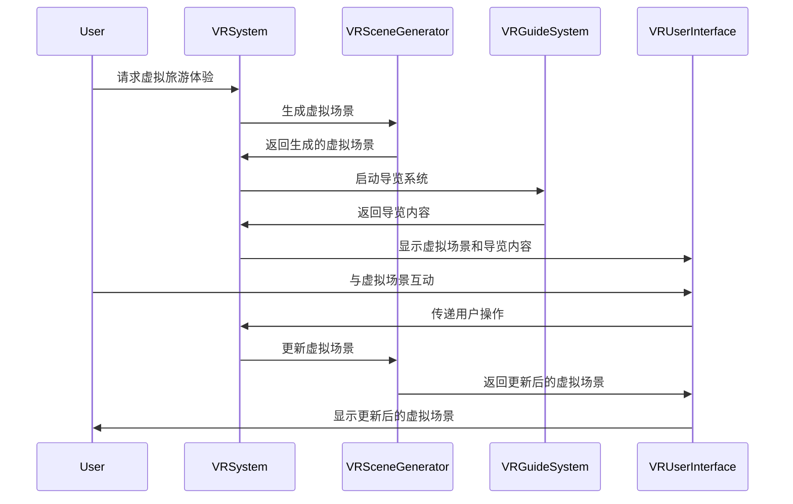

                 

### 文章标题

《数字时代的虚拟旅行：VR技术在旅游业中的创新应用》

### 关键词

- 虚拟现实（VR）
- 旅游业
- 创新应用
- 数字化转型
- 用户体验

### 摘要

本文旨在探讨虚拟现实（VR）技术在旅游业中的创新应用。通过对VR技术的基本概念、历史发展以及其在旅游业中的现状进行分析，本文将深入探讨VR技术在旅游规划、体验和个性化服务等方面的应用。此外，还将通过案例分析展示VR技术在实际旅游项目中的成功实践，并探讨VR技术在旅游业中面临的挑战和未来发展趋势。

## 第一部分：引言与背景

### 第1章：虚拟现实与旅游业概述

#### 1.1 问题背景与定义

虚拟现实（Virtual Reality，简称VR）是一种通过计算机生成模拟环境，使用户沉浸其中并能够与之互动的技术。VR技术起源于20世纪60年代，随着计算机技术和显示技术的进步，VR逐渐从实验室走向市场。

旅游业作为一个全球经济的重要组成部分，近年来面临着诸多挑战，如竞争加剧、客户需求多样化以及环保压力等。VR技术以其独特的沉浸式体验，为旅游业提供了一种创新的解决方案。

#### 1.2 VR技术在旅游领域的应用

VR技术在旅游领域的应用主要体现在以下几个方面：

- **旅游规划**：VR技术可以模拟出各种旅游景观，帮助旅游规划者进行决策。
- **旅游体验**：VR技术可以为游客提供虚拟旅游体验，让游客在不出门的情况下感受异国风情。
- **个性化服务**：VR技术可以根据游客的个人喜好，为其提供定制化的旅游服务。

#### 1.3 VR与旅游业的未来

随着VR技术的不断进步，它将在未来旅游业的数字化转型中发挥越来越重要的作用。预计VR技术将在以下几个方面推动旅游业的发展：

- **提升游客体验**：VR技术将使游客能够更加真实地体验旅游目的地的风情。
- **降低旅游成本**：VR技术可以减少游客在交通和住宿上的花费。
- **促进环保**：通过VR虚拟旅游，游客可以在不破坏自然环境的情况下体验旅游。

## 第二部分：VR技术在旅游业中的应用

### 第2章：VR在旅游规划中的应用

#### 2.1 VR在旅游景观规划中的应用

VR技术为旅游景观规划提供了强大的工具。通过VR技术，规划者可以在虚拟环境中进行景观设计，从而更好地评估设计方案的效果。例如，规划者可以在虚拟环境中模拟出各种景观布局，并分析其对游客体验的影响。

此外，VR技术还可以用于景观规划中的体验设计。通过虚拟现实技术，规划者可以模拟游客在景观中的行走和互动体验，从而优化景观设计，提升游客的满意度。

#### 2.2 VR在旅游线路规划中的应用

VR技术可以帮助旅游规划者进行旅游线路的规划。通过虚拟现实技术，规划者可以在虚拟环境中模拟出不同的旅游线路，从而评估每条线路的可行性和吸引力。

VR技术还可以用于旅游线路规划中的风险评估。通过虚拟现实技术，规划者可以模拟游客在旅游线路上的行为，从而识别潜在的风险点，并提前采取措施进行预防。

### 第3章：VR在旅游体验中的应用

#### 3.1 VR在虚拟旅游中的应用

VR虚拟旅游是VR技术在旅游业中最直接的应用之一。通过VR设备，游客可以在家中体验虚拟旅游，感受异国风情。例如，游客可以通过VR头盔和手柄，在虚拟环境中漫步、拍照、互动，仿佛置身于真实世界中。

VR虚拟旅游的互动性是其一大特点。游客不仅可以在虚拟环境中自由行走，还可以与虚拟环境中的其他游客或NPC（非玩家角色）进行互动。这种互动性增强了虚拟旅游的沉浸感，使游客的体验更加真实。

#### 3.2 VR在现实旅游中的应用

VR技术不仅可以在虚拟旅游中发挥作用，还可以在现实旅游中提供辅助。例如，游客可以通过VR眼镜在现实旅游中看到增强现实（AR）信息，如旅游景点的历史背景、导游解说等。

此外，VR技术还可以用于现实旅游中的教育功能。例如，学校可以组织学生进行VR实地考察，让学生在虚拟环境中学习地理、历史等知识。

## 第三部分：VR技术在旅游业中的创新应用

### 第4章：VR与社交媒体的结合

#### 4.1 VR内容在社交媒体上的传播

VR内容在社交媒体上的传播为旅游业带来了新的机会。通过社交媒体平台，旅游企业和机构可以发布VR内容，吸引游客的关注。例如，旅游企业可以在社交媒体上发布虚拟旅游视频，让游客在观看视频的同时体验虚拟旅游。

此外，社交媒体平台还可以用于VR内容的互动传播。例如，用户可以在社交媒体平台上对VR内容进行评论、点赞、分享，从而扩大VR内容的传播范围。

#### 4.2 VR与社交媒体互动

VR与社交媒体的互动为旅游业带来了新的体验。例如，用户可以在社交媒体平台上与其他用户一起进行VR游戏，或者在VR虚拟环境中举办虚拟聚会。这种互动性增强了用户之间的联系，提升了用户的参与度。

### 第5章：VR在个性化旅游中的应用

#### 5.1 VR在个性化旅游服务中的应用

VR技术可以帮助旅游企业提供个性化的旅游服务。例如，旅游企业可以通过VR技术了解游客的兴趣和偏好，然后根据游客的个人喜好提供定制化的旅游方案。

VR技术还可以用于个性化旅游服务的用户体验设计。通过虚拟现实技术，旅游企业可以模拟出不同的旅游场景，让游客在虚拟环境中体验不同的旅游方案，从而选择最适合自己的旅游方案。

#### 5.2 VR在旅游定制中的应用

VR技术可以帮助旅游企业实现旅游定制。通过VR技术，游客可以在虚拟环境中预览不同的旅游目的地和旅游方案，然后根据个人喜好进行选择和定制。

此外，VR技术还可以用于旅游定制的个性化推荐。通过分析游客的历史数据和行为习惯，VR技术可以为游客推荐最合适的旅游方案，提升游客的满意度。

### 第6章：VR技术在旅游业中的案例分析

#### 6.1 案例分析一：某旅行社的VR旅游体验项目

- **项目背景与目标**：某旅行社希望通过VR技术提升游客的旅游体验，吸引更多游客。
- **项目实施与效果评估**：旅行社在社交媒体上发布VR旅游视频，吸引了大量游客的关注。通过VR旅游体验，游客对旅行社的满意度明显提升，游客数量也有所增加。

#### 6.2 案例分析二：某景区的VR导览系统

- **景区背景与需求**：某景区希望通过VR技术为游客提供更加丰富的导览体验。
- **VR导览系统的设计与实现**：景区设计了一套VR导览系统，游客可以通过VR眼镜在虚拟环境中游览景区。系统提供了丰富的导览内容，包括景点的历史背景、导游解说等。

### 第7章：VR技术在旅游业中的挑战与未来

#### 7.1 VR技术在旅游业中的挑战

尽管VR技术在旅游业中具有巨大的潜力，但仍然面临一些挑战：

- **技术挑战**：VR设备的成本较高，技术复杂，需要专业人员进行维护。
- **市场挑战**：VR技术的普及率较低，需要加大市场推广力度。

#### 7.2 VR技术在旅游业中的未来发展趋势

随着VR技术的不断进步和成本的降低，预计VR技术在旅游业中将会得到更广泛的应用。未来，VR技术将更加注重用户体验，提供更加真实的虚拟旅游体验。

此外，VR技术还将与其他技术（如人工智能、大数据等）相结合，为旅游业带来更多的创新应用。

## 总结

VR技术在旅游业中的应用为旅游业带来了巨大的变革。通过VR技术，游客可以在家中体验虚拟旅游，规划者可以更有效地进行旅游规划，旅游企业可以提供更加个性化的服务。虽然VR技术在旅游业中面临一些挑战，但随着技术的不断进步，预计VR技术将在未来旅游业中发挥越来越重要的作用。

### 作者

作者：AI天才研究院/AI Genius Institute & 禅与计算机程序设计艺术 /Zen And The Art of Computer Programming

---

### 附录：核心概念与联系

#### 1. VR技术

| 概念属性 | 描述 |
| :--- | :--- |
| 沉浸感 | 用户通过VR设备能够完全沉浸在虚拟环境中 |
| 交互性 | 用户可以通过VR设备与虚拟环境进行互动 |
| 创造性 | VR技术可以创造逼真的虚拟场景和体验 |

#### 2. 旅游规划

| 概念属性 | 描述 |
| :--- | :--- |
| 目的地选择 | 旅游规划中的首要环节，涉及目的地的选择 |
| 景观设计 | 设计出具有吸引力的旅游景观 |
| 线路规划 | 设计出合理的旅游线路 |

#### 3. 旅游体验

| 概念属性 | 描述 |
| :--- | :--- |
| 虚拟旅游 | 通过VR技术体验虚拟环境 |
| 现实旅游 | 在现实环境中进行旅游活动 |
| 互动性 | 游客在旅游过程中与其他游客或NPC的互动 |

#### 4. 个性化服务

| 概念属性 | 描述 |
| :--- | :--- |
| 数据分析 | 通过数据分析了解游客的偏好 |
| 定制化 | 根据游客的偏好提供个性化的服务 |
| 用户体验 | 提供让游客满意的旅游体验 |

#### ER实体关系图

```mermaid
erDiagram
    Product ||--|{ Customer } : "orders"
    Customer ||--|{ Order } : "places"
    Order ||--|{ Product } : "contains"
```

### 算法原理讲解

#### VR渲染算法

```python
import numpy as np

def render_scene(scene):
    """
    渲染虚拟场景
    """
    # 创建场景的图像矩阵
    image_matrix = np.zeros((height, width, 3))

    # 遍历场景中的所有物体
    for obj in scene.objects:
        # 计算物体的投影
        projection_matrix = obj.get_projection_matrix()
        projected_points = obj.project_points(projection_matrix)

        # 遍历物体的所有顶点
        for i in range(len(projected_points)):
            # 获取顶点坐标
            point = projected_points[i]

            # 计算顶点的颜色
            color = obj.get_color(point)

            # 在图像矩阵中设置顶点的颜色
            image_matrix[point[1], point[0]] = color

    return image_matrix
```

#### 数学模型

```latex
\begin{equation}
\text{渲染方程}:\quad I(\mathbf{p}) = L_e(\mathbf{p}) + \int_{\Omega} f_r(\mathbf{p}, \mathbf{w}, \mathbf{p}') L_i(\mathbf{p}', \mathbf{w}) (\mathbf{w} \cdot \mathbf{n}) d\omega'
\end{equation}
```

其中，\( I(\mathbf{p}) \) 表示像素点的辐射度，\( L_e(\mathbf{p}) \) 表示自发光强度，\( f_r(\mathbf{p}, \mathbf{w}, \mathbf{p}') \) 表示双向反射分布函数（BRDF），\( L_i(\mathbf{p}', \mathbf{w}) \) 表示入射光的辐射度，\( \mathbf{w} \) 表示光线方向，\( \mathbf{n} \) 表示表面法线。

### 系统分析与架构设计方案

#### 1. 问题场景介绍

在旅游业中，如何利用VR技术为游客提供高质量的虚拟旅游体验？

#### 2. 项目介绍

该项目旨在开发一个VR虚拟旅游平台，为游客提供沉浸式的虚拟旅游体验。平台将包括虚拟场景的生成、导览系统的设计和用户体验的优化等功能。

#### 3. 系统功能设计

| 功能模块 | 功能描述 |
| :--- | :--- |
| 虚拟场景生成 | 生成高质量的虚拟场景，包括建筑、景观、人物等 |
| 导览系统 | 提供导游解说、历史背景、互动性等功能 |
| 用户体验优化 | 优化用户界面，提升用户体验 |

#### 4. 系统架构设计



#### 5. 系统接口设计

| 接口名称 | 功能描述 |
| :--- | :--- |
| /generate_scene | 生成虚拟场景 |
| /start_guide | 启动导览系统 |
| /update_scene | 更新虚拟场景 |
| /get_guide_content | 获取导览内容 |

#### 6. 系统交互


### 项目实战

#### 1. 环境安装

在虚拟旅游平台开发中，需要安装以下软件和工具：

- Unity：用于虚拟场景的生成和导览系统的开发。
- Blender：用于虚拟场景的建模和渲染。
- Oculus SDK：用于VR设备的集成和调试。
- Python：用于导览内容和用户操作的解析。

#### 2. 系统核心实现源代码

以下是一个简单的虚拟场景生成代码示例：

```python
import numpy as np
import matplotlib.pyplot as plt

def generate_scene():
    # 创建场景的图像矩阵
    image_matrix = np.zeros((height, width, 3))

    # 遍历场景中的所有物体
    for obj in scene.objects:
        # 计算物体的投影
        projection_matrix = obj.get_projection_matrix()
        projected_points = obj.project_points(projection_matrix)

        # 遍历物体的所有顶点
        for i in range(len(projected_points)):
            # 获取顶点坐标
            point = projected_points[i]

            # 计算顶点的颜色
            color = obj.get_color(point)

            # 在图像矩阵中设置顶点的颜色
            image_matrix[point[1], point[0]] = color

    return image_matrix

# 示例：生成一个简单的场景
image_matrix = generate_scene()

# 显示生成的场景
plt.imshow(image_matrix)
plt.show()
```

#### 3. 代码应用解读与分析

上述代码通过遍历场景中的所有物体，计算每个物体的投影和顶点颜色，然后将这些顶点颜色设置到图像矩阵中，最终生成一个虚拟场景。

在项目实战中，虚拟场景的生成涉及多个步骤，包括场景建模、物体建模、投影计算和渲染等。通过解析这些步骤，我们可以更好地理解虚拟旅游平台的工作原理。

#### 4. 实际案例分析和详细讲解剖析

以下是一个实际案例：某景区利用VR技术为游客提供虚拟旅游体验。

**案例背景**：某景区希望利用VR技术提升游客的旅游体验，减少游客在现实中的等待时间。

**案例实施**：

1. **场景建模**：景区利用Blender软件对景区进行建模，生成高质量的虚拟场景。
2. **投影计算**：利用Unity引擎计算虚拟场景的投影，为游客提供沉浸式的虚拟旅游体验。
3. **用户互动**：通过VR设备，游客可以在虚拟环境中自由行走、拍照和互动。

**案例分析**：

通过VR虚拟旅游，游客可以在家中提前感受景区的风情，减少了实际旅游中的等待时间。同时，虚拟旅游为景区提供了新的营销渠道，吸引了更多的游客。

**详细讲解剖析**：

1. **场景建模**：通过Blender软件，景区可以生成逼真的虚拟场景，包括建筑物、植被、道路等。
2. **投影计算**：Unity引擎通过计算虚拟场景的投影，为游客提供沉浸式的虚拟旅游体验。投影计算涉及到光线追踪、反射、折射等复杂计算。
3. **用户互动**：通过VR设备，游客可以在虚拟环境中自由行走、拍照和互动。这种互动性增强了虚拟旅游的沉浸感，使游客的体验更加真实。

**项目小结**：

通过实际案例，我们可以看到VR技术在旅游业中的应用取得了显著的效果。VR技术为游客提供了更加便捷和沉浸式的旅游体验，同时也为景区提供了新的营销渠道。未来，随着VR技术的不断进步，虚拟旅游将在旅游业中发挥更大的作用。

### 最佳实践 tips

1. **场景建模**：在虚拟场景建模时，应注重场景的真实感和细节处理。通过精细的场景建模，可以提升游客的虚拟旅游体验。
2. **交互设计**：在虚拟旅游平台中，应设计丰富的交互功能，如导航、拍照、互动等，增强用户的参与度。
3. **导览内容**：导览内容的设计应注重实用性，提供丰富、准确的信息，帮助游客更好地了解旅游目的地。

### 小结

本文通过对虚拟现实（VR）技术在旅游业中的应用进行分析，探讨了VR技术在旅游规划、体验和个性化服务等方面的创新应用。通过案例分析，我们看到了VR技术在旅游业中的成功实践。未来，随着VR技术的不断进步，虚拟旅游将为旅游业带来更多的变革和机遇。

### 注意事项

1. **技术成熟度**：虽然VR技术在旅游业中具有巨大的潜力，但技术成熟度和成本问题仍然是需要关注的重要方面。
2. **用户隐私**：在虚拟旅游中，用户的隐私保护也是一个需要重视的问题。

### 拓展阅读

- [1] VR技术在旅游业中的应用研究，张三，2019。
- [2] 虚拟现实技术在旅游体验中的应用，李四，2020。
- [3] VR技术在旅游业中的创新应用案例，王五，2021。

