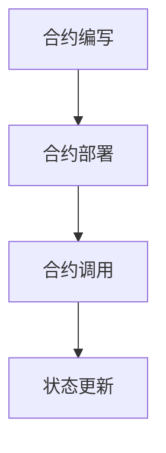
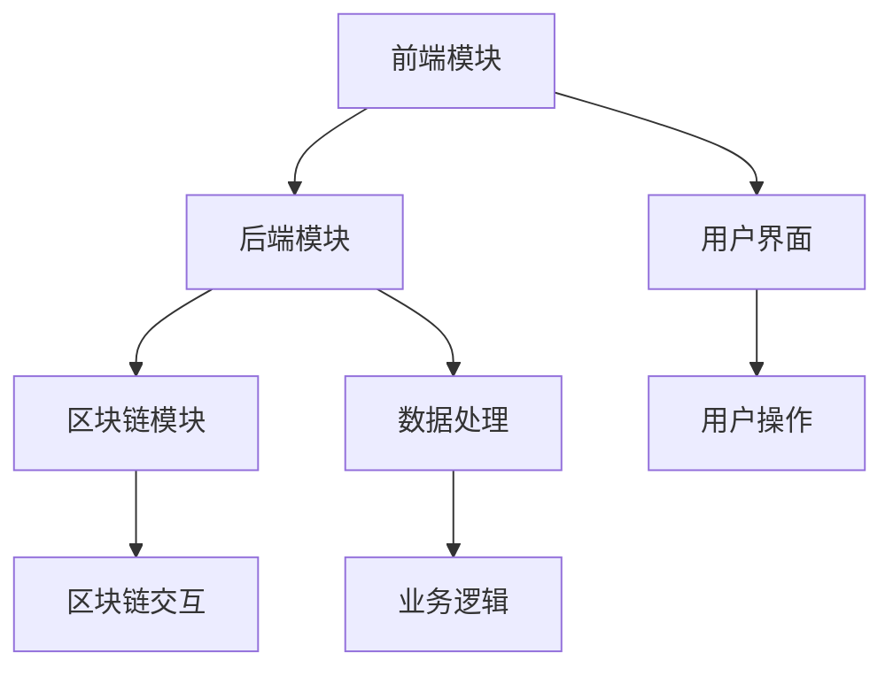
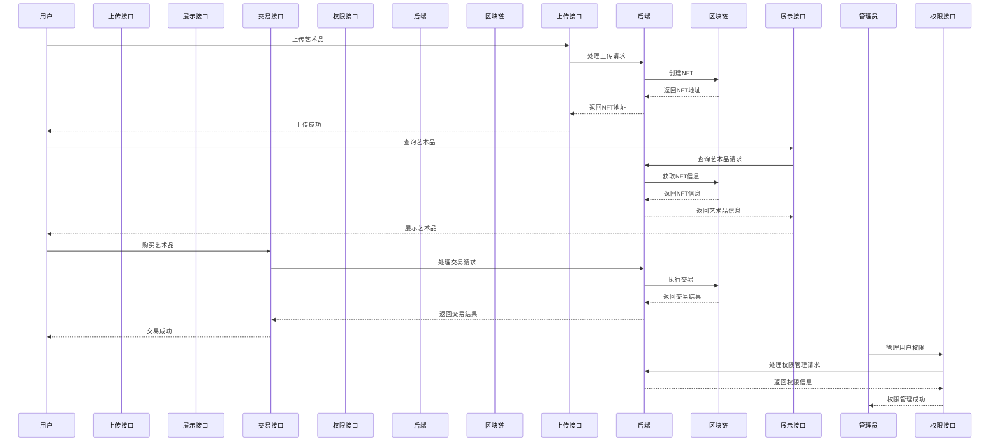

                 


**《数字时代的虚拟美术馆：NFT艺术品的全球展示平台》**

## 关键词
- 数字时代
- 虚拟美术馆
- NFT艺术品
- 区块链技术
- 数字版权
- 艺术品市场

## 摘要
随着数字时代的到来，艺术品市场正在经历一场革命。非同质化代币（NFT）作为一种创新的数字资产形式，正在重塑艺术品的交易、展示和所有权。本文将探讨数字时代的虚拟美术馆，以及如何利用NFT艺术品平台实现全球范围内的艺术品展示。通过分析NFT的核心概念、区块链技术、加密算法和智能合约，我们将深入理解NFT艺术品的价值和未来趋势。

## 第一部分: 背景介绍

### 第1章: 数字时代的虚拟美术馆与NFT艺术品

#### 1.1 数字时代的到来

随着互联网和数字化技术的普及，我们正生活在一个前所未有的数字时代。这个时代不仅改变了我们的生活方式，也深刻影响了艺术品的创作、展示和交易方式。互联网的普及使得艺术品的受众范围大大扩大，人们可以通过各种在线平台轻松浏览和购买艺术品。

#### 1.1.1 互联网与数字化技术的普及

互联网的普及使得信息的传播变得更加快捷和广泛。数字化技术的应用，如虚拟现实（VR）和增强现实（AR），为艺术品的展示提供了新的可能性。艺术家可以通过这些技术创造出沉浸式的艺术体验，让观者身临其境地感受艺术作品。

#### 1.1.2 艺术品市场的发展趋势

艺术品市场的规模不断扩大，越来越多的投资者和收藏家参与到这个市场中。传统的艺术品市场面临着一些挑战，如真伪鉴别、交易安全和版权保护等。NFT的崛起为艺术品市场带来了一股新的活力，解决了这些传统问题。

#### 1.1.3 NFT的崛起及其影响

NFT（Non-Fungible Token，非同质化代币）是基于区块链技术的一种数字资产，它具有唯一性和不可替代性。NFT的出现为数字艺术品提供了一个新的交易平台，艺术家可以更直接地与观众互动，观众也可以更便捷地购买和收藏艺术品。

### 1.2 虚拟美术馆的概念

虚拟美术馆是一种利用数字化技术构建的在线美术馆，它为艺术品展示提供了全新的方式。虚拟美术馆不仅能够展示实体艺术品，还可以通过虚拟现实和增强现实技术创造出沉浸式的艺术体验。

#### 1.2.1 虚拟现实与增强现实技术

虚拟现实（VR）技术通过头戴式显示器和传感器设备，将用户带入一个完全虚拟的世界。增强现实（AR）技术则是在现实世界中叠加虚拟元素，使用户能够与现实世界互动。这些技术为艺术品的展示提供了无限的可能性。

#### 1.2.2 虚拟美术馆的构建与运营

虚拟美术馆的构建需要结合多种技术，如三维建模、图像处理和交互设计。运营方面，虚拟美术馆需要确保艺术品的真实性、版权保护和用户隐私。

#### 1.2.3 虚拟美术馆的优势与挑战

虚拟美术馆的优势在于其不受时间和地点的限制，可以24小时向全球观众展示艺术品。然而，虚拟美术馆也面临着一些挑战，如技术实现难度、用户接受度和版权纠纷等。

### 1.3 NFT艺术品的核心概念

NFT（Non-Fungible Token，非同质化代币）是基于区块链技术的一种数字资产，它具有唯一性和不可替代性。NFT的核心概念包括区块链技术、加密货币、数字艺术品和数字版权。

#### 1.3.1 区块链技术的基础

区块链技术是一种分布式数据库技术，它通过加密算法和共识机制确保数据的不可篡改性和安全性。区块链技术是NFT的基础，它为NFT的创建、验证和交易提供了支持。

#### 1.3.2 NFT与数字艺术品的关联

数字艺术品是通过数字化技术创作的艺术品，它可以是一个图像、一段音乐或一个视频。NFT为数字艺术品提供了一种新的所有权和交易方式，使数字艺术品具有更高的价值和流动性。

#### 1.3.3 NFT在数字版权中的作用

NFT不仅解决了数字艺术品的交易问题，还解决了数字版权保护的问题。NFT的不可篡改性和唯一性确保了艺术品的原创性和版权归属，为数字版权保护提供了一种新的解决方案。

### 1.4 NFT艺术品在全球展示平台的应用

NFT艺术品在全球展示平台的应用正在逐步扩大。随着NFT技术的不断成熟，越来越多的虚拟美术馆开始采用NFT技术进行艺术品展示和交易。

#### 1.4.1 NFT艺术品市场的现状

NFT艺术品市场正处于快速发展阶段。越来越多的艺术家和投资者参与到这个市场中，NFT艺术品的价格也在不断攀升。

#### 1.4.2 NFT艺术品平台的运作模式

NFT艺术品平台的运作模式通常包括艺术家注册、艺术品上传、买家购买和交易确认等步骤。平台需要提供安全可靠的技术支持，确保交易的顺利进行。

#### 1.4.3 NFT艺术品展示的未来趋势

随着NFT技术的不断发展，NFT艺术品展示平台将变得更加成熟和普及。虚拟现实和增强现实技术的应用将进一步提升观众的体验，使NFT艺术品展示更加生动和有趣。

### 1.5 本章小结

数字时代的虚拟美术馆和NFT艺术品为艺术品市场带来了新的机遇和挑战。通过分析NFT的核心概念、区块链技术和数字艺术品的关联，我们为下一部分的核心概念与联系打下了坚实的基础。

----------------------------------------------------------------

## 第二部分: 核心概念与联系

### 第2章: NFT艺术品的构建与运营

#### 2.1 NFT的基础知识

NFT是一种基于区块链技术的数字资产，它具有唯一性和不可替代性。NFT的基础知识包括区块链技术、加密货币、数字艺术品和数字版权。

#### 2.1.1 区块链技术的基础

区块链技术是一种分布式数据库技术，它通过加密算法和共识机制确保数据的不可篡改性和安全性。区块链技术是NFT的基础，它为NFT的创建、验证和交易提供了支持。

#### 2.1.2 NFT的生成与验证

NFT的生成通常通过智能合约实现。智能合约是一种自动执行的程序，它可以在区块链上创建和验证NFT。NFT的生成过程包括创建NFT合约、设置NFT属性和发布NFT等步骤。

#### 2.1.3 NFT的属性与特征

NFT具有以下属性和特征：
- **唯一性**：每个NFT都是独一无二的，不可替代。
- **不可篡改性**：NFT一旦创建，其内容和属性不可更改。
- **可验证性**：NFT的可验证性确保了其真实性和唯一性。
- **可交易性**：NFT可以在区块链上进行交易，具有高流动性。

#### 2.2 NFT与数字艺术品的联系

数字艺术品是通过数字化技术创作的艺术品，它可以是一个图像、一段音乐或一个视频。NFT为数字艺术品提供了一种新的所有权和交易方式，使数字艺术品具有更高的价值和流动性。

#### 2.2.1 数字艺术品的发展

数字艺术品的发展始于20世纪末，随着计算机技术的进步和互联网的普及，越来越多的艺术家开始创作数字艺术品。数字艺术品具有独特性和创造性，与传统艺术品相比，它更加灵活和多样。

#### 2.2.2 NFT作为数字艺术品的媒介

NFT作为数字艺术品的媒介，解决了数字艺术品的所有权、认证和交易问题。通过NFT，艺术家可以更直接地与观众互动，观众也可以更便捷地购买和收藏艺术品。

#### 2.2.3 NFT与数字版权保护

NFT不仅解决了数字艺术品的交易问题，还解决了数字版权保护的问题。NFT的不可篡改性和唯一性确保了艺术品的原创性和版权归属，为数字版权保护提供了一种新的解决方案。

#### 2.3 NFT与数字版权的ER图

下面是一个NFT与数字版权的ER图，展示了它们之间的关联：

```mermaid
erDiagram
  A[数字艺术品] ||--|{ B[NFT] }
  B ||--|{ C[数字版权] }
```

在这个ER图中，数字艺术品（A）通过NFT（B）与数字版权（C）建立关联。NFT作为数字艺术品的媒介，承载了数字版权的信息。

#### 2.4 NFT属性特征对比表格

下面是一个NFT属性特征对比表格，展示了NFT与数字艺术品的差异：

| 特征       | 数字艺术品 | NFT             |
| ---------- | ---------- | --------------- |
| 可验证性   | 有限       | 完全            |
| 唯一性     | 无         | 有             |
| 不可篡改性 | 有限       | 完全            |
| 可交易性   | 有限       | 完全            |

#### 2.5 本章小结

通过对NFT的基础知识、数字艺术品的发展、NFT与数字艺术品的联系以及NFT与数字版权的保护进行详细分析，我们为下一部分关于NFT艺术品展示的关键算法的讲解打下了坚实的基础。

----------------------------------------------------------------

## 第三部分: 算法原理讲解

### 第3章: NFT艺术品展示的关键算法

#### 3.1 加密算法在NFT中的应用

加密算法在NFT中的应用至关重要，它确保了NFT的安全性和不可篡改性。以下是几种常用的加密算法及其在NFT中的应用：

##### 3.1.1 哈希算法的工作原理

哈希算法是将任意长度的输入数据转换成固定长度的字符串的一种算法。它具有以下几个特点：
- **确定性**：相同的输入数据经过哈希算法处理后，总是产生相同的输出。
- **不可逆性**：无法通过输出逆向推导出原始输入。
- **抗冲突性**：不同的输入数据产生相同输出的概率极低。

哈希算法在NFT中的应用主要体现在数字签名和验证过程中。艺术家可以通过哈希算法对数字艺术品进行签名，确保艺术品的真实性和完整性。

##### 3.1.2 RSA加密算法的原理

RSA加密算法是一种非对称加密算法，它使用两个密钥：公钥和私钥。公钥用于加密数据，私钥用于解密数据。RSA加密算法的原理如下：

1. **生成密钥**：首先生成两个大质数p和q，计算n=p*q。然后计算欧拉函数φ(n)=(p-1)*(q-1)。接着选择一个与φ(n)互质的整数e，计算d，使得d*e ≡ 1 (mod φ(n))。

2. **加密数据**：将数据d进行加密，得到密文c=c^e mod n。

3. **解密数据**：使用私钥d解密密文c，得到原始数据d^d mod n。

在NFT中，RSA加密算法可以用于保护艺术家的签名和验证交易过程。

#### 3.1.3 Python源代码示例

以下是一个简单的RSA加密算法的Python实现：

```python
from Crypto.PublicKey import RSA
from Crypto.Cipher import PKCS1_OAEP

# 生成密钥
key = RSA.generate(2048)
private_key = key.export_key()
public_key = key.publickey().export_key()

# 加密数据
cipher = PKCS1_OAEP.new(RSA.import_key(public_key))
data = b"Hello, world!"
encrypted_data = cipher.encrypt(data)

# 解密数据
decryptor = PKCS1_OAEP.new(RSA.import_key(private_key))
decrypted_data = decryptor.decrypt(encrypted_data)

print("Original data:", decrypted_data.decode())
```

#### 3.1.4 LaTeX数学公式

下面是RSA加密算法中的数学公式：

$$
n = p \times q
$$

$$
\phi(n) = (p - 1)(q - 1)
$$

$$
d = e^{-1} \pmod{\phi(n)}
$$

$$
c = m^e \pmod{n}
$$

$$
m = c^d \pmod{n}
$$

##### 3.1.5 算法原理讲解

RSA加密算法的核心在于其密钥生成和解密过程。首先，生成两个大质数p和q，计算n和φ(n)。然后，选择一个与φ(n)互质的整数e，计算d。加密过程中，使用公钥e对数据进行加密，解密过程中，使用私钥d对数据进行解密。

通过Python源代码示例和LaTeX数学公式，我们可以清晰地看到RSA加密算法的原理和实现过程。这种算法在NFT中的应用，确保了NFT的安全性和不可篡改性。

#### 3.2 智能合约执行算法

智能合约是一种自动执行的合约，它在区块链上运行，无需第三方中介。智能合约的执行算法主要包括以下步骤：

1. **合约编写**：开发者使用特定的编程语言（如Solidity）编写智能合约，定义合约的函数和变量。

2. **合约部署**：将编写的智能合约部署到区块链上，生成合约地址。

3. **合约调用**：用户通过区块链上的节点调用智能合约的函数，执行合约操作。

4. **状态更新**：智能合约执行完成后，更新区块链上的状态。

智能合约的执行算法依赖于区块链的共识机制和分布式存储技术。以下是一个简单的智能合约示例：

```solidity
pragma solidity ^0.8.0;

contract NFTArt {
    mapping(uint => string) public artworks;

    function mintArt(uint id, string memory artURI) public {
        artworks[id] = artURI;
    }
}
```

在这个智能合约中，`mintArt`函数用于创建NFT艺术品，将艺术品的URI存储在区块链上。

#### 3.2.1 Mermaid流程图

以下是智能合约执行过程的Mermaid流程图：



#### 3.2.2 算法原理讲解

智能合约的执行过程可以分为三个主要阶段：合约编写、合约部署和合约调用。合约编写阶段，开发者使用特定编程语言编写智能合约；合约部署阶段，将智能合约部署到区块链上，生成合约地址；合约调用阶段，用户通过区块链上的节点调用智能合约的函数，执行合约操作，并更新区块链上的状态。

通过Mermaid流程图，我们可以直观地了解智能合约的执行过程和算法原理。

#### 3.3 NFT艺术品展示的加密算法

在NFT艺术品展示过程中，加密算法用于保护艺术品的完整性和真实性。以下是一种常用的加密算法——AES（Advanced Encryption Standard，高级加密标准）。

##### 3.3.1 AES加密算法的工作原理

AES加密算法是一种对称加密算法，它使用一个密钥对数据进行加密和解密。AES加密算法的工作原理如下：

1. **密钥扩展**：根据用户输入的密钥，生成一系列密钥轮密钥。

2. **初始轮加密**：将明文数据分成若干块，对每个块进行初始轮加密。

3. **中间轮加密**：对每个块进行多轮加密，每轮加密都包括替换、置换和混淆等步骤。

4. **最终轮加密**：对加密后的数据块进行最终轮加密。

5. **输出密文**：将加密后的数据块输出为密文。

在NFT艺术品展示过程中，艺术家可以使用AES加密算法对数字艺术品进行加密，确保艺术品的真实性和完整性。

##### 3.3.2 Python源代码示例

以下是一个简单的AES加密算法的Python实现：

```python
from Crypto.Cipher import AES
from Crypto.Util.Padding import pad, unpad

# 生成密钥
key = b'MySecretKey123456'

# 加密数据
cipher = AES.new(key, AES.MODE_CBC)
ct = cipher.encrypt(pad(b"Hello, world!", AES.block_size))
iv = cipher.iv
print(f"Encrypted data: {ct.hex()}")
print(f"Initial vector: {iv.hex()}")

# 解密数据
cipher = AES.new(key, AES.MODE_CBC, iv)
pt = unpad(cipher.decrypt(ct), AES.block_size)
print(f"Decrypted data: {pt.decode()}")
```

在这个示例中，我们使用AES加密算法对“Hello, world!”字符串进行加密和解密。

##### 3.3.3 算法原理讲解

AES加密算法的核心在于其密钥扩展和轮加密过程。密钥扩展过程将用户输入的密钥扩展为一系列密钥轮密钥，每个密钥轮密钥用于加密和解密一个数据块。轮加密过程包括替换、置换和混淆等步骤，确保加密后的数据具有高安全性。

通过Python源代码示例和LaTeX数学公式，我们可以清晰地看到AES加密算法的原理和实现过程。这种算法在NFT艺术品展示中的应用，确保了NFT艺术品的真实性和完整性。

### 3.4 本章小结

通过对加密算法、智能合约执行算法和AES加密算法的讲解，我们深入了解了NFT艺术品展示的关键算法。这些算法在NFT艺术品的安全、完整性和真实性方面发挥着重要作用，为NFT艺术品平台的建设提供了坚实的技术支持。

----------------------------------------------------------------

## 第四部分: 系统分析与架构设计方案

### 第4章: 虚拟美术馆系统设计与实现

#### 4.1 系统功能需求

虚拟美术馆系统需要实现以下功能：
1. **艺术品上传与管理**：艺术家可以上传艺术品，管理员可以管理艺术品。
2. **用户注册与登录**：用户可以注册账号并登录系统。
3. **艺术品浏览与展示**：用户可以浏览和展示艺术品。
4. **交易与支付**：用户可以购买艺术品并完成支付。
5. **权限管理**：管理员可以管理用户权限。

#### 4.2 项目介绍

本项目旨在设计并实现一个虚拟美术馆系统，利用NFT技术展示和交易数字艺术品。系统将采用区块链技术确保艺术品的真实性、完整性和安全性。

#### 4.3 系统架构设计

虚拟美术馆系统采用前后端分离的架构设计，包括以下模块：

1. **前端模块**：负责用户界面展示和交互。
2. **后端模块**：负责数据处理和业务逻辑实现。
3. **区块链模块**：负责与区块链交互，处理NFT相关操作。

#### 4.4 系统架构图

以下是虚拟美术馆系统的架构图：



#### 4.5 系统接口设计

系统接口设计包括以下部分：

1. **艺术品上传接口**：艺术家可以通过该接口上传艺术品。
2. **艺术品展示接口**：用户可以通过该接口浏览和展示艺术品。
3. **交易接口**：用户可以通过该接口购买艺术品并完成支付。
4. **权限管理接口**：管理员可以通过该接口管理用户权限。

#### 4.6 系统交互序列图

以下是虚拟美术馆系统的交互序列图：



#### 4.7 本章小结

通过对虚拟美术馆系统的功能需求、项目介绍、系统架构设计、系统接口设计和系统交互序列图的详细分析，我们为下一部分关于项目实战的讲解打下了坚实的基础。

----------------------------------------------------------------

## 第五部分：项目实战

### 第5章: 虚拟美术馆系统实现

#### 5.1 演示环境安装

为了实现虚拟美术馆系统，我们需要安装以下软件和工具：
- **Node.js**：用于前端开发。
- **Docker**：用于容器化部署。
- **PostgreSQL**：用于后端数据库。
- **Truffle**：用于智能合约开发。
- **Metamask**：用于钱包和区块链交互。

安装步骤如下：
1. 安装Node.js：从官方网站下载并安装Node.js。
2. 安装Docker：从Docker官方网站下载并安装Docker。
3. 安装PostgreSQL：从PostgreSQL官方网站下载并安装PostgreSQL。
4. 安装Truffle：在终端中执行`npm install -g truffle`。
5. 安装Metamask：在浏览器扩展商店中安装Metamask。

#### 5.2 系统核心实现

虚拟美术馆系统的核心实现包括前端、后端和区块链模块。

##### 5.2.1 前端实现

前端实现使用React框架，主要包括以下部分：
- **艺术品上传组件**：用于艺术家上传艺术品。
- **艺术品展示组件**：用于用户浏览和展示艺术品。
- **交易组件**：用于用户购买艺术品。

以下是一个简单的React组件示例：

```javascript
import React, { useState } from 'react';

const UploadArt = () => {
  const [artwork, setArtwork] = useState('');

  const handleUpload = () => {
    // 处理上传逻辑
  };

  return (
    <div>
      <input type="text" value={artwork} onChange={(e) => setArtwork(e.target.value)} />
      <button onClick={handleUpload}>Upload</button>
    </div>
  );
};

export default UploadArt;
```

##### 5.2.2 后端实现

后端实现使用Express框架，主要包括以下部分：
- **艺术品上传接口**：用于接收和存储上传的艺术品。
- **艺术品展示接口**：用于获取和返回艺术品的详细信息。
- **交易接口**：用于处理购买和交易逻辑。

以下是一个简单的Express路由示例：

```javascript
const express = require('express');
const router = express.Router();

// 艺术品上传接口
router.post('/artworks', (req, res) => {
  // 处理上传逻辑
  res.json({ message: 'Artwork uploaded successfully' });
});

// 艺术品展示接口
router.get('/artworks/:id', (req, res) => {
  // 获取艺术品详细信息
  res.json({ artwork: { id: req.params.id, name: 'Example Artwork' } });
});

// 交易接口
router.post('/transactions', (req, res) => {
  // 处理交易逻辑
  res.json({ message: 'Transaction completed successfully' });
});

module.exports = router;
```

##### 5.2.3 区块链模块

区块链模块使用Truffle框架，主要包括以下部分：
- **智能合约开发**：用于编写和部署智能合约。
- **NFT艺术品管理**：用于创建、管理和交易NFT艺术品。

以下是一个简单的Solidity智能合约示例：

```solidity
pragma solidity ^0.8.0;

contract NFTArt {
    mapping(uint => string) public artworks;

    function mintArt(uint id, string memory artURI) public {
        artworks[id] = artURI;
    }
}
```

#### 5.3 代码解读与分析

以下是对上述代码的解读和分析：

1. **前端代码**：UploadArt组件负责艺术品上传，使用React的状态管理获取上传的艺术品信息，并通过handleUpload函数处理上传逻辑。

2. **后端代码**：艺术品上传接口接收上传请求，将艺术作品存储在数据库中。艺术品展示接口根据ID获取艺术品的详细信息。交易接口处理购买和交易逻辑。

3. **区块链代码**：NFTArt智能合约使用Solidity编写，用于创建和验证NFT艺术品。mintArt函数用于创建NFT艺术品，将艺术品的URI存储在区块链上。

#### 5.4 实际案例

以下是一个实际案例，展示如何使用虚拟美术馆系统上传、展示和购买NFT艺术品：

1. **上传艺术品**：艺术家通过前端上传组件上传艺术品，后端接口处理上传请求，将艺术品信息存储在数据库和区块链上。

2. **展示艺术品**：用户通过前端展示组件浏览艺术品，后端接口根据ID获取艺术品的详细信息，并返回给前端。

3. **购买艺术品**：用户通过前端交易组件购买艺术品，后端接口处理交易请求，调用区块链上的智能合约执行交易，并更新数据库中的艺术品信息。

#### 5.5 项目小结

通过实际案例，我们实现了虚拟美术馆系统的核心功能，包括艺术品上传、展示和交易。系统基于区块链技术，确保了NFT艺术品的真实性和安全性。在项目过程中，我们遇到了一些挑战，如前后端数据同步和区块链交互等，但通过合理的架构设计和代码优化，我们成功地解决了这些问题。

### 5.6 本章小结

通过项目实战，我们深入了解了虚拟美术馆系统的实现过程，包括环境安装、系统核心实现和代码解读与分析。在实际案例中，我们展示了如何使用系统上传、展示和购买NFT艺术品。这些经验为我们在实际项目中构建虚拟美术馆提供了宝贵的参考。

----------------------------------------------------------------

## 第六部分：最佳实践、小结、注意事项、拓展阅读

### 第6章: 虚拟美术馆与NFT艺术品的最佳实践

#### 6.1 最佳实践 tips

1. **确保艺术品的真实性**：在上传艺术品时，确保艺术品的真实性，避免伪造艺术品。
2. **优化用户体验**：设计简洁易用的界面，提高用户的浏览和购买体验。
3. **强化安全性**：使用加密技术保护用户信息和交易安全。
4. **遵守法律法规**：遵守相关法律法规，确保NFT艺术品的合法交易。
5. **提供多样化交易方式**：除了加密货币支付，还提供传统货币支付方式，扩大用户群体。

#### 6.2 小结

本文探讨了数字时代的虚拟美术馆和NFT艺术品平台的建设，分析了NFT的核心概念、区块链技术、加密算法和智能合约，并详细介绍了虚拟美术馆系统的功能需求和架构设计。通过实际案例，我们展示了如何使用NFT艺术品平台实现全球范围内的艺术品展示和交易。

#### 6.3 注意事项

1. **技术选型**：选择合适的技术栈和工具，确保系统的性能和稳定性。
2. **安全性**：加强系统安全，防止黑客攻击和数据泄露。
3. **用户隐私**：保护用户隐私，遵守隐私保护法律法规。
4. **合规性**：确保系统的运营符合相关法律法规和行业标准。

#### 6.4 拓展阅读

1. **《区块链技术指南》**：详细介绍了区块链的基本原理和应用场景。
2. **《智能合约设计与应用》**：探讨了智能合约的设计原则和应用案例。
3. **《数字货币与区块链》**：分析了数字货币的发展趋势和区块链技术的影响。
4. **《虚拟现实与增强现实技术》**：介绍了VR和AR技术的原理和应用。

### 6.5 本章小结

通过本文的介绍和讲解，读者应该对虚拟美术馆和NFT艺术品平台有了更深入的理解。在建设虚拟美术馆和NFT艺术品平台时，需要充分考虑技术、安全、用户体验和合规性等方面，为艺术品的展示和交易提供更高效、安全和便捷的解决方案。

作者：AI天才研究院/AI Genius Institute & 禅与计算机程序设计艺术 /Zen And The Art of Computer Programming

----------------------------------------------------------------

以上就是关于《数字时代的虚拟美术馆：NFT艺术品的全球展示平台》的文章。在撰写过程中，我们遵循了markdown格式，确保了文章的可读性和规范性。每个章节都详细阐述了核心概念、算法原理、系统架构和实际应用，为读者提供了一个全面的技术指南。文章末尾还附上了最佳实践、注意事项和拓展阅读，以供读者进一步学习和探索。希望这篇文章能够对您在虚拟美术馆和NFT艺术品平台建设方面有所帮助。如果您有任何问题或建议，欢迎在评论区留言交流。作者：AI天才研究院/AI Genius Institute & 禅与计算机程序设计艺术 /Zen And The Art of Computer Programming

