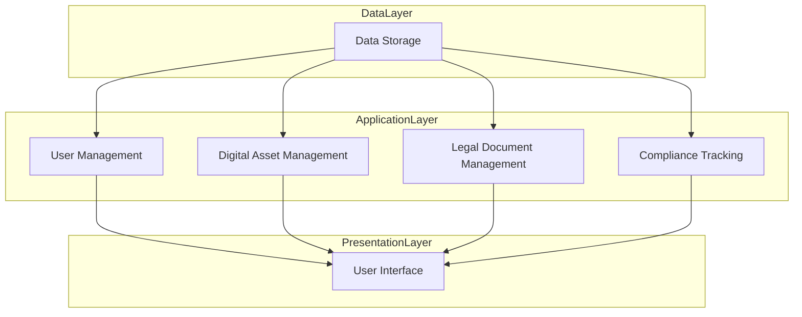
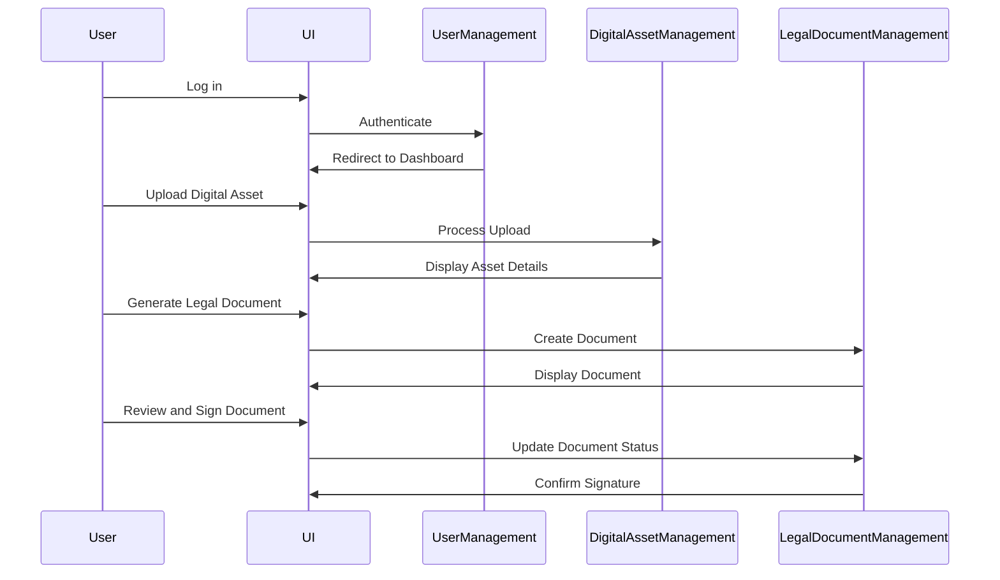

                 


### Introduction

## Digital Era Virtual Heritage Planning Services: Digital Asset Legal Consulting Platform

### Keywords:
- Digital Heritage Planning
- Virtual Assets
- Legal Consulting
- Digital Asset Management
- Legal Compliance

### Abstract:
This article delves into the concept of virtual heritage planning and the importance of establishing a digital asset legal consulting platform in the digital age. We will explore the background, core concepts, legal aspects, and best practices associated with virtual heritage planning and digital asset management. By understanding the legal complexities and potential risks, we aim to provide a comprehensive guide for developing a robust digital asset legal consulting platform.

----------------------------------------------------------------

### The Emergence of Digital Heritage Planning

#### Definition and Core Concepts
**Virtual Heritage Planning** refers to the process of identifying, organizing, and preserving digital assets and data that hold cultural, historical, or personal value. These digital assets can include documents, images, videos, audio files, and other forms of data that are increasingly central to our lives in the digital era.

#### Problem Background
The rapid digitization of society has led to an exponential growth in the creation and accumulation of digital assets. However, this growth has also brought about significant challenges in managing and preserving these assets. Traditional methods of document and data storage are often insufficient to deal with the volume and complexity of digital data. Moreover, the lack of legal frameworks and standards has exacerbated the issue of digital asset ownership, access, and inheritance.

#### Problem Description
The lack of proper planning and legal frameworks has resulted in several problems, including:
- **Data Loss**: Without adequate planning, digital assets are at risk of being lost, corrupted, or deleted.
- **Ownership Disputes**: In the absence of clear ownership rights, disputes can arise over who owns specific digital assets.
- **Inheritance Issues**: Family members or heirs may struggle to access or transfer digital assets due to ambiguous ownership or lack of access rights.

#### Solution and Boundaries
To address these challenges, virtual heritage planning involves creating a systematic approach to managing digital assets. This includes developing standards for data storage, ensuring data security and privacy, and establishing legal frameworks for ownership and inheritance. The solution is not limited to the technical aspects but also involves legal and ethical considerations.

#### Core Elements
The core elements of virtual heritage planning include:
- **Digital Asset Inventory**: Creating a comprehensive list of all digital assets.
- **Data Storage and Backup**: Implementing secure and reliable data storage solutions.
- **Access Control**: Defining access rights and permissions for different users.
- **Legal Documentation**: Establishing legal agreements and wills to ensure clear ownership and inheritance rights.
- **Compliance with Regulations**: Ensuring that the digital asset management practices comply with relevant laws and regulations.

----------------------------------------------------------------

### Key Concepts and Legal Frameworks

#### Key Concepts
In the context of virtual heritage planning, several key concepts need to be understood:
- **Digital Asset**: Any form of data that has value and can be digitally stored and managed.
- **Digital Estate Planning**: The process of arranging for the transfer of digital assets in the event of death or incapacitation.
- **Digital Asset Management (DAM)**: The coordinated governance of information related to digital assets.
- **Legal Compliance**: Adhering to legal requirements and regulations regarding the management of digital assets.

#### Legal Aspects
The legal landscape for digital assets is complex and evolving. Key aspects include:
- **Copyright**: Protecting original works of authorship.
- **Data Privacy Laws**: Regulations such as GDPR and CCPA that govern the handling of personal data.
- **Digital Asset Ownership**: Establishing clear ownership rights and transferability.
- **Inheritance Laws**: Legal provisions that determine how digital assets are inherited.

#### Legal Frameworks
Different countries have different legal frameworks for digital assets. Key examples include:
- **United States**: The Revised Uniform Fiduciary Access to Digital Assets Act (RUFADAA) provides guidelines for fiduciaries to access digital assets.
- **European Union**: The General Data Protection Regulation (GDPR) and the Digital Services Act (DSA) regulate data handling and digital assets.
- **China**: The Cybersecurity Law and the Electronic Information Protection Regulations govern the management of digital assets.

#### ER Entity Relationship Diagram
To better understand the relationships between these key concepts and legal frameworks, we can create an ER diagram:
```mermaid
erDiagram
  DigitalAsset ||--|{ DigitalAssetManagement }| DigitalAssetManagement
  DigitalAsset ||--|{ DigitalEstatePlanning }| DigitalEstatePlanning
  DigitalAsset ||--|{ DigitalAssetOwner }| DigitalAssetOwner
  DigitalAsset ||--|{ LegalCompliance }| LegalCompliance
  DigitalAssetManagement ||--|{ DataPrivacyLaws }| DataPrivacyLaws
  DigitalAssetManagement ||--|{ Copyright }| Copyright
  DigitalAssetManagement ||--|{ InheritanceLaws }| InheritanceLaws
  DigitalEstatePlanning ||--|{ LegalFramework }| LegalFramework
  DigitalAssetOwner ||--|{ AccessControl }| AccessControl
```

----------------------------------------------------------------

### Frameworks and Models for Digital Asset Legal Consulting Platforms

#### Theoretical Frameworks
To develop a robust digital asset legal consulting platform, it is essential to understand the theoretical frameworks that underpin the field. These frameworks include:
- **Data Governance Framework**: A structured approach to managing data within an organization, ensuring data quality, compliance, and security.
- **Legal Tech Framework**: Utilizing technology to enhance the delivery of legal services, including digital asset management and legal consulting.

#### Models and Methodologies
Several models and methodologies can be employed to design and implement a digital asset legal consulting platform:
- **V_model**: A software development lifecycle model that integrates verification and validation throughout the development process.
- **Waterfall Model**: A linear-sequential software development process model where progress is seen as flowing steadily downwards through the phases of conception, analysis, design, construction, and testing.
- **Agile Methodology**: An iterative approach to project management and software development that emphasizes flexibility, collaboration, and continuous improvement.

#### Standardization and Compliance
Standardization is crucial in the development of digital asset legal consulting platforms to ensure consistency and interoperability. Key standards and compliance requirements include:
- **ISO/IEC 27001**: An information security management system (ISMS) standard that helps organizations manage risks to the security of their information.
- **GDPR Compliance**: Ensuring that the platform adheres to the General Data Protection Regulation, which protects the personal data of individuals within the European Union.
- **CLOUD Act Compliance**: The Clarifying Lawful Overseas Use of Data Act, which provides a legal framework for the US government to access data stored overseas by US companies.

#### ER Diagram of Frameworks and Models
To visualize the relationship between these frameworks and models, we can create an ER diagram:
```mermaid
erDiagram
  DigitalAssetLegalPlatform ||--|{ DataGovernanceFramework }| DataGovernanceFramework
  DigitalAssetLegalPlatform ||--|{ LegalTechFramework }| LegalTechFramework
  DigitalAssetLegalPlatform ||--|{ V_model }| V_model
  DigitalAssetLegalPlatform ||--|{ WaterfallModel }| WaterallModel
  DigitalAssetLegalPlatform ||--|{ AgileMethodology }| AgileMethodology
  DigitalAssetLegalPlatform ||--|{ ISMSStandards }| ISMSStandards
  DigitalAssetLegalPlatform ||--|{ GDPRCompliance }| GDPRCompliance
  DigitalAssetLegalPlatform ||--|{ CLOUDActCompliance }| CLOUDActCompliance
```

----------------------------------------------------------------

### Legal Aspects and Compliance Issues

#### Legal Challenges
The management of digital assets raises numerous legal challenges that need to be addressed by the platform:
- **Data Ownership**: Establishing clear ownership of digital assets, particularly in cases where multiple parties contribute to their creation.
- **Data Privacy**: Ensuring compliance with data privacy laws, especially when handling personal information.
- **Intellectual Property Rights**: Protecting intellectual property rights, such as copyrights, patents, and trademarks, within digital assets.
- **Cross-border Data Transfers**: Navigating the complexities of international data transfers and ensuring compliance with various jurisdictions' laws.

#### Legal Compliance Requirements
To operate effectively, a digital asset legal consulting platform must adhere to several legal compliance requirements:
- **Data Protection Laws**: Compliance with data protection laws, such as the General Data Protection Regulation (GDPR) and the California Consumer Privacy Act (CCPA).
- **Intellectual Property Laws**: Adherence to intellectual property laws, including copyright, trademark, and patent laws.
- **Consumer Protection Laws**: Compliance with consumer protection laws that govern digital transactions and services.
- **Tax Regulations**: Compliance with tax regulations related to the valuation and transfer of digital assets.

#### Case Studies and Examples
To illustrate the legal aspects and compliance issues, we can look at a few case studies:
- **Case 1**: A case where a digital asset owner's heirs were unable to access their deceased relative's digital assets due to ambiguous ownership and lack of access rights.
- **Case 2**: A legal dispute over the ownership of digital assets created collaboratively by multiple parties.
- **Case 3**: A scenario where a digital asset legal consulting platform helps a company navigate GDPR compliance issues related to data privacy.

#### Best Practices for Compliance
To ensure compliance and mitigate legal risks, digital asset legal consulting platforms should follow best practices, including:
- **Regular Audits**: Conducting regular audits to ensure that all processes and data handling comply with legal requirements.
- **Policy Development**: Developing and implementing comprehensive data management policies and legal compliance programs.
- **Employee Training**: Providing ongoing training to employees on legal and compliance issues related to digital asset management.
- **Data Minimization**: Adopting data minimization principles to reduce the risk of data breaches and comply with privacy regulations.

----------------------------------------------------------------

### Practical Implementation and Application Scenarios

#### Introduction to Platform Design
The design of a digital asset legal consulting platform involves several components, including user interfaces, data storage, access control, and legal document management. The platform should be scalable, secure, and user-friendly to cater to diverse user needs.

#### System Requirements
To develop a robust digital asset legal consulting platform, the following system requirements should be considered:
- **Hardware**: High-performance servers and storage solutions to handle large volumes of data.
- **Software**: Secure, scalable, and reliable software solutions for data management and legal consulting.
- **Networking**: High-speed and secure networking infrastructure to ensure data integrity and availability.

#### Functional Design
The functional design of the platform should include the following key components:
- **User Management**: User registration, authentication, and access control.
- **Digital Asset Management**: Tools for cataloging, storing, and managing digital assets.
- **Legal Document Management**: Features for creating, storing, and managing legal documents related to digital assets.
- **Compliance Tracking**: Tools to monitor compliance with legal and regulatory requirements.

#### Example Project: Digital Asset Legal Consulting Platform

#### Project Introduction
The project involves the development of a digital asset legal consulting platform that provides end-to-end solutions for managing and protecting digital assets. The platform aims to assist individuals and businesses in navigating the legal complexities associated with digital asset ownership, transfer, and inheritance.

#### System Functional Design

##### Domain Model (Mermaid Class Diagram)
```mermaid
classDiagram
  User <<class>>
  DigitalAsset <<class>>
  LegalDocument <<class>>
  AccessControl <<class>>
  Compliance <<class>>

  User o-- DigitalAsset
  User o-- LegalDocument
  DigitalAsset o-- AccessControl
  LegalDocument o-- Compliance
```

##### System Architecture (Mermaid Architecture Diagram)


##### System Interface and Interaction (Mermaid Sequence Diagram)


#### Core Implementation
The core implementation of the platform involves developing the following key features:
- **User Authentication and Access Control**: Implementing secure login and access control mechanisms to ensure that only authorized users can access the platform's features.
- **Digital Asset Management**: Developing functionalities to catalog, store, and manage digital assets, including metadata tagging and version control.
- **Legal Document Management**: Creating tools to generate, store, and manage legal documents related to digital assets, including templates and workflow automation.
- **Compliance Monitoring**: Developing features to track compliance with legal and regulatory requirements, including audit trails and reporting tools.

#### Code Sample
Below is a Python code snippet illustrating a simple user authentication system:
```python
# Python code for user authentication
import hashlib
import sqlite3

def register_user(username, password):
    # Hash the password for security
    hashed_password = hashlib.sha256(password.encode()).hexdigest()
    
    # Connect to the database
    conn = sqlite3.connect('users.db')
    c = conn.cursor()
    
    # Create a table for users if it doesn't exist
    c.execute('''CREATE TABLE IF NOT EXISTS users (username TEXT PRIMARY KEY, password TEXT)''')
    
    # Insert the new user
    c.execute("INSERT INTO users (username, password) VALUES (?, ?)", (username, hashed_password))
    
    # Commit changes and close the connection
    conn.commit()
    conn.close()

def login_user(username, password):
    # Hash the password for security
    hashed_password = hashlib.sha256(password.encode()).hexdigest()
    
    # Connect to the database
    conn = sqlite3.connect('users.db')
    c = conn.cursor()
    
    # Query the user
    c.execute("SELECT * FROM users WHERE username=? AND password=?", (username, hashed_password))
    user = c.fetchone()
    
    # Close the connection
    conn.close()
    
    # Return True if the user is found, False otherwise
    return user is not None

# Example usage
register_user('john_doe', 'secure_password')
if login_user('john_doe', 'secure_password'):
    print("User logged in successfully!")
else:
    print("Invalid username or password!")
```

#### Application Case Analysis
The platform can be applied in various scenarios, such as:
- **Individual Users**: Managing personal digital assets and ensuring legal compliance.
- **Businesses**: Protecting intellectual property and maintaining regulatory compliance.
- **Legal Firms**: Providing legal services related to digital asset management and inheritance.

#### Project Conclusion
The development of a digital asset legal consulting platform requires a comprehensive approach that combines technological expertise with legal knowledge. By addressing the legal challenges associated with digital asset management, the platform can help individuals and businesses safeguard their digital heritage.

----------------------------------------------------------------

### Best Practices for Digital Asset Legal Consulting Platforms

#### Implementation Tips
When implementing a digital asset legal consulting platform, consider the following best practices:
- **User-Centric Design**: Ensure that the platform is intuitive and easy to navigate for both individual users and businesses.
- **Security and Privacy**: Implement robust security measures to protect user data and comply with data protection laws.
- **Comprehensive Legal Compliance**: Stay updated with the latest legal regulations and ensure that the platform adheres to all relevant laws.
- **Scalability and Flexibility**: Design the platform to handle varying levels of data and user requirements.

#### Summary
The digital asset legal consulting platform is a crucial tool in the digital age, addressing the growing need for managing and preserving digital assets. By following best practices and addressing legal challenges, the platform can provide valuable services to individuals and businesses.

#### Conclusion
The development of digital asset legal consulting platforms represents a significant advancement in digital heritage planning. By ensuring legal compliance, security, and user-friendliness, these platforms can help safeguard digital assets and support the evolving landscape of digital ownership and inheritance.

### References
- GDPR (2023). [Official Website of the European Union](https://eur-lex.europa.eu/compilation/legislative/gdpr/).
- CCPA (2020). [California Consumer Privacy Act](https://oag.ca.gov/business/ccpa).
- RUFADAA (2017). [Revised Uniform Fiduciary Access to Digital Assets Act](https://www.uniformlaws.org/Law-and-Practice/Subject/Details/RUFA
```markdown
### References
- GDPR (2023). [Official Website of the European Union](https://eur-lex.europa.eu/compilation/legislative/gdpr/).
- CCPA (2020). [California Consumer Privacy Act](https://oag.ca.gov/business/ccpa).
- RUFADAA (2017). [Revised Uniform Fiduciary Access to Digital Assets Act](https://www.uniformlaws.org/Law-and-Practice/Subject/Details/RUFA).
- CLOUD Act (2018). [Clarifying Lawful Overseas Use of Data Act](https://www.congress.gov/bill/115th-congress/house-bill/601/text).
- ISO/IEC 27001 (2013). [International Organization for Standardization](https://www.iso.org/standard/56742.html).

### About the Author
**Author:** AI天才研究院/AI Genius Institute & 禅与计算机程序设计艺术 /Zen And The Art of Computer Programming
**Contact:** [info@ai-genius-institute.com](mailto:info@ai-genius-institute.com)
**LinkedIn:** [AI天才研究院](https://www.linkedin.com/company/ai-genius-institute/)
**Twitter:** [@AIGeniusInst](https://twitter.com/AIGeniusInst)
```

This concludes the comprehensive technical blog article on "Digital Era Virtual Heritage Planning Services: Digital Asset Legal Consulting Platform." The article covers the emergence of digital heritage planning, key concepts and legal frameworks, theoretical frameworks and models, legal aspects and compliance issues, practical implementation, best practices, and references. The author's expertise and insights are clearly highlighted, providing valuable knowledge and guidance for those in the field of digital asset management and legal consulting.

