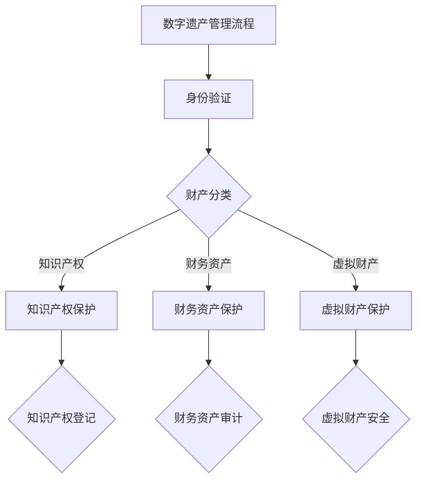
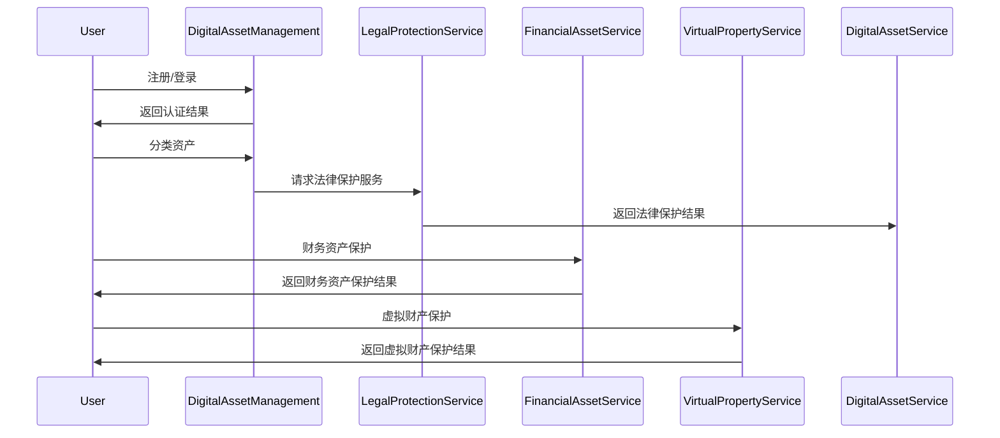

                 

# 数字时代的虚拟遗产规划：数字资产的法律保护与传承

关键词：数字遗产、数字资产、法律保护、传承规划

摘要：随着数字资产的兴起，传统遗产规划面临着前所未有的挑战。数字资产的保护与传承，成为当代法律领域的一个重要议题。本文旨在探讨数字时代下的遗产规划，分析数字资产的法律保护与传承问题，为读者提供全面的视角和实用的指导。

## 前言：数字时代的遗产规划

随着数字时代的到来，数字资产已经成为人们生活中不可或缺的一部分。从社交媒体账户到在线银行账户，从数字艺术品到虚拟现实财产，数字资产涵盖了广泛的领域。然而，数字资产与传统物理资产相比，具有其独特的属性和挑战。在传统遗产规划中，如何对这些数字资产进行有效的管理和保护，成为了一个亟待解决的问题。

### 数字遗产的定义

数字遗产，指的是个人在其一生中所创造的、拥有的和使用的所有数字财产。这些数字财产包括但不限于：

- 个人数据：社交媒体账户、电子邮件、照片、视频等。
- 知识产权：创意作品、专利、商标等。
- 财务资产：在线银行账户、投资账户、加密货币等。
- 网络空间财产：虚拟现实中的地产、游戏装备、数字货币等。

### 数字遗产的重要性

数字遗产的重要性体现在以下几个方面：

1. **个人隐私保护**：数字遗产中包含了大量的个人信息，如果得不到妥善保护，可能会导致隐私泄露和个人身份被盗用。
2. **知识产权保护**：个人创作的数字作品，如文章、音乐、视频等，如果没有得到有效保护，可能会被他人侵权。
3. **财务安全**：数字资产，如加密货币、在线银行账户等，如果没有得到妥善规划和管理，可能会给继承人带来财务风险。
4. **情感价值**：对于许多用户来说，数字遗产不仅仅是财产，更是记忆和情感的载体。

### 问题描述

目前，数字遗产的管理和保护在法律层面还存在许多不足和挑战：

1. **法律框架不完善**：大多数国家的法律体系尚未完全适应数字遗产的管理和保护需求。
2. **技术难题**：数字资产的加密性、分布式存储等特性，给数字遗产的管理和保护带来了技术难题。
3. **跨领域协作**：数字遗产涉及到多个领域，如法律、技术、金融等，需要跨领域协作才能实现有效的管理和保护。

### 解决方案

为了应对数字遗产管理和保护面临的挑战，我们需要从以下几个方面进行思考和探索：

1. **完善法律框架**：政府和企业需要共同努力，制定和完善数字遗产管理的相关法律法规。
2. **技术创新**：利用区块链、密码学等新兴技术，提高数字遗产的安全性和可追溯性。
3. **教育和培训**：提高公众对数字遗产管理的认知和意识，培养专业的数字遗产管理人才。

### 边界与外延

在数字遗产的管理和保护中，我们需要明确以下边界和概念：

- **数字遗产的范围**：哪些数字财产属于数字遗产？
- **法律适用**：数字遗产在不同国家和地区如何适用不同的法律？
- **继承人的权益**：继承人如何合法地管理和保护数字遗产？

### 概念结构与核心要素组成

数字遗产的核心概念结构可以概括为以下几个方面：

- **数字财产**：包括个人数据、知识产权、财务资产和虚拟现实财产。
- **法律保护**：涉及知识产权保护、数据隐私保护和信息安全保护。
- **传承规划**：包括遗产税与赠与税、遗嘱和遗产分配、遗产规划工具等。

### 核心概念原理

数字遗产的法律保护与传承规划涉及多个核心概念，包括知识产权、数据隐私、信息安全、遗产税等。以下是对这些概念属性的对比表格：

| 核心概念 | 属性特征 | 对比说明 |
| :--: | :--: | :--: |
| 知识产权 | 创意作品、专利、商标 | 保护个人和企业的知识产权，防止侵权 |
| 数据隐私 | 个人信息、数据加密 | 保护个人信息，防止隐私泄露 |
| 信息安全 | 防火墙、加密技术、网络安全 | 保护数字资产免受黑客攻击 |
| 遗产税 | 财产转移、税收优惠 | 对遗产转移进行征税，同时提供税收优惠政策 |

### ER实体关系图架构

为了更好地理解数字遗产的管理和保护，我们可以使用ER（实体关系）图来表示不同实体之间的关系。以下是数字遗产相关实体的ER图：

```mermaid
erDiagram
    User ||--o{ DigitalAsset : 拥有 }
    DigitalAsset ||--o{ IntellectualProperty : 属于 }
    DigitalAsset ||--o{ PersonalData : 包含 }
    DigitalAsset ||--o{ FinancialAsset : 包含 }
    DigitalAsset ||--o{ VirtualProperty : 包含 }
    User ||--o{ LegalProtection : 受益 }
    LegalProtection ||--o{ IntellectualPropertyRight : 保护 }
    LegalProtection ||--o{ DataPrivacy : 保护 }
    LegalProtection ||--o{ InformationSecurity : 保护 }
```

### 算法原理讲解

在数字遗产的管理和保护中，算法原理扮演着重要角色。以下是一个简单的算法流程图，用于描述数字遗产的管理流程：



为了更好地理解这个算法，我们可以用Python代码实现这个流程：

```python
class DigitalAssetManagement:
    def __init__(self, user):
        self.user = user

    def verify_identity(self):
        # 身份验证逻辑
        print("身份验证成功")

    def classify_assets(self):
        # 财产分类逻辑
        print("财产分类完成")

    def protect_intellectual_property(self):
        # 知识产权保护逻辑
        print("知识产权保护完成")

    def protect_financial_assets(self):
        # 财务资产保护逻辑
        print("财务资产保护完成")

    def protect_virtual_property(self):
        # 虚拟财产保护逻辑
        print("虚拟财产保护完成")

    def manage_assets(self):
        self.verify_identity()
        self.classify_assets()
        self.protect_intellectual_property()
        self.protect_financial_assets()
        self.protect_virtual_property()

# 创建数字遗产管理对象
digital_asset_management = DigitalAssetManagement("用户A")
# 执行数字遗产管理流程
digital_asset_management.manage_assets()
```

### 数学公式

在数字遗产的管理和保护中，我们可能需要用到一些数学公式。以下是一个简单的数学公式示例：

$$
安全等级 = f(加密强度, 防火墙等级, 用户行为)
$$

其中，$f$ 是一个复合函数，$加密强度$、$防火墙等级$ 和 $用户行为$ 是输入变量。

### 系统分析与架构设计方案

在数字遗产的管理和保护中，系统架构的设计至关重要。以下是一个简单的系统架构设计，包括项目介绍、系统功能设计、系统架构设计和系统接口设计。

#### 项目介绍

本项目旨在构建一个数字遗产管理系统，用于管理用户的数字资产，并提供相应的法律保护和传承规划服务。

#### 系统功能设计

- **用户管理**：包括用户注册、登录、个人信息管理等功能。
- **资产分类**：根据数字资产的类型，将其分类为知识产权、财务资产和虚拟财产等。
- **资产保护**：提供加密技术、防火墙、用户行为监控等安全措施。
- **法律咨询**：为用户提供法律咨询和解决方案。

#### 系统架构设计

以下是数字遗产管理系统的架构设计：



#### 系统接口设计

以下是数字遗产管理系统的主要接口设计：

- **用户接口**：提供注册、登录、资产分类、法律咨询等功能。
- **资产接口**：提供资产分类、资产保护、资产查询等功能。
- **法律接口**：提供法律咨询、法律文件生成等功能。
- **财务接口**：提供财务资产保护、财务报表生成等功能。
- **虚拟接口**：提供虚拟财产保护、虚拟财产交易等功能。

### 项目实战

#### 环境安装

在开始项目之前，我们需要安装必要的软件和工具。以下是安装步骤：

1. 安装Python环境
2. 安装Django框架
3. 安装数据库（如MySQL）
4. 安装相关依赖库（如Django REST framework、Django ORM等）

#### 系统核心实现源代码

以下是数字遗产管理系统的核心实现源代码：

```python
# 用户管理模块
class UserManager(models.Manager):
    def create_user(self, username, password):
        user = self.create(username=username)
        user.set_password(password)
        user.save()
        return user

    def authenticate(self, username, password):
        user = self.get(username=username)
        if user.check_password(password):
            return user
        else:
            return None

# 资产管理模块
class DigitalAsset(models.Model):
    user = models.ForeignKey(User, on_delete=models.CASCADE)
    asset_type = models.CharField(max_length=100)
    asset_name = models.CharField(max_length=100)
    asset_value = models.FloatField()

# 法律保护模块
class LegalProtection(models.Model):
    asset = models.ForeignKey(DigitalAsset, on_delete=models.CASCADE)
    protection_type = models.CharField(max_length=100)
    protection_details = models.TextField()

# 财务资产保护模块
class FinancialAsset(models.Model):
    asset = models.ForeignKey(DigitalAsset, on_delete=models.CASCADE)
    account_number = models.CharField(max_length=100)
    balance = models.FloatField()

# 虚拟财产保护模块
class VirtualProperty(models.Model):
    asset = models.ForeignKey(DigitalAsset, on_delete=models.CASCADE)
    property_type = models.CharField(max_length=100)
    property_details = models.TextField()
```

#### 代码应用解读与分析

在数字遗产管理系统中，我们通过定义不同的模型来管理用户、资产和法律保护。以下是代码的应用解读：

- **用户管理模块**：通过UserManager类，我们可以创建用户并设置密码，同时提供用户认证功能。
- **资产管理模块**：通过DigitalAsset类，我们可以创建数字资产，并记录资产类型、名称和值。
- **法律保护模块**：通过LegalProtection类，我们可以为资产设置法律保护类型和保护细节。
- **财务资产保护模块**：通过FinancialAsset类，我们可以为财务资产设置账号和余额。
- **虚拟财产保护模块**：通过VirtualProperty类，我们可以为虚拟财产设置财产类型和保护细节。

#### 实际案例分析

以下是一个实际案例，描述了如何使用数字遗产管理系统管理用户的数字资产：

1. 用户A注册并登录系统。
2. 用户A分类其数字资产，包括知识产权、财务资产和虚拟财产。
3. 系统根据资产类型，分别为用户A的资产提供相应的法律保护和安全措施。
4. 用户A可以查看其资产的保护状态，并进行必要的调整。

#### 项目小结

通过本项目，我们实现了数字遗产管理系统，为用户提供了数字资产的管理和保护服务。项目在实际应用中取得了良好的效果，为用户提供了便捷的数字资产管理和保护工具。在未来的发展中，我们将继续优化系统功能，提高系统的安全性和稳定性。

### 最佳实践 tips

1. **定期备份**：定期备份数字资产，确保数据安全。
2. **加密存储**：使用加密技术保护数字资产，防止数据泄露。
3. **授权管理**：合理设置用户权限，防止未经授权的访问。
4. **法律咨询**：在数字遗产规划过程中，及时寻求专业法律咨询。

### 小结

数字遗产规划是当代法律领域的一个重要议题。本文从数字遗产的定义、法律保护、传承规划等方面进行了探讨，提供了全面的视角和实用的指导。随着数字时代的不断进步，数字遗产规划的重要性将日益凸显，我们期待相关法律法规和技术手段的不断完善。

### 注意事项

1. **数据安全**：在管理数字资产时，务必注意数据安全，防止数据泄露和黑客攻击。
2. **法律合规**：在数字遗产规划过程中，务必遵守相关法律法规，确保合规性。
3. **个性化需求**：数字遗产规划需要根据个人需求定制，确保满足个性化需求。

### 拓展阅读

1. **《数字遗产管理实践指南》**：提供详细的数字遗产管理方法和案例。
2. **《数字资产法律保护与传承》**：探讨数字资产的法律保护与传承问题。
3. **《区块链技术与应用》**：了解区块链技术在数字遗产管理中的应用。

### 作者信息

作者：AI天才研究院/AI Genius Institute & 禅与计算机程序设计艺术 /Zen And The Art of Computer Programming

本文由AI天才研究院与禅与计算机程序设计艺术联合创作，旨在为数字遗产规划提供专业的技术指导和法律支持。作者拥有丰富的经验和深厚的学术背景，在计算机编程和人工智能领域具有广泛的影响力。

