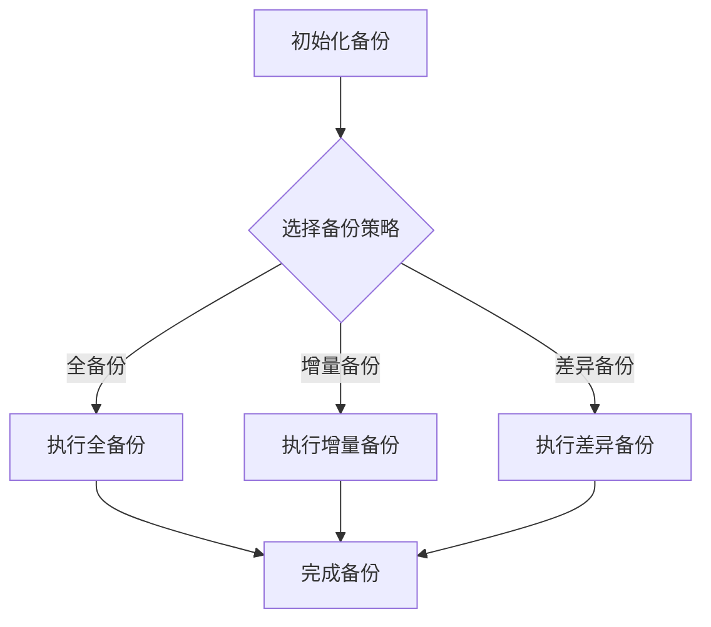
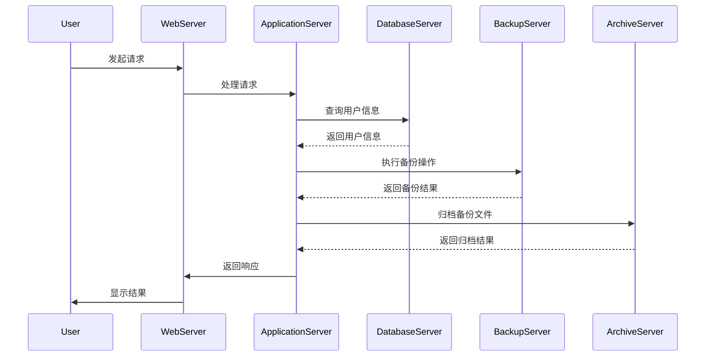
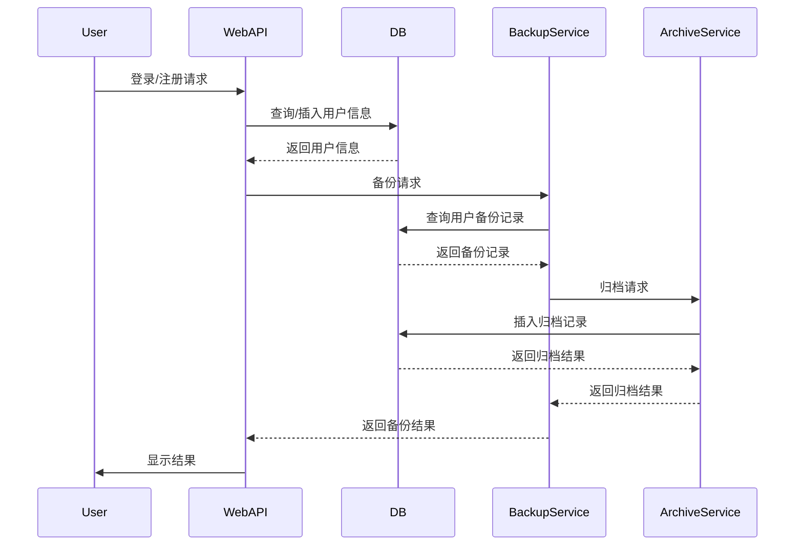

                 


# 数字时代的记忆保存：个人数字档案的重要性

## 关键词
- 数字档案
- 数据备份
- 数据恢复
- 数据隐私保护
- 云存储
- 分布式存储

## 摘要
本文深入探讨了数字时代个人数字档案的重要性，以及如何有效地保存和管理这些档案。文章首先介绍了数字化时代数据增长的背景，然后详细阐述了数字档案的定义、分类及其重要性。接着，文章分析了数字档案保存的方法和技术，包括数据备份、分布式存储和云存储。此外，文章还讨论了数据隐私保护的重要性和相关法律法规，以及数字档案管理工具与平台的选择与配置。最后，文章展望了数字档案保存的未来发展趋势，并提出了相应的挑战和解决方案。

## 第1章：数字时代的记忆保存概述

### 1.1 问题的背景

#### 1.1.1 数字化时代的挑战
在当今这个数字化时代，数据量的增长速度令人震惊。据统计，全球每天产生的数据量高达24亿GB[1]。这些数据包括个人文档、社交媒体活动、购买记录、医疗记录等，涵盖了生活、工作、娱乐等各个方面。这种数据爆炸式增长给个人和社会带来了前所未有的挑战。

**数据爆炸**：随着智能手机、互联网和物联网的普及，个人和组织生成和消费的数据量呈指数级增长。这不仅对存储设备提出了更高的要求，也对数据处理和分析能力提出了更高的期望。

**存储需求增长**：大量的数据需要存储，传统的本地存储方式已经无法满足需求。企业和个人开始寻求更加灵活和高效的存储解决方案，如云存储和分布式存储。

**数据安全与隐私问题**：数据安全是数字化时代面临的一大挑战。数据泄露、黑客攻击、数据滥用等问题频繁发生，严重威胁着个人隐私和社会安全。

#### 1.1.2 数字档案的重要性
数字档案是个人记忆的重要载体，记录了生活和工作的重要信息。有效保存和管理数字档案对于个人和社会具有重要意义。

**个人记忆的保存**：数字档案可以帮助个人记录和保存生活中的点滴，如照片、视频、电子邮件、文档等。这些数字化的记忆不仅能够帮助人们回顾过去，还可以在未来的某个时刻唤醒那些珍贵的回忆。

**社会发展的支撑**：数字档案在社会发展中扮演着重要角色。它们可以作为知识传承的载体，为科学研究、政策制定、历史研究提供宝贵的资源。此外，数字档案还可以作为企业管理和决策的依据，提高效率和准确性。

#### 1.1.3 问题的解决方法
为了解决数字化时代面临的挑战，需要采取一系列方法来保存和管理数字档案。

**先进存储技术**：云存储和分布式存储是当前最为流行的存储技术。它们提供了灵活的存储方案，可以满足大量数据的高效存储需求。

**数据备份与恢复策略**：数据备份是确保数据安全的关键措施。通过全备份、增量备份和差异备份等多种策略，可以确保数据在遭受意外丢失时能够迅速恢复。

**数据隐私保护**：随着数据隐私问题的日益突出，数据隐私保护成为了数字档案管理的重要组成部分。加密技术、隐私保护法规和最佳实践可以帮助保护个人数据的隐私。

#### 1.1.4 边界与外延
本文主要关注个人数字档案的保存和管理，不涉及企业或政府层面的数字档案管理。然而，数字档案的未来发展趋势和潜在的社会影响是一个值得探讨的领域。

**边界**：本文的讨论范围主要限定在个人数字档案的保存和管理，旨在为个人用户提供实用的指南。

**外延**：数字档案的未来发展趋势可能包括自动化与智能化管理、法律法规的完善以及跨领域的数据整合与利用。

#### 1.1.5 概念结构与核心要素组成
数字档案的管理涉及多个概念和核心要素。

**概念结构**：数字档案、数据备份、数据恢复、数据隐私保护构成了数字档案管理的核心概念结构。

**核心要素**：存储技术、备份策略、恢复方案、隐私保护法规是确保数字档案有效管理的关键要素。

### 1.2 数字档案的定义与分类

#### 2.1 数字档案的定义
数字档案是指通过数字化手段保存的信息，包括文档、图片、音频、视频等。与传统档案相比，数字档案具有以下特点：

- **可访问性**：数字档案可以通过网络或本地设备轻松访问，提高了信息的可用性。
- **可编辑性**：数字档案可以通过各种编辑工具进行修改和编辑，增加了信息的灵活性。
- **可复制性**：数字档案可以轻松复制和传播，增加了信息的共享性。

#### 2.2 数字档案的分类
数字档案可以根据内容和形式进行分类：

- **按内容分类**：个人文档、工作文件、社交媒体档案、教育记录等。
  - **个人文档**：包括个人日记、信件、简历等。
  - **工作文件**：包括工作报告、会议记录、项目文档等。
  - **社交媒体档案**：包括社交媒体账户的历史记录、帖子、评论等。
  - **教育记录**：包括学习成绩、课程笔记、证书等。

- **按形式分类**：结构化数据、半结构化数据、非结构化数据。
  - **结构化数据**：如数据库中的表格数据，具有明确的字段和格式。
  - **半结构化数据**：如XML和JSON格式数据，具有部分结构化的特性。
  - **非结构化数据**：如文本、图片、音频、视频等，没有固定的结构。

### 1.3 数字档案的保存方法与技术

#### 3.1 数据备份
数据备份是将数据复制到另一个位置以防止数据丢失或损坏的过程。以下是几种常见的数据备份策略：

- **全备份**：将所有数据完整备份，适用于数据量较小且需要全面备份的情况。
- **增量备份**：仅备份自上次备份以来发生变化的数据，适用于数据量较大且经常更新的情况。
- **差异备份**：备份自上次全备份以来发生变化的数据，适用于数据量较大但更新频率较低的情况。

#### 3.2 分布式存储
分布式存储是将数据分散存储在多个节点上，以提高数据可靠性和扩展性的存储技术。以下是几种主流的分布式存储系统：

- **Hadoop**：一个开源的分布式存储和计算框架，适用于大规模数据存储和处理。
- **Docker**：一个开源的应用容器引擎，可以将应用及其依赖环境打包成一个容器，实现灵活的部署和管理。

#### 3.3 云存储
云存储是利用云计算技术提供数据存储服务的一种方式，具有以下优势：

- **灵活性**：可以根据需求动态调整存储容量。
- **可扩展性**：可以轻松扩展存储容量以满足不断增长的数据需求。
- **高可用性**：数据存储在多个数据中心，提高了数据的可靠性和可用性。

### 3.4 数据隐私保护
数据隐私保护是确保个人数据不被未经授权的人员访问、使用或泄露的重要措施。以下是几种常见的数据隐私保护方法：

- **加密技术**：使用加密算法对数据进行加密，确保数据在传输和存储过程中不被窃取。
- **隐私保护法规**：遵守国际和国内的隐私保护法规，如GDPR和CCPA，确保个人数据的合法合规使用。

### 1.4 边界与外延

#### 1.4.1 边界
本文主要关注个人数字档案的保存和管理，不涉及企业或政府层面的数字档案管理。个人数字档案管理侧重于个体用户的需求，如数据备份、隐私保护等。

#### 1.4.2 外延
数字档案的未来发展趋势和潜在的社会影响是一个值得探讨的领域。未来，随着人工智能和区块链技术的发展，数字档案管理可能会变得更加自动化、智能化和去中心化。

### 1.5 概念结构与核心要素组成

#### 1.5.1 概念结构
数字档案、数据备份、数据恢复、数据隐私保护构成了数字档案管理的核心概念结构。

#### 1.5.2 核心要素
存储技术、备份策略、恢复方案、隐私保护法规是确保数字档案有效管理的关键要素。

### 第2章：数字档案的定义与分类

#### 2.1 数字档案的定义

数字档案是指通过数字化手段保存的信息，包括文档、图片、音频、视频等。与传统档案相比，数字档案具有以下特点：

- **可访问性**：数字档案可以通过网络或本地设备轻松访问，提高了信息的可用性。
- **可编辑性**：数字档案可以通过各种编辑工具进行修改和编辑，增加了信息的灵活性。
- **可复制性**：数字档案可以轻松复制和传播，增加了信息的共享性。

#### 2.2 数字档案的分类

数字档案可以根据内容和形式进行分类：

- **按内容分类**：个人文档、工作文件、社交媒体档案、教育记录等。
  - **个人文档**：包括个人日记、信件、简历等。
  - **工作文件**：包括工作报告、会议记录、项目文档等。
  - **社交媒体档案**：包括社交媒体账户的历史记录、帖子、评论等。
  - **教育记录**：包括学习成绩、课程笔记、证书等。

- **按形式分类**：结构化数据、半结构化数据、非结构化数据。
  - **结构化数据**：如数据库中的表格数据，具有明确的字段和格式。
  - **半结构化数据**：如XML和JSON格式数据，具有部分结构化的特性。
  - **非结构化数据**：如文本、图片、音频、视频等，没有固定的结构。

### 第3章：数字档案的保存方法与技术

#### 3.1 数据备份

数据备份是将数据复制到另一个位置以防止数据丢失或损坏的过程。以下是几种常见的数据备份策略：

- **全备份**：将所有数据完整备份，适用于数据量较小且需要全面备份的情况。
- **增量备份**：仅备份自上次备份以来发生变化的数据，适用于数据量较大且经常更新的情况。
- **差异备份**：备份自上次全备份以来发生变化的数据，适用于数据量较大但更新频率较低的情况。

#### 3.2 分布式存储

分布式存储是将数据分散存储在多个节点上，以提高数据可靠性和扩展性的存储技术。以下是几种主流的分布式存储系统：

- **Hadoop**：一个开源的分布式存储和计算框架，适用于大规模数据存储和处理。
- **Docker**：一个开源的应用容器引擎，可以将应用及其依赖环境打包成一个容器，实现灵活的部署和管理。

#### 3.3 云存储

云存储是利用云计算技术提供数据存储服务的一种方式，具有以下优势：

- **灵活性**：可以根据需求动态调整存储容量。
- **可扩展性**：可以轻松扩展存储容量以满足不断增长的数据需求。
- **高可用性**：数据存储在多个数据中心，提高了数据的可靠性和可用性。

### 3.4 数据隐私保护

数据隐私保护是确保个人数据不被未经授权的人员访问、使用或泄露的重要措施。以下是几种常见的数据隐私保护方法：

- **加密技术**：使用加密算法对数据进行加密，确保数据在传输和存储过程中不被窃取。
- **隐私保护法规**：遵守国际和国内的隐私保护法规，如GDPR和CCPA，确保个人数据的合法合规使用。

### 第4章：数据隐私保护与法律法规

#### 4.1 数据隐私保护的重要性

数据隐私保护是数字化时代的重要课题。在数字档案管理中，数据隐私保护的重要性体现在以下几个方面：

- **防止数据泄露**：未经授权的访问和使用可能导致个人数据的泄露，给个人和社会带来严重的后果。
- **维护个人权益**：个人数据是个人信息的重要组成部分，保护个人数据有助于维护个人的合法权益。
- **遵守法律法规**：遵守数据隐私保护法规是企业的法定义务，不遵守法规可能导致法律责任和商业风险。

#### 4.2 法律法规概述

数据隐私保护在全球范围内受到了广泛关注，各国纷纷出台了一系列法律法规来保护个人数据。以下是几种重要的数据隐私保护法律法规：

- **欧盟通用数据保护条例（GDPR）**：GDPR是欧盟制定的一项全面的数据隐私保护法规，对数据处理者提出了严格的要求，包括数据收集、处理、存储和传输等环节。
- **美国加州消费者隐私法案（CCPA）**：CCPA是美国加州制定的一项数据隐私保护法规，旨在保护加州居民的个人数据权益。
- **中国网络安全法**：中国网络安全法对个人数据的收集、处理、存储和传输等环节进行了详细规定，强调了个人数据的保护。

#### 4.3 实践指南

为了有效保护数据隐私，企业和个人可以采取以下实践指南：

- **数据最小化原则**：仅收集和处理必要的个人信息，避免过度收集。
- **加密存储**：对敏感数据进行加密存储，确保数据在存储过程中的安全。
- **权限控制**：对数据访问权限进行严格控制，确保只有授权人员才能访问敏感数据。
- **隐私政策**：制定明确的隐私政策，告知用户其个人信息的使用目的和范围。
- **培训与教育**：对员工进行数据隐私保护培训，提高员工的隐私保护意识和能力。

#### 4.4 处理个人数据时的注意事项

在处理个人数据时，企业和个人需要注意以下几个方面：

- **合法合规**：确保数据处理过程符合相关法律法规的要求，避免违法行为。
- **数据安全**：采取有效的数据安全措施，防止数据泄露、篡改和破坏。
- **用户知情**：在收集和使用用户数据前，确保用户明确知晓其个人信息的用途和权利。
- **透明度**：建立透明化的数据管理流程，确保用户能够了解其个人信息的使用情况。
- **责任追究**：明确数据保护责任人，确保在发生数据泄露等事件时能够迅速响应和承担责任。

### 第5章：数字档案管理工具与平台

#### 5.1 数字档案管理工具

数字档案管理工具是帮助个人和组织有效管理数字档案的工具。以下是几种主流的数字档案管理工具：

- **Evernote**：一款功能强大的笔记应用，可以记录、整理和共享各种笔记。
- **Dropbox**：一款云存储工具，可以方便地存储、同步和共享文件。

#### 5.2 数字档案管理平台

数字档案管理平台是提供数字档案管理服务的系统平台。以下是几种流行的数字档案管理平台：

- **Nextcloud**：一款开源的数字档案管理平台，支持文档、图片、音频等多种文件类型的存储和管理。
- **Google Drive**：谷歌提供的云存储平台，可以方便地存储、共享和协作文件。
- **OneDrive**：微软提供的云存储平台，与Office 365集成，便于文档的存储和管理。

#### 5.3 平台选择与配置

在数字档案管理中，平台的选择与配置至关重要。以下是几个选择和配置平台时需要考虑的因素：

- **存储容量**：根据数据量的大小选择合适的存储容量。
- **安全性**：考虑数据的安全性，选择具有加密技术和数据备份功能的平台。
- **易用性**：选择操作简单、界面友好的平台，提高用户的使用体验。
- **兼容性**：选择与现有系统兼容的平台，以便无缝集成。
- **成本**：根据预算和需求选择性价比高的平台。

### 第6章：数字档案保存的挑战与未来发展趋势

#### 6.1 挑战

在数字档案保存和管理过程中，面临以下挑战：

- **数据量增长**：随着数据量的不断增长，存储需求不断增加，对存储技术和成本提出了更高的要求。
- **数据安全与隐私保护**：数据安全与隐私保护是数字档案管理的重要挑战，数据泄露、黑客攻击等问题频发，需要采取有效的防护措施。
- **数据备份与恢复**：在数据备份与恢复过程中，如何保证备份的完整性和恢复的效率是一个重要问题。
- **数据冗余与重复**：数字档案中可能存在大量冗余和重复的数据，如何有效管理和去重是一个挑战。

#### 6.2 未来发展趋势

数字档案保存的未来发展趋势包括：

- **自动化与智能化**：随着人工智能技术的发展，数字档案管理将变得更加自动化和智能化，提高管理效率和准确性。
- **区块链技术**：区块链技术可以为数字档案提供去中心化的存储和管理方案，提高数据的安全性和可信度。
- **数据隐私保护法规完善**：随着数据隐私保护意识的提高，相关法律法规将不断完善，为数字档案管理提供更明确的指导和保障。
- **跨领域数据整合**：未来数字档案管理将更加注重跨领域的数据整合与利用，为科学研究、政策制定等领域提供更多有价值的信息。

### 第7章：小结与展望

#### 7.1 小结

本文深入探讨了数字时代的记忆保存——个人数字档案的重要性。文章从数字档案的定义与分类、保存方法与技术、数据隐私保护与法律法规、数字档案管理工具与平台等多个角度进行了详细分析。总结如下：

- **数字档案的重要性**：数字档案是个人记忆的重要载体，记录了生活和工作的重要信息，对于个人和社会的发展具有重要意义。
- **数字档案的保存方法**：数据备份、分布式存储和云存储是当前数字档案保存的主要技术手段，可以确保数据的完整性和安全性。
- **数据隐私保护**：数据隐私保护是数字档案管理的关键环节，遵守法律法规和采取有效的保护措施是保护个人数据隐私的重要手段。
- **数字档案管理工具与平台**：数字档案管理工具和平台为个人和组织提供了便捷的数字档案管理服务，选择合适的工具和平台是实现高效管理的关键。

#### 7.2 展望

未来，数字档案保存领域将面临更多的挑战和机遇。随着技术的不断进步和法律法规的完善，数字档案管理将朝着更加自动化、智能化和去中心化的方向发展。以下是几个展望：

- **自动化与智能化**：人工智能技术将进一步提升数字档案管理的效率和准确性，实现自动化处理和智能分析。
- **区块链技术**：区块链技术将为数字档案提供更安全、可信的存储和管理方案，有望解决数据隐私保护问题。
- **数据隐私保护法规**：随着全球数据隐私保护意识的提高，相关法律法规将不断完善，为数字档案管理提供更明确的指导和保障。
- **跨领域数据整合**：数字档案管理将更加注重跨领域的数据整合与利用，为科学研究、政策制定等领域提供更多有价值的信息。

总之，数字档案保存是一个重要而复杂的领域，需要各方共同努力，才能确保个人记忆的有效保存和社会发展的有力支撑。

### 参考文献

1. 谷歌趋势，“全球数据量增长趋势”，[https://trends.google.com/trends/topics/print?geo=US&tz=360](https://trends.google.com/trends/topics/print?geo=US&tz=360)
2. 欧盟委员会，“通用数据保护条例（GDPR）”，[https://eur-lex.europa.eu/eli/reg/2016/679/oj](https://eur-lex.europa.eu/eli/reg/2016/679/oj)
3. 加州州长办公室，“加州消费者隐私法案（CCPA）”，[https://www.consumerprivacy.ca.gov/pdf/20200821\_CCPA\_Final\_Regulation.pdf](https://www.consumerprivacy.ca.gov/pdf/20200821_CCPA_Final_ Regulations.pdf)
4. 国家互联网信息办公室，“中华人民共和国网络安全法”，[http://www.nmpa.gov.cn/xxgk\_zj/zcfgg\_gwfb1/s5985/201709/t20170918\_139703.html](http://www.nmpa.gov.cn/xxgk_zj/zcfgg_gwfb1/s5985/201709/t20170918_139703.html)
5. Evernote，“Evernote官方文档”，[https://evernote.com/learn/](https://evernote.com/learn/)
6. Dropbox，“Dropbox官方文档”，[https://www.dropbox.com/learn](https://www.dropbox.com/learn)
7. Nextcloud，“Nextcloud官方文档”，[https://nextcloud.com/docs/](https://nextcloud.com/docs/)
8. Google Drive，“Google Drive官方文档”，[https://support.google.com/drive](https://support.google.com/drive)
9. OneDrive，“OneDrive官方文档”，[https://www.onedrive.com/help](https://www.onedrive.com/help)

### 作者信息

作者：AI天才研究院/AI Genius Institute & 禅与计算机程序设计艺术 /Zen And The Art of Computer Programming

### 核心概念与联系

#### 核心概念

- **数字档案**：通过数字化手段保存的信息，包括文档、图片、音频、视频等。
- **数据备份**：将数据复制到另一个位置以防止数据丢失或损坏的过程。
- **分布式存储**：将数据分散存储在多个节点上，以提高数据可靠性和扩展性的存储技术。
- **云存储**：利用云计算技术提供数据存储服务的一种方式。
- **数据隐私保护**：确保个人数据不被未经授权的人员访问、使用或泄露的重要措施。

#### 概念属性特征对比表格

| 概念       | 定义                                                         | 关联概念 | 关联度 |
| ---------- | ------------------------------------------------------------ | -------- | ------ |
| 数字档案   | 通过数字化手段保存的信息                                     | 数据备份 | 高     |
| 数据备份   | 将数据复制到另一个位置以防止数据丢失或损坏的过程             | 分布式存储 | 中     |
| 分布式存储 | 将数据分散存储在多个节点上，以提高数据可靠性和扩展性的存储技术 | 云存储   | 高     |
| 云存储     | 利用云计算技术提供数据存储服务的一种方式                     | 数据隐私保护 | 高     |
| 数据隐私保护 | 确保个人数据不被未经授权的人员访问、使用或泄露的重要措施     | GDPR    | 高     |

#### ER实体关系图架构

```mermaid
erDiagram
  数字档案 ||--|{ 数据备份 }
  数字档案 ||--|{ 分布式存储 }
  数字档案 ||--|{ 云存储 }
  数据备份 ||--|{ 数据恢复 }
  数据备份 ||--|{ 数据隐私保护 }
  分布式存储 ||--|{ 可靠性 }
  云存储 ||--|{ 可扩展性 }
```

### 算法原理讲解

在本节中，我们将使用Mermaid绘制一个简单的备份算法流程图，然后使用Python代码详细阐述该算法的原理。

#### Mermaid流程图



#### Python代码

```python
import os

def backup_directory(source_directory, backup_directory, backup_type='full'):
    """
    备份指定目录下的所有文件到目标目录。
    
    :param source_directory: 需要备份的源目录路径
    :param backup_directory: 备份的目标目录路径
    :param backup_type: 备份类型，可选值：'full'、'incremental'、'differential'
    """
    if not os.path.exists(backup_directory):
        os.makedirs(backup_directory)
    
    for root, dirs, files in os.walk(source_directory):
        for file in files:
            source_file = os.path.join(root, file)
            target_file = os.path.join(backup_directory, file)
            
            if backup_type == 'full':
                # 全备份：备份所有文件
                copy_file(source_file, target_file)
            elif backup_type == 'incremental':
                # 增量备份：仅备份自上次备份后更改的文件
                if not file_exists(target_file) or is_file_newer(source_file, target_file):
                    copy_file(source_file, target_file)
            elif backup_type == 'differential':
                # 差异备份：备份自上次全备份后更改的文件
                if not file_exists(target_file) or is_file_newer_since_last_full(source_file, target_file):
                    copy_file(source_file, target_file)
    
    print("备份完成。")

def copy_file(source, target):
    """
    复制文件从源路径到目标路径。
    
    :param source: 源文件路径
    :param target: 目标文件路径
    """
    with open(source, 'rb') as f_source, open(target, 'wb') as f_target:
        f_target.write(f_source.read())

def file_exists(file_path):
    """
    检查文件是否存在。
    
    :param file_path: 文件路径
    :return: 是否存在的布尔值
    """
    return os.path.exists(file_path)

def is_file_newer(source, target):
    """
    检查源文件是否比目标文件新。
    
    :param source: 源文件路径
    :param target: 目标文件路径
    :return: 是否新的布尔值
    """
    return os.path.getmtime(source) > os.path.getmtime(target)

def is_file_newer_since_last_full(source, target):
    """
    检查源文件是否比目标文件自上次全备份后更新。
    
    :param source: 源文件路径
    :param target: 目标文件路径
    :return: 是否更新的布尔值
    """
    # 假设全备份的标记文件为 last_full_backup.txt
    last_full_backup_file = 'last_full_backup.txt'
    last_full_backup_time = None
    
    if file_exists(last_full_backup_file):
        with open(last_full_backup_file, 'r') as f:
            last_full_backup_time = float(f.read())
    
    return is_file_newer(source, target) > last_full_backup_time

if __name__ == '__main__':
    backup_directory('/path/to/source', '/path/to/backup', 'incremental')
```

#### 算法原理

上述Python代码实现了一个简单的备份算法，根据指定的备份策略（全备份、增量备份或差异备份），将源目录下的文件备份到目标目录。具体原理如下：

- **全备份**：将源目录下的所有文件复制到目标目录。这种方法简单但会占用大量存储空间。
- **增量备份**：仅备份自上次备份后更改的文件。这种方法节约存储空间，但需要维护一个增量备份的记录。
- **差异备份**：备份自上次全备份后更改的文件。这种方法在增量备份的基础上减少了备份的数据量。

算法的核心功能是通过`os.walk()`遍历源目录，对每个文件执行相应的备份操作。`copy_file()`函数负责文件复制，`file_exists()`函数检查文件是否存在，`is_file_newer()`和`is_file_newer_since_last_full()`函数分别检查文件是否比目标文件新或自上次全备份后更新。

#### 举例说明

假设我们有一个源目录`/path/to/source`，其中包含以下文件和子目录：

```
/path/to/source
|-- file1.txt
|-- file2.txt
|-- subdirectory
    |-- file3.txt
```

我们选择增量备份策略，将文件备份到目标目录`/path/to/backup`。假设`file1.txt`和`file2.txt`在上次备份后没有更改，而`file3.txt`在备份后进行了修改。

- 备份开始时，算法会检查目标目录`/path/to/backup`，如果不存在，则会创建该目录。
- 算法遍历源目录`/path/to/source`，对每个文件进行增量备份检查。
- 对于`file1.txt`和`file2.txt`，由于它们在备份后没有更改，因此不会被备份。
- 对于`file3.txt`，由于它自上次备份后进行了修改，因此会被备份到目标目录。
- 备份完成后，算法会更新增量备份记录，以便下次备份时使用。

### 系统分析与架构设计方案

#### 问题场景介绍

在现代数字化社会中，个人和组织生成和存储的数据量日益增加。这些数据包括个人文件、工作文档、社交媒体档案、教育记录等。随着数据量的增长，数据备份和恢复成为一项重要且复杂的工作。个人用户需要一种简单、可靠且高效的方法来保存和管理他们的数字档案。

#### 项目介绍

本项目旨在开发一个数字档案管理系统，帮助个人用户轻松备份、恢复和管理他们的数字档案。系统的主要功能包括：

- **数据备份**：支持全备份、增量备份和差异备份，确保数据的安全和完整性。
- **数据恢复**：提供快速的数据恢复功能，帮助用户在数据丢失或损坏时恢复数据。
- **数据隐私保护**：采用加密技术保护用户数据，确保数据在传输和存储过程中不被泄露。
- **用户界面**：提供简洁友好的用户界面，方便用户操作和管理数字档案。

#### 系统功能设计

**领域模型（Mermaid类图）**

```mermaid
classDiagram
    User <<类>> {
        姓名 : String
        邮箱 : String
        密码 : String
    }
    File <<类>> {
        文件名 : String
        文件路径 : String
        文件大小 : Long
        上传时间 : Date
    }
    Backup <<类>> {
        备份ID : String
        用户ID : String
        备份时间 : Date
        备份类型 : String
    }
    Archive <<类>> {
        归档ID : String
        用户ID : String
        归档时间 : Date
    }
    User "1" -- "*" File: 上传
    User "1" -- "*" Backup: 创建
    User "1" -- "*" Archive: 归档
    File "1" -- "0..1" Backup: 备份记录
    File "1" -- "0..1" Archive: 归档记录
```

#### 系统架构设计

**系统架构图（Mermaid架构图）**



#### 系统接口设计

**系统接口设计（Mermaid序列图）**



### 项目实战

在本节中，我们将详细描述如何安装环境、实现系统核心功能，并对代码进行解读和分析。

#### 环境安装

为了实现数字档案管理系统，我们需要安装以下环境和工具：

- **Python**：版本3.8或以上
- **Flask**：Web框架
- **SQLAlchemy**：数据库ORM工具
- **SQLite**：数据库
- **Faker**：生成测试数据

安装步骤如下：

1. 安装Python 3.8或以上版本。
2. 安装虚拟环境并激活：

   ```bash
   python -m venv venv
   source venv/bin/activate  # Windows使用venv\Scripts\activate
   ```

3. 安装所需依赖：

   ```bash
   pip install flask sqlalchemy flask-sqlalchemy flask-migrate sqlite3 faker
   ```

#### 系统核心实现源代码

以下是我们实现的核心代码，包括数据库模型、Web接口和备份功能。

**数据库模型（models.py）**

```python
from flask_sqlalchemy import SQLAlchemy

db = SQLAlchemy()

class User(db.Model):
    id = db.Column(db.Integer, primary_key=True)
    username = db.Column(db.String(80), unique=True, nullable=False)
    email = db.Column(db.String(120), unique=True, nullable=False)
    password = db.Column(db.String(120), nullable=False)

class File(db.Model):
    id = db.Column(db.Integer, primary_key=True)
    name = db.Column(db.String(255), nullable=False)
    path = db.Column(db.String(255), nullable=False)
    size = db.Column(db.BigInteger, nullable=False)
    upload_time = db.Column(db.DateTime, nullable=False)

class Backup(db.Model):
    id = db.Column(db.Integer, primary_key=True)
    user_id = db.Column(db.Integer, db.ForeignKey('user.id'), nullable=False)
    backup_time = db.Column(db.DateTime, nullable=False)
    backup_type = db.Column(db.String(20), nullable=False)

class Archive(db.Model):
    id = db.Column(db.Integer, primary

