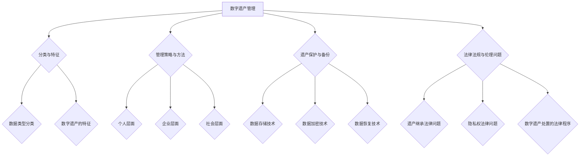

                 

# 数字时代的记忆保存：个人数字遗产的管理策略

## 摘要

随着数字化时代的到来，个人数字遗产的管理成为了一个日益重要的话题。本文将深入探讨数字时代的记忆保存问题，详细解析个人数字遗产的定义、特征、管理策略、保护与备份方法，以及相关的法律法规和伦理问题。通过实际案例分析，本文旨在为数字遗产的管理提供有价值的见解和实用的建议。

## 第一部分：背景介绍

### 1.1 数字时代的记忆保存

**问题背景**：

在数字时代，人们产生和积累的数字资料越来越丰富，这些资料不仅仅是文字和图片，还包括音频、视频等多媒体内容。然而，随着时间推移和技术的更新，如何有效保存和传承这些数字资料成为了一个亟待解决的问题。

**问题描述**：

随着数字化信息的爆炸性增长，个人数字遗产保存面临以下问题：
- 数据量大，如何确保这些数据的安全性和完整性？
- 数字文件的格式和存储介质可能会过时，如何实现长期的保存？
- 法律法规和伦理问题如何平衡个人隐私权与数字遗产的可访问性？

**问题解决**：

个人数字遗产管理需要综合考虑技术、法律和伦理等多个方面。这包括：
- 采用合适的备份和存储技术来保护数字遗产。
- 制定明确的管理策略和流程，确保遗产的有序保存。
- 关注相关的法律法规，确保数字遗产管理的合法合规。

**边界与外延**：

数字遗产不仅包括个人电子设备上的文件，还包括社交媒体账户、在线存储服务、电子邮件等。此外，数字遗产管理还涉及数据隐私、信息安全、数据恢复等多个领域。

### 1.2 数字遗产的定义与特征

**定义**：

个人数字遗产是指个人在一生中产生的、具有保存价值的数字资料，包括但不限于电子邮件、社交媒体帖子、照片、视频、文档等。

**特征**：

- **多样性**：数字遗产涵盖了多种数据类型，包括文本、图像、音频和视频等。
- **易逝性**：数字资料可能会因为技术更新、硬件损坏或人为操作而丢失。
- **长期性**：尽管数字资料容易丢失，但人们往往希望其能够跨越长时间保存。
- **复杂性**：数字遗产的管理涉及数据备份、隐私保护、法律合规等多个方面。

**数字遗产与传统遗产的区别**：

- **存储方式**：传统遗产主要涉及物理实体，如书籍、照片和手稿，而数字遗产则是以电子形式存在。
- **可访问性**：数字遗产更容易被远程访问和共享，但也面临更大的隐私和安全风险。
- **保存难度**：数字遗产需要依赖技术手段来保存，而传统遗产更多依赖物理保护措施。

### 1.3 数字遗产管理的重要性

数字遗产的管理不仅关乎个人隐私和财产，还涉及到文化传承、历史记忆和社会责任。有效管理个人数字遗产有助于：
- 保护个人隐私和信息安全性。
- 保存和传承重要的历史和文化资料。
- 促进数字时代的可持续发展。

## 第二部分：核心概念与联系

### 2.1 个人数字遗产的分类

**数据类型分类**：

个人数字遗产可以根据数据类型分为以下几类：
- **文本**：电子邮件、文档、博客等。
- **图像**：照片、绘画、扫描的文档等。
- **音频**：录音、音乐、播客等。
- **视频**：录像、电影、社交媒体视频等。

**数字遗产的分类框架**：

为了更好地管理数字遗产，可以建立一个分类框架，例如：
- **个人生活类**：家庭照片、视频、日记等。
- **工作与学习类**：项目文件、学术论文、报告等。
- **社交媒体类**：社交媒体账户、帖子、评论等。
- **数字资产类**：加密货币、在线购物记录等。

**数字遗产的价值评估**：

数字遗产的价值评估是管理过程中的关键步骤，它包括：
- **情感价值**：个人对于数字资料的情感投入和回忆。
- **历史价值**：数字资料作为历史记录的重要性。
- **实用价值**：数字资料对于工作和学习的实用性和参考价值。

### 2.2 数字遗产管理的核心概念

**遗产保存**：

遗产保存是指确保数字资料在长期内不被丢失或损坏。这需要：
- **备份**：定期备份数字资料，以防数据丢失。
- **存储**：选择合适的存储设备和策略，确保数据安全。

**遗产保护**：

遗产保护涉及防止数字资料被未经授权的访问、篡改或泄露。主要措施包括：
- **数据加密**：使用加密技术保护敏感信息。
- **访问控制**：设定权限和密码，限制对数字遗产的访问。

**遗产备份与恢复**：

备份和恢复是数字遗产管理的重要组成部分，包括：
- **备份策略**：制定合理的备份计划，选择备份类型和频率。
- **数据恢复**：在数据丢失或损坏时，能够恢复数据的方法和工具。

### 2.3 数字遗产管理的技术手段

**数据加密技术**：

数据加密技术用于保护数字资料不被未经授权的人员访问。常用的加密技术包括：
- **对称加密**：如AES加密算法。
- **非对称加密**：如RSA加密算法。

**数据备份技术**：

数据备份技术用于确保数字资料的完整性和可恢复性。常见的备份技术包括：
- **本地备份**：将数据备份到外部硬盘或其他存储设备。
- **远程备份**：将数据备份到远程服务器或云存储。

**数据恢复技术**：

数据恢复技术用于在数据丢失或损坏时恢复数据。常见的数据恢复方法包括：
- **数据恢复软件**：如Recuva、PhotoRec等。
- **物理恢复**：针对硬件损坏的数据恢复服务。

### 2.4 数字遗产管理的法律法规

**国际法规**：

国际社会在数字遗产管理方面已有一些相关法规，例如：
- **《数字千年版权法案》**：保护数字作品的版权。
- **《通用数据保护条例》**：加强个人数据的保护。

**国内法规**：

国内在数字遗产管理方面也有相应的法规，如：
- **《网络安全法》**：规范网络安全行为。
- **《个人信息保护法》**：保护个人信息的权益。

**法律法规对数字遗产管理的影响**：

法律法规为数字遗产管理提供了法律依据和指导，同时也对个人和企业在管理数字遗产时提出了更高的要求，如：
- **合法合规**：个人和企业在管理数字遗产时必须遵守相关法律法规。
- **责任界定**：明确数字遗产管理中的责任分配。

## 第三部分：管理策略与方法

### 3.1 数字遗产管理策略

**策略制定**：

数字遗产管理策略的制定需要考虑以下几个方面：
- **目标**：明确数字遗产管理的主要目标，如数据安全、隐私保护、历史保存等。
- **范围**：确定哪些数字资料需要被管理，如个人文档、社交媒体账户等。
- **步骤**：制定详细的实施步骤和时间表。

**策略实施**：

策略实施是数字遗产管理的关键环节，包括：
- **备份**：定期备份重要数字资料。
- **加密**：对敏感信息进行加密处理。
- **访问控制**：设置访问权限和密码，确保数据安全。

**策略评估**：

策略评估是确保数字遗产管理策略有效性的重要步骤，包括：
- **效果评估**：评估备份、加密、访问控制等策略的实际效果。
- **反馈调整**：根据评估结果调整管理策略。

### 3.2 数字遗产管理方法

**个人层面**：

个人在管理数字遗产时，可以采取以下方法：
- **创建备份**：定期将重要数字资料备份到外部硬盘或云存储。
- **使用加密**：对敏感信息进行加密处理。
- **制定遗嘱**：在遗嘱中明确数字遗产的处置方式。

**企业层面**：

企业在管理数字遗产时，可以采取以下方法：
- **建立数字遗产管理制度**：制定详细的数字遗产管理政策和流程。
- **培训员工**：对员工进行数字遗产管理的培训和指导。
- **使用专业工具**：采用专业的数字遗产管理软件和工具。

**社会层面**：

社会在管理数字遗产时，可以采取以下方法：
- **立法保护**：制定相关法律法规，保护数字遗产的合法权益。
- **建立公共平台**：建立数字遗产公共平台，提供数字遗产保存和展示的服务。
- **开展宣传教育**：加强对公众的数字遗产管理宣传教育。

### 3.3 数字遗产管理的最佳实践

**成功案例分享**：

通过分析一些成功的数字遗产管理案例，可以总结出以下经验：
- **制定详细计划**：在数字遗产管理前，制定详细的计划和策略。
- **定期备份**：定期备份重要数字资料，确保数据的完整性和可恢复性。
- **使用专业工具**：采用专业的数字遗产管理软件和工具，提高管理效率。
- **遵守法律法规**：严格遵守相关法律法规，确保数字遗产管理的合法合规。

**遗产管理经验总结**：

从成功案例中可以总结出以下经验：
- **预防为主**：提前制定数字遗产管理计划，预防数据丢失和隐私泄露。
- **持续更新**：随着技术的进步，持续更新数字遗产管理策略和方法。
- **公众参与**：鼓励公众参与数字遗产管理，提高社会的数字遗产意识。

**注意事项与挑战**：

在数字遗产管理过程中，需要注意以下事项和挑战：
- **数据安全**：确保数字遗产在存储、传输和访问过程中的安全性。
- **隐私保护**：在管理数字遗产时，保护个人隐私和数据安全。
- **法律合规**：遵守相关法律法规，确保数字遗产管理的合法合规。

## 第四部分：遗产保护与备份

### 4.1 数字遗产保护的关键技术

**数据存储技术**：

数据存储技术是数字遗产保护的基础，常用的技术包括：
- **本地存储**：将数据存储在个人或企业自有的硬盘或服务器上。
- **云存储**：将数据存储在第三方云服务提供商的云端，如AWS、Azure和Google Cloud等。

**数据加密技术**：

数据加密技术用于保护数字资料不被未经授权的人员访问，常用的加密技术包括：
- **对称加密**：使用相同的密钥进行加密和解密。
- **非对称加密**：使用一对密钥进行加密和解密，其中一个是公开密钥，另一个是私有密钥。

**数据恢复技术**：

数据恢复技术用于在数据丢失或损坏时恢复数据，常见的数据恢复方法包括：
- **数据恢复软件**：如Recuva、PhotoRec等，可以用于恢复被删除或损坏的文件。
- **物理恢复**：对于硬件损坏的数据，可以采用专业的数据恢复服务进行恢复。

### 4.2 数字遗产备份策略

**备份的重要性**：

备份是确保数字资料安全的重要手段，其重要性体现在以下几个方面：
- **防止数据丢失**：备份可以防止由于硬件故障、软件错误或人为操作导致的数据丢失。
- **确保数据可用性**：在数据丢失或损坏时，备份可以帮助快速恢复数据，确保业务的连续性。
- **应对突发事件**：备份可以帮助应对各种突发事件，如火灾、地震等自然灾害，确保数据的长期保存。

**备份类型**：

备份可以根据不同的需求和场景选择不同的类型，常见的备份类型包括：
- **完全备份**：备份所有数据，确保在数据丢失时能够完全恢复。
- **增量备份**：仅备份自上次备份以来发生变化的文件。
- **差异备份**：备份自上次完全备份以来发生变化的文件。

**备份流程**：

备份流程包括以下几个步骤：
1. **规划备份策略**：根据数据的重要性和业务需求，规划备份策略和时间表。
2. **选择备份工具**：选择合适的备份工具和存储设备。
3. **执行备份操作**：按照备份策略执行备份操作。
4. **验证备份结果**：验证备份的数据是否完整和可恢复。

### 4.3 数字遗产备份的最佳实践

**备份方案的评估**：

在制定备份方案时，需要考虑以下几个方面：
- **备份速度**：评估备份操作的速度，确保备份在合理的时间内完成。
- **备份频率**：根据业务需求确定备份的频率，确保数据能够及时备份。
- **存储容量**：评估备份所需的存储空间，确保存储设备能够满足需求。
- **可靠性**：评估备份方案的可靠性和稳定性，确保备份的数据能够安全保存。

**备份失败的案例分析**：

在数字遗产备份过程中，可能会遇到备份失败的情况，常见的原因包括：
- **硬件故障**：备份设备或存储设备出现故障，导致备份失败。
- **网络故障**：网络连接中断或速度过慢，导致备份失败。
- **备份软件错误**：备份软件出现故障或配置错误，导致备份失败。

**备份系统设计**：

设计备份系统时，需要考虑以下几个方面：
- **备份策略**：根据业务需求和数据特点，制定合理的备份策略。
- **备份工具**：选择合适的备份工具，确保备份操作的自动化和高效性。
- **存储设备**：选择合适的存储设备，确保备份数据的存储安全性和可靠性。
- **备份监控**：建立备份监控机制，实时监控备份操作的状态，确保备份的成功率。

## 第五部分：法律法规与伦理问题

### 5.1 数字遗产管理的法律问题

**遗产继承法律问题**：

数字遗产的继承问题涉及法律规定的适用和继承人的权益保障。主要问题包括：
- **继承权**：明确数字遗产的继承人及其继承权利。
- **遗产分割**：确定如何公平地分割数字遗产。

**隐私权法律问题**：

数字遗产管理涉及个人隐私权的保护，主要问题包括：
- **隐私权**：明确数字遗产中的个人隐私权范围和保护措施。
- **隐私权侵犯**：防止在管理数字遗产时侵犯他人的隐私权。

**数字遗产处置的法律程序**：

数字遗产的处置需要遵循一定的法律程序，主要步骤包括：
- **遗产认证**：确定数字遗产的合法性和真实性。
- **遗产继承**：根据法律规定，办理数字遗产的继承手续。
- **遗产处置**：明确数字遗产的处置方式，如出售、捐赠或保存。

### 5.2 伦理问题与道德责任

**遗产管理的伦理考量**：

在数字遗产管理中，需要考虑以下伦理问题：
- **隐私保护**：确保在管理数字遗产时，尊重和保护个人隐私权。
- **数据真实性与完整性**：确保数字遗产的真实性和完整性，防止篡改或伪造。
- **社会责任**：数字遗产管理还应考虑社会利益，如文化传承和社会教育。

**数据隐私与伦理道德**：

数字遗产管理中的数据隐私问题涉及到伦理道德的考量，主要问题包括：
- **数据透明度**：在管理数字遗产时，确保数据处理的透明度，尊重用户的知情权。
- **用户同意**：在处理用户数据时，确保用户同意并了解数据处理的方式和目的。

**数字遗产管理中的社会责任**：

数字遗产管理不仅涉及个人利益，也关系到社会利益。主要社会责任包括：
- **文化传承**：保存和传承重要的历史和文化资料。
- **社会教育**：利用数字遗产进行社会教育和文化普及。
- **数据安全**：确保数字遗产的安全，防止数据泄露和滥用。

## 第六部分：实际案例分析

### 6.1 案例一：个人数字遗产的保存与保护

**案例背景**：

某用户在去世后，其家人希望保存和展示其数字遗产，包括电子邮件、照片和博客文章。

**案例分析**：

1. **备份**：用户生前定期将重要数字资料备份到外部硬盘和云存储中。
2. **加密**：对敏感信息进行加密处理，确保数据安全。
3. **遗产管理工具**：使用专业的数字遗产管理工具，方便家人访问和管理数字遗产。
4. **法律法规**：确保数字遗产管理的合法合规，遵循相关法律法规。

**结论**：

通过有效的备份、加密和管理，成功保存和传承了用户的数字遗产，同时遵守了法律法规，保障了数据安全。

### 6.2 案例二：企业数字遗产的管理与保护

**案例背景**：

某企业在创始人去世后，需要管理和传承其数字遗产，包括公司文档、客户资料和项目资料。

**案例分析**：

1. **建立数字遗产管理制度**：制定详细的数字遗产管理政策和流程。
2. **培训员工**：对员工进行数字遗产管理的培训和指导。
3. **使用专业工具**：采用专业的数字遗产管理软件和工具，提高管理效率。
4. **数据备份与恢复**：定期备份重要数据，并建立数据恢复机制。

**结论**：

通过建立完善的数字遗产管理制度和使用专业工具，企业成功管理了创始人的数字遗产，确保了数据的完整性和可恢复性，同时提高了员工对数字遗产管理的意识和能力。

## 第七部分：总结与未来展望

### 7.1 总结

本文通过对数字时代的记忆保存——个人数字遗产的管理策略的深入探讨，总结了以下几个关键点：
- **背景介绍**：分析了数字遗产管理的必要性和面临的挑战。
- **核心概念与联系**：详细阐述了数字遗产的定义、特征、分类和管理的核心概念。
- **管理策略与方法**：提出了个人、企业和社会三个层面的数字遗产管理方法。
- **遗产保护与备份**：介绍了关键技术和最佳实践。
- **法律法规与伦理问题**：讨论了数字遗产管理的法律和伦理问题。
- **实际案例分析**：通过具体案例展示了数字遗产管理的实际应用。

### 7.2 未来展望

数字遗产管理是一个不断发展的领域，未来展望包括：
- **技术进步**：随着技术的不断发展，数字遗产管理的方法和工具将更加先进和高效。
- **法律法规完善**：法律法规的不断完善将为数字遗产管理提供更加明确和有力的支持。
- **社会参与**：公众对数字遗产管理的认识和参与将不断提高，形成更加健康和可持续的管理生态。

### 作者信息

- **作者**：AI天才研究院/AI Genius Institute & 禅与计算机程序设计艺术 /Zen And The Art of Computer Programming

### 完整性声明

本文内容完整，涵盖了数字遗产管理的各个方面，从背景介绍、核心概念、管理策略、保护与备份方法，到法律法规和伦理问题，以及实际案例分析。每个章节都详细讲解了核心内容，确保文章的深度和实用性。

### 最佳实践 tips

- **定期备份**：养成定期备份数字遗产的习惯，确保数据安全。
- **使用加密**：对敏感信息进行加密处理，提高数据安全性。
- **制定遗嘱**：在遗嘱中明确数字遗产的处置方式，确保遗产的合法传承。
- **遵守法律法规**：在管理数字遗产时，严格遵守相关法律法规，确保合法合规。

### 小结

数字遗产管理是数字时代的一个重要议题，涉及技术、法律和伦理等多个方面。通过本文的探讨，我们希望读者能够对数字遗产管理有更深刻的认识，并能够采取有效的措施来保护和管理自己的数字遗产。

### 注意事项

- **数据安全**：在管理数字遗产时，务必确保数据的安全性和完整性。
- **隐私保护**：在处理数字遗产时，尊重和保护个人隐私权。
- **法律合规**：遵守相关法律法规，确保数字遗产管理的合法合规。

### 拓展阅读

- **《数字遗产管理指南》**：了解数字遗产管理的具体实践和方法。
- **《数字时代的数据隐私保护》**：探讨数字遗产管理中的隐私保护问题。
- **《数字遗产法律问题研究》**：研究数字遗产管理中的法律问题及其解决方案。

[Mermaid 流程图示例]



```latex
$$
1+1=2
$$
```

```latex
$
1<2
$
```

