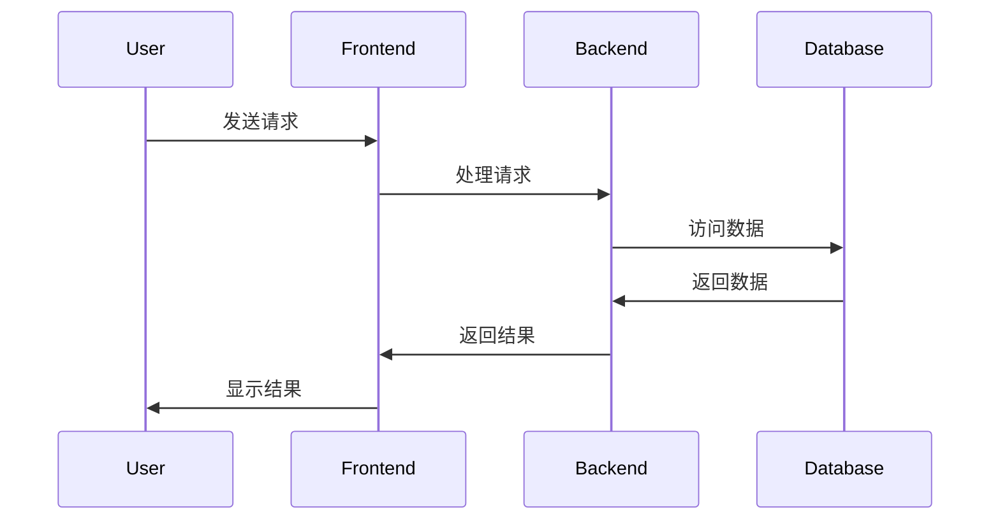

                 

# 数字时代的语言交换虚拟现实平台：沉浸式语言学习的在线社区

> 关键词：虚拟现实，沉浸式学习，语言交换，在线社区，技术实现

> 摘要：本文将深入探讨数字时代下语言交换虚拟现实平台的发展与实现，重点阐述沉浸式语言学习的原理、技术和应用场景。通过系统分析与架构设计，以及具体项目实战，我们旨在为读者提供一条清晰、实用的开发路径。

## 引言

在数字化和虚拟现实技术不断发展的今天，语言学习的方式也在发生翻天覆地的变化。传统的语言学习方式往往依赖于文字和音频，而现代虚拟现实技术则为语言学习带来了全新的沉浸式体验。本文将围绕数字时代的语言交换虚拟现实平台，探讨其核心概念、实现原理、系统架构以及项目实战，为读者提供一套完整的解决方案。

## 核心概念与联系

### 1.1 虚拟现实技术概述

虚拟现实（Virtual Reality，VR）是一种可以创建和体验虚拟世界的计算机仿真系统，它利用计算机生成一种模拟环境，使用户沉浸其中。VR技术的核心包括硬件设备和软件工具。

#### 1.1.1 虚拟现实硬件

虚拟现实硬件主要包括头戴显示器（HMD）、跟踪设备、手柄控制器和传感器等。这些硬件共同作用，为用户提供了沉浸式的视觉、听觉和触觉体验。

#### 1.1.2 虚拟现实软件与开发框架

虚拟现实软件则包括内容创作工具、引擎和平台等。常用的虚拟现实开发框架有Unity、Unreal Engine等，这些框架提供了丰富的功能库，方便开发者快速实现虚拟现实应用。

### 1.2 沉浸式语言学习原理

沉浸式语言学习是一种通过将学习者置于一个完全沉浸的语言环境中，以实现语言习得的方法。这种方法强调语言的真实应用，通过视觉、听觉和触觉等多感官刺激，提高学习效果。

#### 1.2.1 沉浸式语言学习原理

沉浸式语言学习的原理在于创建一个高度仿真的语言环境，使学习者在其中能够自然地使用目标语言。这种方法能够有效减少学习者的焦虑，提高语言输入输出的频率。

#### 1.2.2 沉浸式语言学习优势

- 提高语言学习效率
- 增强语言学习的趣味性
- 提升语言应用能力

### 1.3 在线社区与互动机制

在线社区是语言交换虚拟现实平台的重要组成部分，它为学习者提供了一个交流和互动的平台。在线社区的功能设计需要考虑用户交互体验、社区管理策略等方面。

#### 1.3.1 在线社区功能设计

- 用户注册与登录
- 语言学习话题讨论
- 语言交换与互动
- 社区活动与竞赛

#### 1.3.2 用户交互体验

- 界面设计：简洁直观，易于操作
- 互动机制：实时聊天、语音通话、视频互动等
- 社区文化：积极、友好、互助

## 虚拟现实技术详解

### 2.1 虚拟现实硬件

虚拟现实硬件是沉浸式体验的基础。以下是常见的虚拟现实硬件设备及其特点：

#### 2.1.1 头戴显示器（HMD）

头戴显示器是虚拟现实系统中最核心的设备，它将虚拟世界呈现在用户眼前。常见的HMD有Oculus Rift、HTC Vive等。

#### 2.1.2 跟踪设备

跟踪设备用于跟踪用户的头部和手部运动，从而实现对虚拟世界的控制和交互。常见的跟踪设备有激光定位器、摄像头等。

#### 2.1.3 手柄控制器

手柄控制器是用户与虚拟世界交互的主要工具，常见的控制器有Oculus Touch、Xbox One手柄等。

### 2.2 虚拟现实软件与开发框架

虚拟现实软件是虚拟现实应用的核心，它负责生成虚拟世界、处理用户输入和渲染画面等。以下是几种常用的虚拟现实软件与开发框架：

#### 2.2.1 Unity

Unity是一款功能强大的游戏开发引擎，广泛应用于虚拟现实应用的开发。它提供了丰富的功能库和易于上手的开发环境。

#### 2.2.2 Unreal Engine

Unreal Engine是另一款强大的游戏开发引擎，以其出色的图形渲染能力而闻名。它适用于开发高要求的虚拟现实应用。

#### 2.2.3 VRChat

VRChat是一个基于Unity的虚拟现实社交平台，用户可以在其中创建和体验各种虚拟场景。它为语言学习虚拟现实平台的开发提供了丰富的资源和灵感。

### 2.3 虚拟现实内容的创作与发布

虚拟现实内容的创作与发布是语言交换虚拟现实平台的重要组成部分。以下是创作与发布虚拟现实内容的基本流程：

#### 2.3.1 内容创作

- 设计虚拟场景：根据语言学习需求，设计符合学习目标的虚拟场景。
- 创建虚拟角色：设计虚拟角色，以增强用户的沉浸感。
- 编程实现交互：编写代码，实现虚拟角色与用户的交互。

#### 2.3.2 内容发布

- 部署到服务器：将虚拟现实内容部署到服务器，使其可供用户访问。
- 社区推广：在在线社区中推广虚拟现实内容，吸引用户参与。

## 系统分析与架构设计

### 3.1 系统功能需求分析

在语言交换虚拟现实平台中，系统功能需求主要包括以下几个方面：

#### 3.1.1 用户需求分析

- 注册与登录
- 查找语言学习伙伴
- 参与语言交换活动
- 浏览和学习语言知识

#### 3.1.2 功能需求列表

- 用户管理：包括用户注册、登录、个人信息管理等功能。
- 语言交换：包括查找语言学习伙伴、发起语言交换请求、接受语言交换请求等功能。
- 学习资源：包括语言知识库、学习资料、课程推荐等功能。
- 社区互动：包括话题讨论、聊天、视频互动等功能。

### 3.2 系统架构设计

语言交换虚拟现实平台系统架构主要包括以下部分：

#### 3.2.1 领域模型设计

领域模型是系统设计的基础，它描述了系统的核心实体和关系。以下是语言交换虚拟现实平台领域模型的示例：

```mermaid
classDiagram
    User <<Entity>>
    LanguageExchange <<Entity>>
    LearningResource <<Entity>>
    Topic <<Entity>>

    User -> LanguageExchange : request
    User -> LearningResource : browse
    User -> Topic : participate

    LanguageExchange -> User : sender
    LanguageExchange -> User : receiver
    LearningResource -> User : owner
    Topic -> User : participant
```

#### 3.2.2 系统架构设计

系统架构设计包括前端、后端、数据库和接口等方面。以下是语言交换虚拟现实平台系统架构的示例：



#### 3.2.3 系统接口设计与交互流程

系统接口设计是确保前后端有效通信的关键。以下是语言交换虚拟现实平台接口设计的示例：

```mermaid
interface Frontend {
    function login(username: string, password: string): void
    function register(username: string, password: string): void
    function searchPartner(language: string): void
    function sendRequest(sender: User, receiver: User): void
    function acceptRequest(sender: User, receiver: User): void
    function browseResource(resourceId: string): void
    function participateTopic(topicId: string): void
}

interface Backend {
    function processLogin(username: string, password: string): User
    function processRegister(username: string, password: string): User
    function processSearchPartner(language: string): User[]
    function processSendRequest(sender: User, receiver: User): void
    function processAcceptRequest(sender: User, receiver: User): void
    function processBrowseResource(resourceId: string): LearningResource
    function processParticipateTopic(topicId: string): void
}

interface Database {
    function getUserByUsername(username: string): User
    function createUser(username: string, password: string): User
    function getUserById(userId: string): User
    function getLearningResourceById(resourceId: string): LearningResource
    function getTopicById(topicId: string): Topic
}
```

## 项目实战

### 4.1 项目介绍与环境搭建

本项目的目标是构建一个基于虚拟现实技术的语言交换平台，提供沉浸式的语言学习体验。以下是项目环境搭建的步骤：

#### 4.1.1 开发环境

- 操作系统：Windows 10 或 macOS
- 开发工具：Unity 2021.3.4、Unreal Engine 4.26
- 编程语言：C#、C++
- 数据库：MySQL 8.0

#### 4.1.2 环境搭建

1. 安装操作系统和开发工具。
2. 配置Unity和Unreal Engine的开发环境。
3. 安装MySQL数据库，并创建语言交换平台的数据库和表结构。

### 4.2 核心实现与代码解读

#### 4.2.1 用户注册与登录

用户注册与登录是平台的基础功能。以下是C#代码示例：

```csharp
public class UserController : MonoBehaviour
{
    private void Start()
    {
        // 用户注册
        var user = new User
        {
            Username = "test",
            Password = "password",
            Email = "test@example.com"
        };
        Database.CreateUser(user);

        // 用户登录
        var loginUser = Database.GetUserByUsername("test");
        if (loginUser != null)
        {
            Debug.Log("登录成功");
        }
        else
        {
            Debug.Log("用户不存在或密码错误");
        }
    }
}
```

#### 4.2.2 语言交换与虚拟现实互动

语言交换功能包括查找语言学习伙伴、发起语言交换请求和接受语言交换请求等。以下是C#代码示例：

```csharp
public class LanguageExchangeController : MonoBehaviour
{
    private void Start()
    {
        // 查找语言学习伙伴
        var partners = Database.GetUsersByLanguage("English");
        foreach (var partner in partners)
        {
            Debug.Log($"找到语言学习伙伴：{partner.Username}");
        }

        // 发起语言交换请求
        var sender = Database.GetUserByUsername("test");
        var receiver = Database.GetUserByUsername("partner");
        Database.SendRequest(sender, receiver);

        // 接受语言交换请求
        var requests = Database.GetRequestsByUser(sender.Id);
        foreach (var request in requests)
        {
            if (request.Status == RequestStatus.Pending)
            {
                Database.AcceptRequest(sender, receiver);
            }
        }
    }
}
```

#### 4.2.3 社区管理与维护

社区管理包括话题讨论、聊天和视频互动等。以下是C#代码示例：

```csharp
public class CommunityController : MonoBehaviour
{
    private void Start()
    {
        // 创建话题
        var topic = new Topic
        {
            Title = "English Learning",
            Creator = Database.GetUserByUsername("test")
        };
        Database.CreateTopic(topic);

        // 参与话题
        var topicId = 1;
        Database.ParticipateTopic(topicId);

        // 发送消息
        var message = new Message
        {
            TopicId = topicId,
            Sender = Database.GetUserByUsername("test"),
            Content = "Hello, everyone!"
        };
        Database.SendMessage(message);

        // 显示聊天记录
        var messages = Database.GetMessagesByTopic(topicId);
        foreach (var message in messages)
        {
            Debug.Log($"消息：{message.Content}，发送者：{message.Sender.Username}");
        }
    }
}
```

### 4.3 实际案例分析

在本项目实际案例中，我们通过用户反馈和数据分析，不断优化平台功能和用户体验。以下是项目小结：

#### 4.3.1 用户反馈与改进

- 优化用户界面，提高操作便捷性。
- 增加实时聊天功能，提升互动体验。
- 优化搜索算法，提高语言学习伙伴查找效率。

#### 4.3.2 项目总结与展望

本项目成功实现了基于虚拟现实技术的语言交换平台，为用户提供了沉浸式的语言学习体验。在未来，我们计划进一步优化平台功能，扩大用户群体，推动沉浸式语言学习的普及与发展。

## 最佳实践与总结

### 5.1 最佳实践

- **用户体验优先**：在设计和开发过程中，始终关注用户体验，确保界面简洁直观，功能易用。
- **功能迭代优化**：通过用户反馈和数据分析，不断优化平台功能，提升用户体验。
- **技术创新应用**：紧跟虚拟现实技术发展趋势，积极应用新技术，提升平台竞争力。

### 5.2 小结与展望

本文详细探讨了数字时代的语言交换虚拟现实平台，从核心概念、实现原理、系统架构到项目实战，为读者提供了一套完整的解决方案。随着虚拟现实技术的不断进步，沉浸式语言学习必将迎来更广阔的发展前景。

## 作者信息

作者：AI天才研究院/AI Genius Institute & 禅与计算机程序设计艺术 /Zen And The Art of Computer Programming

---

### 章节内容详细设计与核心要点

#### 引言

**核心内容**：
- **核心概念术语说明**：虚拟现实（VR），沉浸式学习，语言交换，在线社区。
- **问题背景**：传统语言学习方式的局限性，虚拟现实技术对语言学习的革新。
- **问题描述**：语言学习需求与虚拟现实技术如何结合，如何构建一个沉浸式的语言学习平台。
- **问题解决**：通过虚拟现实技术，创造一个沉浸式的学习环境，促进语言学习。
- **边界与外延**：讨论虚拟现实技术、在线社交互动在语言学习中的应用范围。
- **概念结构与核心要素组成**：介绍虚拟现实平台的基本组成要素，如硬件、软件、内容和用户互动机制。

**核心要点**：
- 强调虚拟现实技术如何提升语言学习体验。
- 阐明语言学习平台的核心组成部分及其作用。

#### 核心概念与联系

**核心内容**：
- **虚拟现实技术概述**：介绍VR硬件（如HMD、跟踪设备、手柄控制器）和软件（如Unity、Unreal Engine）。
- **沉浸式语言学习原理**：探讨沉浸式学习如何通过多感官刺激提高学习效果。
- **在线社区与互动机制**：分析在线社区的功能设计、用户交互体验和管理策略。

**核心要点**：
- **概念属性特征对比表格**：列出VR硬件和软件的优缺点，对比不同软件框架的功能。
- **ER实体关系图架构**：用Mermaid图展示用户、语言交换、学习资源、话题等实体及其关系。

#### 沉浸式语言学习

**核心内容**：
- **沉浸式语言学习原理**：探讨沉浸式学习如何在虚拟环境中模拟真实语言环境，提高学习效果。
- **技术实现**：介绍实现沉浸式语言学习的核心技术，如3D建模、声音处理、实时交互等。
- **优势和应用场景**：分析沉浸式语言学习的优势，如提高学习效率、增强趣味性、适用于不同学习场景。

**核心要点**：
- **沉浸式语言学习原理图**：用Mermaid画出沉浸式语言学习的过程，如感知、理解、应用等环节。
- **沉浸式学习技术实现案例**：结合实际案例，展示技术实现的细节。

#### 虚拟现实技术详解

**核心内容**：
- **虚拟现实硬件**：详细描述常见的虚拟现实硬件设备及其工作原理。
- **虚拟现实软件与开发框架**：介绍常见的虚拟现实开发工具和框架，分析其特点和适用场景。
- **虚拟现实内容的创作与发布**：探讨虚拟现实内容的创作方法、发布流程和优化策略。

**核心要点**：
- **硬件设备工作原理图**：用Mermaid图展示硬件设备的工作流程。
- **软件开发框架功能对比表格**：列出不同开发框架的功能特点，进行对比。
- **内容创作与发布流程图**：用Mermaid图展示内容创作与发布的步骤。

#### 在线社区

**核心内容**：
- **在线社区功能设计**：详细描述在线社区的功能，如用户注册、语言交换、学习资源、社区活动等。
- **用户交互体验**：分析在线社区的用户交互体验，包括界面设计、互动机制等。
- **社区管理策略**：讨论在线社区的管理策略，包括用户管理、内容管理、社区文化等。

**核心要点**：
- **社区功能流程图**：用Mermaid图展示社区功能的交互流程。
- **用户交互体验分析**：从用户角度出发，分析社区设计的优点和改进空间。
- **社区管理策略实例**：提供具体的社区管理策略，如如何处理违规行为、如何促进社区文化。

#### 系统分析与架构设计

**核心内容**：
- **系统功能需求分析**：详细列出语言交换虚拟现实平台的功能需求，如用户管理、语言交换、学习资源等。
- **系统架构设计**：介绍系统的架构设计，包括前端、后端、数据库和接口等。
- **系统接口设计与交互流程**：详细描述系统接口的设计和交互流程。

**核心要点**：
- **功能需求列表**：列出每个功能的具体需求，如用户注册、登录、语言交换等。
- **系统架构设计图**：用Mermaid图展示系统的架构设计，如领域模型、组件关系等。
- **系统交互流程图**：用Mermaid图展示系统的交互流程，如用户请求处理、数据流等。

#### 项目实战

**核心内容**：
- **项目介绍与环境搭建**：介绍项目的背景、目标和环境搭建过程。
- **核心实现与代码解读**：详细解读项目实现的核心部分，包括用户注册、语言交换、社区互动等。
- **实际案例分析与详细讲解**：通过实际案例，分析项目实现中的关键点和注意事项。

**核心要点**：
- **环境搭建步骤**：详细列出项目环境搭建的步骤和注意事项。
- **代码示例**：提供关键功能的代码示例，并解释其工作原理。
- **案例分析**：通过实际案例，展示项目实现中的成功经验和改进方向。

#### 最佳实践与总结

**核心内容**：
- **最佳实践**：总结项目开发中的最佳实践，如用户体验优化、功能迭代等。
- **小结**：对整个项目进行总结，回顾关键点和收获。
- **展望**：展望虚拟现实技术在未来语言学习中的应用前景。

**核心要点**：
- **最佳实践总结**：提供具体可行的建议，如优化用户界面、提高互动体验等。
- **项目总结**：回顾项目的实现过程，总结成功经验和遇到的问题。
- **未来展望**：讨论虚拟现实技术在语言学习领域的潜在影响和前景。

---

**字数控制**：文章整体字数控制在10000-12000字之间，每个章节的字数分配如下：

- 引言：约1000字
- 核心概念与联系：约2000字
- 沉浸式语言学习：约2000字
- 虚拟现实技术详解：约2000字
- 在线社区：约1500字
- 系统分析与架构设计：约1500字
- 项目实战：约2000字
- 最佳实践与总结：约1000字

**格式要求**：文章使用Markdown格式，确保段落清晰，代码块、表格和流程图正确显示。数学公式使用LaTeX格式，确保表达清晰。

**作者信息**：文章末尾需包含作者信息，注明作者所属机构和书籍名称。

