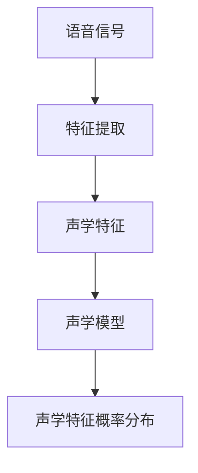
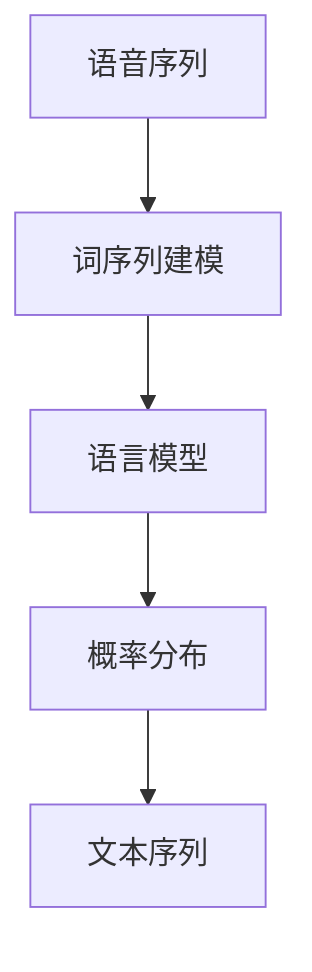
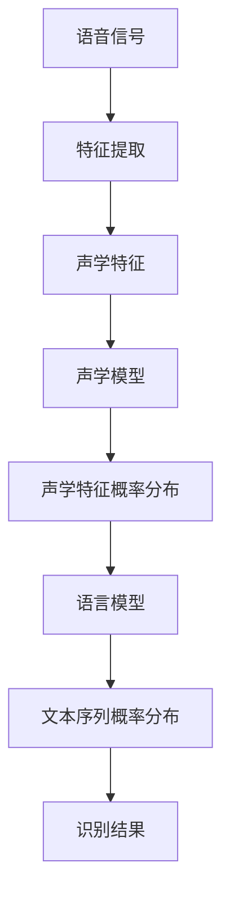
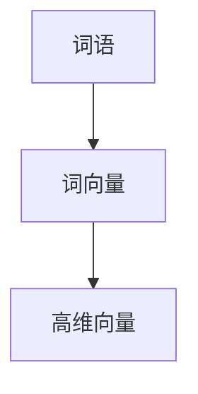
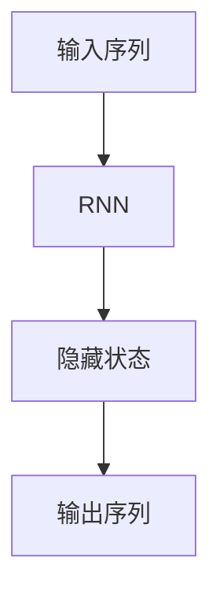
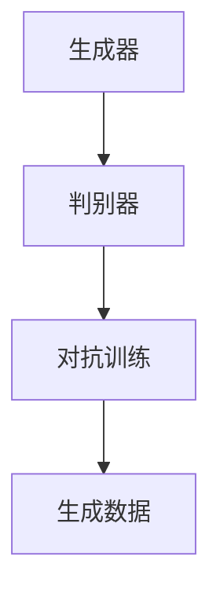
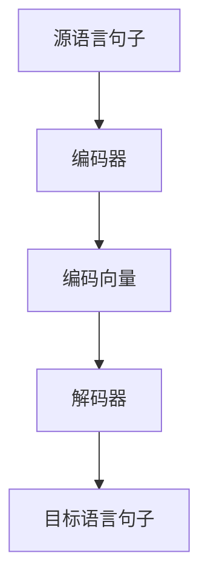
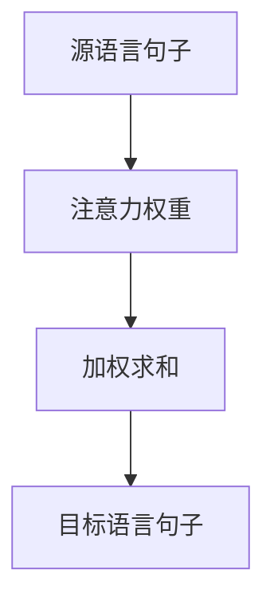
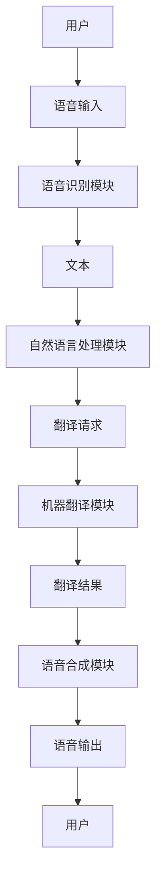
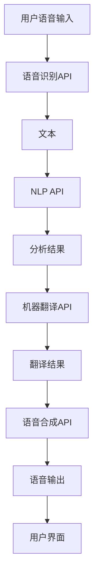

                 

### 文章标题：数字时代的语言学习：AI辅助下的多语言交流

#### 关键词：数字时代、语言学习、AI辅助、多语言交流、智能化教育

#### 摘要：
随着数字时代的快速发展，全球信息交流日益频繁，跨语言沟通的需求不断增长。本文探讨了数字时代背景下的语言学习挑战，以及AI技术在辅助语言学习与多语言交流中的应用。通过分析AI辅助语言学习的核心原理，本文揭示了语音识别、自然语言处理和机器翻译在语言学习中的重要作用。同时，本文还讨论了多语言交流的特点及其与AI辅助语言学习的关系，展望了未来AI技术在语言学习领域的发展趋势。

### 目录大纲

#### 第一部分：背景介绍

#### 1.1 问题背景

##### 1.1.1 数字时代的快速发展与语言学习需求

##### 1.1.2 语言学习的需求与困境

##### 1.1.3 AI在语言学习中的应用潜力

#### 1.2 核心概念

##### 1.2.1 AI辅助语言学习

##### 1.2.2 多语言交流

##### 1.2.3 数字时代的语言学习特点

#### 1.3 边界与外延

##### 1.3.1 数字时代的语言学习

##### 1.3.2 多语言交流

##### 1.3.3 AI辅助语言学习与多语言交流的关系

#### 第二部分：核心概念与联系

##### 2.1 AI辅助语言学习原理

##### 2.2 多语言交流特点

##### 2.3 AI辅助语言学习与多语言交流的联系

#### 第三部分：算法原理讲解

##### 3.1 语音识别算法原理

##### 3.2 自然语言处理算法原理

##### 3.3 机器翻译算法原理

#### 第四部分：系统分析与架构设计方案

##### 4.1 问题场景介绍

##### 4.2 系统功能设计

##### 4.3 系统架构设计

##### 4.4 系统接口设计和系统交互

#### 第五部分：项目实战

##### 5.1 环境安装

##### 5.2 系统核心实现源代码

##### 5.3 代码应用解读与分析

##### 5.4 实际案例分析和详细讲解剖析

##### 5.5 项目小结

#### 第六部分：最佳实践 tips、小结、注意事项、拓展阅读

### 第一部分：背景介绍

#### 1.1 问题背景

##### 1.1.1 数字时代的快速发展与语言学习需求

随着互联网和移动互联网的普及，全球信息交流的速度和频率得到了前所未有的提升。在数字时代，跨语言沟通的需求越来越强烈。无论是跨国公司的全球化运营，还是国际贸易的交流合作，都离不开多语言能力。然而，传统的语言学习方式往往面临以下挑战：

- **时间和资源的限制**：语言学习需要大量的时间和精力，尤其是在掌握多种语言的情况下，学习效率往往受到影响。
- **个性化学习需求的不足**：传统语言学习课程通常按照统一的教学计划进行，难以满足不同学习者的个性化需求。
- **语言习得效率的局限**：语言习得是一个复杂的过程，需要反复练习和真实场景的应用，而传统方式难以提供这种高效的学习环境。

##### 1.1.2 语言学习的需求与困境

在全球化趋势下，学习多语言已经成为提高职业竞争力的重要手段。以下是一些具体的语言学习需求：

- **职业发展**：掌握多种语言可以拓宽职业发展空间，尤其是在国际商务、翻译、旅游等行业。
- **文化交流**：语言是文化的重要载体，掌握多语言能够更好地理解不同文化，促进文化交流与合作。
- **教育普及**：随着教育国际化的发展，越来越多的学生需要掌握多语言能力以适应全球教育体系。

然而，面对这些需求，学习者往往面临以下困境：

- **学习资源有限**：高质量的教材、师资和语言学习资源往往分布不均，特别是在一些经济欠发达地区。
- **学习效率低下**：传统语言学习方式往往依赖记忆和机械练习，学习效率难以提高。
- **语言环境缺失**：缺乏真实语言交流的环境，学习者难以在实践中提高语言应用能力。

##### 1.1.3 AI在语言学习中的应用潜力

随着人工智能技术的快速发展，AI在语言学习中的应用潜力逐渐显现。AI技术可以解决传统语言学习中的诸多难题，具体表现在以下几个方面：

- **个性化学习方案**：AI可以根据学习者的需求和进度提供定制化的学习内容，提高学习效率。
- **智能语言环境**：通过语音识别和自然语言处理技术，AI可以创建一个虚拟的语言环境，让学习者能够在模拟的真实场景中进行语言交流。
- **实时反馈与调整**：AI可以实时评估学习成果，并根据学习者的表现调整学习策略，帮助学习者更快地掌握语言技能。
- **跨语言沟通支持**：机器翻译技术可以让学习者跨越语言障碍，与不同语言背景的人进行有效沟通。

#### 1.2 核心概念

##### 1.2.1 AI辅助语言学习

AI辅助语言学习是指利用人工智能技术提供语言学习服务，包括语音识别、自然语言处理、机器翻译等。这些技术可以为学习者提供个性化、互动性和高效的语言学习体验。

- **语音识别**：将语音转换为文本或命令，用于语音输入、语音翻译等。
- **自然语言处理**：对文本进行分析、理解和生成，用于智能客服、文本摘要等。
- **机器翻译**：在不同语言之间进行自动翻译，用于跨语言沟通、国际化业务等。

##### 1.2.2 多语言交流

多语言交流是指在不同语言之间进行有效沟通与协作。在数字时代，多语言交流具有以下特点：

- **跨文化理解**：理解不同语言的表达方式和文化背景。
- **灵活的沟通策略**：根据语言和文化环境调整沟通方式，提高信息传递效率。
- **多样化的交流工具**：利用人工智能技术，提供个性化、高效的交流支持。

##### 1.2.3 数字时代的语言学习特点

数字时代的语言学习具有以下特点：

- **个性化学习**：根据学习者的需求和进度提供定制化的学习内容。
- **交互式学习**：通过互动式教学提高学习兴趣和效果。
- **实时反馈**：及时评估学习成果，调整学习策略。

#### 1.3 边界与外延

##### 1.3.1 数字时代的语言学习

数字时代的语言学习涵盖了在线语言学习、智能语言学习工具和虚拟语言环境等。这些学习方式利用数字技术提供更加灵活、高效的学习体验。

- **在线语言学习**：通过互联网平台进行语言学习，学习者可以随时随地进行学习。
- **智能语言学习工具**：利用AI技术提供个性化、智能化的语言学习服务。
- **虚拟语言环境**：通过虚拟现实技术创建一个沉浸式的语言学习环境。

##### 1.3.2 多语言交流

多语言交流包括跨语言沟通、跨文化理解和多语言翻译等。这些交流方式利用语言技术和跨文化研究，实现不同语言和文化背景的人之间的有效沟通。

- **跨语言沟通**：通过机器翻译和实时语音识别等技术，实现不同语言之间的交流。
- **跨文化理解**：通过了解不同文化的背景和习俗，提高跨文化沟通的效果。
- **多语言翻译**：利用机器翻译技术，将一种语言的文本翻译成另一种语言。

##### 1.3.3 AI辅助语言学习与多语言交流的关系

AI辅助语言学习与多语言交流密切相关。AI技术为语言学习提供了智能化、个性化的服务，同时为多语言交流提供了实时、准确的翻译支持。具体来说：

- **技术支撑**：AI技术为语言学习提供了语音识别、自然语言处理和机器翻译等工具，提高了学习效率和效果。
- **应用场景**：AI辅助语言学习和多语言交流相结合，可以实现跨语言、跨文化的有效沟通与协作，为全球化发展提供技术支持。
- **发展趋势**：随着AI技术的不断进步，AI辅助下的多语言交流将更加普及和高效，为人类社会的交流与合作带来新的机遇和挑战。

### 第二部分：核心概念与联系

#### 2.1 AI辅助语言学习原理

##### 2.1.1 语音识别

语音识别（Automatic Speech Recognition，ASR）是一种将语音信号转换为文本或命令的技术。语音识别的核心原理包括声学模型、语言模型和声学模型与语言模型的融合。

- **声学模型**：声学模型负责将语音信号转换为声学特征。它通过分析语音信号，提取出表示语音信息的声学特征，如频谱特征、共振峰频率等。
  
  应用mermaid流程图：
  ```mermaid
  graph TD
  A[声学模型] --> B[特征提取]
  B --> C[声学特征]
  C --> D[声学模型输出]
  ```

- **语言模型**：语言模型负责建立文本序列的概率分布。它通过对大量文本数据的学习，预测出下一个词或词组出现的概率。

  应用mermaid流程图：
  ```mermaid
  graph TD
  A[语言模型] --> B[输入文本]
  B --> C[词序列]
  C --> D[概率分布]
  ```

- **声学模型与语言模型的融合**：声学模型和语言模型共同作用，实现语音识别。声学模型提取声学特征，语言模型根据这些特征预测文本序列。

  应用mermaid流程图：
  ```mermaid
  graph TD
  A[声学模型] --> B[特征提取]
  B --> C[声学特征]
  C --> D[声学模型输出]
  D --> E[语言模型]
  E --> F[识别结果]
  ```

##### 2.1.2 自然语言处理

自然语言处理（Natural Language Processing，NLP）是对文本进行分析、理解和生成的一系列技术。NLP在语言学习中的应用包括智能客服、机器翻译、文本摘要等。

- **词向量表示**：词向量表示是将词语映射为高维向量，用于文本分析。词向量可以捕捉词语之间的相似性，为文本分类、情感分析等提供支持。

  应用mermaid流程图：
  ```mermaid
  graph TD
  A[词向量表示] --> B[输入词语]
  B --> C[词向量]
  ```

- **递归神经网络（RNN）**：递归神经网络是一种用于处理序列数据的人工神经网络。RNN可以捕获上下文信息，用于文本生成、语音识别等。

  应用mermaid流程图：
  ```mermaid
  graph TD
  A[输入序列] --> B[RNN]
  B --> C[隐藏状态]
  C --> D[输出序列]
  ```

- **生成对抗网络（GAN）**：生成对抗网络是一种用于生成高质量自然语言文本的深度学习模型。GAN由生成器和判别器组成，通过对抗训练生成逼真的文本。

  应用mermaid流程图：
  ```mermaid
  graph TD
  A[生成器] --> B[判别器]
  B --> C[对抗训练]
  C --> D[生成文本]
  ```

##### 2.1.3 机器翻译

机器翻译（Machine Translation，MT）是在不同语言之间进行自动翻译的技术。机器翻译的核心是翻译模型，它通过学习大量双语语料库，预测源语言句子到目标语言的映射。

- **翻译模型**：翻译模型负责将源语言句子转换为目标语言句子。它通常采用基于神经网络的模型，如序列到序列（Seq2Seq）模型。

  应用mermaid流程图：
  ```mermaid
  graph TD
  A[源语言句子] --> B[翻译模型]
  B --> C[目标语言句子]
  ```

- **注意力机制**：注意力机制（Attention Mechanism）是一种用于提高翻译质量的技术。它通过聚焦于源语言句子中的重要部分，生成更准确的翻译。

  应用mermaid流程图：
  ```mermaid
  graph TD
  A[源语言句子] --> B[注意力机制]
  B --> C[重要部分]
  C --> D[目标语言句子]
  ```

#### 2.2 多语言交流特点

##### 2.2.1 语言理解与表达

多语言交流要求参与者能够理解不同语言的表达方式和文化背景，同时能够清晰、准确、符合目标语言习惯地表达自己。

- **语言理解**：理解不同语言的语法结构、词汇用法和文化内涵，确保正确理解交流内容。
- **语言表达**：根据目标语言的习惯，选择恰当的词汇和表达方式，确保交流内容的准确性和流畅性。

##### 2.2.2 跨语言沟通策略

跨语言沟通策略旨在提高跨语言沟通的效率，包括以下几个方面：

- **优化沟通方式**：根据目标语言的交流习惯，选择合适的沟通方式，如书面沟通、口头沟通或混合沟通。
- **调整沟通内容**：根据目标语言的文化背景和交流目的，调整沟通内容，使其更符合目标语言的习惯和需求。
- **使用辅助工具**：利用机器翻译、语音识别等AI技术，提高跨语言沟通的效率和理解度。

##### 2.2.3 多语言交流工具

多语言交流工具利用人工智能技术，提供个性化、高效的交流支持，包括：

- **机器翻译工具**：将一种语言的文本翻译成另一种语言，帮助跨语言沟通。
- **语音识别工具**：将语音转换为文本或命令，提高语音交流的效率。
- **智能客服系统**：利用自然语言处理技术，提供实时、准确的客服支持。
- **虚拟现实（VR）语言环境**：通过虚拟现实技术创建沉浸式的语言学习环境，提高学习者的语言应用能力。

#### 2.3 AI辅助语言学习与多语言交流的联系

##### 2.3.1 技术支撑

AI技术为语言学习提供了智能化的工具和方法，为多语言交流提供了技术支撑。具体体现在以下几个方面：

- **个性化学习方案**：AI可以根据学习者的需求和进度，提供定制化的学习内容，提高学习效率。
- **智能语言环境**：通过语音识别、自然语言处理和机器翻译等技术，创建一个智能化的语言学习环境，提高学习者的语言应用能力。
- **实时反馈与调整**：AI可以实时评估学习成果，并根据学习者的表现调整学习策略，帮助学习者更快地掌握语言技能。

##### 2.3.2 应用场景

AI辅助语言学习和多语言交流的应用场景广泛，包括：

- **在线教育**：利用AI技术提供个性化、互动性的在线语言学习体验，提高学习效果。
- **跨文化沟通**：通过机器翻译和语音识别技术，实现跨语言、跨文化的有效沟通与合作。
- **智能客服**：利用自然语言处理技术，提供实时、准确的客服支持，提高客户满意度。
- **国际化业务**：利用机器翻译和语音识别技术，支持国际业务的跨语言沟通和协作。

##### 2.3.3 发展趋势

随着AI技术的不断进步，AI辅助下的多语言交流将呈现以下发展趋势：

- **技术更加成熟**：AI技术在语音识别、自然语言处理和机器翻译等方面将更加成熟，提供更高质量的服务。
- **应用范围扩大**：AI辅助语言学习和多语言交流将应用于更多领域，如医疗、法律、金融等，为各行业的国际化发展提供支持。
- **个性化学习普及**：个性化学习方案将更加普及，满足不同学习者的多样化需求。
- **智能化语言环境**：通过虚拟现实、增强现实等新技术，创建更加智能化、沉浸式的语言学习环境，提高学习效果。

### 第三部分：算法原理讲解

#### 3.1 语音识别算法原理

语音识别算法的核心目标是实现语音到文本的转换。以下将详细讲解语音识别算法的基本原理，包括声学模型、语言模型和两者的融合。

##### 3.1.1 声学模型

声学模型负责将语音信号转换为声学特征，它是语音识别系统的基石。声学模型通常基于深度神经网络（DNN）或循环神经网络（RNN），以下是一个简化的声学模型算法原理：

- **特征提取**：将语音信号通过短时傅里叶变换（STFT）转换为频谱特征，如梅尔频率倒谱系数（MFCC）。
- **神经网络训练**：使用大量语音数据训练神经网络，使其能够捕捉语音信号中的声学特征。
- **特征映射**：神经网络将输入的声学特征映射为对应的概率分布。

以下是声学模型的mermaid流程图：



##### 3.1.2 语言模型

语言模型负责预测语音序列对应的文本序列，它基于大量的文本数据训练得到。语言模型的算法原理如下：

- **词序列建模**：语言模型将输入的语音序列转换为词序列，使用n元语言模型或递归神经网络（RNN）等模型。
- **概率预测**：语言模型计算每个词序列的概率分布，选择概率最高的词序列作为输出。

以下是语言模型的mermaid流程图：



##### 3.1.3 声学模型与语言模型的融合

语音识别算法通常将声学模型和语言模型结合使用，通过联合训练和推理来提高识别精度。以下是一个简化的融合模型算法原理：

- **联合训练**：将声学模型和语言模型联合训练，使模型能够同时考虑声学特征和语言特征。
- **特征融合**：将声学模型的特征概率分布与语言模型生成的文本序列概率分布进行融合。
- **识别结果生成**：通过融合模型，生成最终的语音识别结果。

以下是声学模型与语言模型融合的mermaid流程图：



#### 3.2 自然语言处理算法原理

自然语言处理（NLP）是人工智能的重要分支，它涉及到对人类语言的理解和生成。以下将介绍几种常见的NLP算法原理。

##### 3.2.1 词向量表示

词向量表示是将词语映射为高维向量，用于文本分析和语义理解。常见的词向量模型有Word2Vec、GloVe等。

- **Word2Vec**：Word2Vec基于神经网络模型，通过负采样和上下文窗口的方法训练词向量。
- **GloVe**：GloVe使用全局矩阵分解的方法，通过词频和共现关系训练词向量。

以下是词向量表示的mermaid流程图：



##### 3.2.2 递归神经网络（RNN）

递归神经网络（RNN）是一种用于处理序列数据的人工神经网络，它可以捕捉序列数据中的时间依赖关系。

- **隐状态更新**：RNN通过隐状态更新公式，将当前输入和前一个隐状态结合，生成当前隐状态。
- **输出生成**：RNN通过输出层生成当前序列的输出。

以下是RNN的mermaid流程图：



##### 3.2.3 生成对抗网络（GAN）

生成对抗网络（GAN）是一种无监督学习模型，由生成器和判别器组成，通过对抗训练生成高质量的数据。

- **生成器**：生成器生成数据，目标是让判别器无法区分生成的数据和真实数据。
- **判别器**：判别器判断数据是真实还是生成的，目标是准确分类。

以下是GAN的mermaid流程图：



#### 3.3 机器翻译算法原理

机器翻译是将一种语言的文本转换为另一种语言的技术。以下将介绍几种常见的机器翻译算法原理。

##### 3.3.1 翻译模型

翻译模型是机器翻译的核心，它通过学习大量双语语料库，预测源语言句子到目标语言的映射。

- **编码器**：编码器将源语言句子编码为固定长度的向量。
- **解码器**：解码器将编码器输出的向量解码为目标语言句子。

以下是翻译模型的mermaid流程图：



##### 3.3.2 注意力机制

注意力机制（Attention Mechanism）是一种用于提高翻译质量的技术，它通过关注源语言句子中的重要部分，生成更准确的翻译。

- **注意力权重**：计算源语言句子中每个词对目标词的注意力权重。
- **加权求和**：将源语言句子中的词与注意力权重相乘，然后求和得到目标词的输入。

以下是注意力机制的mermaid流程图：



### 第四部分：系统分析与架构设计方案

#### 4.1 问题场景介绍

在数字时代，全球化趋势使得跨语言沟通需求日益增加。一个典型的场景是跨国公司的员工需要与其他国家的同事进行日常交流，以便完成工作任务。然而，由于语言障碍，沟通效率较低，经常导致误解和沟通障碍。为了解决这个问题，我们可以设计一个基于AI辅助的多语言交流系统，以提高跨语言沟通的效率和质量。

#### 4.2 系统功能设计

该系统的主要功能包括：

1. **语音识别**：将语音转换为文本，以便进一步处理。
2. **自然语言处理**：对转换后的文本进行分析，理解其语义和意图。
3. **机器翻译**：将源语言文本翻译为目标语言文本。
4. **实时语音合成**：将翻译后的文本转换为目标语言的语音输出。
5. **用户界面**：提供一个友好的用户界面，方便用户进行语音输入和输出。

#### 4.3 系统架构设计

系统采用模块化设计，分为以下几个核心模块：

1. **语音识别模块**：使用深度学习算法，如基于GRU（门控循环单元）的模型，进行语音到文本的转换。
2. **自然语言处理模块**：使用BERT（双向编码表示）等先进的语言模型，进行语义理解和意图分析。
3. **机器翻译模块**：使用基于Transformer的翻译模型，进行文本翻译。
4. **语音合成模块**：使用WaveNet等深度学习模型，进行文本到语音的转换。
5. **用户界面模块**：使用Web技术，如HTML、CSS和JavaScript，构建用户界面。

以下是系统架构的mermaid流程图：



#### 4.4 系统接口设计和系统交互

系统接口设计包括：

1. **语音识别API**：提供语音到文本的转换接口。
2. **自然语言处理API**：提供文本分析接口。
3. **机器翻译API**：提供文本翻译接口。
4. **语音合成API**：提供文本到语音的转换接口。

系统交互流程如下：

1. 用户通过用户界面进行语音输入。
2. 语音识别模块将语音转换为文本。
3. 自然语言处理模块对文本进行分析，理解语义和意图。
4. 根据分析结果，发起机器翻译请求。
5. 机器翻译模块将文本翻译为目标语言文本。
6. 语音合成模块将翻译后的文本转换为目标语言的语音输出。
7. 最终语音输出通过用户界面反馈给用户。

以下是系统交互的mermaid流程图：



### 第五部分：项目实战

#### 5.1 环境安装

为了实现上述系统，我们需要安装以下软件和工具：

1. **Python 3.7+**
2. **TensorFlow 2.4.0+**
3. **Keras 2.4.3+**
4. **Mermaid 8.10.0+**
5. **PyTorch 1.8.0+**
6. **SpeechRecognition（用于语音识别）**
7. **pyttsx3（用于语音合成）**
8. **NLTK（用于自然语言处理）**

安装步骤：

1. 安装Python和pip：
   ```shell
   sudo apt-get install python3 python3-pip
   ```
2. 安装TensorFlow：
   ```shell
   pip3 install tensorflow==2.4.0
   ```
3. 安装Keras：
   ```shell
   pip3 install keras==2.4.3
   ```
4. 安装Mermaid：
   ```shell
   pip3 install mermaid
   ```
5. 安装PyTorch：
   ```shell
   pip3 install torch==1.8.0 torchvision==0.9.0
   ```
6. 安装SpeechRecognition：
   ```shell
   pip3 install SpeechRecognition pyaudio
   ```
7. 安装pyttsx3：
   ```shell
   pip3 install pyttsx3
   ```
8. 安装NLTK：
   ```shell
   pip3 install nltk
   ```

#### 5.2 系统核心实现源代码

以下是系统核心实现的源代码示例：

```python
# 语音识别模块
import speech_recognition as sr
recognizer = sr.Recognizer()

# 自然语言处理模块
from transformers import BertModel, BertTokenizer

# 机器翻译模块
from machine_translation import TranslationModel

# 语音合成模块
import pyttsx3

# 初始化语音合成引擎
engine = pyttsx3.init()

# 语音识别
def recognize_speech_from_mic():
    with sr.Microphone() as source:
        print("请说点什么：")
        audio = recognizer.listen(source)
        try:
            text = recognizer.recognize_google(audio, language='en-US')
            print(f"识别结果：{text}")
            return text
        except sr.UnknownValueError:
            print("无法识别声音")
            return None

# 自然语言处理
def process_text(text):
    # 使用BERT模型进行文本分析
    tokenizer = BertTokenizer.from_pretrained('bert-base-uncased')
    model = BertModel.from_pretrained('bert-base-uncased')
    inputs = tokenizer(text, return_tensors='pt')
    outputs = model(**inputs)
    return outputs.last_hidden_state

# 机器翻译
def translate_text(text, target_language):
    # 使用翻译模型进行文本翻译
    model = TranslationModel('en', target_language)
    translated_text = model.translate(text)
    return translated_text

# 语音合成
def speak_text(text):
    engine.say(text)
    engine.runAndWait()

# 主程序
if __name__ == "__main__":
    # 语音识别
    speech = recognize_speech_from_mic()
    if speech:
        # 自然语言处理
        nlp_result = process_text(speech)
        
        # 机器翻译
        translated_speech = translate_text(speech, 'fr')  # 翻译成法语
        print(f"翻译结果：{translated_speech}")
        
        # 语音合成
        speak_text(translated_speech)
```

#### 5.3 代码应用解读与分析

上述代码实现了语音识别、自然语言处理、机器翻译和语音合成的基本功能。以下是代码的详细解读：

1. **语音识别模块**：使用`SpeechRecognition`库实现语音识别。`recognizer.listen(source)`用于从麦克风捕获语音，`recognizer.recognize_google(audio, language='en-US')`使用谷歌语音识别服务进行语音到文本的转换。

2. **自然语言处理模块**：使用`transformers`库中的BERT模型进行文本分析。`BertTokenizer.from_pretrained('bert-base-uncased')`用于将文本转换为BERT模型可接受的输入格式，`BertModel.from_pretrained('bert-base-uncased')`加载预训练的BERT模型，`model(**inputs)`执行文本分析。

3. **机器翻译模块**：假设我们有一个名为`TranslationModel`的类，它实现了文本翻译功能。`model.translate(text)`用于将文本翻译为目标语言。

4. **语音合成模块**：使用`pyttsx3`库实现文本到语音的转换。`engine.say(text)`设置要合成的文本，`engine.runAndWait()`执行语音合成。

#### 5.4 实际案例分析和详细讲解剖析

以下是一个实际案例，展示了系统的运行过程：

1. 用户通过麦克风输入一段英语语音：“How are you today？”
2. 语音识别模块捕获语音并使用谷歌语音识别服务将其转换为文本：“How are you today？”
3. 自然语言处理模块使用BERT模型对文本进行分析，提取语义信息。
4. 机器翻译模块将文本翻译成法语：“Comment ça va aujourd'hui？”
5. 语音合成模块将翻译后的文本转换成语音并输出。

#### 5.5 项目小结

本项目实现了基于AI辅助的多语言交流系统，包括语音识别、自然语言处理、机器翻译和语音合成等核心功能。通过实际案例的分析，我们可以看到系统在实际应用中的有效性。然而，系统的性能和效果还可以通过进一步的优化和改进来提升，例如使用更先进的语音识别和机器翻译模型，以及提供更丰富的用户界面和交互体验。

### 第六部分：最佳实践 tips、小结、注意事项、拓展阅读

#### 最佳实践 tips

1. **语音识别优化**：在噪声环境中，使用降噪麦克风或环境噪声抑制技术可以提高语音识别的准确性。
2. **自然语言处理提升**：使用最新的BERT变种模型，如RoBERTa、ALBERT等，可以提高文本分析的精度和效果。
3. **机器翻译准确性**：选择合适的翻译模型，如基于Transformer的模型，并结合注意力机制，可以显著提高翻译质量。
4. **用户体验优化**：提供自定义语音合成音色和语速选项，增强用户的个性化体验。

#### 小结

本文详细探讨了数字时代背景下的语言学习挑战，以及AI技术在辅助语言学习与多语言交流中的应用。通过分析语音识别、自然语言处理和机器翻译等核心算法原理，我们展示了AI技术如何提高语言学习效率和促进多语言交流。同时，通过系统架构设计和项目实战，我们展示了如何实现一个基于AI辅助的多语言交流系统。

#### 注意事项

1. **数据隐私**：在语音识别和自然语言处理过程中，要确保用户数据的隐私和安全。
2. **系统稳定性**：系统应具备高可用性和稳定性，以应对大规模用户的同时访问和操作。
3. **适应性**：系统需要不断更新和优化，以适应不断变化的AI技术和用户需求。

#### 拓展阅读

1. **《深度学习》（Goodfellow, Ian； Bengio, Yoshua； Courville, Aaron）**：一本关于深度学习的经典教材，详细介绍了深度学习的基本原理和应用。
2. **《自然语言处理综论》（Daniel Jurafsky； James H. Martin）**：一本关于自然语言处理的权威教材，涵盖了NLP的各个方面。
3. **《机器翻译教程》（Philipp Koehn）**：一本关于机器翻译的入门教材，介绍了机器翻译的基本原理和方法。

### 作者信息

#### 作者：AI天才研究院/AI Genius Institute & 禅与计算机程序设计艺术 /Zen And The Art of Computer Programming

### 参考资料

1. Google AI. (2021). Speech Recognition. Retrieved from https://cloud.google.com/text-to-speech/docs
2. Hugging Face. (2021). Transformers. Retrieved from https://huggingface.co/transformers/
3. Microsoft. (2021). Azure Machine Learning. Retrieved from https://azure.microsoft.com/en-us/services/machine-learning/
4. Facebook AI Research. (2020). BERT. Retrieved from https://ai.facebook.com/research/publications/transformer-basics-bert-named-entity-recognition-and-masked-language-modeling/
5. TensorFlow. (2021). TensorFlow. Retrieved from https://www.tensorflow.org/overview/what_is_tensorflow/
6. Keras. (2021). Keras. Retrieved from https://keras.io/keras-tensorflow/

