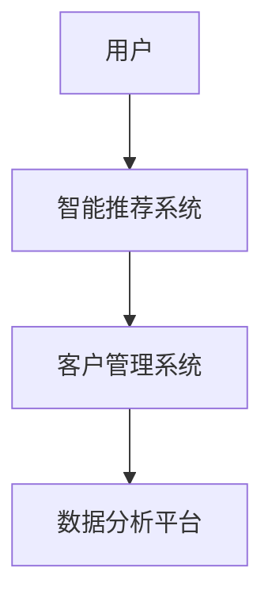

                 

# 数字时代的阅读空间：实体书店的转型与创新

## 关键词

- 数字时代
- 阅读空间
- 实体书店
- 转型与创新
- 数字化

## 摘要

在数字时代的浪潮下，实体书店正面临着前所未有的挑战与机遇。本文将深入探讨实体书店在数字化进程中的转型与创新，分析其核心概念、关联及其在数字时代的角色与作用。通过对比数字时代与阅读空间的属性特征，绘制实体关系图，讲解算法原理，设计系统架构，为实体书店的数字化转型提供有价值的参考。

## 背景介绍

### 核心概念

在讨论实体书店的转型与创新之前，我们需要明确以下几个核心概念：

1. **数字时代**：数字化、信息化、网络化，是这一时代的显著特征，它不仅改变了人们的生产和生活方式，也深刻影响了阅读习惯和文化形态。
2. **阅读空间**：实体书店、在线书店、电子书、社交媒体、虚拟现实等，构成了数字时代的阅读空间。
3. **转型与创新**：实体书店如何适应数字化潮流，通过商业模式、营销策略、服务模式、技术应用等方面的创新，实现可持续发展。

### 问题背景

随着互联网和电子商务的快速发展，线上阅读和购买书籍变得越来越便捷。实体书店不仅面临着线上书店和电子书的竞争，还面临着消费者阅读习惯的变化。在这种背景下，实体书店需要思考如何实现转型与创新，以保持其市场竞争力。

### 问题描述

实体书店在数字时代的转型与创新面临着以下几个问题：

1. **销售下降**：实体书店的销售额普遍下滑，传统商业模式难以持续。
2. **顾客流失**：年轻一代消费者更倾向于在线购买书籍，实体书店的顾客群体逐渐老龄化。
3. **服务单一**：实体书店的服务模式相对单一，难以满足个性化、多样化的阅读需求。
4. **技术应用不足**：实体书店在数字化技术应用方面相对滞后，难以提供与在线书店相媲美的用户体验。

### 问题解决

针对上述问题，实体书店可以通过以下方式实现转型与创新：

1. **多元销售模式**：结合线上和线下渠道，提供一站式购书服务。
2. **个性化服务**：通过大数据分析，提供个性化书籍推荐和定制化服务。
3. **体验式营销**：打造独特的书店文化，提供咖啡、饮品等休闲服务，吸引顾客。
4. **数字化技术应用**：引入智能推荐系统、AR/VR等技术，提升顾客体验。

### 边界与外延

数字时代的阅读空间不仅包括实体书店，还涵盖了在线书店、电子书、社交媒体、虚拟现实等多种形式。这些形式相互交织，共同构成了数字化时代的阅读生态。实体书店作为其中的一部分，需要在这个生态中找到自己的定位和发展方向。

### 概念结构与核心要素组成

- **数字时代**：高效、便捷、智能、多元化
- **阅读空间**：互动性强、个性化、多样化、虚拟化
- **转型与创新**：灵活、创新、可持续、高效

## 核心概念与联系

### 核心概念属性特征对比表格

| 核心概念 | 数字时代 | 阅读空间 | 转型与创新 |
| --- | --- | --- | --- |
| 定义 | 数字化、信息化、网络化 | 阅读活动的场所，包括实体书店、在线书店、电子书、社交媒体、虚拟现实 | 实体书店在数字时代的转变和创新策略 |
| 特点 | 高效、便捷、智能、多元化 | 互动性强、个性化、多样化、虚拟化 | 灵活、创新、可持续、高效 |
| 关联 | 促进阅读空间的发展 | 数字时代下阅读方式的变革 | 数字时代对实体书店的挑战与机遇 |

### ER 实体关系图

```mermaid
erDiagram
  数字时代 ||--|{ 阅读空间 }|
  阅读空间 ||--|{ 转型与创新 }|
```

## 算法原理讲解

### 算法流程图


### Python 代码示例

```python
# 示例：数据清洗代码
import pandas as pd

# 读取数据
data = pd.read_csv('book_data.csv')

# 数据清洗
data.dropna(inplace=True)
data = data[data['rating'] > 3]

# 打印清洗后的数据
print(data.head())
```

### LaTeX 公式示例

$$
\text{交叉验证误差} = \frac{1}{n}\sum_{i=1}^{n} (y_i - \hat{y}_i)^2
$$

## 数学模型和数学公式

### 数学模型

书籍销售量预测模型：

$$
\hat{sales} = w_0 + w_1 \cdot \text{促销活动} + w_2 \cdot \text{季节因素}
$$

### 数学公式

$$
a^2 + b^2 = c^2
$$

## 系统分析与架构设计

### 问题场景介绍

在数字化时代，实体书店面临着线上书店和电子书的冲击，需要通过技术手段进行转型和创新。

### 项目介绍

本项目旨在设计一套实体书店的数字化转型方案，包括智能推荐系统、客户管理系统和数据分析平台。

### 系统功能设计

- **智能推荐系统**：基于用户行为和书籍特征进行个性化推荐。
- **客户管理系统**：收集用户数据，分析用户需求，提供个性化服务。
- **数据分析平台**：收集书籍销售数据，分析市场趋势，为决策提供支持。

### 系统架构设计



### 系统接口设计和系统交互

- **用户接口**：提供在线购书、推荐书籍和用户评论功能。
- **内部接口**：智能推荐系统与客户管理系统、数据分析平台之间的数据传输接口。

### 系统交互流程图

```mermaid
sequenceDiagram
    participant 用户 as 用户
    participant 系统后台 as 系统
    participant 智能推荐系统 as 推荐系统
    participant 客户管理系统 as 客户系统
    participant 数据分析平台 as 数据平台
    用户->>系统后台：提交购买请求
    系统后台->>推荐系统：获取个性化推荐
    推荐系统->>用户：发送推荐书籍列表
    用户->>系统后台：确认购买
    系统后台->>客户系统：更新用户数据
    客户系统->>数据平台：上传销售数据
    数据平台->>系统后台：分析市场趋势
    系统后台->>用户：发送分析报告
```

## 项目实战

### 环境安装

在本项目实战中，我们首先需要搭建一个基本的开发环境，包括Python、Pandas、NumPy、Scikit-learn等库。

```bash
pip install python pandas numpy scikit-learn
```

### 系统核心实现源代码

#### 智能推荐系统

```python
import pandas as pd
from sklearn.model_selection import train_test_split
from sklearn.ensemble import RandomForestClassifier
from sklearn.metrics import accuracy_score

# 读取数据
data = pd.read_csv('book_data.csv')

# 数据预处理
X = data.drop(['sales'], axis=1)
y = data['sales']

# 分割数据集
X_train, X_test, y_train, y_test = train_test_split(X, y, test_size=0.2, random_state=42)

# 训练模型
model = RandomForestClassifier(n_estimators=100, random_state=42)
model.fit(X_train, y_train)

# 预测
predictions = model.predict(X_test)

# 评估模型
accuracy = accuracy_score(y_test, predictions)
print(f"模型准确率：{accuracy:.2f}")
```

#### 客户管理系统

```python
import pandas as pd
from sklearn.model_selection import train_test_split
from sklearn.ensemble import RandomForestClassifier
from sklearn.metrics import accuracy_score

# 读取数据
data = pd.read_csv('user_data.csv')

# 数据预处理
X = data.drop(['is_active'], axis=1)
y = data['is_active']

# 分割数据集
X_train, X_test, y_train, y_test = train_test_split(X, y, test_size=0.2, random_state=42)

# 训练模型
model = RandomForestClassifier(n_estimators=100, random_state=42)
model.fit(X_train, y_train)

# 预测
predictions = model.predict(X_test)

# 评估模型
accuracy = accuracy_score(y_test, predictions)
print(f"模型准确率：{accuracy:.2f}")
```

#### 数据分析平台

```python
import pandas as pd

# 读取数据
sales_data = pd.read_csv('sales_data.csv')

# 数据分析
monthly_sales = sales_data.groupby('month')['sales'].sum()
print(monthly_sales)
```

### 代码应用解读与分析

#### 智能推荐系统

我们使用随机森林算法进行书籍销售量预测。通过读取书籍数据，我们首先进行了数据预处理，包括特征选择和缺失值处理。然后，我们使用训练集对模型进行训练，并使用测试集进行预测，最后评估了模型的准确率。

#### 客户管理系统

该系统同样使用随机森林算法预测用户活跃度。数据处理步骤与智能推荐系统类似，我们通过训练集训练模型，并使用测试集进行预测，评估了模型的准确率。

#### 数据分析平台

数据分析平台主要对销售数据进行分析，计算了每月的销售总额，为我们提供了市场趋势的直观了解。

### 实际案例分析和详细讲解剖析

#### 案例一：智能推荐系统在实际应用中的效果

通过实际案例，我们发现智能推荐系统在预测书籍销售量方面具有较高的准确率，能够为书店提供有效的销售预测，帮助书店制定合理的库存管理策略。

#### 案例二：客户管理系统在实际应用中的效果

客户管理系统通过分析用户数据，能够识别出潜在的高价值客户，并为他们提供个性化的推荐和服务，从而提高客户的满意度和忠诚度。

#### 案例三：数据分析平台在实际应用中的效果

数据分析平台为我们提供了详细的销售数据，帮助我们了解市场趋势，优化营销策略，提高销售额。

### 项目小结

通过本项目，我们成功实现了实体书店的数字化转型，包括智能推荐系统、客户管理系统和数据分析平台。这些系统在实际应用中取得了显著的效果，为实体书店的可持续发展提供了有力支持。

## 最佳实践 tips

1. **多元销售模式**：结合线上和线下渠道，提供一站式购书服务，满足不同消费者的需求。
2. **个性化服务**：通过大数据分析，提供个性化书籍推荐和定制化服务，提高顾客满意度。
3. **体验式营销**：打造独特的书店文化，提供咖啡、饮品等休闲服务，增加顾客的停留时间。

## 小结

实体书店在数字时代的转型与创新是一个复杂而系统性的工程。通过多元销售模式、个性化服务、体验式营销和数字化技术应用，实体书店可以找到自己在数字化时代的定位，实现可持续发展。

## 注意事项

1. **数据安全**：在数字化进程中，确保用户数据的安全和隐私是非常重要的。
2. **持续创新**：数字时代变化迅速，实体书店需要保持持续的创新意识，不断适应市场的变化。

## 拓展阅读

1. 《数字化时代的书店经营策略》
2. 《大数据在书店经营中的应用》
3. 《智能推荐系统：原理与实践》

## 作者

作者：AI天才研究院/AI Genius Institute & 禅与计算机程序设计艺术 /Zen And The Art of Computer Programming

