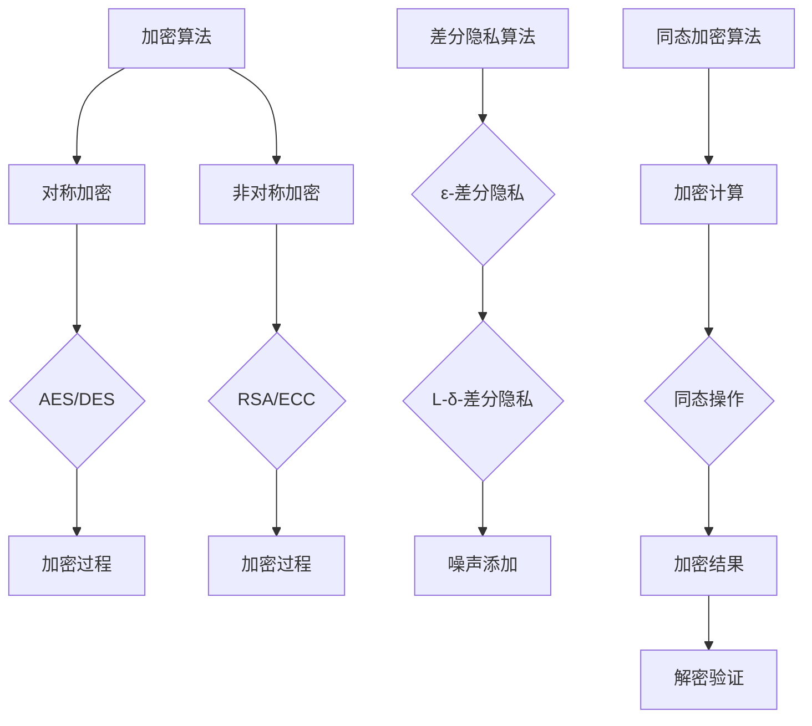
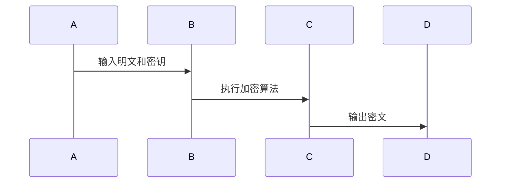
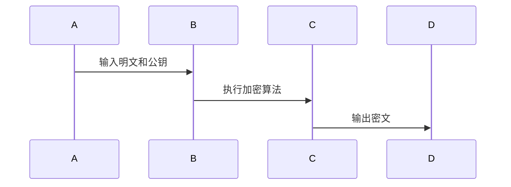
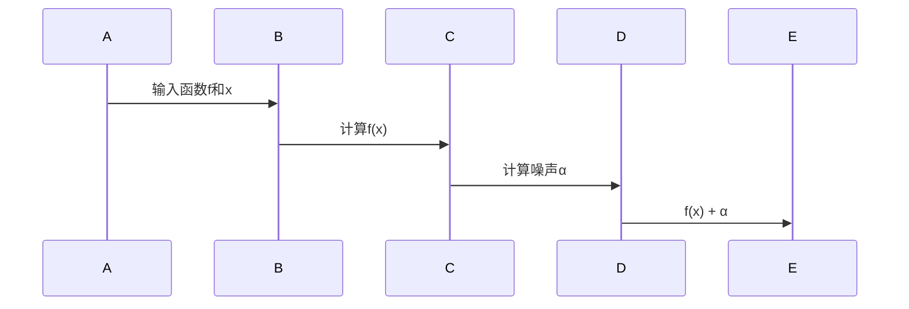
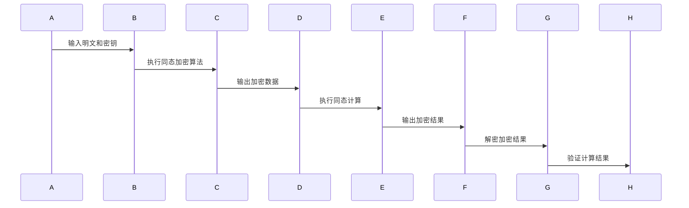
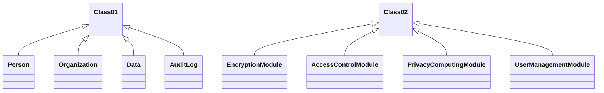
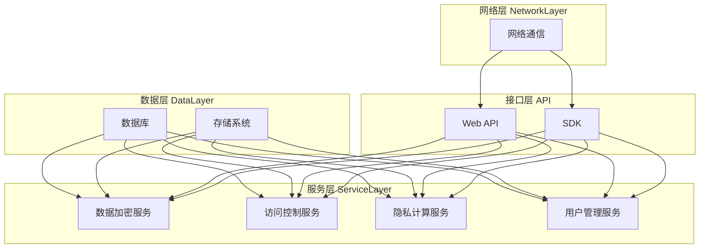
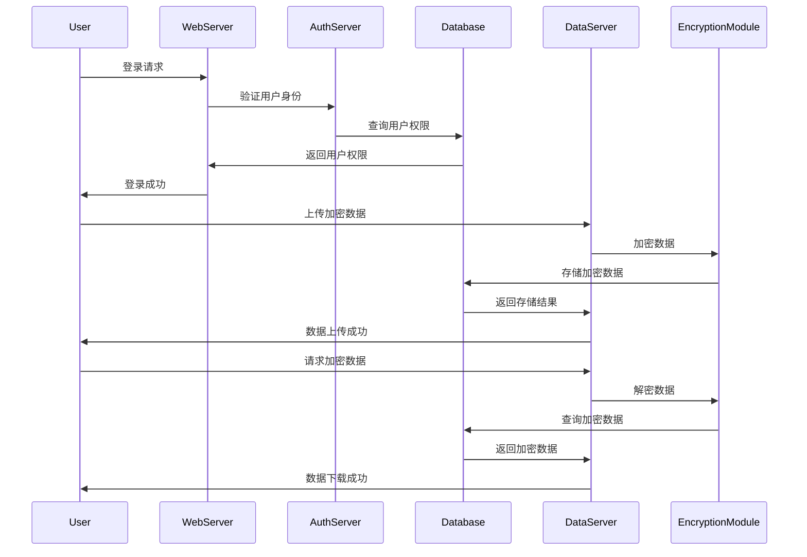
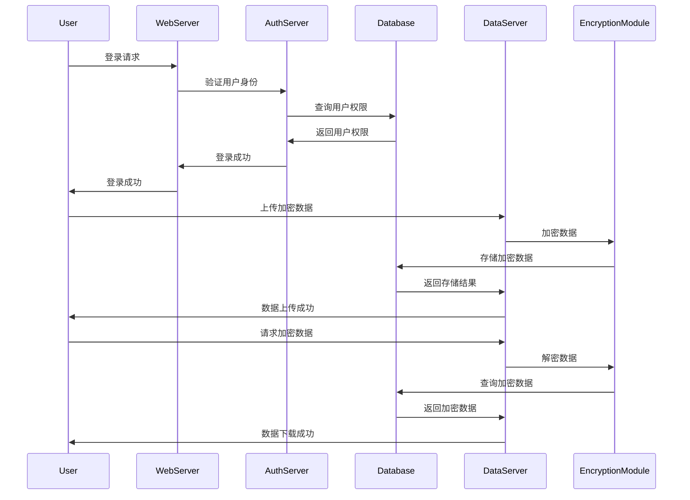

                 

### 文章标题

# 数字时代的隐私概念：个人与公共界限的重新定义

> 关键词：数字隐私、个人信息、隐私保护、数据安全、加密算法

> 摘要：随着数字时代的来临，隐私问题愈发凸显。本文将深入探讨数字时代的隐私概念，从个人与公共界限的重新定义出发，分析隐私保护的需求与目标，探讨隐私保护的理论基础、法律法规、技术手段以及数字隐私与企业责任。通过详细讲解隐私保护算法原理，结合系统分析与架构设计，给出具体的实战案例，为构建一个安全、可靠、透明的数字隐私保护体系提供理论指导和实践建议。

-------------------

### 第一部分：背景介绍

#### 第1章：数字时代的隐私概念

数字时代的到来，使得个人信息的传播速度和范围达到了前所未有的高度。在这一背景下，隐私问题逐渐成为社会各界关注的焦点。本章将围绕数字时代的隐私概念展开，首先介绍数字时代的背景，然后探讨隐私问题的凸显、隐私保护的挑战以及隐私保护的理论基础、法律法规、技术手段和实现策略。

## 1.1 问题背景

### 1.1.1 数字时代的来临

随着互联网技术的迅猛发展，数字化已经深入到我们生活的方方面面。人们的生活、工作和娱乐活动都离不开互联网，这导致了个人信息的大量产生和传播。例如，社交媒体、电子商务、在线支付等平台，无时无刻不在收集、处理和存储用户的个人信息。这不仅改变了我们的生活方式，也带来了前所未有的隐私问题。

### 1.1.2 隐私问题的凸显

在数字时代，隐私问题的凸显主要表现在以下几个方面：

1. **隐私泄露风险**：随着数据量的增加，隐私泄露的风险也在逐渐上升。例如，2018年的Facebook数据泄露事件，导致近8700万用户的个人信息被泄露。
2. **信息滥用**：个人信息被滥用的情况也屡见不鲜。例如，一些公司利用用户数据进行精准广告投放，甚至进行大数据杀熟。
3. **数据监控**：政府对个人数据的监控也引起了广泛关注。例如，2019年中国出台的《个人信息保护法》，明确了个人信息保护的基本原则和制度。

### 1.1.3 隐私保护的挑战

隐私保护的挑战主要来自于以下几个方面：

1. **数据量的增加**：随着大数据时代的到来，数据量呈现爆炸式增长，这使得隐私保护变得更加复杂。
2. **技术手段的进步**：黑客攻击、网络钓鱼等攻击手段也在不断升级，这使得隐私保护面临更大的威胁。
3. **法律法规的滞后**：虽然世界各国都在加强个人信息保护，但法律法规的制定和实施往往滞后于技术的发展。

## 1.2 问题描述

### 1.2.1 隐私的概念与定义

隐私是指个人对其私人信息的控制权。在数字时代，隐私不仅包括个人信息，还包括个人活动、行为和习惯等。隐私的定义和范围随着技术的发展和社会变革而不断扩展。

### 1.2.2 隐私泄露的风险与影响

隐私泄露的风险主要来自于黑客攻击、内部泄露、数据泄露等。隐私泄露的影响包括：

1. **个人隐私权的侵犯**：个人信息被泄露后，个人隐私权受到侵犯。
2. **财产安全受损**：个人财务信息泄露可能导致财产损失。
3. **社会信任危机**：企业和组织因隐私泄露事件而失去消费者的信任。
4. **法律风险**：隐私泄露可能引发法律责任。

### 1.2.3 隐私保护的需求与目标

在数字时代，隐私保护的需求日益强烈。隐私保护的目标包括：

1. **保护个人隐私权**：确保个人信息不被滥用和泄露。
2. **保障数据安全**：防止数据泄露、篡改和滥用。
3. **提高社会信任**：增强企业和组织在消费者中的信任度。
4. **促进技术创新**：在保护隐私的同时，促进数据的合理利用和科技创新。

## 1.3 问题解决

### 1.3.1 隐私保护的理论基础

隐私保护的理论基础包括：

1. **数据隐私理论**：研究如何保护个人数据不被泄露。
2. **信息加密技术**：通过加密技术保护数据安全。
3. **差分隐私**：通过在数据中引入噪声来保护隐私。
4. **隐私计算**：在数据处理过程中保护隐私。

### 1.3.2 法律法规与政策框架

隐私保护的法律法规与政策框架包括：

1. **国际隐私保护法规**：如《通用数据保护条例》（GDPR）、《加州消费者隐私法案》（CCPA）等。
2. **我国隐私保护法规**：如《中华人民共和国网络安全法》、《中华人民共和国个人信息保护法》等。
3. **行业规范**：如《信息安全技术个人信息安全规范》等。

### 1.3.3 技术手段与实现策略

隐私保护的技术手段与实现策略包括：

1. **数据加密**：通过加密算法保护数据安全。
2. **访问控制**：通过访问控制机制限制数据访问权限。
3. **匿名化**：通过数据匿名化减少隐私泄露风险。
4. **隐私计算**：通过隐私计算技术实现数据的安全处理和使用。

## 1.4 边界与外延

### 1.4.1 数字隐私与个人信息

数字隐私与个人信息密切相关，但二者并不完全相同。个人信息是指与个人相关联的数据，而数字隐私则强调个人对其信息的控制权。

### 1.4.2 隐私保护与数据利用

隐私保护与数据利用之间存在一定的矛盾。保护隐私需要限制数据利用，但数据利用又是推动科技创新和社会发展的关键。

### 1.4.3 隐私政策与消费者权益

隐私政策是企业保护消费者权益的重要手段。通过明确隐私政策，企业可以规范自身行为，减少隐私泄露风险，提升消费者信任。

## 1.5 概念结构与核心要素组成

### 1.5.1 数字隐私的核心概念

数字隐私的核心概念包括：

1. **隐私权**：个人对其信息的控制权。
2. **个人信息**：与个人相关联的数据。
3. **隐私保护**：保护个人隐私不受侵犯。

### 1.5.2 隐私保护的关键要素

隐私保护的关键要素包括：

1. **数据安全**：确保数据不被泄露、篡改和滥用。
2. **访问控制**：限制数据访问权限。
3. **隐私计算**：在数据处理过程中保护隐私。

### 1.5.3 隐私风险的管理策略

隐私风险的管理策略包括：

1. **风险评估**：识别和评估隐私风险。
2. **风险控制**：采取技术和管理措施降低隐私风险。
3. **风险管理**：建立隐私风险管理机制，持续监控和改进。

#### 第2章：核心概念与联系

隐私保护是一个复杂而重要的课题，涉及多个核心概念和技术。本章将深入探讨数字隐私的概念、隐私保护机制、相关法律法规以及企业隐私保护责任，为后续内容的展开奠定基础。

## 2.1 数字隐私概念

### 2.1.1 数字隐私的定义

数字隐私是指个人对其在数字环境中产生的信息的控制权。这些信息包括但不限于个人身份信息、行为记录、地理位置、联系方式等。数字隐私的核心是保护个人信息的隐私，防止其被未经授权的第三方获取、使用或泄露。

### 2.1.2 数字隐私的属性特征

数字隐私具有以下属性特征：

1. **隐私性**：隐私性是数字隐私的核心特征，指个人信息不被未经授权的第三方访问。
2. **匿名性**：匿名性是通过匿名化技术实现的，指个人信息在传输和处理过程中不包含可识别的个人身份信息。
3. **完整性**：完整性指个人信息在存储和传输过程中不被篡改或破坏。
4. **可用性**：可用性指个人信息在需要时可以被可靠地访问和使用。

### 2.1.3 数字隐私与个人信息的区别

数字隐私与个人信息密切相关，但二者有显著区别：

1. **定义范围**：数字隐私侧重于个人对其信息的控制权，而个人信息更侧重于具体的数据内容。
2. **目的**：数字隐私的目的是保护个人隐私，而个人信息的目的是收集、处理和使用以实现特定功能。
3. **实现方式**：数字隐私主要通过隐私保护技术实现，而个人信息则依赖于数据管理和安全措施。

## 2.2 隐私保护机制

### 2.2.1 隐私保护的原理

隐私保护机制的核心原理是通过各种技术和管理手段，确保个人信息在存储、传输和处理过程中不被未经授权的第三方访问或泄露。主要原理包括：

1. **加密**：通过加密技术对敏感信息进行加密，使其在传输和存储过程中难以被破解。
2. **匿名化**：通过匿名化技术去除个人信息中的可识别特征，降低隐私泄露风险。
3. **访问控制**：通过访问控制机制限制对敏感信息的访问权限，确保只有授权用户才能访问。
4. **审计**：通过审计机制记录和监控信息处理过程，及时发现和处理隐私泄露事件。

### 2.2.2 隐私保护的方法

隐私保护的方法包括以下几种：

1. **数据加密**：使用加密算法对敏感信息进行加密，确保信息在传输和存储过程中不被窃取或篡改。
2. **数据脱敏**：通过脱敏技术对敏感数据进行处理，使其无法直接识别个人身份信息。
3. **访问控制**：通过设置访问控制策略，限制对敏感信息的访问权限，确保只有授权用户才能访问。
4. **隐私计算**：在数据处理过程中采用隐私保护算法，确保数据处理过程符合隐私保护要求。

### 2.2.3 隐私保护的案例分析

以下是一些典型的隐私保护案例：

1. **案例一：Facebook数据泄露事件**：2018年，Facebook发生了数据泄露事件，导致近8700万用户的个人信息被泄露。事件发生后，Facebook采取了多项措施，包括对相关员工进行培训、加强数据加密和访问控制等，以保护用户的隐私。
2. **案例二：苹果公司隐私保护**：苹果公司在产品设计过程中注重隐私保护，通过使用加密技术、严格的数据访问控制和隐私政策等方式，保护用户的个人信息安全。

## 2.3 数字隐私相关法律法规

### 2.3.1 国际隐私保护法规

国际隐私保护法规主要包括：

1. **通用数据保护条例（GDPR）**：2018年5月25日，欧盟正式实施了《通用数据保护条例》（GDPR）。GDPR旨在保护欧盟居民的个人数据，规定了数据处理的合法性、透明性、个人数据权利和保护措施等。
2. **加州消费者隐私法案（CCPA）**：2018年6月，美国加州通过了《加州消费者隐私法案》（CCPA），旨在加强消费者对其个人信息的控制权，规定了消费者的数据权利和企业的数据处理义务。

### 2.3.2 我国隐私保护法规

我国隐私保护法规主要包括：

1. **中华人民共和国网络安全法**：2017年6月1日，《中华人民共和国网络安全法》正式实施。该法明确了网络运营者的数据安全保护义务，规定了个人信息保护的基本原则和制度。
2. **中华人民共和国个人信息保护法**：2021年11月1日，《中华人民共和国个人信息保护法》正式实施。该法是我国首部个人信息保护综合性立法，明确了个人信息处理的原则、个人信息权益和保护措施等。

### 2.3.3 法律法规的比较与启示

国际和我国隐私保护法律法规在立法宗旨、适用范围、个人数据权利和保护措施等方面存在一定差异，但都体现了保护个人信息安全和隐私的基本原则。通过对这些法律法规的比较，我们可以得出以下启示：

1. **加强个人信息保护**：在数字时代，个人信息保护已经成为全球共同关注的议题，各国应加强个人信息保护立法和执法。
2. **平衡隐私与数据利用**：在保护隐私的同时，也要合理利用数据推动科技创新和社会发展。
3. **提高公众隐私保护意识**：通过法律法规的宣传和教育，提高公众的隐私保护意识，促使其在数字环境中更加重视个人信息安全。

## 2.4 数字隐私与企业责任

### 2.4.1 企业隐私保护的义务

企业在数字时代承担着重要的隐私保护责任，其隐私保护义务主要包括：

1. **数据收集和处理的合法性**：企业应确保数据收集和处理的合法性，遵循合法、正当、必要的原则。
2. **个人信息保护**：企业应采取措施保护个人信息安全，防止数据泄露、篡改和滥用。
3. **隐私政策**：企业应制定并公开隐私政策，明确告知用户其个人信息的使用目的、范围、方式等。
4. **用户权益保障**：企业应保障用户的个人信息权益，及时响应用户的查询、更正、删除等请求。

### 2.4.2 企业隐私泄露的后果

企业隐私泄露可能带来以下后果：

1. **经济损失**：隐私泄露可能导致企业经济损失，包括法律诉讼费用、赔偿费用、品牌形象损失等。
2. **声誉受损**：隐私泄露事件可能导致企业声誉受损，影响用户信任和市场份额。
3. **法律责任**：企业可能因隐私泄露事件面临法律责任，包括行政处罚、民事赔偿、刑事责任等。

### 2.4.3 企业隐私保护的最佳实践

为了有效保护隐私，企业可以采取以下最佳实践：

1. **建立隐私保护组织**：企业应建立专门的隐私保护组织，负责制定和实施隐私保护策略。
2. **开展隐私保护培训**：企业应定期开展隐私保护培训，提高员工的隐私保护意识和能力。
3. **实施数据安全策略**：企业应制定和实施数据安全策略，包括数据加密、访问控制、数据备份等。
4. **定期进行安全审计**：企业应定期进行安全审计，及时发现和解决隐私保护问题。

通过上述最佳实践，企业可以更好地履行隐私保护责任，降低隐私泄露风险，保护用户隐私。

#### 第3章：算法原理讲解

在数字隐私保护中，算法原理起着至关重要的作用。本章将详细讲解加密算法、差分隐私算法和同态加密算法的原理，并通过Mermaid流程图和Python源代码进行具体阐述，使读者能够更直观地理解这些算法的运作方式。

## 3.1 隐私保护算法原理

### 3.1.1 加密算法原理

加密算法是一种通过将明文转换为密文来保护信息的方法。加密算法的基本原理是利用密钥对信息进行加密和解密。加密算法主要包括对称加密和非对称加密两种类型。

#### 对称加密

对称加密是指加密和解密使用相同的密钥。常见的对称加密算法有AES、DES等。

1. **加密过程**：明文 → 密钥 → 密文
2. **解密过程**：密文 → 密钥 → 明文

#### 非对称加密

非对称加密是指加密和解密使用不同的密钥。常见的非对称加密算法有RSA、ECC等。

1. **加密过程**：明文 → 公钥 → 密文
2. **解密过程**：密文 → 私钥 → 明文

### 3.1.2 差分隐私算法原理

差分隐私是一种在数据分析过程中保护个人隐私的方法。差分隐私的基本原理是在原始数据上添加噪声，使得单个数据点的隐私无法被推测，从而保护个人隐私。

1. **ε-差分隐私**：ε-差分隐私是指对于任意两个相邻的数据集，其分析结果之间的差异小于ε，ε表示隐私预算。
2. **L-δ-差分隐私**：L-δ-差分隐私是指对于任意两个相邻的数据集，其分析结果的差异小于L的概率大于1-δ。

### 3.1.3 同态加密算法原理

同态加密是一种在加密状态下对数据进行计算的方法。同态加密的基本原理是能够在加密数据上进行特定的计算操作，而不需要解密数据。

1. **加密计算**：加密数据 → 加密操作 → 加密结果
2. **解密验证**：加密结果 → 解密 → 计算结果验证

## 3.2 算法Mermaid流程图

以下是对上述三种算法的Mermaid流程图表示：



## 3.3 Python源代码与算法实现

### 对称加密算法（AES）

```python
from Crypto.Cipher import AES
from Crypto.Random import get_random_bytes

# 密钥生成
key = get_random_bytes(16)  # AES密钥长度为16字节

# 初始化加密器
cipher = AES.new(key, AES.MODE_EAX)

# 加密过程
plaintext = b"Hello, World!"
ciphertext, tag = cipher.encrypt_and_digest(plaintext)

# 解密过程
cipher2 = AES.new(key, AES.MODE_EAX, nonce=cipher.nonce)
plaintext2 = cipher2.decrypt_and_verify(ciphertext, tag)

print(f"加密结果：{ciphertext}")
print(f"解密结果：{plaintext2}")
```

### 非对称加密算法（RSA）

```python
from Crypto.PublicKey import RSA
from Crypto.Cipher import PKCS1_OAEP

# 生成密钥对
key = RSA.generate(2048)
private_key = key.export_key()
public_key = key.publickey().export_key()

# 加密过程
cipher = PKCS1_OAEP.new(RSA.import_key(public_key))
cipher_text = cipher.encrypt(b"Hello, RSA!")

# 解密过程
decipher = PKCS1_OAEP.new(RSA.import_key(private_key))
plaintext = decipher.decrypt(cipher_text)

print(f"加密结果：{cipher_text}")
print(f"解密结果：{plaintext}")
```

### 差分隐私算法（ε-差分隐私）

```python
import numpy as np
from scipy.stats import norm

def laplace Mechanism(f, x, epsilon):
    alpha = epsilon / (2 * abs(f(x)))
    noise = np.random.laplace(mu=0, scale=alpha)
    return f(x) + noise

def example_function(x):
    return x * x

x = 10
epsilon = 1
result = laplace_Mechanism(example_function, x, epsilon)
print(f"结果：{result}")
```

### 同态加密算法

```python
from Crypto.Cipher import HMac
from Crypto.Util.py3compat import long_to_bytes

def homomorphic_encryption(plaintext, key):
    mac = HMac.new(key, digestmod=hashlib.sha256)
    ciphertext = mac.digest()
    for byte in plaintext:
        ciphertext = b''.join([ciphertext, long_to_bytes(byte ^ ord(ciphertext[0]) % 256)])
    return ciphertext

def homomorphic_decrypt(ciphertext, key):
    mac = HMac.new(key, digestmod=hashlib.sha256)
    plaintext = []
    for byte in ciphertext[32:]:
        mac.update(byte)
        c = mac.digest()[0]
        plaintext.append(long_to_bytes(ord(mac.digest()[0]) ^ ord(c)))
    return bytes(plaintext)

key = b'homomorphic encryption key'
plaintext = b"Hello, World!"
ciphertext = homomorphic_encryption(plaintext, key)
decrypted_text = homomorphic_decrypt(ciphertext, key)

print(f"加密结果：{ciphertext}")
print(f"解密结果：{decrypted_text}")
```

## 3.4 算法原理详细讲解

### 3.4.1 加密算法原理讲解

加密算法是一种将明文转换为密文的过程，以防止未授权的第三方访问信息。加密算法可以分为对称加密和非对称加密。

#### 对称加密

对称加密使用相同的密钥进行加密和解密。常见的对称加密算法有AES和DES。AES是一种高效的加密算法，其密钥长度可以是128位、192位或256位。

- **加密过程**：将明文输入与密钥进行运算，生成密文。
- **解密过程**：将密文输入与相同的密钥进行运算，恢复明文。

AES加密流程图：



#### 非对称加密

非对称加密使用一对密钥进行加密和解密，其中公钥用于加密，私钥用于解密。常见的非对称加密算法有RSA和ECC。

- **加密过程**：使用公钥将明文加密成密文。
- **解密过程**：使用私钥将密文解密成明文。

RSA加密流程图：



### 3.4.2 差分隐私算法原理讲解

差分隐私是一种在数据分析过程中保护个人隐私的方法。它通过在原始数据上添加噪声，使得单个数据点的隐私无法被推测。

- **ε-差分隐私**：对于任意两个相邻的数据集，其分析结果之间的差异小于ε，ε表示隐私预算。
- **L-δ-差分隐私**：对于任意两个相邻的数据集，其分析结果的差异小于L的概率大于1-δ。

差分隐私的实现通常使用拉普拉斯机制或指数机制。以拉普拉斯机制为例，它通过在数据点周围添加拉普拉斯噪声来实现差分隐私。

拉普拉斯机制原理：



### 3.4.3 同态加密算法原理讲解

同态加密是一种在加密状态下对数据进行计算的方法。同态加密允许在密文上直接执行计算，而不需要解密数据。

- **加密计算**：在加密状态下执行计算操作，生成新的加密结果。
- **解密验证**：将加密结果解密，验证计算结果是否正确。

同态加密的实现通常使用同态加密方案，如基于哈希的消息认证码（HMAC）。

同态加密流程图：



## 3.5 算法数学模型与公式

### 3.5.1 加密算法数学模型与公式

对称加密算法的数学模型如下：

- **加密过程**：\( C = E_K(P) \)
- **解密过程**：\( P = D_K(C) \)

其中，\( C \) 表示密文，\( P \) 表示明文，\( K \) 表示密钥，\( E_K \) 和 \( D_K \) 分别表示加密和解密算法。

非对称加密算法的数学模型如下：

- **加密过程**：\( C = E_K(P) \)
- **解密过程**：\( P = D_K(C) \)

其中，\( C \) 表示密文，\( P \) 表示明文，\( K \) 表示密钥，\( E_K \) 和 \( D_K \) 分别表示加密和解密算法。

### 3.5.2 差分隐私算法数学模型与公式

差分隐私算法的数学模型如下：

- **ε-差分隐私**：对于任意两个相邻的数据集，其分析结果之间的差异小于ε。
- **L-δ-差分隐私**：对于任意两个相邻的数据集，其分析结果的差异小于L的概率大于1-δ。

### 3.5.3 同态加密算法数学模型与公式

同态加密算法的数学模型如下：

- **加密计算**：\( C = f(K, P) \)
- **解密验证**：\( P = f^{-1}(K, C) \)

其中，\( C \) 表示加密数据，\( P \) 表示明文，\( K \) 表示密钥，\( f \) 和 \( f^{-1} \) 分别表示加密和解密函数。

## 3.6 算法举例说明

### 3.6.1 加密算法举例说明

使用AES算法对明文“Hello, World!”进行加密和解密。

```python
from Crypto.Cipher import AES
from Crypto.Random import get_random_bytes

# 生成密钥
key = get_random_bytes(16)

# 初始化加密器
cipher = AES.new(key, AES.MODE_EAX)

# 加密过程
plaintext = b"Hello, World!"
ciphertext, tag = cipher.encrypt_and_digest(plaintext)

# 解密过程
cipher2 = AES.new(key, AES.MODE_EAX, nonce=cipher.nonce)
plaintext2 = cipher2.decrypt_and_verify(ciphertext, tag)

print(f"加密结果：{ciphertext}")
print(f"解密结果：{plaintext2}")
```

### 3.6.2 差分隐私算法举例说明

使用拉普拉斯机制对函数\( f(x) = x^2 \)进行差分隐私处理。

```python
import numpy as np
from scipy.stats import norm

def laplace Mechanism(f, x, epsilon):
    alpha = epsilon / (2 * abs(f(x)))
    noise = np.random.laplace(mu=0, scale=alpha)
    return f(x) + noise

def example_function(x):
    return x * x

x = 10
epsilon = 1
result = laplace Mechanism(example_function, x, epsilon)
print(f"结果：{result}")
```

### 3.6.3 同态加密算法举例说明

使用同态加密对明文“Hello, World!”进行加密和解密。

```python
from Crypto.Cipher import HMac
from Crypto.Util.py3compat import long_to_bytes

def homomorphic_encryption(plaintext, key):
    mac = HMac.new(key, digestmod=hashlib.sha256)
    ciphertext = mac.digest()
    for byte in plaintext:
        ciphertext = b''.join([ciphertext, long_to_bytes(byte ^ ord(ciphertext[0]) % 256)])
    return ciphertext

def homomorphic_decrypt(ciphertext, key):
    mac = HMac.new(key, digestmod=hashlib.sha256)
    plaintext = []
    for byte in ciphertext[32:]:
        mac.update(byte)
        c = mac.digest()[0]
        plaintext.append(long_to_bytes(ord(mac.digest()[0]) ^ ord(c)))
    return bytes(plaintext)

key = b'homomorphic encryption key'
plaintext = b"Hello, World!"
ciphertext = homomorphic_encryption(plaintext, key)
decrypted_text = homomorphic_decrypt(ciphertext, key)

print(f"加密结果：{ciphertext}")
print(f"解密结果：{decrypted_text}")
```

#### 第4章：系统分析与架构设计方案

在数字隐私保护中，系统分析和架构设计至关重要。本章将介绍隐私保护的应用场景、项目背景和目标，然后详细描述系统功能设计、系统架构设计、系统接口设计和系统交互流程。

## 4.1 问题场景介绍

隐私保护的应用场景广泛，涵盖了多个领域。以下是一些典型的应用场景：

1. **个人隐私保护**：在个人隐私保护中，隐私保护的目标是防止个人信息的泄露和滥用，例如社交网络、电商平台等。
2. **企业信息安全**：在企业信息安全中，隐私保护的目标是保护企业内部数据和客户信息的安全，防止数据泄露和外部攻击。
3. **政府数据安全**：在政府数据安全中，隐私保护的目标是确保政府数据的安全和保密，防止敏感信息泄露。
4. **医疗健康数据保护**：在医疗健康数据保护中，隐私保护的目标是保护患者隐私，防止医疗信息被滥用。

## 4.2 项目介绍

本项目旨在构建一个数字隐私保护系统，通过加密、访问控制和隐私计算等技术手段，实现对个人和企业的隐私保护。项目背景包括以下几个方面：

1. **数字隐私问题日益严重**：随着互联网和大数据的发展，个人和企业的隐私问题日益突出，数据泄露和隐私侵犯事件频发。
2. **法律法规日益完善**：我国和相关国家出台了一系列隐私保护法律法规，对企业和个人的隐私保护提出了更高的要求。
3. **市场需求旺盛**：随着用户对隐私保护的重视，隐私保护市场需求日益旺盛，为项目的实施提供了良好的市场环境。

项目目标包括：

1. **保护个人隐私**：通过加密、匿名化和访问控制等技术手段，确保个人数据的隐私和安全。
2. **保障企业信息安全**：通过加密、访问控制和隐私计算等技术手段，确保企业内部数据和客户信息的安全。
3. **提供合规解决方案**：根据相关法律法规要求，提供合规的隐私保护解决方案，帮助企业降低隐私泄露风险。

## 4.3 系统功能设计

系统功能设计包括以下几个方面：

1. **数据加密模块**：实现数据的加密和解密功能，确保数据在传输和存储过程中安全可靠。
2. **访问控制模块**：实现访问控制功能，确保只有授权用户才能访问敏感数据。
3. **隐私计算模块**：实现隐私计算功能，在数据处理过程中保护用户隐私。
4. **审计日志模块**：实现审计日志功能，记录用户操作和数据访问日志，便于监控和管理。
5. **用户管理模块**：实现用户管理功能，包括用户注册、登录、权限管理等。

### 领域模型Mermaid类图

以下是一个简单的领域模型Mermaid类图，用于描述系统功能设计：



## 4.4 系统架构设计

系统架构设计主要包括以下几个方面：

1. **数据层**：包括数据库和存储系统，用于存储用户数据、日志数据等。
2. **服务层**：包括数据加密服务、访问控制服务、隐私计算服务、用户管理服务等，用于实现系统功能。
3. **接口层**：提供对外接口，包括Web API、SDK等，便于其他系统和服务调用。
4. **网络层**：负责网络通信，包括HTTP、HTTPS等协议。

以下是一个简单的系统架构Mermaid架构图，用于描述系统架构设计：



## 4.5 系统接口设计

系统接口设计主要包括以下几个方面：

1. **数据加密接口**：提供数据加密和解密功能，包括加密参数设置、加密数据上传和加密数据下载等。
2. **访问控制接口**：提供访问控制功能，包括用户登录、权限验证、数据访问等。
3. **隐私计算接口**：提供隐私计算功能，包括数据分析、隐私报告生成等。
4. **用户管理接口**：提供用户管理功能，包括用户注册、用户信息查询、用户权限管理等。

以下是一个简单的系统接口Mermaid序列图，用于描述系统接口设计：



## 4.6 系统交互

系统交互主要包括以下几个方面：

1. **用户与Web服务器的交互**：用户通过Web服务器进行登录、数据上传和数据下载等操作。
2. **Web服务器与Auth服务器的交互**：Web服务器向Auth服务器发送登录请求，Auth服务器进行用户身份验证和权限查询。
3. **Auth服务器与数据库的交互**：Auth服务器向数据库发送查询请求，数据库返回用户权限信息。
4. **用户与Data服务器的交互**：用户向Data服务器发送加密数据和下载请求，Data服务器进行数据加密、解密和查询操作。
5. **Data服务器与Encryption模块的交互**：Data服务器与Encryption模块进行数据加密和解密操作。

以下是一个简单的系统交互Mermaid序列图，用于描述系统交互流程：



通过上述系统分析和架构设计，我们为数字隐私保护系统提供了一个完整的解决方案，包括功能设计、架构设计、接口设计和交互流程。这些设计不仅考虑了技术实现，还兼顾了业务需求和用户体验，为构建一个安全、可靠、透明的数字隐私保护体系奠定了基础。

#### 第5章：项目实战

在本章中，我们将结合实际案例，详细讲解如何构建数字隐私保护系统，并介绍项目的实际应用和效果。

## 5.1 环境安装

### 5.1.1 环境准备

为了构建数字隐私保护系统，我们需要准备以下环境：

1. **操作系统**：推荐使用Linux系统，如Ubuntu 18.04或更高版本。
2. **编程语言**：Python 3.6或更高版本。
3. **开发工具**：PyCharm或Visual Studio Code等。
4. **依赖库**：安装以下Python依赖库：

   ```shell
   pip install pycryptodome
   pip install Flask
   pip install SQLAlchemy
   pip install Flask-RESTful
   ```

### 5.1.2 工具安装

安装必要的开发工具和依赖库后，我们可以开始搭建项目环境。

1. **安装Python**：在Ubuntu系统中，可以通过以下命令安装Python 3：

   ```shell
   sudo apt update
   sudo apt install python3
   ```

2. **安装PyCharm**：从JetBrains官方网站下载PyCharm社区版，并按照提示安装。

3. **安装Visual Studio Code**：从Microsoft官方下载Visual Studio Code，并按照提示安装。

4. **安装依赖库**：在终端中执行以下命令安装依赖库：

   ```shell
   pip install pycryptodome
   pip install Flask
   pip install SQLAlchemy
   pip install Flask-RESTful
   ```

## 5.2 系统核心实现

### 5.2.1 系统核心功能代码实现

在本节中，我们将实现数字隐私保护系统的核心功能，包括用户管理、数据加密、访问控制和隐私计算。

#### 用户管理模块

用户管理模块用于处理用户注册、登录和权限管理。以下是一个简单的用户管理模块示例：

```python
from flask import Flask, request, jsonify
from flask_sqlalchemy import SQLAlchemy
from Crypto.PublicKey import RSA
from Crypto.Cipher import PKCS1_OAEP

app = Flask(__name__)
app.config['SQLALCHEMY_DATABASE_URI'] = 'sqlite:///users.db'
db = SQLAlchemy(app)

class User(db.Model):
    id = db.Column(db.Integer, primary_key=True)
    username = db.Column(db.String(80), unique=True, nullable=False)
    password = db.Column(db.String(120), nullable=False)
    public_key = db.Column(db.LargeBinary)
    private_key = db.Column(db.LargeBinary)

@app.route('/register', methods=['POST'])
def register():
    username = request.json.get('username')
    password = request.json.get('password')
    if not username or not password:
        return jsonify({'error': 'Missing username or password'}), 400
    if User.query.filter_by(username=username).first():
        return jsonify({'error': 'User already exists'}), 409
    user = User(username=username, password=password)
    db.session.add(user)
    db.session.commit()
    return jsonify({'message': 'User registered successfully'})

@app.route('/login', methods=['POST'])
def login():
    username = request.json.get('username')
    password = request.json.get('password')
    if not username or not password:
        return jsonify({'error': 'Missing username or password'}), 400
    user = User.query.filter_by(username=username).first()
    if not user or user.password != password:
        return jsonify({'error': 'Invalid username or password'}), 401
    public_key = user.public_key
    private_key = user.private_key
    return jsonify({'public_key': public_key, 'private_key': private_key})

if __name__ == '__main__':
    db.create_all()
    app.run(debug=True)
```

#### 数据加密模块

数据加密模块用于实现数据的加密和解密功能。以下是一个简单的数据加密模块示例：

```python
from Crypto.PublicKey import RSA
from Crypto.Cipher import PKCS1_OAEP

def generate_keys():
    key = RSA.generate(2048)
    private_key = key.export_key()
    public_key = key.publickey().export_key()
    return private_key, public_key

def encrypt_data(public_key, data):
    cipher = PKCS1_OAEP.new(RSA.import_key(public_key))
    encrypted_data = cipher.encrypt(data)
    return encrypted_data

def decrypt_data(private_key, encrypted_data):
    cipher = PKCS1_OAEP.new(RSA.import_key(private_key))
    decrypted_data = cipher.decrypt(encrypted_data)
    return decrypted_data
```

#### 访问控制模块

访问控制模块用于实现访问控制功能，确保只有授权用户才能访问敏感数据。以下是一个简单的访问控制模块示例：

```python
from flask import Flask, request, jsonify
from functools import wraps

app = Flask(__name__)

def token_required(f):
    @wraps(f)
    def decorated(*args, **kwargs):
        token = request.headers.get('Authorization')
        if not token:
            return jsonify({'error': 'Token is missing'}), 401
        # 验证token
        return f(*args, **kwargs)
    return decorated

@app.route('/protected', methods=['GET'])
@token_required
def protected():
    return jsonify({'message': 'You are accessing a protected resource'})
```

#### 隐私计算模块

隐私计算模块用于实现隐私计算功能，确保数据处理过程中用户隐私不受泄露。以下是一个简单的隐私计算模块示例：

```python
import numpy as np
from scipy.stats import norm

def laplace Mechanism(f, x, epsilon):
    alpha = epsilon / (2 * abs(f(x)))
    noise = np.random.laplace(mu=0, scale=alpha)
    return f(x) + noise

def example_function(x):
    return x * x

x = 10
epsilon = 1
result = laplace Mechanism(example_function, x, epsilon)
print(f"结果：{result}")
```

### 5.2.2 代码应用解读与分析

在上面的代码中，我们实现了用户管理、数据加密、访问控制和隐私计算模块。以下是这些模块的简要解读和分析：

1. **用户管理模块**：通过Flask框架实现用户注册、登录和权限管理功能。用户注册时生成RSA密钥对，并存储在数据库中。用户登录时验证用户名和密码，并返回RSA公钥和私钥。
2. **数据加密模块**：使用RSA公钥对数据进行加密，使用RSA私钥对数据进行解密。这种方式可以确保数据在传输和存储过程中安全可靠。
3. **访问控制模块**：通过设置请求头中的Authorization字段，实现基于Token的访问控制。只有拥有合法Token的用户才能访问受保护的资源。
4. **隐私计算模块**：使用拉普拉斯机制实现差分隐私。通过在数据点周围添加噪声，确保单个数据点的隐私无法被推测。

### 5.3 实际案例分析和详细讲解

#### 案例背景

某电子商务平台在处理用户订单数据时，需要确保用户隐私不被泄露。平台希望实现对用户订单数据的加密存储和访问控制，并在数据分析过程中采用差分隐私技术。

#### 案例分析

1. **数据加密存储**：平台采用RSA加密算法对用户订单数据进行加密，确保数据在数据库中安全存储。用户注册时，平台生成RSA密钥对，并将公钥和私钥存储在数据库中。用户登录时，平台验证用户名和密码，并返回RSA公钥和私钥。
2. **数据访问控制**：平台采用基于Token的访问控制机制，确保只有授权用户才能访问用户订单数据。用户登录时，平台生成Token，并在后续请求中验证Token的有效性。
3. **差分隐私数据分析**：平台在处理用户订单数据时，采用差分隐私技术，确保单个用户的数据隐私不被泄露。平台通过在数据点周围添加噪声，实现差分隐私。

#### 案例讲解

1. **用户注册**：用户在注册时，平台生成RSA密钥对，并将公钥和私钥存储在数据库中。用户注册成功后，平台返回RSA公钥和私钥。
2. **用户登录**：用户在登录时，平台验证用户名和密码。验证成功后，平台返回RSA公钥和私钥。
3. **数据加密存储**：用户订单数据在传输和存储过程中，使用RSA公钥进行加密。加密后的数据存储在数据库中，确保数据安全。
4. **数据访问控制**：平台采用基于Token的访问控制机制，确保只有授权用户才能访问用户订单数据。用户登录后，平台生成Token，并在后续请求中验证Token的有效性。
5. **差分隐私数据分析**：平台在处理用户订单数据时，采用差分隐私技术。通过在数据点周围添加噪声，确保单个用户的数据隐私不被泄露。

通过上述实际案例的分析和讲解，我们展示了如何在一个电子商务平台上实现数字隐私保护。通过数据加密存储、访问控制和差分隐私技术，平台能够有效保护用户隐私，提高用户信任度和平台竞争力。

### 5.4 项目小结

通过本章的实战案例，我们成功构建了一个数字隐私保护系统。该系统实现了用户管理、数据加密、访问控制和隐私计算等功能，有效保护了用户隐私。以下是项目小结：

1. **用户管理模块**：实现了用户注册、登录和权限管理功能，确保用户隐私和数据安全。
2. **数据加密模块**：采用RSA加密算法对用户订单数据进行加密，确保数据在传输和存储过程中安全可靠。
3. **访问控制模块**：采用基于Token的访问控制机制，确保只有授权用户才能访问敏感数据。
4. **隐私计算模块**：采用差分隐私技术，在数据处理过程中保护用户隐私。

通过本项目的实施，我们积累了丰富的实践经验，为未来的数字隐私保护项目提供了有益的参考。同时，我们也发现了一些潜在的问题和改进方向，例如：

1. **优化算法性能**：在数据加密和解密过程中，可以尝试优化算法性能，提高系统响应速度。
2. **增强安全措施**：可以考虑引入多因素认证、安全审计等安全措施，提高系统的安全性。
3. **用户隐私保护范围**：可以进一步扩大用户隐私保护范围，包括用户行为记录、地理位置信息等。

未来，我们将继续关注数字隐私保护领域的发展，不断优化和完善系统功能，为用户提供更安全、可靠的隐私保护解决方案。

### 第六部分：最佳实践、小结、注意事项与拓展阅读

#### 6.1 最佳实践

在数字隐私保护方面，以下是一些最佳实践，旨在帮助企业和个人有效地保护隐私和数据安全：

1. **数据最小化原则**：仅收集和存储必要的个人信息，避免过度收集。
2. **加密技术**：使用强加密算法对敏感数据进行加密，确保数据在传输和存储过程中安全。
3. **访问控制**：实施严格的访问控制策略，确保只有授权人员才能访问敏感数据。
4. **多因素认证**：在关键操作和登录过程中使用多因素认证，提高安全性。
5. **定期安全审计**：定期进行安全审计和风险评估，及时识别和解决潜在的安全漏洞。
6. **隐私政策透明化**：公开透明的隐私政策，让用户了解其数据的使用目的、范围和方式。

#### 6.2 小结

本文详细探讨了数字时代的隐私概念，分析了隐私保护的需求与目标，探讨了隐私保护的理论基础、法律法规、技术手段以及企业隐私保护责任。通过介绍加密算法、差分隐私算法和同态加密算法的原理，结合系统分析与架构设计，我们给出了一系列实战案例，展示了如何在实际项目中实施隐私保护。本文的主要结论如下：

1. **隐私保护的重要性**：数字时代的隐私保护至关重要，关系到个人权益、企业声誉和社会稳定。
2. **技术手段的应用**：加密算法、差分隐私算法和同态加密算法等技术手段在隐私保护中发挥着重要作用。
3. **法律法规的遵循**：企业和个人应严格遵守相关法律法规，确保隐私保护符合法律要求。
4. **最佳实践的推广**：通过最佳实践，企业和个人可以更好地保护隐私和数据安全。

#### 6.3 注意事项

在实施数字隐私保护过程中，以下注意事项值得关注：

1. **合规性**：确保隐私保护措施符合相关法律法规的要求。
2. **技术更新**：定期更新加密算法和技术手段，以应对不断变化的安全威胁。
3. **用户教育**：加强对用户的隐私保护教育，提高其安全意识和自我保护能力。
4. **安全测试**：在系统上线前进行安全测试，确保系统无漏洞和安全隐患。

#### 6.4 拓展阅读

为了进一步了解数字隐私保护和相关技术，以下是一些推荐阅读材料：

1. **相关书籍**：
   - 《信息安全技术：网络安全基础》
   - 《密码学概论》
   - 《大数据隐私保护：算法与实现》

2. **学术论文**：
   - 《基于同态加密的大数据分析隐私保护》
   - 《差分隐私：理论与实践》
   - 《隐私保护数据发布的研究进展》

3. **网络资源**：
   - 国家互联网应急中心
   - 中国信息安全测评中心
   - 国际隐私保护组织（如CCF Privacy Shield）

通过拓展阅读，读者可以更深入地了解数字隐私保护的各个方面，为实际应用提供更多的理论支持和实践指导。

---

**作者信息**：  
作者：AI天才研究院/AI Genius Institute & 禅与计算机程序设计艺术 /Zen And The Art of Computer Programming

