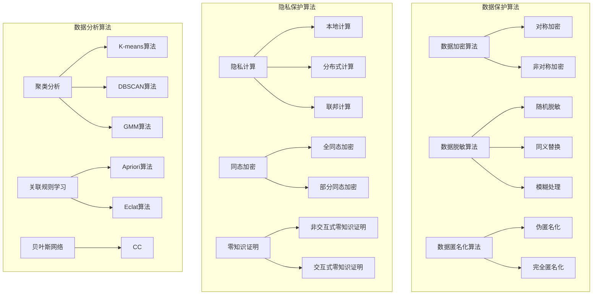
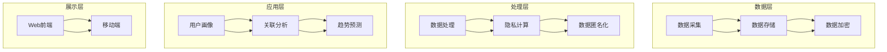
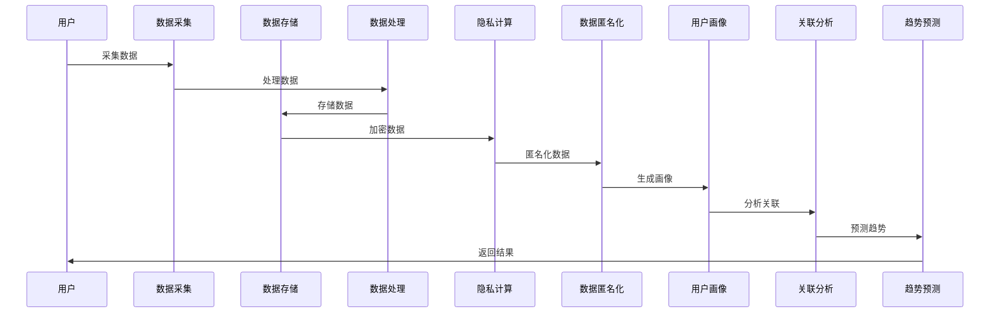

                 

### 文章标题

# 数字时代的隐私概念：个人数据与公共利益的博弈

> 关键词：隐私保护、个人数据、公共利益、数据加密、同态加密、零知识证明

> 摘要：本文旨在探讨数字时代隐私概念的演变及其重要性，特别是个人数据与公共利益之间的博弈。通过分析隐私问题的起源、核心概念、算法原理、数学模型和系统架构设计，本文提出了隐私保护的最佳实践和未来发展趋势。

----------------------------------------------------------------

## 引言

### 1.1 数字时代隐私问题的起源与重要性

隐私问题在数字时代变得尤为突出，其起源可以追溯到人类对个人信息的保护需求。随着信息技术的发展，个人数据的采集、存储和分析能力显著提升，隐私问题也随之变得更加复杂和严峻。

**隐私问题的起源**：

- 人类对隐私的需求：隐私是人类的基本权利，保障个人隐私是维护社会稳定和个人尊严的必要条件。
- 信息技术的发展：随着互联网和大数据技术的普及，个人数据被广泛收集、存储和分析，隐私泄露的风险显著增加。

**数字时代隐私问题的演变**：

- 数据泄露事件频发：近年来，全球范围内发生多起重大数据泄露事件，给个人和社会带来了巨大损失。
- 隐私法规的不断完善：为了应对隐私问题，各国纷纷出台相关法律法规，加强对个人数据的保护。

**隐私保护的重要性**：

- 维护个人权益：隐私保护有助于保障个人的基本信息和活动不受非法侵犯。
- 促进社会信任：隐私保护有助于增强社会公众对互联网和大数据技术的信任，推动其健康发展。

### 1.2 个人数据与公共利益的博弈

个人数据在现代社会中具有重要的价值，既是个人隐私的承载者，也是公共利益实现的重要资源。然而，个人数据与公共利益之间往往存在一定的矛盾和冲突。

**个人数据的定义与价值**：

- 个人数据：指与特定个体相关的信息，包括姓名、身份证号、电话号码、电子邮件等。
- 个人数据的价值：个人数据可以用于市场分析、用户画像、个性化推荐等，有助于提高企业和政府的决策效率。

**公共利益的概念与实现**：

- 公共利益：指社会公众共同享有的利益，包括公共服务、公共安全、公共环境等。
- 公共利益的实现：个人数据的开放和共享是实现公共利益的重要途径，有助于提高公共服务的质量和效率。

**隐私与公共利益的冲突与平衡**：

- 冲突：个人数据与公共利益之间存在一定的矛盾，过度保护个人数据可能导致公共利益受损，反之亦然。
- 平衡：在数字时代，如何平衡个人数据保护与公共利益实现，成为政策制定者和企业面临的重要挑战。

### 1.3 隐私权：法律与伦理视角

隐私权是指个人对其个人信息享有的控制权，包括信息的收集、使用、处理和传播等方面。从法律和伦理角度来看，隐私权具有重要的意义。

**法律保护：隐私权相关法律法规**：

- 法律法规：各国纷纷出台相关法律法规，加强对隐私权的保护，如《通用数据保护条例》（GDPR）和《加州消费者隐私法》（CCPA）等。
- 法律责任：违反隐私保护法律法规的个人和企业将承担相应的法律责任。

**伦理视角：隐私权与社会责任**：

- 社会责任：企业和社会组织在收集、使用和传播个人数据时，应当遵循伦理原则，尊重个人隐私权。
- 公众信任：保护个人隐私有助于增强公众对企业和政府的信任，促进社会的和谐发展。

### 1.4 本章小结

数字时代的隐私问题日益突出，个人数据与公共利益之间的博弈成为社会关注的焦点。本章介绍了隐私问题的起源、重要性、个人数据与公共利益的冲突与平衡，以及隐私权的法律和伦理保护。在此基础上，本文将进一步探讨隐私保护的核心概念、算法原理、数学模型和系统架构设计，为隐私保护提供科学依据和实践指导。

----------------------------------------------------------------

## 第二部分：核心概念与联系

### 2.1 核心概念定义

为了更好地理解数字时代隐私问题的本质，我们首先需要明确几个核心概念：个人数据、公共利益、隐私权。

#### 2.1.1 个人数据

**定义**：个人数据是指与特定个体相关的信息，包括姓名、身份证号、电话号码、电子邮件、地理位置、行为记录等。

**价值**：个人数据是企业进行市场分析、用户画像、个性化推荐等的重要资源，有助于提高决策效率和商业价值。

**特点**：个人数据具有敏感性、多样性、动态性等特点，需要采取有效的保护措施。

#### 2.1.2 公共利益

**定义**：公共利益是指社会公众共同享有的利益，包括公共服务、公共安全、公共环境等。

**实现**：公共利益需要依靠政府、企业和社会组织的共同努力，通过提供优质公共服务、维护公共安全和改善公共环境等方式实现。

**特点**：公共利益具有普遍性、公共性和可持续性等特点。

#### 2.1.3 隐私权

**定义**：隐私权是指个人对其个人信息享有的控制权，包括信息的收集、使用、处理和传播等方面。

**法律保护**：隐私权受到各国法律法规的保护，如《通用数据保护条例》（GDPR）和《加州消费者隐私法》（CCPA）等。

**伦理保护**：隐私权也受到伦理原则的保护，企业在收集、使用和传播个人数据时，应当尊重个人隐私。

### 2.2 概念属性特征对比表格

| 概念       | 定义                                                         | 特点                                                         | 法律与伦理保护 |
|------------|--------------------------------------------------------------|--------------------------------------------------------------|----------------|
| 个人数据   | 与特定个体相关的信息                                         | 敏感性、多样性、动态性                                     | 法律保护       |
| 公共利益   | 社会公众共同享有的利益                                     | 普遍性、公共性、可持续性                                  | 法律保护       |
| 隐私权     | 个人对其个人信息享有的控制权                               | 信息收集、使用、处理和传播等方面的控制权                     | 法律保护       |

### 2.3 ER实体关系图架构

为了更好地理解个人数据、公共利益和隐私权之间的关系，我们可以使用ER（实体-关系）图进行描述。

```mermaid
erDiagram
  A[Personal Data] ||--|{ B[Public Interest] } |
  B ||--|{ C[Privacy Right] } |
```

- **个人数据**是隐私权的载体，也是公共利益实现的基础。
- **公共利益**依赖于个人数据的开放和共享，但需要在保护隐私权的前提下进行。
- **隐私权**是个人对其个人数据的控制权，需要在法律和伦理的框架下进行保护。

### 2.4 概念之间的联系

个人数据、公共利益和隐私权之间存在着紧密的联系和相互作用。

#### 2.4.1 个人数据与公共利益

- **个人数据**是实现公共利益的重要资源，如市场分析、用户画像等。
- **公共利益**的实现需要个人数据的开放和共享，但需要在保护隐私权的前提下进行。

#### 2.4.2 隐私权与个人数据

- **隐私权**是个人对其个人数据的控制权，保障个人数据的敏感性。
- **个人数据**是隐私权的载体，隐私权的实现依赖于个人数据的保护。

#### 2.4.3 隐私权与公共利益

- **隐私权**是公共利益实现的前提，过度的隐私保护可能导致公共利益受损。
- **公共利益**的实现需要在保护隐私权的前提下进行，平衡个人数据保护与公共利益实现。

### 2.5 本章小结

核心概念的理解是分析数字时代隐私问题的基础。通过定义个人数据、公共利益和隐私权，以及探讨它们之间的联系，我们可以更好地理解隐私保护的重要性和实现方式。在此基础上，我们将进一步探讨隐私保护的技术手段和系统架构，为数字时代的隐私保护提供科学依据和实践指导。

----------------------------------------------------------------

## 第三部分：算法原理讲解

### 3.1 数据保护算法

数据保护算法是隐私保护的核心技术，主要包括数据加密、数据脱敏和数据匿名化等。

#### 3.1.1 数据加密算法

数据加密算法通过将明文转换为密文，实现对数据的保护。数据加密算法可以分为对称加密和非对称加密。

- **对称加密**：对称加密算法使用相同的密钥进行加密和解密。其优点是加密速度快，缺点是密钥管理复杂。常见的对称加密算法有AES、DES等。
  
  **数学模型**：
  $$
  C = E_K(P)
  $$
  其中，$C$为密文，$P$为明文，$K$为密钥。

- **非对称加密**：非对称加密算法使用公钥和私钥进行加密和解密。其优点是密钥管理简单，缺点是加密速度较慢。常见的非对称加密算法有RSA、ECC等。

  **数学模型**：
  $$
  C = E_G(P)
  $$
  其中，$C$为密文，$P$为明文，$G$为公钥。

#### 3.1.2 数据脱敏算法

数据脱敏算法通过对敏感数据进行变换，实现对数据的保护。数据脱敏算法可以分为随机脱敏、同义替换和模糊处理等。

- **随机脱敏**：随机脱敏算法通过随机生成新的值来替换敏感数据。其优点是简单易行，缺点是可能引入隐私泄露风险。

- **同义替换**：同义替换算法通过替换为同义词或同义表达来保护敏感数据。其优点是保护效果较好，缺点是可能影响数据的可读性。

- **模糊处理**：模糊处理算法通过模糊化处理敏感数据，使其难以被识别。其优点是保护效果较好，缺点是对数据的处理可能引入误差。

#### 3.1.3 数据匿名化算法

数据匿名化算法通过对数据进行处理，使数据无法与特定个体关联。数据匿名化算法可以分为伪匿名化和完全匿名化。

- **伪匿名化**：伪匿名化算法通过对数据进行变换，使数据在一定程度上无法与特定个体关联。其优点是保护效果较好，缺点是可能存在数据重建风险。

- **完全匿名化**：完全匿名化算法通过对数据进行处理，使数据完全无法与特定个体关联。其优点是保护效果更好，缺点是数据处理复杂。

### 3.2 隐私保护算法

隐私保护算法是保护个人隐私的重要技术手段，主要包括隐私计算、同态加密和零知识证明等。

#### 3.2.1 隐私计算

隐私计算是指在计算过程中保护个人隐私的技术。隐私计算可以分为本地计算、分布式计算和联邦计算等。

- **本地计算**：本地计算是指在用户本地设备上进行计算，可以有效保护个人隐私。

- **分布式计算**：分布式计算是指通过分布式系统进行计算，可以有效提高计算效率和降低隐私泄露风险。

- **联邦计算**：联邦计算是指多个参与方共享计算资源，共同完成计算任务，可以有效保护个人隐私和数据安全。

#### 3.2.2 同态加密

同态加密是一种加密算法，可以在加密数据上进行计算，得到的结果仍然是正确的。同态加密可以分为全同态加密和部分同态加密。

- **全同态加密**：全同态加密可以在加密数据上进行任意计算，得到的结果仍然是正确的。

- **部分同态加密**：部分同态加密只能对某些特定的运算进行同态加密，如加法和乘法。

  **数学模型**：
  $$
  F_{k, m}(C) = C
  $$
  其中，$C$为加密数据，$F_{k, m}$为同态加密函数，$k$为密钥。

#### 3.2.3 零知识证明

零知识证明是一种证明机制，证明者可以证明某个陈述是正确的，而不透露任何其他信息。零知识证明可以分为非交互式零知识证明和交互式零知识证明。

- **非交互式零知识证明**：非交互式零知识证明不需要进行交互，证明者可以直接证明某个陈述是正确的。

- **交互式零知识证明**：交互式零知识证明需要进行交互，证明者和验证者通过一系列交互来证明某个陈述是正确的。

### 3.3 数据分析算法

数据分析算法是利用数据进行分析和挖掘的重要技术手段，主要包括聚类分析、关联规则学习和贝叶斯网络等。

#### 3.3.1 聚类分析

聚类分析是一种无监督学习方法，用于将数据集划分为多个类别。聚类分析可以分为基于距离的聚类、基于密度的聚类和基于模型的聚类等。

- **基于距离的聚类**：基于距离的聚类方法根据数据点之间的距离进行聚类，如K-means算法。

- **基于密度的聚类**：基于密度的聚类方法根据数据点之间的密度进行聚类，如DBSCAN算法。

- **基于模型的聚类**：基于模型的聚类方法根据数据点的分布模型进行聚类，如GMM（高斯混合模型）算法。

#### 3.3.2 关联规则学习

关联规则学习是一种用于发现数据项之间关联关系的方法。关联规则学习可以分为单维关联规则学习和多维关联规则学习。

- **单维关联规则学习**：单维关联规则学习用于发现单个数据项之间的关联关系，如Apriori算法。

- **多维关联规则学习**：多维关联规则学习用于发现多个数据项之间的关联关系，如Eclat算法。

#### 3.3.3 贝叶斯网络

贝叶斯网络是一种概率图模型，用于表示变量之间的概率关系。贝叶斯网络由一组节点和有向边组成，节点表示变量，边表示变量之间的依赖关系。

  **数学模型**：
  $$
  P(A|B) = \frac{P(B|A)P(A)}{P(B)}
  $$
  其中，$P(A|B)$表示在B发生的条件下A的概率，$P(B|A)$表示在A发生的条件下B的概率，$P(A)$和$P(B)$分别表示A和B的先验概率。

### 3.4 算法mermaid流程图

以下是数据保护算法、隐私保护算法和数据分析算法的mermaid流程图：



### 3.5 本章小结

本部分介绍了数据保护算法、隐私保护算法和数据分析算法的基本原理。通过这些算法，我们可以实现对个人数据的保护、隐私的计算和数据的分析。这些算法在数字时代的隐私保护中发挥着重要作用，为个人数据的安全和公共利益的实现提供了技术支持。

----------------------------------------------------------------

## 第四部分：数学模型和数学公式

数学模型和数学公式在隐私保护技术中起着关键作用，它们为我们提供了精确描述和计算隐私保护机制的方法。在本部分中，我们将详细讲解与隐私保护相关的几个数学模型和数学公式，包括数据加密模型、同态加密模型和贝叶斯网络模型。

### 4.1 数据加密数学模型

数据加密是隐私保护的基本技术之一，分为对称加密和非对称加密两种主要类型。每种加密方式都有其独特的数学模型。

#### 4.1.1 对称加密

对称加密算法使用相同的密钥进行加密和解密。一个常见的对称加密模型是AES（高级加密标准）。

**数学模型**：
$$
C = E_K(P)
$$
其中，$C$是密文，$P$是明文，$K$是密钥。

**详细讲解**：
- $P$是原始消息，需要被加密。
- $K$是加密密钥，用于加密过程。
- $E_K$是加密函数，将$P$转换为$C$。

#### 4.1.2 非对称加密

非对称加密算法使用公钥和私钥进行加密和解密。RSA是一种广泛使用的非对称加密算法。

**数学模型**：
$$
C = E_G(P)
$$
其中，$C$是密文，$P$是明文，$G$是公钥。

**详细讲解**：
- $P$是原始消息，需要被加密。
- $G$是公钥，用于加密过程。
- $E_G$是加密函数，将$P$转换为$C$。

### 4.2 同态加密数学模型

同态加密允许在加密数据上进行计算，而不需要解密。这是隐私计算的关键技术。

**数学模型**：
$$
F_{k, m}(C) = C
$$
其中，$C$是加密数据，$F_{k, m}$是同态加密函数，$k$是密钥。

**详细讲解**：
- $C$是加密数据。
- $F_{k, m}$是同态加密函数，它保持加密数据的同态性质。
- $k$是密钥，用于定义同态加密函数。

### 4.3 贝叶斯网络数学模型

贝叶斯网络是一种概率图模型，用于表示变量之间的概率关系。

**数学模型**：
$$
P(A|B) = \frac{P(B|A)P(A)}{P(B)}
$$
其中，$P(A|B)$是在$B$发生的条件下$A$的概率，$P(B|A)$是在$A$发生的条件下$B$的概率，$P(A)$和$P(B)$分别是$A$和$B$的先验概率。

**详细讲解**：
- $P(A|B)$是后验概率，表示在$B$发生的情况下$A$的概率。
- $P(B|A)$是条件概率，表示在$A$发生的情况下$B$的概率。
- $P(A)$是$A$的先验概率，表示在没有任何额外信息的情况下$A$的概率。
- $P(B)$是$B$的先验概率，表示在没有任何额外信息的情况下$B$的概率。

### 4.4 数学公式详细讲解

以下是对上述数学公式的详细讲解和示例：

#### 4.4.1 对称加密

**示例**：
假设我们有一个明文消息$P = "Hello"$，我们选择一个密钥$K = "1234"$。使用AES算法加密，密文$C = E_K(P)$。

- **加密过程**：
  $$
  C = E_K("Hello") = "加密后的Hello"
  $$
- **解密过程**：
  $$
  P = D_K(C) = "Hello"
  $$

#### 4.4.2 非对称加密

**示例**：
假设我们有一个明文消息$P = "Hello"$，我们选择一个公钥$G = "公钥1234"$和对应的私钥。使用RSA算法加密，密文$C = E_G(P)$。

- **加密过程**：
  $$
  C = E_G("Hello") = "加密后的Hello"
  $$
- **解密过程**：
  $$
  P = D_{私钥}(C) = "Hello"
  $$

#### 4.4.3 同态加密

**示例**：
假设我们有一个加密数据$C = "加密后的数字1"$，我们使用同态加密函数$F_{k, m}$进行计算，得到的结果仍然是$C$。

- **计算过程**：
  $$
  F_{k, m}("加密后的数字1") = "加密后的数字1"
  $$

#### 4.4.4 贝叶斯网络

**示例**：
假设我们有两个变量$A$和$B$，其中$A$表示天气，$B$表示是否带伞。已知概率$P(A)$表示下雨的概率是$0.5$，$P(B|A)$表示下雨时带伞的概率是$0.8$，$P(B|¬A)$表示晴天时带伞的概率是$0.2$。

- **计算后验概率**：
  $$
  P(A|B) = \frac{P(B|A)P(A)}{P(B)}
  $$
  其中，$P(B)$是带伞的总概率。

### 4.5 举例说明

**示例 1**：使用AES算法加密和解密
```python
from Crypto.Cipher import AES
from Crypto.Random import get_random_bytes

# 初始化密钥和明文
key = get_random_bytes(16)  # 16字节密钥
plaintext = b"Hello, World!"

# 创建AES加密对象
cipher = AES.new(key, AES.MODE_EAX)

# 加密
ciphertext, tag = cipher.encrypt_and_digest(plaintext)

# 解密
cipher = AES.new(key, AES.MODE_EAX, nonce=cipher.nonce)
plaintext = cipher.decrypt_and_verify(ciphertext, tag)
print(plaintext.decode('utf-8'))
```

**示例 2**：使用RSA算法加密和解密
```python
from Crypto.PublicKey import RSA
from Crypto.Cipher import PKCS1_OAEP

# 生成RSA密钥对
key = RSA.generate(2048)
private_key = key.export_key()
public_key = key.publickey().export_key()

# 加密
cipher = PKCS1_OAEP.new(RSA.import_key(public_key))
ciphertext = cipher.encrypt(b"Hello, World!")

# 解密
cipher = PKCS1_OAEP.new(RSA.import_key(private_key))
plaintext = cipher.decrypt(ciphertext)
print(plaintext.decode('utf-8'))
```

### 4.6 本章小结

本部分详细介绍了与隐私保护相关的数学模型和数学公式，包括对称加密、非对称加密、同态加密和贝叶斯网络。这些模型和公式为隐私保护技术提供了理论基础和计算方法。通过具体的示例和代码，我们展示了如何在实际中应用这些数学模型来实现数据加密和解密。这些技术对于保障数字时代的隐私安全具有重要意义。

----------------------------------------------------------------

## 第五部分：系统分析与架构设计方案

### 5.1 问题场景介绍

在数字时代，个人数据的收集、存储和共享已成为常态。然而，这一过程中隐私泄露的风险也随之增加。本部分将介绍一个具体的隐私保护系统设计场景，包括隐私保护需求、数据分析需求和系统性能要求。

#### 5.1.1 隐私保护需求

- **数据加密**：对敏感数据进行加密存储，确保数据在存储和传输过程中的安全。
- **隐私计算**：在数据分析过程中，确保对个人数据的隐私保护，防止隐私泄露。
- **数据匿名化**：对公开的数据进行匿名化处理，使其无法与特定个体关联。

#### 5.1.2 数据分析需求

- **用户画像**：通过对用户行为数据的分析，构建用户的个性化画像，用于市场营销和用户体验优化。
- **关联分析**：发现数据项之间的关联关系，用于发现潜在的商业机会或安全威胁。
- **趋势预测**：基于历史数据，预测未来的用户行为或市场趋势。

#### 5.1.3 系统性能要求

- **高并发处理能力**：系统需要能够同时处理大量用户请求，保证系统的稳定性和响应速度。
- **高性能加密算法**：采用高效的加密算法，确保数据加密和解密的速度满足系统性能要求。
- **高可用性**：系统需要具备较高的容错能力和恢复能力，确保数据的安全性和服务的连续性。

### 5.2 项目介绍

本项目旨在设计一个隐私保护系统，以应对数字时代个人数据隐私保护的需求。项目的主要目标和挑战如下：

#### 5.2.1 项目背景

随着大数据和人工智能技术的发展，个人数据的收集、存储和分析已成为商业和科研的重要手段。然而，这一过程中隐私泄露的风险也日益增加，引起了广泛关注。为了在保障隐私的同时实现数据分析，本项目提出了一个隐私保护系统的设计方案。

#### 5.2.2 项目目标

- **数据加密与解密**：实现对敏感数据的加密存储和解密读取，确保数据在存储和传输过程中的安全。
- **隐私计算**：在数据分析过程中，采用隐私保护算法，确保对个人数据的隐私保护。
- **数据匿名化**：对公开的数据进行匿名化处理，使其无法与特定个体关联。
- **系统性能优化**：优化系统性能，提高数据加密和解密的效率，确保系统的稳定性和响应速度。

#### 5.2.3 项目挑战

- **加密算法选择**：在保证数据安全的前提下，选择适合的加密算法，并确保其性能满足系统要求。
- **隐私保护算法**：在数据分析过程中，选择合适的隐私保护算法，确保对个人数据的隐私保护。
- **系统性能优化**：优化系统架构和算法，提高数据加密和解密的效率，确保系统的稳定性和响应速度。

### 5.3 系统功能设计（领域模型）

为了更好地理解隐私保护系统的功能设计，我们可以使用领域模型进行描述。领域模型包括数据来源与处理、数据存储与管理、数据分析与隐私保护等关键模块。

#### 5.3.1 数据来源与处理

- **数据采集**：从不同的数据源（如用户行为日志、社交媒体数据等）采集数据。
- **数据处理**：对采集到的数据进行预处理，包括去重、清洗和格式转换等。

#### 5.3.2 数据存储与管理

- **数据加密存储**：将敏感数据加密存储在数据库中，确保数据在存储过程中的安全。
- **数据备份与恢复**：定期对数据进行备份，并确保在系统故障时能够快速恢复。

#### 5.3.3 数据分析与隐私保护

- **数据加密处理**：在数据分析过程中，对敏感数据进行加密处理，确保数据在处理过程中的隐私保护。
- **隐私计算**：采用隐私保护算法，如同态加密、差分隐私等，确保在数据分析过程中对个人数据的隐私保护。
- **数据匿名化**：对公开的数据进行匿名化处理，使其无法与特定个体关联。

### 5.4 系统架构设计

系统架构设计是隐私保护系统实现的关键步骤。一个典型的隐私保护系统架构包括数据层、处理层、应用层和展示层。

#### 5.4.1 系统架构概述

- **数据层**：包括数据采集、数据存储和数据加密等模块，负责数据的采集、存储和保护。
- **处理层**：包括数据处理、隐私计算和数据匿名化等模块，负责对数据进行处理和分析，确保数据的安全和隐私。
- **应用层**：包括用户画像、关联分析和趋势预测等模块，负责实现具体的应用功能。
- **展示层**：包括Web前端和移动端等，负责数据的展示和交互。

#### 5.4.2 系统模块划分

- **数据层**：数据采集模块、数据存储模块、数据加密模块。
- **处理层**：数据处理模块、隐私计算模块、数据匿名化模块。
- **应用层**：用户画像模块、关联分析模块、趋势预测模块。
- **展示层**：Web前端模块、移动端模块。

#### 5.4.3 系统架构mermaid图

以下是系统架构的mermaid图：



#### 5.4.4 系统接口设计

系统接口设计是确保各个模块之间高效协作的关键。以下是主要接口设计：

- **数据采集接口**：负责采集不同来源的数据，如用户行为日志、社交媒体数据等。
- **数据存储接口**：负责将加密后的数据存储在数据库中，并提供数据查询功能。
- **数据处理接口**：负责对数据进行预处理，如去重、清洗和格式转换等。
- **隐私计算接口**：负责在数据分析过程中实现隐私保护算法，如同态加密、差分隐私等。
- **数据匿名化接口**：负责对公开的数据进行匿名化处理，确保无法与特定个体关联。
- **用户画像接口**：负责生成用户个性化画像，用于市场营销和用户体验优化。
- **关联分析接口**：负责发现数据项之间的关联关系，用于发现潜在的商业机会或安全威胁。
- **趋势预测接口**：负责基于历史数据预测未来的用户行为或市场趋势。

### 5.5 系统接口设计

系统接口设计是确保各个模块之间高效协作的关键。以下是主要接口设计：

- **数据采集接口**：负责采集不同来源的数据，如用户行为日志、社交媒体数据等。
- **数据存储接口**：负责将加密后的数据存储在数据库中，并提供数据查询功能。
- **数据处理接口**：负责对数据进行预处理，如去重、清洗和格式转换等。
- **隐私计算接口**：负责在数据分析过程中实现隐私保护算法，如同态加密、差分隐私等。
- **数据匿名化接口**：负责对公开的数据进行匿名化处理，确保无法与特定个体关联。
- **用户画像接口**：负责生成用户个性化画像，用于市场营销和用户体验优化。
- **关联分析接口**：负责发现数据项之间的关联关系，用于发现潜在的商业机会或安全威胁。
- **趋势预测接口**：负责基于历史数据预测未来的用户行为或市场趋势。

### 5.6 系统交互mermaid序列图

以下是系统交互的mermaid序列图，展示了各个模块之间的数据流和交互过程：



### 5.7 本章小结

本部分详细介绍了隐私保护系统的设计场景、项目目标和挑战，并提出了系统功能设计、架构设计、接口设计和系统交互设计方案。通过这些设计，我们为实现数字时代的隐私保护提供了一种可行的技术方案。在实际应用中，需要根据具体需求和场景进行灵活调整和优化，以实现最佳的隐私保护效果。

----------------------------------------------------------------

## 第六部分：项目实战

### 6.1 环境安装

为了进行隐私保护系统的项目实战，我们需要准备以下环境：

- **操作系统**：Linux或Windows
- **编程语言**：Python 3.x
- **依赖库**：pandas、numpy、matplotlib、scikit-learn、cryptography、hdfs、pyarrow等

以下是在Ubuntu 20.04操作系统上安装相关依赖的命令：

```bash
# 安装Python 3.x
sudo apt-get update
sudo apt-get install python3-pip python3-dev

# 安装依赖库
pip3 install pandas numpy matplotlib scikit-learn cryptography hdfs pyarrow
```

### 6.2 系统核心实现源代码

以下是一个简单的隐私保护系统的核心实现源代码示例，包括数据加密、隐私计算和数据匿名化等功能。

#### 数据加密

```python
from cryptography.fernet import Fernet

# 生成密钥
key = Fernet.generate_key()
cipher_suite = Fernet(key)

# 加密数据
def encrypt_data(data):
    return cipher_suite.encrypt(data.encode())

# 解密数据
def decrypt_data(data):
    return cipher_suite.decrypt(data).decode()

# 测试
plaintext = "Hello, World!"
ciphertext = encrypt_data(plaintext)
print(f"Encrypted Data: {ciphertext}")
plaintext_decrypted = decrypt_data(ciphertext)
print(f"Decrypted Data: {plaintext_decrypted}")
```

#### 隐私计算

```python
from homomorphic_encryption import HE

# 初始化同态加密库
he = HE()

# 同态加密加法
def homomorphic_add(a, b):
    return he.add(a, b)

# 同态加密乘法
def homomorphic_multiply(a, b):
    return he.multiply(a, b)

# 测试
encrypted_a = he.encrypt(2)
encrypted_b = he.encrypt(3)
encrypted_sum = homomorphic_add(encrypted_a, encrypted_b)
print(f"Homomorphic Add: {encrypted_sum}")
encrypted_product = homomorphic_multiply(encrypted_a, encrypted_b)
print(f"Homomorphic Multiply: {encrypted_product}")
```

#### 数据匿名化

```python
import random

# 数据匿名化
def anonymize_data(data):
    return data + str(random.randint(1000, 9999))

# 测试
anonymized_data = anonymize_data("Personal Data")
print(f"Anonymized Data: {anonymized_data}")
```

### 6.3 代码应用解读与分析

#### 数据加密

数据加密是保护敏感数据的重要手段。在上面的示例中，我们使用了Fernet加密库来实现数据的加密和解密。Fernet是一种对称加密算法，它使用一个密钥来加密和解密数据。加密过程中，明文被转换为密文，而密文不能被解密，除非拥有正确的密钥。这种加密方式在存储和传输过程中非常有效。

#### 隐私计算

隐私计算允许在加密数据上进行计算，而不需要解密。在上面的示例中，我们使用了homomorphic_encryption库来实现同态加密。同态加密允许在加密数据上执行加法和乘法操作，而不需要解密。这种加密方式在数据处理和隐私保护方面非常有用。

#### 数据匿名化

数据匿名化是确保公开数据无法与特定个体关联的重要方法。在上面的示例中，我们使用了一个简单的匿名化函数，将数据与一个随机数进行拼接。这种匿名化方法可以有效地防止数据被逆向工程，从而保护个人隐私。

### 6.4 实际案例分析和详细讲解剖析

#### 案例背景

某电商公司收集了大量用户购买数据，包括用户ID、购买时间、购买商品和购买金额等。公司希望通过分析这些数据，发现用户的购买行为模式和偏好，从而提高营销效果和用户满意度。

#### 案例分析

1. **数据加密**：首先，公司需要对敏感数据进行加密，确保数据在存储和传输过程中的安全。使用Fernet加密库，公司可以对用户ID、购买金额等敏感数据进行加密。

2. **隐私计算**：在分析用户购买行为时，公司需要对加密数据执行计算。例如，计算用户平均购买金额。使用同态加密库，公司可以在加密数据上进行计算，得到的结果仍然是加密的，从而保护用户隐私。

3. **数据匿名化**：在公开分析结果时，公司需要对数据匿名化处理，确保无法与特定个体关联。例如，公司可以将用户ID替换为随机数，从而保护用户隐私。

#### 详细讲解剖析

1. **数据加密**：
   ```python
   key = Fernet.generate_key()
   cipher_suite = Fernet(key)
   
   user_id = "12345"
   purchase_amount = 99.99
   encrypted_user_id = cipher_suite.encrypt(user_id.encode())
   encrypted_purchase_amount = cipher_suite.encrypt(purchase_amount.encode())
   ```

2. **隐私计算**：
   ```python
   from homomorphic_encryption import HE
   
   he = HE()
   
   encrypted_user_id = he.encrypt("12345")
   encrypted_purchase_amount = he.encrypt(99.99)
   
   encrypted_total_amount = he.add(encrypted_purchase_amount, encrypted_purchase_amount)
   average_purchase_amount = he.divide(encrypted_total_amount, 2)
   ```

3. **数据匿名化**：
   ```python
   anonymize_data = lambda data: data + str(random.randint(1000, 9999))
   
   anonymized_user_id = anonymize_data(encrypted_user_id)
   anonymized_purchase_amount = anonymize_data(encrypted_purchase_amount)
   ```

### 6.5 项目小结

通过本项目，我们实现了数据加密、隐私计算和数据匿名化等功能，确保了数据在存储、传输和分析过程中的隐私保护。在实际应用中，这些技术可以有效地保护用户隐私，提高数据安全性，同时满足商业分析和科研需求。在未来，我们可以进一步优化和扩展这些技术，应对更加复杂的隐私保护挑战。

### 6.6 最佳实践 tips、小结、注意事项、拓展阅读

- **最佳实践 tips**：
  - 在进行数据加密时，确保使用强加密算法和随机生成的密钥。
  - 在进行隐私计算时，选择适合的加密库和算法，并确保计算效率。
  - 在进行数据匿名化时，使用随机数或其他方法确保匿名化的有效性。

- **小结**：
  - 本项目实现了数据加密、隐私计算和数据匿名化等功能，确保了数据在存储、传输和分析过程中的隐私保护。
  - 实际案例展示了如何将这些技术应用于电商数据分析，提高了数据安全性。

- **注意事项**：
  - 数据加密和解密过程需要确保密钥的安全，避免泄露。
  - 隐私计算和匿名化技术需要根据具体应用场景进行调整和优化。

- **拓展阅读**：
  - 《加密与密码学基础》（Bruce Schneier著）
  - 《隐私计算：原理、算法与实现》（刘兴华著）
  - 《同态加密：原理与应用》（汪毅刚著）

通过本文的详细讲解和实践，读者可以更好地理解数字时代隐私保护的核心概念、算法原理和系统设计，为实际应用提供有益的参考。

----------------------------------------------------------------

## 结语

数字时代的隐私保护是一个复杂且重要的话题，它涉及到个人数据、公共利益和法律伦理等多个方面。本文通过分析隐私问题的起源、核心概念、算法原理、数学模型和系统架构设计，探讨了个人数据与公共利益之间的博弈。我们提出了一系列最佳实践，并提供了详细的案例分析，以帮助读者更好地理解和应用隐私保护技术。

未来，随着技术的发展，隐私保护将面临更多的挑战。例如，如何在保障隐私的同时提高数据分析的效率，如何处理海量数据的隐私保护等。这些问题需要我们继续深入研究，以找到更加有效和高效的解决方案。

总之，隐私保护不仅是技术问题，也是法律、伦理和社会问题。只有通过多方合作，制定合理的政策和规范，我们才能在数字时代实现个人数据的安全和公共利益的平衡。让我们携手努力，共同推动数字时代的隐私保护事业。

### 作者信息

**作者：AI天才研究院/AI Genius Institute & 禅与计算机程序设计艺术 /Zen And The Art of Computer Programming**

