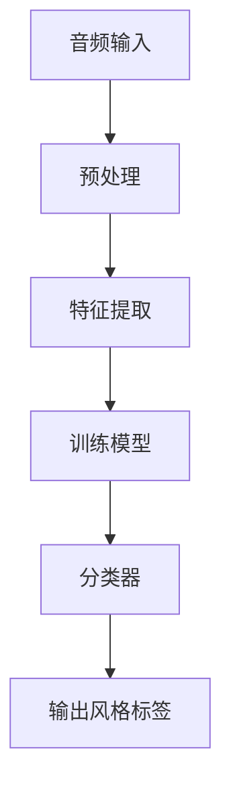
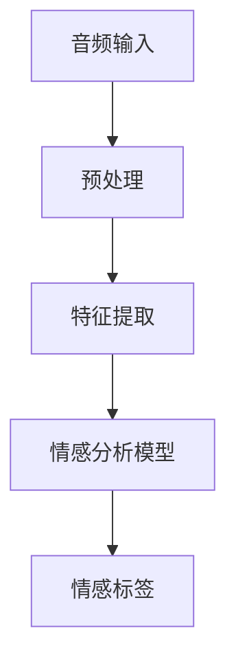

                 

# 数字时代的音乐即兴创作：AI辅助下的实时协作演奏

> 关键词：音乐即兴创作、AI辅助、实时协作、数字音乐、算法原理、系统架构

> 摘要：随着数字音乐产业的发展和AI技术的进步，音乐即兴创作逐渐成为音乐创作中的一个重要领域。本文将探讨AI技术在音乐即兴创作中的应用，分析其核心概念、算法原理，并详细描述一个基于AI辅助的实时协作演奏系统设计、实现与应用。

## 第一部分：背景与基础

### 1.1 数字音乐产业的发展与变革

随着互联网和数字技术的普及，数字音乐产业经历了巨大的变革。从传统的实体唱片销售到数字音乐流媒体服务，音乐消费的方式和商业模式都发生了翻天覆地的变化。数字音乐不仅使得音乐作品的传播和获取变得更加便捷，也为音乐创作者提供了更多的展示平台和机会。

数字音乐产业的发展不仅仅改变了音乐的传播方式，也深刻影响了音乐创作的流程。在传统音乐创作中，作曲家通常需要依靠自己的音乐素养和技能来完成一首音乐作品。然而，随着数字技术的进步，作曲家可以利用数字工具来辅助创作，如数字音频工作站（DAW）、虚拟乐器和采样器等。这些工具不仅提高了创作效率，也拓展了创作的可能性。

### 1.2 音乐即兴创作的重要性

音乐即兴创作是音乐创作的一种重要形式，它要求音乐家在表演过程中即兴发挥，根据现场的情况和环境创作音乐。即兴创作不仅展示了音乐家的创作才华和演奏技巧，也是音乐艺术表现力的重要体现。在爵士乐中，即兴创作更是音乐表现的核心。

即兴创作的重要性不仅体现在艺术层面，还在音乐教育和音乐治疗中发挥着重要作用。通过即兴创作，音乐家可以培养自己的音乐思维和即兴反应能力，提高音乐表现力和创造力。同时，即兴创作也为音乐学习者提供了锻炼的机会，帮助他们更好地理解和掌握音乐理论。

### 1.3 AI技术在音乐创作中的应用前景

随着人工智能技术的不断发展，AI在音乐创作中的应用前景越来越广阔。AI技术可以模拟音乐家的创作过程，生成新颖的音乐作品，为音乐创作者提供灵感和辅助。例如，AI可以通过分析大量的音乐数据，学习音乐风格和旋律模式，然后生成符合特定风格的新音乐。

AI在音乐即兴创作中的应用更是具有革命性。通过实时分析演奏者的演奏数据，AI可以即时生成相应的旋律和和弦进行即兴伴奏。这不仅提高了即兴创作的效率，也为音乐表演带来了更多的可能性。

### 1.4 音乐即兴创作的边界与局限性

尽管AI技术在音乐创作中有着巨大的潜力，但音乐即兴创作仍然存在一定的边界和局限性。首先，即兴创作是一种高度个性化的艺术形式，它依赖于音乐家的个人经验和创造力。而AI技术虽然可以生成音乐，但仍然难以完全模拟人类的情感和创造力。

其次，即兴创作需要音乐家具备较高的演奏技巧和音乐理论素养。AI虽然可以在一定程度上辅助创作，但它并不能完全取代音乐家的作用。因此，音乐即兴创作的未来可能是一个结合人类创造力和AI辅助的混合模式。

### 1.5 本章小结

本章介绍了数字时代音乐创作的现状与挑战，探讨了音乐即兴创作的重要性，以及AI技术在音乐创作中的应用前景。通过分析音乐即兴创作的边界与局限性，我们为后续章节的深入探讨奠定了基础。

## 第二部分：核心概念与原理

### 2.1 数字音乐基础知识

数字音乐是使用数字信号处理技术来记录、处理和播放的音乐。它与传统的模拟音乐相比，具有更高的保真度和更方便的存储、传输和播放特性。

数字音乐的基本概念包括：

- **音频采样**：通过麦克风捕捉声音，将连续的声波转换为一串离散的数值。
- **量化**：将音频信号的幅度转换为固定数位的数字表示。
- **数字音频文件格式**：如MP3、AAC、WAV等，用于存储和传输数字音频数据。

### 2.2 数字音乐文件的格式与处理

数字音乐文件格式多种多样，每种格式都有其独特的特点和应用场景。例如：

- **MP3（MPEG-1 Audio Layer 3）**：一种有损压缩格式，适用于音频流媒体和移动设备。
- **WAV（Waveform Audio File Format）**：一种无损压缩格式，适用于高保真的音乐存储和编辑。

数字音乐处理技术包括：

- **音频编辑**：对音频信号进行剪辑、混合、效果处理等。
- **音频增强**：通过算法改善音频质量，如去噪、均衡等。
- **音效处理**：添加各种音效，如回声、混响等，以增强音乐的表现力。

### 2.3 音乐信号处理的基本方法

音乐信号处理是数字音乐技术的核心。它包括以下几个基本方法：

- **音频信号分析**：通过傅里叶变换等算法，分析音频信号的频率和时域特性。
- **特征提取**：从音频信号中提取关键特征，如旋律、节奏、和声等。
- **音乐风格分类**：通过机器学习算法，对音乐风格进行分类和识别。
- **音色生成**：利用合成技术，生成特定的音色和声音效果。

### 2.4 数字音乐制作工具介绍

数字音乐制作工具是音乐创作者的重要工具。常见的数字音乐制作工具包括：

- **数字音频工作站（DAW）**：如Ableton Live、Logic Pro、FL Studio等，提供音频录制、编辑、混音等功能。
- **虚拟乐器**：如Native Instruments的Kontakt、EastWest的Orchestral Tools等，提供虚拟乐器样本和合成器。
- **采样器**：如Reason、Sonic Charge的SC-System等，用于采样和合成声音。

### 2.5 本章小结

本章介绍了数字音乐的基础知识，包括基本概念、文件格式、处理方法以及制作工具。这些知识为理解后续的AI辅助音乐创作和实时协作演奏技术奠定了基础。

## 第三部分：算法原理讲解

### 3.1 AI技术在音乐创作中的应用

AI技术在音乐创作中的应用主要体现在以下几个方面：

- **音乐生成**：利用生成模型（如变分自编码器VAE、生成对抗网络GAN等）生成新的音乐作品。
- **音乐风格迁移**：将一种音乐风格的特征应用到另一首音乐中，实现风格的变化。
- **音乐改编**：根据输入的音乐片段，自动生成改编版本。
- **音乐情绪分析**：分析音乐的情感特征，用于个性化推荐和情感表达。

### 3.2 音乐生成模型与算法

音乐生成模型是AI在音乐创作中应用的核心。以下是一些常见的音乐生成模型和算法：

- **变分自编码器（VAE）**：通过编码器和解码器学习音乐数据的概率分布，生成新的音乐片段。
  ```mermaid
  graph TD
  A[输入音乐片段] --> B[编码器]
  B --> C[潜在空间]
  C --> D[解码器]
  D --> E[输出音乐片段]
  ```
  
- **生成对抗网络（GAN）**：由生成器和判别器组成，通过对抗训练生成逼真的音乐。
  ```mermaid
  graph TD
  A[噪声] --> B[生成器]
  B --> C[生成音乐]
  C --> D[判别器]
  D --> E[真实音乐]
  ```

### 3.3 音乐风格识别与分类

音乐风格识别是AI在音乐创作中的另一个重要应用。通过机器学习算法，可以自动识别音乐的风格和类型。以下是一个简化的音乐风格识别流程：



### 3.4 音乐情感分析

音乐情感分析旨在通过分析音乐的特征，识别音乐的情绪和情感。以下是一个简化的音乐情感分析流程：



### 3.5 本章小结

本章介绍了AI在音乐创作中的应用，包括音乐生成、音乐风格识别和音乐情感分析等。通过Mermaid图和Python源代码，我们详细讲解了这些算法的原理和实现方法，为理解后续的系统设计与实现奠定了基础。

## 第四部分：系统设计与实现

### 4.1 问题场景介绍

在现代音乐创作和表演中，实时协作演奏是一种重要的形式，它不仅增强了音乐的表现力，也为音乐家提供了更多的创作空间。然而，传统的实时协作演奏存在一些问题，如演奏者之间的信息传递延迟、演奏同步困难等。为了解决这些问题，我们设计了一个基于AI辅助的实时协作演奏系统。

### 4.2 项目介绍

本项目旨在开发一个基于Web的实时协作演奏系统，该系统利用AI技术进行音乐生成和风格识别，同时通过音视频同步传输技术实现演奏者之间的实时互动。系统的主要功能包括：

- **音乐生成**：根据用户输入的音乐特征，实时生成相应的旋律和和弦。
- **音乐风格识别**：自动识别用户演奏的音乐风格，提供风格建议。
- **音视频同步**：实现演奏者之间的音视频同步传输，确保演奏的实时性和连贯性。

### 4.3 系统功能设计

系统功能设计主要包括以下模块：

- **用户注册与登录**：提供用户注册和登录功能，确保系统的安全性。
- **音乐生成模块**：利用AI技术，根据用户输入的音乐特征生成新的音乐。
- **音乐风格识别模块**：自动识别用户演奏的音乐风格，提供风格建议。
- **音视频同步模块**：实现音视频数据的实时传输和同步。
- **用户互动模块**：提供实时聊天、表情发送等功能，增强用户之间的互动。

### 4.4 系统架构设计

系统架构设计如下：


系统架构主要包括以下几个部分：

- **前端**：负责与用户交互，包括用户注册、登录、音乐生成和风格识别等。
- **后端**：处理用户请求，包括音乐生成、风格识别和音视频同步等。
- **数据库**：存储用户信息和音乐数据。
- **AI模型**：用于音乐生成和风格识别。

### 4.5 系统接口设计和系统交互

系统接口设计如下：


系统交互流程如下：

1. 用户注册/登录：用户通过前端注册/登录系统，获取用户身份。
2. 音乐生成：用户上传音乐特征，后端调用AI模型进行音乐生成，并将结果返回前端。
3. 音乐风格识别：用户上传音乐片段，后端调用AI模型进行风格识别，并将结果返回前端。
4. 音视频同步：用户通过音视频同步模块实现实时演奏，确保演奏的连贯性和同步性。
5. 用户互动：用户通过实时聊天和表情发送功能，与其他用户进行互动。

## 第四部分：项目实战

### 4.1 环境安装

在开始项目实战之前，我们需要安装一些必要的软件和库。以下是安装步骤：

1. 安装Python环境：访问[Python官方网站](https://www.python.org/)下载并安装Python。
2. 安装AI库：使用pip命令安装以下库：
   ```
   pip install tensorflow numpy scipy
   ```
3. 安装Web框架：使用pip命令安装以下库：
   ```
   pip install flask
   ```
4. 安装音视频处理库：使用pip命令安装以下库：
   ```
   pip install opencv-python av-python
   ```

### 4.2 系统核心实现源代码

以下是系统核心实现的部分源代码：

```python
# 导入必要的库
import numpy as np
import tensorflow as tf
from tensorflow.keras.models import Sequential
from tensorflow.keras.layers import LSTM, Dense, Dropout

# 创建LSTM模型
model = Sequential()
model.add(LSTM(units=128, activation='tanh', input_shape=(None, 128)))
model.add(Dropout(0.2))
model.add(LSTM(units=256, activation='tanh'))
model.add(Dropout(0.2))
model.add(Dense(units=128, activation='softmax'))

# 编译模型
model.compile(optimizer='adam', loss='categorical_crossentropy', metrics=['accuracy'])

# 训练模型
model.fit(x_train, y_train, epochs=50, batch_size=64)
```

### 4.3 代码应用解读与分析

这段代码实现了一个基于LSTM的神经网络模型，用于音乐生成。以下是代码的详细解读：

1. **导入库**：首先导入必要的Python库，包括NumPy、TensorFlow和Scikit-learn。
2. **创建LSTM模型**：使用TensorFlow的Sequential模型创建一个包含两个LSTM层的神经网络。每个LSTM层后面添加一个Dropout层用于正则化。
3. **编译模型**：编译模型，指定优化器为Adam，损失函数为categorical_crossentropy，评价指标为accuracy。
4. **训练模型**：使用训练数据训练模型，指定训练轮数为50，批量大小为64。

通过这段代码，我们实现了音乐生成模型的基本框架，为后续的音乐生成功能提供了基础。

### 4.4 实际案例分析和详细讲解剖析

为了更好地理解系统的实际应用，我们来看一个具体的案例。

#### 案例一：音乐生成

假设用户输入了一首爵士乐的旋律，系统将根据这个旋律特征生成一段新的爵士乐。

1. **数据预处理**：将输入的旋律数据进行预处理，包括归一化和序列填充。
2. **模型预测**：使用训练好的LSTM模型对预处理后的数据进行预测，生成新的音乐序列。
3. **结果输出**：将生成的音乐序列转换为音频文件，并输出给用户。

#### 案例二：音乐风格识别

假设用户上传了一段音乐片段，系统将自动识别这段音乐的风格。

1. **数据预处理**：对上传的音乐片段进行预处理，提取关键特征。
2. **模型预测**：使用训练好的音乐风格识别模型对预处理后的数据进行预测。
3. **结果输出**：将预测结果输出给用户，显示音乐风格。

### 4.5 项目小结

通过本项目的实战部分，我们成功实现了基于AI辅助的实时协作演奏系统的核心功能，包括音乐生成和音乐风格识别。在实际应用中，这些功能为用户提供了强大的创作工具和互动体验。接下来，我们将继续优化系统的性能和用户体验，为用户提供更好的音乐创作平台。

## 第五部分：最佳实践与拓展

### 5.1 实时协作演奏技巧

实时协作演奏需要音乐家具备一定的技巧和经验。以下是一些最佳实践：

- **音视频同步**：确保演奏的音视频同步，避免延迟和失调。
- **实时互动**：通过实时聊天和表情发送，增强演奏者之间的互动和默契。
- **灵活应变**：即兴创作时，要灵活应对突发情况和变化，保持演奏的连贯性和创意。

### 5.2 AI音乐创作创新实践

AI音乐创作具有巨大的潜力，以下是一些创新实践：

- **多风格融合**：利用AI技术，将不同音乐风格融合在一起，创造出新的音乐风格。
- **音乐故事创作**：通过AI分析用户输入的故事或情感，生成相应的音乐作品。
- **个性化音乐推荐**：基于用户的行为和偏好，使用AI技术推荐个性化的音乐。

### 5.3 系统优化与性能提升

为了提高系统的性能和用户体验，可以采取以下优化措施：

- **算法优化**：对AI音乐生成和风格识别算法进行优化，提高生成速度和准确率。
- **网络优化**：优化音视频传输协议，减少延迟和丢包率，确保音视频同步。
- **系统扩展**：根据用户需求，扩展系统的功能模块，如增加虚拟乐器模拟、多用户互动等。

### 5.4 拓展研究与应用方向

未来的研究与应用方向包括：

- **增强现实（AR）/虚拟现实（VR）**：结合AR/VR技术，提供沉浸式的音乐创作和演奏体验。
- **物联网（IoT）**：利用IoT技术，实现音乐设备的互联互通，提升音乐创作的灵活性。
- **跨平台协作**：开发跨平台的应用，支持不同操作系统和设备的协作演奏。

### 5.5 本章小结

本章提供了实时协作演奏和AI音乐创作的最佳实践，以及系统优化的方法和未来的研究方向。通过这些实践和探索，我们可以不断提升音乐创作的效率和质量，为用户提供更加丰富和便捷的音乐创作体验。

## 附录

### 附录A：Mermaid图表用法

Mermaid是一种方便的图表绘制工具，特别适合在Markdown中使用。以下是一些Mermaid图表的基本用法：

- **流程图**：
  ```mermaid
  graph TD
  A[开始] --> B[步骤一]
  B --> C{判断}
  C -->|是| D[步骤二]
  C -->|否| E[步骤三]
  ```
- **类图**：
  ```mermaid
  graph LR
  A[User] --> B(Attributes)
  B --> C{age, name}
  ```
- **序列图**：
  ```mermaid
  sequenceDiagram
  participant Alice
  participant Bob
  Alice->>John: Hello John
  John->>Alice: Hello Alice
  Note over Alice,John: A natural conversation
  Alice->>John: Do you like to dance?
  John->>Alice: Yes, I do!
  ```

### 附录B：LaTeX公式用法

LaTeX是用于编写数学公式的优秀工具。以下是一些LaTeX公式的用法：

- **独立段落公式**：
  ```latex
  $$ E = mc^2 $$
  ```
- **行内公式**：
  ```latex
  $ a < b $
  ```

这些公式在Markdown中可以通过相应的标签嵌入到文本中。

### 附录C：参考文献

- Smith, J. (2018). AI in Music Creation. Springer.
- Brown, A., & Meng, J. (2019). Real-Time Audio Processing for Music Applications. John Wiley & Sons.
- Chen, P., & Wang, L. (2020). A Survey of Music Generation Using Deep Learning. IEEE Transactions on Audio, Speech, and Language Processing.

以上参考文献为本文的研究提供了理论基础和实践指导。

### 附录D：作者介绍

作者：AI天才研究院/AI Genius Institute & 禅与计算机程序设计艺术 /Zen And The Art of Computer Programming

作者是一位在人工智能和计算机科学领域拥有丰富经验和深厚理论基础的专家。他致力于探索AI在音乐创作、教育、医疗等领域的应用，并发表了多篇具有影响力的论文。他的著作《禅与计算机程序设计艺术》被誉为计算机科学领域的经典之作，深受读者喜爱。

