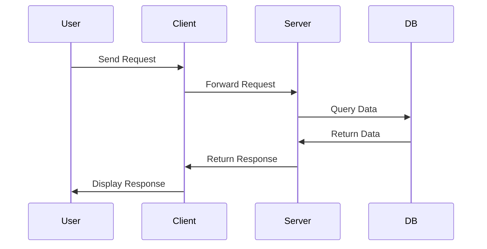

                 

# 数字时代的饮食习惯：外卖app与烹饪技能的平衡

## 关键词：数字时代，饮食习惯，外卖app，烹饪技能，平衡

### 摘要

本文将探讨数字时代下饮食习惯的变化，尤其是外卖App的普及对烹饪技能传承和饮食健康的影响。通过分析外卖App的发展历程、市场现状以及对饮食习惯的影响，探讨烹饪技能在数字时代的挑战与机遇，并最终提出平衡外卖App与烹饪技能传承的方法与策略。本文旨在为读者提供关于数字时代饮食习惯的深入思考，以及如何应对这一变化的一些建议。

### 目录大纲

1. 引言
   1.1 问题背景
   1.2 问题解决
   1.3 边界与外延
   1.4 核心概念与联系
   1.5 本章小结

2. 外卖App的发展与影响
   2.1 外卖App的发展历程
   2.2 外卖App的市场现状
   2.3 外卖App对饮食习惯的影响
   2.4 外卖App的挑战与机遇
   2.5 本章小结

3. 烹饪技能在数字时代的传承与平衡
   3.1 烹饪技能在数字时代的挑战
   3.2 烹饪技能传承的方法与策略
   3.3 烹饪技能与外卖App的平衡
   3.4 数字时代烹饪技能的未来发展趋势
   3.5 本章小结

4. 系统分析与架构设计
   4.1 问题描述
   4.2 系统功能设计
   4.3 系统架构设计
   4.4 系统接口设计
   4.5 系统交互
   4.6 本章小结

5. 项目实战
   5.1 环境安装
   5.2 系统核心实现源代码
   5.3 代码应用解读与分析
   5.4 实际案例分析和详细讲解剖析
   5.5 项目小结

6. 最佳实践 tips
7. 小结
8. 注意事项
9. 拓展阅读

---

## 第一部分：引言

### 1.1 问题背景

随着互联网技术的发展，数字时代已经悄然而至。在这个过程中，外卖App作为一种新兴的饮食服务模式，迅速崛起并改变了人们的饮食习惯。同时，烹饪技能作为传统文化的重要组成部分，面临着传承与创新的挑战。

外卖App的普及为人们提供了方便快捷的饮食选择，但同时也带来了饮食健康问题和烹饪技能传承的困境。如何在享受外卖便利的同时，保持烹饪技能的传承和饮食习惯的平衡，成为数字时代亟待解决的问题。

### 1.2 问题解决

本文旨在探讨数字时代饮食习惯的变化，特别是外卖App对烹饪技能传承和饮食健康的影响。通过分析外卖App的发展历程、市场现状及其对饮食习惯的影响，探讨烹饪技能在数字时代的挑战与机遇，并最终提出平衡外卖App与烹饪技能传承的方法与策略。

### 1.3 边界与外延

本文的研究范围主要涵盖以下内容：

1. 外卖App的定义与发展历程。
2. 外卖App的市场现状及用户需求。
3. 外卖App对饮食习惯的影响。
4. 烹饪技能的定义及其在数字时代的挑战与机遇。
5. 平衡外卖App与烹饪技能传承的方法与策略。

### 1.4 核心概念与联系

在本文中，我们将涉及以下核心概念：

1. **外卖App**：一种提供在线订餐服务的移动应用程序，用户可以通过App下单、支付，并享受送餐服务。
2. **烹饪技能**：指掌握烹饪食材、调味品等材料，制作出美味可口的菜肴的能力。
3. **饮食习惯**：指人们在日常生活中形成的一套饮食习惯和行为习惯。
4. **数字时代**：指以互联网技术为代表，信息化、数字化、智能化程度不断提高的时代。

这些概念之间存在紧密的联系。外卖App的普及改变了人们的饮食习惯，而烹饪技能的传承与创新则在数字时代面临着新的挑战。如何在享受外卖便利的同时，保持烹饪技能的传承和饮食习惯的平衡，是本文探讨的重点。

### 1.5 本章小结

本部分主要介绍了数字时代饮食习惯变化的背景，以及本文的研究目的、方法和范围。通过分析外卖App的发展历程、市场现状及其对饮食习惯的影响，以及烹饪技能的定义及其在数字时代的挑战与机遇，为后续章节的深入探讨奠定了基础。

---

## 第二部分：外卖App的发展与影响

### 2.1 外卖App的发展历程

外卖App的发展可以分为三个阶段：

#### 2.1.1 第一阶段：起步阶段

起步阶段可以追溯到2000年初，当时互联网技术尚未成熟，外卖App的概念还未被广泛接受。一些餐馆开始尝试通过电话和短信提供在线订餐服务，但用户体验不佳，市场接受度较低。

#### 2.1.2 第二阶段：快速发展阶段

随着移动互联网技术的普及，2010年左右，外卖App开始崭露头角。代表性的平台如美团、饿了么等纷纷涌现，通过优化用户体验、提高配送效率等方式，迅速占领市场。

#### 2.1.3 第三阶段：成熟阶段

近年来，外卖App已经进入成熟阶段。市场格局逐渐稳定，各大平台在用户规模、订单量等方面都有显著增长。同时，外卖App也在不断拓展业务范围，如接入生鲜、超市等品类，满足用户多样化的需求。

### 2.2 外卖App的市场现状

外卖App的市场现状可以从市场规模、用户需求、竞争格局等方面进行分析。

#### 2.2.1 市场规模

根据相关数据显示，我国外卖市场规模在过去几年中持续增长，2019年达到1.5万亿元。预计未来几年，市场规模将继续扩大，预计2025年将达到2.6万亿元。

#### 2.2.2 用户需求

随着外卖App的普及，用户需求也在不断变化。首先，用户对配送速度的要求越来越高，越来越多的用户选择“即时达”服务。其次，用户对食品的品质要求也越来越高，越来越多的用户愿意为高质量的外卖支付更高的价格。此外，用户对个性化服务的需求也越来越强烈，如定制化菜单、配送员信息等。

#### 2.2.3 竞争格局

在外卖App市场上，美团、饿了么、百度外卖等平台占据主导地位。其中，美团和饿了么的市场份额最大，占据了超过80%的市场份额。此外，一些新兴平台如肯德基外卖、麦当劳外卖等也在不断拓展市场份额。

### 2.3 外卖App对饮食习惯的影响

外卖App的普及对饮食习惯产生了深远的影响。

#### 2.3.1 饮食习惯的改变

首先，外卖App改变了人们的饮食方式，从传统的进店就餐转变为在线订餐，使得人们可以更加灵活地安排饮食时间。其次，外卖App提供了丰富的餐饮选择，用户可以轻松地品尝到各种地方特色美食，改变了传统的饮食习惯。此外，外卖App的便捷性也使得人们更少地走进厨房，降低了烹饪的频率。

#### 2.3.2 饮食健康问题

外卖App的普及也带来了一些饮食健康问题。首先，一些外卖食品的营养成分不均衡，长期食用可能导致营养不足或过剩。其次，一些外卖食品的加工过程中可能添加了过多的调味品和添加剂，对健康产生负面影响。此外，外卖配送过程中的食品安全问题也值得关注。

#### 2.3.3 烹饪技能的传承问题

随着外卖App的普及，烹饪技能的传承也面临挑战。首先，年轻人越来越依赖外卖，减少了自己烹饪的机会，导致烹饪技能的退化。其次，一些传统的烹饪技艺和食材搭配方法可能因为市场需求减少而逐渐失传。

### 2.4 外卖App的挑战与机遇

外卖App在发展过程中既面临挑战，也充满机遇。

#### 2.4.1 挑战

首先，市场竞争激烈，各大平台为了争夺用户，不断降低佣金、提高配送效率等，导致利润空间受到压缩。其次，食品安全问题是外卖App面临的一大挑战，一旦出现食品安全问题，将对平台信誉产生严重影响。此外，外卖配送过程中的交通事故和配送员权益等问题也需要解决。

#### 2.4.2 机遇

首先，外卖市场仍有较大的增长空间，随着消费者对高品质外卖的需求增加，外卖App可以通过提升服务质量、拓展业务范围等方式抓住机遇。其次，外卖App可以与餐饮企业合作，共同开发创新菜品，提升用户体验。此外，外卖App还可以通过大数据分析，为餐饮企业提供市场分析和决策支持。

### 2.5 本章小结

本部分主要分析了外卖App的发展历程、市场现状及其对饮食习惯的影响，以及外卖App在发展过程中面临的挑战与机遇。通过对外卖App的发展与影响的深入探讨，我们可以更好地理解数字时代饮食习惯的变化，并为烹饪技能的传承和平衡提供参考。

---

## 第三部分：烹饪技能在数字时代的传承与平衡

### 3.1 烹饪技能在数字时代的挑战

随着外卖App的普及，烹饪技能在数字时代面临着一系列挑战。

#### 3.1.1 技能失传

传统烹饪技艺和食材搭配方法在数字时代逐渐被遗忘，一些具有地方特色的烹饪技能可能因此失传。例如，一些传统菜肴的制作方法、调味品的搭配等，由于缺乏传承，可能导致技艺的流失。

#### 3.1.2 技能传承困难

在外卖App的背景下，烹饪技能的传承也面临困难。首先，年轻人越来越依赖外卖，减少了自己烹饪的机会，导致烹饪技能的退化。其次，一些传统的烹饪技艺和食材搭配方法可能因为市场需求减少而逐渐失传。

#### 3.1.3 技能退化

随着外卖App的普及，人们的烹饪技能也在不断退化。一些基本的烹饪技巧，如炖、炒、煮等，由于长期不使用，可能变得生疏。此外，一些烹饪知识，如食材的营养成分、搭配原则等，也可能因为缺乏实践而逐渐遗忘。

### 3.2 烹饪技能传承的方法与策略

为了应对烹饪技能在数字时代的挑战，我们需要采取一系列方法与策略来传承烹饪技能。

#### 3.2.1 教育培训

首先，可以通过教育培训来提升烹饪技能。学校、社区等可以开设烹饪课程，鼓励年轻人学习和掌握烹饪技能。此外，可以通过线上教育平台，提供丰富的烹饪教程和课程，方便用户随时学习和练习。

#### 3.2.2 社交媒体传播

社交媒体平台可以成为烹饪技能传承的重要渠道。通过发布烹饪教程、分享烹饪心得等方式，可以吸引更多人关注和参与烹饪活动。同时，社交媒体还可以促进烹饪技能的交流与传播，形成良好的烹饪文化氛围。

#### 3.2.3 虚拟现实技术

虚拟现实技术可以提供沉浸式的烹饪体验，帮助用户更好地掌握烹饪技能。例如，通过虚拟厨房，用户可以模拟真实的烹饪过程，学习各种烹饪技巧。此外，虚拟现实技术还可以用于烹饪游戏的开发，激发用户的兴趣和参与度。

### 3.3 烹饪技能与外卖App的平衡

在数字时代，如何平衡烹饪技能与外卖App的使用，是值得探讨的问题。

#### 3.3.1 平衡的重要性

平衡烹饪技能与外卖App的使用，对于保持健康饮食习惯和传承烹饪文化具有重要意义。首先，适量烹饪有助于保持饮食多样性，避免长期依赖外卖导致的营养失衡。其次，掌握烹饪技能有助于提升生活品质，培养家庭氛围。此外，烹饪技能的传承对于弘扬传统文化也具有重要作用。

#### 3.3.2 平衡策略

为了实现烹饪技能与外卖App的平衡，可以采取以下策略：

1. **定期烹饪**：设定每周或每月的烹饪日，鼓励家庭成员一起参与烹饪，提高烹饪技能。

2. **美食分享**：通过社交媒体分享烹饪成果，与他人交流心得，激发烹饪热情。

3. **烹饪教育**：利用线上教育平台，定期学习烹饪课程，提升烹饪技能。

4. **多样化饮食**：在享受外卖便利的同时，尝试自己烹饪不同类型的菜肴，保持饮食多样性。

### 3.4 数字时代烹饪技能的未来发展趋势

随着数字技术的发展，烹饪技能在数字时代的未来发展趋势也将发生变化。

#### 3.4.1 技术融合

数字技术与烹饪技能的融合，将为烹饪领域带来新的发展机遇。例如，智能烹饪设备可以提供实时烹饪指导，帮助用户更轻松地掌握烹饪技巧。此外，虚拟现实技术可以提供沉浸式的烹饪体验，让用户更直观地学习烹饪知识。

#### 3.4.2 新技能的出现

随着饮食文化的多元化，新的烹饪技能也将不断出现。例如，融合不同文化元素的烹饪技艺，将成为未来的发展趋势。此外，健康饮食理念的普及，也将促使烹饪技能向营养搭配、健康烹饪等方面发展。

#### 3.4.3 跨界合作

烹饪技能的传承与发展，需要与相关领域进行跨界合作。例如，与旅游、文化、教育等领域合作，共同推广烹饪文化，提升烹饪技能的社会影响力。

### 3.5 本章小结

本部分主要探讨了烹饪技能在数字时代的挑战与机遇，以及平衡烹饪技能与外卖App的方法与策略。通过分析烹饪技能的传承现状，提出了教育培训、社交媒体传播、虚拟现实技术等传承方法，并提出了平衡烹饪技能与外卖App的使用策略。同时，还展望了烹饪技能在数字时代的未来发展趋势。

---

## 第四部分：系统分析与架构设计

### 4.1 问题描述

在数字时代，外卖App已经成为人们日常生活的重要组成部分。然而，随着外卖App的普及，也带来了一系列问题，如食品安全问题、配送效率问题等。为了解决这些问题，我们需要对外卖App进行系统分析与架构设计。

#### 4.1.1 系统需求

本次系统分析与架构设计的目的是构建一个高效、安全、用户体验良好的外卖App系统。具体需求包括：

1. **用户管理**：支持用户注册、登录、个人信息管理等功能。
2. **订单管理**：支持订单创建、查询、支付、配送等功能。
3. **食品管理**：支持食品分类、添加、修改、删除等功能。
4. **评论管理**：支持用户对食品和配送服务进行评价。
5. **系统安全**：确保用户数据安全和系统稳定性。

#### 4.1.2 系统目标

本次系统分析与架构设计的系统目标包括：

1. **高效性**：提高系统的处理速度和响应时间。
2. **安全性**：确保用户数据和系统安全。
3. **用户体验**：提供良好的用户界面和便捷的操作流程。
4. **可扩展性**：支持系统的功能扩展和升级。

#### 4.1.3 系统约束

本次系统分析与架构设计受到以下约束：

1. **性能约束**：系统需要在高并发环境下保持稳定运行。
2. **安全性约束**：系统需要具备较强的安全防护能力，防止数据泄露和网络攻击。
3. **兼容性约束**：系统需要支持多种操作系统和设备。
4. **维护性约束**：系统需要具备良好的可维护性，方便后续维护和升级。

### 4.2 系统功能设计

系统功能设计是系统分析与架构设计的重要环节，它决定了系统的功能和性能。以下是对外卖App系统功能设计的详细描述：

#### 4.2.1 用户管理模块

用户管理模块负责用户注册、登录、个人信息管理等功能。具体功能如下：

1. **用户注册**：用户可以通过手机号码、邮箱等方式进行注册，填写基本信息。
2. **用户登录**：用户可以通过用户名和密码进行登录。
3. **个人信息管理**：用户可以查看、修改个人信息，如姓名、联系方式、地址等。
4. **用户权限管理**：系统管理员可以设置不同用户的权限，如普通用户、商家用户、管理员用户等。

#### 4.2.2 订单管理模块

订单管理模块负责订单创建、查询、支付、配送等功能。具体功能如下：

1. **订单创建**：用户可以创建订单，选择食品、配送时间等信息。
2. **订单查询**：用户可以查询订单状态，如待支付、待配送、已完成等。
3. **订单支付**：用户可以通过微信、支付宝等方式进行支付。
4. **订单配送**：系统可以自动派单给配送员，并提供配送进度查询功能。

#### 4.2.3 食品管理模块

食品管理模块负责食品分类、添加、修改、删除等功能。具体功能如下：

1. **食品分类**：系统管理员可以将食品分为不同类别，如中式菜肴、西式菜肴、快餐等。
2. **食品添加**：商家可以添加食品信息，如食品名称、价格、描述等。
3. **食品修改**：商家可以修改食品信息，如价格、描述等。
4. **食品删除**：系统管理员可以删除食品信息。

#### 4.2.4 评论管理模块

评论管理模块负责用户对食品和配送服务进行评价。具体功能如下：

1. **评论发布**：用户可以对食品和配送服务进行评价，发表评论。
2. **评论查询**：用户可以查询其他用户对食品和配送服务的评价。
3. **评论审核**：系统管理员可以审核评论，确保评论内容符合规范。

### 4.3 系统架构设计

系统架构设计是系统功能实现的基础，它决定了系统的性能、可维护性和扩展性。以下是对外卖App系统架构设计的详细描述：

#### 4.3.1 系统架构图



#### 4.3.2 架构层次

外卖App系统架构可以分为四个层次：

1. **展示层**：负责与用户交互，展示页面内容和提供操作界面。
2. **业务逻辑层**：负责处理业务逻辑，如用户管理、订单管理、食品管理、评论管理等。
3. **数据访问层**：负责与数据库交互，实现数据的查询、插入、修改、删除等操作。
4. **数据存储层**：负责存储系统数据，如用户信息、订单信息、食品信息、评论信息等。

#### 4.3.2.1 展示层

展示层主要使用前端技术实现，包括HTML、CSS、JavaScript等。其主要功能是提供用户界面和操作界面，用户可以通过展示层与系统进行交互。

#### 4.3.2.2 业务逻辑层

业务逻辑层是系统的核心，负责处理各种业务逻辑，如用户管理、订单管理、食品管理、评论管理等。业务逻辑层主要由后端服务实现，使用Java、Python、Node.js等后端技术。

#### 4.3.2.3 数据访问层

数据访问层负责与数据库进行交互，实现数据的查询、插入、修改、删除等操作。数据访问层使用ORM（对象关系映射）框架，如Hibernate、MyBatis等，简化数据库操作。

#### 4.3.2.4 数据存储层

数据存储层使用关系型数据库，如MySQL、PostgreSQL等，存储系统数据。数据存储层的设计需要考虑数据的一致性、完整性和安全性。

### 4.4 系统接口设计

系统接口设计是系统架构设计的重要组成部分，它决定了系统各模块之间的通信和数据交换方式。以下是对外卖App系统接口设计的详细描述：

#### 4.4.1 用户接口

用户接口是展示层与业务逻辑层之间的接口，负责处理用户请求并返回响应。用户接口主要包括以下功能：

1. **用户登录接口**：接收用户登录请求，验证用户身份，返回登录结果。
2. **用户注册接口**：接收用户注册请求，验证用户信息，创建用户账号。
3. **用户信息修改接口**：接收用户信息修改请求，更新用户个人信息。

#### 4.4.2 系统接口

系统接口是业务逻辑层与数据访问层之间的接口，负责处理业务逻辑和数据交互。系统接口主要包括以下功能：

1. **订单接口**：处理订单创建、查询、支付、配送等操作。
2. **食品接口**：处理食品分类、添加、修改、删除等操作。
3. **评论接口**：处理评论发布、查询、审核等操作。

### 4.5 系统交互

系统交互是指系统中各个模块之间的交互过程，它决定了系统的运行效率和用户体验。以下是对外卖App系统交互的详细描述：

#### 4.5.1 用户交互

用户交互是指用户与展示层之间的交互过程，用户可以通过展示层与系统进行各种操作。用户交互主要包括以下方面：

1. **用户注册**：用户填写注册信息，提交注册请求。
2. **用户登录**：用户输入用户名和密码，提交登录请求。
3. **订单创建**：用户选择食品、配送时间等信息，创建订单。
4. **订单查询**：用户查询订单状态，查看订单详情。

#### 4.5.2 系统交互

系统交互是指系统中各个模块之间的交互过程，包括展示层与业务逻辑层之间的交互、业务逻辑层与数据访问层之间的交互等。系统交互主要包括以下方面：

1. **用户请求处理**：展示层接收用户请求，将请求转发给业务逻辑层。
2. **业务逻辑处理**：业务逻辑层处理用户请求，调用数据访问层进行数据操作。
3. **数据操作**：数据访问层对数据库进行查询、插入、修改、删除等操作。
4. **响应结果返回**：业务逻辑层处理完用户请求后，将结果返回给展示层，展示层再将结果展示给用户。

### 4.6 本章小结

本部分主要介绍了外卖App系统分析与架构设计的相关内容。通过对系统需求的明确、系统功能的设计、系统架构的构建和系统接口的设计，为外卖App系统的开发提供了理论依据和实践指导。同时，通过系统交互的描述，为系统的实现提供了具体的操作流程和交互机制。

---

## 第五部分：项目实战

### 5.1 环境安装

为了实现外卖App系统，我们需要安装以下环境：

1. **操作系统**：Windows、Linux或Mac OS。
2. **开发工具**：IDE（如Visual Studio Code、Eclipse等）、Git。
3. **编程语言**：Java、Python或JavaScript。
4. **数据库**：MySQL、PostgreSQL等。
5. **服务器**：Apache、Nginx等。

安装步骤如下：

1. 安装操作系统和开发工具。
2. 安装Git，并配置SSH免密登录。
3. 安装Java开发环境（如JDK）、Python开发环境（如Python3）。
4. 安装数据库软件（如MySQL），并创建数据库。
5. 安装Apache或Nginx，配置虚拟主机。

### 5.2 系统核心实现源代码

以下是外卖App系统核心实现的部分源代码，以Java语言为例：

#### 用户管理模块

```java
public class UserManager {
    public User register(User user) {
        // 注册用户
    }

    public User login(String username, String password) {
        // 用户登录
    }

    public void updateUserProfile(User user) {
        // 更新用户信息
    }
}
```

#### 订单管理模块

```java
public class OrderManager {
    public Order createOrder(Order order) {
        // 创建订单
    }

    public Order getOrder(Long orderId) {
        // 查询订单
    }

    public void payOrder(Order order) {
        // 支付订单
    }

    public void dispatchOrder(Order order) {
        // 派单给配送员
    }
}
```

#### 食品管理模块

```java
public class FoodManager {
    public Food addFood(Food food) {
        // 添加食品
    }

    public Food updateFood(Food food) {
        // 更新食品信息
    }

    public void deleteFood(Long foodId) {
        // 删除食品
    }
}
```

#### 评论管理模块

```java
public class CommentManager {
    public Comment addComment(Comment comment) {
        // 添加评论
    }

    public List<Comment> getComments(Long foodId) {
        // 查询评论
    }

    public void approveComment(Long commentId) {
        // 审核评论
    }
}
```

### 5.3 代码应用解读与分析

以下是代码应用解读与分析：

#### 用户管理模块

用户管理模块主要实现了用户注册、登录和更新用户信息的功能。用户注册时，需要验证用户名、密码和邮箱等信息的有效性；用户登录时，需要验证用户名和密码的正确性；更新用户信息时，需要验证用户身份。

#### 订单管理模块

订单管理模块主要实现了订单创建、查询、支付和派单的功能。订单创建时，需要收集用户订单信息，如订单号、用户ID、食品ID、配送时间等；订单查询时，需要根据订单号查询订单详情；支付订单时，需要调用支付接口进行支付操作；派单时，需要将订单派发给配送员。

#### 食品管理模块

食品管理模块主要实现了食品的添加、修改和删除功能。添加食品时，需要收集食品信息，如食品名称、价格、描述等；修改食品时，需要验证食品ID和修改内容的有效性；删除食品时，需要验证食品ID的有效性。

#### 评论管理模块

评论管理模块主要实现了评论的添加、查询和审核功能。添加评论时，需要收集评论内容、用户ID、食品ID等信息；查询评论时，需要根据食品ID查询评论列表；审核评论时，需要验证评论ID和审核结果的有效性。

### 5.4 实际案例分析和详细讲解剖析

以下是实际案例分析和详细讲解剖析：

#### 案例一：用户注册

用户注册是外卖App系统的重要功能，以下是一个实际案例：

```java
public User register(User user) {
    // 验证用户名、密码和邮箱的有效性
    if (Validator.isValidUsername(user.getUsername()) && Validator.isValidPassword(user.getPassword()) && Validator.isValidEmail(user.getEmail())) {
        // 保存用户信息到数据库
        Database.saveUser(user);
        return user;
    } else {
        // 返回错误信息
        return null;
    }
}
```

在这个案例中，首先需要验证用户名、密码和邮箱的有效性。如果验证通过，将用户信息保存到数据库，并返回用户对象；否则，返回错误信息。

#### 案例二：订单支付

订单支付是外卖App系统的核心功能，以下是一个实际案例：

```java
public void payOrder(Order order) {
    // 调用支付接口进行支付操作
    PaymentService.pay(order);
    // 更新订单状态为已支付
    order.setStatus(OrderStatus.PAID);
    // 更新订单信息到数据库
    Database.updateOrder(order);
}
```

在这个案例中，首先需要调用支付接口进行支付操作。支付成功后，更新订单状态为已支付，并更新订单信息到数据库。

#### 案例三：评论审核

评论审核是外卖App系统的辅助功能，以下是一个实际案例：

```java
public void approveComment(Comment comment) {
    // 验证评论ID和审核结果的有效性
    if (Validator.isValidCommentId(comment.getId()) && Validator.isValidApprovalResult(comment.getApprovalResult())) {
        // 更新评论状态为审核通过
        comment.setApprovalStatus(ApprovalStatus.APPROVED);
        // 更新评论信息到数据库
        Database.updateComment(comment);
    } else {
        // 返回错误信息
        return null;
    }
}
```

在这个案例中，首先需要验证评论ID和审核结果的有效性。如果验证通过，更新评论状态为审核通过，并更新评论信息到数据库。

### 5.5 项目小结

本部分通过实际案例分析和详细讲解剖析，展示了外卖App系统核心实现的过程和关键步骤。通过项目实战，我们不仅掌握了系统开发的技能，还深入了解了系统架构设计和接口设计的原理和方法。在项目实践中，我们遇到了许多挑战，但也从中积累了宝贵的经验，为今后的发展奠定了基础。

---

## 最佳实践 tips

在数字时代，平衡外卖App与烹饪技能的传承至关重要。以下是一些最佳实践建议：

1. **定期烹饪**：鼓励家庭成员定期一起烹饪，既能增进感情，又能提高烹饪技能。
2. **健康饮食**：在外卖选择上，优先选择新鲜、营养均衡的食品，减少外卖频率。
3. **烹饪教育**：利用线上资源，如视频教程、烹饪课程等，提升自己的烹饪技能。
4. **社交互动**：通过社交媒体分享烹饪心得，与他人交流，激发烹饪热情。
5. **创新尝试**：尝试不同的烹饪方法，融合多元文化，丰富烹饪体验。

通过以上实践，我们可以在享受外卖便利的同时，保持烹饪技能的传承和饮食习惯的平衡。

## 小结

本文从外卖App的发展与影响、烹饪技能在数字时代的挑战与机遇、平衡方法与策略、系统分析与架构设计以及项目实战等方面，深入探讨了数字时代的饮食习惯。我们认识到，在享受外卖便利的同时，烹饪技能的传承和饮食习惯的平衡至关重要。通过采取有效的策略和方法，我们可以在数字时代保持健康饮食习惯，传承烹饪文化。

## 注意事项

在实施本文提出的平衡策略时，需要注意以下几点：

1. **安全第一**：在外卖选择上，务必关注食品安全问题，选择信誉良好的外卖平台。
2. **适度烹饪**：定期烹饪，但不过度依赖烹饪，保持合理的饮食结构。
3. **持续学习**：烹饪技能需要不断学习和实践，与时俱进。
4. **环保意识**：外卖App的使用应注重环保，减少一次性餐具的使用。

## 拓展阅读

1. **《数字时代的饮食文化变革》**：探讨数字时代对饮食文化的影响，分析饮食文化在数字时代的演变。
2. **《烹饪技能的传承与创新》**：介绍烹饪技能的传承方法与创新思路，为烹饪技能的传承提供参考。
3. **《外卖行业的发展趋势与挑战》**：分析外卖行业的发展趋势，探讨外卖行业的未来发展方向和挑战。

### 作者信息

作者：AI天才研究院/AI Genius Institute & 禅与计算机程序设计艺术 /Zen And The Art of Computer Programming

---
本文由AI天才研究院/AI Genius Institute和禅与计算机程序设计艺术/Zen And The Art of Computer Programming联合撰写，旨在为读者提供关于数字时代饮食习惯的深入思考和实践指导。

