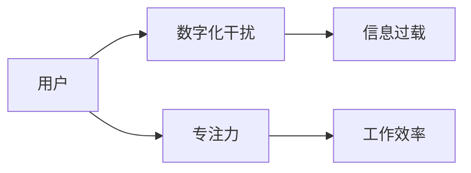
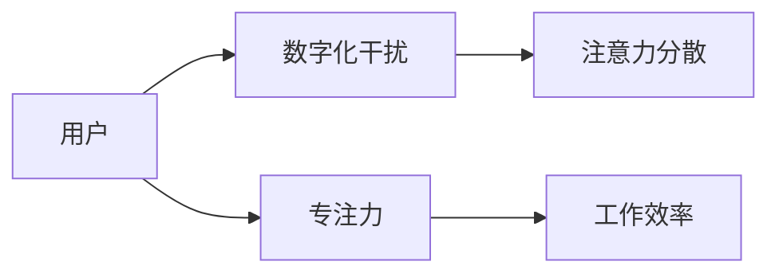
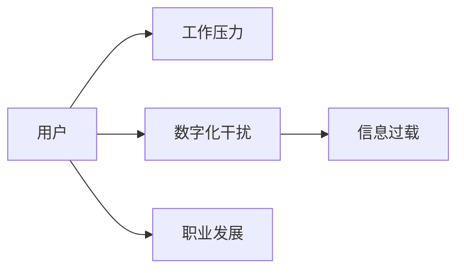
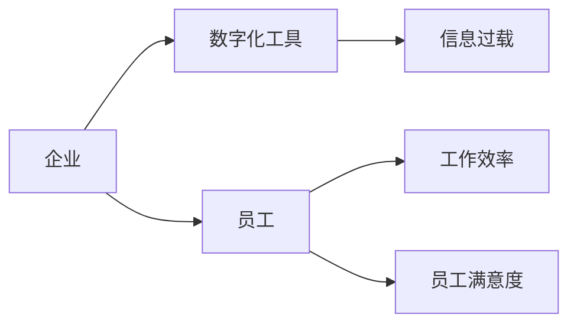
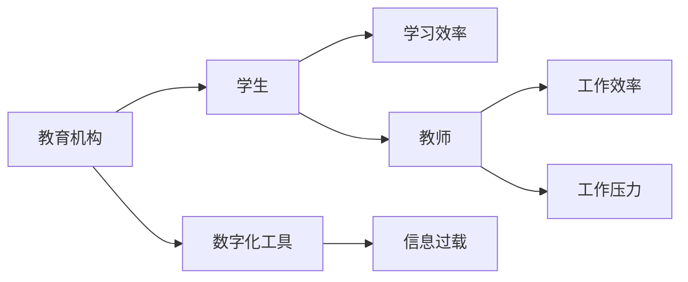
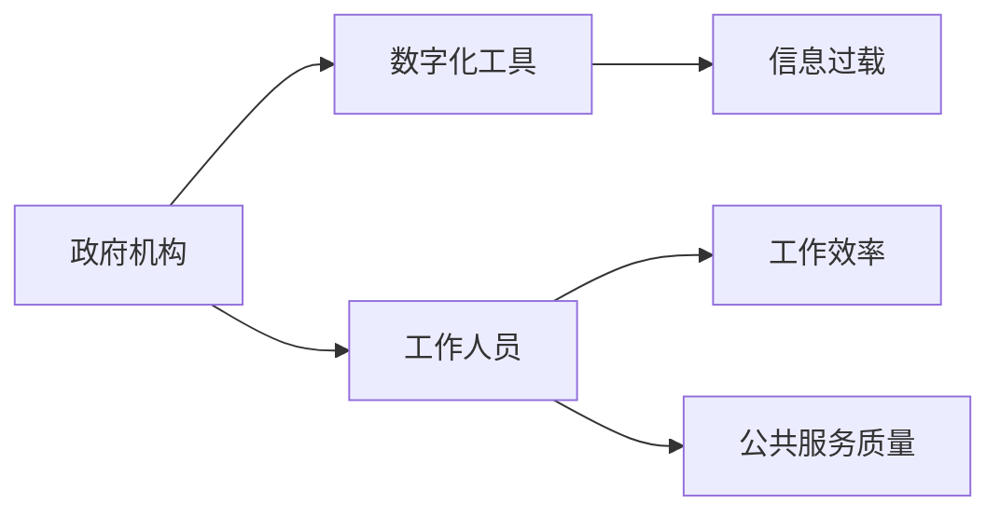

                 

# 数字极简主义工作坊：信息时代的专注力重建

> 关键词：数字极简主义，专注力，信息过载，工作坊，实践方法，未来趋势

> 摘要：本文探讨了数字极简主义在信息时代的重要性，通过介绍数字极简主义的理念、实践方法及其在未来趋势中的应用，旨在帮助读者重建专注力，应对信息过载的挑战。

## 引言：数字时代的挑战与专注力的价值

### 1.1 数字时代的现状与问题

在当今这个数字化时代，我们的生活和工作方式都发生了巨大的变化。从互联网到智能手机，从社交媒体到在线办公，技术已经深刻地影响了我们的日常生活。然而，这种变化也带来了一系列的问题。首先，信息过载成为了一个普遍的现象。我们每天都会接收到大量的信息，而这些信息中，有一部分是冗余的、无关紧要的，甚至是有害的。这种信息过载会导致我们的注意力分散，影响我们的工作效率和生活质量。

### 1.2 什么是数字极简主义

数字极简主义是一种生活哲学，主张通过减少数字化干扰，重建专注力和提升生活质量。它强调的是对数字化工具和信息的理性使用，而不是盲目地追求技术的进步。数字极简主义的核心在于“少即是多”，通过减少不必要的数字化干扰，我们能够更加专注于重要的事情，提高工作效率，同时也能够减少精神压力，提升生活质量。

### 1.3 为什么专注力重建至关重要

在数字极简主义的背景下，专注力的重建显得尤为重要。专注力是指我们能够集中注意力，专注于某个任务或目标的能力。在信息过载的时代，我们的注意力很容易被分散，导致工作效率低下，甚至影响到我们的心理健康。因此，重建专注力不仅能够提高我们的工作效率，还能够改善我们的心理健康，提升生活质量。

### 1.4 本书结构概述

本书将分为八个章节，首先介绍数字极简主义的理念和实践方法，然后通过案例研究展示其在个人和组织中的应用，最后探讨数字极简主义的未来趋势和价值。

## 第2章 数字极简主义理念

### 2.1 数字极简主义的起源与理念

数字极简主义起源于20世纪80年代，当时人们开始意识到过度依赖技术可能会带来的负面影响。数字极简主义的理念包括以下几个方面：

1. **减少数字化干扰**：通过减少社交媒体、电子邮件等数字化工具的使用，减少信息过载，从而提高专注力。
2. **理性使用技术**：不是盲目地追求技术的进步，而是根据实际需求选择合适的技术工具，避免不必要的复杂性。
3. **回归本质**：通过简化生活和工作方式，回归到最基本的需求和目标，从而提高生活质量。

### 2.2 数字极简主义的核心原则

数字极简主义的核心原则包括以下几个方面：

1. **少即是多**：通过减少不必要的数字化干扰，我们能够更加专注于重要的事情，提高工作效率和生活质量。
2. **优先级排序**：将时间和精力投入到最重要的任务和目标上，而不是被琐碎的事务所占据。
3. **简化生活**：通过减少物品和信息的数量，简化生活和工作方式，从而减轻压力，提高生活质量。

### 2.3 数字极简主义与传统生活方式的对比

数字极简主义与传统生活方式在某些方面有所不同。传统生活方式更注重物质的积累，而数字极简主义更注重精神的富足。传统生活方式可能需要大量的时间和精力来维护和整理物品，而数字极简主义则强调通过减少物品和信息，简化生活和工作方式，从而减少时间和精力的消耗。

## 第3章 数字极简主义实践

### 3.1 减少数字化干扰

#### 3.1.1 媒体消费习惯的改变

首先，我们需要改变媒体消费的习惯。例如，我们可以设置固定的媒体消费时间，避免在工作和学习时间外过度消费媒体。此外，我们可以选择高质量的媒体内容，而不是被大量的低质量信息所淹没。

#### 3.1.2 社交媒体使用策略

社交媒体的使用策略也是减少数字化干扰的重要一环。我们可以限制每天在社交媒体上的时间，避免被无意义的社交互动所占据。同时，我们可以选择关注真正对我们有价值的账号和内容。

#### 3.1.3 电子邮件和消息管理技巧

电子邮件和消息管理技巧也是减少数字化干扰的关键。我们可以设置固定的邮件检查时间，避免被不断涌入的邮件打扰。此外，我们可以使用邮件分类和标签功能，将重要的邮件和消息优先处理。

### 3.2 构建专注的工作环境

#### 3.2.1 环境设计原则

构建专注的工作环境首先需要遵循一些环境设计原则。例如，选择一个安静、光线适宜的地方作为工作场所，减少外界干扰。此外，保持工作环境的整洁和有序，也能够提高我们的工作效率。

#### 3.2.2 工作流程优化

工作流程的优化是提高专注力的另一个重要方面。我们可以通过分解任务、设置优先级、制定明确的计划和目标，来提高工作的效率。

#### 3.2.3 技术辅助工具

现代科技为我们提供了许多辅助工具，可以帮助我们更好地专注于工作。例如，使用番茄钟技术来管理工作时间，使用专注力追踪工具来监测我们的专注程度。

### 3.3 心理调适与习惯养成

#### 3.3.1 应对数字焦虑

数字焦虑是我们在数字时代面临的一个新挑战。我们可以通过学习心理调适技巧，如深呼吸、冥想等，来缓解数字焦虑。

#### 3.3.2 增强专注力的心理技巧

增强专注力的心理技巧包括时间管理、目标设定、自我激励等。通过这些技巧，我们可以更好地管理我们的时间和精力，提高专注力。

#### 3.3.3 专注力训练方法

专注力训练方法包括正念练习、冥想、专注力游戏等。这些方法可以帮助我们提高专注力，从而更好地应对数字极简主义实践中的挑战。

## 第4章 数字极简主义工具与方法

### 4.1 数字极简主义工具

数字极简主义工具是我们实践数字极简主义的重要手段。这些工具可以帮助我们更好地管理时间和信息，提高专注力。例如，专注力追踪工具可以帮助我们监测自己的专注程度，及时调整工作方式。

#### 4.1.1 专注力追踪工具

专注力追踪工具可以记录我们的专注时间、中断次数等数据，帮助我们了解自己的专注力状况，从而及时调整工作方式。

#### 4.1.2 记录与管理工具

记录与管理工具可以帮助我们整理和存储重要信息，避免信息过载。例如，使用笔记应用程序来记录灵感，使用任务管理工具来管理日常任务。

#### 4.1.3 清理与组织工具

清理与组织工具可以帮助我们整理和清理数字化工具和信息。例如，定期清理手机和电脑中的应用程序，删除不再需要的文件和邮件。

### 4.2 数字极简主义方法

数字极简主义方法是指我们在实践中遵循的一系列原则和技巧。这些方法可以帮助我们更好地应用数字极简主义理念，提高专注力和生活质量。

#### 4.2.1 日常任务管理

日常任务管理是数字极简主义实践的重要组成部分。通过设置优先级、分解任务、制定计划和目标，我们可以更好地管理日常任务，避免任务堆积和拖延。

#### 4.2.2 项目管理与协作

项目管理和协作是数字极简主义在工作和团队协作中的应用。通过使用项目管理工具和协作技巧，我们可以更好地管理项目进度和团队沟通，提高工作效率。

#### 4.2.3 数字极简主义在团队中的应用

数字极简主义在团队中的应用可以帮助团队减少数字化干扰，提高专注力和工作效率。通过建立明确的沟通和协作机制，团队可以更好地应对数字极简主义的挑战。

## 第5章 数字极简主义案例研究

### 5.1 个人数字极简主义案例

#### 5.1.1 案例一：从混乱到有序

在这个案例中，一位从事软件开发工作的专业人士通过实施数字极简主义，成功地从混乱的工作状态中解脱出来，实现了工作与生活的平衡。

**背景介绍**：该专业人士在过去的工作中，经常感到被大量的电子邮件、社交媒体通知和待办事项所淹没，导致工作效率低下，生活质量下降。

**问题描述**：主要问题包括信息过载、注意力分散和工作效率低下。

**问题解决**：该专业人士采取了以下措施：
1. **减少数字化干扰**：设置了固定的媒体消费时间，减少社交媒体的使用。
2. **优化工作流程**：通过设置优先级、分解任务和制定明确的计划，提高了工作效率。
3. **使用专注力追踪工具**：使用专注力追踪工具来监测自己的专注程度，及时调整工作方式。

**边界与外延**：该案例适用于那些在工作中经常感到被信息淹没的人，帮助他们通过数字极简主义实现工作与生活的平衡。

**概念结构与核心要素组成**：
- **核心概念**：数字极简主义、专注力、工作流程优化。
- **概念属性特征对比表格**：

| 特征 | 数字极简主义 | 传统工作方式 |
| --- | --- | --- |
| 目标 | 提高专注力，减少信息过载 | 提高工作效率，但可能增加信息过载 |
| 方法 | 减少数字化干扰，优化工作流程 | 增加工作强度，可能忽略信息管理 |

- **ER实体关系图架构**：

**案例小结**：通过实施数字极简主义，该专业人士成功地提高了工作效率，减少了信息过载，实现了工作与生活的平衡。

#### 5.1.2 案例二：专注力提升之旅

在这个案例中，一位自由职业者通过实施数字极简主义，显著提升了专注力和工作效率。

**背景介绍**：该自由职业者在过去的工作中，经常被各种干扰所困扰，导致工作效率低下，收入不稳定。

**问题描述**：主要问题包括注意力分散、工作效率低下和收入不稳定。

**问题解决**：该自由职业者采取了以下措施：
1. **减少数字化干扰**：设置了固定的媒体消费时间，减少社交媒体的使用。
2. **优化工作环境**：在家中设立了一个安静、光线适宜的工作空间。
3. **使用专注力追踪工具**：使用专注力追踪工具来监测自己的专注程度，及时调整工作方式。

**边界与外延**：该案例适用于那些在工作中经常感到注意力分散的人，帮助他们通过数字极简主义提升专注力和工作效率。

**概念结构与核心要素组成**：
- **核心概念**：数字极简主义、专注力、工作效率。
- **概念属性特征对比表格**：

| 特征 | 数字极简主义 | 传统工作方式 |
| --- | --- | --- |
| 目标 | 提高专注力，提升工作效率 | 提高工作效率，但可能忽略专注力 |
| 方法 | 减少数字化干扰，优化工作环境 | 增加工作强度，可能忽略干扰管理 |

- **ER实体关系图架构**：

**案例小结**：通过实施数字极简主义，该自由职业者显著提升了专注力和工作效率，实现了收入的稳定增长。

#### 5.1.3 案例三：数字极简主义在职业生涯中的应用

在这个案例中，一位企业高管通过实施数字极简主义，显著提升了个人职业生涯的发展。

**背景介绍**：该企业高管在职业生涯中，面临着日益增加的工作压力和复杂的信息管理挑战，导致工作效率下降，职业发展受阻。

**问题描述**：主要问题包括工作压力过大、信息过载和职业发展瓶颈。

**问题解决**：该企业高管采取了以下措施：
1. **减少数字化干扰**：通过设定固定的媒体消费时间，减少不必要的社交媒体使用。
2. **优化工作流程**：通过引入项目管理工具和协作技巧，优化工作流程，提高工作效率。
3. **专注力训练**：通过定期进行专注力训练，提高专注力和决策能力。

**边界与外延**：该案例适用于那些在职业生涯中面临工作压力和信息过载的职场人士，帮助他们通过数字极简主义实现职业发展。

**概念结构与核心要素组成**：
- **核心概念**：数字极简主义、工作压力、职业发展。
- **概念属性特征对比表格**：

| 特征 | 数字极简主义 | 传统工作方式 |
| --- | --- | --- |
| 目标 | 减轻工作压力，提升职业发展 | 提高工作效率，但可能增加压力和负担 |
| 方法 | 减少数字化干扰，优化工作流程，专注力训练 | 增加工作强度，可能忽略干扰管理和心理调适 |

- **ER实体关系图架构**：

**案例小结**：通过实施数字极简主义，该企业高管显著减轻了工作压力，提升了工作效率和职业发展。

### 5.2 组织数字极简主义实践

#### 5.2.1 案例一：企业内部数字极简主义推广

在这个案例中，一家大型企业通过推广数字极简主义，提高了员工的专注力和工作效率，实现了企业的数字化转型。

**背景介绍**：该企业在数字化转型过程中，面临着员工信息过载和工作效率低下的挑战，影响了企业的整体竞争力。

**问题描述**：主要问题包括信息过载、工作效率低下和员工满意度下降。

**问题解决**：该企业采取了以下措施：
1. **培训与教育**：为员工提供数字极简主义的培训，帮助他们理解并应用数字极简主义理念。
2. **数字化工具优化**：引入先进的数字化工具，帮助员工更好地管理信息和任务。
3. **文化塑造**：通过建立数字极简主义的企业文化，鼓励员工减少数字化干扰，提高专注力和工作效率。

**边界与外延**：该案例适用于那些在数字化转型过程中面临信息过载和效率低下问题的企业。

**概念结构与核心要素组成**：
- **核心概念**：数字极简主义、数字化转型、企业文化。
- **概念属性特征对比表格**：

| 特征 | 数字极简主义 | 传统数字化转型 |
| --- | --- | --- |
| 目标 | 提高员工专注力，提升工作效率 | 提高企业数字化程度，但可能增加信息过载 |
| 方法 | 减少数字化干扰，优化工具和流程，文化塑造 | 提高技术投入，可能忽略员工心理调适和效率提升 |

- **ER实体关系图架构**：

**案例小结**：通过推广数字极简主义，该企业显著提升了员工的专注力和工作效率，实现了企业的数字化转型。

#### 5.2.2 案例二：教育机构的数字极简主义实践

在这个案例中，一所教育机构通过实施数字极简主义，提高了学生的学习效率和教师的工作效率。

**背景介绍**：该教育机构在数字化教学过程中，面临着学生信息过载和学习效率低下的问题，影响了教育质量。

**问题描述**：主要问题包括学生信息过载、学习效率低下和教师工作压力增加。

**问题解决**：该教育机构采取了以下措施：
1. **教学策略优化**：通过调整教学策略，减少不必要的数字化教学活动，专注于核心知识点的讲解。
2. **数字化工具筛选**：筛选和推荐适合教学和学生学习的数字化工具，避免信息过载。
3. **教师培训**：为教师提供数字极简主义培训，帮助他们更好地管理数字化教学资源。

**边界与外延**：该案例适用于那些在数字化教学过程中面临效率低下和教师工作压力问题的教育机构。

**概念结构与核心要素组成**：
- **核心概念**：数字极简主义、教学效率、教师工作压力。
- **概念属性特征对比表格**：

| 特征 | 数字极简主义 | 传统数字化教学 |
| --- | --- | --- |
| 目标 | 提高教学效率，减轻教师工作压力 | 提高教学数字化程度，但可能增加信息过载 |
| 方法 | 减少数字化干扰，优化教学策略，教师培训 | 增加数字化投入，可能忽略教学效率和教师压力 |

- **ER实体关系图架构**：

**案例小结**：通过实施数字极简主义，该教育机构显著提高了学生的学习效率和教师的工作效率，提升了教育质量。

#### 5.2.3 案例三：政府机构的数字极简主义转型

在这个案例中，一个政府机构通过实施数字极简主义，提高了政府工作效率和公共服务质量。

**背景介绍**：该政府机构在数字化转型过程中，面临着信息过载和工作效率低下的问题，影响了政府工作的质量和效率。

**问题描述**：主要问题包括信息过载、工作效率低下和公共服务质量下降。

**问题解决**：该政府机构采取了以下措施：
1. **流程优化**：通过简化审批流程和优化工作流程，提高政府工作效率。
2. **数字化工具应用**：引入先进的数字化工具，帮助政府工作人员更好地管理信息和任务。
3. **数字素养提升**：为政府工作人员提供数字极简主义培训，提升他们的数字素养和技能。

**边界与外延**：该案例适用于那些在数字化转型过程中面临效率低下和公共服务质量下降问题的政府机构。

**概念结构与核心要素组成**：
- **核心概念**：数字极简主义、政府工作效率、公共服务质量。
- **概念属性特征对比表格**：

| 特征 | 数字极简主义 | 传统数字化政府 |
| --- | --- | --- |
| 目标 | 提高工作效率，提升公共服务质量 | 提高政府数字化程度，但可能增加信息过载 |
| 方法 | 减少数字化干扰，优化流程和工具，数字素养提升 | 增加数字化投入，可能忽略效率提升和服务质量 |

- **ER实体关系图架构**：

**案例小结**：通过实施数字极简主义，该政府机构显著提高了工作效率和公共服务质量，赢得了公众的认可和信任。

## 第6章 数字极简主义的未来趋势

### 6.1 数字化生活的平衡

随着技术的不断进步，数字化生活已经成为我们不可避免的一部分。然而，如何在数字化生活中保持平衡，避免信息过载和注意力分散，成为了一个重要的问题。数字极简主义提供了一个解决方案，通过减少不必要的数字化干扰，帮助我们专注于重要的事情。

#### 6.1.1 技术发展对数字极简主义的影响

技术的发展对数字极简主义有着深远的影响。一方面，新技术为我们提供了更多的工具和手段，可以帮助我们更好地管理信息和任务。另一方面，新技术的快速发展也带来了信息过载和注意力分散的挑战。因此，数字极简主义需要不断适应新技术，寻找新的平衡点。

#### 6.1.2 数字极简主义与可持续发展

数字极简主义与可持续发展有着密切的关系。通过减少数字化干扰和优化工作方式，我们不仅可以提高生活质量，还可以减少对资源的消耗，保护环境。因此，数字极简主义在可持续发展的背景下，具有重要的应用价值。

#### 6.1.3 未来数字极简主义的生活方式

未来数字极简主义的生活方式可能会更加注重精神富足和内心宁静。通过减少数字化干扰，我们能够更多地关注自己的内心世界，培养自己的兴趣爱好，提高生活质量。同时，数字极简主义也将推动社会向更加可持续、和谐的方向发展。

### 6.2 数字极简主义面临的挑战与机遇

数字极简主义在实践过程中面临着许多挑战，如技术依赖、信息过载和社会压力等。然而，这些挑战也为我们带来了新的机遇。通过应对这些挑战，我们不仅能够提高自己的专注力和工作效率，还可以推动社会的进步。

#### 6.2.1 技术进步带来的新挑战

技术的不断进步为我们带来了许多便利，但也带来了一些新的挑战。例如，智能设备的普及和互联网的快速发展，使得信息过载和注意力分散的问题更加严重。因此，如何在享受技术带来的便利的同时，避免陷入信息过载的陷阱，是数字极简主义面临的一个重要挑战。

#### 6.2.2 数字极简主义的社会影响

数字极简主义不仅对个人有着深远的影响，也对社会产生了重要的

